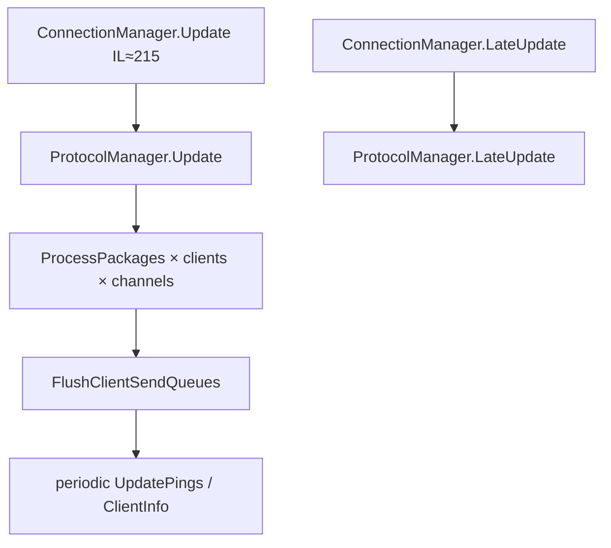
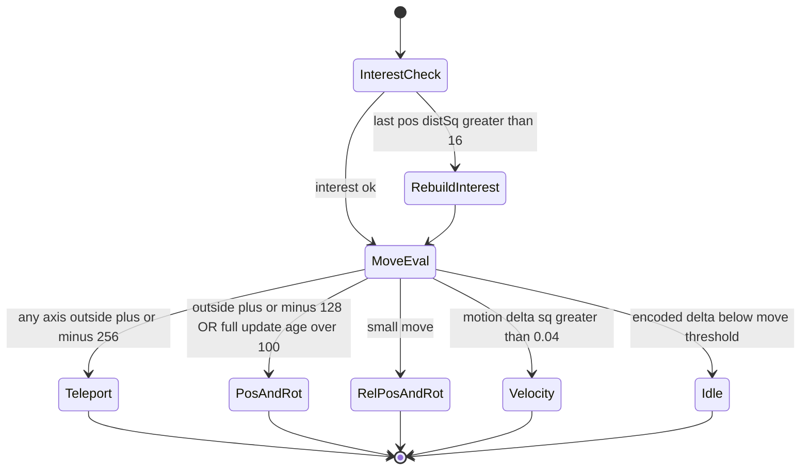

# Dedicated networking (V3.0.1 managed)

**Owns:** ConnectionManager peer pump, NetEntity package bands, NetPackage census.  
**Wire framing / join / golden bodies:** [`protocol.md`](protocol.md).  
**Visual frames:** [`protocol-frames.md`](protocol-frames.md).  
**Companion:** [`closed-gaps.md`](closed-gaps.md) §4 (threshold decode).  
**Ceiling map:** [`engine-limitations.md`](engine-limitations.md) §2-3 (player O(N²), packages).  
**Clone design:** [`zig-clone.md`](zig-clone.md).  
**Loop:** [`loop.md`](loop.md) §6.  
**Dumps:** `il/gaps-v3.0.1/`, `il/dedi-complete-v3.0.1/` §3-4.

---

## 1. Peer pump (not under gmUpdate)



These run as **peer MonoBehaviours** relative to `GameManager.Update` (script order = Unity residual).

---

## 2. Entity replication (from UpdateTick)

Replication runs after `TickEntities` in UpdateTick (`OnUpdateEntities` IL=322, then per-entity `updatePlayerList` IL=509). Package choice is a small state machine over encoded deltas:



Also: `SendChunksToClients` (IL=216) after entity packages.

### Package selection thresholds (decoded IL)

| Condition | Package |
|---|---|
| Interest last-pos distSq &gt; **16** | rebuild interested player list |
| Encoded Δ any axis abs ≥ **2** | consider move package |
| Δ outside ±**256** | `NetPackageEntityTeleport` |
| Else outside ±**128** or full-update age &gt; **100** ticks | `NetPackageEntityPosAndRot` |
| Else small move | `NetPackageEntityRelPosAndRot` / rotation |
| Motion Δ² &gt; **0.04** | velocity package |
| Dirty flags | AliveFlags / PlayerStats / equipment |

Encode helpers: `NetEntityDistributionEntry.EncodePos` / `EncodeRot`.

---

## 3. NetPackage type inventory

Live census: **~196** types named `NetPackage*` (base `NetPackage` or specialized).

Representative dedi-relevant packages (from inventory dump):

| Package | Notes |
|---|---|
| `NetPackageChunk` / `ChunkRemove` / `ChunkRemoveAll` | Terrain streaming |
| `NetPackageEntityTeleport` / `PosAndRot` / `RelPosAndRot` / `Rotation` | Entity motion |
| `NetPackageEntityAliveFlags` | Flags |
| `NetPackageDamageEntity` | Combat |
| `NetPackageDynamicMesh` | Dynamic mesh server |
| `NetPackageEAC` | Anti-cheat envelope (protocol residual) |
| `NetPackageChat` / `ConsoleCmd*` | Admin/chat |
| `NetPackageClientInfo` | Client info / pings path |
| `NetPackagePlayer*` family | Player data |
| Encryption packages | Auth handshake |

Full name list: `research/il/dedi-complete-v3.0.1/DEDI_COMPLETE_auto.md` §3.  
Join + envelope + golden entity package bodies: [protocol.md](protocol.md).

---

## 3b. Join path (summary)

Loadgen-proven against live V3.0.1 dedi:

```text
LiteNet connect → challenge 0xCA+Guid echo → PackageIds (dynamic name→u16)
  → PlayerLogin → PlayerLoginAnswer → PlayerId → RequestToSpawnPlayer → in world
```

Port: LiteNet often **ServerPort+2** (26902). Details and binary layouts: [protocol.md](protocol.md).

---

## 4. Transport stack

| Layer | Managed? | Status |
|---|---|---|
| NetPackage process/serialize | Yes | Inventoried |
| ConnectionManager / ProtocolManager | Yes | Update graphs dumped |
| LiteNetLib **managed** wrappers | Partial type map | Present where named |
| LiteNetLib **native** plugin | No | **Residual** ([`residuals.md`](residuals.md)) |

## 4b. Replication send path (RE 2026-07-18): the O(players×entities) allocation

`NetEntityDistribution.OnUpdateEntities` (IL 322) → per tracked entity
`NetEntityDistributionEntry.updatePlayerList` (IL 509):

- **Broadcast (build-once, send-many):** player-independent state is built once and
  fanned out via `SendToPlayers(NetPackage, channel, ...)` - e.g.
  `Entity.PhysicsMasterSetupBroadcast()` → `SendToPlayers(...)`. This is the
  serialize-once pattern the game *already* uses for physics.
**CORRECTION (RE 2026-07-20):** an earlier draft here claimed the player-independent
packages (`PlayerStats`, `PlayerEquipment`, `EntityAliveFlags`, `PlayerTwitchStats`)
are re-built and re-sent **per player** inside `updatePlayerEntity`. That is **wrong**.
`updatePlayerList` (IL 509) **builds each package once** and fans it out via
`SendToPlayers`, and the player-independent ones are **change-gated**
(`bPlayerStatsChanged` / `bPlayerEquipmentChanged` / `bEntityAliveFlagsChanged`, sent
only on change). So the game already does build-once + broadcast + dirty-flagging -
there is no per-player package-build loop to hoist. `updatePlayerEntity` (IL 222) is
the separate, lighter per-(player,entity) **interest add/remove** pass (distSq +
`HashSet<EntityPlayer>.Contains`, early-return in steady state).

**Where the ~15 MB/s at 128p actually comes from:** the same broadcast package is
enqueued to each recipient connection, and each connection's **writer thread**
(`NetConnectionSimple.taskSerialize`, double-buffered `writerListFilling`/`Processing`)
**serializes it independently** into that connection's byte stream. So it is
serialized N times - but **off the main sim thread** (does not cost `ms_per_tick`)
and it is the **#4** allocator, not #1. A true serialize-once (encode once, memcpy
per connection) needs a thread-safe shared buffer across N writer threads: modest
reward, real risk - deprioritized. The worthwhile network levers are the send-path
scan (shipped, `FastSendPatch`) and a spatial index for the O(N^2) interest all-pairs.
`SendPackage` signature: `ConnectionManager.SendPackage(NetPackage, bool, int, int,
int, Vector3?, int, bool)`.

## 5. See also

| Doc | Why |
|---|---|
| [loop.md](loop.md) | UpdateTick placement of replication |
| [closed-gaps.md](closed-gaps.md) | Threshold decode evidence |
| [measured-scaling.md](measured-scaling.md) | Super-linear player-axis cost |
| [entity-ai.md](entity-ai.md) | What is being replicated |

## Changelog

- **2026-07-18:** Package-band state machine; see also.  
- **2026-07-18:** Network family narrative + package census link.
## Related docs

| Doc | Role |
|---|---|
| [closed-gaps.md](closed-gaps.md) | Distance bands |
| [measured-scaling.md](measured-scaling.md) | Player-axis O(N^2) |
| [loop.md](loop.md) | Frame peers |

## Changelog

- **2026-07-19:** Related docs table.
