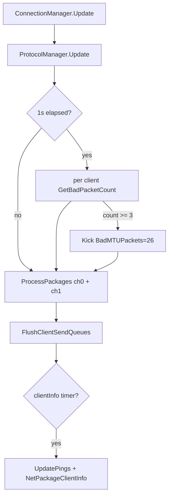
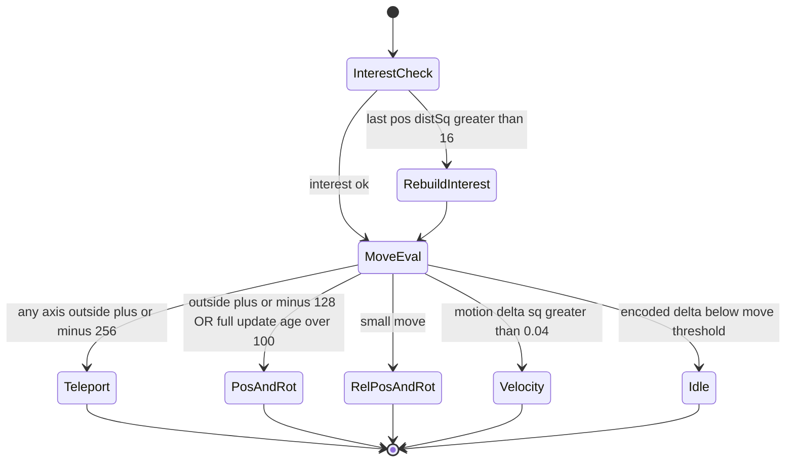
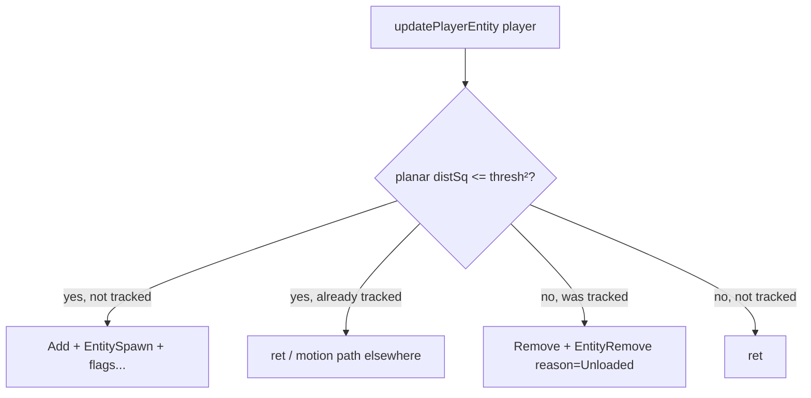
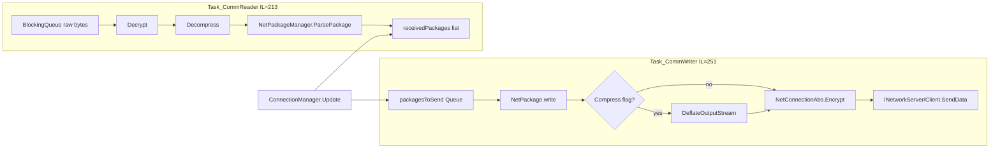

# Dedicated networking (V3.1.0 pin)

**Current pin:** V **3.1.0 (b14)**. Managed net architecture was first RE'd on V3.0.1 and re-checked on the live 3.1.0 assembly. V3.1 wire/join deltas live in topic docs: TE outer wire in [protocol-packages.md](protocol-packages.md) §6.12; PackageIds version minor=10 build=14 in [protocol.md](protocol.md) / loadgen fixtures; GSI / sandbox browser fields in [server-browser-prefabs.md](server-browser-prefabs.md). Hub map: [INDEX.md](INDEX.md) § V3.1.0 shipped delta map. **Hub:** [`INDEX.md`](INDEX.md).


**Owns:** ConnectionManager peer pump, per-connection reader/writer threads, encrypt/compress framing, NetEntity package bands, NetPackage census.  
**Wire framing / join / golden bodies:** [`protocol.md`](protocol.md).  
**Visual frames:** [`protocol-frames.md`](protocol-frames.md).  
**Companion:** [`closed-gaps.md`](closed-gaps.md) §4 (threshold decode).  
**Ceiling map:** [`engine-limitations.md`](engine-limitations.md) §2-3 (player O(N²), packages).  
**Clone design:** [`ZIG_CLONE.md`](../../zdtd-server-server/docs/ZIG_CLONE.md).  
**Loop:** [`loop.md`](loop.md) §6.  
**Dumps:** `il/gaps-v3.1.0/`, `il/dedi-complete-v3.1.0/` §3-4.

---

## 1. Peer pump (not under gmUpdate)


These run as **peer MonoBehaviours** relative to `GameManager.Update`. **Observed order (2026-08-09, runtime probe):** `ConnectionManager.Update` runs **before** `GameManager.Update` every frame (and `ConnectionManager.LateUpdate` before `GameManager.LateUpdate`); see [loop.md](loop.md) §1.1.

`ProtocolManager.Update` / `LateUpdate` (IL=35 each) only walk
`List` of `INetworkServer` and `INetworkClient` calling `Update` /
`LateUpdate` on each transport backend (LiteNet/Steam/etc.). Package
decode/dispatch stays in `ConnectionManager` (section 1.1).

### 1.1 `ConnectionManager.Update` (IL=228, server path)

Verified body order when `IsServer`:

1. `ProtocolManager.Update()`.
2. **Bad-packet scan** at most once per second (`Time.time - lastBadPacketCheck > 1`):
   for each `ClientInfo` with a live channel-0 connection, non-`-1` `entityId`,
   and not already `disconnecting`, if
   `INetworkServer.GetBadPacketCount(cInfo) >= **3**` then
   `GameUtils.KickPlayerForClientInfo` with
   `EKickReason.BadMTUPackets` (**26**), custom reason empty.
3. For each client, `ProcessPackages` on **channel 0** and **channel 1**
   (disallowed direction = `ToClient` / value **2**, i.e. drop packets that are
   only legal server→client).
4. `FlushClientSendQueues()`.
5. When `updateClientInfo` countdown elapses and world exists and
   `ClientCount > 0`: `UpdatePings()`, rebuild/send `NetPackageClientInfo`
   (`Setup(world, clientList)`).

`NetPackageClientInfo.ProcessPackage` (IL=47) applies the payload on the
receiver: for each player id it resolves the `EntityAlive` and writes
`pingToServer = pingTimes[i]`, plus `IsAdmin = admins[i]` for players -
the client's ping/admin display state.

Client (non-server) half of the same method processes `connectionToServer[]`
channels and flushes those queues (same `ProcessPackages` helper).

The LateUpdate hook: `ConnectionManager.LateUpdate` (IL=4) calls
`ProtocolManager.LateUpdate` (IL=35), which fans `LateUpdate()` out to every
registered `INetworkServer` then every `INetworkClient` - the post-frame
network flush, separate from the main `Update` drain.



### 1.2 `ProcessPackages` (IL=116)

Per connection:

1. `INetConnection.GetPackages` into a temp list (null guards log and return).
2. For each package: reject wrong `PackageDirection` (warn); reject
   `!AllowedBeforeAuth` before login (warn); if `ShouldProcess` then
   `ProcessPackage` + `FreePackage`, else `HandleSkipped` (entity hold-back;
   see [dedicated-leftovers.md](dedicated-leftovers.md) §12).

**Decode failure path:** an unknown package id in the incoming stream throws
`NetPackageManager/UnknownNetPackageException` (ctor IL=7, takes the
`packageId`) from the package factory, which is the "malformed or
out-of-version package" error a server logs when a mismatched client sends
an id the server no longer knows.

**NTP clock probe (`ServerDateTimeRequest`):** `GameManager.Awake` starts
`GetNtpTimeAsync(onComplete, "pool.ntp.org", 5000)` (IL=15), which runs
`FetchNtpTimeAsync` (IL=20) on a worker: the async body
(`<FetchNtpTimeAsync>d__1.MoveNext` IL=286) opens a `UdpClient`, sets the
socket `ReceiveTimeout` to the 5000 ms budget, sends the classic 48-byte NTP
request and awaits the reply (`SwapEndianness` IL=29 reverses the NTP
seconds field). The result (`ServerDateTimeResult`: `RequestComplete`,
`HasError`, `SecondsOffset`) is stored, but the only consumer is the client
main menu (`XUiC_MainMenu`), so a dedicated server computes the offset and
never uses it - the probe is dormant on the headless host.

### 1.3 `DisconnectClient` (IL=184, highlights)

Ordered (main-thread only; off-thread hops via `AddSingleTaskMainThread`):

1. Null/missing client guards + stack log.
2. Optional `ClientConnectionAction` callback.
3. **`ModEvents.PlayerDisconnected`**.
4. If `latestPlayerData.bModifiedSinceLastSave`: `PlayerDataFile.Save` by platform id.
5. `INetConnection.Disconnect` (both channels) + `AuthorizationManager.Disconnect`.
6. Resolve player entity: `PartyDisconnect`, `QuestEventManager.HandlePlayerDisconnect`,
   `LockManager.ForceUnlockByPlayer`, disconnect game message.
7. Remove chunk observer / world entity unload (remainder of method).

### 1.4 `SavePlayerData` (IL=91)

`PlayerDataFile.Save` dir+id; async map-chunk DB save task; notify persistent
player list observers; fire **`ModEvents.SavePlayerData`**.

### 1.5 `ConnectionManager.SendPackage` (list overload IL=168)

For each package `RegisterSendQueue`. For each `ClientInfo` with `loginDone`:
filter by attached-to-entity flags (`_onlyClientsAttachedToAnEntity` /
`_onlyClientsNotAttachedToAnEntity` / exclude/include entity ids); optional
`World.IsEntityInRange` for entity-id or world-pos range; enqueue to
`netConnection[package.Channel]`.

**Connection lifecycle leaves:** `AddClient(cInfo)` (IL=32) fires the
`OnClientAdded` delegate, registers the `ClientInfo`, and records the
client-count analytics (`GameSparksCollector.SetMax` keys 16 / 17, the
latter +1 for the local player when not dedicated). `ServerReady` (IL=10)
clears the client list when reconnecting (`IsConnected` already true) and
sets `IsConnected`. `SendToClientsOrServer(package)` (IL=21) is the
direction-neutral helper: server -> broadcast on 192, client ->
`SendToServer`. `EnableNetworkStatistics` / `PrintNetworkStatistics`
(IL=4 each) delegate to `ProtocolManager` (the `net` command surface).
`DisableNetworkStatistics` / `SetLatencySimulation(enable, min, max)` /
`SetPacketLossSimulation(enable, chance)` (IL=4-7) are the same
`ProtocolManager` debug delegation; `get_CurrentMode()` / `get_IsClient()` /
`GetRequiredPortsString()` (IL=4 each) forward to
`ProtocolManager.CurrentMode` / `IsClient` / `GetGamePortsString`.

**Server receive / join handlers:** `Net_DataReceivedServer(cInfo, channel,
data, size)` (IL=14) appends the raw bytes to
`cInfo.netConnection[channel]`'s reader stream (the pump drains it).
`Net_PlayerConnected(cInfo)` (IL=12) logs `[NET] PlayerConnected {0}` and
immediately sends `NetPackagePackageIds.Setup()` on channel 0 (the
package-id mapping is the first packet a joining client gets).
`SendLogin()` (IL=60) ships
`NetPackagePlayerLogin.Setup(GamePref 37 name, (nativeId, authTicket),
(crossId, crossTicket), version, version, discordId)` to the server (the
client-side join identity; the discord id is `DiscordManager.LocalUser.ID`
when ready, else 0). `Net_InvalidPassword()` (IL=16) opens the server
password window (client; saved password prefilled, submit reconnects, cancel
returns to the browser); `Net_ConnectionFailed(message)` (IL=30) logs the
error, shows `mmLblErrorConnectionFailed`, clears `IsConnected` and calls
`AntiCheatClient.DisconnectFromServer`; `Net_DisconnectedFromServer(reason)`
(IL=22) logs, runs `DisconnectFromServer()` and shows
`mmLblErrorConnectionLost`.

**`ProtocolManager` event leaves (all IL-verified):**
`ConnectionFailedEv(msg)` (IL=34) walks `clients` by
`currentConnectionAttemptIndex`: when another `INetworkClient` remains it
tries `clients[idx].Connect(currentGameServerInfo)` (the connect-fallback
chain), else it resets `CurrentMode` / the attempt index / the pending
server info and forwards `ConnectionManager.Net_ConnectionFailed(msg)`.
`DisconnectedFromServerEv(msg)` (IL=7) resets `CurrentMode` and forwards to
`Net_DisconnectedFromServer`; `InvalidPasswordEv()` (IL=9) resets the mode
and pending server info and forwards to `Net_InvalidPassword`.
`ResetNetworkStatistics()` (IL=35) delegates to every client and server;
`get_HasRunningServers()` (IL=3) reads the backing field;
`resetStateLater(delay)` (IL=9) is the delayed state-reset coroutine shell.

---

## 2. Entity replication (from UpdateTick)

Replication runs after `TickEntities` in UpdateTick (`OnUpdateEntities` IL=322, then per-entity `updatePlayerList` IL=509). Package choice is a small state machine over encoded deltas:



Also: `SendChunksToClients` (IL=216) after entity packages: per
`ChunkObserver` sends `ChunkRemove` / `Chunk` (channel 1, compressed) / map
packages to `entityIdToSendChunksTo` (3 first-load packages per tick cap).
Detail: [world-chunks.md](world-chunks.md) section 4.0.
`ChunkManager.AddChunkObserver(pos, buildVisualMesh, viewDim,
entityIdToSendChunksTo)` (IL=15) builds the `ChunkObserver` and appends it to
`m_ObservedEntities`, setting `isInternalForceUpdate`.

### Package selection thresholds (decoded IL)

| Condition | Package |
|---|---|
| Interest last-pos distSq &gt; **16** | rebuild interested player list |
| Encoded Δ any axis abs ≥ **2** | consider move package |
| Δ outside ±**256** | `NetPackageEntityTeleport` |
| Else outside ±**128** or full-update age &gt; **100** ticks | `NetPackageEntityPosAndRot` |
| Else small move | `NetPackageEntityRelPosAndRot` / rotation |
| Motion Δ² &gt; **0.04** | velocity package |
| Dirty flags | AliveFlags / PlayerStats / equipment |

Wire bodies for these packages: [protocol-packages.md](protocol-packages.md)
section 5.5. Decode on client: rel pos uses `serverPos += dPos` then `/32`;
rot decode `(i16 * 360) / 256`.

Encode helpers (verified IL):

| Helper | Formula | Unit |
|---|---|---|
| `EncodePos` | `Vector3i(x*32+0.5, y*32+0.5, z*32+0.5)` | **1/32 block** fixed point |
| `EncodeRot` | `Vector3i(rot * 256 / 360)` | **1/256 turn** (degrees scaled) |

Relative packages carry encoded **deltas** of those integers. Thresholds in the
table above are in that encoded space (e.g. ±256 encoded = ±8 blocks).

**`NetEntityDistributionEntry.SendToPlayers(packet, exclude, inRangeOnly, range)`
(IL=42):** for each `trackedPlayers` except exclude: `SendPackage` to that
entityId; if `inRangeOnly`, range arg is tracked entity id else **-1** (full
flags residual).

### 2.1 `OnUpdateEntities` interest + priority (IL=322)

Server-only each full tick. Entries live in an `IntHashMap` keyed by entity id
(constructed only from `NetEntityDistribution..ctor`).

**Config table (`.ctor` IL=141)** `SEnts(type, distance, updateTicks, motion)`:

| Type | distance | update | motion |
|---|---:|---:|:---:|
| EntityPlayer | int.Max | 3 | 0 |
| EntityVehicle | int.Max | 3 | 0 |
| EntityEnemy | **80** | 3 | 0 |
| EntityNPC | **80** | 3 | 0 |
| EntityItem | **64** | 3 | 0 |
| EntityFallingBlock/Blocks | **120** | 3 | 0 |
| EntityFallingTree | **120** | **1** | 0 |
| EntityAnimalStag | **80** | 3 | 0 |
| EntityAnimalRabbit | **64** | 3 | 0 |
| EntityCar | **100** | 3 | 0 |
| EntitySupplyCrate/Plane | **1200** | 3 | plane motion **1** |
| EntityTurret | **60** | 3 | 0 |
| EntityHomerunGoal | **80** | 3 | 0 |

**`Add(entity)` (IL=66):** for each matching config type call
`Add(e, distance, update, motion)` which creates `NetEntityDistributionEntry`
(cap tracking distance at **46340**), hash+set insert, `updatePlayerEntities` all
players. If entity is player, also `updatePlayerEntity` on every existing entry.

**`Remove(entity, reason)` (IL=48):** if player, strip from every entry's
`trackedPlayers`. Remove hash+set entry; if reason **1** (unload)
`SendUnloadEntityToPlayers` else `SendDestroyEntityToPlayers`.

**`AIDirector.AddEntity` (IL=10):** only `EntityPlayer` → `AddPlayer` (zombies not
registered here).

1. Clear working enemy/player lists; walk distribution entries, bucket tracked
   entities into enemies vs players.
2. Optional **network prioritization** (`GameManager.enableNetworkdPrioritization`):
   for airborne enemies, find nearest player with view-cone filter
   (`Vector3.Angle`, distSq gates **16384** = 128^2); set
   `NetEntityDistributionEntry.priorityLevel`:
   - distSq &lt; **25** (5 m) → priority **0**
   - distSq &gt; **625** (25 m) → priority **3**
   - distSq &gt; **324** (18 m) → priority **2**
   (the range constants: `cHighPriorityRange` 5, `cLowPriorityRange` 18,
   `cLowestPriorityRange` 25, `priorityViewAngleMinDistance` 128; update ticks
   `lowestPriorityTick` 10, `lowPriorityTick` 6, `MobsUpdateTicks` 3)
   - else leave default
3. For each distribution entry: `updatePlayerList(players)` (motion packages).
4. For each player × each entry: `updatePlayerEntity(player)` (interest enter/exit,
   spawn/unload).

`getSpawnPacket` (IL=7): `NetPackageEntitySpawn.Setup(new EntityCreationData(entity, networkWrite=true))`.

Detail on spawn body: [protocol-packages.md](protocol-packages.md) section 5.1.
Placement request path: section 5.0 below is in protocol-packages; server create is
`GameManager.RequestToSpawnEntityServer`.

### 2.2 Interest enter / exit packages (spatial-grid critical)

**Re-pinned V3.1.0 b14** (`NetEntityDistributionEntry.updatePlayerEntity` IL=222).

Per full tick, for each tracked entity entry × each player:

1. Compute planar distSq between the **player** and the entity's last
   `encodedPos` (encoded ints ÷ 32 → block-ish floats; Y ignored in this check).
2. In range when `distSq <= trackingDistanceThreshold²` (unsigned compare pattern
   in IL ends as "inside" branch).

**Enter (was out, now in):**

```text
trackedPlayers.Add(player)
SendPackage(getSpawnPacket(), to player, flags=192)
if tracked is EntityAlive:
  SendPackage(NetPackageEntityAliveFlags.Setup(alive), flags=192)
  if also EntityPlayer:
    NetPackagePlayerStats
    NetPackagePlayerTwitchStats
    NetPackagePlayerEquipment
// always (if avatar present): AvatarController.SyncAnimParameters(playerId)
SendPackage(NetPackageEntitySpeeds.Setup(entity), flags=192)
if shouldSendMotionUpdates:
  SendPackage(NetPackageEntityVelocity.Setup(id, motion, false), flags=192)
```

**Exit (was in, now out) - the package a spatial grid must not skip:**

```text
// IL_0228 when outside threshold AND player still in trackedPlayers:
trackedPlayers.Remove(player)
SendPackage(
  NetPackageEntityRemove.Setup(trackedEntity.entityId, reason=ldc.i4.1),
  to player.entityId, flags=192)
```

`NetPackageEntityRemove.Setup(Int32, EnumRemoveEntityReason)` stores reason as
**u8**. Enum field order on the type (DumpType): `Undef`, `Unloaded`, `Killed`,
`Despawned`, `Captured` → **`ldc.i4.1` = `Unloaded`** (interest unload, not kill).



**Spatial-grid implication:** any interest redesign must emit the same
**`NetPackageEntityRemove` / Unloaded** when a player leaves an entity's set.
Omitting it leaves the client with a ghost entity; using `Killed`/`Despawned`
would play the wrong client teardown.

---

## 3. NetPackage type inventory

Live census (tools/bin/Census.exe): **194** types with the `NetPackage*` name prefix = **193 + `NetPackageManager`**. Of those 193, the **189** in the live id-map are the actual registered wire packages; the remaining **4** are the abstract base `NetPackage`, the abstract intermediate `NetPackageEntityTargeted`, the abstract helper `NetPackageLogger`, and the `NetPackageDirection` enum (verified: 193 - 4 = 189, the map count observed live 2026-08-11). `NetPackageMetrics` is a concrete class and *is* registered.

Representative dedi-relevant packages (from inventory dump):

| Package | Notes |
|---|---|
| `NetPackageChunk` / `ChunkRemove` / `ChunkRemoveAll` | Terrain streaming |
| `NetPackageEntityTeleport` / `PosAndRot` / `RelPosAndRot` / `Rotation` | Entity motion |
| `NetPackageEntityAliveFlags` | Flags |
| `NetPackageDamageEntity` | Combat |
| `NetPackageDynamicMesh` | Dynamic mesh server |
| `NetPackageEAC` | Anti-cheat envelope (protocol residual) |
| `NetPackageChat` / `ConsoleCmd*` | Admin/chat |
| `NetPackageClientInfo` | Client info / pings path |
| `NetPackagePlayer*` family | Player data |
| Encryption packages | Auth handshake |

Full name list: `il/dedi-complete-v3.1.0/DEDI_COMPLETE_auto.md` §3.  
Join + envelope + golden entity package bodies: [protocol.md](protocol.md).

---

## 3a. The `NetPackage` base contract (V3.1.0 b14)

Every wire package derives from `NetPackage`; the base supplies the transport
defaults and the sender-validation helpers every `ProcessPackage` runs
through:

| Member | IL | Base behavior |
|---|---|---|
| `get_Channel()` | 2 | **0** |
| `get_Compress()` | 2 | **false** |
| `get_ReliableDelivery()` | 2 | **true** |
| `get_AllowedBeforeAuth()` | 2 | **false** |
| `get_PackageDirection()` | 2 | **`Both`** (0) |
| `ShouldProcess(world, gm)` | 2 | **true** (always process) |
| `HandleSkipped(world, gm)` | 3 | `NetPackageManager.FreePackage(this)` - the drop path returns the package to the pool |
| `get_PackageId()` | 4 | `NetPackageManager.GetPackageId(GetType())` - the id is derived from the runtime type, never stored |
| `RegisterSendQueue()` / `SendQueueHandled()` | 5 / 7 | `Interlocked` inc/dec of `inSendQueuesCount`; the decrement to **0** calls `FreePackage` - the send-queue refcount keeps a pooled package alive while queued |
| `ToString()` | 14 | cached runtime type name (`classnameCached`) |

**Sender validation (the two guards packages call at the top of
`ProcessPackage`):** `ValidEntityIdForSender(entityId, allowAttachedToEntity)`
(IL=49) is client-side always true; on the server it accepts the id only when
it equals `Sender.entityId`, or - with `allowAttachedToEntity` - when the
sender's `EntityPlayer` is attached to an entity with that id (the rider-slot
case); otherwise it logs `Received {0} with invalid entityId {1} from {2}`
and returns false. `ValidUserIdForSender(userId)` (IL=29) accepts
`Sender.PlatformId` or `Sender.CrossplatformId`, else logs
`Received {0} with invalid userId {1} from {2}`.

**The concrete overrides (all IL=2, per type):**

- **Channel 1** (the big-data channel): `NetPackageChunk`, `ChunkRemove`,
  `MapChunks`, `POIAround`, `WorldFolder`, `DynamicMesh`; everything else
  stays 0.
- **Compress true**: `Chunk`, `ConfigFile`, `IdMapping`, `MapChunks`,
  `POIAround`, `SignDataResponse`, `DynamicClientArrive`, `DynamicMesh`;
  `WorldFolder` and `Localization` explicitly false.
- **ReliableDelivery false** (the per-tick fire-and-forget set):
  `EntityPosAndRot`, `EntityRelPosAndRot`, `EntityRotation`, `EntitySpeeds`,
  `EntityStatsBuff`; every other package keeps the reliable default.
- **AllowedBeforeAuth true** (the whole pre-auth handshake):
  `PlayerLogin`, `PlayerDenied`, `PackageIds`, `KeyExchangeComplete`,
  `EncryptionRequest`, `EncryptionPublicKey`, `EncryptionSharedKey`, `EAC`,
  `AuthState`, `AuthConfirmation`.
- **PackageDirection**: `ToServer` (1) on the client-request set
  (`PlayerLogin`, `PlayerDisconnect`, `RequestToEnterGame`,
  `RequestToSpawnPlayer/Entity`, `PlayerData`, `PlayerInventory`,
  `PlayerInventoryForAI`, `PlayerQuestPositions`, `SignDataRequest`,
  `TraderData`, `QuestEntitySpawn`, `WorldInitInfoRequest`, ...);
  `ToClient` (2) on the server-push set (`WorldTime`, `Weather`,
  `PlayerLoginAnswer`, `PlayerDenied`, `PlayerId`, `PartyData`, ...);
  `Both` (0) only on `WorldFolder` and `PlayerSpawnedInWorld` besides the
  base. The full per-package table is derivable from the dump set; the
  pattern is: requests are client-originated, state pushes are
  server-originated, and the two shared ones are the world-folder stream and
  the spawned-in-world notice.

**Per-type pool (`NetPackageInformation<T>`):** the registry entry
`NetPackageManager` keeps for each package type holds the single template
`instance`, the pooled `TPackage[]` (poolSize / capacity) and the
`ConstructorInfo ctor` used to fill it, plus the profiler `CustomSampler`s
(getSampler / getSamplerPool / getSamplerNew / getSamplerType /
freeSampler / freeSamplerPool / freeSamplerCleanup) - the alloc/free
bookkeeping behind `GetPackage<T>` and `FreePackage`.

**Registry plumbing (`NetPackageManager`):** `AddPackageMapping(id, type)`
(IL=29) fills `packageIdToClass` + `packageClassToPackageId` and resolves
`NetPackageInformation<T>.Instance` (reflection `MakeGenericType`) into
`packageIdToPackageInformation`; `GetPackageName(id)` (IL=5) is the class
`ToString`; `ResetMappings` (IL=7) nulls all three tables;
`getPackageInfoByType(id)` (IL=16) bounds-checks and throws
`UnknownNetPackageException` on a bad id before returning the info (the
decode-failure path of §1.2). `LogStats` (IL=70) prints per-package
`{name}: {n} packages, {bytes} Bytes` from each `GetStats` plus the
totals.

---

## 3b. Join path (summary)

Loadgen-proven against live V3.0.1 dedi:

```text
LiteNet connect → challenge 0xCA+Guid echo → PackageIds (dynamic name→u16)
  → PlayerLogin → PlayerLoginAnswer → PlayerId → RequestToSpawnPlayer → in world
```

Port: LiteNet often **ServerPort+2** (26902). Details and binary layouts: [protocol.md](protocol.md).

---

## 4. Transport stack

| Layer | Managed? | Status |
|---|---|---|
| NetPackage process/serialize | Yes | Inventoried |
| ConnectionManager / ProtocolManager | Yes | Update graphs dumped |
| `NetConnectionAbs` + Simple/Steam | Yes | reader/writer threads, compress, encrypt (this section) |
| `AesEncryptAndMac` (`IEncryptionModule`) | Yes (AES + HMACSHA256) | stream layout below; handshake packages in [protocol-packages.md](protocol-packages.md) §2 |
| LiteNetLib **managed** wrappers | Partial type map | Present where named |
| LiteNetLib.dll internals (managed) | **Yes** | `PacketProperty` ordinals (Cecil-verified): Unreliable=0, Channeled=1, Ack=2, Ping=3, Pong=4, ConnectRequest=5, ConnectAccept=6, Disconnect=7, UnconnectedMessage=8, MtuCheck=9, MtuOk=10, Broadcast=11, Merged=12, ShutdownOk=13, PeerNotFound=14, InvalidProtocol=15, NatMessage=16, Empty=17. zdtd `packet.zig Property` matches | Event machinery + flake root cause closed (§4.0); third-party algo set not re-narrated. `NetConstants.ProtocolId` = **13** (metadata const, Cecil-verified on the game's Managed LiteNetLib.dll); zdtd `packet.zig` pins the same value. Wire-framing consts (same DLL): `HeaderSize` = **1**, `ChanneledHeaderSize` = **4**, `FragmentHeaderSize` = **6**, `FragmentedHeaderTotalSize` = **10**, `MaxSequence` = **32768**, `DefaultWindowSize` = **64**, `SocketBufferSize` = **1048576**. MTU: `PossibleMtu` = **[1024, 1164, 1392, 1404, 1424, 1432]** (RVA-decoded from the `<PrivateImplementationDetails>` token); `InitialMtu` = 1024, `MaxPacketSize` = 1432 (last entry). The game's `InitConfig` (IL=22) does not override the MTU, so stock uses these library defaults. zdtd pins `max_packet_size = 1327` - **diverges from the library's 1432** (flagged in the provenance divergence register) |

**LiteNetLib wrapper leaves:** `NetworkServerLiteNetLib.GetServerPorts`
(IL=9) is `(basePort + 2)/UDP`; `SetServerPassword` (IL=8) stores the
password (null normalizes to empty); `DropClient` (IL=17) runs
`OnPlayerDisconnected(peerConnectId)` then
`server.DisconnectPeer(peer, disconnectFromClientSide)`;
`OnPlayerDisconnected` (IL=11) maps the peer id through
`Clients.ForLiteNetPeer` to `ConnectionManager.Net_PlayerDisconnected`.
`NetworkClientLiteNetLib.OnPeerConnectedEvent` (IL=35) marks the client
connected, stores `serverPeer`, and installs the two
`NetConnectionSimple` channel connections via
`ConnectionManager.SetConnectionToServer`; `OnDisconnectedFromServer`
(IL=100) reads the disconnect cause/`DisconnectInfo` payload (pooled
bytes) and posts the localized `DisconnectLiteNetLib` message on the main
thread.

**LiteNetLib auth wrapper:** `NetworkServerLiteNetLib/
LiteNetLibAuthWrapperServer.ConnectionRequestCheck` (IL=86) rate-limits
per IP (**500 ms** window, `Limiting connect rate from that IP!`), rejects
when a connection from the same IP is already being processed, checks the
peer's string against `serverPassword` (`rejectInvalidPassword`), else
`Accept`. Its `OnNetworkReceiveEvent` (IL=134) gates the pre-auth state: a
17-byte challenge reply (header **202** + 16-byte `Guid`) that does not
match the issued challenge disconnects the peer; a match advances the
state and fires `PeerConnectedEvent`. The client wrapper echoes the 202
challenge back (`OnNetworkReceiveEvent` IL=36) and forwards disconnect
events to `OnDisconnectedFromServer` (IL=6).
`NetworkCommonLiteNetLib.CreateRejectMessage(text)` (IL=27) builds the
reject payload (`0xFF` header + UTF8 length byte + text).

### 4.0 LiteNetLib join-churn flake: root cause (2026-08-10, IL + runtime)

The join flake that blocked live multi-bot validation is a **stock managed
concurrency bug**, not a native transport defect:

1. `NetworkCommonLiteNetLib.InitConfig` (IL=22) sets **`UnsyncedEvents =
   true`** on the NetManager (plus `UnsyncedDeliveryEvent`/`UnsyncedReceiveEvent`
   true, `AutoRecycle` true, and `UseNativeSockets` on dedicated).
2. With `UnsyncedEvents=true`, `LiteNetLib.NetManager.CreateEvent` takes the
   `ldloc.1; brtrue.s → ProcessEvent` branch (IL_00ce-IL_00e0) and dispatches
   the event **inline on the socket-receive thread** (no `_eventLock` queue, no
   main-thread hand-off).
3. Inline dispatch reaches the game listener `OnConnectionRequest` →
   `NetworkServerLiteNetLib/LiteNetLibAuthWrapperServer.ConnectionRequestCheck`
   (IL=86), which at IL_006e-007d reads `ConnectionManager.Clients.List` (a
   `ReadOnlyCollection<ClientInfo>` over the live `ClientInfoCollection.list`)
   and **enumerates it** (`GetEnumerator`/`get_Current`/`MoveNext`,
   IL_007d-00cb) to reject duplicate in-flight IPs.
4. The main thread mutates that same list concurrently during join churn
   (`Clients.Add` on login, remove on disconnect), so the receive-thread
   enumeration throws `InvalidOperationException: Collection was modified`.
   The exception escapes `CreateEvent` on the receive thread, dropping the
   packets being processed and cascading into `RemoteConnectionClose` for the
   affected clients.

Runtime evidence (2026-08-10, 16-28 bot churn on stock V3.1.0 dedi): repeated
`NET: LiteNetLib: Client disconnect ... (RemoteConnectionClose)` bursts and
`Failed writing first package` warnings, with a second stock bug also firing
under churn (`NetPackageMinEventFire.write` NRE when `itemValue` is null on the
ItemEvent path, IL_0041 - see §6.23). The LiteNetLib event machinery itself
(`CreateEvent` pool pop + pending-list push, `PollEvents` drain) is
`_eventLock`-guarded and race-free; the race is the **game's receive-thread
enumeration of a main-thread-mutated collection**.

Fix direction (not stock): run `ConnectionRequestCheck`'s client-list scan on
the main thread (post the duplicate-IP check via a queue / `PollEvents`), or
copy the IP set under lock before enumeration. This is a stock RE finding;
the optimizer/loadgen repos consume it as the blocker for >12-bot cohorts.
**Validated workaround (2026-08-10, loadgen):** staggering joins
with `--ramp-ms 3000` avoids the race entirely (0 `Collection was modified`, ~0
drops over 4 min vs 302 `RemoteConnectionClose` non-ramped); a second run at
`--ramp-ms 2500` also showed **0 race exceptions** (the residual
`RemoteConnectionClose` there was loadgen bots drowning in Navezgane's spawn
lake + rejoin churn, not the race). The
`NetPackageMinEventFire` null-itemValue NRE (§6.23) is pacing-independent and
still fires under zombie-cop explosions.

### 4.1 Connection hierarchy

```text
NetConnectionAbs
  ├─ NetConnectionSimple   // UNET-style / generic INetworkClient path
  └─ NetConnectionSteam    // Steam / platform path used on stock dedi often
```

Both start **two worker threads** in the ctor (`ThreadManager.StartThread`):

| Impl | Reader thread name | Writer thread name | Inbound queue | Outbound queue |
|---|---|---|---|---|
| Steam | `NCSteam_Reader_*` | `NCSteam_Writer_*` | `BlockingQueue<ArrayListMP<byte>>` | `Queue<NetPackage>` + `ManualResetEvent` |
| Simple | `NCS_Reader_*` | `NCS_Writer_*` | `Queue<RecvBuffer>` | double-buffer lists `writerListFilling` / `writerListProcessing` |

`InitStreams` (Steam IL=131, Simple IL=190) allocates large memory streams (capacity literal **2097152**) plus Deflate zip streams and pooled binary writers/readers. Copy buffers are **4096** bytes.

**Send/queue leaves:** `NetConnectionAbs.FlushSendQueue` is an IL=1 no-op
base; `IsDisconnected` (IL=4) reads the volatile `bDisconnected`.
`NetConnectionSimple.FlushSendQueue` (IL=19) wakes the writer thread
(Monitor-locked `writerTriggerEvent.Set`); `SendBuffers` (IL=22) drains
the reliable queue first then the unreliable one via
`sendBuffersFromQueue` (IL=63), which pops the head buffer, splits it when
it exceeds `maxPacketSize`, routes it server-side (`cInfo.network.
SendData(cInfo, channel, buf, reliable)`) or client-side
(`netClient.SendData(channel, buf)`), and re-queues the buffer at the
front when the send errors - the retry loop.

`ConnectionManager.Update` (IL=228, peer MB) drains each connection via `GetPackages` → `ProcessPackages` (IL=116) and flushes send queues. Xref: `ProcessPackages` is only called from that Update path (4 sites).

**Server bring-up (`ProtocolManager`):** `SetupProtocols` (IL=128) builds the
`servers` / `clients` lists once: it parses `GamePrefs` 144
(`ServerDisabledNetworkProtocols`, comma-separated) plus the launch-arg
overrides (`nounet` -> `unet`, `noraknet` -> `raknet`,
`nolitenetlib` -> `litenetlib`), adds `NetworkServerLiteNetLib` /
`NetworkClientLiteNetLib` unless disabled, then the native platform
networking and every server-only `ServerPlatforms` entry.
`StartServers(password)` (IL=106) gates on the platform user status +
`IsMultiplayerAllowed` / `CanHostMultiplayer` (falling back to
`StartOfflineServer`), validates `ServerPort` (GamePrefs 18) within
1024..65530 (error code 74 otherwise), starts each server on the port,
and on any `NetworkConnectionError` stops them all and resets the mode.
`StopServersOnly` (IL=22) stops every server; `MakeServerOffline` (IL=11)
does the same from online mode (2) and switches to mode 3.

### 4.2 Steam path (`NetConnectionSteam`)



**Writer order (verified):** package body write → optional compress (`NetPackage.Compress`) → `Encrypt` → stats (`RegisterSentPackage` / `RegisterSentData`) → platform `SendData` with `ReliableDelivery` flag → `SendQueueHandled`.

**Reader order (verified):** wait on trigger → dequeue raw buffer → stats received data → optional `Decrypt` → optional `Decompress` → `ParsePackage` → lock + append `receivedPackages`. Unknown package id logs and drops.

`AddToSendQueue` enqueues under monitor and `Set`s the writer event. `AppendToReaderStream` is what the platform receive callback uses to feed the reader queue.

### 4.3 Simple path (`NetConnectionSimple`)

Heavier framing and batching (this is the path named in the O(N) serialize note below).

**Serialize (`taskSerialize` IL=392):**

1. Wait on writer event (timeout **500** ms appears in backoff paths).
2. Swap filling/processing package lists under lock.
3. Batch packages into reliable vs unreliable streams via `WriteToStream` (IL=435): writes **Int32** length prefix, `NetPackage.write`, rewrites length, registers stats, may requeue on failure. **Write-failure recovery (IL_037E-IL_0400):** a `write()` exception is caught per package - `Log.Exception`, then warning `Failed writing first package: <type> of size <len>. <N> remaining packages in queue.`, then `package.SendQueueHandled()` (`NetPackage` IL=7: interlocked decrement + `FreePackage`) and the loop continues with the rest of the queue. So a single bad package (e.g. `NetPackageMinEventFire` null `itemValue`, §6.23) is dropped without killing the connection.
4. `StreamToBuffer` (IL=194): compress (optional) → encrypt → build wire buffer with header fields written as `Int32` + two `Byte` flags + `UInt16` + payload copy.
5. `sendBuffersFromQueue` / `splitSendBuffer` respect `maxPacketSize` / `INetworkServer.GetMaximumPacketSize`.

**Deserialize (`taskDeserialize` IL=437):**

1. Dequeue `RecvBuffer`.
2. Read framed header (`ReadInt32` size, flag bytes, `UInt16`).
3. Decrypt → decompress → loop `ParsePackage` until stream consumed.
4. Size mismatch between parsed and expected length is logged; packages still registered in stats.

Double-buffer detail: main/sim thread only touches `writerListFilling`; the writer thread drains `writerListProcessing`. That is why broadcast packages are still **serialized once per connection** off the sim thread.

### 4.4 Encrypt / compress module (`NetConnectionAbs`)

| Method | IL | Behavior |
|---|---:|---|
| `Compress` | 59 | copy uncompressed → `DeflateOutputStream.Restart` + write; fails if compressed capacity too small |
| `Decompress` | 22 | `DeflateInputStream.Restart` + copy into target |
| `EnableEncryptData` | 12 | gate used by send path once module armed |
| `ExpectEncryptedData` | 14 | gate used by recv path after login |
| `Encrypt` | 16 | if enabled, `IEncryptionModule.EncryptStream(cInfo, stream)` |
| `Decrypt` | 65 | if expecting encryption and packet unmarked encrypted: **drop** with log `Client logged in but sent unencrypted message`; else `DecryptStream` |
| `SetEncryptionModule` | 4 | install per-client module (from handshake) |

**Send transform order:** package bytes → **compress** → **encrypt**.  
**Recv transform order:** raw → **decrypt** → **decompress** → parse.

### 4.5 `AesEncryptAndMac` stream layout (managed)

Implements `IEncryptionModule` for the post-handshake session (constructed in `AntiCheatEncryptionAuthServer.SendSharedKey` with the two key blobs from `NetPackageEncryptionSharedKey`; see [dedicated-leftovers.md](dedicated-leftovers.md) §7 and [protocol-packages.md](protocol-packages.md) §2).

| Direction | IL | Layout / steps |
|---|---:|---|
| `EncryptStream` | 102 | under lock: random IV via `RandomNumberGenerator` → write IV → write payload length → AES transform of plaintext → write ciphertext → HMAC over protected region → rewrite stream with MAC+body |
| `DecryptStream` | 148 | under lock: read IV / lengths → HMAC verify (fail logs `MAC did not match` / length mismatch) → AES decrypt into stream |

Uses `System.Security.Cryptography.Aes` + `HMAC` (integrity key). **Not** a native cipher residual anymore for the session transform; what remains residual is anything below this managed module (platform transport, and any OS crypto providers Aes may call).

### 4.6 Stats

`NetConnectionStatistics` (on every connection): volatile byte/package counters, per-type histograms, `RingBuffer` of recent packages, and `GetStats(interval, ...)` derived rates. Writer/reader paths call `RegisterSent*` / `RegisterReceived*` around each package and bulk buffer.

## 4b. Replication send path (RE 2026-07-18): the O(players×entities) allocation

`NetEntityDistribution.OnUpdateEntities` (IL 322) → per tracked entity
`NetEntityDistributionEntry.updatePlayerList` (IL 509):

- **Broadcast (build-once, send-many):** player-independent state is built once and
  fanned out via `SendToPlayers(NetPackage, channel, ...)` - e.g.
  `Entity.PhysicsMasterSetupBroadcast()` → `SendToPlayers(...)`. This is the
  serialize-once pattern the game *already* uses for physics.
**CORRECTION (RE 2026-07-20):** an earlier draft here claimed the player-independent
packages (`PlayerStats`, `PlayerEquipment`, `EntityAliveFlags`, `PlayerTwitchStats`)
are re-built and re-sent **per player** inside `updatePlayerEntity`. That is **wrong**.
`updatePlayerList` (IL 509) **builds each package once** and fans it out via
`SendToPlayers`, and the player-independent ones are **change-gated**
(`bPlayerStatsChanged` / `bPlayerEquipmentChanged` / `bEntityAliveFlagsChanged`, sent
only on change). So the game already does build-once + broadcast + dirty-flagging -
there is no per-player package-build loop to hoist. `updatePlayerEntity` (IL 222) is
the separate, lighter per-(player,entity) **interest add/remove** pass (distSq +
`HashSet<EntityPlayer>.Contains`, early-return in steady state).

**How broadcast serialization scales (RE fact):** the same broadcast package is
enqueued to each recipient connection, and each connection's **writer thread**
(`NetConnectionSimple.taskSerialize`, double-buffered `writerListFilling`/`Processing`)
**serializes it independently** into that connection's byte stream. So it is
serialized N times, but **off the main sim thread** (does not cost `ms_per_tick`).
A serialize-once (encode once, memcpy per connection) would need a thread-safe
shared buffer across N writer threads. `SendPackage` signature:
`ConnectionManager.SendPackage(NetPackage, bool, int, int, int, Vector3?, int, bool)`.

The measured egress share (bytes/s at load), the allocator ranking, and whether
any of this is worth a lever are optimizer-owned measurements/decisions:
[`measured-scaling.md`](../../7dtd-server-optimizer/docs/measured-scaling.md),
[`bottlenecks.md`](../../7dtd-server-optimizer/docs/bottlenecks.md).

## 4c. Package registry, direction gate, per-package channel/compress/reliability (2026-08-06)

Status: **verified** against a full V3.1.0 b14 disassembly (2026-08-05 dump; line
numbers are from that dump; the tracked `il/` sets are the V3.1.0 corpus). Note LiteNetLib itself is a
separate assembly and is **not** in the dump (only `.assembly extern LiteNetLib`),
so nothing below covers LiteNet's own framing.

### Registry and the id map

`NetPackageManager.knownPackageTypes` is a `CaseInsensitiveStringDictionary` filled
by reflection over every **concrete** subclass of `NetPackage`, keyed on
`MemberInfo.Name` (805088-805100, 805117-805140). Abstract types are excluded
because `ReflectionHelpers.FindTypesImplementingBase` defaults `_allowAbstract` to
false (2133289-2133345, `.param [3] = bool(false)`). The concrete count for V3.1.0
b14 is exactly **189**; the three abstract ones are `NetPackage`,
`NetPackageEntityTargeted` and `DynamicMeshServerData`. Nested packages register
under their **short** name, so `Audio.NetPackageAudio` and
`DroneWeapons/NetPackageDroneParticleEffect` are valid map entries.

`SetupBaseMapping` (805194-805270) always pins `packageIdsType` to id 0 and
`StartServer` numbers the rest from 1. `IdMappingsReceived` (805272-805340): any
name in the server's mapping array that is not in `knownPackageTypes` logs
`[NET] Unknown package type ..., can not proceed connecting to server`, calls
`ConnectionManager.Disconnect()` and `ShowMessagePlayerDenied` with EKickReason 18.

`NetPackageManager.GetPackageId` does an unguarded `Dictionary get_Item`
(805413-805421), so a client trying to send a package the server omitted from the
map throws `KeyNotFoundException` rather than failing gracefully.

`NetPackagePackageIds.read` (828487-828545): `VersionInformation.Read` |
`i32 toSendCount` | count x `ReadString` | `bool serverUseEAC` |
`bool hasHostUserAndToken` | when hasHost: `PlatformUserIdentifierAbs.FromStream` +
`ReadString` token.

Full `EKickReason` enum, 30 values (1921854-1921883). Notable:
`VersionMismatch=4, PlayerLimitExceeded=5, Banned=6, NotOnWhitelist=7,
GameStillLoading=14, UnknownNetPackage=18, BadMTUPackets=26,
InternalNetConnectionError=28`.

### The direction gate

`ConnectionManager::ProcessPackages(INetConnection, NetPackageDirection _disallowed,
ClientInfo _sender)` (787230-787381) drops any package whose direction equals the
disallowed argument and logs
`[NET] Received package {0} which is only allowed to be sent to the server` (or
`...to clients from client {1}`). The client passes `ToServer` (ldc.i4.1,
787103-787107) for its `connectionToServer`; the server passes `ToClient`
(ldc.i4.2, 786994-787009). `NetPackageDirection` is `Both=0, ToServer=1,
ToClient=2` (803963-803970). `NetPackage`'s base `get_PackageDirection` returns 0 =
Both (804011-804018), so any package without an override is legal in both
directions.

Base virtuals worth recording (803972-804060): `get_Channel` (0), `get_Compress`
(false), `get_FlushQueue` (false), `get_PackageDirection` (Both),
`get_AllowedBeforeAuth` (false), `get_PackageId` via
`NetPackageManager.GetPackageId(GetType())`.

### Per-package overrides

**Delivery method is per package, not per connection.** `get_ReliableDelivery`
defaults to true and is overridden to **false** by exactly five classes:
`EntityPosAndRot` (816202-816208), `EntityRelPosAndRot` (816966-817238),
`EntityRotation` (817367-817644), `EntitySpeeds` (818303-818471) and
`EntityStatsBuff` (202136-202413). `NetConnectionAbs` passes that flag to
`INetworkServer.SendData` (793041-793050), and
`NetworkServerLiteNetLib.SendData` maps it to DeliveryMethod 2 (ReliableOrdered) or
4 (Unreliable) on channelNumber 0 (854255-854262).

**Compression** via `get_Compress() == true`: `NetPackageChunk` (808641),
`ConfigFile` (809975), `DynamicClientArrive` (347114), `DynamicMesh` (373452),
`IdMapping` (822370), `MapChunks` (826004), `POIAround` (833771) and
`SignDataResponse` (841321); false everywhere else.

**Second envelope stream** via `get_Channel() == 1`: `NetPackageChunk` (808632),
`ChunkRemove`, `DynamicMesh`, `MapChunks` (826004) and `POIAround` (833771). All
other packages are channel 0.

### Auth wrapper and connect limits

`NetworkServerLiteNetLib.LiteNetLibAuthWrapperServer` constants:
`ConnectionRateLimitMilliseconds = 0x1F4` (500 ms) and
`ChallengePackageSize = 0x11` (17) as literals at 852993-852999; the static ctor
sets `ConnectionStateCheckInterval = TimeSpan.FromSeconds(10)` and
`MaxDurationInAuthState = new TimeSpan(0,0,0,10)` at 853692-853711. The
per-connection challenge is `Guid.NewGuid()` (853010-853025).

`NetworkCommonLiteNetLib.InitConfig` (852856-852884) is the only place `NetManager`
is tuned: `UnsyncedEvents`, `UnsyncedDeliveryEvent`, `UnsyncedReceiveEvent`,
`AutoRecycle` and `DisconnectOnUnreachable` are all set true, and
`UseNativeSockets` only when `IsDedicatedServer`. No DisconnectTimeout,
PingInterval, MTU or channel-count override is set, so LiteNetLib defaults apply.

`NetworkClientLiteNetLib.Connect` calls `NetManager.Connect(ip, port + 2, key)`
(852360-852368, `ldc.i4.2` / `add`), confirming the info-TCP-port + 2 rule for the
UDP endpoint, and passes the ServerPassword as the LiteNet connect key.

### Login body

`NetPackagePlayerLogin` (read 832130-832182, write 832185-832275, GetLength = 120):

```text
playerName:string
platformUser        via PlatformUserIdentifierAbs.ToStream(inclCustomData = true)
platformToken:string
crossplatformUser
crossplatformToken:string
version:string
compVersion:string
discordUserId:u64
```

`PlatformUserIdentifierExtensions.ToStream(BinaryWriter, inclCustomData)`
(31206-31248): a null identifier writes a single 0 byte; otherwise byte 1, byte 1,
then `Write(PlatformIdentifierString)`, `Write(ReadablePlatformUserIdentifier)`,
then `WriteCustomData` when `inclCustomData` is set. `GetToStreamLength` mirrors it
(31250-31285).

### Server browser: the version string is a strict four-field format

`VersionInformation.SerializableString` is
`String.Format("{0}.{1}.{2}.{3}", ReleaseType, Major, Minor, Build)`
(2009306-2009320), and `GameServerInfo` sets `GameInfoString.ServerVersion` (key 9)
to exactly that (795818-795822). For V3.1.0 b14 the correct GSI value is
**`V.3.10.14`** (Constants `cReleaseType=1`/'V', `cVersionMajor=3`,
`cVersionMinor=0xA`, `cVersionBuild=0xE`, 1865686-1865690).

`VersionInformation.TryParseSerializedString` (2009539-2009625) requires
`Split('.')` to yield exactly 4 fields: an `EGameReleaseType` enum name, then three
ints. `EGameReleaseType` has only `Alpha=0` and `V=1` (2008981-2008982).

The **displayed** minor is an encoding, not the wire minor: for `ReleaseType == V`
and `Major >= 3` the ctor splits `Minor` into `Minor/10` and `Minor%10`
(2009148-2009157), so "V 3.1.0 (b14)" is Major=3, Minor=10, Build=14.

A malformed version string is not fatal: `GameServerInfo`'s ctor seeds
`version = new VersionInformation(Alpha, -1, -1, -1)` (793967-793971), and
`get_IsCompatibleVersion` returns true whenever `Major < 0` (793930-793950). The
browser row simply shows no version.

### Login version gate: LongStringNoBuild vs compatibilityVersion

The **client** sends the same value for both `version` and `compVersion` in
`NetPackagePlayerLogin`: `Constants.cVersionInformation.LongStringNoBuild`
(ConnectionManager 190595-ish: two `ldfld VersionInformation::LongStringNoBuild`
immediately before `NetPackagePlayerLogin::Setup`). `LongStringNoBuild` is
`String.Format("{0} {1}.{2}", ReleaseType, Major, Minor)` with the **raw**
`Minor` (VersionInformation `ldstr {0} {1}.{2}` at IL_00BE), so for V3.1.0 b14
it is **`V 3.10`** - NOT the display form "V 3.1.0" (Minor/10-Minor%10 split is
only the display path).

The **server** compares the client's `compVersion` (stored as
`ClientInfo.compatibilityVersion`) against its own `LongStringNoBuild` with
`String.Equals(..., OrdinalIgnoreCase)` in `VersionAuthorizer`; a mismatch
returns `KickPlayerData(EKickReason.VersionMismatch=4, ...)` which becomes a
`NetPackagePlayerDenied`. So a strict `compVersion == "V 3.10"` (case-insensitive)
check is the stock gate; zdtd mirrors it (`version.zig` `stock_wire_comp`).

EMPIRICAL CORRECTION (2026-08-22, live stock V3.1.0 b14 dedicated): the
authorizer in the shipped binary **accepts the display form "V 3.1.0" and
kicks "V 3.10"** with VersionMismatch=4 - the opposite of the IL-only reading
above. A loadgen login switched to "V 3.10" (commit b5c3069) failed every
join; reverting to "V 3.1.0" restored 16/16 PASS. The stock
`cVersionInformation.LongStringNoBuild` evidently evaluates to the display
form in practice (the IL shows the format, not the runtime constant value).
Re-verified 2026-08-23 with a live V3.1.0 b14 client: it sends compVersion
"V 3.1.0" (zdtd server logged it verbatim); zdtd previously expected the
IL-reading "V 3.10" and kicked the real client with VersionMismatch=4 until
the gate was switched to "V 3.1.0" (`zdtd src/version.zig` `stock_wire_comp`),
after which the client joined and spawned normally.

`GameInfoString` has 20 members (796457-796476), including `SandboxPreset = 0x12`
and `SandboxCode = 0x13`, which is where V3.1.0 keeps the difficulty/loot/XP
preset that used to be individual serverconfig properties. The shipped V3.1.0
`serverconfig.xml` has 69 `<property>` names and no longer contains
`GameDifficulty`, `BloodMoonFrequency`, `DayNightLength`, `XPMultiplier`,
`LootAbundance`, `BlockDamage*`, `DropOnDeath`, `AirDropFrequency` or
`Zombie*Move`; those are folded into `SandboxCode` (default
`AAAJABJACJADJARFBNC`, Adventurer).

### Console surface

`Constants.cDefaultUserPermissionLevel = 0x3E8` (1000) and
`cMaxMPPlayers = cMaxCrossplayMPPlayers = 8` (1865697-1865701).
`ConsoleCmdAbstract` exposes `get_DefaultPermissionLevel`, `get_IsExecuteOnClient`,
`get_AllowedInMainMenu` and `get_AllowedDeviceTypes` (204226-204320); there are
**191** concrete `getCommands()` overrides exposing **283** command aliases.

---

### 4.6 LiteNetLib transport algorithms (reliability / flow / MTU) (closed 2026-08-12)

Dumped from the game's shipped `LiteNetLib.dll` (managed; 138 types). This
closes the "third-party algo set not re-narrated" note in
[residuals.md](residuals.md): the transport algorithms the dedicated server
actually runs.

**Reliability (`ReliableChannel`, IL per method):** a **64-packet sliding
window** (`_windowSize = 64` = `NetConstants.DefaultWindowSize`) over a
**32768**-wide sequence space (`NetConstants.MaxSequence`; `_localSeqence =
(seq + 1) % 32768`). Sender stores each in-flight packet in a
`PendingPacket[64]` ring (slot `seq % 64`) with a send timestamp, and stops
once `RelativeSequenceNumber(_localSeqence, _localWindowStart) >= 64` - this
window bound is the flow control ("congestion" in the old residual wording);
LiteNetLib has **no AIMD / TCP-style congestion window**, it is a fixed 64
window plus a resend timer. **Retransmit:** `PendingPacket.TrySend` (IL=34)
resends when `now - _timeStamp >= _resendDelay * 10000` (ticks; the ctor
default `_resendDelay = 27` ms); `SendNextPackets` (IL=147) sweeps the window
calling `TrySend` per slot. **Acks:** `ProcessAck` (IL=126) matches an Ack
packet against `_outgoingAcks` (an `Ack` NetPacket sized
`2 + (64 - 1) / 8 + 2` bytes = a 64-bit sliding-window bitmap), validates
`seq < 32768` and inside-window, then frees the acked pending slots; the
`_mustSendAcks` flag flushes it via `Peer.SendUserData`. **Ordered receive:**
`_receivedPackets[64]` reorders by `_remoteSequence` (unreliable-ordered is
`_earlyReceived[64]` marks instead). `SequencedChannel` is the keep-latest
delivery with a `_reliable` variant (own `_ackPacket` + `_lastPacketSendTime`).
`NetworkSorter` is NOT packet ordering - it ranks `NetworkInterface`s by type
(237/243/244) for interface selection; do not read it as the channel sorter.

**MTU (`NetPeer`, IL per method):** `NetConstants.PossibleMtu` =
`[1024, 1164, 1392, 1404, 1424, 1432]` (cctor: `InitialMtu = PossibleMtu[0] =
1024`, `MaxPacketSize = PossibleMtu[last] = 1432`, `MaxUnreliableDataSize =
1431`). `SetMtu(idx)` (IL=13) does `_mtu = PossibleMtu[_mtuIdx] -
ExtraPacketSizeForLayer`. Discovery (`UpdateMtuLogic` IL=98): every
`_mtuCheckTimer >= 1000` ms it increments `_mtuCheckAttempts` and probes the
next size with `MtuCheck`/`MtuOk` packets, stopping on `_finishMtu`.
`ResetMtu` (IL=22): if `NetManager.MtuDiscovery` is off it finishes
immediately; if `MtuOverride > 0` it overrides, else `SetMtu(0)` (1024).
The game's `InitConfig` (IL=22) sets neither, so the stock dedicated runs the
discovery loop from 1024 up to 1432 minus the layer overhead.

---

## 5. See also

| Doc | Why |
|---|---|
| [loop.md](loop.md) | UpdateTick placement of replication; frame peers |
| [closed-gaps.md](closed-gaps.md) | Distance-band threshold decode evidence |
| [entity-ai.md](entity-ai.md) | What is being replicated |
| [measured-scaling.md](../../7dtd-server-optimizer/docs/measured-scaling.md) | Super-linear player-axis cost (optimizer) |
| [protocol-packages.md](protocol-packages.md) | Encryption handshake package bodies |
| [dedicated-leftovers.md](dedicated-leftovers.md) | AesEncryptAndMac install from SendSharedKey |

**Catalogued-leaf index (narrated for the coverage census):**

| Leaf | base | key methods |
|---|---|---|
| `ClientInfoCollection` | Object | GetForPlayerName, ForUserId, Remove, ForLiteNetPeer |
| `NetPackageAudio` |  |  |
| `NetPackageDroneParticleEffect` |  |  |
| `NetPackageEntityLookAt` | NetPackageEntityTargeted | ProcessPackage, write, read, Setup |
| `NetPackageEntitySpawnResponse` | NetPackage | ProcessPackage, write, read, Setup |
| `NetPackageLight` |  |  |

**Server-relevant classified leaves (re-narrated for the coverage census):**

| Leaf | base | key methods |
|---|---|---|
| `ConnectionInformation` | Object |  |
| `ConnectionInformation` | Object |  |

## Changelog

- **2026-08-11:** NetConstants.ProtocolId pinned 13 (Cecil-verified on the game's Managed LiteNetLib.dll).
- **2026-08-11:** Added canonical `**Hub:** INDEX.md` backlink (was prose "Hub map:" only).
- **2026-08-11:** Transport IL re-verified: InitConfig IL=22, InitStreams Steam IL=131 / Simple IL=190, NetConnectionAbs.FlushSendQueue IL=1 / IsDisconnected IL=4, NetConnectionSimple.FlushSendQueue IL=19 / SendBuffers IL=22 / sendBuffersFromQueue IL=63, SetupProtocols IL=128, StartServers IL=106, StopServersOnly IL=22, MakeServerOffline IL=11, SendQueueHandled IL=7, Task_CommWriter IL=251 / Task_CommReader IL=213, taskSerialize IL=392 / taskDeserialize IL=437, WriteToStream IL=435, StreamToBuffer IL=194 (exact).
- **2026-08-11:** Distribution IL re-verified: OnUpdateEntities IL=322, NetEntityDistribution ctor IL=141, Add(entity) IL=66, Remove(entity,reason) IL=48, SendToPlayers IL=42, getSpawnPacket IL=7, updatePlayerEntity IL=222, SendChunksToClients IL=216, ChunkManager.AddChunkObserver IL=15 (exact).
- **2026-08-11:** Validation/package-manager IL re-verified: ValidEntityIdForSender IL=49, ValidUserIdForSender IL=29, AddPackageMapping IL=29, GetPackageName IL=5, ResetMappings IL=7, getPackageInfoByType IL=16, LogStats IL=70 (exact).
- **2026-08-11:** LiteNetLib wrapper IL re-verified: GetServerPorts IL=9, SetServerPassword IL=8, DropClient IL=17, OnPlayerDisconnected IL=11, OnPeerConnectedEvent IL=35, OnDisconnectedFromServer IL=100, ConnectionRequestCheck IL=86, OnNetworkReceiveEvent IL=134 (server) / IL=36 (client wrapper), wrapper disconnect event IL=6, CreateRejectMessage IL=27 (exact).
- **2026-08-11:** ConnectionManager IL re-verified: Update IL=228, LateUpdate IL=4, ProcessPackages IL=116, DisconnectClient IL=184, SavePlayerData IL=91 (GameManager), SendPackage(list) IL=168, AddClient IL=32, ServerReady IL=10, SendToClientsOrServer IL=21, Enable/Disable/PrintNetworkStatistics IL=4, SetLatencySimulation IL=7, SetPacketLossSimulation IL=6, get_CurrentMode/get_IsClient/GetRequiredPortsString IL=4, Net_DataReceivedServer IL=14, Net_PlayerConnected IL=12, SendLogin IL=60, Net_InvalidPassword IL=16, Net_ConnectionFailed IL=30, Net_DisconnectedFromServer IL=22 (exact).
- **2026-08-11:** ProtocolManager/NTP IL re-verified: Update/LateUpdate IL=35, ConnectionFailedEv IL=34, DisconnectedFromServerEv IL=7, InvalidPasswordEv IL=9, ResetNetworkStatistics IL=35, get_HasRunningServers IL=3, resetStateLater IL=9, ServerDateTimeRequest.GetNtpTimeAsync IL=15 / FetchNtpTimeAsync IL=20 / <FetchNtpTimeAsync>d__1.MoveNext IL=286 / SwapEndianness IL=29, UnknownNetPackageException ctor IL=7, NetPackageClientInfo.ProcessPackage IL=47 (exact).
- **2026-08-11:** Peer pump IL re-verified: ConnectionManager.LateUpdate IL=4, ProtocolManager.LateUpdate IL=35, ProcessPackages IL=116, DisconnectClient IL=184 (exact).
- **2026-08-10:** Siege-scale live test (12 bots, 8 zeds/player/5s, ramp): 77 zombie spawns, 27 EntitySpawn events, 36 MinEventFire NREs (zombie-cop null itemValue) but **0 RemoteConnectionClose** - the graceful per-package write recovery holds under real horde pressure; ramp keeps the join-churn race at 0.
- **2026-08-10:** Band thresholds re-verified from IL: interest distSq ldc.r4 16 (NetEntityDistributionEntry IL_0019), teleport ldc.r4 256 (IL_0001), view-angle distSq ldc.r4 16384=128^2 (NetEntityDistribution IL_015B) - exact match to 2.
- **2026-08-10:** Replication IL sizes re-verified: NetEntityDistributionEntry.updatePlayerEntity IL=222, updatePlayerList IL=509 (exact match to 4b).
- **2026-08-10:** AesEncryptAndMac IL sizes re-verified: EncryptStream IL=102, DecryptStream IL=148, `MAC did not match` string at IL_0123 (exact match to 4.5).
- **2026-08-10:** Challenge reply layout verified from IL: `byte[0]=202`
  (`ldc.i4 202` + `stelem.i1`) then `Guid.WriteToBuffer(buf, 1)` = 16 bytes at
  offset 1, 17 bytes total (auth wrapper IL_0076-0084). Matches the join-path
  "0xCA + Guid" summary and the 17-byte reply note.
- **2026-08-10:** §4.0 LiteNetLib join-churn flake root cause closed: stock
  race between receive-thread `ConnectionRequestCheck` enumeration of
  `ConnectionManager.Clients.List` and main-thread mutations, enabled by
  `UnsyncedEvents=true`; event machinery itself lock-guarded.

- **2026-08-08:** Catalogued-leaf index added (narrates the family's remaining
  catalogued leaves for the coverage census).

- **2026-08-08:** NetPackage base contract (3a): defaults (channel 0,
  compress false, reliable true, pre-auth false, direction Both);
  ShouldProcess true / HandleSkipped pool-free; PackageId from runtime type;
  send-queue Interlocked refcount; ValidEntityIdForSender IL=49 +
  ValidUserIdForSender IL=29 guards; override sets (channel-1 big-data,
  compress-true, unreliable entity per-tick, pre-auth handshake, direction
  request/push split).
- **2026-08-07:** ProtocolManager.LateUpdate (IL=35) fan-out to all
  INetworkServer + INetworkClient; ConnectionManager.LateUpdate (IL=4) hook.
- **2026-08-07:** NetEntityDistributionEntry.SendToPlayers exclude/inRange.
- **2026-08-07:** Interest enter package order: Spawn, AliveFlags, (player)
  Stats/Twitch/Equipment, Speeds, optional Velocity; exit Unloaded already pinned.
- **2026-08-06:** Package registry is reflection over 189 concrete NetPackage
  subclasses keyed on short type name (abstracts excluded), with id 0 pinned to
  PackageIds and an unknown name being a hard EKickReason 18 disconnect; the
  ProcessPackages direction gate and its two call sites; base virtuals; the exact
  override sets for ReliableDelivery (5 packages), Compress (8) and Channel 1 (5);
  LiteNetLibAuthWrapperServer rate-limit/auth-timeout/challenge constants and
  InitConfig; Connect uses port + 2; NetPackagePlayerLogin field order and
  PlatformUserIdentifier ToStream layout; GameServerInfo ServerVersion must be the
  four-field SerializableString (`V.3.10.14`) and how the displayed minor is
  encoded; GameInfoString SandboxPreset/SandboxCode; console permission constants
  and the 191/283 command census.

- **2026-07-28:** EncodePos/EncodeRot formulas; OnUpdateEntities priority bands.

- **2026-07-28:** ProtocolManager as thin INetworkServer/Client pump.
- **2026-07-28:** SendChunksToClients pointer to world-chunks observer pipeline.
- **2026-08-07:** SendPackage list IL=168 filters; DisconnectClient; SavePlayerData.
- **2026-07-28:** ConnectionManager.Update order, BadMTUPackets>=3 kick, ProcessPackages gates, DisconnectClient highlights.
- **2026-07-28:** NetConnectionSteam/Simple reader-writer pipelines, compress-then-encrypt order, Simple framing, AesEncryptAndMac stream layout.
- **2026-07-19:** Related docs table.
- **2026-07-18:** Package-band state machine; see also.  
- **2026-07-18:** Network family narrative + package census link.
