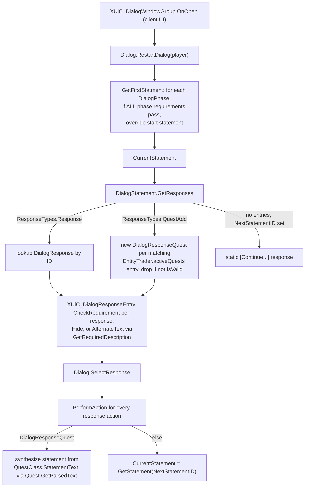

# NPC dialog trees and quest-data records (dedicated V3.1.0)

**Owns:** the trader/NPC dialog tree model (`Dialog`, `DialogPhase`,
`BaseDialogItem` / `BaseStatement` / `DialogStatement`, `DialogResponse` +
`DialogResponseQuest`, `BaseResponseEntry` entries, `BaseDialogRequirement` + 9
requirement verbs, `BaseDialogAction` + 6 action verbs, `DialogFromXml`) and the
quest-data records that complement the quest engine: `BaseQuestData` +
`TreasureQuestData` / `RestorePowerQuestData`, `QuestLockInstance`, `QuestList`,
`QuestTraderData`, `NPCQuestData` (+ `NetPackageNPCQuestList`), and
`BaseObjectiveModifier` + its two leaves.
**Not:** the quest state machine, `QuestJournal`, objectives and rewards
([`quests-challenges.md`](quests-challenges.md) owns those, including the shared
hub `QuestEventManager`); the XUi dialog widgets themselves
(`XUiC_DialogWindowGroup` etc. are client UI, noted here only as callers);
`dialogs.xml` / `quests.xml` content; trader inventory and economy
([`loot-economy.md`](loot-economy.md)).
**Evidence:** IL of the `Dialog*` family (28 type rows), `BaseQuestData` family,
`QuestLockInstance`, `QuestList`, `QuestTraderData`, `NPCQuestData`,
`NetPackageNPCQuestList`, `EntityTrader.PopulateActiveQuests` (545 IL ops) and
`QuestEventManager` plumbing; dump locally with `tools/src/DumpMethod` /
`DumpType` (git-ignored).
**Hub:** [`INDEX.md`](INDEX.md). **Method:** [`re-methodology.md`](re-methodology.md).

Two related systems share this doc. The **dialog tree** is a small
client-driven interpreter: statements, responses gated by requirement verbs,
and actions fired on selection. The **quest-data records** are the small
server-side state objects that the quest engine hangs off `QuestEventManager`
dictionaries: shared-quest membership, treasure dig progress, restore-power
completion events, POI quest locks, and per-player trader quest lists.

The headline finding: **the whole dialog tree, including requirement
evaluation, runs on the client that owns the dialog window.** Several
requirement and action bodies resolve their context through
`WorldBase.GetPrimaryPlayer()` and `LocalPlayerUI` / `XUi.Dialog.Respondent`,
which only exist where a local player renders UI. The server's authoritative
share is everything in sections 5 to 9: which quests a trader can offer, the
per-player offer cache, POI locks, and the shared quest-data records.

---

## 1. Dialog object model

Everything in a dialog derives from `BaseDialogItem` (`ID`, `HeaderName`,
`OwnerDialog`). `Dialog` is the root and holds a static registry
`Dialog.DialogList` keyed by dialog id:

| Type | Key fields | Role |
|---|---|---|
| `Dialog` | `ID`, `StartStatementID`, `StartResponseID`, `Phases`, `Statements`, `Responses`, `CurrentOwner` (EntityNPC), `ChildDialog`, `currentStatement` | one dialog tree; `ChildDialog` forwards every call (nested dialog delegation) |
| `DialogPhase` | `RequirementList`, `StartStatementID`, `StartResponseID` | conditional entry point override |
| `BaseStatement` | `Text`, `NextStatementID`, `Actions` | shared base of statements and responses (both can carry actions) |
| `DialogStatement` | `ResponseEntries` (List of `BaseResponseEntry`) | one NPC line plus the player choices under it |
| `DialogResponse` | `RequirementList`, `ReturnStatementID`, static `nextStatementEntry` | one player choice; the static entry is the synthesized "[Continue...]" (`xuiNext`) response |
| `BaseResponseEntry` | `UniqueID`, `ID`, `ResponseTypes` (`Response` 0, `QuestAdd` 1), `Response` | statement-to-response link record |
| `DialogQuestResponseEntry` | `ListIndex`, `ReturnStatementID`, `questType`, `Tier` | template that expands into per-quest offer rows |
| `DialogResponseQuest` | `IsValid`, `Quest`, `Tier`, `LastStatementID`, `introtag` | a materialized quest offer row bound to one `Quest` from `EntityTrader.activeQuests` |

`DialogFromXml` parses `dialogs.xml` via `WorldStaticData` (both sides load it;
`Dialog.ReloadDialogs` resets the `"dialogs"` static-data slot). Schema, from
the parser's attribute reads: `<dialog id startstatementid startresponseid>`
containing `<phase>`, `<statement id text nextstatementid>` (with child
`<response_entry id uniqueid>`, `<quest_entry id type tier listindex
nextstatementid returnstatementid>`, `<action>`) and `<response id text
nextstatementid returnstatementid>` (with child `<requirement>` and
`<action>`). Requirement and action verbs are resolved by reflection: the
`type` attribute is appended to `"DialogRequirement"` / `"DialogAction"` and
instantiated, so mods can add verbs by class name.

## 2. Tree traversal and gating

Details worth knowing:

- Phase selection is first-match-wins over `Dialog.Phases`; a phase passes only
  if **every** requirement in its `RequirementList` passes. No phase passing
  means the dialog's own `StartStatementID` is used.
- Response gating is per response: `XUiC_DialogResponseEntry` calls
  `CheckRequirement(player, respondent)`; on failure
  `RequirementVisibilityTypes` decides between `Hide` (1) and `AlternateText`
  (0, greyed row showing `GetRequiredDescription`, which delegates to the first
  requirement in the list only).
- `DialogQuestResponseEntry` expansion builds a `DialogResponseQuest` whose
  constructor searches `EntityTrader.activeQuests` for the Nth (`ListIndex`)
  quest matching `questType` and `Tier` (tier -1 means "any at or below the
  player's current faction tier"). An empty `ID` instead creates a brand-new
  quest from `QuestClass.GetQuest(ID).CreateQuest()`. Intro-tagged quests are
  suppressed when `QuestJournal.IntroQuestEnabled` is off. A valid row
  self-installs a `DialogActionAddQuest` and renders as
  `[TIER <roman>] <ResponseText>`.
- `Dialog.SelectResponse` runs all actions, then either synthesizes a statement
  from the quest's `StatementText` (offer preview) or walks `NextStatementID`.
  An empty `NextStatementID` in `GetStatement` maps back to the start
  statement.

## 3. Requirement verbs

`BaseDialogRequirement` carries `ID`, `Value`, `Tag`, `Owner`,
`RequirementVisibilityType`, `Description`, `StatusText`; the base
`CheckRequirement` returns false. The `RequirementTypes` enum lists 12 names
(`QuestEditorTag` and `DroneStateExclude` have no shipped class):

| Verb | Passes when |
|---|---|
| `DialogRequirementAdmin` | `GamePrefs.DebugMenuEnabled` (pref 45) is on |
| `DialogRequirementBuff` | never (stub, `return false`) |
| `DialogRequirementCanTrade` | sandbox option `TradersEnabled` (128) |
| `DialogRequirementCheckCVar` | `player.GetCVar(ID)` cast to int equals `Value` |
| `DialogRequirementSkill` | `player.Progression.GetProgressionValue(ID).Level > Value` |
| `DialogRequirementDroneState` | respondent drone's `Orders` / `AllyHealMode` / flashlight state matches `Value` (`LightOn`, `LightOff`, `Heal`, enum names) |
| `DialogRequirementQuestsAvailable` | sandbox `QuestsEnabled` (118) and the trader's `activeQuests` contains a quest of type `Value` at or below the player's faction tier that is repeatable or not already active/complete |
| `DialogRequirementQuestStatus` | see below |
| `DialogRequirementQuestTier` | player faction tier >= `Value` and a tier-`Value` quest with `UniqueKey == Tag` is in `activeQuests` |
| `DialogRequirementQuestTierHighest` | as above, but `Value` must equal the highest offered tier for `Tag` (gates the "next tier" reward dialog); respects `DisableQuesting` cvar unless `QuestClass.AlwaysAllow` |

`DialogRequirementQuestStatus` parses `Value` as `QuestStatuses` and checks the
player's `QuestJournal` (quest states from
[`quests-challenges.md`](quests-challenges.md), `Completed` = 3):

| `QuestStatuses` | Semantics |
|---|---|
| empty `ID` + `NotStarted` / `InProgress` | no / some active quest from this giver (`FindActiveQuestByGiver(respondent.entityId, Tag)`) |
| `NotStarted` 0 | quest `ID` absent from journal, or already `Completed` |
| `InProgress` 1 | active with at least one incomplete objective |
| `TurnInReady` 2 | active with all objectives complete |
| `Completed` 3 | `CurrentState == Completed` |
| `CanReceive` 4 | never taken, or completed on an earlier day (`worldTime / 24000`) |
| `CannotReceive` 5 | taken and not completed, or completed today |

`DialogRequirementQuestsAvailable` and `QuestStatus` (empty-ID branch) fetch
the respondent through `GetPrimaryPlayer()` + `LocalPlayerUI`, which is the
strongest IL evidence that requirement evaluation is client-side.

## 4. Action verbs

`BaseDialogAction` carries `ID`, `Value`, `Owner` (response), `OwnerDialog`.
`ActionTypes`: `AddBuff` 0, `AddItem` 1, `AddQuest` 2, `CompleteQuest` 3,
`Trader` 4, `Voice` 5.

| Verb | Effect (all run on the dialog-owning client) |
|---|---|
| `DialogActionAddQuest` | opens `XUiC_QuestOfferWindow` for `Quest` unless a non-repeatable copy already exists (then a `questunavailable` tooltip) |
| `DialogActionCompleteQuest` | finds active quest `ID` for the giver faction, fires `QuestEventManager.NPCInteracted` and `Quest.RefreshQuestCompletion(TurnIn)`; this is the turn-in button |
| `DialogActionTrader` | dispatch on `ID`: `restock` (zero `TraderData.lastInventoryUpdate`), `trade` (`SetNextTraderWindow(Trade)` + close modals), `reset_quests` (`EntityTrader.ClearActiveQuests`), plus the whole `drone_*` command set (`drone_storage`, follow/stay, heal toggles, attack mode, light, `drone_command_heal`) |
| `DialogActionAddBuff` | `AddBuff(ID)` on the primary player, failures printed to the console (debug-flavored) |
| `DialogActionAddItem` | parses `Value` as count or `min,max`/quality and adds to `XUiM_PlayerInventory` (debug-flavored) |
| `DialogActionVoice` | `EntityNPC.PlayVoiceSetEntry(ID)` on the respondent |

## 5. Trader quest offers: the server pipeline

The server decides what a trader offers each player. Entry points:
`EntityTrader.OnLockedServer` (player engaged the trader) and
`NetPackageQuestEvent.ProcessPackage`, both calling
`SetupActiveQuestsForPlayer` -> `PopulateActiveQuests` -> cached via
`QuestEventManager.SetupQuestList` -> mirrored to the client by
`NetPackageNPCQuestList` (sent with `_range` 192; the package has no `get_Channel`
override, so it rides channel 0).

`EntityTrader.PopulateActiveQuests(player, tier, factionPoints)` per player:

1. Lazily fills `questDictionary` (tier -> `QuestEntry` list) from
   `NPCInfo.Quests`, i.e. the `QuestList` named by `NPCInfo.QuestListName`
   (section 8).
2. Resolves defaults: tier from
   `QuestJournal.GetCurrentFactionTier(NPCInfo.QuestFaction)`, faction points
   from `QuestJournal.GlobalFactionPoints`.
3. Runs `QuestTraderData.CheckReset` (section 6) and, per tier up to the
   player's tier, prunes exhausted POI history (`QuestJournal.GetUsedPOIs` +
   `UpdateLocations`; on exhaustion `ClearTier` plus a `ClearUsedPOI` packet to
   remote players).
4. Filters each tier's `QuestEntry` rows by `StartStage`/`EndStage` against
   faction points and by `QuestEntry.CheckRequirement(player)` (a
   `Quests.Requirements` check, server-side, distinct from the dialog verbs).
5. Rolls quests: random entry, `Prob` roll, `MaxQuestCount` per quest name,
   `SingleQuest` removal, cycling `preferredDistanceIndex` through the
   `distanceIndices` distance bands, `Quest.SetupPosition` against
   `usedPOILocations`; sets `QuestGiverID`, `QuestFaction`, `QuestGiver` and
   `TraderPosition` position data. `specialQuestList` rows (unique-key quests
   such as tier-unlock openers) append after, deduplicated by `uniqueKeysUsed`
   and `FindCompletedQuest`.

`QuestEventManager.SetupQuestList` (server-only, `IsClient` early-out) caches
the list in `npcQuestData: Dictionary<npcEntityId, NPCQuestData>`;
`NPCQuestData.PlayerQuestList` maps player id ->
`PlayerQuestData { QuestList, LastUpdate }`. `GetQuestList` invalidates a
cached list after 24000 world-time ticks (one in-game day) or a trader reset,
so offers reroll daily. `ClearQuestListForPlayer` / `ClearQuestList` drop
entries.

`NetPackageNPCQuestList` is the round trip (write IL=99). Header is always
`npcEntityID:i32`, `playerEntityID:i32`, `eventType:u8`. `NPCQuestEventTypes`:
`FetchList`
0, `RemoveQuest` 1, `ResetQuests` 2, `AddUsedPOI` 3, `ClearUsedPOI` 4. The
server answers `FetchList` with `QuestPacketEntry[]` (`QuestID`,
`QuestLocation`, `QuestSize`, `POIName`, `TraderPos`), which the client applies
via `EntityTrader.SetActiveQuests`, rebuilding `activeQuests` locally; the
dialog quest rows of section 2 read that mirrored list. `RemoveQuest` deletes
the Nth quest of a tier from the server cache (quest accepted), `AddUsedPOI`
records a completed POI into the server-side journal copy
(`QuestJournal.AddPOIToTraderData`), and `ClearUsedPOI` flows server -> client
(`ClearTraderDataTier`).

## 6. QuestTraderData: per-trader POI history

`QuestTraderData` lives in the player's `QuestJournal` (persisted through
`QuestJournal.Write` into the player save,
[`save-persistence.md`](save-persistence.md)), keyed by `TraderPOI` (trader
area XZ). Fields: `CompletedPOIByTier` (tier -> completed POI positions),
`resetDay`, static `resetStartTier` / `fullTierCount`. `AddPOI` records a
completed quest POI and stamps `resetDay` on first use; `CheckReset` wipes the
tiers from `resetStartTier` up once `WorldTimeToDays(worldTime) - resetDay >=
7` (weekly reset), notifying remote players with a `ClearUsedPOI` packet. This
is what stops the same POI being offered twice at a tier until the pool resets.

## 7. Shared quest-data records and POI locks

`BaseQuestData` is the tiny base for cross-player quest state on the server:
`questCode` (the shared quest instance key) plus `entityList` of participating
player ids. `AddSharedQuester` / `RemoveSharedQuester` maintain membership;
when the last quester leaves, `OnRemove` + `RemoveFromDictionary` fire.
`SetModifier` is a stub.

| Record | Registry (all on `QuestEventManager`) | State | Behavior |
|---|---|---|---|
| `TreasureQuestData` | `TreasureQuestDictionary[questCode]` | `Position`, `TreasureOffset`, `BlocksPerReduction` | created by `GetTreasureContainerPosition` / `AddTreasureQuest`; `SendBlocksPerReductionUpdate` pushes the best dig progress to every sharer, writing `ObjectiveTreasureChest.CurrentBlocksPerReduction` directly for local players and sending `NetPackageQuestTreasurePoint` to remote ones; a joining sharer with a smaller radius triggers the same broadcast |
| `RestorePowerQuestData` | `BlockActivateQuestDictionary[questCode]` | `PrefabPosition`, `CompleteEvent` | created by `SetupActivateForMP` (joining sharers reuse the instance via `AddSharedQuester`); `OnRemove` fires `GameEventManager.HandleAction(CompleteEvent)` at the prefab position, so the "power restored" world change runs exactly once when the last quester finishes ([`game-events.md`](game-events.md)) |

`QuestLockInstance` implements the one-party-per-POI rule. It hangs off
`PrefabInstance.lockInstance` and is created by the
`QuestEventManager.QuestLockPOI` coroutine when a rally marker is activated
(`ObjectiveRallyPoint` locally, `NetPackageQuestEvent` for remote players),
seeded with the activating party's entity ids. `RemoveQuester` on quest
end/abandon unlocks when the list empties; `SetUnlocked` starts a 2000-tick
lockout (`LockedOutUntil`, skipped while playtesting). `CheckQuestLock` reports
"lock expired" so `CheckForPOILockouts` can clear the field; that method
returns `POILockoutReasonTypes` (`None`, `PlayerInside` for any non-party
player inside the POI bounds, `Bedroll`, `LandClaim`, `QuestLock`) and is
consulted by `DynamicPrefabDecorator` POI selection and rally activation.

## 8. QuestList

`QuestList` is a static name -> quest-set registry (`s_QuestLists`, lowercased
ids) built by `QuestsFromXml.ParseQuestList` from `<quest_list>` elements. Its
`Quests` list holds the `QuestEntry` rows (quest class, `Prob`, stage window,
requirement) that section 5 samples. `NPCInfo.Quests` resolves
`NPCInfo.QuestListName` through it; `NPCInfo` also carries `QuestFaction`,
`TraderID` and `DialogID`, the glue between an NPC, its dialog tree, and its
offer pool.

## 9. BaseObjectiveModifier

A `BaseObjectiveModifier` is a cloneable attachment on one `BaseObjective`
(`OwnerObjective`), parsed by `QuestsFromXml.ParseObjectiveModifier` and
re-parsed on template init. `HandleAddHooks` / `HandleRemoveHooks` wrap
`AddHooks` / `RemoveHooks`, which subscribe `QuestEventManager` events for the
objective's lifetime:

- `ObjectiveModifierSupplyBox` hooks `ContainerOpened` / `ContainerClosed` and
  swaps the expected fetch item (`expectedItemClassID` -> `expectedQuestItemID`
  x `itemCount`) for supply-drop style fetch quests.
- `ObjectiveModifierTrackBlocks` hooks `BlockChange` and registers with the
  quest's `Quests.TrackingHandler`; it keeps a `TrackedBlock` list
  (`blockIndexName`) and spawns `navObjectName` markers within
  `trackDistance` of `localPlayer`. The `EntityPlayerLocal` field marks the
  marker display as client-side; the block-change bookkeeping follows the
  owning player's quest object like every objective
  ([`quests-challenges.md`](quests-challenges.md) section 5).

## 10. Server vs client split

| Concern | Where it runs |
|---|---|
| Dialog window, statement/response traversal, requirement checks, actions | client (`XUiC_Dialog*`, `LocalPlayerUI`, `GetPrimaryPlayer`); the dedicated server ships the types but never opens a dialog |
| `dialogs.xml` parse (`DialogFromXml`) | both sides (WorldStaticData) |
| Offer generation (`PopulateActiveQuests`), `QuestEntry.CheckRequirement` | server |
| Offer cache (`NPCQuestData`) and daily invalidation | server |
| `activeQuests` the dialog reads | client mirror via `NetPackageNPCQuestList` |
| Quest accept / turn-in effects | client action fires, quest engine syncs state to server ([`quests-challenges.md`](quests-challenges.md)) |
| `QuestTraderData` POI history | server journal copy for remote players, persisted in the player save |
| Shared quest data (`TreasureQuestData`, `RestorePowerQuestData`), POI locks | server |

## Related docs

| Doc | Relation |
|---|---|
| [`quests-challenges.md`](quests-challenges.md) | The quest engine these records serve; owns `QuestEventManager`, `Quest`, `QuestJournal`, objectives |
| [`game-events.md`](game-events.md) | `RestorePowerQuestData.CompleteEvent` runs a GameEvent action sequence |
| [`protocol-packages.md`](protocol-packages.md) | `NetPackageNPCQuestList`, `NetPackageQuestEvent`, `NetPackageQuestTreasurePoint` framing |
| [`spawning.md`](spawning.md) | `EntityTrader` / `EntityNPC` as entities |
| [`sandbox-options.md`](sandbox-options.md) | `QuestsEnabled` / `TradersEnabled` gates read by requirement verbs |
| [`save-persistence.md`](save-persistence.md) | `QuestJournal` (and `QuestTraderData`) in the player save |
| [`server-browser-prefabs.md`](server-browser-prefabs.md) | `PrefabInstance`, home of `lockInstance` |
| [`re-methodology.md`](re-methodology.md) | How this was reversed |

## Changelog

- **2026-07-28:** NetPackageNPCQuestList write IL=99 header note.

- **2026-07-24:** Initial reversal: dialog tree model (phases, statements,
  response entries, quest-offer expansion), requirement verb semantics
  (including the `QuestStatuses` table) with the client-affinity finding,
  action verbs, the server offer pipeline (`PopulateActiveQuests` ->
  `NPCQuestData` cache -> `NetPackageNPCQuestList` mirror), `QuestTraderData`
  weekly POI reset, shared quest-data records, `QuestLockInstance` POI locks,
  `QuestList` registries, and objective modifiers.
