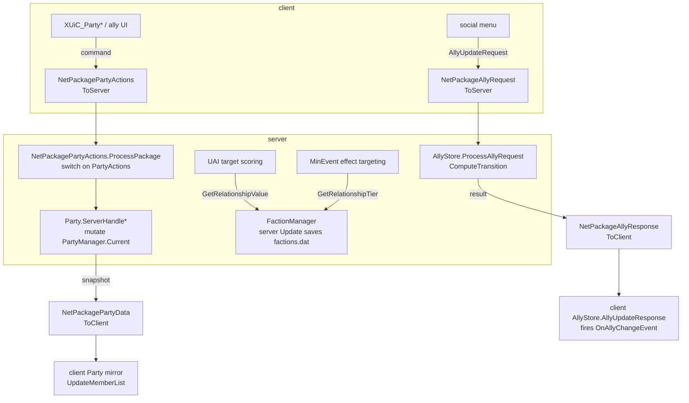
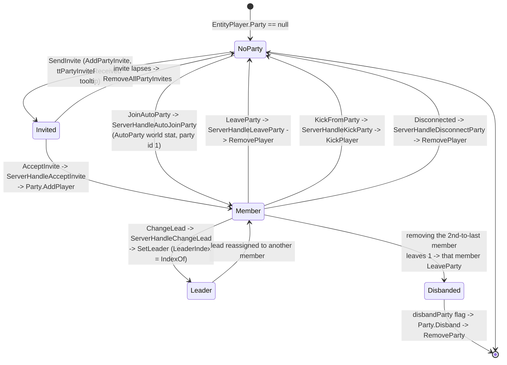
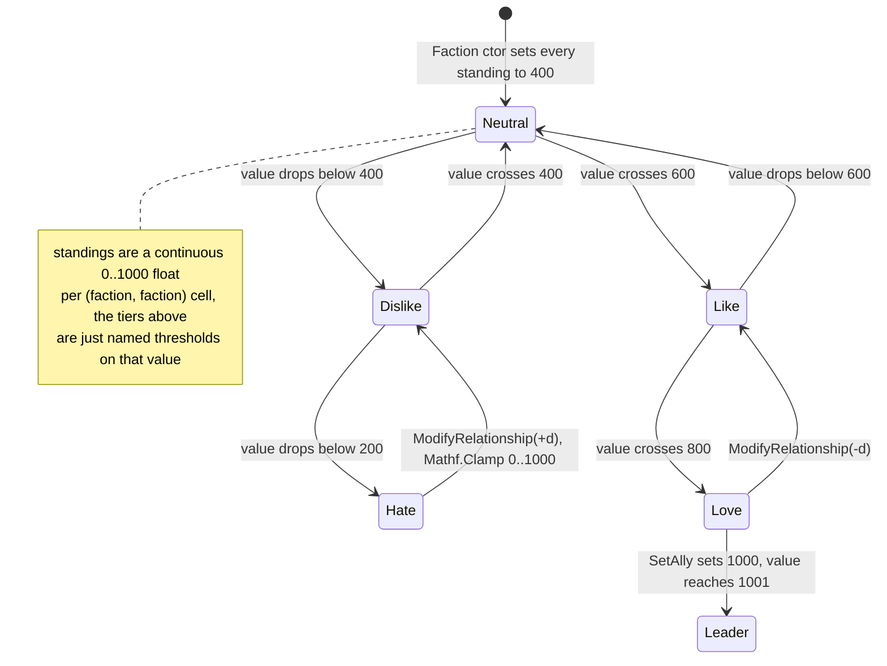
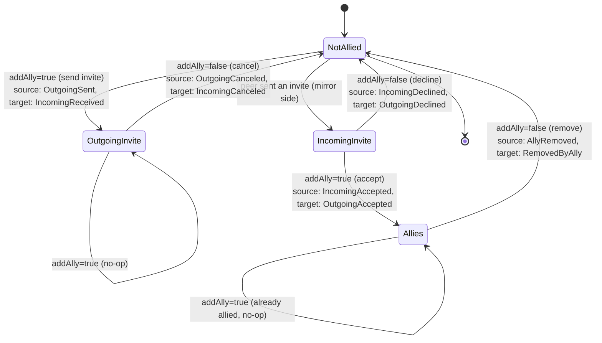

# Party and faction systems (dedicated V3.1.0)

**Owns:** the two social/relationship systems on the server: the **party** engine
(`PartyManager`, `Party`, the `PartyActions` command set, party leader / membership,
shared XP / gamestage / loot / quest scope, the `EChatType.Party` chat channel) and
the **faction/relationship** engine (`FactionManager`, `Faction`, the `Relationship`
tier ladder, per faction standings between entities), plus the player-to-player
**ally** handshake (`AllyStore`, `AllyStatus`, `AllyEvent`). Wire: `NetPackagePartyData`,
`NetPackagePartyActions`, `NetPackageSharedPartyKill`, `NetPackageAllyRequest` /
`NetPackageAllyResponse`.
**Not:** the party / faction / ally **UI** (`XUiC_Party*` controllers, client widgets);
the AI horde "parties" that share the name only (`AIDirectorBloodMoonParty`,
`AIDirectorGameStagePartySpawner`, see [`spawning.md`](spawning.md) / [`aidirector.md`](aidirector.md));
the shared-quest mechanics themselves ([`quests-challenges.md`](quests-challenges.md));
`PartyVoice` / platform voice lobby internals (external); the faction / NPC content
(`NPCsFromXml` parses standings from `npcs.xml`, data not loop IL); Twitch party hooks
([`twitch-integration.md`](twitch-integration.md)).
**Evidence:** `PartyManager` (9 bodies), `Party` (38), `FactionManager` (19), `Faction`
(9), `AllyStore` (20), `PartyQuests` (18), and the five net packages; enum constants for
`FactionManager.Relationship`, `AllyStore.AllyStatus` / `AllyEvent`, `NetPackagePartyActions.PartyActions` (note: the same-named `NetPackagePartyData.PartyActions` is a different enum with `AutoJoin=6`).
Dump locally with `tools/src/DumpMethod PartyManager ""`, `DumpMethod Party ""`,
`DumpMethod FactionManager ""`, `DumpMethod AllyStore ""` (git-ignored).
**Hub:** [`INDEX.md`](INDEX.md). **Method:** [`re-methodology.md`](re-methodology.md).

Parties and factions are two **independent** relationship layers. Parties are a
per-session grouping of human players (identity is the runtime `EntityPlayer`, the
group is thrown away on disband). Factions are a persistent standing matrix between
faction ids that every `EntityAlive` (players, NPCs, animals, zombies) carries, and
which gates AI targeting. The ally handshake is a third, persistent, player-to-player
relationship keyed by platform identity, stored next to land claims in the
`PersistentPlayerList` ([`server-lifecycle.md`](server-lifecycle.md) §3).

---

## 1. Architecture

Three small server-authoritative stores, each with its own wire sync:

| Store | Lives in | Key | Value | Persistence |
|---|---|---|---|---|
| `PartyManager.Current` | lazy singleton | `Party.PartyID` (int) | `List<Party>` (each `List<EntityPlayer>`, max 8) | none (session only) |
| `FactionManager.Instance` | singleton | `EntityAlive.factionId` (byte) | `Faction[255]`, each a `float[255]` standing row | `factions.dat` (+ `.bak`) |
| `AllyStore` | `PersistentPlayerList.Allies` | `PlatformUserIdentifierAbs` pair | `AllyStatus` (byte) | world save (XML + binary) |



`PartyManager.Update` ticks only `PartyVoice`; `FactionManager.Update` runs the save
timer; there is no per-frame party logic. Party mutation is event driven off the
command package, not polled.

---

## 2. Party model and lifecycle

`PartyManager` (lazy singleton via `get_Current`, which constructs on first use) holds
`partyList : List<Party>` and an `nextPartyID` counter. `CreateParty()` is
**server only** (returns `null` when `ConnectionManager.IsServer` is false), stamps
`PartyID = ++nextPartyID`, and appends a fresh `Party`. `CreateClientParty(world, id,
leaderIndex, members, voiceLobby)` builds the client-side mirror from a snapshot.
`GetParty(id)` is a linear scan; `RemoveParty` drops it; `Cleanup` clears the list.

A `Party` carries `PartyID` (int, `-1` until assigned), `MemberList : List<EntityPlayer>`
(capacity capped at **8**, see `AddPlayer` / `IsFull`), `LeaderIndex` (int), and
`VoiceLobbyId` (string). `Leader` is `MemberList[LeaderIndex]`. Three C# events fire
on change: `PartyMemberAdded`, `PartyMemberRemoved` (`OnPartyMembersChanged`), and
`PartyLeaderChanged` (`OnPartyChanged`). Each member's `EntityPlayer.Party` back
pointer, `IsInPartyOfLocalPlayer` flag, and map `NavObject` override color (from
`Constants.TrackedFriendColors`) are maintained here, which is why most of the class
is really client display bookkeeping.

### 2.1 Membership lifecycle (state machine)



`AddPlayer` refuses a duplicate or a full party (count already 8), appends, wires the
back pointer, clears pending invites, and recolors nav objects. `RemovePlayer` /
`KickPlayer` reverse that; when a removal leaves exactly **one** member the last member
is auto removed too (a party of one is not kept, except that under the `AutoParty`
world stat the primary player is retained). `Disband` calls `LeaveParty` on every
member then `PartyManager.RemoveParty`. `SetLeader` sets `LeaderIndex` to the new
host's index and notifies every member. Leaving / kicking / disconnecting the leader
resets `LeaderIndex` to 0 or promotes the prior leader.

### 2.2 Server command dispatch

**`GameManager.HandleFirstSpawnInteractions` (IL=116):** only when interaction
type **2**. Resolve entity id from `PlayerToEntityMap`. Local player skip if same
id. If platform block type **2** active: `DisplayGameMessage` type **6** (blocked
alert) and return. If GamePrefs **235** and local is ally of joiner: emit
`NetPackagePartyActions` op **0** (invite) to server, or if already server fan-out
with flags **192**.

The client never mutates the authoritative `Party`; it sends a `NetPackagePartyActions`
whose `currentOperation` selects a handler. `NetPackagePartyActions.ProcessPackage`
resolves the two entity ids, then `switch`es on `PartyActions`, gating every mutating
branch on `ConnectionManager.IsServer`:

| `PartyActions` | Server handler | Effect |
|---|---:|---|
| `0 SendInvite` | (invite bookkeeping) | if target has a pending invite from source, routes to accept; else `AddPartyInvite` + rebroadcast + `ttPartyInviteReceived` |
| `1 AcceptInvite` | `Party.ServerHandleAcceptInvite` (**IL=89**) | if inviter has no party, `PartyManager.CreateParty` (**IL=24**, server-only, `nextPartyID++`); `AddPlayer` both; clear invites; join audio; `NetPackagePartyData` fan-out |
| `2 ChangeLead` | `Party.ServerHandleChangeLead` | `SetLeader(newHost)` |
| `3 LeaveParty` | `Party.ServerHandleLeaveParty` | `RemovePlayer`, drop shared quests |
| `4 KickFromParty` | `Party.ServerHandleKickParty` | `KickPlayer`, drop shared quests |
| `5 Disconnected` | `Party.ServerHandleDisconnectParty` | `RemovePlayer` on disconnect |
| `6 JoinAutoParty` | `Party.ServerHandleAutoJoinParty` | join (or create) party id 1 |
| `7 SetVoiceLobby` | `Party.ServerHandleSetVoiceLoby` | set `VoiceLobbyId`, renotify |

Each server handler mutates `PartyManager.Current`, then broadcasts the new state as a
`NetPackagePartyData` snapshot (§3). `ServerHandleAutoJoinParty` is also reached from
`PlayerMoveController.updateRespawn` when the `AutoParty` (`EnumGameStats` 56) world
stat is on, so players auto group after respawn.

### 2.3 Shared party scope

`Party` aggregates member state for shared mechanics:

- **Shared kill XP.** Two server paths, both using the same base XP:
  1. **Killer** `EntityPlayer.AddKillXP` (**IL=99**): `ExperienceValue` from
     victim class, scaled by `EffectManager.GetValue(PassiveEffects=193, victim
     holding item, …)`; if `xpModifier != 1`, `xp = (int)(xp * mod + 0.5)`; if
     in party, `Party.GetPartyXP` =
     `startingXP * (1 - 0.1 * MemberCountInRange)` where
     `MemberCountInRange` (**IL=40**) counts **other** members with
     `Distance < GameStats` **54** (self excluded); local
     `AddLevelExp("_xpFromKill")` or
     `NetPackageEntityAddExpClient` flags **192**; when `xpModifier == 1` also
     calls `SharedKillServer` for party mates.
  2. **Party mates** `GameManager.SharedKillServer` (**IL=162**): resolve killer
     player + victim alive; same ExperienceValue + passive 193; same optional
     modifier and in-range party split; for each **other** member with
     `Distance < GameStats[54]`, local `SharedKillClient` or
     `NetPackageSharedPartyKill.Setup(class, xp, killerId, entityId)` flags
     **192**. Killer is **skipped** in this loop (killer already got AddKillXP).
  3. **SharedKillClient** (**IL=65**): `AddLevelExp("_xpFromParty", XPTypes=0)`;
     optional tooltip; `QuestEventManager.EntityKilled` for the party member.
- **Group gamestage / loot.** `get_GameStage` runs the member gamestages through
  `GameStageDefinition.CalcPartyLevel`; `get_HighestGameStage` and
  `GetHighestLootStage` take the max across members. This is how a party's blood-moon
  and loot difficulty scale to the group ([`spawning.md`](spawning.md), [`loot-economy.md`](loot-economy.md)).
- **Shared quests.** `PartyQuests.ShareAllQuestsWithParty` and the leave / kick /
  disconnect handlers call into `QuestJournal.RemoveSharedQuest*` and
  `RemovePlayerFromSharedWiths`; the shared-quest fetch / activate / repair setup lives
  in `QuestEventManager` ([`quests-challenges.md`](quests-challenges.md) §5). Party
  quest deltas ride `NetPackagePartyQuestChange` (**Process IL=83**):
  server fans to other party members (local `HandlePlayer` or rebroadcast
  Setup flags **192**); client always `HandlePlayer`. `HandlePlayer` (**IL=70**):
  find shared quest by `questCode`; if location rect non-zero, require player
  xz in rect, else require distance to sender **&lt; 15**; on pass
  `Objectives[objectiveIndex].ChangeStatus(isComplete)`, else
  `RemoveSharedQuestByOwner`; always `RemoveSharedQuestEntry`.
- **Party chat.** A party message is tagged `EChatType.Party` (channel 2); the
  sending client supplies the party members' entity ids as the message's
  `recipientEntityIds`, and `GameManager.ChatMessageServer` sends to that recipient
  list (it routes by the supplied list, not by re-deriving party membership, see
  [`chat.md`](chat.md) §2).

---

## 3. Party net sync

Two packages carry the party. Commands travel client to server; the authoritative
snapshot travels server to client.

**`NetPackagePartyActions`** (`PackageDirection` ToServer). `write` order:

```text
currentOperation  : u8      // PartyActions
invitedByEntityID : i32
invitedEntityID   : i32
voiceLobbyId      : string  // empty string when null
```

(The `partyMembers` field on the class is not serialized; re-verified write IL=25.)
`ProcessPackage` runs the dispatch table in section 2.2.

**`NetPackagePartyData`** (`PackageDirection` ToClient, `get_PackageDirection` returns 2).
`write` order:

```text
PartyID        : i32
LeaderIndex    : u8       // stored int, narrowed to byte on the wire
VoiceLobbyId   : string
memberCount    : i32
members        : memberCount x i32   // member entity ids
changedEntityID: i32      // the player this delta is about (-1 = none)
partyAction    : u8       // PartyActions that produced this snapshot
disbandParty   : bool
```

`ProcessPackage` returns immediately on the server (`IsServer` guard: this package is
client-inbound only). On a client it finds or `CreateClientParty`s the mirror, applies
`Party.UpdateMemberList` (reconciling the id array against the local `MemberList`,
clearing back pointers / nav colors for dropped members), then, relative to the local
player, plays the join / leave sound and shows the matching tooltip
(`ttPartyKickedFromParty`, `ttPartyOtherLeftParty`, `ttPartyDisconnectedFromParty`, ...).
If `disbandParty` is set it calls `Party.Disband`. The server picks recipients so only
party-relevant clients receive it.

**`NetPackageSharedPartyKill`** carries a shared kill both ways:

```text
entityTypeID : i32
xp           : i32
entityID     : i32   // killed entity
killerID     : i32
```

Server `ProcessPackage` (**IL=22**): `SharedKillServer(entityID, killerID, 1.0)`
(Setup used only 2-arg form; modifier forced 1). Client: `SharedKillClient` with
`entityTypeID` + `xp` from the package (party-mate credit, not the killer path).

---

## 4. Faction and relationship model

`FactionManager.Instance` (created by `Init`) owns `Faction[255]`, indexed by the byte
`EntityAlive.factionId` every entity carries. `AddFaction` slots **player** factions
(`IsPlayerFaction`) into the first free index from **0**, and NPC / AI factions into
the first free index from **8**, then stamps `Faction.ID`. So indices 0..7 are reserved
for player factions and 8..254 for the rest. `CreateFaction(name, playerFaction, icon)`,
`GetFaction(id)`, `GetFactionByName(name)`, and `RemoveFaction(id)` round out the table.

Each `Faction` holds `Relationships : float[255]` (its standing toward every other
faction id, all initialized to `400`), plus `Name`, `Icon`, `IsPlayerFaction`, `ID`.

**Standing lookup.** `GetRelationshipValue(a, b)` is the authoritative query:

- either entity null: `400` (Neutral),
- same `factionId`: `800` (Love, so a faction is friendly to itself),
- otherwise `Faction[a.factionId].GetRelationship(b.factionId)`, defaulting to `400`
  if either faction slot is empty.

**Tiers.** `GetRelationshipTier(a, b)` buckets the float value into the `Relationship`
enum, whose values are the lower thresholds:

| Value range | `Relationship` tier |
|---|---|
| `< 200` | `Hate` (0) |
| `200 .. < 400` | `Dislike` (200) |
| `400 .. < 600` | `Neutral` (400) |
| `600 .. < 800` | `Like` (600) |
| `800 .. < 1001` | `Love` (800) |
| `>= 1001` | `Leader` (1001) |



`ModifyRelationship(target, delta)` adds `delta` and clamps to `[0, 1000]` (but leaves a
cell holding the sentinel `255` untouched). `SetAlly(target)` pins a cell to `1000`.
`Faction.SetRelationship(target, value)` clamps to `[0, 1000]` then narrows through a
byte before storing, so content-set values quantize; it is called from
`NPCsFromXml.ParseFactionStandings` when parsing `npcs.xml`. `FactionManager.SetRelationship`
/ `ModifyRelationship` forward to the owning faction row.

**Persistence (server authoritative).** `FactionManager.Update` runs only when
`IsServer` and the world has players and the game is started; it decrements `saveTime`
by `deltaTime` and, roughly every **60 s**, calls `Save()`. `Save` serializes to a
pooled memory stream on the main thread then writes `factions.dat` on a background
thread (`factionDataSave`), copying the old file to `factions.dat.bak` first. `Load`
reads `factions.dat`, falling back to `.bak`. The on-disk layout (version byte `1`):

```text
version : u8   // FactionManager.Version = 1
repeat 255 times:
  present : bool
  if present: Faction.Write = 255 x f32 standings, then IsPlayerFaction : bool
```

**Relationship gating (targeting, not raw damage).** Two systems consult the manager:

- `UAI.UAIConsiderationTargetFactionStanding.GetScore` normalizes
  `GetRelationshipValue(self, target)` into `(value - min) / (max - min)` as a utility-AI
  consideration, so an NPC's target choice is weighted by faction standing
  ([`uai.md`](uai.md)).
- `MinEventActionTargetedBase.isValidTarget` filters buff / effect targets by
  `GetRelationshipTier`, comparing against `Like` (600) / `Love` (800) / `Dislike` (200)
  to decide friend versus enemy ([`buffs.md`](buffs.md), [`minevents.md`](minevents.md)).

The low-level `EntityAlive.DamageEntity` path does not itself consult factions: standing
gates who the AI *chooses* to attack and which entities an area effect *includes*, not
whether a landed hit deals damage.

---

## 5. Ally requests

The player-to-player ally relationship is separate from parties and from factions. It is
a symmetric map keyed by **platform identity**, stored in `AllyStore` (reachable at
`GameManager.persistentPlayers.Allies`). `relationships` is a nested
`Dictionary<PlatformUserIdentifierAbs, Dictionary<PlatformUserIdentifierAbs, AllyStatus>>`.
`AllyStatus`: `NotAllied` (0), `Allies` (1), `OutgoingInvite` (2), `IncomingInvite` (3).

`SetStatus(source, target, status)` writes **both** directions with complementary
values: `Allies` on both sides; an `OutgoingInvite` from source stores `IncomingInvite`
on the target; status `0` clears the pair. `IsAlly(a, b)` is `GetStatus == Allies`.

### 5.1 Handshake (state machine)

`AllyStore.AllyUpdateRequest(target, addAlly)` runs on a client (sends a
`NetPackageAllyRequest` to the server) or directly on the host. The server-only
`ProcessAllyRequest` reads the current status, calls `ComputeTransition`, sends a
`NetPackageAllyResponse` to clients, and applies the result locally. `ComputeTransition`
is the whole handshake, from the requesting (source) side, with the resulting
`AllyEvent` fired on each side:



`AllyUpdateResponse(source, target, newStatus, eventSource, eventTarget)` runs on the
client: it `SetStatus`es the pair and invokes `OnAllyChangeEvent` once for each side
(so each player's UI sees its own `AllyEvent`). The `AllyEvent` enum (`None` 0,
`OutgoingSent` 1, `OutgoingCanceled` 2, `IncomingAccepted` 3, `IncomingDeclined` 4,
`AllyRemoved` 5, `OutgoingAccepted` 6, `OutgoingDeclined` 7, `IncomingReceived` 8,
`IncomingCanceled` 9, `RemovedByAlly` 10) is purely a notification of what happened.

### 5.2 Ally wire

**`NetPackageAllyRequest`** (`PackageDirection` ToServer, write IL=18):

```text
source  : PlatformUserIdentifierAbs   // platform id blob (PlatformUserIdentifierExtensions.ToStream)
target  : PlatformUserIdentifierAbs
addAlly : bool
```

`ProcessPackage` calls `GameManager.persistentPlayers.Allies.ProcessAllyRequest`.

**`NetPackageAllyResponse`** (`PackageDirection` ToClient, write IL=26):

```text
source          : PlatformUserIdentifierAbs
target          : PlatformUserIdentifierAbs
newStatus       : u8   // AllyStatus
allyEventSource : u8   // AllyEvent
allyEventTarget : u8   // AllyEvent
```

`ProcessPackage` calls `AllyStore.AllyUpdateResponse`.

### 5.3 Ally persistence

`AllyStore.Write(BinaryWriter)` (IL=101): count of persisted pairs, then each
`a` id, `b` id (`ToStream`), status **u8** (Allies / pending only).
`WriteXml` emits `<allies><ally a= b= status=allies|pending>`.


`AllyStore` writes into the world save alongside land claims
([`server-lifecycle.md`](server-lifecycle.md) §3). `WriteXml` / `ReadXml` emit an
`<allies>` block of `<ally a=... b=... status="allies"|"pending">` rows (deduplicated by
`CompareOrdinal` so each pair is written once); `Write` / `Read` do the binary form
(int count of pairs, then each `a`, `b` platform id plus a status byte). Only `Allies`
and pending `OutgoingInvite` states are persisted; declined / removed pairs are dropped.

---

## 6. Dedicated relevance and residuals

- **Server authoritative, thin client mirror.** All three stores mutate only on the
  server (`CreateParty` and every `ServerHandle*` and `ProcessAllyRequest` gate on
  `IsServer`; `FactionManager.Update` saves only on the server). Clients hold a mirror
  updated by `NetPackagePartyData` / `NetPackageAllyResponse` and do the sound / tooltip
  / nav-color display. On a headless server the display code runs against no local
  player, so those branches are inert; the server's job is the authoritative membership,
  the standing matrix, the ally map, and their persistence.
- **Idle cost is near zero.** There is no per-frame party or faction logic beyond a
  voice tick and a 60 s faction save timer; party changes are event driven off the
  command package.
- **Persistence split.** Party membership is session only (nothing on disk). Factions
  persist to `factions.dat` (+ `.bak`). Ally relationships persist inside the world save
  via `PersistentPlayerList`.
- **Naming collisions (residual).** `AIDirectorBloodMoonParty` and
  `AIDirectorGameStagePartySpawner` are horde-spawn "parties" unrelated to the social
  `Party` ([`spawning.md`](spawning.md) / [`aidirector.md`](aidirector.md)); this doc
  does not cover them. There is no `EntityPartyData` type in the V3.0.1 assembly; a
  player's party linkage is the `EntityPlayer.Party` reference plus the
  `IsInPartyOfLocalPlayer` flag.
- **External / content (residuals).** `PlatformUserIdentifierAbs` and `PartyVoice` voice
  lobbies are platform-service backed ([`platform-auth.md`](platform-auth.md)); the
  faction table, NPC faction ids, and initial standings come from `npcs.xml`
  (`NPCsFromXml`, content not IL); the party / ally UI is XUi. See
  [`residuals.md`](residuals.md).

---

## Related docs

| Doc | Role |
|---|---|
| [`server-lifecycle.md`](server-lifecycle.md) | `PersistentPlayerList` (`AllyStore.Allies`, land claims) and player persistence |
| [`quests-challenges.md`](quests-challenges.md) | Shared-quest scope that parties drive (`QuestEventManager`, `PartyQuests`) |
| [`chat.md`](chat.md) | `EChatType.Party` channel routing for party chat |
| [`spawning.md`](spawning.md) | Party gamestage / loot stage feeding horde and loot difficulty; AI "party" spawners |
| [`uai.md`](uai.md) | `UAIConsiderationTargetFactionStanding` faction-weighted AI targeting |
| [`buffs.md`](buffs.md) | `MinEventActionTargetedBase` relationship-tier target filtering |
| [`protocol-packages.md`](protocol-packages.md) | Wire package conventions and direction bands |
| [`full-surface.md`](full-surface.md) | Where these types sit in the whole-assembly map |
| [`re-methodology.md`](re-methodology.md) | How this was reversed |
| [`residuals.md`](residuals.md) | External / native / content residuals |

## Changelog

- **2026-08-07:** HandleFirstSpawnInteractions IL=116 blocked alert + pref 235 ally invite.

- **2026-08-07:** PartyQuestChange Process/HandlePlayer (15 m or location rect,
  ChangeStatus / RemoveSharedQuest).
- **2026-08-07:** AddKillXP / SharedKillServer IL XP pipeline (passive 193,
  party 0.1 split, GameStats 54 range, party-mate only SharedKill fan-out).
- **2026-08-07:** ServerHandleAcceptInvite IL=89; CreateParty IL=24 nextPartyID.

- **2026-07-28:** Ally package write IL numbers.

- **2026-08-07:** MemberCountInRange: count other members with Distance <
  GameStats 54 (excludes self). SharedPartyKill / EntityAddExpServer process
  gates already pinned.
- **2026-07-28:** PartyActions write IL re-verify (no members on wire).

- **2026-07-23:** Initial party + faction + ally reversal. Party model (`PartyManager` /
  `Party`, max 8, server command dispatch via `NetPackagePartyActions`, authoritative
  `NetPackagePartyData` snapshot), membership lifecycle state machine, shared XP /
  gamestage / loot / quest scope; faction standing model (`FactionManager` `Faction[255]`,
  0..1000 standings, `Relationship` tier ladder, `factions.dat` persistence, UAI / MinEvent
  gating) with standing transition diagram; ally handshake (`AllyStore` `ComputeTransition`,
  `NetPackageAllyRequest` / `NetPackageAllyResponse`, persistence in `PersistentPlayerList`)
  with handshake state machine.
