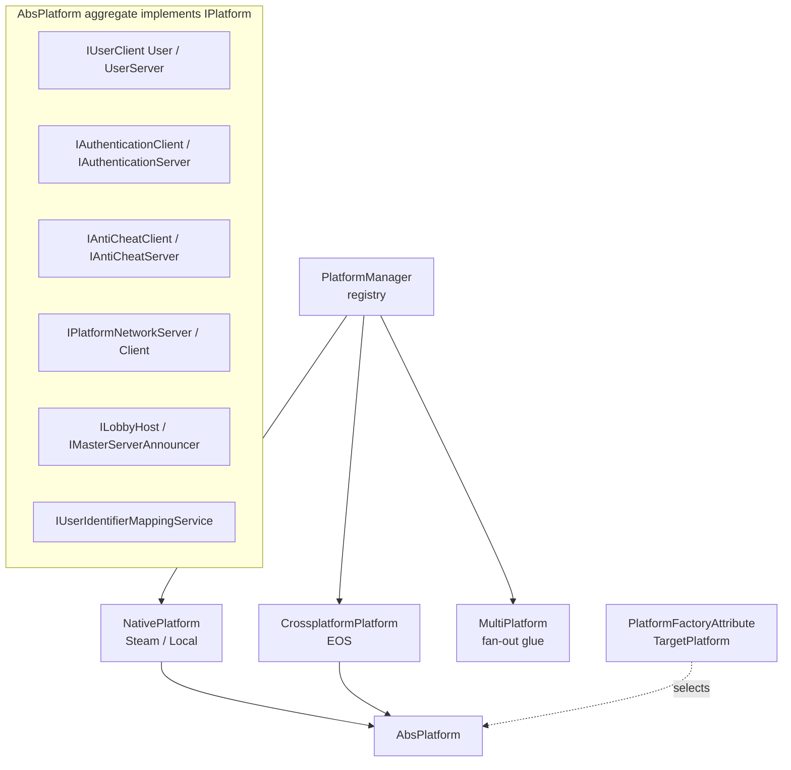
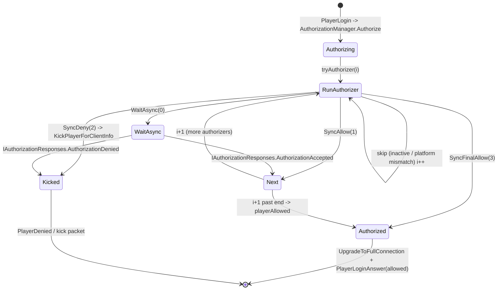
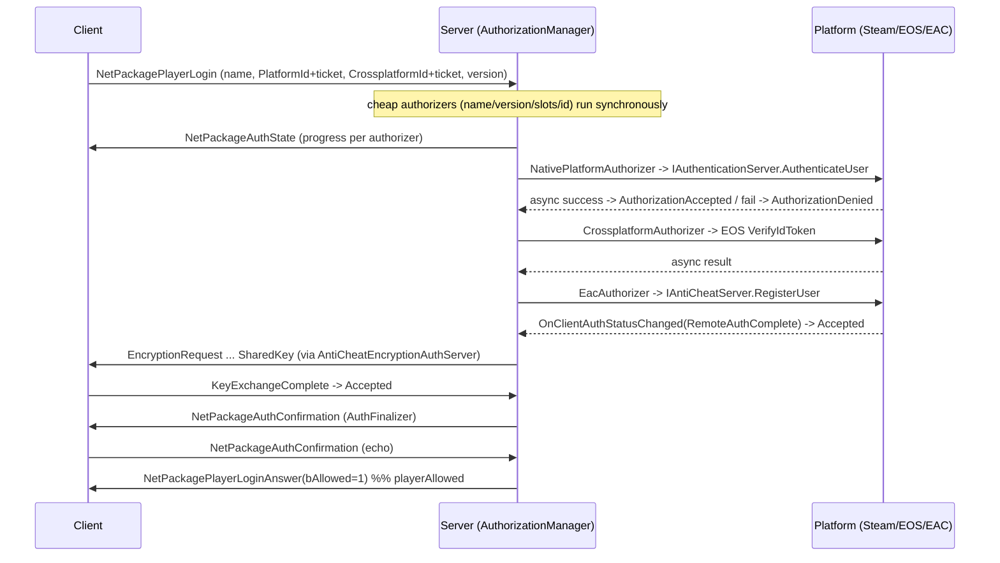
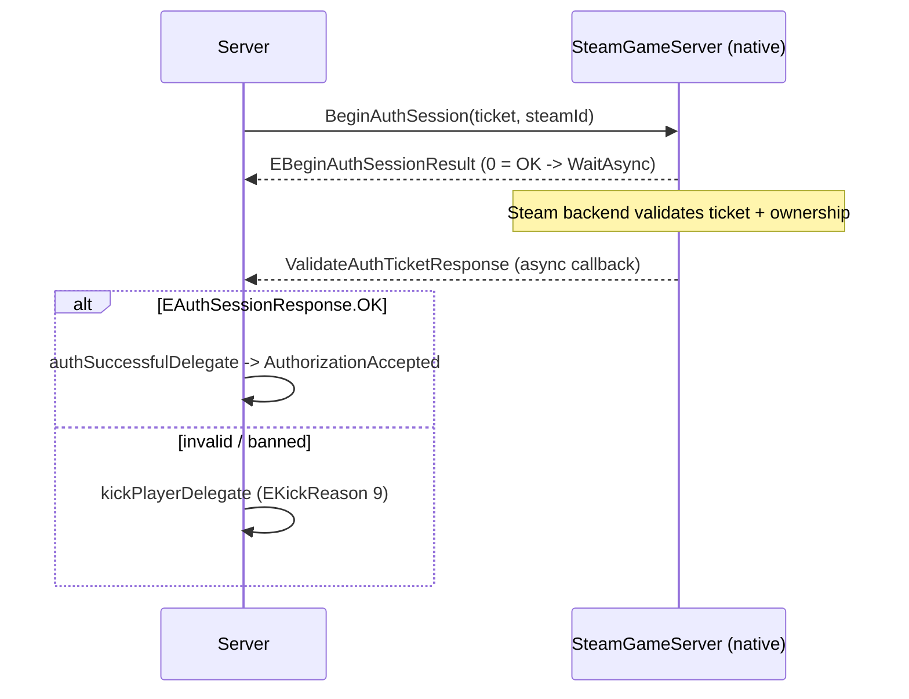
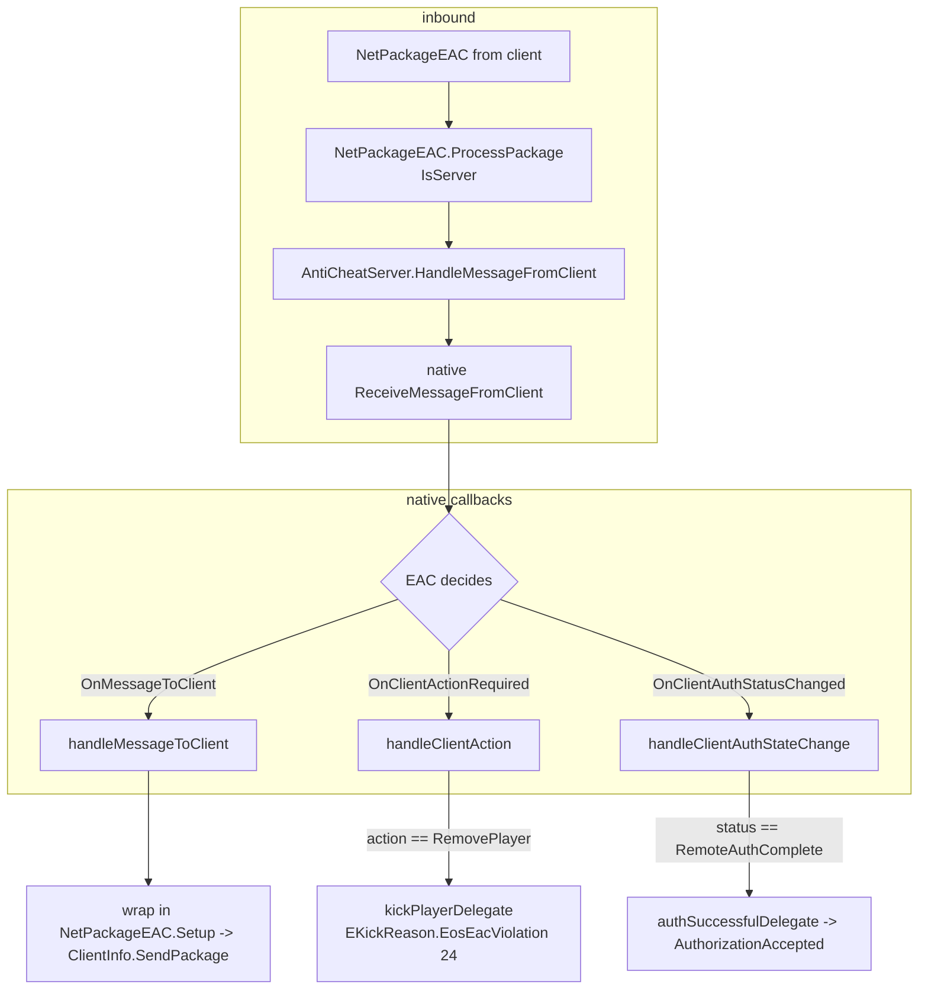

# Platform, identity and server join auth (dedicated V3.1.0)

**Owns:** the managed `Platform.*` surface and the server-side join validation it
feeds: the platform abstraction (`IPlatform` / `AbsPlatform` / `PlatformManager`),
the cross-play identity model (`PlatformUserIdentifierAbs` and subclasses), the
`AuthorizationManager` authorizer chain a dedicated server runs on every joining
player, and the Steam / EOS / EAC managed wrappers (`Platform.Steam.*`,
`Platform.EOS.*`, `Platform.MultiPlatform.*`, `Platform.Shared.*`) those
authorizers call.
**Not:** the native crypto and anti-cheat itself (Steamworks.NET `SteamGameServer`,
the EOS SDK `ConnectInterface` / `AntiCheatServerInterface`, EAC
`ProtectMessage` / `UnprotectMessage` ciphers). Those live below the managed
boundary and stay residual. Client-only UI / lobby / rich-presence / achievements
are out of dedicated scope.
**Evidence:** `Platform.*` IL (244 types / 1502 method bodies; dump locally with
`tools/src/DumpAll Platform`, git-ignored) plus the top-level auth orchestrators
`AuthorizationManager`, the `AuthorizerAbs` subclasses, `AntiCheatEncryptionAuthServer`
and `ClientInfo` / `NetPackageEAC` (dumped with `DumpMethod`). **Hub:** [`INDEX.md`](INDEX.md).
**Method:** [`re-methodology.md`](re-methodology.md).

This is the managed side of the join/auth path. It complements the wire view:
framing and the join package sequence are in [`protocol.md`](protocol.md) §5, the
pre-auth package set and the public-key encryption handshake are in
[`protocol-packages.md`](protocol-packages.md) §1.4 and §2, and the native
EAC/EOS residuals are already flagged in [`residuals.md`](residuals.md).

---

## 1. The platform abstraction

Every online capability the game needs (users, auth, anti-cheat, lobbies, server
list, storage, voice, achievements) is expressed as an interface. `AbsPlatform`
(implements `IPlatform`) is the aggregate that holds one implementation of each
as a backing field, so the rest of the game talks to `IPlatform` and never to
Steamworks or the EOS SDK directly. The concrete platform is selected by a
`PlatformFactoryAttribute` on the platform class (read reflectively in
`AbsPlatform::.ctor`, which throws if the attribute is missing).

`PlatformManager` is the registry. It exposes several distinct roles that the
auth code keys off:

| `PlatformManager` accessor | Meaning on a dedicated server |
|---|---|
| `NativePlatform` | The host account platform (e.g. `Platform.Steam` or standalone) |
| `CrossplatformPlatform` | The EOS cross-play platform, if cross-play is on |
| `MultiPlatform` | `Platform.MultiPlatform` glue that fans a call out to all active platforms; owns the unified `AntiCheatServer` |
| `ServerPlatforms` | `ReadOnlyDictionary<EPlatformIdentifier, IPlatform>` of every platform running a server listener |
| `InstanceForPlatformIdentifier(id)` | Look up the `IPlatform` matching a joining player's platform |



`Platform.Steam`, `Platform.EOS`, `Platform.Local`, `Platform.LAN`, `Platform.XBL`,
`Platform.PSN` each ship a `Factory` plus their own `User`, `Api`,
`NetworkServer*` / `NetworkClient*` and (where relevant) `AuthenticationServer` /
`AntiCheatServer`. On PC dedicated the interesting pair is **Steam as
`NativePlatform`** and **EOS as `CrossplatformPlatform` + the anti-cheat host**.

---

## 2. Cross-play identity model

`PlatformUserIdentifierAbs` is the abstract identity. Each platform subclasses it
with its native id plus, importantly, the **auth ticket** for that platform:

| Type | Native id field | Ticket field | `PlatformIdentifier` |
|---|---|---|---|
| `Platform.Steam.UserIdentifierSteam` | `SteamId : UInt64` (+ `OwnerId`) | `ticket : Byte[]` | `Steam` |
| `Platform.EOS.UserIdentifierEos` | `ProductUserId` | `ticket : String` (JWT) | `EOS` |
| `Platform.XBL.UserIdentifierXbl` | XUID | (platform token) | `XBL` |
| `Platform.PSN.UserIdentifierPSN` | account id | (platform token) | `PSN` |

`EPlatformIdentifier` is the tag byte: `None, Local, EOS, Steam, XBL, PSN, EGS,
LAN, Count`.

A joining player carries **two** identities on their `ClientInfo`:

- `ClientInfo.PlatformId` : the native platform identity (Steam id + ticket).
- `ClientInfo.CrossplatformId` : the EOS identity (product user id + JWT), when
  cross-play is active.
- `ClientInfo.InternalId` (`get_InternalId`) resolves to `CrossplatformId` when
  present, else `PlatformId`, so the EOS product user id is the canonical key
  when cross-play is on.

### 2.1 Identity + ticket wire layout

Identity is serialized by `PlatformUserIdentifierExtensions.ToStream` and read by
`PlatformUserIdentifierAbs.FromStream(BinaryReader)`. The token (auth ticket) is a
plain string written right after the identity by the login package. From
`NetPackagePlayerLogin::write` and `FromStream`:

```text
present  : bool      // false => null identity, nothing follows
version  : byte      // UserIdentifierVersion
platform : string    // EPlatformIdentifier name (drives the factory)
userId   : string    // platform-native id as string
token    : string    // auth ticket: base64 Steam ticket / EOS JWT, "" if none
```

`FromStream` reconstructs the concrete subclass through
`PlatformUserIdentifierAbs.FromPlatformAndId(platform, userId)`. The token is not
part of the identity struct: the server threads it separately and hands it to the
identity via `DecodeTicket`.

- `UserIdentifierSteam.DecodeTicket` base64-decodes the string into the `ticket`
  byte array (Steam auth session tickets are binary).
- `UserIdentifierEos.DecodeTicket` stores the string verbatim (an EOS ID token /
  JWT).

`CombinedString` is the canonical `platform/id` string used for logging, bans,
whitelist and the persistent-player key; equality and hash code are defined on it
(`PlatformUserIdentifierAbs.Equals` / `GetHashCode`).

`PlatformUserIdentifierAbs` also round-trips to XML (`ToXml` / `FromXml`) for the
config-file surfaces (whitelist, blacklist, admins), and to a combined string
(`TryFromCombinedString` / `FromCombinedString`).

The login package's identity + token pair appears twice: once for `PlatformId`
and once for `CrossplatformId`, matching the `PlayerLogin` body in
[`protocol.md`](protocol.md) §5.

---

## 3. Server join validation: the authorizer chain

The server does not validate a join inline. It runs a **chain of authorizers**,
each an `IAuthorizer` (base `AuthorizerAbs`) discovered by reflection at startup
(`AuthorizationManager.Init` -> `ReflectionHelpers.FindTypesImplementingBase`)
and kept in a `SortedList<IAuthorizer,int>` ordered by `IAuthorizer.Order`
(`AuthorizerComparer`; `Init` uses `ReflectionHelpers.FindTypesImplementingBase(IAuthorizer)`
then `IAuthorizer.Init(this)` on each).
`AuthorizationManager` is a singleton wired from `GameManager.PlayerLoginRPC`,
which itself is invoked by `NetPackagePlayerLogin.ProcessPackage` on the server.

Entry (`AuthorizationManager.Authorize`): the client is added to a
`clientsInAuthorization` set; both tickets are decoded (`DecodeTicket`);
`playerName`, `compatibilityVersion`, `PlatformId`, `CrossplatformId` and
`DiscordUserId` are recorded on the `ClientInfo`; then `tryAuthorizer(0, client)`
walks the chain.

Each authorizer returns `(EAuthorizerSyncResult, KickPlayerData?)`:

| `EAuthorizerSyncResult` | `tryAuthorizer` action |
|---|---|
| `WaitAsync` (0) | Return; the authorizer will call back later (async platform / EAC / key exchange) |
| `SyncAllow` (1) | `AuthorizationAccepted` -> advance to the next authorizer |
| `SyncDeny` (2) | `AuthorizationDenied` -> `GameUtils.KickPlayerForClientInfo` |
| `SyncFinalAllow` (3) | `playerAllowed` immediately (skip the rest) |

Before calling an authorizer, if it has a `StateLocalizationKey` the server pushes
a `NetPackageAuthState` to the client (the join progress line). Authorizers whose
`PlatformRestriction` does not match the player's platform, or whose
`AuthorizerActive` is false, are skipped.

When an async authorizer finishes it re-enters through the
`IAuthorizationResponses` callback it was handed in `Init`:
`AuthorizationAccepted` (advance) or `AuthorizationDenied` (kick). Both first check
the client is still in `clientsInAuthorization`, so a disconnect mid-chain is safe.



`playerAllowed` is the terminal accept (IL=**156**, verified). Steps:

1. Remove the client from `clientsInAuthorization` (disconnect-safe).
2. If `ClientInfo.loginDone` already true, return (idempotent).
3. Set `loginDone = true`.
4. For **every** entry in `ClientInfo.netConnection[]`, call
   `INetConnection.UpgradeToFullConnection()` (see below).
5. Log `Allowing player with id` + `InternalId.CombinedString`.
6. Send `NetPackageAuthState.Setup("authstate_authenticated")`.
7. Resolve `PlatformLobbyId`: prefer native lobby host when the player's
   platform matches native and `IsInLobby`; else
   `ClientLobbyManager.TryGetLobbyId` for the player's platform; else `None`.
8. Build platform/crossplatform `(user, ticket)` tuples:
   - **Dedicated:** both tuples empty (`initobj` ValueTuple).
   - **Listen host:** native + crossplatform user ids and auth tickets from
     `PlatformManager` clients.
9. Send `NetPackagePlayerLoginAnswer.Setup(bAllowed=1, data=LocalServerInfo.ToString(),
   platformLobbyId, platformTuple, crossplatformTuple)`.
10. On exception: log `Exception in playerAllowed:` and
    `ConnectionManager.DisconnectClient(cInfo, false, false)`.

`AuthorizationAccepted` (IL=24): log success, `IndexOfKey` the authorizer, if the
client is still in the set call `tryAuthorizer(index+1, client)`.
`AuthorizationDenied` (IL=17): log failure, remove from set,
`KickPlayerForClientInfo`.

That `PlayerLoginAnswer` is exactly the `Answer` transition in the
[`protocol.md`](protocol.md) section 5 join state machine.

### 3.3 `UpgradeToFullConnection` (IL=7)

`NetConnectionAbs.UpgradeToFullConnection`:

1. `InitStreams(true)` -- allocate the full 2 MiB post-auth stream set
   ([network.md](network.md) section 4.1).
2. `allowCompression = true` -- enables the compress step on the writer path.

Until this runs, the connection is the pre-auth / limited stream mode used for
handshake packages.

### 3.1 The chain, in order

Authorizers run ascending by `Order` (values are literals in each `get_Order`;
**IL-verified 2026-07-28** for all 19 concrete authorizers, including
`SteamOwnerAuthorizer`=430 and `SteamGroupsAuthorizer`=470):

| Order | Authorizer | Role | Result style |
|---:|---|---|---|
| 20 | `PlayerNameAuthorizer` | Non-empty / valid name | sync |
| 30 | `ServerStateAuthorizer` | Server up and accepting | sync |
| 41 | `HostMpAllowedAuthorizer` | Host account may host multiplayer | sync |
| 50 | `PlayerIdAuthorizer` | Valid platform id | sync |
| 60 | `DuplicateUserIdAuthorizer` | Reject a second session for one id | sync |
| 70 | `VersionAuthorizer` | Client version matches server | sync |
| 80 / 81 | `PlayerSlotsAuthorizer` / `TooManyPlayerSlotsAuthorizer` | Slot / VIP capacity | sync |
| 150 | `LegacyModAuthorizer` | Legacy mod-config gate | sync |
| 400 | **`NativePlatformAuthorizer`** | **Steam/EOS auth ticket validation** | **async** |
| 430 | `SteamOwnerAuthorizer` | Family-sharing / ownership | sync |
| 450 | `FriendsAuthorizer` | Friends-only servers | sync |
| 470 | `SteamGroupsAuthorizer` | Steam group membership | sync/async |
| 490 | **`CrossplatformAuthorizer`** | **EOS cross-play auth ticket** | **async** |
| 500 | `BansAndWhitelistAuthorizer` | Ban list / whitelist | sync |
| 550 | `CrossplayAuthorizer` | Cross-play allowed for this pairing | sync |
| 600 | **`EacAuthorizer`** | **EAC client registration** | **async** |
| 601 | **`AntiCheatEncryptionAgreementAuthorizer`** | **Encryption key exchange** | **async** |
| 999 | `AuthFinalizer` | Round-trip confirm, then finish | async |

So cheap local checks (name, version, slots, bans) gate before the expensive
network round-trips, and the three platform-integration gates (native ticket, EAC
register, encryption agreement) run late, each returning `WaitAsync` and resuming
through its callback.

### 3.2 Join auth handshake (sequence)



`AuthFinalizer` (order 999) sends `NetPackageAuthConfirmation` and returns
`WaitAsync`; the client echoes the confirmation back, `ProcessPackage` calls
`AuthFinalizer.ReplyReceived` -> `AuthorizationAccepted`, the chain runs past its
end, and `playerAllowed` fires. The confirmation round-trip verifies the channel
(now possibly encrypted) works before the login is finalized. The empty
`AuthConfirmation` body matches [`protocol.md`](protocol.md) §5.

---

## 4. The EAC / EOS / Steam managed wrapper surface

The three async gates each drive a native SDK through a thin managed wrapper. The
wrappers all follow the same shape: a `StartServer(authSuccessDelegate,
kickDelegate)` that stores two callbacks, per-player `AuthenticateUser` /
`RegisterUser` calls, and native async callbacks that fire one of the two
delegates. Those delegates are the authorizer's `IAuthorizationResponses`
adapters (`NativePlatformAuthorizer.authPlayerSteamSuccessfulCallback` /
`kickPlayerCallback`, and the EAC equivalents).

### 4.1 Steam authentication (`Platform.Steam.AuthenticationServer`)

`NativePlatformAuthorizer.ServerStart` calls `StartServer` on each non-cross-play
server platform's `IAuthenticationServer`. On join,
`NativePlatformAuthorizer.Authorize` resolves the player's platform and calls
`IAuthenticationServer.AuthenticateUser(clientInfo)`:

- `AuthenticationServer.AuthenticateUser` reads `UserIdentifierSteam.Ticket` and
  calls `Steamworks.SteamGameServer.BeginAuthSession(ticket, len, steamId)`. A
  result of `k_EBeginAuthSessionResultOK` (0) means the request was accepted and
  it returns `WaitAsync`; any other result cancels the session
  (`EndAuthSession`) and the authorizer denies with
  `EKickReason.PlatformAuthenticationBeginFailed` (8).
- The real verdict arrives asynchronously in
  `AuthenticationServer.ValidateAuthTicketResponse` (a Steamworks callback
  registered in `Init`). It finds the `ClientInfo` by
  `ConnectionManager.Clients.ForUserId`; on `EAuthSessionResponse.OK` it invokes
  the success delegate, otherwise it kicks with
  `EKickReason.PlatformAuthenticationFailed` (9).
- `RemoveUser` / `Disconnect` call `EndAuthSession`.
- `RequestUserInGroupStatus` / `GsClientGroupStatus` back the optional Steam-group
  gate (`serveradmin.xml`); the EOS `AuthServer` throws `NotImplementedException`
  for these, so Steam groups are Steam-only.



### 4.2 EOS cross-play authentication (`Platform.EOS.AuthServer`)

`CrossplatformAuthorizer` drives the EOS side. `AuthServer.AuthenticateUser`
takes the player's `CrossplatformId` (`UserIdentifierEos`), builds a
`Connect.IdToken` from its JWT `Ticket` and `ProductUserId`, and calls
`ConnectInterface.VerifyIdToken(options, callback)` on the EOS Connect interface.
The verdict comes back on the async `VerifyIdToken` callback. So the native
platform gate verifies a **Steam auth session ticket** and the cross-play gate
verifies an **EOS-signed ID token**; a cross-play join passes through both.

### 4.3 EOS anti-cheat server (`Platform.EOS.AntiCheatServer`)

This is the largest wrapper and the EAC integration point. It implements
`IAntiCheatServer`, which itself extends `IAntiCheatEncryption` / `IEncryptionModule`,
so the same object is both the anti-cheat host and the game-stream cipher.

Lifecycle and per-player calls, each guarded by the shared
`AntiCheatCommon.LockObject` and an `EosHelpers.AssertMainThread`:

| Managed method | Native EOS `AntiCheatServerInterface` call | Purpose |
|---|---|---|
| `StartServer` | `BeginSession(LocalUserId, RegisterTimeoutSeconds=60, ServerName)` | Start the EAC session (sets `serverRunning`) |
| `RegisterUser` | `RegisterClient(UserId, ClientHandle, ClientPlatform, ClientType, IpAddress)` | Register a joining player |
| `FreeUser` | `UnregisterClient` | Drop a player |
| `HandleMessageFromClient` | `ReceiveMessageFromClient(ArraySegment)` | Inbound EAC bytes from the wire |
| `StopServer` | `EndSession` | Tear down |

`RegisterUser` keys the client by its EOS `ProductUserId` (the `CrossplatformId`),
tags `ClientType` from `ClientInfo.requiresAntiCheat`, maps `ClientInfo.device` to
an EAC platform through `EosHelpers.DeviceTypeToAntiCheatPlatformMappings`, and
stashes an opaque `ClientHandle` via `AntiCheatCommon.ClientInfoToIntPtr` so
native callbacks can find the `ClientInfo` again.

`EacAuthorizer.Authorize` simply calls `RegisterUser` and returns `WaitAsync`; the
authorization completes only when EAC reports the client authenticated.

`addCallbacks` registers three native notifications that form the message pump:



- `handleMessageToClient`: EAC produced a message for a client. It is wrapped in a
  `NetPackageEAC` (`Setup(len, data)`) and sent with `ClientInfo.SendPackage`, so
  the EAC transport rides the normal game channel. If the client handle is
  unknown the wrapper unregisters it defensively.
- `handleClientAction`: on `AntiCheatCommonClientAction.RemovePlayer` it kicks via
  the kick delegate with `EKickReason.EosEacViolation` (24).
- `handleClientAuthStateChange`: on `AntiCheatCommonClientAuthStatus`
  `RemoteAuthComplete` (2) it fires the success delegate, which is what lets the
  `EacAuthorizer` advance.

Inbound, `NetPackageEAC.ProcessPackage` routes to
`AntiCheatServer.HandleMessageFromClient` on a server (and to
`IAntiCheatClient.HandleMessageFromServer` on a client). `NetPackageEAC` is one of
the ten `AllowedBeforeAuth` packages ([`protocol-packages.md`](protocol-packages.md)
§1.4), so the EAC handshake can complete before the login is authorized.

`ServerEacEnabled` gates everything: the interface handle must be non-null and the
`ServerDisableEac`-style `GamePrefs` bool must permit it; when EAC is off (the bot
/ C# mod case noted in [`protocol.md`](protocol.md) §1) `EacAuthorizer.AuthorizerActive`
is false and the whole gate is skipped.

### 4.4 Encryption agreement (`AntiCheatEncryptionAuthServer` + the EAC cipher)

The `AntiCheatServer` is also the game-stream cipher. As an `IEncryptionModule` it
exposes `EncryptStream` / `DecryptStream`, which call the native EAC
`ProtectMessage` / `UnprotectMessage` (adding a fixed 40-byte tag) under the same
lock. This is a **separate** protection layer from the public-key handshake: the
public-key exchange agrees the keys, EAC then authenticates/encrypts each frame.

`AntiCheatEncryptionAgreementAuthorizer` (order 601) is the managed glue that
drives the public-key handshake described in [`protocol-packages.md`](protocol-packages.md)
§2. Its `ServerStart` wires `KeyExchangeCompleted` / `KeyExchangeFailed`
callbacks into `ConnectionManager.AntiCheatEncryptionAuthServer` (via `Start`).
On `Authorize`, if EAC encryption is available and the client `requiresAntiCheat`,
it calls `AntiCheatEncryptionAuthServer.TryStartKeyExchange(client)` and returns
`WaitAsync`. `AntiCheatEncryptionAuthServer` owns the handshake state machine:

| `AntiCheatEncryptionAuthServer` method | Handshake step |
|---|---|
| `TryStartKeyExchange` | send `NetPackageEncryptionRequest` |
| `SendSharedKey(exchangePublicKeyParamsXml, hash, signedHash)` | consume `NetPackageEncryptionPublicKey`, reply `NetPackageEncryptionSharedKey` |
| `CompleteKeyExchange(client, wasSuccessful)` | consume `NetPackageKeyExchangeComplete` |
| `CancelKeyExchange` / `OnClientDisconnected` | abort |

The `SendSharedKey` signature (params XML + hash + signed hash) is exactly the
`NetPackageEncryptionPublicKey` body in [`protocol-packages.md`](protocol-packages.md)
§2, confirming this class is the managed consumer of that handshake. On success
`KeyExchangeCompleted` sets the client's `IEncryptionModule`
(`ClientInfo.SetAntiCheatEncryption`) and accepts; on failure it kicks with
`EKickReason.EncryptionAgreement*` (33 / 34) or `EncryptionFailure` (19).

---

## 5. The managed / native boundary

Everything above is managed orchestration. The actual cryptography and cheat
detection is native and stays residual:

| Managed (in `Assembly-CSharp.dll`, reversed here) | Native (below the boundary, residual) |
|---|---|
| `AuthenticationServer.AuthenticateUser` picks the ticket, calls Begin/EndAuthSession | Steamworks.NET `SteamGameServer` + Steam backend ticket / ownership check |
| `AuthServer.AuthenticateUser` builds the `IdToken`, calls `VerifyIdToken` | EOS SDK `ConnectInterface` token signature verification |
| `AntiCheatServer` Begin/Register/Receive/End + 3 notify callbacks | EOS `AntiCheatServerInterface` + EAC detection engine |
| `EncryptStream` / `DecryptStream` marshal buffers | EAC `ProtectMessage` / `UnprotectMessage` cipher + MAC |
| `AntiCheatEncryptionAuthServer` sequences the 4 handshake packets | the key-derivation / signature primitives behind the XML params |
| `PlatformUserIdentifierAbs` identity + ticket wire codec | none (fully managed) |

The managed layer is fully reversible from IL: which SDK call fires, in what
order, keyed by which identity, and which `EKickReason` a failure maps to. What is
opaque is only what happens *inside* the native call: whether a Steam ticket is
genuine, whether an EOS token signature checks out, whether EAC flags a client,
and the exact cipher. Those are third-party binaries, not game logic.

---

## 6. Dedicated relevance and residuals

- **Runs on dedicated:** the whole `AuthorizationManager` chain runs server-side
  on every join. `NetPackagePlayerLogin.ProcessPackage`, `PlayerLoginRPC`,
  `AuthorizationManager`, and the `IAuthorizationResponses` callbacks are all
  server code. `playerAllowed` sending `NetPackagePlayerLoginAnswer` is the exact
  server `Answer` step in [`protocol.md`](protocol.md) §5.
- **Server vs client split:** `ConnectionManager.PlayerAllowed` (note: distinct
  from `AuthorizationManager.playerAllowed`) is the **client** side that reacts to
  a `PlayerLoginAnswer`, decoding its own tickets and running
  `IAuthenticationClient` authorizers. The server never runs those. The server
  side is `IAuthenticationServer` + `IAntiCheatServer` + the authorizer chain.
- **Residual (native / external), see [`residuals.md`](residuals.md):** Steam
  ticket verification and the Steam group backend; EOS token signature
  verification; the EAC detection engine and its wire protocol
  (`NetPackageEAC` payload bytes are opaque); the EAC `ProtectMessage` cipher and
  the key-exchange KDF / signature primitives behind
  [`protocol-packages.md`](protocol-packages.md) §2.
- **Config-driven content:** whitelist / blacklist / admins (via
  `PlatformUserIdentifierAbs` XML), Steam group ids in `serveradmin.xml`, and the
  EAC on/off `GamePrefs`.

---

## Related docs

| Doc | Role |
|---|---|
| [protocol.md](protocol.md) | Wire framing + the join package sequence this feeds (§5) |
| [protocol-packages.md](protocol-packages.md) | Pre-auth package set (§1.4) + the encryption handshake bodies (§2) |
| [protocol-frames.md](protocol-frames.md) | Visual byte frames for the login / auth packages |
| [network.md](network.md) | Where auth sits in the connection lifecycle |
| [server-lifecycle.md](server-lifecycle.md) | Server start / stop that calls `ServerStart` on the authorizers |
| [managers.md](managers.md) | Other in-process managers (`ConnectionManager`, `GameManager`) |
| [residuals.md](residuals.md) | Native EAC / EOS / Steam residuals |
| [re-methodology.md](re-methodology.md) | How this was reversed from IL |
| [INDEX.md](INDEX.md) | Hub |

## Changelog

- **2026-07-28:** `playerAllowed` step list + `UpgradeToFullConnection` (full streams + compression).

- **2026-07-28:** Re-verified all authorizer Order literals from IL; Init reflection details.

- **2026-07-23:** Initial `Platform.*` + `AuthorizationManager` reversal: identity model, the ordered authorizer chain state machine, the Steam / EOS / EAC managed wrappers, the encryption-agreement glue, and the managed/native boundary, with join-auth sequence and EAC message-pump diagrams.
