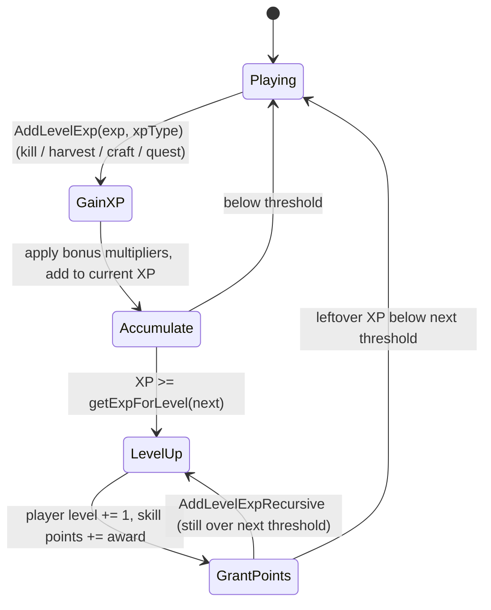
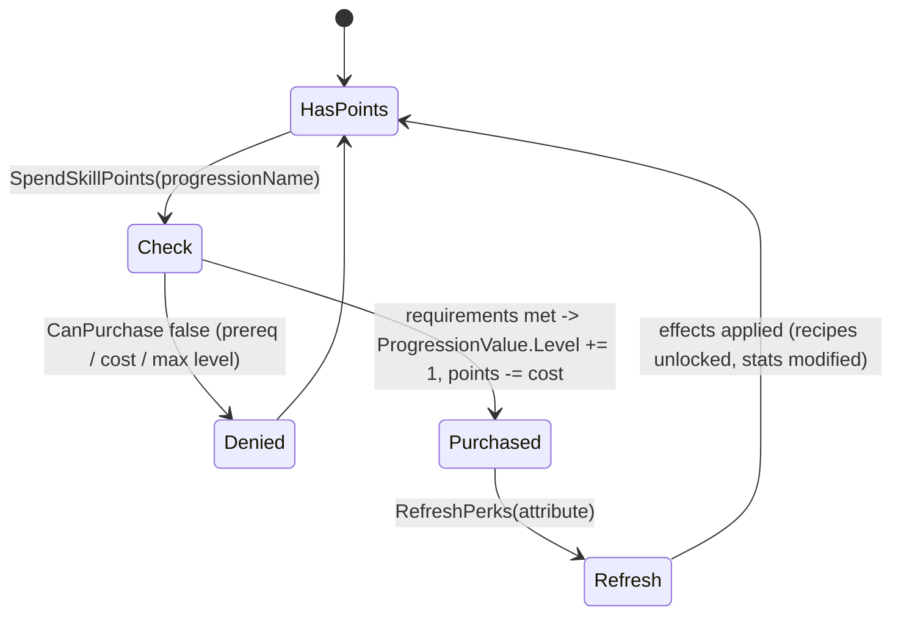

# Progression: levels, skills, perks (dedicated V3.0.1)

**Owns:** the server-authoritative player progression: `Progression` (per-player
level + XP + skill points + owned skills/perks), `ProgressionValue` (a skill /
perk / attribute instance), XP gain, level-up, and perk purchase.
**Not:** the skill-tree UI (client); `progression.xml` content; the passive-effect
math applied by perks ([buffs.md](buffs.md)).
**Evidence:** `Progression`, `ProgressionValue`, `ProgressionClass` IL (dump
locally with `tools/src/DumpMethod`, git-ignored). **Hub:** [`INDEX.md`](INDEX.md).
**Method:** [`re-methodology.md`](re-methodology.md).

XP, leveling, and perk unlocks are validated and stored on the server (they gate
crafting, stats, and abilities), so progression is a dedicated codepath even
though the tree is drawn client-side.

---

## 1. Model

| Type | Role |
|---|---|
| `Progression` | Per-`EntityPlayer` container: player level, XP, unspent skill points, and the map of owned `ProgressionValue`s |
| `ProgressionValue` | One skill / perk / attribute instance: `Level`, `CostForNextLevel`, `CanPurchase`, `GetCalculatedLevel` |
| `ProgressionClass` | The definition from `progression.xml` (`ProgressionFromXml`): the attribute/skill/perk tree, `ProgressionType`, `ProgressionCurrencyType`, level caps |

`GetCalculatedLevel(entity)` is the **effective** level = the purchased `Level`
plus temporary modifiers from buffs/items, so a perk can be boosted above its
bought level (shared with the passive-effect system, [buffs.md](buffs.md)).
`Read`/`Write` persist progression with the player profile
([server-lifecycle.md](server-lifecycle.md)) and send a network variant to the
owning client.

---

## 2. XP and level-up (state machine)

XP arrives through `AddLevelExp(exp, cvarXPName, XPTypes, useBonus, ...)` (from
kills, harvesting, crafting `AddCraftComplete`, and quests, usually via the
MinEvent actions `ActionAddXP` / `ActionAddPlayerLevel`, see
[minevents.md](minevents.md)). `AddLevelExpRecursive` handles crossing several
level thresholds at once; each level grants skill points.

`getLevelFloat` / `GetLevelProgressPercentage` expose the fractional progress;
`GetExpForNextLevel` the remaining XP. XP amounts and bonuses are
server-authoritative.

---

## 3. Perk purchase (state machine)

Unspent skill points are spent via `SpendSkillPoints(points, progressionName)`,
which raises a `ProgressionValue.Level` after `CanPurchase` confirms the
requirements (attribute/player-level prerequisites and `CostForNextLevel`).
`RefreshPerks` then recomputes the effects the new level grants.

Perk effects feed other systems: they unlock recipes
([crafting-recipes.md](crafting-recipes.md) §3), modify stats and item behavior
through passive effects ([buffs.md](buffs.md)), and gate abilities. The server
validates every purchase; the client only requests it.

`ResetProgression(resetSkills, resetBooks, resetCrafting)` is the respec path
(e.g. from a consumable), clearing the chosen categories and refunding points.

---

## 4. Dedicated relevance and residuals

- **Server-authoritative:** XP totals, level, skill-point balance, and purchase
  validation all live on the server and persist with the player profile.
- **Residual / content:** `progression.xml` (the tree); the skill UI; book/schematic
  content is data.

---

## Related docs

| Doc | Role |
|---|---|
| [minevents.md](minevents.md) | `ActionAddXP` / `ActionAddPlayerLevel` XP sources |
| [crafting-recipes.md](crafting-recipes.md) | Perks unlock recipes |
| [buffs.md](buffs.md) | Perk passive-effect math + calculated level |
| [server-lifecycle.md](server-lifecycle.md) | Progression persisted with the player profile |

## Changelog

- **2026-07-23:** Initial progression reversal (XP/level-up, perk purchase, calculated level, respec) with state machines.
