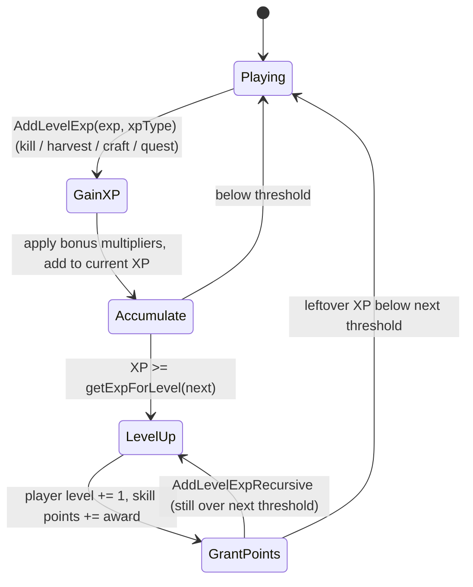
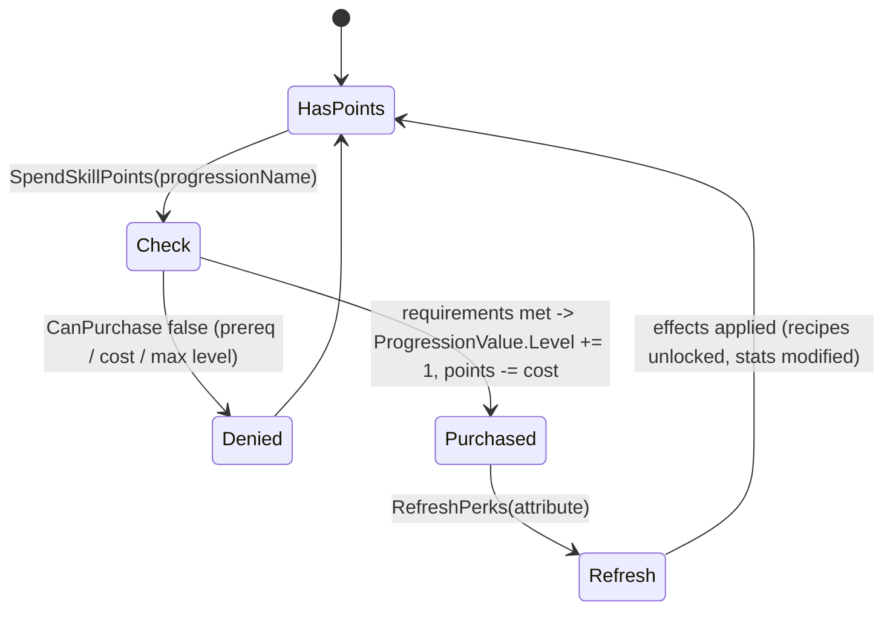

# Progression: levels, skills, perks (dedicated V3.1.0)

**Owns:** the server-authoritative player progression: `Progression` (per-player
level + XP + skill points + owned skills/perks), `ProgressionValue` (a skill /
perk / attribute instance), XP gain, level-up, and perk purchase.
**Not:** the skill-tree UI (client); `progression.xml` content; the passive-effect
math applied by perks ([buffs.md](buffs.md)).
**Evidence:** `Progression`, `ProgressionValue`, `ProgressionClass` IL (dump
locally with `tools/src/DumpMethod`, git-ignored). **Hub:** [`INDEX.md`](INDEX.md).
**Method:** [`re-methodology.md`](re-methodology.md).

XP, leveling, and perk unlocks are validated and stored on the server (they gate
crafting, stats, and abilities), so progression is a dedicated codepath even
though the tree is drawn client-side.

---

## 1. Model

| Type | Role |
|---|---|
| `Progression` | Per-`EntityPlayer` container: player level, XP, unspent skill points, and the map of owned `ProgressionValue`s |
| `ProgressionValue` | One skill / perk / attribute instance: `Level`, `CostForNextLevel`, `CanPurchase`, `GetCalculatedLevel` |
| `ProgressionClass` | The definition from `progression.xml` (`ProgressionFromXml`): the attribute/skill/perk tree, `ProgressionType`, `ProgressionCurrencyType`, level caps |

`GetCalculatedLevel(entity)` is the **effective** level = the purchased `Level`
plus temporary modifiers from buffs/items, so a perk can be boosted above its
bought level (shared with the passive-effect system, [buffs.md](buffs.md)).
`Read`/`Write` persist progression with the player profile
([server-lifecycle.md](server-lifecycle.md)) and send a network variant to the
owning client.

---

## 2. XP and level-up (state machine)

XP arrives through `AddLevelExp` (**IL=161**):

```text
AddLevelExp(exp, cvarXPName, XPTypes, useBonus, notifyUI, instigatorId, itemValue)
```

Sources: kills, harvesting, crafting `AddCraftComplete`, quests, MinEvent
`ActionAddXP` / `ActionAddPlayerLevel` ([minevents.md](minevents.md)).

**Apply order (IL):** null parent guard; bind instigator into `MinEventContext`;
if `useBonus`, scale exp via `EffectManager.GetValue` with XP-type FastTags;
optional GameSparks counter; local UI icon when notify; then
`AddLevelExpRecursive(exp, cvarXPName, notifyUI)` which increments cvar XP and
crosses level thresholds (skill points per level). `AddLevelExpRecursive`
handles multi-level jumps.



`getLevelFloat` / `GetLevelProgressPercentage` expose the fractional progress;
`GetExpForNextLevel` the remaining XP. XP amounts and bonuses are
server-authoritative.

**`Progression` leaf store:** `GetDict` (IL=4) exposes the `ProgressionValues`
dictionary; `CalcId(name)` (IL=4) registers a name in the static
`ProgressionNameIds` mapping and returns its id. `GetPerkList(perkList,
skillName)` (IL=40) fills the list with every `ProgressionValue` whose class
is `Perk` (3) or `Book` (5) and whose `Parent.Name` equals the skill.
`addProgressionCurrency(amount, pv)` (IL=85) spends skill currency on one
value: `Skill`-type amounts first scale through passive **86**
(`SkillExpGain`); the value's `CostForNextLevel` is reduced and, when it hits
zero, the level rises and the cost resets via
`CalculatedCostForLevel(level+1)`; leftover currency recurses into the same
value (carry-over), and the level is clamped to the class `MaxLevel`.
`ToBytes(isNetwork)` (IL=28) / `FromBytes(data, parent)` (IL=31) are the
pooled-binary serialization wrappers around `Write`/`Read` (null on a failed
read); `ClearProgressionClassLinks` (IL=27) drops per-value class links and
re-runs `SetupData()`.

---

## 3. Perk purchase (state machine)

Unspent skill points are spent via `SpendSkillPoints(points, progressionName)`,
which raises a `ProgressionValue.Level` after `CanPurchase` confirms the
requirements (attribute/player-level prerequisites and `CostForNextLevel`).
`RefreshPerks` then recomputes the effects the new level grants.



Perk effects feed other systems: they unlock recipes
([crafting-recipes.md](crafting-recipes.md) §3), modify stats and item behavior
through passive effects ([buffs.md](buffs.md)), and gate abilities. The server
validates every purchase; the client only requests it.

`ResetProgression(resetSkills, resetBooks, resetCrafting)` is the respec path
(e.g. from a consumable), clearing the chosen categories and refunding points.

---

## 4. Dedicated relevance and residuals

- **Server-authoritative:** XP totals, level, skill-point balance, and purchase
  validation all live on the server and persist with the player profile.
- **Residual / content:** `progression.xml` (the tree); the skill UI; book/schematic
  content is data.

**Per-frame hooks:** `Progression.Update()` (IL=32), called from
`EntityAlive.Update` (Path B): a 1-second cadence MinEvent - when `timer <= 0`
it fires `FireEvent(MinEventTypes.onSelfProgressionUpdate, parent.MinEventContext)` and resets
`timer = 1`, otherwise `timer -= deltaTime`; every frame regardless it mirrors
the XP debt into the buff cvar system via
`Buffs.SetCustomVar("_expdeficit", ExpDeficit, netSync, op, forceSend)`.
`Progression.UpdateForSandbox()` (IL=22) fans out to each
`ProgressionClass.UpdateForSandbox()` (IL=52), which walks `DisplayDataList`
backwards, sets the class `Enabled` from `HandleCheckEnabled()` and derives
`MaxLevel` from the top `QualityStarts` entry of the first enabled display row
(sandbox-options-driven recompute, not a runtime tick cost).

---

## Progression blob layout, XP curve and the V3.1.0 death penalty (2026-08-06)

Status: **verified** against a full V3.1.0 b14 disassembly (2026-08-05 dump; line
numbers are from that dump; the tracked `il/` sets are the V3.1.0 corpus).

### PlayerDataFile.progressionData blob

`Progression::Write` (1084783) is exactly what the `progressionData` stream in a
PlayerDataFile contains:

```text
byte  version = 3
u16   Level
i32   ExpToNextLevel
u16   SkillPoints
i32   progressionValueCount
      count x ProgressionValue::Write
i32   ExpDeficit
```

`ProgressionValue::Write` (1088022): `byte version = 1`, 7DTD string `name`,
`byte level`, `i32 costForNextLevel`. `ProgressionValue::Read` (1087999) mirrors it
and reads-and-discards the version byte.

`PlayerDataFile::Write` (1977923) confirms the surrounding shape: for each of
`progressionData`, `buffData` and `stealthData` it seeks the MemoryStream to 0,
writes `i32 Length`, then StreamCopy's the raw bytes. Writing 0 for all three is a
valid empty encoding.

### XP curve

`Progression::getExpForLevel` (1083482) is
`BaseExpToLevel * Mathf.Pow(ExpMultiplier, L)`, clamped by `Math.Min` to
2.14748365e9. `Progression::GetExpForNextLevel` (1083513) calls it with
`Mathf.Clamp(Level + 1, 0, ClampExpCostAtLevel)`, so the exponent is `Level+1`, not
`Level-1`. `ProgressionFromXml::parseLevelNode` (1088481) hardcoded fallbacks when
the attribute is absent: `BaseExpToLevel = 500` (0x1f4),
`ClampExpCostAtLevel = 300` (0x12c).

### Death penalty in V3.1.0

`Progression::OnDeath` (1084035) is an **empty method** in V3.1.0 (code size 1,
just `ret`). The death penalty does not run through it.

The live path is `EntityPlayer::HandleClientDeath` (507993): it reads
`GameStats.GetInt(EnumGameStats.DeathPenalty = 35 / 0x23)` and switches to
`GameEventManager::HandleAction` with one of four `action_sequence` names,
`game_on_death_none`, `game_on_death_default`, `game_on_death_injured`,
`game_on_death_permanent` (gameevents.xml:57-110). `EnumDeathPenalty` (1904133) is
`None 0, XPOnly 1, Injured 2, Permadeath 3`.

The XP deficit itself: `Progression::AddXPDeficit` (1084044) does
`ExpDeficit += (int)(GetExpForNextLevel() *
EffectManager.GetValue(PassiveEffects.ExpDeficitPerDeathPercentage = 0x61, default
0.1))`, then `Mathf.Clamp(ExpDeficit, 0, (int)(GetExpForNextLevel() *
EffectManager.GetValue(PassiveEffects.ExpDeficitMaxPercentage = 0x60, default
0.5)))`, and sets `ExpDeficitGained`. `Progression::OnRespawnFromDeath` (1084146)
is the apply side and early-returns unless `ExpDeficitGained`.

The stock death **backpack** is client-requested, not server-generated:
`EntityPlayerLocal::dropItemOnDeath` (523092) is `removeItemsOnDeath` plus
`degradeItemsOnDeath` plus `dropBackpack(true)` plus `Inventory.SetFlashlight(false)`,
and `dropBackpack` (523893) ends at
`GameManager::RequestToSpawnEntityServer(EntityCreationData)` (524453), which
becomes `NetPackageRequestToSpawnEntity`. `dropBackpack` also reads the static
`EntityPlayerLocal::DropOnDeathOption` to decide which slots to move.

**`EntityPlayerLocal` death / quit slot handling:**
- `dropItemOnQuit` (IL=4) is `dropBackpack(false)`.
- `HandleRemoveRandomItems` (IL=33/34/35, one overload per container type)
  walks `DestroyLocationSlotList` backwards and clears the recorded slots:
  `LocationTypes` 0 clears the item-stack array element (`ItemStack.Clear`),
  1 clears the `Inventory` slot (`SetItem(slot, Empty)`), 2 clears the
  `Equipment` slot (`SetSlotItem(slot, null, true)`); each entry is removed
  after clearing.
- `ShouldRemoveEquipmentOnDeath` (IL=9) is true when the configured
  `DropOption` is 1 or 6 (equipment is stripped on death for those modes).
- `EmptyBackpack` (IL=25) sets every bag slot to `ItemStack.Empty` and
  writes them back; `EmptyToolbelt(start, end)` (IL=21) clears the inventory
  slot range (skipping `DUMMY_SLOT_IDX`); `EmptyBackpackAndToolbelt`
  (IL=47) is the combination.
- `RemoveSpawnPoints(showTooltip)` (IL=19) clears
  `EntityAlive.SpawnPoints` (the `EntityBedrollPositionList`), shows the
  `ttBedrollGone` tooltip when asked, and resets
  `selectedSpawnPointKey = -1` (bedroll removal, [spawning.md](spawning.md) §4).
- `TryAddRecoveryPosition(pos)` (IL=73) keeps the local `recoveryPositions`
  list capped at 5, at least 100 m apart (`sqrMagnitude` 10000 from the
  last entry), only at positions where `World.CanPlayersSpawnAtPos(pos,
  false)` and no POI occupies the spot (`GetPOIAtPosition` returning null);
  duplicate positions are rejected.
- `AdjustItemsForSandboxOptions` (IL=40) runs the per-slot sandbox filter
  (`ItemStack.AdjustForSandboxOptions`) over the drag-and-drop item, every
  equipment slot, every inventory slot and every bag slot.

### The two progression packages a server must handle

`NetPackageEntityAddExpServer::ProcessPackage` (813959) only applies XP when the
target `EntityPlayer` has `isEntityRemote == true`, i.e. it is the server-side
proxy of a remote player. It calls
`Progression::AddLevelExp(xp, "_xpOther", XPTypes = 8, true, true, -1, usedItem)`
and sends nothing back.

`EntityAlive/EntityNetworkStats` (441294) is the body of `NetPackagePlayerStats`
(833182) and carries the whole progression picture. `EntityNetworkStats::read`
(441670) order:

```text
i32 killed | ItemStack::Read (unconditional) | u8 holdingItemIndex
i32 deathHealth | u8 teamNumber | i32 attachedToEntityId | string entityName
bool isPlayer | i32 killedZombies | i32 killedPlayers | i32 experience | i32 level
u32 totalItemsCrafted | f32 distanceWalked | f32 longestLife | f32 currentLife
f32 totalTimePlayed | i32 vehiclePose | bool isSpectator | bool hasProgression
if hasProgression: i16 length + that many bytes of progressionsData
```

`ProcessPackage` calls `EntityNetworkStats::ToEntity` (441560ff), which writes
`Progression.ExpToNextLevel`, `Progression.Level`, `totalItemsCrafted`,
`distanceWalked`, `longestLife`, `currentLife` and `totalTimePlayed` onto the
entity, and then relays to the other clients when `IsServer`.

Server-to-client counterparts, both ToClient and both with no override in a stock
dedicated flow: `NetPackageEntityAddExpClient` (813609) is
`i32 entityId | i32 xp | i16 xpType | bool includeItem | [ItemValue]`;
`NetPackageEntitySetSkillLevelClient` (813815) is
`i32 entityId | string skill | i32 level`.

### Buffs and stats

`NetPackageAddRemoveBuff` (202415) is Both-direction and its `ProcessPackage` has
an explicit **IsServer relay branch** (202530-202566): the server re-Setups a fresh
package and `ConnectionManager::SendPackage()`s it with
`attachedToEntityId = entityId` and distance 0xC0 (192) before applying
`EntityBuffs::AddBuff` / `RemoveBuff` locally. Read order is
`i32 entityId | string buffName | f32 duration | bool adding | i32 instigatorId |
Vector3i instigatorPos`.

`EntityStats::SendStatChangePacket` (199650): on a dedicated server
(`GameManager.IsDedicatedServer`) `senderId` is set to -1 and the package goes out
via `World.entityDistributer.NetEntityDistribution::SendPacketToTrackedPlayersAndTrackedEntity`.
This is the proof that the stock server pushes `EntityStatChanged` for AI-inflicted
damage rather than leaving the client to infer it.

`NetPackageEntityStatChanged`'s `EnumStat` literals (201816): `Health 0, Stamina 1,
Sickness 2, Gassiness 3, SpeedModifier 4, Wellness 5, CoreTempOLD 6, Food 7,
Water 8`.

`PassiveEffects` (733786) members 0x60 = `ExpDeficitMaxPercentage` and
0x61 = `ExpDeficitPerDeathPercentage`.

### progression.xml structure the loader must model

Perks live in their own
`<perks min_level="0" max_level="5" base_skill_point_cost="1"
cost_multiplier_per_level="1" max_level_ratio_to_parent="5">` block (line 875), and
each `<perk>` carries `parent="skill*"` naming one of the 16 `<skill>` rows (lines
193-214), which in turn carry `parent="att*"`. The V3.1.0 file has 8 attributes
(3 of them hidden and zero-cost: `attGeneralPerks`, `attBooks`, `attCrafting`), 16
skills, 23 crafting_skills with max_level 20-100 driven by magazines, 57 live perks
(2 more commented out), 99 `unlock_entry` rows, 152 book rows and 19 book_groups.

---

## 5. Player `gameStage` (`EntityPlayer.get_gameStage`, IL=124)

Used by party/horde spawner sizing ([aidirector.md](aidirector.md)
`CalcPartyLevel`). Not the same as loot stage.

```text
daysLived = Clamp((worldTime - gameStageBornAtWorldTime) / 24000, 0, Progression.Level)
difficulty = GameStageDefinition.DifficultyBonus   // default 1

if biomeStandingOn:
  questMod/Bonus from ActiveQuest.QuestClass (else 0)
  biomeMod   = biome.GameStageMod   * BiomeGameStageModifier
  biomeBonus = biome.GameStageBonus * BiomeGameStageModifier
  base = (Level * (1 + biomeMod + questMod) + daysLived + biomeBonus + questBonus) * difficulty
else:
  base = (Level + daysLived) * difficulty

return max(1, floor(EffectManager.GetValue(passive 157, base) * GlobalGameStageModifier))
```

Passive **157** is the game-stage EffectManager hook; both biome and no-biome
paths multiply by `GlobalGameStageModifier` after the effect.

**`get_unModifiedGameStage` (IL=45)** is the raw stage before the biome/quest
terms and the global modifier:

```text
daysLived = Clamp((worldTime - gameStageBornAtWorldTime) / 24000, 0, Level)
base      = (Level + daysLived) * GameStageDefinition.DifficultyBonus
return FloorToInt(EffectManager.GetValue(passive 157 GameStage, base, ...))
```

No quest/biome terms, no `GlobalGameStageModifier`, and no min-1 clamp (a fresh
player in an empty biome can read stage below 1, where `get_gameStage` floors at
1 via `Utils.FastMax`).

**`GetTraderStage(tier)` (IL=46)** scales quest-tier trader stock:

```text
idx  = Max(0, tier - 1)
mod  = TraderManager.QuestTierMod[Min(idx, QuestTierMod.Length - 1)]
base = Level * (1 + mod)
return FastMax(1, Floor(EffectManager.GetValue(passive 158 TraderStage, base, ...)
                        * GlobalTraderStageModifier))
```

`TraderManager.QuestTierMod` is a static `Single[]` with the tier index clamped
to the table length; `GlobalTraderStageModifier` is the trader twin of
`GlobalGameStageModifier`.

**`get_HighestPartyGameStage` (IL=10):** with a party,
`Party.get_HighestGameStage` (IL=26) returns the max over `Party.MemberList` of
each member's `get_gameStage` (0 for an empty party); without a party, the
player's own `get_gameStage`.

## Related docs

| Doc | Role |
|---|---|
| [minevents.md](minevents.md) | `ActionAddXP` / `ActionAddPlayerLevel` XP sources |
| [crafting-recipes.md](crafting-recipes.md) | Perks unlock recipes |
| [buffs.md](buffs.md) | Perk passive-effect math + calculated level |
| [aidirector.md](aidirector.md) | Party level from member `gameStage` |
| [server-lifecycle.md](server-lifecycle.md) | Progression persisted with the player profile |

## Changelog

- **2026-08-07:** Progression.Update (IL=32) 1-s cadence MinEvent(5) fire +
  per-frame _expdeficit cvar; UpdateForSandbox fan-out + ProgressionClass
  Enabled/MaxLevel recompute (IL=22/52).
- **2026-08-07:** get_gameStage IL=124 daysLived clamp, biome/quest mods,
  passive 157, GlobalGameStageModifier.
- **2026-08-07:** AddLevelExp IL=161 apply order (bonus EffectManager, recursive).
- **2026-08-06:** Progression::Write blob layout (the PlayerDataFile
  progressionData stream) and ProgressionValue::Write; getExpForLevel exponent is
  Level+1 with 500/300 XML fallbacks; Progression::OnDeath is empty in V3.1.0 and
  the penalty runs through EntityPlayer::HandleClientDeath into the
  game_on_death_* gameevent sequences; AddXPDeficit formula and the two
  PassiveEffects ids; the death backpack is a client-side
  RequestToSpawnEntityServer; EntityNetworkStats read order behind
  NetPackagePlayerStats and its ToEntity writeback; EntityAddExpServer applies
  only to isEntityRemote; EntityAddExpClient / EntitySetSkillLevelClient bodies;
  NetPackageAddRemoveBuff server relay branch; EntityStats::SendStatChangePacket
  dedicated-server path; EnumStat literals; progression.xml V3.1.0 census.

- **2026-07-23:** Initial progression reversal (XP/level-up, perk purchase, calculated level, respec) with state machines.
