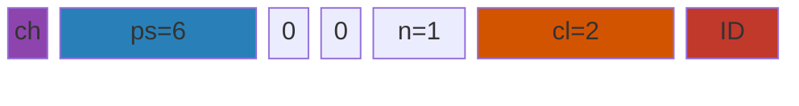
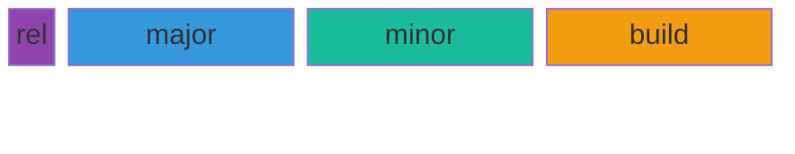
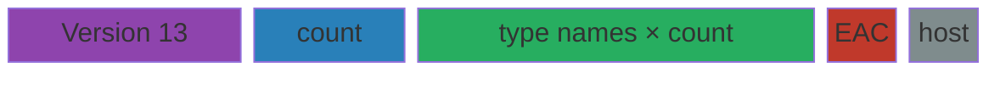
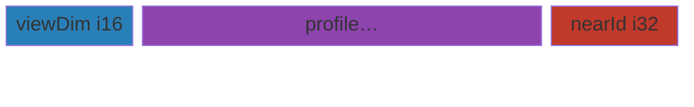
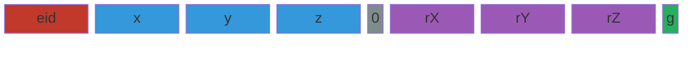
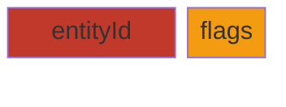
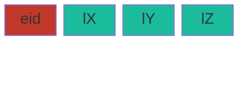
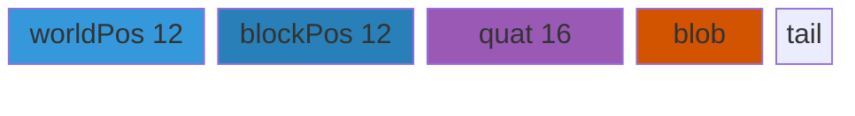

# Wire frames (visual) · 7DTD V3.0.1

**Owns:** left-to-right byte/field strips for envelope + golden packages (classic protocol style).  
**Companion:** narrative join/policy in [protocol.md](protocol.md).  
**Evidence:** loadgen `PackageCodec` · dedi-complete census.  
**Clone:** [`../../zdtd/`](../../zdtd).

## How to read these diagrams

Frames are drawn **left → right** in wire order (first byte on the left).  
Multi-row packages continue on the next line, still left → right.

```text
  offset →    0        1        2        3        4        5        …
              | field  | field           | field                    |
              +--------+-----------------+--------------------------+
```

| Convention | Value |
|---|---|
| Endianness | multi-byte integers/floats are **little-endian** |
| Packing | **no padding**; fields abut |
| `bool` | 1 byte |
| `string` | .NET BinaryWriter: 7-bit length + UTF-8 (variable width) |
| `pkgId` | dynamic; written as `ID` in diagrams |
| Units under bars | byte counts |

Mermaid `block-beta` strips are the same idea: one horizontal row, spans ≈ sizes. No nested boxes.

---

## 1. Challenge (raw, before game envelope)

17 bytes total. **Not** inside the channel envelope.

```text
 offset   0          1                                                              16
          +----------+---------------------------------------------------------------+
          |   0xCA   |                      Guid (16 bytes)                          |
          |  marker  |                                                               |
          +----------+---------------------------------------------------------------+
 size:        1      |                             16                                |
```

| Off | Len | Bits / meaning |
|---:|---:|---|
| 0 | 1 | Protocol marker `0xCA` (202) |
| 1 | 16 | Challenge Guid; client echoes **all 17 bytes** |


---

## 2. Game channel envelope + package stream

After challenge, every LiteNet game message is one horizontal stream:

```text
 offset   0     1              5      6      7        9
          +-----+--------------+------+------+---------+------------------//
          | ch  | payloadSize  | cmp  | enc  | pkgCount|  payload …        //
          | u8  |    i32 LE    | u8   | u8   |  u16 LE |  (payloadSize B)  //
          +-----+--------------+------+------+---------+------------------//
 size:      1   |      4       |  1   |  1   |    2    |  payloadSize
```

| Off | Len | Field | Protocol note |
|---:|---:|---|---|
| 0 | 1 | channel | bots use `0` |
| 1 | 4 | payloadSize | bytes that follow this 9-byte header |
| 5 | 1 | compressed | `0` = raw (golden path) |
| 6 | 1 | encrypted | `0` = clear (golden path) |
| 7 | 2 | pkgCount | number of inner packages in payload |
| 9 | * | payload | see §2.1 |

**Invariant:** `frame_len = 9 + payloadSize`.


### 2.1 Inner package (repeated `pkgCount` times inside payload)

Still left → right; consecutive packages are concatenated.

```text
 +----------------+----------+---------------------------//
 |   contentLen   |  pkgId   |  body                     //
 |    i32 LE      |  u16 LE  |  (contentLen − 2) bytes   //
 +----------------+----------+---------------------------//
        4         |    2     |     contentLen − 2
```

| Field | Protocol note |
|---|---|
| contentLen | size of **pkgId + body only** (not including contentLen itself) |
| pkgId | type id from PackageIds map |
| body | package-specific payload |

```text
 contentLen = 2 + body_len
```


### 2.2 Empty body package (AuthConfirmation, RequestToEnterGame)

```text
 envelope: ch | payloadSize=6 | 0 | 0 | pkgCount=1
 payload:  contentLen=2 | pkgId=ID
 +-----+--------------+---+---+--------+----------------+----------+
 | ch  | payloadSize=6| 0 | 0 | count=1 | contentLen = 2 |  pkgId   |
 +-----+--------------+---+---+--------+----------------+----------+
    1         4         1   1     2             4            2
 frame_len = 15
```



---

## 3. Version blob (inside PackageIds body)

13 bytes, left → right:

```text
 +------+--------------+--------------+--------------+
 | rel  |    major     |    minor     |    build     |
 | u8   |    i32 LE    |    i32 LE    |    i32 LE    |
 +------+--------------+--------------+--------------+
     1         4              4              4
```

Golden live: `rel=1, major=3, minor=1, build=4` → display **`V 3.0.1`**.



---

## 4. PackageIds body (after envelope + pkgId)

Logical stream (variable length):

```text
 +-------------+----------+------------//-----------+--------+----------+
 |   Version   |  count   |  name[0] … name[count-1] | useEac | hasHost  |
 |   13 bytes  |  i32 LE  |  strings (BinaryWriter)  |  bool  |  bool    |
 +-------------+----------+------------//-----------+--------+----------+
       13      |    4     |         variable         |   1    |    1
```

| Segment | Meaning |
|---|---|
| Version | §3 |
| count | number of type names |
| name[i] | C# type name; **index i is pkgId i** |
| useEac | server EAC flag |
| hasHost | if true, more platform-user fields follow |



Live head (hex, channel 0, one package, pkgId 0):

```text
00 | BC120000 | 00 | 00 | 0100 | B8120000 | 0000 | 01 03000000 01000000 04000000 | BD000000 | …
ch   ps=4796    c    e    n=1    contentLen  ID=0   version 1/3/1/4                    count=189
```

---

## 5. PlayerLogin body

Variable-width string stream (left → right):

```text
 +------+--------+-------+--------+-------+---------+----------+------------+
 | name | platU  | platT | crossU | crossT| verLong | compVer  | discordId  |
 | str  | stream | str   | stream | str   | str     | str      |   u64 LE   |
 +------+--------+-------+--------+-------+---------+----------+------------+
   var     var     var     var     var      var       var           8
```

### PlatformUser stream (embedded)

```text
 null:   +---+
         | 0 |
         +---+
          1

 present:+---+----+----------+---------+
         | 1 | 1  | platform | userId  |
         |tag|tag2|  string  | string  |
         +---+----+----------+---------+
           1   1       var        var
```


---

## 6. RequestToSpawnPlayer body

```text
 +--------------+---------------------------//------------+----------------+
 | chunkViewDim |      PlayerProfile v5                   | nearEntityId   |
 |    i16 LE    |  ver i32 | strings/bools…               |    i32 LE      |
 +--------------+---------------------------//------------+----------------+
        2       |           variable                      |       4
```

Profile v5 order: `version=5 | archetype str | isMale | race str | variant u8 | hair | hairColor | mustache | chops | beard | eyeColor`.



---

## 7. EntityPosAndRot body (!bUseQ) · 30 bytes

```text
 0        4        8        12       16  17       21       25       29  30
 +--------+--------+--------+--------+---+--------+--------+--------+---+
 |entityId|   x    |   y    |   z    |q=0|  rotX  |  rotY  |  rotZ  | g |
 |  i32   |  f32   |  f32   |  f32   |u8 |  f32   |  f32   |  f32   |u8 |
 +--------+--------+--------+--------+---+--------+--------+--------+---+
      4        4        4        4     1      4        4        4     1
```

| Off | Len | Field | Notes |
|---:|---:|---|---|
| 0 | 4 | entityId | |
| 4 | 4 | pos.x | IEEE-754 f32 LE |
| 8 | 4 | pos.y | |
| 12 | 4 | pos.z | |
| 16 | 1 | bUseQRotation | `0` ⇒ Euler floats follow |
| 17 | 4 | rot.x | degrees as f32 |
| 21 | 4 | rot.y | |
| 25 | 4 | rot.z | |
| 29 | 1 | onGround | |
| 30 | | end | contentLen = **32** with pkgId |



---

## 8. EntityRelPosAndRot body (!bUseQ) · 20 bytes

```text
 0        4  5    7    9    11   13   15   17 18     20
 +--------+--+----+----+----+----+----+----+--+------+
 |entityId|q0|rX  |rY  |rZ  | dx | dy | dz |g |steps |
 |  i32   |  |i16 |i16 |i16 |i16 |i16 |i16 |  | i16  |
 +--------+--+----+----+----+----+----+----+--+------+
      4    1   2    2    2    2    2    2   1    2
```

| Off | Len | Field | Notes |
|---:|---:|---|---|
| 0 | 4 | entityId | |
| 4 | 1 | bUseQRotation | `0` ⇒ i16 rot, **no** quat |
| 5 | 2 | rotX | packed: deg/360×256 → i16 |
| 7 | 2 | rotY | |
| 9 | 2 | rotZ | |
| 11 | 2 | dx | relative translation |
| 13 | 2 | dy | |
| 15 | 2 | dz | |
| 17 | 1 | onGround | |
| 18 | 2 | updateSteps | |
| 20 | | end | contentLen = **22** with pkgId |


### Same package, bUseQ = 1 · body 30 bytes

```text
 +--------+--+------------------+--+----+
 |entityId|q1| qx qy qz qw (4×f32) |dPos| g |steps|
 |  i32   |  |       16 bytes      |6B  |1B | i16 |
 +--------+--+---------------------+----+---+-----+
      4    1            16            6   1    2   = 30
```

Do **not** emit both Euler i16 and quat on the same write.

---

## 9. EntityAliveFlags body · 6 bytes

```text
 +--------+--------+
 |entityId| flags  |
 |  i32   |  u16   |
 +--------+--------+
      4        2
```



### flags u16 (bit 0 = LSB, left in this bit row is bit 0)

```text
 bit:  0   1   2   3   4   5   6   7   8   9  10…15
      +---+---+---+---+---+---+---+---+---+---+----
      | E | P | G | S | J | B | A | F |Gm | C | 0…
      +---+---+---+---+---+---+---+---+---+---+----
 E  ApproachingEnemy   0x0001
 P  ApproachingPlayer  0x0002
 G  AimingGun          0x0004
 S  Spawned            0x0008
 J  Jumping            0x0010
 B  BreakingBlocks     0x0020
 A  IsAlert            0x0040
 F  FlashlightOn       0x0080
 Gm GodMode            0x0100
 C  Crouching          0x0200
```


---

## 10. EntityLookAt body · 16 bytes

```text
 +--------+--------+--------+--------+
 |entityId| lookX  | lookY  | lookZ  |
 |  i32   |  i32   |  i32   |  i32   |
 +--------+--------+--------+--------+
      4        4        4        4
```

(Look floats are cast to int on write.)



---

## 11. DamageEntity body (prefix, left → right)

Fixed head through `blockPos` (then variable string + tail; see protocol.md for full tail):

```text
 0        4  5  6    8  9   11 12 13 14 15       19              31              43
 +--------+--+--+----+--+---+--+--+--+--+--------+---------------+---------------+
 |entityId|s |t |str |hd|bp |ms|p |f |c |attacker|    dirV 3×f32 | blockPos 3×i32|
 |  i32   |u8|u8|u16 |u8|i16|u8|… bools…|  i32   |      12 B     |     12 B      |
 +--------+--+--+----+--+---+--+--+--+--+--------+---------------+---------------+
```

| Off | Len | Field | Protocol bits |
|---:|---:|---|---|
| 0 | 4 | entityId | target |
| 4 | 1 | damageSource | 0 External, 1 Internal |
| 5 | 1 | damageType | 3 Bash, 16 Suffocation (drown), 26 Suicide, … |
| 6 | 2 | strength | u16 |
| 8 | 1 | hitDirection | |
| 9 | 2 | hitBodyPart | i16 |
| 11 | 1 | movementState | |
| 12 | 1 | bPainHit | |
| 13 | 1 | bFatal | |
| 14 | 1 | bCritical | |
| 15 | 4 | attackerEntityId | |
| 19 | 12 | dirV | 3×f32 |
| 31 | 12 | blockPos | 3×i32 |
| 43 | * | hitTransformName + tail | var |


---

## 12. ExplosionInitiate body (segments, L→R)

```text
 +-------------+-------------+----------------+------------------+------------------//
 | worldPos    | blockPos    | rotation quat  | blobLen + blob   | eid · delay · …  //
 |  3×f32 = 12 |  3×i32 = 12 |  4×f32 = 16    | u16 + data       | rest of package  //
 +-------------+-------------+----------------+------------------+------------------//
```



---

## 13. Full frame: one RelPos on the wire (35 bytes)

Envelope + single RelPos body (channel 0, cleartext):

```text
body=20  contentLen=22  payloadSize=26  frame=35

 0  1           5  6  7     9           13    15                    35
 +--+-----------+--+--+-----+-----------+-----+---------------------+
 |ch|payloadSize|0 |0 | n=1 | contentLen|pkgId| RelPos body 20 B    |
 |0 |    26     |  |  |     |    22     | ID  |                     |
 +--+-----------+--+--+-----+-----------+-----+---------------------+
  1      4       1  1   2        4        2            20
```


---

## 14. Server package selection (policy, not bytes)

Outbound choice thresholds (for implementers), as a **horizontal decision strip** of outcomes:

```text
 delta large ──► Teleport ──► PosAndRot ──► RelPos ──► Velocity ──► Flags ──► (none)
   |≥256 axis|    |≥128/age|    |small|      |motion|    |dirty|
```

Details: [network.md](network.md) §2.

---

## 15. Adding a package

1. Measure write order and sizes.  
2. Draw **one L→R strip** with offsets on top and sizes under the bar.  
3. Optional: matching flat `block-beta` (`columns = body_len`).  
4. Note `contentLen = 2 + body_len`.  
5. Link from [protocol.md](protocol.md).

---

## Related

| Doc | Role |
|---|---|
| [protocol.md](protocol.md) | Join SM, narrative |
| [network.md](network.md) | Interest / scaling |
| [inventories/netpackages.md](inventories/netpackages.md) | Type census |
| loadgen PackageCodec | Golden builders |

## Changelog

- **2026-07-20:** Rewrite as left-to-right protocol strips (RFC bars + flat Mermaid); drop nested box diagrams.
- **2026-07-20:** Initial visual catalog.
