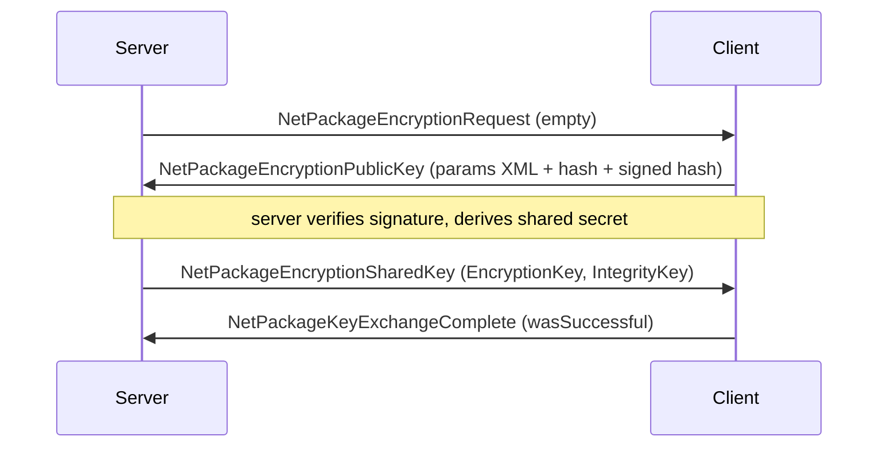

# Wire package body catalog (V3.1.0 pin; IL-derived)

**Owns:** per-`NetPackage` wire metadata (channel/compress/direction/auth) and
hand-annotated `read`/`write` byte layouts beyond the join-critical set in
[`protocol.md`](protocol.md).
**Hub:** [`INDEX.md`](INDEX.md).  
**Pin:** dedicated V **3.1.0 (b14)**; dump set dir name `il/netpackages-v3.1.0/`
is historical (regenerate against live ASM).
**Not:** framing/join/challenge (that is [`protocol.md`](protocol.md)); visual
frames ([`protocol-frames.md`](protocol-frames.md)).
**Evidence:** dumped from the live `Assembly-CSharp.dll` with
[`../tools/`](../tools) (`DumpNetPackages`, `NetProtocolCensus`, `DumpType`);
raw output under `il/` (git-ignored). Every field below traces to a
specific `BinaryWriter::Write`/`BinaryReader::Read` in the method body.
**Method:** [`re-methodology.md`](re-methodology.md) §4-5.

All widths little-endian. `string` = .NET 7-bit length prefix + UTF-8. `bool` =
1 byte. Length-prefixed `byte[]` = `Int32` length then bytes (`Read(buf,0,len)`).

---

## 1. Protocol-wide metadata census

Full table: `il/netpackages-v3.1.0/META.md` (193 packages). Regenerate with
`mono bin/NetProtocolCensus.exe "$ASM" ../il/netpackages-v3.1.0/META.md`.

**Per-package wire bodies:** this doc hand-annotates the load-bearing packages; the
**complete** ordered `write()` field sequence for every package (183 bodies + 61
nested serializers) is auto-extracted in
[`inventories/netpackage-bodies.md`](inventories/netpackage-bodies.md)
(`tools/src/WireBodies`).

### 1.1 Channels (correction to the "channel 0 only" assumption)

Most packages inherit the base **channel 0**. Exactly **6 override to
channel 1** (the bulk / terrain / map band):

| Channel-1 package | Role |
|---|---|
| `NetPackageChunk` | full chunk terrain push |
| `NetPackageChunkRemove` | chunk unload |
| `NetPackageMapChunks` | compressed map (minimap) tiles |
| `NetPackageDynamicMesh` | dynamic mesh (destroyed-block geometry) |
| `NetPackagePOIAround` | POI/prefab region data |
| `NetPackageWorldFolder` | world-folder file transfer |

**`NetPackageWorldFolder.prepareWorldFolderData` (IL=3 async stub;
`<prepareWorldFolderData>d__31::MoveNext` IL=387) is the server-side
sender.** After a `WaitForSeconds` on `GamePrefs` 189 it logs `Preparing
World chunks for clients` and streams the world folder through a
`MemoryStream` + `DeflateOutputStream` (compression level 3): the file list
comes from `GameUtils.GetWorldFilesToTransmitToClient` (the `_processed` /
`GenerationInfo` / `Version.txt` / `checksums.txt` / `.bak` filter), each
entry is written as `"/name"` + `length:i64` then copied in 4096-byte
buffers, frame-budgeted by `get_MaxTimePerFrame`; `dtm.raw` is special-cased
through the `writeDtmDelta` coroutine (delta-compressed heightmap). After
the copy the zip is flushed and the compressed payload is split into
**65536-byte (64 KiB) parts** (`totalParts = length / 65536`, with the
remainder as the final shorter part), each shipped as a
`NetPackageWorldFolder(seqNr, totalParts, part)` - the wire body the client
reassembles in order.

**`NetPackageWorldInfo.PrepareWorldHashes` (IL=83)** is the companion
validation blob: from `ChunkProviderGenerateWorldFromRaw.worldFileCrcs`
(null when the provider is not the raw generator, making `worldDataSize` 0
and the list empty) it filters the CRC keys through the same
`GetWorldFilesToTransmitToClient` and serializes
`count:i32` + per file `name:string` + `crc:u32` into the static
`worldHashesData` byte array the `WorldInfo` package ships, so the client
can verify its local world files match the server's.

**The world-folder receive side (client):** `sendPacketsToClient(cInfo)`
(IL=6, coroutine `<sendPacketsToClient>d__33` MoveNext IL=84) waits for the
static `CompressedWorldDataChunks` list, logs `Starting to send world to
{cInfo}...`, and per 64 KiB chunk ships
`NetPackageWorldFolder.Setup(chunk, i, count)` through
`ClientInfo.SendPackage`, pacing with `WaitForSeconds(PACKET_SEND_DELAY)`,
then logs `Sending world to {cInfo} done`.
`TestWorldValid(locationPath, hashes, callback)` (IL=12, `<TestWorldValid>d__17`
MoveNext IL=129) verifies the client's local world against the
`PrepareWorldHashes` blob: per `(file, crc)` entry a missing file logs
`World file {0} does not exist` and fails, else `IOUtils.CalcCrcCoroutine`
(15 ms budget, 8192-byte buffer) checks the crc against the expected value,
and the callback gets `true` only when every entry matches.
`uncompressWorld()` (IL=3, `<uncompressWorld>d__19` MoveNext IL=321) unpacks
the received blob into `{save}/World`: it rewinds `ReceiveStream` through a
`DeflateInputStream`, reads `fileCount:i32`, then per file the name
(`string`) and size (`i64`); a name with a leading dot or a path separator
is rejected (`Received world files contains file with parent path specifier
or path separator: {name}`) and drained, `dtm*.raw` files are delta-decoded
through the `readDtmDelta` coroutine (IL=15, `<readDtmDelta>d__20` MoveNext
IL=165: `w = h = sqrt(fileSize / 2)`, ushort-per-pixel rows with a running
delta sum, `Current out of range:` logged outside 0..65535, frame-budgeted
by `get_MaxTimePerFrame`), and every other file is stream-copied in
4096-byte pooled chunks; finally it writes an empty `{worldFolder}/completed`
marker and sets `WorldReceivedAndUncompressed = true`.

**`NetPackageLocalization`** (the patched-localization download, join-phase
twin of the world folder): `prepareDataPackets(patchedData)` (IL=107) sets
`PACKET_SEND_DELAY = WaitForSeconds(131072 / (pref 189 * 1024))` when the
bandwidth pref is positive, logs `Preparing Localization chunks for clients`,
splits the blob into **128 KiB** chunks (log `Localization size: {0} B, chunk
count: {1}`) into the static `dataChunks`, and caches `cachedDataSize`;
`Setup(data, seqNr, totalParts)` (IL=11) stores the three body fields; the
`sendPacketsToClient(cInfo)` coroutine (`<sendPacketsToClient>d__21` MoveNext
IL=84) is the Localization twin of the WorldFolder sender (same wait, per-
chunk `Setup` + `SendPackage`, `PACKET_SEND_DELAY` pacing, `Sending
Localization to {cInfo} done`).

**`NetPackageDynamicClientArrive`** (client-side dynamic-mesh region list,
one of the 8 `get_Compress = 1` bodies): `BuildData()` (IL=34) walks
`DynamicMeshManager.Instance.ItemsDictionary` values, mapping each
`DynamicMeshItem` through `FromPool` (IL=10) into
`RegionItemData(worldPosition.x, worldPosition.z, item.UpdateTime)` appended
to `Items`, logging `Client package items: {count}`.

`protocol.md` previously said game packages use channel 0 and treated other
channels as "later". Channel 1 is the real second band and it carries the
heaviest bodies. A clone must bind/route both channels.

### 1.2 Compressed packages

**8 packages set `get_Compress = 1`** (payload deflate-compressed regardless of
the envelope bot path): `NetPackageChunk`, `NetPackageMapChunks`,
`NetPackageDynamicMesh`, `NetPackagePOIAround`, `NetPackageConfigFile`,
`NetPackageDynamicClientArrive`, `NetPackageIdMapping`,
`NetPackageSignDataResponse`. So bulk terrain/map/config is compressed on the
wire even though the join handshake packets are not. This nuances
[`protocol.md`](protocol.md) §8 ("bots use uncompressed path"): true for the
join set, false for these bulk packages.

### 1.3 Direction tally

`NetPackageDirection`: `0 = Both`, `1 = ToServer`, `2 = ToClient`.
Of 193 packages: **66 ToClient, 33 ToServer, 7 Both (explicit), 87 inherit**
(base default = Both).

### 1.4 Pre-auth surface (`AllowedBeforeAuth = 1`)

Exactly **10 packages** may cross the wire before authentication. This is the
complete attack/handshake surface a server must accept pre-auth:

`NetPackagePackageIds`, `NetPackagePlayerLogin`, `NetPackagePlayerDenied`,
`NetPackageAuthConfirmation`, `NetPackageAuthState`, `NetPackageEAC`,
`NetPackageEncryptionRequest`, `NetPackageEncryptionPublicKey`,
`NetPackageEncryptionSharedKey`, `NetPackageKeyExchangeComplete`.

---

## 2. Encryption handshake (closes the `residuals.md` "encryption wire path")

All four packages are `AllowedBeforeAuth`. This is a public-key agreement that
establishes a symmetric session key + separate integrity key.



Bodies (from `write`):

**NetPackageEncryptionRequest** - empty body (id only). Server -> client trigger.
Process **IL=4**: `AntiCheatEncryptionAuthClient.StartKeyExchange()`.

**NetPackageAuthConfirmation** Process **IL=17**: server
`AuthFinalizer.ReplyReceived(Sender)`; client `SendToServer` empty Setup ack.

**NetPackageEncryptionPublicKey**
```text
ExchangePublicKeyParamsXml : string    // .NET public-key params as XML
Hash        : i32 len + byte[len]      // length-prefixed
SignedHash  : i32 len + byte[len]      // signature over Hash
```

**NetPackageEncryptionSharedKey**
```text
EncryptionKey : i32 len + byte[len]    // symmetric session key material
IntegrityKey  : i32 len + byte[len]    // separate MAC/integrity key
```

**NetPackageKeyExchangeComplete** Process **IL=8**:
`AntiCheatEncryptionAuthServer.CompleteKeyExchange(Sender, wasSuccessful)`.

**Also thin join helpers:** `NetPackageConfigFile` Process IL=6 ->
`WorldStaticData.ReceivedConfigFile(name, bytes)`;
`NetPackageWorldSpawnPoints` Process IL=5 -> `GameManager.SetSpawnPointList`.

**`NetPackageWorldSpawnPoints` body** (`SpawnPointList.Write` IL=25): version
byte **2** (`SpawnPointList.CurrentSaveVersion`, cctor) + count i32 + per point
26 B: `u16 0` (`SpawnPosition.Write` IL=23 writes it unconditionally) +
`Vector3` 3xf32 + heading f32 + team i32 + activeInGameMode i32.
**Divergence from the on-disk form** (save-region.md §1.1b): the WorldState
`main.ttw` save path writes the same list with a **hardcoded version byte 0**
(`SpawnPointList.Read(IBinaryReaderOrWriter)` IL=33 feeds `ldc.i4.0` into
`ReadWrite(Byte)`), so disk per-point records omit the u16 (24 B). A reader
must not assume the two serializers agree on the version byte or the u16.

**NetPackageKeyExchangeComplete**
```text
wasSuccessful : bool
```

Failure is surfaced through `EKickReason` (see §6): `EncryptionFailure(19)`,
`EncryptionAgreementInvalidSignature(33)`, `EncryptionAgreementError(34)`. The
signed-hash + separate integrity-key shape indicates signature-verified key
agreement followed by authenticated symmetric encryption; the exact cipher and
KDF are in native/crypto library calls, not the package bodies (residual).

---

## 3. Terrain / chunk band (channel 1)

### 3.1 NetPackageChunk (ToClient, channel 1, compressed)

`write` order:
```text
bOverwriteExisting : bool
if bOverwriteExisting:
    chunkX : i16    // conv.i2 from Chunk.X
    chunkY : i16    // Chunk.Y
    chunkZ : i16    // Chunk.Z
dataLen : i32       // == serializedData.Length
data    : dataLen bytes   // Chunk.write() blob (same codec as save), then StreamCopy
```
The `data` blob is produced in `Setup()` by `Chunk::write(PooledBinaryWriter)` -
the 1-arg wrapper (IL=5) forwards to `write(stream, bNetworkWrite=true)`, so the
wire blob is the **network variant** of the shared codec, not the save variant
([`save-region.md`](save-region.md) §2): stability channel skipped, custom-data
count network-filtered, tile entities written in `StreamModeWrite 2`,
sleeper/trigger volumes skipped while **wall volumes are always written**, and
a trailing `false` network flag. `GetLength` = 14 + serializedData.Length.

**ProcessPackage (IL=126):**

1. If world null: log `Received chunk while world is not set up`; free pooled
   chunk if present; ret.
2. Key = overwrite ? `MakeChunkKey(X,Z)` : `chunk.Key`.
3. If cache already has chunk and **not** overwrite: log error `chunk already
   loaded`; ret.
4. If overwrite: `MultiBlockManager.DeregisterTrackedBlockDatas(AABB)`.
5. If **not** overwrite: `AddChunkSync(chunk)`; `NeedsRegeneration=true`; clear
   package chunk ref; ret.
6. If overwrite and existing chunk present: unload (`OnUnload`),
   `RemoveChunkSync`, `Reset`, `Chunk.read(data, u32=-1)`, `AddChunkSync` again.

### 3.2 NetPackageChunkRemove (ToClient, channel 1)
```text
chunkKey : i64      // WorldChunkCache key (packed x,z)
```

Process **IL=8**: `GameManager.RemoveChunk(chunkKey)`. Related
`NetPackageChunkRemoveAll` Process IL=8: `ChunkManager.RemoveAllChunks()`.


### 3.3 NetPackageMapChunks (ToClient, channel 1, compressed)

Minimap color tiles, not terrain. Produced by
`IMapChunkDatabase.GetMapChunkPackagesToSend` and appended in
`SendChunksToClients` when the observer has a `mapDatabase`
([world-chunks.md](world-chunks.md) section 4.0).

**Metadata:** channel **1**, `Compress=true`, direction **ToClient** (2).

**`write` order (IL=109):**
```text
entityId     : i32
count        : u16   // number of map pieces that will follow
// per piece (only pieces whose UInt16[] length == 256 are written):
  chunkDbKey : i32   // IMapChunkDatabase.ToChunkDBKey
  colors     : u16 x 256
```

If any piece has length != 256, the writer logs a warning, decrements the planned
count, and **rewinds** the stream to rewrite the `u16` count after the loop
(so a bad piece is omitted without leaving a stale count).

**ProcessPackage (IL=26):** resolve player entity; `IMapChunkDatabase.Add(keys,
color arrays)` for minimap DB.

**`GetLength` (IL=24):** `4 + 8*chunkCount + 512*pieceCount` (entityId +
per-chunk key+pad estimate + 256 u16 colors). Not an exact wire length after
invalid-piece filtering.

**`Setup(entityId, List<int> chunks, List<ushort[]> mapPieces)`** copies both
lists.

**`ProcessPackage` (client, IL=26):** resolve `entityId` to `EntityPlayer`; if
that player has `ChunkObserver.mapDatabase`, call
`mapDatabase.Add(chunks, mapPieces)`.

**Producer (`MapChunkDatabase.GetMapChunkPackagesToSend`, IL=96):**

1. No-op (`null`) unless `bClientMapMiddlePositionUpdated` (set by map-position
   C2S path); then clear the flag.
2. Clear send lists. Convert `clientMapMiddlePosition` via `toChunkXZ`.
3. Scan a **17x17** window: offsets `dx,dz in [-8..+8]` (literal radius **8**).
4. For each key not yet in `chunksSent` and present in the fixed datastore:
   add db key + `UInt16[256]` colors; mark sent.
5. If any queued, `NetPackageMapChunks.Setup(playerId, toSendList, mapPiecesList)`.

`MapChunkDatabaseByRegion` (IL=123) is the same window under `m_regionsLock`,
looking up region+offset storage instead of the fixed DS.

**Related C2S:** `NetPackageMapPosition` (direction ToServer) carries
`entityId` + `mapMiddlePosition` and drives the middle-position update that
arms the next map send.


---

## 4. World state band

### 4.1 NetPackageWorldTime (ToClient)
```text
worldTime : u64
```

### 4.2 NetPackageWorldInfo (join world descriptor)
`write` order:
```text
gameMode   : string
levelName  : string
gameName   : string
guid       : string
ppList present : bool
ppList     : PersistentPlayerList.Write (if present)
ticks      : u64
fixedSizeCC: bool
firstTimeJoin : bool
worldHashes : i32 count + count x { filename:string, hash:u32 }  // NOT a byte-length blob
worldDataSize   : i64
```

The leading `i32` on `worldHashes` is an **entry count**, not a byte length: the
`read` IL parses `count` then a `{ string filename, u32 hash }` pair per entry into
a `Dictionary<string,uint>`, then `worldDataSize:i64`. (The `write` side emits the
already-serialized dictionary bytes via `BinaryWriter.Write(byte[])`, but the count
prefix is inside that blob, so on the wire it reads as count + entries.) A clone that
treats the `i32` as a byte length desyncs the stream and misparses `worldDataSize`.

#### `fixedSizeCC` and client chunk provider (critical for terrain textures)

`fixedSizeCC` is applied to `ChunkCluster.IsFixedSize`. On the **client**
(`ChunkCluster/<Init>d__45`, provider id `NetworkClient=3`):

| `fixedSizeCC` | Client `IChunkProvider` | Local world data |
|---|---|---|
| **true** | `ChunkProviderDummy` | **No** DTM/splat load; chunks only from net |
| **false** | `ChunkProviderGenerateWorldFromRaw(bClientMode=true)` | Loads `dtm.raw`, `biomes.png`, **`splat*.png`** from local `Data/Worlds/<levelName>` |

**MicroSplat terrain floor:** when `World.IsSplatMapAvailable` (levelName not
empty/`Playtesting`), `VoxelMeshTerrain.ConfigureTerrainMaterial` binds
`_CustomControl0/1` from `FromRaw.splats[]`. With **Dummy**, those textures stay
null and the whole terrain mesh samples empty controls → **uniform grey clay**,
even when block type ids and density are correct.

**Spawn overlay (`XUiC_SpawnSelectionWindow.updateLoadState`):**

- `fixedSizeCC=true` → required CGO threshold **0** (overlay closes immediately).
- `fixedSizeCC=false` → required CGO ≥ `viewDist² − 10` (e.g. viewDist 7 → **39**).

Only **displayed** chunk game objects count (`GetDisplayedChunkGameObjectsCount`),
not chunks merely received. Mesh needs a ~2-chunk neighbor halo, so a stream
radius of 4 yields at most an inner **5×5 = 25** CGO and wedges the overlay at
25/39. Stream radius must be **≥6** (prefer match client viewDim, cap 8) so the
meshable core clears the gate.

**Clone guidance (Navezgane / stock maps with splats):** send `fixedSizeCC=false`
and stream a hole-free disk large enough for the CGO gate. Do **not** set
`fixedSizeCC=true` only to dodge the overlay: that kills splat loading and greys
the floor.

### 4.3 NetPackageWorldInitInfo (ToClient)
`write` order (both lists are count-prefixed; verified against `write` IL=57 /
`read` IL=58):
```text
eventPrefabs count : i32
  per entry        : PrefabInstance.Serializable.Write   // repeated count times
wallVolumes  count : i32
  per entry        : i32 (tuple Item1) + WallVolume.Write // repeated count times
```
There is **no separate trailing `dataLength`** (an earlier note listed one; the
read side reads only the two counts and their entries). `PrefabInstance.Serializable`
and `WallVolume` own their own field layout (dump locally with `tools/src/DumpType`).
The request form `NetPackageWorldInitInfoRequest` has an empty body (`write` IL=4).

---

## 5. Entity + gameplay band

### 5.0 NetPackageRequestToSpawnEntity (ToServer)

Client-authored spawn request (vehicle/turret/item place, falling tree, etc.).

```text
// body is only:
EntityCreationData.write(_bw, networkWrite=true)   // same codec as 5.1
```

- Direction **ToServer** (1). Channel base **0**.
- `Setup` stores `ecd`; `ProcessPackage` calls
  `IGameManager.RequestToSpawnEntityServer(ecd)` when world non-null.

**`GameManager.RequestToSpawnEntityServer` (IL=101):**

1. If **not** server: re-wrap as this package and `SendToServer` (host client
   path).
2. If `entityClass` hash equals `"fallingTree"`: scan live entities for an
   existing `EntityFallingTree` at the same `blockPos`; **return without spawn**
   if found (dedupe).
3. `EntityFactory.CreateEntity(ecd)`.
4. If result is `EntityBackpack`: find matching `PersistentPlayerData` by
   `RefPlayerId`, `AddDroppedBackpack(entityId, pos, worldMinutes)`.
5. `World.SpawnEntityInWorld(entity)` (registers + NetEntityDistribution tracks;
   clients later get `NetPackageEntitySpawn` via interest).

This is the **C2S place/create** path. The S2C visual/create for remote clients
is still `NetPackageEntitySpawn` (5.1), not a direct echo of this package.

### 5.1 NetPackageEntitySpawn (ToClient)
Body is a single `EntityCreationData.write(writer, networkWrite=true)`. The body is
**three ordered sections**: an unconditional header, an `entityClass`-switched
middle, and a convergence tail. The middle switch is the part a clone gets wrong
most easily (verified against the `write` IL branch structure, not the flat
catalog).

**(1) Unconditional header (every entity, ends at `spawnerSource`):**
```text
readFileVersion : byte
entityClass     : i32
id              : i32
lifetime        : f32
pos.x, pos.y, pos.z : f32 x3
rot.x, rot.y, rot.z : f32 x3
onGround        : bool
BodyDamage.Write
stats present   : bool  (+ EntityStats.Write if present)
deathTime       : i16
bag present     : bool  (+ Bag.Write if present)
homePosition.x,y,z : i32 x3
homeRange       : i16
spawnerSource   : byte   // EnumSpawnerSource 0..4  <- header ENDS here
```

**(2) `entityClass`-switched middle (mutually exclusive; a plain zombie/NPC/animal
writes NONE of these).** The switch compares `entityClass` (an int, the
`EntityClass.list` hash) against static class ids:

| If `entityClass ==` | Writes | Note |
|---|---|---|
| `EntityClass.itemClass` | `belongsPlayerId:i32`, `clientEntityId:i32`, `itemStack.Write`, `sbyte(0)` | dropped-item entity, then **jumps straight to the tail** (skips all rows below) |
| `EntityClass.fallingBlockClass` | `blockValues[0].rawData:u32`, `textureFullArrays[0].Write` | single falling block |
| `EntityClass.fallingBlocksClass` | `blockValues.Length:i32`, then `count x rawData:u32`, then `count x Vector3i`, then `count x TextureFullArray` | multi-block, see the shared-count note below |
| `EntityClass.fallingTreeClass` | `blockPos:Vector3i` (`StreamUtils.Write`), `fallTreeDir:Vector3` (`StreamUtils.Write`) | falling tree |
| `EntityClass.playerMaleClass` or `playerFemaleClass` | `holdingItem` (`ItemValue.Write`), `teamNumber:u8`, `entityName:string`, `skinTexture:string`, `playerProfile` present:`bool` (+ `PlayerProfile.Write`) | player character |
| anything else (zombie, animal, NPC, vehicle, ...) | nothing | goes straight to the tail |

**Shared-count trap (fallingBlocks).** The multi-block branch writes **one**
`i32` length and then **three** arrays: `blockValues` (`u32` each),
`blockPositions` (`Vector3i` = 3x `i32` each), and `textureFullArrays`
(`TextureFullArray.Write` = exactly one `i64` each, its loop bound is the literal
1). No second length is emitted, and `EntityCreationData.read` allocates all three
arrays from that same value without reading another `Int32`. A clone must treat the
three arrays as the same length; writing a length before the positions or textures
desyncs the stream. The single-block `fallingBlockClass` branch has no count at all:
it is just `rawData:u32` then one `i64`.

**(3) Convergence tail (every entity):**
```text
entityData    : u16 length + bytes[]     // serialized extra blob (usually empty)
traderData present : bool  (+ TraderData.Write)
if networkWrite:                          // true for NetPackageEntitySpawn
    sleeperPose : byte
    isSleeper   : bool
    spawnById   : i32
    spawnByName : string
    spawnByAllowShare : bool
    headState   : byte
    overrideSize / overrideHeadSize : f32 x2
    isDancing   : bool
    if isSleeper:                         // ONLY when isSleeper is true
        isSleeperPassive : bool
// the junk-drone extras are OUTSIDE the networkWrite guard:
if entityClass == EntityClass.junkDroneClass:
    belongsPlayerId : i32
    orderState      : i32
// FINAL, every entity (after the junk-drone block, no guard):
stressAmount : f32
// (write always emits it; read only consumes it when readFileVersion >= 36)
```

Two gating details a clone must honour (both cost stream sync if missed):
`isSleeperPassive` is written **only when `isSleeper` is true** (`brfalse` at
IL_03B2 skips it), and the trailing `belongsPlayerId` + `orderState` pair is
**junk-drone-only and sits after the `networkWrite` block**, not inside it (the
`networkWrite` guard at IL_033F jumps to the same junk-drone test at IL_03C5).
Writing `isSleeperPassive` unconditionally adds a phantom byte to every non-sleeper
spawn; writing `belongsPlayerId` for every entity adds four, and omitting
`orderState` truncates drone spawns.

So `belongsPlayerId`/`clientEntityId`/`itemStack` are **item-entity fields, not
header fields**; a zombie spawn writes header + tail with the middle empty. The flat
per-write sequence in
[`inventories/netpackage-bodies.md`](inventories/netpackage-bodies.md) is the union
of all branches; use the switch above for the real per-class body. (Cross-checked
against the [zdtd](../../zdtd/docs/) clone's zombie spawn, which correctly writes the
empty middle.)

### 5.1.1 Wire envelope and client process

`NetPackageEntitySpawn` extends `NetPackageEntityTargeted`:

```text
// NetPackageEntityTargeted.write then ECD:
entityId : i32     // Setup copies EntityCreationData.id
// then EntityCreationData.write(_bw, networkWrite=true)  // full body in 5.1
```

- Direction **ToClient** (2). Channel inherits base **0** (not channel 1).
- `Setup(EntityCreationData)`: `NetPackageEntityTargeted.Setup(es.id)` + store `es`.
- Sole Setup caller: `NetEntityDistributionEntry.getSpawnPacket` (entity
  replication first-seen path).

**`ProcessPackage` (IL=60):**

1. No-op if world null.
2. If **not** server and `es.clientEntityId != 0`: for each local player whose
   `entityId == es.belongsPlayerId`, call
   `World.ChangeClientEntityIdToServer(clientEntityId, es.id)` and **return**
   (id remap only; no second create).
3. Else: `world.entityAsyncManager.StartCreateEntity(es, callback)` (async
   factory; callback owned by a display-class closure).

So S2C spawn is **async create**, not a synchronous `EntityFactory.CreateEntity`
on the package thread. The ECD body layout remains the clone-critical surface
(section 5.1 header/middle/tail).

### 5.2 NetPackageEntitySpawnResponse (ToClient)

Does **not** override `get_PackageDirection` (inherits base); body is a pure
**client inventory ack** after server accepted/rejected a place-spawn. Write IL=12.

```text
success   : bool
itemValue : ItemValue.Write
```

**Client `ProcessPackage` (IL=153)** (local primary player only): classifies the
item by tags `vehicle` / `drone` / `turretRanged|turretMelee`. On **success**:
clear matching `ItemActionSpawnVehicle` / `ItemActionSpawnTurret` preview when
the holding item matches, `Inventory.DecItem` by 1, play `placeblock`. On
**failure**: tooltip `uiCannotAddVehicle` / `uiCannotAddDrone` /
`uiCannotAddTurret`. Server authority for the place still lives on the
placement / `RequestToSpawnEntity` path; this package never mutates world state
on dedicated (no server Process branch).

### 5.2.1 NetPackageEntityLookAt (ToClient)

Write IL=22 / Process IL=31 / direction **ToClient** (`ldc.i4.2`).

```text
// NetPackageEntityTargeted base:
entityId : i32
// then int-truncated look-at world position:
lookAt.x : i32   // (int)Vector3.x
lookAt.y : i32
lookAt.z : i32
```

Sender (**`EntityAlive::SetLookPosition`**, IL=30, re-verified 2026-08-21):
stores the new look and returns unless it moved past the **0.0016 sqr-delta
gate** (0.04 blocks), then
`World.entityDistributer.SendPacketToTrackedPlayers(entityId, primaryPlayerId,
pkg, false)` - a broadcast to tracking players, not a full-server broadcast.
Called by the AI when an entity acquires/keeps a target, so combat zombies
track the player's head. Process: resolve `EntityAlive` by id; if
`emodel.avatarController` present, `AvatarController.SetLookPosition
(lookAtPosition)`. Cosmetic aim/look only; no sim authority.

### 5.3 NetPackageHoldingItem (ToClient)
```text
entityId         : i32
holdingItemStack : ItemStack.Write
holdingItemIndex : byte
```

Server-side carrier for the same three fields (not a NetPackage): 
`EntityNetworkHoldingData` holds `m_HoldingItemStack` + `m_HoldingItemIndex` on the
entity before `NetPackageHoldingItem.Setup` fans them to observers.

### 5.4 NetPackagePlayerInventory
```text
toolbelt present : bool  (+ ItemStack[] count-prefixed if present)
bag present      : bool  (+ Bag.Write if present)
equipment present: bool  (+ Equipment: slot count i32 + unlockedCosmetics list ...)
dragAndDropItem  : ItemStack.Write
```

**ProcessPackage (IL=36):** writes optional toolbelt/bag/equipment/drag fields
into `Sender.latestPlayerData` (`PlayerDataFile`) and sets
`bModifiedSinceLastSave = true` (server-side inventory snapshot for save, not
live entity mutate).

Also related: `NetPackagePlayerInventoryForAI` Process IL=23 ->
`AIDirector.UpdatePlayerInventory(entityId, bag/belt lists)` for smell/threat.


### 5.5 Entity motion package family (ToClient / Both)

Selection thresholds live in [network.md](network.md) section 2 (encoded
`EncodePos` space). Inheritance:

```text
NetPackageEntityTargeted
  NetPackageEntityPosAndRot          // absolute float pos/rot
    NetPackageEntityTeleport         // same wire; different ProcessPackage
  NetPackageEntityRotation           // encoded rot or quaternion
    NetPackageEntityRelPosAndRot     // rotation + i16 dPos + onGround + steps
  NetPackageEntityVelocity           // bAdd + motion f32x3
  NetPackageEntityAliveFlags         // u16 bitfield
```

#### 5.5.1 `NetPackageEntityPosAndRot` (write IL=76)

```text
entityId : i32          // EntityTargeted
pos.x,y,z : f32 x3      // absolute world position
bUseQRotation : bool
if !bUseQRotation:
  rot.x,y,z : f32 x3    // euler degrees
else:
  qrot.x,y,z,w : f32 x4
onGround : bool
```

`Setup(Entity)` copies `position`, `rotation`, `qrotation`, `onGround`,
`IsQRotationUsed()`.

`ProcessPackage` (IL=61): `ValidEntityIdForSender`; skip if attached main entity
is local primary player; set `entity.serverPos = EncodePos(pos)`;
`SetPosAndRotFromNetwork` / `SetPosAndQRotFromNetwork` with **3** update steps;
set `onGround`.

#### 5.5.2 `NetPackageEntityTeleport` (extends PosAndRot)

- **No own `write`**: inherits PosAndRot body (`Setup` calls base Setup).
- `GetLength` returns literal **20** (hint only; actual length follows PosAndRot).
- `ProcessPackage` (IL=60): same id checks; `serverPos = EncodePos(pos)`;
  `SetPosAndRotFromNetwork(pos, rot, steps=0)`; then hard
  `SetPosition(pos,true)`, `SetRotation(rot)`, `SetLastTickPos(pos)`,
  `onGround`. Missing entity logs `Discarding ... for entity Id=`.

Use for large encoded jumps (±256+); client snaps rather than interpolates.

#### 5.5.3 `NetPackageEntityRotation` (write IL=54)

```text
entityId : i32
bUseQRotation : bool
if !bUseQRotation:
  rot.x,y,z : i16 x3    // EncodeRot units (rot*256/360)
else:
  qrot.x,y,z,w : f32 x4
```

#### 5.5.4 `NetPackageEntityRelPosAndRot` (write IL=30)

Extends Rotation write, then:

```text
// after Rotation body:
dPos.x,y,z : i16 x3     // encoded delta (1/32 block)
onGround : bool
updateSteps : i16
```

`ProcessPackage` (IL=94): `serverPos += dPos`; world pos = `serverPos / 32`;
decode rot as `(rot_i * 360) / 256`; apply with `updateSteps` via
`SetPosAndRotFromNetwork` / Q variant; set `onGround`. Same attached-primary skip.

#### 5.5.5 `NetPackageEntityVelocity` (write IL=23)

```text
entityId : i32
bAdd : bool
motion.x,y,z : f32 x3   // Setup clamps each axis to [-8, 8]
```

Sender (re-verified 2026-08-21): `NetEntityDistributionEntry` sends it to
tracking players when `shouldSendMotionUpdates` is set - the entity's current
`motion` with `bAdd=false` (the package replaces, not adds). zdtd streams the
vertical component for falling/jumping zombies, delta-gated.

#### 5.5.6 `NetPackageEntityAliveFlags` (write IL=8)

```text
entityId : i32
flags : u16
```

Bit packing from `Setup` (IL=91), OR into flags:

| Bit | Value | Source |
|---:|---:|---|
| 2 | 4 | `AimingGun` |
| 3 | 8 | `Spawned` |
| 4 | 16 | `Jumping` |
| 5 | 32 | `IsBreakingBlocks` |
| 6 | 64 | `IsAlert` |
| 7 | 128 | inventory flashlight on |
| 8 | 256 | `IsGodMode` |
| 9 | 512 | `IsCrouching` |

**ProcessPackage (IL=109):** `ValidEntityIdForSender(entityId)`; resolve
`EntityAlive`; apply bits:

| Bit | Setter |
|---:|---|
| 4 | `AimingGun` |
| 8 | `Spawned` |
| 16 | `Jumping` |
| 32 | `IsBreakingBlocks` |
| 256 | `IsGodMode.Value` (DataItem) |
| 512 | `Crouching` |
| 64 | `bReplicatedAlertFlag` **only if** `isEntityRemote` |
| 128 | `Inventory.SetFlashlight` |

On **server**, rebroadcast `Setup(entity)` with flags **192** excluding sender.

### 5.6 `NetPackagePlayerData` (ToServer)

Periodic client save of local player blob (not the join ECD).

```text
// body:
PlayerDataFile.WriteNetwork(writer)   // full player file network codec
```

- Direction **ToServer** (1).
- `Setup(EntityPlayer)`: `new PlayerDataFile().FromPlayer(player)`.
- `ProcessPackage`: `ValidEntityIdForSender(playerDataFile.id)`; then
  `GameManager.SavePlayerData(Sender, playerDataFile)`.

Disk layout of `PlayerDataFile` (`ttp\0` + version **59**) is in
[save-region.md](save-region.md) section 1.3; this package is the C2S transport
only (`WriteNetwork` = `Write` + `PlayerMetaInfo`).

### 5.7 NetPackageWaypoint (ToClient / ToServer, party waypoint invites)

`write` IL=17, `read` IL=17 (both call `Waypoint.Read(_br, version=7)`), body:

```text
Waypoint (version 7, all version-gated fields present) :
  pos                  : Vector3i (3 x i32)     // StreamUtils.Write
  icon                 : string                 // "" when null
  name                 : AuthoredText           // bool present; if true:
                                                //   string text
                                                //   PlatformUserIdentifierAbs.ToStream(,false)
  bTracked             : bool
  hiddenOnCompass      : bool                   // version > 2
  ownerId              : PlatformUserIdentifierAbs.ToStream(,false)   // version > 1
  lastKnownPositionEntityId : i32               // version > 1
  bIsAutoWaypoint      : bool                   // version > 3
  bUsingLocalizationId : bool                   // version > 3
  inviterEntityId      : i32                    // version > 4
  hiddenOnMap          : bool                   // version > 5
  lastKnownPositionEntityType : i32             // version > 6
                                                    // eLastKnownPositionEntityType
                                                    //   None=0/Vehicle=1/Drone=2/Animal=3
inviteMode             : u8                     // EnumWaypointInviteMode Friends=0/Everyone=1
inviterEntityId        : i32
```

`AuthoredText.ToStream` (IL=22): `bool present`; when present `string text` then
`PlatformUserIdentifierAbs.ToStream(author, false)`; a null instance writes a
lone 0 byte. `Waypoint.Read` version gates match every field above for 7.

**ProcessPackage (IL=29):** `ValidEntityIdForSender(inviterEntityId)`; on the
server, `GameManager.WaypointInviteServer(waypoint, inviteMode, inviterEntityId)`
(IL=164): clones the waypoint and clears `bTracked`, then for
`inviteMode == Friends` (0) iterates every world player and relays to those
whose `PersistentPlayerData.IsAlly` (AllyStore on primary ids) matches the
inviter, skipping the inviter; for `Everyone` (1) relays to all players.
The relay sends `NetPackageWaypoint.Setup(waypoint, inviteMode,
inviterEntityId)` (which sets the waypoint's `inviterEntityId` too) via
`SendPackage(..., onlyClientsAttachedToAnEntity=false, -1, -1, -1, null,
range=192, false)` - the 192 is a range filter with no anchor, i.e. an
unfiltered per-target send. The client applies the invite locally
(`WaypointInviteClient`); local waypoint creation never hits the server
(waypoints are client-local; only invites do).

### 5.8 NetPackageGameMessage (ToClient / ToServer, game announcements)

`write` IL=17, `read` IL=13, body:

```text
msgType          : u8      // EnumGameMessages
                          //   PlainTextLocal=0, EntityWasKilled=1,
                          //   JoinedGame=2, LeftGame=3, ChangedTeam=4, Chat=5
mainEntityId     : i32
secondaryEntityId: i32
```

Client senders (GameManager.GameMessage, IL=61): EntityAlive.OnEntityDeath
when `isGameMessageOnDeath` (EntityWasKilled, main = the dead entity,
secondary = entityThatKilledMe if an EntityPlayer), EntityAlive.set_TeamNumber
(ChangedTeam), ConnectionManager.DisconnectClient (LeftGame), plus the
JoinedGame/Chat forms.

**Server relay (GameManager.GameMessageServer IL=51 ->
FinishGameMessageServer IL=69):** resolves the main entity's display name
(player display name, else localized entity name, else `xuiChatServer`),
fires the interruptible `ModEvents.GameMessage` hook, and unless a mod
handled it broadcasts `NetPackageWaypoint`-style unfiltered `SendPackage` of
`NetPackageGameMessage.Setup(msgType, mainEntityId, secondaryEntityId)` to
every client - including the sender, whose client displays it via
`ProcessPackage -> DisplayGameMessage` (the local send displays nothing).
A verbatim relay of the 9-byte body is byte-identical to the stock rebuild.

### 5.9 NetPackageSoundAtPosition (ToClient / ToServer, positional audio)

`write` IL=25, `read` IL=21, body:

```text
pos          : Vector3 (3 x f32)   // StreamUtils.Write
audioClipName: string
mode         : u8                  // UnityEngine.AudioRolloffMode
                                   //   Logarithmic=0, Linear=1, Custom=2
distance     : i32
entityId     : i32
volumeScale  : f32
```

`ProcessPackage` (IL=36): server side calls
`GameManager.PlaySoundAtPositionServer(pos, clip, mode, distance, entityId,
volumeScale)` (IL=60). The dedicated-server branch re-broadcasts
`NetPackageSoundAtPosition.Setup(...)` via `SendPackage(pkg, false, -1,
entityId, -1, null, 192, false)` - `allButAttachedToEntityId = entityId`, so
**every client except the owning player** hears the sound (the owner already
played it locally through `PlaySoundAtPositionClient`). The `distance` field
drives the receiving client's rolloff (`Audio.Manager.Play(pos, clip,
distance, ...)`), not the fan-out. On non-dedicated hosts the method also
plays locally and feeds `AIDirector.NotifyNoise`; on a dedicated server the
C2S relay does not add AI noise. A verbatim relay excluding that entity's
client is byte-identical to the stock rebuild.

### 5.10 NetPackageEntityAwardKillServer (ToServer, kill-credit report)

`write` IL=12, `read` IL=9, body:

```text
killerEntityId : i32
killedEntityId : i32
```

Sender: `GameManager.AwardKill(killer, killedEntity)` (IL=27), called from
`EntityAlive.OnEntityDeath` (IL=146) when `isGameMessageOnDeath` and the
killer is the local player. `ProcessPackage` (IL=24) on the server:
`World.GetEntity(killerEntityId) is EntityPlayerLocal` and
`GetEntity(killedEntityId) is EntityAlive`, then
`QuestEventManager.EntityKilled(killer, killed)`.

**Stock credit flow:** the server's kill credit is routed through the client -
the server sends `SharedKillClient` to the killer, whose client displays the
XP tooltip, calls `QuestEventManager.EntityKilled` locally for the journal,
and reports the kill back via this package so the server journal credits it.
A server that credits kill objectives authoritatively at the death path must
treat this package as a redundant echo (applying it double-credits); the
deduplicated server-side credit makes it a validated no-op.

### 5.11 NetPackageParticleEffect (ToClient / ToServer, particle relay)

`write` IL=20, `read` IL=20, body:

```text
ParticleEffect.Write            // ParticleEffect::Write IL=47
  ParticleId            : i32
  pos                   : Vector3 (3 x f32)
  rot                   : Quaternion (4 x f32)
  color                 : Color32 (4 bytes)
  soundName             : string            // "" when null
  additionalHitSoundName: string            // "" when null
  volumeScale           : f32
entityThatCausedIt      : i32
forceCreation           : bool
worldSpawn              : bool
```

`ProcessPackage` (IL=30) on the server calls
`GameManager.SpawnParticleEffectServer(pe, entityId, forceCreation,
worldSpawn)` (IL=41). The dedicated branch re-broadcasts
`NetPackageParticleEffect.Setup(...)` via `SendPackage(pkg, false, -1,
entityId, -1, null, 192, false)` - `allButAttachedToEntityId = entityId`,
so every client except the causing entity's owner sees the effect (the
owner already spawned it locally). A verbatim relay excluding that
entity's client is byte-identical to the stock rebuild.

### 5.12 NetPackageEntityStealth (ToServer, stealth report)

`read` IL=9, body:

```text
id               : i32
cFIsCrouching    : u16
cFIsSmellData    : u16
cFIsEating       : u16
cFIsSheltered    : u16
cFIsAlert        : u16
data             : u16
cSmellRadiusMin  : i32
```

The client reports its stealth state for AI detection.
`ProcessPackage` (IL=92): `ValidEntityIdForSender(id)`, resolves the
entity (discards when not an EntityPlayer), and on the server applies
`PlayerStealth.SetSmellRadiusTarget(...)` from the packed flags. A server
that computes stealth authoritatively (crouch from movement frames, smell
from buffs) can treat the report as a redundant echo.

### 5.13 NetPackageQuestGotoPoint / NetPackageQuestTreasurePoint (ToServer)

`QuestGotoPoint` (`read` IL=43): traderId i32, playerId i32, questCode i32,
questTags (FastTags), position Vector2, size Vector3, difficulty u8,
GotoType u8, biomeFilterType u8, biomeFilter string. The client reports
reaching the goto marker; `ProcessPackage` (IL=312) validates the player is
at the point and completes the objective. A server that completes goto
objectives by proximity (each tick, radius^2 check against the quest
target/POI) can treat the report as a redundant echo.

`QuestTreasurePoint` (`read` IL=54): playerId i32, distance f32, offset
i32, treasureRadius f32, questCode i32, position Vector3i, useNearby bool,
treasureOffset Vector3, blocksPerReduction i32, ActionType u8. The client
reports treasure-dig progress (`QuestPointActions` SetTreasureContainerPosition
etc.); the fetch/treasure objectives complete through the client's
`QuestObjectiveUpdate` treasure_complete event on the same server. A server
that advances the fetch phase from that event can treat this package as a
redundant echo.


---

## 6. Building band

### 6.1 NetPackageSetBlock (ToServer/ToClient)
```text
persistentPlayerId present : bool (=0 in golden) (+ PlatformUserIdentifierAbs if 1)
blockChanges count : i16
blockChanges[count] : BlockChangeInfo.Write each
localPlayerThatChanged : i32
```

**BlockChangeInfo.Write** order:
```text
BlockValueRef.Write          // packed world block position + ref
changedByEntityId : i32
flags : byte                 // bit-packed: bChangeBlockValue, bChangeDensity,
                             //   bForceDensity, bUpdateLight, bChangeDamage, bChangeTexture
if bChangeBlockValue: BlockValue.Write
if bChangeDensity:    density : sbyte
if bChangeTexture:    TextureFullArray.Write
```

**ProcessPackage (IL=59):** `ValidUserIdForSender(persistentPlayerId)` +
`ValidEntityIdForSender(localPlayerThatChanged)`; if **server**,
`GameManager.SetBlocksOnClients(localPlayer, this)` (fan-out); if
`DynamicMeshManager.CONTENT_ENABLED`, per-change `ChunkChanged`; then always
`GameManager.ChangeBlocks(persistentPlayerId, blockChanges)`.

### 6.2 NetPackageSetBlockResponse (ToClient)
```text
response : u16    // eSetBlockResponse: 0 Success, 1 PowerBlockLimitExceeded,
                  //                    2 StorageBlockLimitExceeded
```

**ProcessPackage (IL=28):** client tooltips only: response **1** ->
`uicannotaddpowerblock`; **2** -> `uicannotaddstorageblock`; success is no-op.

---

### 6.9 NetPackageWaterSimChunkUpdate (ToClient)

Jobified water sim stream ([light-mesh-water.md](light-mesh-water.md) section 4).
Direction **ToClient** (2).

**Outer wire (`write` IL=15):**
```text
sendLength : i32
sendBytes  : sendLength bytes   // prebuilt payload
```

**Inner payload** (built by Setup/AddChange/Finalize, then copied to `sendBytes`):
```text
chunkX : i32
chunkZ : i32
count  : i32                    // rewritten in FinalizeSend at lengthStreamPos
// count times:
  voxelIndex : u16              // local packed index
  mass       : u16              // WaterValue.Write = mass only
```

Pipeline:

1. `SetupForSend(Chunk)`: pool stream+writer; write X/Z; reserve count=0.
2. `AddChange(u16, WaterValue)`: write index + mass; `numVoxelUpdates++`.
3. `FinalizeSend`: seek to count slot, write `numVoxelUpdates`; copy stream to
   pooled `sendBytes`; free writer/stream.
4. `ProcessPackage` (client): read X/Z/count from pooled stream; for each entry
   `changeApplier.GetChangeWriter(key).RecordChange(index, WaterValue)`.

### 6.10 NetPackageWaterSet

Manual/console multi-cell set (not the continuous sim stream).

```text
senderEntityId : i32
count          : u16
// count times WaterSetInfo:
  worldPos     : Vector3i (via WaterSetInfo.Write)
  waterData    : WaterValue (mass u16)
```

**`ProcessPackage` (IL=29):** if server, rebroadcast package with bulk flags
**192** excluding sender (`SendPackage` entity exclude = senderEntityId); then
`ApplyChanges(ChunkCache)`: delayed regen start, per cell
`ChunkCluster.SetWater` + `World.HandleWaterLevelChanged`, delayed regen stop.

---

### 6.11 NetPackageDamageEntity

Authoritative damage event for clients (and some C2S external paths). Full field
order also in [protocol.md](protocol.md) section 6.5; re-verified against
`write` IL=176.

```text
entityId : i32
damageSrc : u8          // EnumDamageSource
damageTyp : u8          // EnumDamageTypes
strength : u16
hitDirection : u8
hitBodyPart : i16
movementState : u8
bPainHit, bFatal, bCritical : bool x3
attackerEntityId : i32
dirV : f32 x3
blockPos : Vector3i
hitTransformName : string
hitTransformPosition : f32 x3
uvHit : f32 x2
damageMultiplier : f32
random : f32
bIgnoreConsecutiveDamages, bIsDamageTransfer : bool x2
bDismember, bCrippleLegs, bTurnIntoCrawler : bool x3
bonusDamageType : u8
StunType : u8
StunDuration : f32
bFromBuff : bool
bIgnorePartyShare : bool
ArmorSlot : u8
ArmorSlotGroup : u8
ArmorDamage : u16
attackingItem present : bool (+ ItemValue.Write if true)
```

`Setup(targetId, DamageResponse)` (IL=141) flattens `DamageResponse` + nested
`DamageSource` into those fields. `ProcessPackage` (**IL=172**):

1. Null world -> ret.
2. **Local-player early outs** (when primary local player exists and
   `entityId == primary.entityId`):
   - if `damageTyp == 15` -> ret (discard);
   - if `damageSrc == 0` and (`damageTyp == 1` or `damageTyp == 25`) and
     `attackerEntityId == -1` -> ret (discard self/ambient spam on local).
3. Resolve target entity; rebuild `DamageSource` (src/type/attacker/dir/
   hitTransform/uv/ignoreConsecutive/multiplier/bonus/item/blockPos/
   ignorePartyShare) and `DamageResponse` (strength/movement/hitDir/bodyPart/
   pain/fatal/critical/random/cripple/dismember/...).
4. `Entity.FireAttackedEvents(dr)` then `Entity.ProcessDamageResponse(dr)`.

Apply path owned by [combat-damage.md](combat-damage.md).

### 6.12 NetPackageTileEntity (V3.1.0 wire)

Live TE replication (not the chunk-blob type+body list).

**V3.1.0 change (from 3.0.1):** added `teBlockId:i32` after world pos; payload
length widened from **u16** to **i32** so TE blobs can exceed 64 KiB. Fields
`MaxPackageSize`, `teBlockId` on the package type. Verified IL write=27 / read=24
on live 3.1.0.

```text
handle : u8             // Setup default 255 when omitted
teWorldPos : Vector3i
teBlockId : i32         // NEW in V3.1.0 (was absent)
payloadLen : i32        // V3.1.0 (was u16 on V3.0.1)
payload : payloadLen bytes   // TileEntity.write(network stream mode)
```

`Setup(te, streamMode[, handle])`: `te.ToWorldPos()`, write TE into pooled
stream via `TileEntity.write(writer, streamMode)`.

`ProcessPackage` (IL=103):

1. `World.GetTileEntity(teWorldPos)`; no-op if missing.
2. `SetHandle(handle)`.
3. Under lock on package stream: `te.read(reader, StreamModeRead)` with mode
   **2** if not remote world else **1**.
4. `NotifyListeners()`.
5. If server: `SetChunkModified()`; rebroadcast `NetPackageTileEntity.Setup(te,
   StreamModeWrite=2, handle)` with bulk flags **192** and optional world-center
   position for interest.

Base TE network write omits disk-only heat-map time; see
[tile-entities-power.md](tile-entities-power.md) section 2.

### 6.13 Inventory transaction packages

Server-authoritative container moves ([items.md](items.md)).

#### Request (ToServer)

```text
// body:
InventoryTransaction.Write(tx)
```

`ProcessPackage` (IL=8): `InventoryManager.TransactionRequestServer(tx, Sender.entityId)`.

**`InventoryTransaction.Write` (IL=75):**

```text
inventoryCount : i32
// per inventory:
  inventoryKey : Guid
  initialHash : i32
  finalHash : i32
  opCount : i32
  // opCount x InventoryOperation.Write
```

**`TransactionRequestServer` (IL=46):** must be server; `tx.Apply(secretToken)`;
on success `ValidateFinalHashes`; on failure log + `LockManager.ForceUnlockByPlayer`;
on success for non-primary player send `NetPackageInventoryTransactionResponse`
(flags 192) with success=true and null inventory lists (minimal ack).

#### Response (ToClient)

```text
// empty keys/inventories fast path:
success=false implied path: bool false, count 0
// full:
success : bool
count : i32
// count times:
  key : Guid
  hasStacks : bool
  if hasStacks: ItemStack.WriteArray
```

`ItemStack.WriteArray` / `ReadArray` (ItemStack.il.txt): `i16 count`, `-1` = null
(array), else count x `ItemStack.Write` (u16 stack count + ItemValue).

`InventoryTransaction.Read` (InventoryTransaction.il.txt IL=74): per entry Guid +
initialHash + finalHash + opCount + ops, then `TryGetTransactionalInventory(Guid)`;
**unknown key logs `[InventoryTransaction] Could not find inventory with key
{...}` and clears the whole op map** - the transaction then fails `Apply` (empty
map returns false) and `TransactionRequestServer` runs the failure path
(ForceUnlockByPlayer). Open RE gap: `InventoryManager.CreateInventoryServer`
(Guid.NewGuid) has **no callers in the corpus**, so the server-side registry
population path (who creates a TransactionalInventory for a container, and how
the client learns the container's Guid key) is unpinned; candidate capture: the
container-open sequence (NetPackageInventoryDataRequest + TE stream) against a
stock dedi.

Client `ProcessPackage` is currently a no-op (`ret` IL=1) on this build; server
still emits the ack for remote players.

#### Data request / response (related)

`NetPackageInventoryDataRequest`: `KeyHashPair` + `managerToken` Guid.
`NetPackageInventoryDataResponse`: success, errorMsg, inventoryKey Guid,
`ItemStack[]`, managerToken; client updates `TransactionalInventory` on success.

**Request Process (IL=92, server):**

1. `InventoryManager.TryGetTransactionalInventory(key)`.
2. Missing key -> Response success=false + error string, flags **192** to sender.
3. If `inventory.Hash == request.Hash` -> Response success=true with **null** items
   (client already current; bandwidth short-circuit).
4. Else -> Response success=true with `GetItemsReadonly()` + managerToken.

**Response Process (IL=30, client):** failure logs warning; success calls
`TransactionalInventory.UpdateInventory(items, managerToken)` when key found.

### 6.14 NetPackageExplosionInitiate (ToServer)

Client/server-placed explosives. `ProcessPackage` → `IGameManager.ExplosionServer(...)`.

**`GameManager.ExplosionServer` (IL=50):** optional air block at expl pos;
client forwards `NetPackageExplosionInitiate`; server if `_delay <= 0` calls
`explode(...)` else `StartCoroutine(explodeLater(...))`.

**`GameManager.explode` (IL=194):** `new Explosion` → `AttackBlocks` +
`AttackEntites`; copy `ChangedBlockPositions` into temp list; build
`ExplodeGroup` with `pos`, `radius=BlockRadius`, **`delay=3`**; for each change
that is air in the change list but still solid and `IsExplosionAffected` in
world, append `Falling{pos,bv}` to the group; if any fallings, push group onto
`explodeFallingGroups`. Local `ExplosionClient` (prefab + force + ChangeBlocks);
if Duration &gt; 0 set TemporaryObject life; wire `ExplosionDamageArea` buffs +
initiator; if AIDirector and not `IgnoreHeatMap`, `OnSoundPlayedAtPosition`
from AudioPlayer; if clients present, send `NetPackageExplosionClient`.

**`ExplosionData` struct (the blob behind these; Write IL=88 / Read IL=82):**

| Field | Wire | Note |
|---|---|---|
| `ParticleIndex` | i16 | the explosion particle effect id |
| `Duration` | i16 | float x10 on write, /10 on read |
| `BlockRadius` | i16 | float x20 on write, /20 (0.05) on read |
| `EntityRadius` | i16 | |
| `BlastPower` | i16 | |
| `BlockDamage` | f32 | |
| `EntityDamage` | f32 | |
| `BlockTags` | string | |
| `IgnoreHeatMap` | bool | skips the AI heat-map sound feed |
| `DamageType` | i16 | `EnumDamageTypes` |
| `damageMultiplier` | `DamageMultiplier` | nested Read/Write |
| `BuffActions` | u8 count + strings | null -> 0 |

`ToByteArray()` (IL=21) serializes through a pooled `PooledBinaryWriter`
over a `MemoryStream` - this is the blob stored in
`EntityClass.explosionData` and carried by the explosion packages, and the
`new ExplosionData(DynamicProperties, MinEffectController)` ctor builds it
from the block/item/entity XML (e.g. `ItemActionProjectile.Explosion`).

**`Explosion.AttackBlocks` damage model (IL=553):** the causer resolves to
an `EntityAlive` (for `PersistentPlayerData` + `GetBlockDamageScale`). The
effective radius is
`CeilToInt(max(0.01, GetValue(passive 21, itemValue, BlockRadius, causer,
explosionTag | itemClass.ItemTags)))`; when the center cell is terrain with a
non-terrain block above, `blockPos.y += 1` (the blast rises out of the
ground). The damage loop sweeps the **cubic** volume `[-radius, radius]^3`
around `blockPos.ToVector3Center()`; per cell it marches a ray toward the
cell (`dir = offset / |offset| * 0.51`), skipping air/water,
`StabilityIgnore` blocks, and cells already in `damagedBlockPositions`
(except the center once). Per damaged block:
`damage = max(1, GetValue(passive 19, itemValue, BlockDamage, causer, tags |
block.Tags))`, scaled by `causer.GetBlockDamageScale(block.isTerrain) + 0.5`
when a causer exists, with linear falloff
`damage * (1 - dist/radius) / (2*radius + 1)` where
`dist = max(0, |blockCenter - worldPos| - 0.5)` - blocks at the edge take a
fraction, the center takes the full scaled amount, and the `BlockTags` set
filters which blocks are touched.

**`Explosion.AttackEntites` model (IL=691):** `entityDamage` and
`EntityRadius` come from passives **20** / **21** over the source item; the
scan is `Physics.OverlapSphere(worldPos, radius, -538480653)`. Two target
classes: an **`Item`-tagged** collider resolves to an `EntityItem` (via
`RootTransformRefEntity` when needed) and, unless dead, is added to
`hitEntities` with an empty `DamageRecord`, `OnDamagedByExplosion()` and
`SetDead()` - the blast destroys item drops. An **`E_BP_`-tagged** collider
resolves through `GetHitRootTransform` to an `EntityAlive`, wakes it
(`ConditionalTriggerSleeperWakeUp`), and is gated by **line of sight**:
`Voxel.Raycast(world, ray(worldPos, dir), dist, 65536, 66, 0)` hitting a
block cancels the damage. The hit part picks an entity-class multiplier
(`Arms/Legs/Head/ChestExplosionDamageMultiplier` by the `E_BP_LArm/RArm/
LLeg/RLeg/Head` tags), and
`damage = entityDamage * partMult * (1 - dist/radius)` (linear falloff),
further scaled by passive **22** and gated at `>= 3`. Per-entity
`DamageRecord`s accumulate the part hits before the damage/buff application
in the tail of the method.

**`ExplodeGroupFrameUpdate` (IL=220):** reverse-iterate groups; each frame
`delay--`; when delay hits 0, process up to budget
`max(1, min(count, 20 * 0.73^count))` fallings: raycast down for ground;
`DropItemsOnEvent` prob **0.5**; if `ShowModelOnFall` spawn `fallingBlock` with
start velocity (horizontal clamp **0.6*18**, vertical random **-0.2..6** scale,
spin **2..15**); remove finished groups.

**`Explosion.AttackBlocks` (IL=553):** EffectManager-scaled `BlockRadius` (passive
21); optional BlockTags filter; walk blocks in radius; terrain Y adjust; damage
via block damage path into `ChangedBlockPositions`.

**`Explosion.AttackEntites` (IL=691):** EffectManager-scaled entity damage
(passive **20**) and radius (passive **21**); Physics overlap layer mask
`-538480653`; per hit transform tag → body-part multiplier
(`Legs`/`Head`/`ChestExplosionDamageMultiplier`, else 1); passive **22** scales
that mult; accumulate into `DamageRecord` dict (sum damage, union parts).

Apply pass: if `damage >= maxHealth * 0.1` or health already low path, build
`DamageSourceEntity` with `DismemberChance=0.5`, bodyParts from record;
`DamageEntity(src, (int)damage, false, 1)`. Near-center (`sqrMagnitude < 0.67`)
and random bands **0.6/0.85** feed stun/disorient flags (types **31** / **11**).

```text
worldPos : Vector3          // StreamUtils
blockPos : Vector3i
rotation : Quaternion       // StreamUtils
explosionBlobLen : u16
explosionBlob : bytes       // ExplosionData.ToByteArray()
entityId : i32
delay : f32
bRemoveBlockAtExplPosition : bool
item present : bool (+ ItemValue.Write)
```

Also summarized in [protocol.md](protocol.md) section 6.6.

### 6.15 NetPackageExplosionClient (ToClient)

Authoritative blast FX + block change list for clients.

```text
center : Vector3
rotation : Quaternion
expType : i16
blastPower : u16
blastRadius : u16
blockDamage : u16
entityId : i32
changeCount : u16
// changeCount x BlockChangeInfo.Write
```

`ProcessPackage` → `IGameManager.ExplosionClient(...)`.

**`GameManager.ExplosionClient` (IL=51):** instantiate explosion prefab by index;
`ApplyExplosionForce.Explode`; if change list non-empty `ChangeBlocks`;
`QuestEventManager.DetectedExplosion`.

### 6.16 Stat / buff sync packages

#### `NetPackageEntityStatChanged` (extends EntityTargeted)

```text
entityId : i32
instigatorId : i32
enumStat : u8
value : f32
baseMax : f32
maxModifier : f32
```

`ProcessPackage` (**IL=88**): if target is primary local player and instigator
path fails validation, ret; `ValidEntityIdForSender` on entity; apply
`Stat.set_BaseMax/MaxModifier/Value` + `Changed`; if health-related fire
`EntityAlive.FireEvent`; when **remote world**, rebuild package and
`NetEntityDistribution.SendPacketToTrackedPlayersAndTrackedEntity`.

#### `NetPackageEntityStatsBuff`

```text
entityId : i32
dataLen : i32
data : dataLen bytes     // EntityBuffs.Write / Read blob
```

`Setup` can serialize live buffs if data null. `ProcessPackage` (**IL=76**):
pooled stream -> `EntityBuffs.Read`; on **server** rebroadcast Setup flags **192**.

#### `NetPackagePlayerStats` (extends EntityTargeted)

```text
entityId : i32
EntityNetworkStats.write(...)
```

`Setup` fills `EntityNetworkStats` from entity. `ProcessPackage` (**IL=70**):
`ValidEntityIdForSender`; if not `EntityAlive` log discard; on server may stamp
sender name into network stats; `ToEntity` + `EnqueueNetworkStats`; server
rebroadcast Setup flags **192**.

### 6.17 Social / admin / lock / quest spawn packages

Cross-links to family docs; wire verified this pass.

#### `NetPackageChat`

```text
chatType : u8
senderEntityId : i32
msg : string
msgSender : u8
bbMode : u8
recipientCount : i32
// recipientCount x i32 entity ids
```

Server `ProcessPackage` → `ChatMessageServer`; client → `ChatMessageClient`.
Routing is recipient-list based ([chat.md](chat.md)).

#### `NetPackageConsoleCmdServer` / `Client`

See [console-commands.md](console-commands.md) section 3: server carries a single
`cmd` string; client carries `lineCount` strings + `bExecute`.

#### `NetPackageLockRequest` / `Response`

See [dedicated-leftovers.md](dedicated-leftovers.md) section 2.2: locking bool,
channel u16, target identifying infos, context type name + body.

#### `NetPackagePartyActions` / `PartyData`

Already in [parties-factions.md](parties-factions.md) section 3. Re-verified:
Actions write is `op:u8, invitedBy:i32, invited:i32, voiceLobbyId:string` (no
member array). Data write includes member id array.

**Process re-pin (2026-08-07):**

- `PartyActions` Process **IL=176**: switch on action enum (invite/accept/kick/
  leave/...); server uses `Party.ServerHandleAcceptInvite`, `AddPartyInvite`,
  client may `SendToServer` follow-ups; rebroadcast patterns use flags **192**.
- `PartyData` Process **IL=243**: server `PartyManager.GetParty`; client
  `CreateClientParty` / `UpdateMemberList`; join/leave audio + localization.

#### `NetPackageQuestEntitySpawn` (ToServer)

```text
entityType : i32          // -1 means resolve from gamestageGroup
gamestageGroup : string
entityIDQuestHolder : i32
```

`ProcessPackage` (**IL=37**): if `entityType == -1`, resolve random class from
`GameStageDefinition.GetStage(holder.PartyGameStage).GetSpawnGroup(0)` via
`EntityGroups.GetRandomFromGroup`; then
`QuestActionSpawnEnemy.SpawnQuestEntity(type, holderId, player)`.

### 6.18 Trader / quest packages

#### `NetPackageTraderData` (ToServer)

```text
isEntity : bool
if isEntity: entityId : i32 else tePosition : Vector3i
hasTraderData : bool (+ TraderData.Write)
```

`ProcessPackage` (**IL=50**): if server and `entityId != -1`,
`EntityTrader.TraderData.CopyFrom`; else resolve `TileEntityVendingMachine` at
`tePosition` and `CopyFrom` + `NotifyListeners` ([loot-economy.md](loot-economy.md)).

#### `NetPackageQuestObjectiveUpdate`

```text
senderEntityID : i32
questCode : i32
eventType : u8
blockPos : Vector3i
```

`ProcessPackage` (**IL=180**) switch on `QuestObjectiveEventTypes` (3 cases):

| eventType | Server | Client / local |
|---|---|---|
| 0 | Fan to each party member (HandlePlayer if local, else rebroadcast Setup flags **192**) | `HandlePlayer` for primary |
| 1 | `QuestEventManager.FinishTreasureQuest(questCode, sender)` | (server-only path) |
| 2 | Fan party members with Setup that includes `blockPos` | `HandlePlayer` |

`HandlePlayer` (**IL=108**): find active quest by `questCode`; require distance
`<= 15` to sender; for incomplete treasure objectives call
`ObjectiveTreasureChest.AddToDestroyCount()`.

#### `NetPackageQuestEvent`

```text
entityID : i32
prefabPos : Vector3
eventType : u8
// + type-dependent tail (write IL=205 / Process IL=368)
```

`ProcessPackage` (**IL=368**): large switch on `QuestEventTypes` (17 cases). Server
case 0 path: `QuestEventManager.CheckForPOILockouts` then rebroadcast Setup with
lockout reason mapping. Other cases touch quest holder entity / POI / shared
quest state (full case table: [quests-challenges.md](quests-challenges.md) §8).

#### `NetPackageNPCQuestList`

```text
npcEntityID : i32
playerEntityID : i32
eventType : u8
// type-dependent: FetchList entries / removeIndex / POI vectors
```

`ProcessPackage` (**IL=180**): server populates `EntityTrader.activeQuests` via
`QuestEventManager.GetQuestList` / `PopulateActiveQuests` / `SetupQuestList`, then
`SendQuestPacketsToPlayer`. Client applies journal POI trader data.

Detail: [quests-challenges.md](quests-challenges.md) section 8,
[npc-dialog.md](npc-dialog.md).

#### `NetPackageGameEventRequest` / `Response` / `BossEvent`

- **Request wire** (`write` IL=83): `eventName:string`, `entityID:i32`,
  `extraData:string`, `tag:string`, `isTwitchEvent:bool`, `crateShare:bool`,
  `allowRefunds:bool`, `sequenceLink:string`, then `variables count:u8`
  (capped at **255** from the list length) + `count x (name:string,
  value:string)` tuples.
- **Request** Process **IL=211**: resolve target/requester entities; party
  membership check; `GameEventManager.HandleAction(...)`; reply
  `NetPackageGameEventResponse` flags **192**.
- **Response** Process **IL=135**: switch on `ResponseTypes` ->
  `HandleGameEventDenied/Approved`, twitch party/refund, entity spawn/despawn/kill,
  blocks added, etc.
- **BossEvent** Process **IL=55**: switch -> `SendBossGroups`,
  `SetupClientBossGroup`, `UpdateBossGroupType`, `RemoveClientBossGroup`,
  `RemoveEntityFromBossGroup`, `RequestBossGroupStatRefresh`.

#### `NetPackageEntityWaypointList`

Process **IL=22**: primary local player only; sets vehicle + drone waypoints on
`WaypointCollection` from manager lists.

#### Ally packages

Already in [parties-factions.md](parties-factions.md) section 5.2 (platform ids +
status/events).

### 6.19 Land claim, persistent players, sleeper, bloodmoon, GameStats

#### `NetPackageLandClaimRepair`

```text
blockPos.x,y,z : i64 x3
beginRepair : bool
```

`ProcessPackage` (**IL=33**): `GetTileEntity` → `TEFeatureAreaRepair` (null →
return). If `beginRepair`: **server only** `RepairAll(world, blockPos,
sender.entityId)`. Else (end repair): if TE owner equals local platform user,
`IsRepairing=false`. Detail: [server-lifecycle.md](server-lifecycle.md) section 6.

#### `NetPackagePersistentPlayerState` / `Positions`

State: `reason:u8` + `PersistentPlayerData.Write`. Positions: count + platform id
+ Vector3i map.

`ProcessPackage` (**IL=5**): `GameManager.PersistentPlayerLogin(ppData)`.

#### `NetPackageSleeperWakeup` / `Pose` / `PassiveChange`

Bodies (write IL sizes in parens; all ToClient, channel 0 default):

```text
NetPackageSleeperWakeup (IL=8):        entityId : i32
NetPackageSleeperPose (IL=12):         entityId : i32, pose : u8
NetPackageSleeperPassiveChange (IL=8): entityId : i32   (via NetPackageEntityTargeted base)
```

Send-side semantics (server, re-verified 2026-08-21 from
`EntityAlive.il.txt` / `SleeperVolume.il.txt` / `EntityZombieSleeper`):

- **Spawn** (`SleeperVolume::AddEnemyToWorld` IL=47): the volume's zombie
  spawns with `IsSleeperPassive = true`, `SetSleeper()`, and a client-side
  `TriggerSleeperPose(pose, false)`; the passive flag rides the EntitySpawn
  `EntityCreationData` so the client renders the sleeper lying down. Sleeper
  spawns are staggered by the volume's MinScript (max `TickSpawnCount` 2/tick,
  `SleeperVolume::Tick` IL=137).
- **Wake** (`EntityAlive::ConditionalTriggerSleeperWakeUp` IL=55): plays the
  wake pose, calls `EAIManager.SleeperWokeUp()`, and broadcasts
  `NetPackageSleeperWakeup(entityId)` (unreliable, toEntityId=-1). Fired by:
  volume Touch on player detection (`PlayerStealth.CanSleeperAttackDetect`,
  `SleeperVolume::Touch` IL=112), the wandering-countdown expiry (trigger 4),
  `EAISetNearestEntityAsTarget`, explosions (`Explosion` IL), vultures, and -
  critically - **any damage** (`EntityAlive::ProcessDamageResponseLocal`
  IL=903: `ConditionalTriggerSleeperWakeUp()` unconditionally, plus
  `World.CheckSleeperVolumeNoise` while still passive).
- **Stand-up** (`EntityAlive::SetSleeperActive` IL=26): clears
  `IsSleeperPassive` and broadcasts `NetPackageSleeperPassiveChange(entityId)`.
  `SleeperVolume::Touch` calls it for volume zombies that do NOT wake on
  trigger (the player is not detectable yet): they stand idle, then wake via
  the countdown. A zombie that wakes via `ConditionalTriggerSleeperWakeUp`
  keeps `IsSleeperPassive` set.
- **`NetPackageSleeperPose` is dead code in V3.1.0 b14**: no
  `GetPackage<NetPackageSleeperPose>` call exists anywhere in the dump; the
  sleep pose is carried by the EntitySpawn flags, not a pose package.

Client process: Wakeup Process (**IL=20**) resolves the entity and calls
`EntityAlive.ConditionalTriggerSleeperWakeUp()` (wake pose + `SleeperWokeUp`);
PassiveChange Process (**IL=21**) clears `IsSleeperPassive`.

#### `NetPackageBloodmoonMusic`

```text
IsBloodMoonMusicEligible : bool
```

Process **IL=14**: client music path via world fields (presentation).

#### `NetPackageGameStats`

```text
payloadLen : i16
payload : GameStats.Write of bPersistent PropertyDecls only
```

Process **IL=5**: starts `readStatsCo` coroutine to apply persistent stats.

#### QuestEvent type tails

Full 0..16 table: [quests-challenges.md](quests-challenges.md) section 8.

### 6.20 Map, sign, deco, weather packages

#### `NetPackageWeather` (ToClient, write IL=53)

No count prefix. Both sides size the array from
`WeatherManager.biomeWeather.Count`. Per entry:

```text
biomeId : u8
groupIndex : u8
remainingSeconds : u8
param[0..n) : f32     // WeatherPackage.param length (5 finals on server path)
```

`ProcessPackage` is empty on dedicated (`ret`). Detail:
[weather-environment.md](weather-environment.md) section 3.

#### `NetPackageEntityMapMarkerRemove` (ToClient, write IL=24)

```text
removeByType : i32       // 0=by entityId, else by position
if removeByType==0: entityId : i32
else: position : Vector3
mapObjectType : i32      // EnumMapObjectType
```

`ProcessPackage` → `World.ObjectOnMapRemove` by id or position
([map-objects.md](map-objects.md)).

#### `NetPackagePOIWaypoint` (ToClient, write IL=31)

```text
operation : u8           // 0 Set, 1 Remove, 2 ClearAll
entityId : i32
// op 0: prefabInstanceId:i32, hiddenOnCompass:bool
// op 1: prefabInstanceId:i32
// op 2: (none)
```

#### `NetPackageSignDataRequest` / `Response`

Request body empty (write IL=4). Request Process **IL=5**:
`SignDataManager.SendSignDataToClient(Sender)`. Response:

```text
isLastBatch : bool
dataLen : i32
data : dataLen bytes     // compressed library batch
```

`ProcessPackage` → `SignDataManager.ProcessSignDataBatchReceived`
([signs.md](signs.md) section 4). Response is compressed.

#### `NetPackageDecoUpdate` (ToClient, write IL=19)

```text
firstPackage : bool
payloadLen : i32
payload : bytes          // DecoManager.Read stream
```

Client applies under lock via `DecoManager.Read(reader, int.MaxValue, firstPackage)`.
Process **IL=39**: pooled reader + `Monitor.Enter` on deco lock, then
`DecoManager.Read`.

### 6.21 Remaining wire packages (bulk residual close)

All packages below were missing from narrative docs while present in the
193-package census / [inventories/netpackage-bodies.md](inventories/netpackage-bodies.md).
Fields verified from `write` IL this pass unless noted. Direction uses
`NetPackageDirection` (0 Both, 1 ToServer, 2 ToClient) where re-checked.

#### Join spawn (name pin)

`NetPackageRequestToSpawnPlayer` (write IL=17): `chunkViewDim` i16 + `PlayerProfile.Write`.
Process path already in [protocol.md](protocol.md) section 5 / RequestToSpawnPlayer narrative.

#### Entity lifecycle / motion extras

| Package | IL write | Wire (after base) | Process / notes |
|---|---:|---|---|
| `NetPackageEntityRemove` | 8 | `reason` (EnumRemoveEntityReason) | Process IL=24: log if missing; `World.RemoveEntity(id, reason)` |
| `NetPackageEntityCollect` | 12 | `entityId`, `playerId` | Process IL=51: `ValidEntityIdForSender(playerId)`; server rebroadcast flags **192** then `Entity.OnCollectServer(playerId)`; client `OnCollectLocal` |
| `NetPackageEntityPhysics` | 77 | flags + entityId + pos f32x3 + quat f32x4 + vel f32x3 + angVel f32x3 | Physics master broadcast |
| `NetPackageTeleportPlayer` | 56 | pos f32x3, rot f32x3, `onlyIfNotFlying` | Local player `TeleportToPosition` |
| `NetPackageEntityAttach` | 21 | `attachType:u8`, `riderId:i32`, `vehicleId:i32`, `slot:i16` | Process IL=104; `AttachType`: 0 AttachServer, 1 AttachClient, 2 DetachServer, 3 DetachClient (see §6.21.1) |
| `NetPackageEntityRagdoll` | 59 | entityId, flags, duration, bodyPart, forceVec, forceWorldPos, hipPos, mode/state | Process IL=56: `EModelBase.DoRagdoll` / `SetRagdollState` |
| `NetPackageEntityAddVelocity` | 12 | entityId, addVelocity Vector3 | Process IL=11: `IGameManager.AddVelocityToEntityServer` (`Entity.AddVelocity` IL=10: `motion += vel`, `SetAirBorne(true)`) |
| `NetPackageEntitySpeeds` | 17 | movementState, speedForward, speedStrafe | Process IL=37: if remote, `NetEntityDistribution.SendPacketToTrackedPlayers` |
| `NetPackageEntityStealth` | 12 | id, data | Process IL=92: server path + `EntityAlive.set_Crouching` |
| `NetPackageEntityAnimationData` | 29 | animationParameterData | Process IL=64: server rebroadcast + `AvatarController.SetAnimParameters` |
| `NetPackageEntitySetPartActive` | 20 | id, active, partName | Process IL=38: `Entity.SetTransformActive` |
| `NetPackageEntityPrimeDetonator` | 8 | id | Process IL=23: cast `EntityZombieCop` else log Discarding; `PrimeDetonator()` |
| `NetPackageSetAttackTarget` | 8 | m_targetId | Process IL=24: both entities as EntityAlive; `SetAttackTargetClient(target)` (cosmetic/AI client) |
| `NetPackageOwnedEntitySync` | 20 | ownerId, entityId, entityClassId, syncType | Process IL=34: `EntityAlive.AddOwnedEntity` / `RemoveOwnedEntity` |

#### Player / inventory / items

| Package | IL write | Wire | Notes |
|---|---:|---|---|
| `NetPackagePlayerEquipment` | 8 | `Equipment` blob | Process IL=56: `Equipment.Apply` + server rebroadcast |
| `NetPackagePlayerSetBackpackPosition` | 39 | playerId, positions list | `SetDroppedBackpackPositions` |
| `NetPackagePlayerQuestPositions` | 30 | entityId, questPositions | Quest map markers |
| `NetPackagePlayerTwitchStats` | 26 | twitchEnabled, twitchSafe, twitchVoteLock, twitchVisionDisabled, twitchActionsEnabled | Twitch integration flags |
| `NetPackagePlayerVendingMachine` | 28 | userId, x,y,z, removing | Vending access |
| `NetPackagePlayerLaserSight` | 19 | entityId, laserSightActive, laserSightPosition | Cosmetic aim |
| `NetPackageItemDrop` | 37 | itemStack, dropPos, initialMotion, randomPosAdd, lifetime, entityId, clientInstanceId, bDropPosIsRelativeToHead | Process IL=23: always `IGameManager.ItemDropServer(...)` (server apply path) |
| `NetPackageDropItemsContainer` | 42 | droppedByID, containerEntity, worldPos, items | Process IL=19: `DropContentInLootContainerServer` |
| `NetPackageItemActionEffects` | 52 | entityId, slotIdx, actionIdx, firingState, startPos, direction, userData | Process IL=42: server/client `ItemActionEffectsServer/Client` |
| `NetPackageItemReload` | 8 | entityId | Process IL=18: `ItemReloadServer` / `ItemReloadClient` |
| `NetPackageModifyCVar` | 21 | m_entityId, cvarName, value, operation | Process IL=26: server `EntityBuffs.SetCustomVar` |
| `NetPackageEntityAddExpClient` | 30 | entityId, xp, xpType, usedItem | Process IL=36: `Progression.AddLevelExp` with `_xpFromKill` / `_xpOther` tags |
| `NetPackageEntityAddExpServer` | (inherit) | same | Process IL=31: server `AddLevelExp` `_xpOther` path |
| `NetPackageEntitySetSkillLevelClient` | 16 | entityId, skill, level | Process IL=22: `ProgressionValue.set_Level` |
| `NetPackageEntitySetSkillLevelServer` | (inherit) | same | Process IL=26: server set_Level |
| `NetPackageEntityAwardKillServer` | 12 | EntityId, KilledEntityId | Process IL=24: `QuestEventManager.EntityKilled(killer, victim)` |
| `NetPackageEntityAddScoreClient` | 27 | entityId, zombieKills i16, playerKills i16, otherTeamNumber i16, conditions i32 | Process IL=25: `EntityAlive.AddScore(...)` |
| `NetPackageEntityAddScoreServer` | (inherit client fields) | same fields | Process IL=17: `IGameManager.AddScoreServer` |

#### World / blocks / volumes / power wires

| Package | IL write | Wire | Notes |
|---|---:|---|---|
| `NetPackageSetBlockTexture` | 24 | blockPos, blockFace, idx, playerIdThatChanged, channel | Process IL=46: always `SetBlockTextureClient`; server also rebroadcast Setup excluding sender flags **192** |
| `NetPackageAnimateBlock` | 24 | blockPosition, animParamater, animType, animationInteger, animationBool | Process IL=33 (client block animator) |
| `NetPackagePickupBlock` | 22 | blockPos, rawData, playerId, persistentPlayerId | Process IL=41: `ValidEntityIdForSender` + `ValidUserIdForSender`; server `PickupBlockServer`, remote `PickupBlockClient` |
| `NetPackageWallVolume` | 12 | id, wallVolume | Process IL=16: client `World.AddWallVolumeAt` / remove |
| `NetPackageWallVolumeRemove` | 8 | index | Process IL=11: client `World.RemoveWallVolumeAt` |
| `NetPackageChunkRemoveAll` | 4 | (base only) | Clear all streamed chunks on client |
| `NetPackageBiomeIntensity` | 8 | (base / small payload) | Biome intensity |
| `NetPackageWireActions` | 45 | `op:u8` (`WireActions`: SetParent=0, RemoveParent=1, SendWires=2), `tileEntityPosition`, `childCount:u8` + Vector3i list, `wiringEntityID:i32` (skip if SendWires) | Server: SetParent / RemoveParent on `PowerManager`; client SendWires -> `IPowered.SetWireData` (Process IL=163). Full path: [tile-entities-power.md](tile-entities-power.md) §3.6 |
| `NetPackageWireToolActions` | 17 | currentOperation, tileEntityPosition, entityID | Wire tool |
| `NetPackageSetProp` | 37 | m_persistentPlayerId, m_propChanges, m_localPlayerThatChanged | Prop/land edits |
| `NetPackageRegionMetaData` | 43 | X, Z, ChunksWithData pairs | Dynamic mesh region meta |
| `NetPackageHordeEvent` | 31 | m_event, m_maxDist (+ pos on package) | Process IL=30: local player only if `sqrMagnitude <= maxDist^2` -> `HandleHordeEvent` |

#### Chat / UI / audio / FX / misc

| Package | IL write | Wire | Notes |
|---|---:|---|---|
| `NetPackageSimpleRPC` | 12 | entityId, type (SimpleRPCType) | Process IL=17: `ValidEntityIdForSender`; `GameManager.SimpleRPC(id, type, true, world.IsRemote)` |

**`GameManager.SimpleRPC` (IL=59):** if `_bExeLocal` and entity alive: type 0 →
`ItemClass.OnHoldingItemActivated`; type 1 → `OnHoldingReset`. If not
`_bOnlyLocal`: remote world `SendToServer` package; server
`SendPacketToTrackedPlayers` (exclude self).
| `NetPackageSimpleChat` | 44 | msg, recipientEntityIds | Process IL=116: remote UI chat; server fans to recipient ClientInfos |
| `NetPackageSharedQuest` | (large) | SharedQuestData | Process IL=371: server `QuestShareServer` / client `QuestShareClient`; party journal remove/share |
| `NetPackageGameMessage` | 17 | msgType, mainEntityId, secondaryEntityId | Process IL=28: remote `GameMessageServer` else `DisplayGameMessage` |
| `NetPackageShowToolbeltMessage` | 12 | toolbeltMessage, sound | Process IL=18: local players HUD. **Sole sender `GameManager.ShowTooltipMP`** (IL=31): unicast (toEntityId=player) to a remote player, direct ShowTooltip for the local one; its only V3.1.0 b14 caller is the Homerun minigame event (HomerunData) - pickup notifications do NOT ride this package |
| `NetPackageCloseAllWindows` | 8 | _playerIdToClose | Process IL=21: server no-op path; client `CloseAllOpenModalWindows` |
| `NetPackageSoundAtPosition` | 25 | pos, audioClipName, mode, distance, entityId | Process IL=36: `PlaySoundAtPositionServer/Client` |
| `NetPackageParticleEffect` | 20 | pe, entityThatCausedIt, forceCreation, worldSpawn | Process IL=30: `SpawnParticleEffectServer/Client` |
| `NetPackageAudioPlayInHead` | 12 | `soundName:string`, `isUnique:bool` | Local head audio |
| `Audio.NetPackageAudio` | 53 | after EntityTargeted id: `soundGroupName:string` (empty if null), `play:bool`, `position:3xf32`, `playOnEntity:bool`, `occlusion:f32`, `volumeScale:f32`, `signalOnly:bool` | World/entity audio group |
| `LightManager/NetPackageLight` | 12 | `entityId:i32`, `lightLevel:f32` | Held/entity light level |
| `EntityFallingTree/NetPackageTreeFade` | 8 | `entityId:i32` | Tree fade/remove FX |
| `DroneWeapons/NetPackageDroneParticleEffect` | 12 | `ParticleEffect.Write` + `entityThatCausedIt:i32` | Drone beam/particle FX |
| `NetPackageEmitSmell` | 17 | EntityId, SmellName | Process IL=1: **empty ret** (wire residual / client stub) |
| `NetPackageQuestGotoPoint` | 52 | playerId, questCode, GotoType, x,y, size, difficulty, biomeFilterType, biomeFilter | Quest goto objective |
| `NetPackageDebug` | 34 | type, entityId, data | Debug channel |
| `NetPackageNetMetrics` | 28 | enable, duration, loop, content, csv | Net metrics capture |
| `NetPackageLobbyJoin` | 8 | serverLobbyId | Lobby join |
| `NetPackageLobbyRegisterClient` | 12 | lobbyId, overwriteExistingLobby | Lobby register |
| `NetPackageDiscordLobbySecret` | 12 | lobbyType, lobbySecret | Discord lobby (client social) |
| `NetPackageEditorAddVolumeFromClient` | 31 | addType, volumeType, startPos, size, prefabInstanceId, existingIndex | Prefab editor volume (editor) |

Packages with **empty or inherit-only** `write` on this assembly (body in base or
unused on dedi / thin process): `NetPackageEntityAddExpServer` (has Process IL=31),
`NetPackageEntitySetSkillLevelServer` (Process IL=26),
`NetPackageInventoryKeepOpen`, `NetPackagePlayerDisconnect` (Process IL=9: base
PlayerData then `GameManager.PlayerDisconnected`),
`NetPackageInfo`, `NetPackageMetrics`, `NetPackageLogger`, `NetPackageEntry`. Treat
inventory body dump as authoritative when present.

This section plus 5.x-6.20 closes the **narrative mention gap** for the remaining
census packages that matter on dedicated; exhaustive per-flag framing for every
conditional still lives in [inventories/netpackage-bodies.md](inventories/netpackage-bodies.md).

#### 6.21.1 `NetPackageEntityAttach` process (IL=104)

`AttachType` (u8): **0 AttachServer**, **1 AttachClient**, **2 DetachServer**,
**3 DetachClient**.

| Op | Behaviour |
|---|---|
| AttachServer (0) | Resolve rider + vehicle; if vehicle missing return; `FindAttachSlot` or `AttachToEntity(vehicle, slot)`; on success rebroadcast **AttachClient** (type 1) with resolved slot, flags **192** |
| AttachClient (1) | `rider.AttachToEntity(vehicle, slot)` local apply |
| DetachServer (2) | `rider.Detach()`; rebroadcast **DetachClient** (type 3) with vehicleId/slot = -1, exclude rider from fanout |
| DetachClient (3) | `rider.Detach()` |

#### 6.21.2 Process residuals closed this pass

| Package | Process IL | Authority note |
|---|---:|---|
| EntityCollect | 51 | Server `OnCollectServer` + rebroadcast; client local |
| ItemDrop | 23 | Always `ItemDropServer` |
| PickupBlock | 41 | Sender id + persistent user validation |
| SetBlockTexture | 46 | Client apply + server rebroadcast |
| SimpleRPC | 17 | Sender validation; `SimpleRPC(..., true, IsRemote)` |
| HordeEvent | 30 | Client range gate only |
| PrimeDetonator | 23 | `EntityZombieCop` only |
| SetAttackTarget | 24 | `SetAttackTargetClient` |
| EmitSmell | 1 | **No-op** on this assembly |
| EntityRagdoll | 56 | `DoRagdoll` / `SetRagdollState` |
| EntityAddVelocity | 11 | `AddVelocityToEntityServer` |
| EntitySpeeds | 37 | tracked-player rebroadcast when remote |
| EntityStealth | 92 | crouch + server path |
| EntityAnimationData | 64 | rebroadcast + `SetAnimParameters` |
| EntitySetPartActive | 38 | `SetTransformActive` |
| OwnedEntitySync | 34 | Add/RemoveOwnedEntity |
| PlayerEquipment | 56 | Apply + rebroadcast |
| ItemActionEffects / ItemReload | 42 / 18 | Server/Client split |
| ModifyCVar | 26 | server `SetCustomVar` |
| DropItemsContainer | 19 | `DropContentInLootContainerServer` |
| Sound/Particle/GameMessage | 36 / 30 / 28 | Server/Client presentation paths |
| WallVolume / Remove | 16 / 11 | client wall volume add/remove |
| AddScoreServer | 17 | `AddScoreServer` |
| CloseAllWindows | 21 | client modal close |

### 6.22 Dynamic mesh, POI around, nav, waypoints

#### `NetPackageDynamicMesh` (channel 1, compressed, Both)

Write IL=192 (extends DynamicMeshServerData):

```text
X : i32
Z : i32
UpdateTime : i32
// stream position reserved then:
PresumedLength : i32
bytes : PresumedLength          // mesh payload
// length cross-checks / debug logs in write body
```

Process (**IL=24**): if server, `DynamicMeshServer.ClientReadyForNextMesh` (ack).
If client and valid, `DynamicMeshManager.AddDataFromServer` then send empty ack package to
server. Detail: [dynamic-mesh.md](dynamic-mesh.md).

#### `NetPackagePOIAround` (channel 1)

```text
payloadLen : i32
payload : bytes    // count-prefixed prefab descriptors
```

Client Process IL=156 reads pairs of entries (u16/i32/u8/string/Vector3i×2/f32)
into `prefabLODManager`. Server builds blob of nearby prefab instances.

#### `NetPackageNavObject`

```text
navObjectClass : string
name : string
position : Vector3
isAdd : bool
useOverrideColor : bool
overrideColor : Color32
usingLocalizationId : bool
entityId : i32
```

#### `NetPackageBossEvent`

```text
bossGroupID : i32
eventType : u8
bossGroupType : u8
entityID : i32
bossIcon1 : string
// SetupClient: minionCount + minionIDs
```

**`ProcessPackage` (IL=55)** switch on `eventType` → `GameEventManager`:

| eventType | action |
|---:|---|
| 0 | `SendBossGroups(sender.entityId)` |
| 1 | `SetupClientBossGroup(id, type, entityID, minionIDs, icon)` |
| 2 | `UpdateBossGroupType(id, type)` |
| 3 | `RemoveClientBossGroup(id)` |
| 4 | `RemoveEntityFromBossGroup(id, entityID)` |
| 5 | `RequestBossGroupStatRefresh(id, sender.entityId)` |

**`NetPackageBlockLimitTracking` Process (IL=11):** server logs discard; client
`BlockLimitTracker.UpdateClientAmounts(amounts)`.

**`NetPackageCloseAllWindows` Process (IL=21):** client-only; local player from
`_playerIdToClose` → `windowManager.CloseAllOpenModalWindows`.

**`NetPackageEmitSmell` Process (IL=1):** empty `ret` (no-op on this assembly).

#### `NetPackageEntityWaypointList`

```text
listType : i16
count : i32
// count x: entityOrKey:i32, position:Vector3
```

Used by vehicle/drone managers for multi-entity waypoint push.

#### `NetPackageWorldAreas` (trader-area push)

The trader protection areas are delivered to clients in one package
(`write` IL=31 / `read` IL=27):

```text
version : u8     // 1
count : i16
// count x: TraderArea.Write
```

`TraderArea.Write` (IL=111): `Position : Vector3i` (3 x i32), `PrefabSize :
Vector3i` (3 x i16), a protect-margin `Vector3i` (3 x sbyte), `u8`
teleport-volume count, then per volume 6 bytes (3 x sbyte position + 3 x u8
size); `GetReadWriteSize` (IL=10) = **21 + count*6**. `Setup(list)`
(IL=5) stores the list; `ProcessPackage` (IL=4) runs
`world.SetWorldAreas(list)` - the client replaces its trader-area set, which
is what the placement/repair/dump-water gates then consult.

### 6.23 Per-flag framing, conditional-heavy packages (write-IL verified)

All conditional-heavy packages from the census, with the exact branch framing
of their `write(PooledBinaryWriter)` body (IL offsets from
`il/full-v3.1.0/_global/`). **Verification status (2026-08-10): all 37 rows
(18 conditional + 19 always-present) re-checked against write IL across five
rounds - every claim below is exact.** Two prior confusions resolved: a `dup; brtrue;
pop; ldstr ""` pattern is **null-coalescing** (field always on the wire), not a
condition; and a conditional in `ProcessPackage` does not change the write
layout. Null-coalesced strings below are always-present.

**Genuinely conditional (field omitted from wire when condition false):**

| Package | write IL | Framing |
|---|---:|---|
| `NetPackageBossEvent` | 53 | `minionIDs` count + elements only when `eventType==1 (AddGroup)`; other eventTypes end after `bossIcon1` |
| `NetPackageConfigFile` | 25 | `name`; `dataLen:i32` (-1 when null); `data` bytes only when `data != null` |
| `NetPackageDiscordIdMappings` | 56 | flag `entityId > 0`: when true write `entityId`, `remove:bool`, `discordId:u64`; when false write `entityIds` count+list and `discordIds` list (exactly one shape present) |
| `NetPackageEntityMapMarkerRemove` | 24 | `RemoveByType==EntityID(0)`: write `entityId`; `==Position(1)`: write `position:Vector3` (mutually exclusive); `mapObjectType` always |
| `NetPackageEntityPosAndRot` | 76 | `bUseQRotation==false`: `rot:Vector3`; `==true`: `qrot:Quaternion` (mutually exclusive); `pos`, `bUseQRotation`, `onGround` always |
| `NetPackageEntityRotation` | 54 | same `bUseQRotation` split: `rot:Vector3i` (3x i16) vs `qrot:Quaternion` (mutually exclusive) |
| `NetPackageGameEventResponse` | 102 | `responseType==12 ClientSequenceAction`: `actionKey`; `==8 BlocksAdded`: `index`, `blockList` count + Vector3i list; `==9 BlocksRemoved`: `index`, `isDespawn`; `==11 BlockDamaged` (guard `==9\|\|==11`): `blockPos`; all other types: no tail fields |
| `NetPackageInventoryTransactionResponse` | 66 | per entry: `guid`, `hasInventory:bool`; `inventory:ItemStack[]` only when `hasInventory` true |
| `NetPackageLocalization` | 30 | `seqNr`, `totalParts`; `dataLen:i32` (-1 when null); `data` bytes only when `data != null` |
| `NetPackageLockRequest` | 62 | `targets` count + per-target info only when `targets != null`; `context` type-name always (empty when null), `context` payload only when `context != null` |
| `NetPackageLockResponse` | 74 | same two null-guards as LockRequest |
| `NetPackageMinEventFire` | 35 | `eventPackageType==0 ItemEvent`: `itemValue`; `==1 BlockEvent`: `blockValue.rawData:u32` (mutually exclusive). **Stock defect (2026-08-10, unique among the 17 instance-callvirt writers):** the ItemEvent branch callvirt-dereferences the instance `ItemValue::Write(BinaryWriter)` (IL_0048) with no null guard - the static null-safe `Write(ItemValue,BinaryWriter)` (ItemValue IL=10, writes byte 0 for null) is bypassed - and entity explosions queue null: `EntityZombieCop` death -> `GameManager.ExplosionServer(..., itemValue=null)` (ldnull, EntityZombieCop IL_0156) -> `Explosion.AttackEntites` -> `NetPackageMinEventFire.Setup(remoteEntityId, ..., MinEventTypes=19, null)` -> serialize-thread NRE under churn (108 observed in one 28-bot run). **Audit (2026-08-10):** 16 other packages instance-callvirt-write reference fields (HoldingItem/ItemDrop ItemStack, VehicleSpawn ItemValue, PlayerData PlayerDataFile, RequestToSpawnPlayer PlayerProfile, Waypoint, etc.) but are safe by construction - their `Setup` callers pass non-null (e.g. `ItemActionSpawnVehicle` passes `inventory.get_holdingItemItemValue()`, always the held item) or their Write methods null-guard internally; MinEventFire is the only reachable null path. Failure is **graceful**: `NetConnectionSimple.WriteToStream` catches it, warns `Failed writing first package: ... remaining packages in queue`, calls `SendQueueHandled()` (NetPackage IL=7: decrement + free) and continues - the lost MinEvent is dropped, the connection survives (client drops came from the LiteNetLib receive-thread race, [network.md](network.md) §4.0) |
| `NetPackageNPCQuestList` | 99 | `eventType==0 FetchList`: `tierLevel`, entries count + `QuestPacketEntry` list; `==1 RemoveQuest`: `tierLevel`, `removeIndex:u8`; `==3 AddUsedPOI`: `tierLevel`, `questGiverPos`, `prefabPos`; `==4 ClearUsedPOI`: `tierLevel`, `questGiverPos`; `==2 ResetQuests`: no tail fields |
| `NetPackagePackageIds` | 62 | `compatVersion` (from `Constants::cVersionInformation`), mapping count + type names, `serverUseEAC`; `hasHostUserAndToken:bool`; when true: `hostUserAndToken` (ToStream + token string, null-coalesced) |
| `NetPackageQuestEvent` | 205 | 5 always: `entityID`, `prefabPos`, `eventType:u8`, `questTags`, `questCode`. Tail by `eventType`: `==3`: `extraData:u64`; `==7`: `questID`, `SharedWithList` count+ids; `==9`: `SubscribeTo:bool`; `==12`: `FetchModeType:u8`, `SharedWithList` count+ids; `==13`: `blockIndex`, `eventName`, `SharedWithList` count+ids, `activateList` count+Vector3i; `==16`: `factionPointOverride:i32`; 8/10/11/other: no tail |
| `NetPackageRangeCheckDamageEntity` | 216 | 38 scalar fields always; `buffActions` count:u8 always (0 when empty), string elements only when count > 0 |
| `NetPackageSignDataResponse` | 28 | `isLastBatch`; `dataLen:i32` (0 when null); `data` bytes only when length > 0 |
| `NetPackageTraderData` | 38 | flag `entityId != -1`: when true `entityId:i32`; when false `tePosition:Vector3i` (mutually exclusive); then `traderData != null` flag + `traderData` payload only when non-null |

**Always-present framing (count-prefixed lists / fixed scalars only, no wire
condition):** `NetPackageAudio` (10 fields; `soundGroupName` null-coalesced),
`NetPackageBlockLimitTracking` (amounts count+list), `NetPackageChat`
(7 fields; `recipientEntityIds` count null-coalesced to 0), `NetPackageClientInfo`
(per-player triples), `NetPackageConsoleCmdClient`, `NetPackageDeleteChunkData`
(chunkKeys count+list), `NetPackageDynamicClientArrive`, `NetPackageEAC`
(len+bytes), `NetPackageEntityWaypointList`, `NetPackageGameEventRequest`
(11 fields; `varCount:u8` capped 255), `NetPackageNavObject` (8 fields),
`NetPackagePartyActions` (4 fields), `NetPackagePartyData` (8 fields),
`NetPackagePersistentPlayerPositions`, `NetPackagePlayerLogin` (8 fields),
`NetPackagePlayerLoginAnswer` (7 fields; the `bAllowed` branch is in
`ProcessPackage`, not `write`), `NetPackageVehiclePositions`,
`NetPackageWeather` (neither list length written - inferred by reader),
`NetPackageWorldAreas` (version:u8=1, count:i16).

#### `NetPackageTurretSync` (ToClient)

Body (read IL=20, re-verified 2026-08-21):

```text
entityId       : i32
targetEntityId : i32
isOn           : bool
itemValue      : ItemValue (null-safe write; byte 0 for None)
```

**Sender:** `EntityTurret` (re-broadcast to tracked players when
`TargetEntityId` / `IsOn` / `OriginalItemValue` change - the lastX/lastY
comparison in the entity update); the client aims the turret at the target
and plays the fire state. zdtd emits the item value as None (the sim turret
stats come from zdtd defaults, not a weapon item).

#### `NetPackagePlayerSetBackpackPosition` (ToClient)

Body (read IL=29, re-verified 2026-08-21):

```text
playerId : i32
count    : u8
// count x: Vector3i position (3 x i32)
```

**Senders:** `EntityBackpack` (broadcast on placement / position sync) and
`PersistentPlayerData` (backpack-cap cleanup, > 3 protected backpacks drops
the oldest and re-broadcasts the list); all unreliable broadcast, the client
shows the dropped-backpack markers. zdtd tracks one marker per player (the
DropOnDeath bag), broadcast on drop and cleared on collect.

#### `NetPackageClientInfo` (ToClient)

Body (write IL=41 / read IL=38, re-verified 2026-08-21):

```text
count : u16
// count x:
  entityId : i32
  pingTime : i16   // conv.i2 of the server-measured ping
  admin    : bool
```

`Setup(World, IList<ClientInfo>)` (IL=55) snapshots every connected client
(plus the local player in non-dedicated). **Sender:** `ConnectionManager.Update`
every **5 s** (`updateClientInfo` CountdownTimer = 5.0, auto-restart), after
`UpdatePings()`; broadcast to all clients (reliable=true, toEntityId=-1).
Drives the player-list UI and admin crowns.

#### `NetPackagePersistentPlayerPositions` (ToClient)

Body (write IL=38 / read IL=27, re-verified 2026-08-21):

```text
count : i32
// count x:
  platform id : PlatformUserIdentifierAbs.ToStream (bool present; null = lone 0 byte)
  position    : Vector3i (3 x i32)
```

`Setup(PersistentPlayerList)` (IL=39) snapshots every `PersistentPlayerData`
with `EntityId != -1` (online players), calling `UpdatePositionFromEntity()`
for the live position. **Sender:** `GameManager` update loop, broadcast to all
clients every **6 s** (`playerPositionsCountdownTimer = 6`, reset on expiry,
reliable=false, toEntityId=-1); the client's map shows the markers. The map
trio: [protocol-packages.md §3.3](protocol-packages.md) MapChunks (terrain)
+ this package (player markers) + `NetPackageWorldAreas` (trader areas).

## 7. Reference enums (IL constants)

**NetPackageDirection:** 0 Both, 1 ToServer, 2 ToClient.

**eSetBlockResponse:** 0 Success, 1 PowerBlockLimitExceeded,
2 StorageBlockLimitExceeded.

**EnumSpawnerSource:** 0 Unknown, 1 Biome, 2 StaticSpawner, 3 Dynamic, 4 Delete.

**EKickReason** (35 values; deny reasons in `NetPackagePlayerDenied`). Notable:
4 VersionMismatch, 5 PlayerLimitExceeded, 6 Banned, 7 NotOnWhitelist,
11 EacViolation, 18 UnknownNetPackage, 19 EncryptionFailure,
10 ManualKick (also used for platform-blocked enter), 26 BadMTUPackets (ConnectionManager bad-packet threshold 3/s),
31 PersistentPlayerDataExceeded (PPL cap 100 on RequestToEnterGame),
33 EncryptionAgreementInvalidSignature, 34 EncryptionAgreementError. Full list in
`il/netpackages-v3.1.0/` enum dump.

**NetPackagePlayerDenied** body (`KickPlayerData`):
```text
reason          : i32   // EKickReason
apiResponseEnum : i32
banUntil        : i64   // DateTime ticks
customReason    : string
```

---

## 8. Still open (honest)

| Item | State |
|---|---|
| `EntityCreationData` class-conditional tail | fully extracted (**57** wire fields, per-class branches) in [inventories/netpackage-bodies.md](inventories/netpackage-bodies.md) + §5.1 table |
| Bulk-package compression codec | **Closed (2026-08-12):** the "LZ/native" reading was wrong - `NetConnectionSteam` fields + `NetConnectionAbs.Compress` (IL=59) / `Decompress` (IL=22) run the **managed `Noemax.GZip.DeflateOutputStream`** (level 3, raw deflate, no header) over the package stream, the same codec as the region payload ([save-region.md](save-region.md) §3.4, byte-exact-verified). No native codec |
| Encryption cipher/KDF | handshake bodies decoded; crypto primitives native (residual) |
| Quest/Party process | re-pinned 2026-08-07 (§6.17-6.18); Twitch still low priority |
| `NetPackageDynamicMesh`, `POIAround` | Process re-pinned (mesh ack IL=24; POIAround IL=156 prefab dict fill) |
| Per-flag conditional framing on every package | **closed 2026-08-10** in §6.23 (all 37 conditional-heavy write bodies verified from IL; always-present vs conditional distinguished) |

---

## Related docs

| Doc | Role |
|---|---|
| [protocol.md](protocol.md) | Framing, challenge, join, golden motion bodies |
| [protocol-frames.md](protocol-frames.md) | Visual byte frames |
| [re-methodology.md](re-methodology.md) | How these were derived |
| [network.md](network.md) | Interest / replication / bands |
| [residuals.md](residuals.md) | Non-IL residuals |
| [../tools/README.md](../tools/README.md) | Dumpers that generated this |

### 4.4 NetPackageChunkClusterInfo (join world cluster descriptor)

`write` order (`write` IL=36, `read` IL=27, `Setup(ChunkCluster)` IL=24,
`GetLength` = 40):
```text
name       : string          // ChunkCluster.Name = GamePrefs GameWorld
cMinPos    : i32, i32        // WorldChunkCache.ChunkMinPos (x, z)
cMaxPos    : i32, i32        // WorldChunkCache.ChunkMaxPos (x, z)
bInfinite  : bool            // !ChunkCluster.IsFixedSize
pos        : f32, f32, f32   // ChunkCluster.Position
```

`ProcessPackage` (IL=13) forwards all five to `GameManager.ChunkClusterInfo`
which starts `chunkClusterInfoCo` (IL=129). The coroutine waits for
`worldCreated`, then:
1. Stores `pos` into `ChunkCluster.Position`, `cMin`/`cMax` into
   `WorldChunkCache.ChunkMinPos/ChunkMaxPos`.
2. Only when `bInfinite == false` (fixed world): if
   `World.m_WorldEnvironment != null`, calls `SetColliders(...)` with the box
   `((cMin.x+1)*16, (cMin.y+1)*16, (cMax.x-cMin.x-1)*16, (cMax.y-cMin.y-1)*16,
   Constants.cSizePlanesAround, 0)`, then `CreateLevelBorderBox(World)`, then
   sets `ChunkCluster.IsFixedSize = true`.
   **Both border methods are empty no-ops in V3.1.0 b14** (`IL=1: ret`), so on
   this build the border branch has no visible effect.
3. Sets `GameManager.chunkClusterLoaded = true` regardless of branch.

`name` is never read client-side (dropped in `ChunkClusterInfo`, unused in the
coroutine). Ordering matters: `setSpawnPointListCo` (the
`NetPackageWorldSpawnPoints` handler, IL=18/129) waits on `chunkClusterLoaded`
before applying spawn points, so ChunkClusterInfo must precede WorldSpawnPoints.

**Bounds sources:**
- `WorldChunkCache` ctor sets `ChunkMinPos = ChunkMaxPos = Vector2i.zero`; only
  `ChunkProviderDisc::Init` (`Init` d11 IL_0250/IL_028B) overwrites them, for
  fixed maps. With the centered map box min = `-half`, max = `+half` (blocks):
  ```
  ChunkMinPos = ((min-1)/16 - 3, (min-1)/16 - 6)   // (2,5) pad folded in
  ChunkMaxPos = (max/16 + 3,     max/16 + 3)        // (2,2) pad folded in
  ```
  truncating (toward-zero) division. Navezgane (6144², half 3072) →
  `(-195,-198)`/`(195,195)`; Pregen08k (8192², half 4096) →
  `(-259,-262)`/`(259,259)`.
- Infinite worlds (RWG): bounds stay `(0,0)`/`(0,0)`, `bInfinite = true`,
  `pos = (0,0,0)` (primary cluster `Position` default).

**Fixed-size engagement risk:** with `bInfinite=false` the client's
`AddChunkSync` schedules an `OnChunksFinishedLoading` delegate gated on all
in-bounds chunks, but no client code subscribes to it (grep across the full
dump: only `ChunkCluster` itself), and `IsOnBorder` is referenced only by
editor/prefab tooling. So sending `bInfinite=false` with disc-formula bounds
cannot wedge or visibly alter the b14 client.

## Changelog

- **2026-08-21:** NetPackageQuestGotoPoint/QuestTreasurePoint pinned: the
  goto-marker report body + proximity-completion semantics, and the
  treasure-dig report (redundant echoes for servers that complete goto
  objectives by proximity and fetch phases from QuestObjectiveUpdate
  treasure_complete).

- **2026-08-21:** NetPackageParticleEffect pinned: ParticleEffect.Write body
  + entityThatCausedIt/forceCreation/worldSpawn, and the
  SpawnParticleEffectServer dedicated relay (allButAttachedToEntityId =
  entityId). NetPackageEntityStealth pinned: the 8-field stealth report and
  the SetSmellRadiusTarget apply (redundant echo for authoritative sims).
- **2026-08-21:** NetPackageEntityAwardKillServer pinned: 8-byte body
  (killerEntityId, killedEntityId), the OnEntityDeath -> AwardKill sender
  and the QuestEventManager.EntityKilled server credit; the stock credit
  flow routes through SharedKillClient -> client report, so an
  authoritative server-side credit makes this a validated no-op.
- **2026-08-21:** NetPackageSoundAtPosition pinned: body (pos Vector3, clip
  string, mode u8 AudioRolloffMode, distance, entityId, volumeScale) and the
  PlaySoundAtPositionServer dedicated relay (allButAttachedToEntityId =
  entityId - every client except the owner hears it; distance drives the
  receiver's rolloff, not the fan-out; no AI noise on a dedicated host).
- **2026-08-21:** NetPackageGameMessage pinned: 9-byte body (msgType u8
  EnumGameMessages, mainEntityId, secondaryEntityId), client senders
  (OnEntityDeath isGameMessageOnDeath, set_TeamNumber, DisconnectClient),
  and the FinishGameMessageServer unfiltered re-broadcast to every client
  including the sender (verbatim relay is byte-identical).
- **2026-08-21:** NetPackageWaypoint pinned: Waypoint v7 body (pos/icon/
  AuthoredText name/bools/ownerId platform stream/type enum) + inviteMode u8 +
  inviterEntityId, and WaypointInviteServer relay semantics (clone + clear
  bTracked, allies vs everyone, unfiltered per-target send; local waypoints
  never hit the server, only invites).

- **2026-08-21:** ChunkClusterInfo pinned: body (name, cMinPos, cMaxPos,
  bInfinite, pos), `chunkClusterInfoCo` client semantics (Position/bounds
  store, no-op border box in b14, `chunkClusterLoaded` gate), the
  ChunkProviderDisc bounds formula, and the infinite-world (0,0) defaults.

- **2026-08-21:** TurretSync pinned: body (entityId + targetEntityId + isOn +
  ItemValue) and the EntityTurret change-gated broadcast.
- **2026-08-21:** PlayerSetBackpackPosition pinned: body (playerId + count u8
  + Vector3i list), senders (EntityBackpack placement / PersistentPlayerData
  cleanup).
- **2026-08-21:** ClientInfo pinned: body (count u16 + entityId/ping i16/
  admin per player), the 5 s ConnectionManager.updateClientInfo broadcast
  cadence and UpdatePings interplay.
- **2026-08-21:** EntityVelocity sender pinned: NetEntityDistributionEntry,
  shouldSendMotionUpdates, bAdd=false (replace) with the entity's motion.
- **2026-08-21:** PersistentPlayerPositions pinned: body (count + platform
  id stream + Vector3i), the 6 s GameManager broadcast cadence, and the
  EntityId != -1 online-only filter.
- **2026-08-21:** EntityLookAt sender pinned: `EntityAlive::SetLookPosition`
  (0.0016 sqr-delta gate, `SendPacketToTrackedPlayers` - tracking broadcast,
  not server-wide). ShowToolbeltMessage corrected: sole sender
  `GameManager.ShowTooltipMP` (unicast), only called by the Homerun minigame
  in V3.1.0 b14 - pickup feedback does not ride this package.
- **2026-08-21:** Sleeper trio re-verified from `EntityAlive.il.txt` /
  `SleeperVolume.il.txt`: exact bodies (Wakeup i32, Pose i32+u8, PassiveChange
  i32 via base), send semantics (`AddEnemyToWorld` spawns passive; wake =
  `ConditionalTriggerSleeperWakeUp` broadcast Wakeup - proximity, wandering
  countdown, target acquisition, explosion, damage; stand-up =
  `SetSleeperActive` broadcast PassiveChange), and the finding that
  **NetPackageSleeperPose is never emitted** in the V3.1.0 b14 dump (the sleep
  pose rides EntitySpawn flags, not a pose package).
- **2026-08-11:** Residual-table Process IL re-verified (28): RequestToSpawnPlayer write IL=17, EntityCollect IL=51, EntityAttach IL=104, EntityRagdoll IL=56, EntityAddVelocity IL=11, EntitySpeeds IL=37, EntityAnimationData IL=64, EntitySetPartActive IL=38, EntityPrimeDetonator IL=23, SetAttackTarget IL=24, OwnedEntitySync IL=34, PlayerEquipment IL=56, ItemDrop IL=23, DropItemsContainer IL=19, ItemActionEffects IL=42, ItemReload IL=18, ModifyCVar IL=26, EntityAddExpClient IL=36 / Server IL=31, EntitySetSkillLevelClient IL=22 / Server IL=26, EntityAwardKillServer IL=24, EntityAddScoreClient IL=25 / Server IL=17, SetBlockTexture IL=46, AnimateBlock IL=33, PickupBlock IL=41, WallVolume IL=16 (all exact).
- **2026-08-11:** Explosion detail IL re-verified: Explosion.AttackBlocks IL=553, AttackEntites IL=691, ExplosionData.ToByteArray IL=21, GameManager.ExplodeGroupFrameUpdate IL=220 / ExplosionClient IL=51 (exact).
- **2026-08-11:** Stats/party package IL re-verified: NetPackageEntityStatChanged.Process IL=88, EntityStatsBuff.Process IL=76, PlayerStats.Process IL=70, PartyActions.Process IL=176, PartyData.Process IL=243 (exact).
- **2026-08-11:** Quest/trader IL re-verified: QuestObjectiveUpdate.Process IL=180 + HandlePlayer IL=108, QuestEvent write IL=205 / Process IL=368, NPCQuestList.Process IL=180, TraderData.Process IL=50, GameEventRequest write IL=83 / Process IL=211, GameEventResponse.Process IL=135, BossEvent.Process IL=55, EntityWaypointList.Process IL=22 (exact).
- **2026-08-11:** Misc wire IL re-verified: PersistentPlayerState.Process IL=5, SleeperWakeup.Process IL=20, BloodmoonMusic.Process IL=14, GameStats.Process IL=5, Weather write IL=53, EntityMapMarkerRemove write IL=24, POIWaypoint write IL=31, SignDataRequest write IL=4 / Process IL=5, DecoUpdate write IL=19 / Process IL=39 (exact).
- **2026-08-11:** World-init/entity-spawn IL re-verified: NetPackageWorldInitInfo write IL=57 / read IL=58, WorldInitInfoRequest write IL=4, RequestToSpawnEntityServer IL=101, EntitySpawn.ProcessPackage IL=60, EntitySpawnResponse write IL=12 / ProcessPackage IL=153, EntityLookAt write IL=22 / Process IL=31, PlayerInventory.ProcessPackage IL=36 (exact).
- **2026-08-11:** Motion-family IL re-verified: PosAndRot write IL=76 / Process IL=61, Teleport.Process IL=60, Rotation write IL=54, RelPosAndRot write IL=30 / Process IL=94, Velocity write IL=23, AliveFlags write IL=8 / Setup IL=91 / Process IL=109 (exact).
- **2026-08-11:** Building/damage IL re-verified: SetBlock.Process IL=59, SetBlockResponse.Process IL=28, WaterSimChunkUpdate write IL=15, WaterSet.Process IL=29, DamageEntity write IL=176 / Setup IL=141 / Process IL=172, TileEntity.ProcessPackage corrected 90->103, InventoryTransactionRequest.Process IL=8 / Response.Process IL=1, InventoryTransaction.Write IL=75, TransactionRequestServer IL=46, InventoryDataRequest.Process IL=92 / Response.Process IL=30 (exact).
- **2026-08-11:** Explosion IL re-verified: GameManager.ExplosionServer IL=50, explode IL=194, ExplosionData Write IL=88 / Read IL=82 (exact).
- **2026-08-11:** World-folder IL re-verified: prepareWorldFolderData IL=3 stub + MoveNext IL=387 (corrected from stale IL=389), PrepareWorldHashes IL=83, TestWorldValid IL=12 + MoveNext IL=129, uncompressWorld IL=3 + MoveNext IL=321, readDtmDelta IL=15 + MoveNext IL=165, sendPacketsToClient IL=6 + MoveNext IL=84, Setup IL=11 (exact).
- **2026-08-11:** Dynamic-client-arrive IL re-verified: BuildData IL=34, FromPool IL=10; NetPackageLocalization.prepareDataPackets IL=107 (exact).
- **2026-08-11:** Auth/chunk package IL re-verified: EncryptionRequest.Process IL=4, AuthConfirmation IL=17, KeyExchangeComplete IL=8, ConfigFile IL=6, WorldSpawnPoints IL=5, NetPackageChunk.ProcessPackage IL=126, ChunkRemove IL=8, ChunkRemoveAll IL=8 (exact).
- **2026-08-11:** Map-chunk IL re-verified: write IL=109, ProcessPackage IL=26 (x2), GetLength IL=24, Setup IL=13, MapChunkDatabase.GetMapChunkPackagesToSend IL=96 (exact).
- **2026-08-11:** Verification: PartyData/Weather/EntityWaypointList writes re-checked (PartyData LeaderIndex u8, Weather no-outer-length inferred, WaypointList i16+count) - 6.23 exact; full 37-package set individually verified.
- **2026-08-10:** Verification: always-present package writes re-checked (GameEventRequest varCount 255-cap IL_007E, ClientInfo count+triples, Audio soundGroupName null-coalesce, NavObject 8 fields) - all 6.23 exact.
- **2026-08-10:** Verification: NetPackageRangeCheckDamageEntity write IL=216 (38 scalars + buffActions brfalse IL_021D null-guard) - 6.23 exact; all 18 conditionals now double-verified.
- **2026-08-10:** Verification complete: all 18 §6.23 conditional packages now individually IL-verified (final: InventoryTransactionResponse hasInventory guard, Localization data-null guard).
- **2026-08-10:** Verification: NetPackageTraderData write IL=38 (entityId xor tePosition IL_001C, traderData guard IL_004D); NetPackageSignDataResponse write IL=28 (data-length+bytes gate IL_0019) - both match 6.23.
- **2026-08-10:** Verification: NetPackageDiscordIdMappings write IL=56 (entityId>0 single-vs-list split, IL_0019 brfalse); NetPackageLockRequest write IL=62 (targets null-guard IL_003A, context gate) - both match 6.23.
- **2026-08-10:** Verification: NetPackagePlayerId write IL=21 (id:i32, teamNumber:i16, PlayerDataFile.WriteNetwork IL=8 - safe by construction post-login); NetPackageBossEvent write IL=53 (5 always + eventType==1 minionIDs tail, IL_004B-004C).
- **2026-08-10:** Verification: `NetPackageSharedQuest.ProcessPackage` IL=371
  with `IsServer()` -> `QuestShareServer(SharedQuestData)` else
  `QuestShareClient(SharedQuestData, EntityPlayerLocal)` (exact, §6.21 row);
  `PlayerProfile.Write` v5 fields exact; `CalcPartyLevel` IL=35 weight
  accumulation confirmed.
- **2026-08-10:** §6.23 conditional spot-check round 5 (complete): 13 remaining
  conditional packages branch-verified (BossEvent eventType==1, ConfigFile/Localization
  data-null, DiscordIdMappings entityId>0 split, MapMarkerRemove type split,
  InventoryTransactionResponse hasInventory, LockRequest/Response targets-null,
  MinEventFire ItemEvent/BlockEvent, PackageIds host-token, SignDataResponse
  data-null, TraderData entityId-xor-tePosition). Combined with rounds 2-4, all
  18 conditional + 19 always-present claims are now IL-verified.
- **2026-08-10:** §6.23 inverse spot-check round 4: 10 always-present packages
  re-scanned for hidden branches (BlockLimitTracking/ConsoleCmdClient
  count-loops, GameEventRequest variables-null guard, NavObject/PartyActions
  null-coalesces, DynamicClientArrive/VehiclePositions/WorldAreas branch-free)
  - all match the table.
- **2026-08-10:** §6.23 conditional-dispatch spot-verification round 3:
  `NetPackageGameEventResponse` (6 always + responseType 12/8/9 tails exact,
  IL_0058/006E/00CE) matches the table. All three complex dispatches
  (NPCQuestList, QuestEvent, GameEventResponse) now IL-verified.
- **2026-08-10:** §6.23 conditional-dispatch spot-verification round 2:
  `NetPackageNPCQuestList` (eventType 0/1/3/4 tails exact, IL_0032/008B/00AD/00DB)
  and `NetPackageQuestEvent` (5 always-written + `==3`/`switch(7)`/`==16`
  dispatch exact, IL_0058/0060/0084) both match the table.
- **2026-08-10:** §6.23 spot-verification: 4 additional always-present claims
  re-checked against write IL (EAC len+loop, PartyData/PlayerLogin
  null-coalesced strings, Weather no-branch) - all exact.
- **2026-08-10:** §6.23 per-flag framing for all 37 conditional-heavy packages
  (write-IL verified): 18 genuinely conditional (BossEvent, ConfigFile,
  DiscordIdMappings, EntityMapMarkerRemove, EntityPosAndRot, EntityRotation,
  GameEventResponse, InventoryTransactionResponse, Localization, LockRequest,
  LockResponse, MinEventFire, NPCQuestList, PackageIds, QuestEvent,
  RangeCheckDamageEntity, SignDataResponse, TraderData), 19 always-present;
  null-coalescing strings and ProcessPackage-only branches explicitly excluded.
  Closes the "per-flag framing optional" row in §8.

- **2026-08-10:** NetPackageMinEventFire stock defect documented (§6.23):
  ItemEvent branch writes `itemValue` with no null guard; EntityZombieCop
  explosions pass null (ExplosionServer ldnull) -> serialize-thread NRE under
  churn (108 in one 28-bot run). Cross-refs [network.md](network.md) §4.0.

- **2026-08-08:** NetPackageWorldInfo.PrepareWorldHashes (IL=83): filtered
  name+crc:u32 blob from ChunkProviderGenerateWorldFromRaw.worldFileCrcs,
  worldDataSize, worldHashesData for client validation.

- **2026-08-08:** NetPackageWorldFolder.prepareWorldFolderData (IL=389):
  GamePrefs 189 delay, DeflateOutputStream level 3, filtered file list,
  dtm.raw writeDtmDelta, 4096-byte frame-budgeted copy, 64 KiB part split
  (seqNr/totalParts).

- **2026-08-08:** NetPackageWorldAreas wire (write IL=31 / read IL=27):
  u8 version 1 + i16 count + TraderArea.Write each; TraderArea.Write IL=111
  layout + GetReadWriteSize 21+count*6; ProcessPackage -> SetWorldAreas.
- **2026-08-08:** Explosion.AttackEntites IL=691: passive 20/21
  entityDamage/radius, OverlapSphere scan, item-drop destruction
  (OnDamagedByExplosion + SetDead), E_BP_ root resolve + sleeper wake,
  Voxel.Raycast LOS gate (65536/66), part multipliers (arms/legs/head/
  chest), linear falloff, passive 22 scale, >=3 gate, DamageRecord
  accumulation.
- **2026-08-08:** Explosion.AttackBlocks IL=553 damage model: passive 21
  radius, terrain rise (blockPos.y+1), cubic sweep + occlusion ray march
  (dir*0.51), passive 19 block damage x GetBlockDamageScale+0.5, linear
  falloff (1-dist/radius)/(2r+1), BlockTags filter, damagedBlockPositions.
- **2026-08-08:** ExplosionData struct wire (Write IL=88 / Read IL=82):
  ParticleIndex/Duration x10/BlockRadius x20/EntityRadius/BlastPower i16,
  BlockDamage/EntityDamage f32, BlockTags string, IgnoreHeatMap bool,
  DamageType i16, DamageMultiplier nested, BuffActions u8+strings;
  ToByteArray IL=21 pooled writer; ctor from DynamicProperties+effects.
- **2026-08-07:** EntityAliveFlags Process bit setters (god/crouch/alert remote).
- **2026-08-07:** QuestObjectiveUpdate eventType 0/1/2 party fan + treasure
  FinishTreasureQuest / HandlePlayer distance 15 + AddToDestroyCount.
- **2026-08-07:** explode ExplodeGroup delay=3 + heat map sound; FrameUpdate
  fall budget 20*0.73^n and fallingBlock velocity.
- **2026-08-07:** AttackEntites body-part mult + passive 22 + DamageRecord apply
  (0.1 maxHP, DismemberChance 0.5, center 0.67).
- **2026-08-07:** AttackBlocks IL=553 / AttackEntites IL=691; explode IL=194;
  PlayerId/PlayerSpawnedInWorld; EntityRemove/SimpleChat/SharedQuest/etc.
- **2026-08-07:** NetPackageChunk Process IL=126 overwrite vs add paths.
- **2026-08-07:** LandClaim/SleeperWake/GameStats/Deco/Sign/DynamicMesh/AddExp
  process re-pins; AuthConfirmation/EncryptionRequest thin paths.
- **2026-08-07:** SetBlock/Response process; InventoryDataRequest hash cache;
  PlayerInventory latestPlayerData apply; login/world thin process re-pins.
- **2026-08-07:** Quest/Party/Trader/GameEvent/Boss process IL re-pins (§6.17-6.18).
- **2026-08-07:** DamageEntity Process IL=172 local-player early outs; AliveFlags
  Process IL=109 apply + server rebroadcast 192.
- **2026-08-07:** §6.21 process paths (Collect/Attach/ItemDrop/Pickup/Texture/
  SimpleRPC/Horde/Prime/AttackTarget); EmitSmell no-op; AttachType enum.
- **2026-08-07:** EntitySpawnResponse direction ToClient + process; EntityLookAt
  int-truncated lookAt; WireActions process pointer; Audio/Light/TreeFade/DroneParticle
  field widths; EntityNetworkHoldingData carrier.
- **2026-08-02:** NetPackageTileEntity V3.1.0 wire (teBlockId + i32 length).

- **2026-07-28:** DynamicMesh/POIAround/NavObject/EntityWaypointList package bodies.

- **2026-07-28:** Section 6.21 bulk residual package wire catalog (entity/player/item/world/FX).

- **2026-07-28:** Weather/map/POI/sign/deco package wire summaries.

- **2026-07-28:** LandClaimRepair, PersistentPlayer*, sleeper/bloodmoon/GameStats packages; QuestEvent tail table link.

- **2026-07-28:** TraderData / quest objective-event / NPCQuestList package summaries.

- **2026-07-28:** Chat/console/lock/quest-spawn package wire summaries; party re-verify.

- **2026-07-28:** Inventory transaction wire + server apply; explosion initiate/client; stat/buff/playerstats packages.

- **2026-07-28:** NetPackageDamageEntity full wire; NetPackageTileEntity handle/pos/payload + server rebroadcast.

- **2026-07-28:** Entity motion family (PosAndRot/Teleport/Rel/Rot/Velocity/AliveFlags); PlayerData C2S.

- **2026-07-28:** RequestToSpawnEntity server create; WaterSimChunkUpdate inner payload; WaterSet rebroadcast.

- **2026-07-28:** MapChunks + EntitySpawn process paths.
