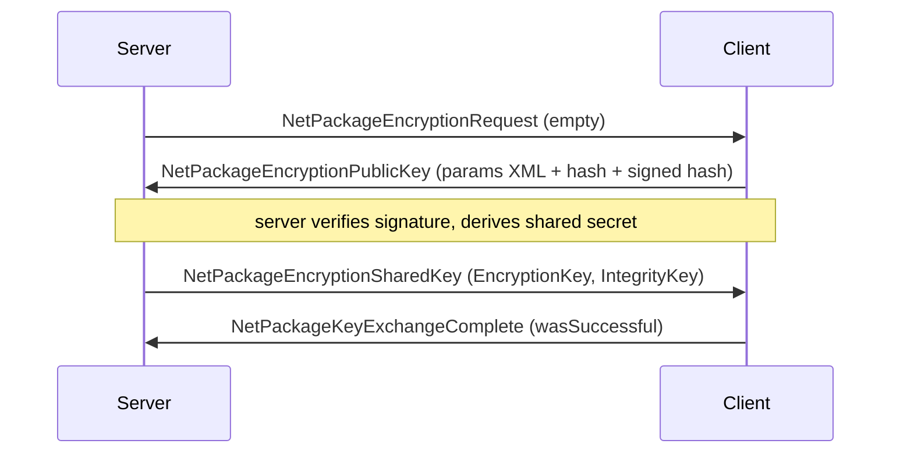

# Wire package body catalog (V3.0.1, IL-derived)

**Owns:** per-`NetPackage` wire metadata (channel/compress/direction/auth) and
hand-annotated `read`/`write` byte layouts beyond the join-critical set in
[`protocol.md`](protocol.md).
**Not:** framing/join/challenge (that is [`protocol.md`](protocol.md)); visual
frames ([`protocol-frames.md`](protocol-frames.md)).
**Evidence:** dumped from the live `Assembly-CSharp.dll` with
[`../tools/`](../tools) (`DumpNetPackages`, `NetProtocolCensus`, `DumpType`);
raw output `il/netpackages-v3.0.1/` (git-ignored). Every field below traces to a
specific `BinaryWriter::Write`/`BinaryReader::Read` in the method body.
**Method:** [`re-methodology.md`](re-methodology.md) §4-5.

All widths little-endian. `string` = .NET 7-bit length prefix + UTF-8. `bool` =
1 byte. Length-prefixed `byte[]` = `Int32` length then bytes (`Read(buf,0,len)`).

---

## 1. Protocol-wide metadata census

Full table: `il/netpackages-v3.0.1/META.md` (193 packages). Regenerate with
`mono bin/NetProtocolCensus.exe "$ASM" ../il/netpackages-v3.0.1/META.md`.

**Per-package wire bodies:** this doc hand-annotates the load-bearing packages; the
**complete** ordered `write()` field sequence for every package (183 bodies + 61
nested serializers) is auto-extracted in
[`inventories/netpackage-bodies.md`](inventories/netpackage-bodies.md)
(`tools/src/WireBodies`).

### 1.1 Channels (correction to the "channel 0 only" assumption)

Most packages inherit the base **channel 0**. Exactly **6 override to
channel 1** (the bulk / terrain / map band):

| Channel-1 package | Role |
|---|---|
| `NetPackageChunk` | full chunk terrain push |
| `NetPackageChunkRemove` | chunk unload |
| `NetPackageMapChunks` | compressed map (minimap) tiles |
| `NetPackageDynamicMesh` | dynamic mesh (destroyed-block geometry) |
| `NetPackagePOIAround` | POI/prefab region data |
| `NetPackageWorldFolder` | world-folder file transfer |

`protocol.md` previously said game packages use channel 0 and treated other
channels as "later". Channel 1 is the real second band and it carries the
heaviest bodies. A clone must bind/route both channels.

### 1.2 Compressed packages

**8 packages set `get_Compress = 1`** (payload LZ-compressed regardless of the
envelope bot path): `NetPackageChunk`, `NetPackageMapChunks`,
`NetPackageDynamicMesh`, `NetPackagePOIAround`, `NetPackageConfigFile`,
`NetPackageDynamicClientArrive`, `NetPackageIdMapping`,
`NetPackageSignDataResponse`. So bulk terrain/map/config is compressed on the
wire even though the join handshake packets are not. This nuances
[`protocol.md`](protocol.md) §8 ("bots use uncompressed path"): true for the
join set, false for these bulk packages.

### 1.3 Direction tally

`NetPackageDirection`: `0 = Both`, `1 = ToServer`, `2 = ToClient`.
Of 193 packages: **66 ToClient, 33 ToServer, 7 Both (explicit), 87 inherit**
(base default = Both).

### 1.4 Pre-auth surface (`AllowedBeforeAuth = 1`)

Exactly **10 packages** may cross the wire before authentication. This is the
complete attack/handshake surface a server must accept pre-auth:

`NetPackagePackageIds`, `NetPackagePlayerLogin`, `NetPackagePlayerDenied`,
`NetPackageAuthConfirmation`, `NetPackageAuthState`, `NetPackageEAC`,
`NetPackageEncryptionRequest`, `NetPackageEncryptionPublicKey`,
`NetPackageEncryptionSharedKey`, `NetPackageKeyExchangeComplete`.

---

## 2. Encryption handshake (closes the `residuals.md` "encryption wire path")

All four packages are `AllowedBeforeAuth`. This is a public-key agreement that
establishes a symmetric session key + separate integrity key.



Bodies (from `write`):

**NetPackageEncryptionRequest** - empty body (id only). Server -> client trigger.

**NetPackageEncryptionPublicKey**
```text
ExchangePublicKeyParamsXml : string    // .NET public-key params as XML
Hash        : i32 len + byte[len]      // length-prefixed
SignedHash  : i32 len + byte[len]      // signature over Hash
```

**NetPackageEncryptionSharedKey**
```text
EncryptionKey : i32 len + byte[len]    // symmetric session key material
IntegrityKey  : i32 len + byte[len]    // separate MAC/integrity key
```

**NetPackageKeyExchangeComplete**
```text
wasSuccessful : bool
```

Failure is surfaced through `EKickReason` (see §6): `EncryptionFailure(19)`,
`EncryptionAgreementInvalidSignature(33)`, `EncryptionAgreementError(34)`. The
signed-hash + separate integrity-key shape indicates signature-verified key
agreement followed by authenticated symmetric encryption; the exact cipher and
KDF are in native/crypto library calls, not the package bodies (residual).

---

## 3. Terrain / chunk band (channel 1)

### 3.1 NetPackageChunk (ToClient, channel 1, compressed)

`write` order:
```text
bOverwriteExisting : bool
if bOverwriteExisting:
    chunkX : i16    // conv.i2 from Chunk.X
    chunkY : i16    // Chunk.Y
    chunkZ : i16    // Chunk.Z
dataLen : i32       // == serializedData.Length
data    : dataLen bytes   // Chunk.write() blob (same codec as save), then StreamCopy
```
The `data` blob is produced in `Setup()` by `Chunk::write(PooledBinaryWriter)`
into a pooled `serializedData` stream, so the chunk-serialization codec is shared
with the save path ([`save-region.md`](save-region.md)). `GetLength` = 14 +
serializedData.Length. `ProcessPackage` either overwrites an existing chunk
(unload -> reset -> re-read -> re-add) or adds a new chunk and flags
`NeedsRegeneration`.

### 3.2 NetPackageChunkRemove (ToClient, channel 1)
```text
chunkKey : i64      // WorldChunkCache key (packed x,z)
```


### 3.3 NetPackageMapChunks (ToClient, channel 1, compressed)

Minimap color tiles, not terrain. Produced by
`IMapChunkDatabase.GetMapChunkPackagesToSend` and appended in
`SendChunksToClients` when the observer has a `mapDatabase`
([world-chunks.md](world-chunks.md) section 4.0).

**Metadata:** channel **1**, `Compress=true`, direction **ToClient** (2).

**`write` order (IL=109):**
```text
entityId     : i32
count        : u16   // number of map pieces that will follow
// per piece (only pieces whose UInt16[] length == 256 are written):
  chunkDbKey : i32   // IMapChunkDatabase.ToChunkDBKey
  colors     : u16 x 256
```

If any piece has length != 256, the writer logs a warning, decrements the planned
count, and **rewinds** the stream to rewrite the `u16` count after the loop
(so a bad piece is omitted without leaving a stale count).

**`GetLength` (IL=24):** `4 + 8*chunkCount + 512*pieceCount` (entityId +
per-chunk key+pad estimate + 256 u16 colors). Not an exact wire length after
invalid-piece filtering.

**`Setup(entityId, List<int> chunks, List<ushort[]> mapPieces)`** copies both
lists.

**`ProcessPackage` (client, IL=26):** resolve `entityId` to `EntityPlayer`; if
that player has `ChunkObserver.mapDatabase`, call
`mapDatabase.Add(chunks, mapPieces)`.

**Producer (`MapChunkDatabase.GetMapChunkPackagesToSend`, IL=96):**

1. No-op (`null`) unless `bClientMapMiddlePositionUpdated` (set by map-position
   C2S path); then clear the flag.
2. Clear send lists. Convert `clientMapMiddlePosition` via `toChunkXZ`.
3. Scan a **17x17** window: offsets `dx,dz in [-8..+8]` (literal radius **8**).
4. For each key not yet in `chunksSent` and present in the fixed datastore:
   add db key + `UInt16[256]` colors; mark sent.
5. If any queued, `NetPackageMapChunks.Setup(playerId, toSendList, mapPiecesList)`.

`MapChunkDatabaseByRegion` (IL=123) is the same window under `m_regionsLock`,
looking up region+offset storage instead of the fixed DS.

**Related C2S:** `NetPackageMapPosition` (direction ToServer) carries
`entityId` + `mapMiddlePosition` and drives the middle-position update that
arms the next map send.


---

## 4. World state band

### 4.1 NetPackageWorldTime (ToClient)
```text
worldTime : u64
```

### 4.2 NetPackageWorldInfo (join world descriptor)
`write` order:
```text
gameMode   : string
levelName  : string
gameName   : string
guid       : string
ppList present : bool
ppList     : PersistentPlayerList.Write (if present)
ticks      : u64
fixedSizeCC: bool
firstTimeJoin : bool
worldHashes : i32 count + count x { filename:string, hash:u32 }  // NOT a byte-length blob
worldDataSize   : i64
```

The leading `i32` on `worldHashes` is an **entry count**, not a byte length: the
`read` IL parses `count` then a `{ string filename, u32 hash }` pair per entry into
a `Dictionary<string,uint>`, then `worldDataSize:i64`. (The `write` side emits the
already-serialized dictionary bytes via `BinaryWriter.Write(byte[])`, but the count
prefix is inside that blob, so on the wire it reads as count + entries.) A clone that
treats the `i32` as a byte length desyncs the stream and misparses `worldDataSize`.

### 4.3 NetPackageWorldInitInfo (ToClient)
`write` order (both lists are count-prefixed; verified against `write` IL=57 /
`read` IL=58):
```text
eventPrefabs count : i32
  per entry        : PrefabInstance.Serializable.Write   // repeated count times
wallVolumes  count : i32
  per entry        : i32 (tuple Item1) + WallVolume.Write // repeated count times
```
There is **no separate trailing `dataLength`** (an earlier note listed one; the
read side reads only the two counts and their entries). `PrefabInstance.Serializable`
and `WallVolume` own their own field layout (dump locally with `tools/src/DumpType`).
The request form `NetPackageWorldInitInfoRequest` has an empty body (`write` IL=4).

---

## 5. Entity + gameplay band

### 5.0 NetPackageRequestToSpawnEntity (ToServer)

Client-authored spawn request (vehicle/turret/item place, falling tree, etc.).

```text
// body is only:
EntityCreationData.write(_bw, networkWrite=true)   // same codec as 5.1
```

- Direction **ToServer** (1). Channel base **0**.
- `Setup` stores `ecd`; `ProcessPackage` calls
  `IGameManager.RequestToSpawnEntityServer(ecd)` when world non-null.

**`GameManager.RequestToSpawnEntityServer` (IL=101):**

1. If **not** server: re-wrap as this package and `SendToServer` (host client
   path).
2. If `entityClass` hash equals `"fallingTree"`: scan live entities for an
   existing `EntityFallingTree` at the same `blockPos`; **return without spawn**
   if found (dedupe).
3. `EntityFactory.CreateEntity(ecd)`.
4. If result is `EntityBackpack`: find matching `PersistentPlayerData` by
   `RefPlayerId`, `AddDroppedBackpack(entityId, pos, worldMinutes)`.
5. `World.SpawnEntityInWorld(entity)` (registers + NetEntityDistribution tracks;
   clients later get `NetPackageEntitySpawn` via interest).

This is the **C2S place/create** path. The S2C visual/create for remote clients
is still `NetPackageEntitySpawn` (5.1), not a direct echo of this package.

### 5.1 NetPackageEntitySpawn (ToClient)
Body is a single `EntityCreationData.write(writer, networkWrite=true)`. The body is
**three ordered sections**: an unconditional header, an `entityClass`-switched
middle, and a convergence tail. The middle switch is the part a clone gets wrong
most easily (verified against the `write` IL branch structure, not the flat
catalog).

**(1) Unconditional header (every entity, ends at `spawnerSource`):**
```text
readFileVersion : byte
entityClass     : i32
id              : i32
lifetime        : f32
pos.x, pos.y, pos.z : f32 x3
rot.x, rot.y, rot.z : f32 x3
onGround        : bool
BodyDamage.Write
stats present   : bool  (+ EntityStats.Write if present)
deathTime       : i16
bag present     : bool  (+ Bag.Write if present)
homePosition.x,y,z : i32 x3
homeRange       : i16
spawnerSource   : byte   // EnumSpawnerSource 0..4  <- header ENDS here
```

**(2) `entityClass`-switched middle (mutually exclusive; a plain zombie/NPC/animal
writes NONE of these).** The switch compares `entityClass` (an int, the
`EntityClass.list` hash) against static class ids:

| If `entityClass ==` | Writes | Note |
|---|---|---|
| `EntityClass.itemClass` | `belongsPlayerId:i32`, `clientEntityId:i32`, `itemStack.Write`, `sbyte(0)` | dropped-item entity, then **jumps straight to the tail** (skips all rows below) |
| `EntityClass.fallingBlockClass` | `blockValues[0].rawData:u32`, `textureFullArrays[0].Write` | single falling block |
| `EntityClass.fallingBlocksClass` | `blockValues.Length:i32`, then `count x rawData:u32`, then `count x Vector3i`, then `count x TextureFullArray` | multi-block, see the shared-count note below |
| `EntityClass.fallingTreeClass` | `blockPos:Vector3i` (`StreamUtils.Write`), `fallTreeDir:Vector3` (`StreamUtils.Write`) | falling tree |
| `EntityClass.playerMaleClass` or `playerFemaleClass` | `holdingItem` (`ItemValue.Write`), `teamNumber:u8`, `entityName:string`, `skinTexture:string`, `playerProfile` present:`bool` (+ `PlayerProfile.Write`) | player character |
| anything else (zombie, animal, NPC, vehicle, ...) | nothing | goes straight to the tail |

**Shared-count trap (fallingBlocks).** The multi-block branch writes **one**
`i32` length and then **three** arrays: `blockValues` (`u32` each),
`blockPositions` (`Vector3i` = 3x `i32` each), and `textureFullArrays`
(`TextureFullArray.Write` = exactly one `i64` each, its loop bound is the literal
1). No second length is emitted, and `EntityCreationData.read` allocates all three
arrays from that same value without reading another `Int32`. A clone must treat the
three arrays as the same length; writing a length before the positions or textures
desyncs the stream. The single-block `fallingBlockClass` branch has no count at all:
it is just `rawData:u32` then one `i64`.

**(3) Convergence tail (every entity):**
```text
entityData    : u16 length + bytes[]     // serialized extra blob (usually empty)
traderData present : bool  (+ TraderData.Write)
if networkWrite:                          // true for NetPackageEntitySpawn
    sleeperPose : byte
    isSleeper   : bool
    spawnById   : i32
    spawnByName : string
    spawnByAllowShare : bool
    headState   : byte
    overrideSize / overrideHeadSize : f32 x2
    isDancing   : bool
    if isSleeper:                         // ONLY when isSleeper is true
        isSleeperPassive : bool
// the junk-drone extras are OUTSIDE the networkWrite guard:
if entityClass == EntityClass.junkDroneClass:
    belongsPlayerId : i32
    orderState      : i32
```

Two gating details a clone must honour (both cost stream sync if missed):
`isSleeperPassive` is written **only when `isSleeper` is true** (`brfalse` at
IL_03B2 skips it), and the trailing `belongsPlayerId` + `orderState` pair is
**junk-drone-only and sits after the `networkWrite` block**, not inside it (the
`networkWrite` guard at IL_033F jumps to the same junk-drone test at IL_03C5).
Writing `isSleeperPassive` unconditionally adds a phantom byte to every non-sleeper
spawn; writing `belongsPlayerId` for every entity adds four, and omitting
`orderState` truncates drone spawns.

So `belongsPlayerId`/`clientEntityId`/`itemStack` are **item-entity fields, not
header fields**; a zombie spawn writes header + tail with the middle empty. The flat
per-write sequence in
[`inventories/netpackage-bodies.md`](inventories/netpackage-bodies.md) is the union
of all branches; use the switch above for the real per-class body. (Cross-checked
against the [zdtd](../../zdtd/docs/) clone's zombie spawn, which correctly writes the
empty middle.)

### 5.1.1 Wire envelope and client process

`NetPackageEntitySpawn` extends `NetPackageEntityTargeted`:

```text
// NetPackageEntityTargeted.write then ECD:
entityId : i32     // Setup copies EntityCreationData.id
// then EntityCreationData.write(_bw, networkWrite=true)  // full body in 5.1
```

- Direction **ToClient** (2). Channel inherits base **0** (not channel 1).
- `Setup(EntityCreationData)`: `NetPackageEntityTargeted.Setup(es.id)` + store `es`.
- Sole Setup caller: `NetEntityDistributionEntry.getSpawnPacket` (entity
  replication first-seen path).

**`ProcessPackage` (IL=60):**

1. No-op if world null.
2. If **not** server and `es.clientEntityId != 0`: for each local player whose
   `entityId == es.belongsPlayerId`, call
   `World.ChangeClientEntityIdToServer(clientEntityId, es.id)` and **return**
   (id remap only; no second create).
3. Else: `world.entityAsyncManager.StartCreateEntity(es, callback)` (async
   factory; callback owned by a display-class closure).

So S2C spawn is **async create**, not a synchronous `EntityFactory.CreateEntity`
on the package thread. The ECD body layout remains the clone-critical surface
(section 5.1 header/middle/tail).

### 5.2 NetPackageEntitySpawnResponse (ToServer)
```text
success   : bool
itemValue : ItemValue.Read/Write
```

**Client `ProcessPackage` (IL=153)** (local player only): tags the item as
`vehicle` / `drone` / `turretRanged|turretMelee`. On **success**: clear the
matching `ItemActionSpawnVehicle` / `ItemActionSpawnTurret` preview when the
holding item matches, `Inventory.DecItem` by 1, play `placeblock`. On
**failure**: tooltip `uiCannotAddVehicle` / `uiCannotAddDrone` /
`uiCannotAddTurret`. Server authority for the place still lives on the
placement / `RequestToSpawnEntity` path; this package is the client inventory
ack.

### 5.3 NetPackageHoldingItem (ToClient)
```text
entityId         : i32
holdingItemStack : ItemStack.Write
holdingItemIndex : byte
```

### 5.4 NetPackagePlayerInventory
```text
toolbelt present : bool  (+ ItemStack[] count-prefixed if present)
bag present      : bool  (+ Bag.Write if present)
equipment present: bool  (+ Equipment: slot count i32 + unlockedCosmetics list ...)
dragAndDropItem  : ItemStack.Write
```

---

## 6. Building band

### 6.1 NetPackageSetBlock (ToServer/ToClient)
```text
persistentPlayerId present : bool (=0 in golden) (+ PlatformUserIdentifierAbs if 1)
blockChanges count : i16
blockChanges[count] : BlockChangeInfo.Write each
localPlayerThatChanged : i32
```

**BlockChangeInfo.Write** order:
```text
BlockValueRef.Write          // packed world block position + ref
changedByEntityId : i32
flags : byte                 // bit-packed: bChangeBlockValue, bChangeDensity,
                             //   bForceDensity, bUpdateLight, bChangeDamage, bChangeTexture
if bChangeBlockValue: BlockValue.Write
if bChangeDensity:    density : sbyte
if bChangeTexture:    TextureFullArray.Write
```

### 6.2 NetPackageSetBlockResponse (ToClient)
```text
response : u16    // eSetBlockResponse: 0 Success, 1 PowerBlockLimitExceeded,
                  //                    2 StorageBlockLimitExceeded
```

---

### 6.9 NetPackageWaterSimChunkUpdate (ToClient)

Jobified water sim stream ([light-mesh-water.md](light-mesh-water.md) section 4).
Direction **ToClient** (2).

**Outer wire (`write` IL=15):**
```text
sendLength : i32
sendBytes  : sendLength bytes   // prebuilt payload
```

**Inner payload** (built by Setup/AddChange/Finalize, then copied to `sendBytes`):
```text
chunkX : i32
chunkZ : i32
count  : i32                    // rewritten in FinalizeSend at lengthStreamPos
// count times:
  voxelIndex : u16              // local packed index
  mass       : u16              // WaterValue.Write = mass only
```

Pipeline:

1. `SetupForSend(Chunk)`: pool stream+writer; write X/Z; reserve count=0.
2. `AddChange(u16, WaterValue)`: write index + mass; `numVoxelUpdates++`.
3. `FinalizeSend`: seek to count slot, write `numVoxelUpdates`; copy stream to
   pooled `sendBytes`; free writer/stream.
4. `ProcessPackage` (client): read X/Z/count from pooled stream; for each entry
   `changeApplier.GetChangeWriter(key).RecordChange(index, WaterValue)`.

### 6.10 NetPackageWaterSet

Manual/console multi-cell set (not the continuous sim stream).

```text
senderEntityId : i32
count          : u16
// count times WaterSetInfo:
  worldPos     : Vector3i (via WaterSetInfo.Write)
  waterData    : WaterValue (mass u16)
```

**`ProcessPackage` (IL=29):** if server, rebroadcast package with bulk flags
**192** excluding sender (`SendPackage` entity exclude = senderEntityId); then
`ApplyChanges(ChunkCache)`: delayed regen start, per cell
`ChunkCluster.SetWater` + `World.HandleWaterLevelChanged`, delayed regen stop.

---

## 7. Reference enums (IL constants)

**NetPackageDirection:** 0 Both, 1 ToServer, 2 ToClient.

**eSetBlockResponse:** 0 Success, 1 PowerBlockLimitExceeded,
2 StorageBlockLimitExceeded.

**EnumSpawnerSource:** 0 Unknown, 1 Biome, 2 StaticSpawner, 3 Dynamic, 4 Delete.

**EKickReason** (35 values; deny reasons in `NetPackagePlayerDenied`). Notable:
4 VersionMismatch, 5 PlayerLimitExceeded, 6 Banned, 7 NotOnWhitelist,
11 EacViolation, 18 UnknownNetPackage, 19 EncryptionFailure,
10 ManualKick (also used for platform-blocked enter), 26 BadMTUPackets (ConnectionManager bad-packet threshold 3/s),
31 PersistentPlayerDataExceeded (PPL cap 100 on RequestToEnterGame),
33 EncryptionAgreementInvalidSignature, 34 EncryptionAgreementError. Full list in
`il/netpackages-v3.0.1/` enum dump.

**NetPackagePlayerDenied** body (`KickPlayerData`):
```text
reason          : i32   // EKickReason
apiResponseEnum : i32
banUntil        : i64   // DateTime ticks
customReason    : string
```

---

## 8. Still open (honest)

| Item | State |
|---|---|
| `EntityCreationData` class-conditional tail | fully extracted (56 fields, per-class branches) in [inventories/netpackage-bodies.md](inventories/netpackage-bodies.md) + §5.1 table |
| Bulk-package compression codec (LZ variant) | flag known; byte codec in native/StreamUtils (residual) |
| Encryption cipher/KDF | handshake bodies decoded; crypto primitives native (residual) |
| Quest/Party/Twitch families | not yet annotated (low priority) |
| `NetPackageDynamicMesh`, `POIAround` bodies | channel/compress known; bodies not annotated |

---

## Related docs

| Doc | Role |
|---|---|
| [protocol.md](protocol.md) | Framing, challenge, join, golden motion bodies |
| [protocol-frames.md](protocol-frames.md) | Visual byte frames |
| [re-methodology.md](re-methodology.md) | How these were derived |
| [network.md](network.md) | Interest / replication / bands |
| [residuals.md](residuals.md) | Non-IL residuals |
| [../tools/README.md](../tools/README.md) | Dumpers that generated this |

## Changelog

- **2026-07-28:** RequestToSpawnEntity server create; WaterSimChunkUpdate inner payload; WaterSet rebroadcast.

- **2026-07-28:** MapChunks + EntitySpawn process paths.
