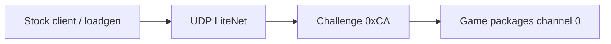
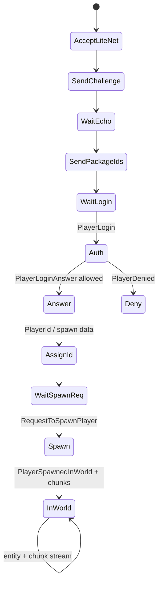

# Dedicated wire protocol (V3.0.1 managed + live golden)

**Owns:** LiteNet framing, pre-auth challenge, PackageIds, join sequence, golden package body layouts.  
**Not:** full 194 package body catalog (in progress); native LiteNet internals (residual); EAC wire (residual).  
**Hub:** [INDEX.md](INDEX.md).  
**Visual frames (RFC bars + Mermaid):** [`protocol-frames.md`](protocol-frames.md).  
**Clone use:** [zig-clone.md](zig-clone.md) · implementation [`../../zdtd/`](../../zdtd/).  
**Replication policy:** [network.md](network.md).  
**Evidence:** `7dtd-loadgen` `PackageCodec.cs` / `JoinStateMachine.cs` / `GameJoinClient.cs` (live joins); `research/il/dedi-complete-v3.0.1/` NetPackage census; ConnectionManager dumps.

**Endianness:** little-endian (BinaryWriter / .NET). Strings: length-prefixed UTF-8 as .NET `BinaryWriter.Write(string)`.

> **Byte diagrams:** every golden package has an offset table + Mermaid field strip in  
> **[protocol-frames.md](protocol-frames.md)** (challenge, envelope, PackageIds, Login, PosAndRot, RelPos, AliveFlags, DamageEntity, …).

---

## 1. Ports and transport

| Item | Observed / stock |
|---|---|
| Game / Steam “connect” port | Often **ServerPort** (e.g. 26900) |
| LiteNetLib data port | **ServerPort + 2** (e.g. **26902**) on this install |
| Transport | UDP via **LiteNetLib** |
| Delivery for game pkgs | Reliable ordered (loadgen uses delivery **2**) |
| Password | serverconfig; encryption packages exist (path incomplete) |
| EAC | Off for bots and C# mods; `NetPackageEAC` residual |

Loadgen and RealEarth docs use 26902 for bots. Clone should bind the LiteNet listen port clients actually dial.



---

## 2. Pre-auth challenge

Before normal packages, server sends **raw** 17 bytes (not the channel envelope).  
**Frame diagram:** [protocol-frames.md §1](protocol-frames.md#1-challenge-pre-auth-raw-no-envelope).

```text
[0]    = 0xCA   // PackageCodec.ChallengeChannelMarker = 202
[1..16] = Guid  // 16 bytes
```

Client **echoes** the same 17 bytes. Constants: `ChallengeSize = 17`.

---

## 3. Game message envelope (after challenge)

**Frame diagram:** [protocol-frames.md §2](protocol-frames.md#2-channel-envelope-every-game-message-after-challenge).

From `NetConnectionSimple` / `NetworkServerLiteNetLib` RE (loadgen comments + golden assert):

```text
LiteNetLib payload (reservedHeaderBytes = 1):

offset 0: channel:u8              // game channel 0 for most packages
offset 1: payloadSize:i32         // bytes after this envelope header
offset 5: compressed:u8           // 0 = uncompressed path used by bots
offset 6: encrypted:u8            // 0 when unencrypted
offset 7: pkgCount:u16            // number of inner packages
offset 9: payload begins
  for each package:
    contentLen:i32                // size of (pkgId + body) ONLY
    pkgId:u16
    body: contentLen-2 bytes
```

**Rule:** `contentLen = 2 + body.Length` (excludes the contentLen field).  
Stock write: `length = end - start - 4` in WriteToStream.

Outer size check:

```text
framed.Length == 1 + 8 + payloadSize
```

Constants:

| Name | Value |
|---|---:|
| ReservedHeaderBytes | 1 |
| OuterEnvelopeAfterChannel | 8 |
| Uncompressed / unencrypted | 0 / 0 |

### Live capture head (PackageIds, channel 0)

Hex prefix validated in loadgen golden:

```text
00 BC 12 00 00  00 00  01 00  B8 12 00 00  00 00  ...
ch payload=0x12BC  c e  cnt=1  content=0x12B8  pkgId=0
version: release=1 major=3 minor=1 build=4
map count: 0xBD = 189
```

Display version packing: `VersionLongString` → **`V 3.0.1`** for Minor packed mid/patch (see loadgen).

---

## 4. Dynamic package ID map

`NetPackageManager` maps **type name string → u16 id** at runtime.

Server → client: **`NetPackagePackageIds`** body:

```text
Version (release:u8, major:i32, minor:i32, build:i32)
count:i32
count × string  // type names in id order (index = id)
serverUseEac:bool
hasHostUserAndToken:bool (+ optional platform user blobs)
```

Client must use **server-advertised** ids for all later packages. Do not hard-code ids across game versions.

DLL census: **~194** `NetPackage*` types (dedi-complete). One live map had **189** entries.

### Family counts (census)

| Family | Approx count |
|---|---:|
| Entity* | 32 |
| Player* | 16 |
| Quest/Party* | 12 |
| Chunk* | 8 |
| World/Tile* | 9 |
| Auth/Crypto* | 6 |
| Inventory* | 5 |
| Other | ~106 |

Largest maxIL (complexity signal, not wire size): Metrics, SharedQuest, QuestEvent, QuestGotoPoint, WireToolActions, PartyData, RangeCheckDamageEntity, GameEventRequest, TurretSpawn, Audio, DynamicMesh, …

Full name list: `research/il/dedi-complete-v3.0.1/DEDI_COMPLETE_auto.md` §3.

---

## 5. Join sequence (server responsibilities)



Client stages (loadgen enum):  
`UdpOpen → LiteNetConnected → ChallengeReceived → ChallengeReplied → PackageIdsReceived → LoginSent → LoginAnswered → PlayerIdReceived → SpawnedInWorld → Joined`.

### Login body (PlayerLogin)

```text
playerName:string
platformUser + token   // PlatformUserIdentifier stream
crossplatform user + token
versionLong:string     // e.g. "V 3.0.1"
compVersionLong:string
discordUserId:u64
```

Platform user stream (loadgen): `0` if null; else `1,1,platform:string,id:string`.

### RequestToSpawnPlayer

```text
chunkViewDim:i16
PlayerProfile v5:
  version:i32 = 5
  archetype:string
  isMale:bool
  race:string
  variant:u8
  hair, hairColor, mustache, chops, beard, eyeColor: strings
nearEntityId:i32
```

### Empty bodies

| Package | Body |
|---|---|
| AuthConfirmation | empty (id only) |
| RequestToEnterGame | empty |

---

## 6. Entity motion packages (golden sizes)

**Visual layouts (RFC + Mermaid):** [protocol-frames.md §8](protocol-frames.md#8-entity-packages-golden-fixed-bodies).

### 6.1 NetPackageEntityPosAndRot (!bUseQRotation)

| Field | Type |
|---|---|
| entityId | i32 |
| x,y,z | f32 ×3 |
| bUseQRotation | bool = false |
| rotX,Y,Z | f32 ×3 |
| onGround | bool |

**Body size = 30** bytes.

### 6.2 NetPackageEntityRelPosAndRot (!bUseQ)

Inherits targeted + rotation branch:

| Field | Type | Notes |
|---|---|---|
| entityId | i32 | |
| bUseQRotation | bool false | if true: 4×f32 quat instead of rot i16 |
| rotX,Y,Z | i16 ×3 | packed: deg/360×256 clamped 0..255 |
| dx,dy,dz | i16 ×3 | relative position |
| onGround | bool | |
| updateSteps | i16 | |

**Body size = 20**; contentLen with pkgId = **22**.  
When bUseQ=true, body = **30**.

Stock selection thresholds (server outbound): [network.md](network.md) §2.

### 6.3 NetPackageEntityAliveFlags

| Field | Type |
|---|---|
| entityId | i32 |
| flags | u16 |

**Body size = 6.**

Flag bits (literals from live DLL, loadgen):

| Bit | Name |
|---:|---|
| 1 | ApproachingEnemy |
| 2 | ApproachingPlayer |
| 4 | AimingGun |
| 8 | Spawned |
| 16 | Jumping |
| 32 | BreakingBlocks |
| 64 | IsAlert |
| 128 | FlashlightOn |
| 256 | GodMode |
| 512 | Crouching |

### 6.4 NetPackageEntityLookAt

```text
entityId:i32
lookX,Y,Z:i32   // floats cast to int on write
```

### 6.5 NetPackageDamageEntity (write order)

Used for suicide / drown / external kill bots. Order from IL:

```text
entityId:i32
damageSource:u8      // 0 External, 1 Internal
damageType:u8        // 3 Bashing, 16 Suffocation, 26 Suicide, …
strength:u16
hitDirection:u8
hitBodyPart:i16
movementState:u8
bPainHit:bool
bFatal:bool
bCritical:bool
attackerEntityId:i32
dirV: 3×f32
blockPos: 3×i32
hitTransformName:string
hitTransformPosition: 3×f32
uvHit: 2×f32
damageMultiplier:f32
random:f32
bIgnoreConsecutiveDamages:bool
bIsDamageTransfer:bool
bDismember:bool
bCrippleLegs:bool
bTurnIntoCrawler:bool
bonusDamageType:u8
StunType:u8
StunDuration:f32
bFromBuff:bool
ArmorSlot:u8
ArmorSlotGroup:u8
ArmorDamage:u16
attackingItem present:bool (+ item if true)
```

### 6.6 NetPackageExplosionInitiate (dynamite)

worldPos 3×f32, blockPos 3×i32, rotation quat 4×f32, nested explosion blob (particle index, radii, damages, …), entityId, delaySeconds, removeBlocks, optional ItemValue.

---

## 7. Server send API shapes (managed)

`ConnectionManager.SendPackage` (overload):

```text
SendPackage(NetPackage, bool, int, int, int, Vector3?, int, bool)
SendPackage(List<NetPackage>, ...)  // batch
```

`ClientInfo.SendPackage`, `FlushClientSendQueues`, `ProcessPackages(INetConnection, NetPackageDirection, ClientInfo)`.

`NetPackageManager.ParsePackage(PooledBinaryReader, ClientInfo)`, `GetPackage<T>()` pooling, `IdMappingsReceived(string[])`.

Replication path: [network.md](network.md) §4b (per-player rebuild vs broadcast).

---

## 8. Compression / encryption

| Flag | Bot path | Full server |
|---|---|---|
| compressed | 0 | May set; codec not golden-tested here |
| encrypted | 0 | `NetPackageEncryption*` family present |

Clone M1: uncompressed, unencrypted only. Password servers need encryption RE next.

---

## 9. Channels

Loadgen uses **channel 0** for game packages. Challenge is **outside** the envelope (raw 0xCA).  
Dynamic mesh / other systems may use other channels; treat as later.

---

## 10. Validation tools

```bash
# From 7dtd-loadgen (after build)
./src/LoadGen/bin/Release/net8.0/7dtd-loadgen --golden-wire
# Live join against stock or clone on 26902
make join
```

Any Zig clone should pass the same golden sizes for PosAndRot / RelPos / AliveFlags / envelope, then accept loadgen probe.

---

## 11. RE backlog (protocol)

| Priority | Item | Why |
|---:|---|---|
| P0 | NetPackageChunk body | Client terrain |
| P0 | EntitySpawn / SpawnResponse | Visible zombies/players |
| P0 | WorldInfo / WorldTime / WorldInit* | Client world ready |
| P1 | SetBlock / SetBlockResponse | Building |
| P1 | PlayerInventory / HoldingItem | Play loop |
| P1 | ChunkRemove* | Unload |
| P2 | Encryption + password | Public servers |
| P2 | TileEntity / vehicles | Features |
| P3 | Quest/Party/Twitch | Completeness |
| residual | EAC | Out of scope |
| residual | LiteNet native | Black box |

---

## Related docs

| Doc | Role |
|---|---|
| **[protocol-frames.md](protocol-frames.md)** | **Visual frame catalog (RFC + Mermaid)** |
| [zig-clone.md](zig-clone.md) | Clone architecture |
| [network.md](network.md) | Interest + scale |
| [closed-gaps.md](closed-gaps.md) | Package band thresholds |
| [engine-limitations.md](engine-limitations.md) | Net ceilings |
| [inventories/netpackages.md](inventories/netpackages.md) | All type names |
| DEDI_COMPLETE auto §3 | Full package name list |
| loadgen PackageCodec | Golden implementations |

## Changelog

- **2026-07-20:** Link visual protocol-frames catalog (RFC bars + Mermaid block-beta).
- **2026-07-20:** Initial protocol narrative from loadgen golden wire + dedi-complete census.
