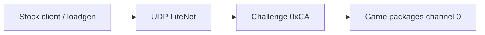
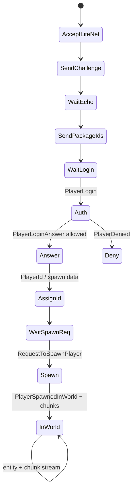
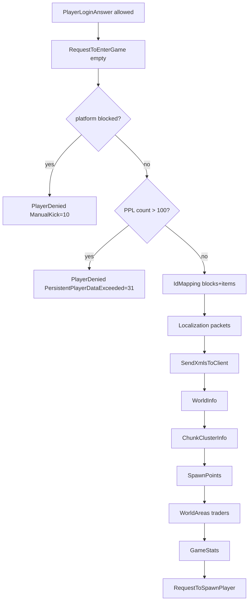
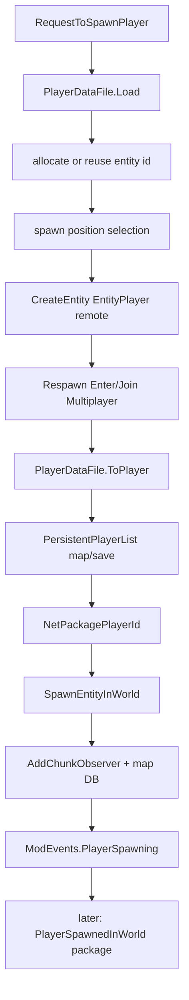

# Dedicated wire protocol (V3.1.0 pin; V3.0.1-era golden still cited)

**Current game pin:** V **3.1.0 (b14)**. Framing/join and most package bodies are stable from the V3.0.1 corpus; breaking deltas (TE outer wire, PackageIds VersionInformation minor=10 build=14) are in [experimental-delta.md](experimental-delta.md) and [protocol-packages.md](protocol-packages.md). Loadgen dual fixtures cover both heads.


**Owns:** LiteNet framing, pre-auth challenge, PackageIds, join sequence, post-login enter-game package batch, `NetPackageRequestToSpawnPlayer` / RequestToSpawnPlayer/PlayerId/PlayerSpawnedInWorld, golden package body layouts.  
**Not:** the exhaustive per-package body catalog + protocol-wide metadata census (that is [`protocol-packages.md`](protocol-packages.md)); native LiteNet internals (residual); EAC wire (residual).  
**Hub:** [INDEX.md](INDEX.md).  
**Visual frames (RFC bars + Mermaid):** [`protocol-frames.md`](protocol-frames.md).  
**Full package bodies + census (channels, compress, pre-auth, encryption handshake):** [`protocol-packages.md`](protocol-packages.md).  
**Clone use:** [zig-clone.md](../../zdtd/docs/zig-clone.md) · implementation [`../../zdtd/`](../../zdtd).  
**Replication policy:** [network.md](network.md).  
**Evidence:** `7dtd-loadgen` `PackageCodec.cs` / `JoinStateMachine.cs` / `GameJoinClient.cs` (live joins); `il/dedi-complete-v3.1.0/` NetPackage census; ConnectionManager dumps.

**Endianness:** little-endian (BinaryWriter / .NET). Strings: length-prefixed UTF-8 as .NET `BinaryWriter.Write(string)`.

> **Byte diagrams:** every golden package has an offset table + Mermaid field strip in  
> **[protocol-frames.md](protocol-frames.md)** (challenge, envelope, PackageIds, Login, PosAndRot, RelPos, AliveFlags, DamageEntity, …).

---

## 1. Ports and transport

| Item | Observed / stock |
|---|---|
| Game / Steam “connect” port | Often **ServerPort** (e.g. 26900) |
| LiteNetLib data port | **ServerPort + 2** (e.g. **26902**) on this install |
| Transport | UDP via **LiteNetLib** |
| Delivery for game pkgs | Reliable ordered (loadgen uses delivery **2**) |
| Password | serverconfig; encryption packages exist (path incomplete) |
| EAC | Off for bots and C# mods; `NetPackageEAC` residual |

Loadgen and RealEarth docs use 26902 for bots. Clone should bind the LiteNet listen port clients actually dial.



---

## 2. Pre-auth challenge

Before normal packages, server sends **raw** 17 bytes (not the channel envelope).  
**Frame diagram:** [protocol-frames.md §1](protocol-frames.md#1-challenge-raw-before-game-envelope).

```text
[0]    = 0xCA   // PackageCodec.ChallengeChannelMarker = 202
[1..16] = Guid  // 16 bytes
```

Client **echoes** the same 17 bytes. Constants: `ChallengeSize = 17`.

---

## 3. Game message envelope (after challenge)

**Frame diagram:** [protocol-frames.md §2](protocol-frames.md#2-game-channel-envelope--package-stream).

From `NetConnectionSimple` / `NetworkServerLiteNetLib` RE (loadgen comments + golden assert):

```text
LiteNetLib payload (reservedHeaderBytes = 1):

offset 0: channel:u8              // game channel 0 for most packages
offset 1: payloadSize:i32         // bytes after this envelope header
offset 5: compressed:u8           // 0 = uncompressed path used by bots
offset 6: encrypted:u8            // 0 when unencrypted
offset 7: pkgCount:u16            // number of inner packages
offset 9: payload begins
  for each package:
    contentLen:i32                // size of (pkgId + body) ONLY
    pkgId:u16
    body: contentLen-2 bytes
```

**Rule:** `contentLen = 2 + body.Length` (excludes the contentLen field).  
Stock write: `length = end - start - 4` in WriteToStream.

Outer size check:

```text
framed.Length == 1 + 8 + payloadSize
```

Constants:

| Name | Value |
|---|---:|
| ReservedHeaderBytes | 1 |
| OuterEnvelopeAfterChannel | 8 |
| Uncompressed / unencrypted | 0 / 0 |

### Live capture head (PackageIds, channel 0)

Hex prefix validated in loadgen golden:

```text
00 BC 12 00 00  00 00  01 00  B8 12 00 00  00 00  ...
ch payload=0x12BC  c e  cnt=1  content=0x12B8  pkgId=0
version: release=1 major=3 minor=1 build=4
map count: 0xBD = 189
```

Display version packing: `VersionLongString` → **`V 3.1.0`** for Minor=10 Build=14 (see loadgen; Constants.cVersion*).

---

## 4. Dynamic package ID map

`NetPackageManager` maps **type name string → u16 id** at runtime.

Server → client: **`NetPackagePackageIds`** body:

```text
Version (release:u8, major:i32, minor:i32, build:i32)
count:i32
count × string  // type names in id order (index = id)
serverUseEac:bool
hasHostUserAndToken:bool (+ optional platform user blobs)
```

Client must use **server-advertised** ids for all later packages. Do not hard-code ids across game versions.

DLL census (V3.0.1, `tools/bin/Census.exe`): **194** `NetPackage*`-prefixed types =
**193 + `NetPackageManager`** (the registry). The **189** in the live id-map are the
actual registered wire packages; the remaining ~4-6 of the 193 are name-prefixed
helpers (`NetPackageDirection` [enum], `Logger`, `Metrics`, ...), not wire packages.

### Family counts (census)

| Family | Approx count |
|---|---:|
| Entity* | 32 |
| Player* | 16 |
| Quest/Party* | 12 |
| Chunk* | 8 |
| World/Tile* | 9 |
| Auth/Crypto* | 6 |
| Inventory* | 5 |
| Other | ~106 |

Largest maxIL (complexity signal, not wire size): Metrics, SharedQuest, QuestEvent, QuestGotoPoint, WireToolActions, PartyData, RangeCheckDamageEntity, GameEventRequest, TurretSpawn, Audio, DynamicMesh, …

Full name list: `il/dedi-complete-v3.1.0/DEDI_COMPLETE_auto.md` §3.

---

## 5. Join sequence (server responsibilities)



Client stages (loadgen enum):  
`UdpOpen → LiteNetConnected → ChallengeReceived → ChallengeReplied → PackageIdsReceived → LoginSent → LoginAnswered → PlayerIdReceived → SpawnedInWorld → Joined`.

### Login body (PlayerLogin)

```text
playerName:string
platformUser + token   // PlatformUserIdentifier stream
crossplatform user + token
versionLong:string     // e.g. "V 3.0.1"
compVersionLong:string
discordUserId:u64
```

Platform user stream (loadgen): `0` if null; else `1,1,platform:string,id:string`.

### RequestToSpawnPlayer

```text
chunkViewDim:i16
PlayerProfile v5:
  version:i32 = 5
  archetype:string
  isMale:bool
  race:string
  variant:u8
  hair, hairColor, mustache, chops, beard, eyeColor: strings
nearEntityId:i32
```

### Empty bodies

| Package | Body |
|---|---|
| AuthConfirmation | empty (id only) |
| RequestToEnterGame | empty |

### Post-login: `RequestToEnterGame` server sequence (IL=248)

Client sends empty `NetPackageRequestToEnterGame` after accepting
`PlayerLoginAnswer`. Server entry is a thin coroutine wrapper
(`GameManager.RequestToEnterGame` IL=9 -> `MoveNext` IL=**248**). Ordered work
(verified call sequence):

1. `ModEvents` `SPlayerJoinedGameData` (mod hook).
2. Yield `PlatformUserManager.ResolveUserBlockedCoroutine` for the player.
3. If platform-blocked: `NetPackagePlayerDenied` with
   `EKickReason.ManualKick` (**10**), empty custom reason; stop.
4. If `persistentPlayerCount + 1 > **100**`: `PlayerDenied` with
   `EKickReason.PersistentPlayerDataExceeded` (**31**); stop.
5. `PersistentPlayerList.NetworkCloneRelevantForPlayer`.
6. Two `NetPackageIdMapping` sends (`"blocks"`, `"items"` string keys + byte maps).
7. Yield `NetPackageLocalization.StartSendingPacketsToClient`.
8. `WorldStaticData.SendXmlsToClient` (config S2C; [mod-loading.md](mod-loading.md) section 5.6).
9. `NetPackageWorldInfo` (world name/seed/guid + relevant PPL + time bits).
10. `NetPackageChunkClusterInfo` for the primary `ChunkCluster`.
11. `NetPackageWorldSpawnPoints` (`GameManager.GetSpawnPointList`).
12. `NetPackageWorldAreas` (`World.TraderAreas`).
13. `NetPackageGameStats` (`GameStats.Instance`).

After this batch the client proceeds to `RequestToSpawnPlayer` / in-world
streaming (state machine above). Auth terminal steps that precede this request
are in [platform-auth.md](platform-auth.md) section 3 (`playerAllowed`).



### `PlayerLoginAnswer` body (server write, IL=46)

| Order | Field |
|---|---|
| 1 | base package header |
| 2 | `bAllowed` : bool |
| 3 | `data` : string (`LocalServerInfo.ToString()` when allowed) |
| 4 | `platformLobbyId` : `PlatformLobbyId.Write` |
| 5 | platform user : `PlatformUserIdentifier.ToStream` + ticket string |
| 6 | crossplatform user : same |

On the client, `ProcessPackage` calls `ConnectionManager.PlayerAllowed(...)` when
`bAllowed`, else `PlayerDenied(data)`.

### Post-spawn request: `RequestToSpawnPlayer` (server, IL=496)

Client sends after the enter-game batch. Package process is a thin forwarder to
`GameManager.RequestToSpawnPlayer(cInfo, chunkViewDim, playerProfile, nearEntityId)`.

**Wire (C2S):**

| Order | Field |
|---|---|
| 1 | base header |
| 2 | `chunkViewDim` : i16 |
| 3 | `PlayerProfile.Write` (v5 layout, see above) |
| 4 | `nearEntityId` : i32 |

**Server work (verified):**

1. Clamp `chunkViewDim` to `[max(4, pref190), min(12, pref190)]` where pref190 is
   `GamePrefs.GetInt(190)` itself clamped to 4..12, then clamp the client value into that range.
2. `PlayerDataFile.Load` under `getPersistentPlayerID` / `CombinedString`; clear
   `lastSpawnPosition` to `Undef`.
3. Entity id: reuse `PlayerDataFile.id` if loaded and not `-1` and free; else
   allocate `EntityFactory.nextEntityID` (and reallocate if that id is already live).
4. Spawn position selection (first success wins):
   - If `GameStats` bool **25**: for each same-`TeamNumber` player, try
     `FindRandomSpawnPointNearPlayer(..., radius 15, ...)`.
   - Else if `nearEntityId != -1` and spawn-near-friend mode != 0:
     up to 15 tries of `GetRandomSpawnPositionMinMaxToPosition` (min **40**, max **150**,
     land-claim aware); mode **2** rejects forest/pine forest biome results
     (`BiomeType` 2..3).
   - Else if still undef: `SpawnPointList.GetRandomSpawnPosition`.
5. Build `EntityCreationData` (class from profile, id, team, pos/rot); copy saved
   `entityData` stream when `bLoaded`.
6. `EntityFactory.CreateEntity` -> `EntityPlayer`; `isEntityRemote = true`.
7. `Respawn(EnterMultiplayer=4)` if new file, else `Respawn(JoinMultiplayer=5)`.
8. `PlayerDataFile.ToPlayer`.
9. Persistent player: get or `CreatePlayerData` / `Update`, set `LastLogin` +
   `EntityId`, `MapPlayer`, `SavePersistentPlayerData`.
10. `ConnectionManager.SetClientEntityId` + **`NetPackagePlayerId`** to the client
    (`id`, `teamNumber` i16, `PlayerDataFile.WriteNetwork`, `chunkViewDim`).
11. `AIDirectorAirDropComponent.RefreshCrates(entityId)`.
12. `World.SpawnEntityInWorld(player)`.
13. `ChunkManager.AddChunkObserver(pos, false, chunkViewDim, entityId)` on the player.
14. `IMapChunkDatabase.TryCreateOrLoad` for the player's map DB.
15. `DispatchPlayerEvent` + broadcast `NetPackagePersistentPlayerState` (reason **0** new / **1** update).
16. `ModEvents.PlayerSpawning` (`SPlayerSpawningData`).

**Note:** `GameManager.PlayerSpawnedInWorld` is **not** called from this method.
Chunk terrain for the new observer is **not** sent inside this method either:
steady `UpdateTick` -> `SendChunksToClients` streams `NetPackageChunk` on channel 1
([world-chunks.md](world-chunks.md) section 4.0).
It runs later when the client (or local controller) sends
`NetPackagePlayerSpawnedInWorld` (server validates `ValidEntityIdForSender`,
runs `PlayerSpawnedInWorld`, rebroadcasts the package).



### `NetPackagePlayerId` body (S2C write, IL=21)

| Order | Field |
|---|---|
| 1 | base header |
| 2 | `id` : i32 |
| 3 | `teamNumber` : i16 |
| 4 | `PlayerDataFile.WriteNetwork` |
| 5 | `chunkViewDim` : i32 |

Client `ProcessPackage` -> `GameManager.PlayerId(...)`.

### `NetPackagePlayerSpawnedInWorld` body (IL=16)

| Order | Field |
|---|---|
| 1 | base header |
| 2 | `respawnReason` : i32 (`RespawnType`) |
| 3 | `position` : `Vector3i` via `StreamUtils.Write` |
| 4 | `entityId` : i32 |

`RespawnType`: 0 NewGame, 1 LoadedGame, 2 Died, 3 Teleport, 4 EnterMultiplayer,
5 JoinMultiplayer, 6 Unknown.

Server `PlayerSpawnedInWorld` (IL=127): require live `EntityPlayer`; on
`Died`+remote call `SetAlive`; join/enter multiplayer may
`DisplayGameMessage`; `PlayerInteractions.PlayerSpawnedInMultiplayerServer`;
on server for join/enter/new/loaded paths refresh vehicle/drone waypoints and
`SpawnFollowingDronesForPLayer`; fire `ModEvents.PlayerSpawnedInWorld`;
`OnClientSpawned` action; log.

---

## 6. Entity motion packages (golden sizes)

**Visual layouts (RFC + Mermaid):** [protocol-frames.md §7-§12](protocol-frames.md#7-entityposandrot-body-buseq--30-bytes).

### 6.1 NetPackageEntityPosAndRot (!bUseQRotation)

| Field | Type |
|---|---|
| entityId | i32 |
| x,y,z | f32 ×3 |
| bUseQRotation | bool = false |
| rotX,Y,Z | f32 ×3 |
| onGround | bool |

**Body size = 30** bytes.

### 6.2 NetPackageEntityRelPosAndRot (!bUseQ)

Inherits targeted + rotation branch:

| Field | Type | Notes |
|---|---|---|
| entityId | i32 | |
| bUseQRotation | bool false | if true: 4×f32 quat instead of rot i16 |
| rotX,Y,Z | i16 ×3 | packed: deg/360×256 clamped 0..255 |
| dx,dy,dz | i16 ×3 | relative position |
| onGround | bool | |
| updateSteps | i16 | |

**Body size = 20**; contentLen with pkgId = **22**.  
When bUseQ=true, body = **30**.

Stock selection thresholds (server outbound): [network.md](network.md) §2.

### 6.3 NetPackageEntityAliveFlags

| Field | Type |
|---|---|
| entityId | i32 |
| flags | u16 |

**Body size = 6.**

Flag bits (literals from live DLL, loadgen):

| Bit | Name |
|---:|---|
| 1 | ApproachingEnemy |
| 2 | ApproachingPlayer |
| 4 | AimingGun |
| 8 | Spawned |
| 16 | Jumping |
| 32 | BreakingBlocks |
| 64 | IsAlert |
| 128 | FlashlightOn |
| 256 | GodMode |
| 512 | Crouching |

### 6.4 NetPackageEntityLookAt

```text
entityId:i32
lookX,Y,Z:i32   // floats cast to int on write
```

### 6.5 NetPackageDamageEntity (write order)

Used for suicide / drown / external kill bots. Order from IL:

```text
entityId:i32
damageSource:u8      // 0 External, 1 Internal
damageType:u8        // 3 Bashing, 16 Suffocation, 26 Suicide, …
strength:u16
hitDirection:u8
hitBodyPart:i16
movementState:u8
bPainHit:bool
bFatal:bool
bCritical:bool
attackerEntityId:i32
dirV: 3×f32
blockPos: 3×i32
hitTransformName:string
hitTransformPosition: 3×f32
uvHit: 2×f32
damageMultiplier:f32
random:f32
bIgnoreConsecutiveDamages:bool
bIsDamageTransfer:bool
bDismember:bool
bCrippleLegs:bool
bTurnIntoCrawler:bool
bonusDamageType:u8
StunType:u8
StunDuration:f32
bFromBuff:bool
ArmorSlot:u8
ArmorSlotGroup:u8
ArmorDamage:u16
attackingItem present:bool (+ item if true)
```

### 6.6 NetPackageExplosionInitiate (dynamite)

worldPos 3xf32, blockPos Vector3i, rotation quat, nested `ExplosionData.ToByteArray` (u16 len + bytes), entityId, delay, removeBlock flag, optional ItemValue.
Full layout: [protocol-packages.md](protocol-packages.md) sections 6.14-6.15.

---

## 7. Server send API shapes (managed)

`ConnectionManager.SendPackage` (overload):

```text
SendPackage(NetPackage, bool, int, int, int, Vector3?, int, bool)
SendPackage(List<NetPackage>, ...)  // batch
```

`ClientInfo.SendPackage`, `FlushClientSendQueues`, `ProcessPackages(INetConnection, NetPackageDirection, ClientInfo)`.

`NetPackageManager.ParsePackage(PooledBinaryReader, ClientInfo)`, `GetPackage<T>()` pooling, `IdMappingsReceived(string[])`.

Replication path: [network.md](network.md) §4b (per-player rebuild vs broadcast).

---

## 8. Compression / encryption

| Flag | Bot path | Full server |
|---|---|---|
| compressed | 0 | Set per-package: **8 packages** force `get_Compress = 1` (bulk terrain/map/config), see [protocol-packages.md](protocol-packages.md) §1.2 |
| encrypted | 0 | Public-key handshake decoded: [protocol-packages.md](protocol-packages.md) §2 |

Clone M1: uncompressed, unencrypted only. The join handshake packets are
uncompressed, but chunk/map/config packages are LZ-compressed even on the bot
path (they set `get_Compress` themselves). The encryption handshake
(`EncryptionRequest -> EncryptionPublicKey -> EncryptionSharedKey ->
KeyExchangeComplete`) is now mapped; the cipher/KDF primitives remain native
(residual).

---

## 9. Channels

Loadgen uses **channel 0** for game packages. Challenge is **outside** the envelope (raw 0xCA).

Most packages inherit **channel 0**, but exactly **6 override to channel 1** (the
bulk/terrain/map band): `NetPackageChunk`, `NetPackageChunkRemove`,
`NetPackageMapChunks`, `NetPackageDynamicMesh`, `NetPackagePOIAround`,
`NetPackageWorldFolder`. These carry the heaviest bodies and several are
compressed (`get_Compress = 1`). A clone must route both channels. Full census
and per-package channel/compress/direction/auth: [`protocol-packages.md`](protocol-packages.md) §1.

---

## 10. Validation tools

```bash
# From 7dtd-loadgen (after build)
./src/LoadGen/bin/Release/net8.0/7dtd-loadgen --golden-wire
# Live join against stock or clone on 26902
make join
```

Any Zig clone should pass the same golden sizes for PosAndRot / RelPos / AliveFlags / envelope, then accept loadgen probe.

---

## 11. RE backlog (protocol)

Status after the [`protocol-packages.md`](protocol-packages.md) pass (2026-07-23):

| Priority | Item | Why | Status |
|---:|---|---|---|
| P0 | NetPackageChunk body | Client terrain | **Done** ([protocol-packages.md](protocol-packages.md) §3.1) |
| P0 | EntitySpawn / SpawnResponse | Visible zombies/players | Header done; class tail partial (§5.1-5.2) |
| P0 | WorldInfo / WorldTime / WorldInit* | Client world ready | WorldInfo/WorldTime **done**; WorldInitInfo partial (§4) |
| P1 | SetBlock / SetBlockResponse | Building | **Done** (§6) |
| P1 | PlayerInventory / HoldingItem | Play loop | **Done** (§5.3-5.4) |
| P1 | ChunkRemove* | Unload | **Done** (§3.2) |
| P2 | Encryption handshake | Public servers | **Done** (§2); cipher/KDF native (residual) |
| P2 | TileEntity / vehicles | Features | Open |
| P3 | Quest/Party/Twitch | Completeness | Open |
| residual | EAC | Out of scope | Residual |
| residual | LiteNet native | Black box | Residual |

---

## Related docs

| Doc | Role |
|---|---|
| **[protocol-frames.md](protocol-frames.md)** | **Visual frame catalog (RFC + Mermaid)** |
| **[protocol-packages.md](protocol-packages.md)** | **Per-package body catalog + metadata census + encryption handshake** |
| [re-methodology.md](re-methodology.md) | How the bodies were derived from IL |
| [zig-clone.md](../../zdtd/docs/zig-clone.md) | Clone architecture |
| [network.md](network.md) | Interest + scale |
| [closed-gaps.md](closed-gaps.md) | Package band thresholds |
| [engine-limitations.md](engine-limitations.md) | Net ceilings |
| [inventories/netpackages.md](inventories/netpackages.md) | All type names |
| DEDI_COMPLETE auto §3 | Full package name list |
| loadgen PackageCodec | Golden implementations |

## Changelog

- **2026-07-28:** `RequestToSpawnPlayer` server path, `PlayerId`/`PlayerSpawnedInWorld` bodies, RespawnType.

- **2026-07-28:** `RequestToEnterGame` package sequence, deny reasons 10/31, `PlayerLoginAnswer` write fields.

- **2026-07-23:** §11 backlog status updated after the protocol-packages.md body pass.
- **2026-07-20:** Link visual protocol-frames catalog (RFC bars + Mermaid block-beta).
- **2026-07-20:** Initial protocol narrative from loadgen golden wire + dedi-complete census.
