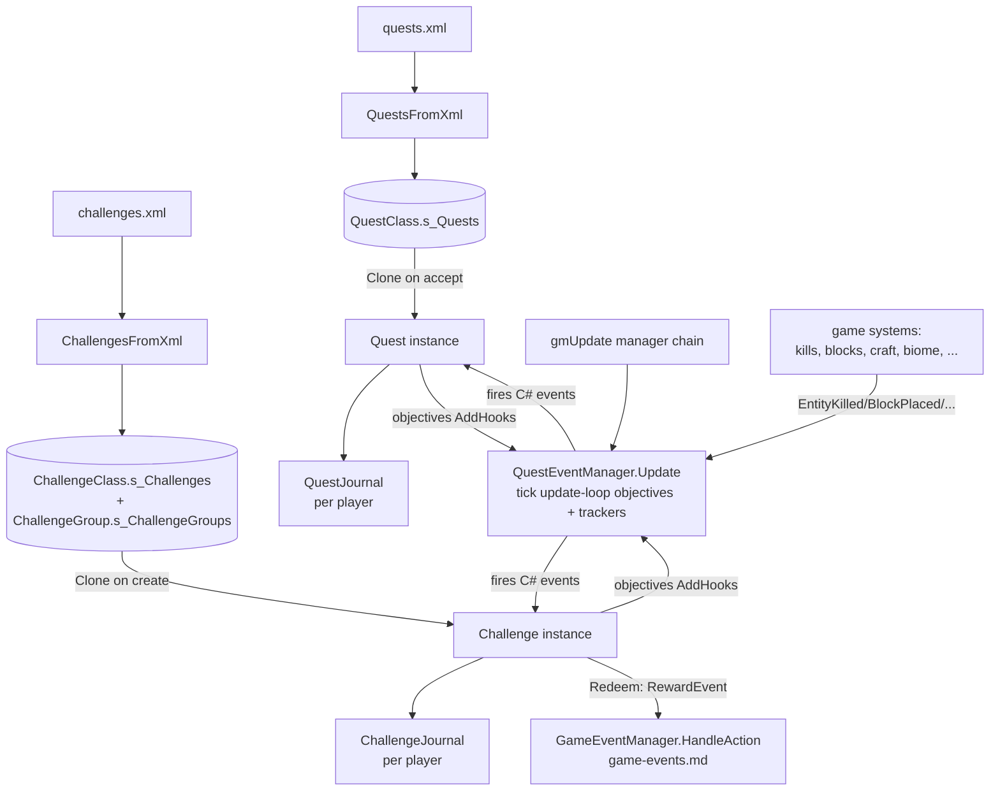
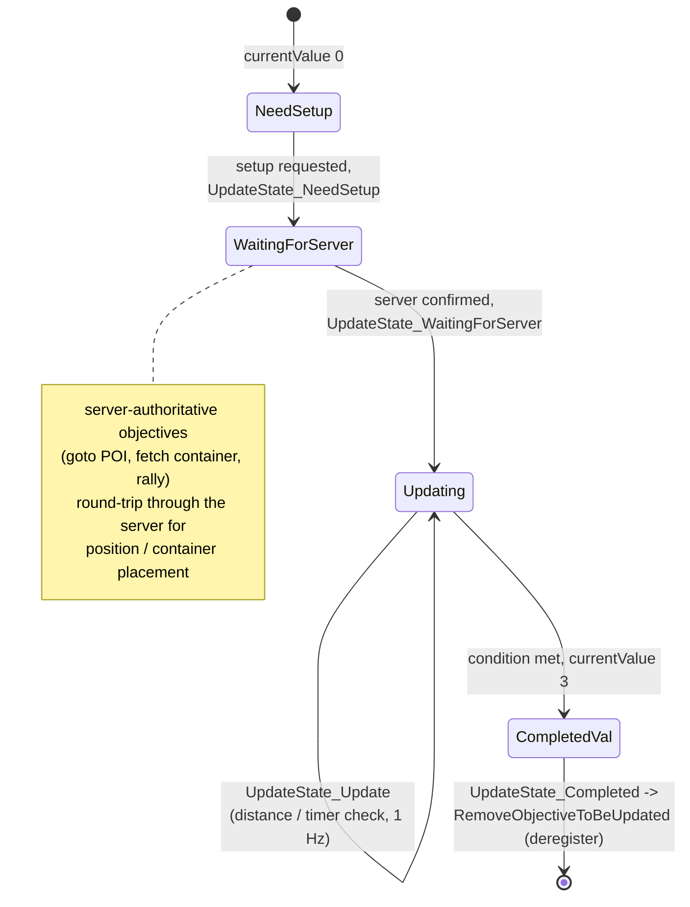
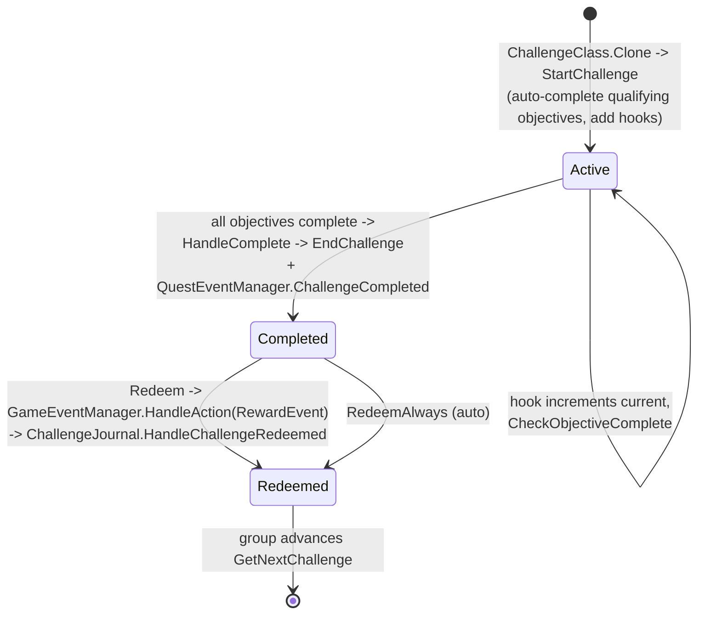
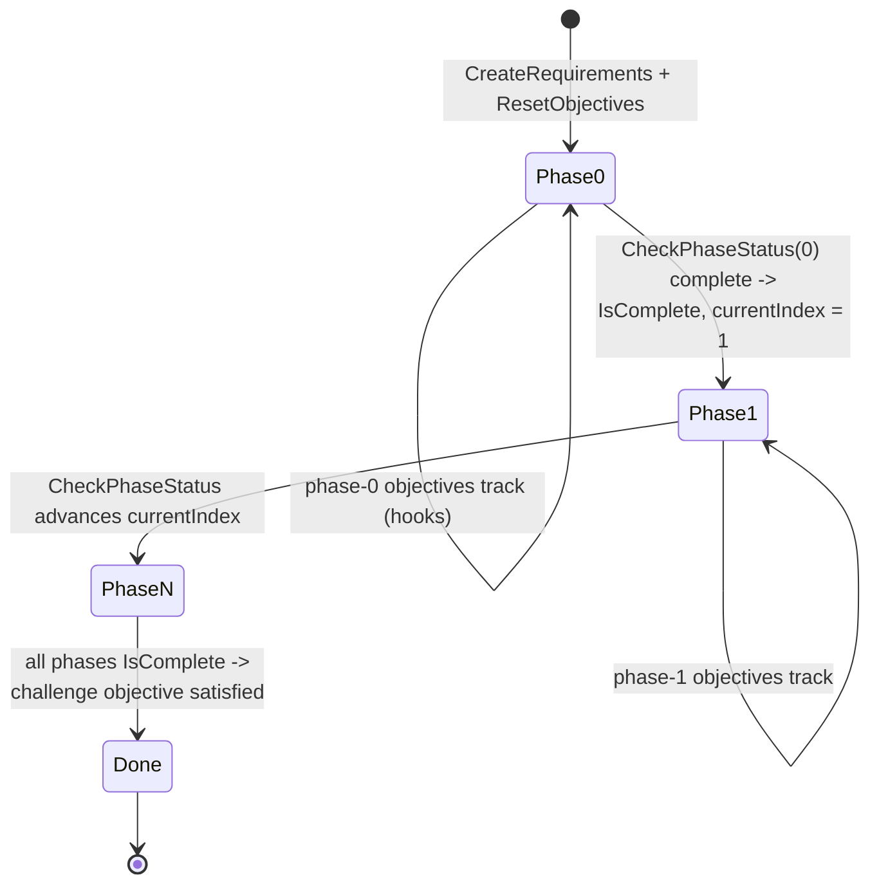

# Quest and challenge systems (dedicated V3.1.0)

**Owns:** the two player-progression scripting systems: the quest engine
(`Quest`, `QuestClass`, `QuestJournal`, `BaseObjective` + objective verbs,
`BaseReward` + reward verbs, `BaseQuestAction` + quest-action verbs, the
`Quests` / `Quests.Requirements` namespaces) and the challenge engine
(`Challenges.*`: `Challenge`, `ChallengeClass`, `BaseChallengeObjective` +
objective verbs, `BaseRequirementObjectiveGroup` phase groups,
`ChallengeTrackingHandler`, plus top-level `ChallengeGroup` / `ChallengeCategory`
/ `ChallengeJournal`), and the shared server hub `QuestEventManager` that both
subscribe to.
**Not:** the quest and challenge XML definitions themselves (`quests.xml`,
`challenges.xml` are content parsed by `QuestsFromXml` / `ChallengesFromXml`, not
loop IL); the XUi journal and tracker widgets (client UI); the `GameEvent.*`
sequences that deliver challenge rewards ([`game-events.md`](game-events.md),
sibling system); trader NPC dialog and the treasure/rally block prefabs.
**Evidence:** global `Quest` family IL (`Quest` 90 method bodies, `QuestEventManager`
159, `QuestClass`, `QuestJournal`, `BaseObjective` + 45 `Objective*` type rows,
`BaseReward` + 12 `Reward*` rows, `BaseQuestAction` + 9 `QuestAction*` rows);
`Quests` + `Quests.Requirements` (7 types / 48 bodies); `Challenges` (48 types /
509 bodies) plus top-level `ChallengeGroup` / `ChallengeJournal`. Dump locally
with `tools/src/DumpMethod Quest ""`, `DumpMethod QuestEventManager ""`,
`DumpAll Quests`, `DumpAll Challenges` (git-ignored).
**Hub:** [`INDEX.md`](INDEX.md). **Method:** [`re-methodology.md`](re-methodology.md).

Both systems are **template + instance** engines like the `GameEvent.*` framework
([`game-events.md`](game-events.md)): an XML-parsed class object (`QuestClass` /
`ChallengeClass`) is `Clone()`d into a per-player runtime object (`Quest` /
`Challenge`) that owns a list of objectives, tracks progress by subscribing to a
central event hub, and hands out rewards on completion. Unlike `GameEvent.*`
(server-authoritative, `Update` gated on `IsServer`), the quest / challenge
runtime objects live in the **owning player's** journal and their progression
logic runs where that player's `EntityPlayerLocal` lives, which the server
mirrors and persists. The dividing line (server tracking vs client-side quest
object) is §5.

---

## 1. Architecture

Two parallel engines share one dispatcher. `QuestEventManager.Current` is a lazy
singleton ticked once per frame from `GameManager.gmUpdate`
([`loop-gmupdate.md`](loop-gmupdate.md)), unconditionally (only a null guard, no
`IsServer` gate, unlike `GameEventManager`).

| Type | Role |
|---|---|
| `QuestClass` / `ChallengeClass` | XML-parsed templates (static `s_Quests` / `s_Challenges` dictionaries); hold objective / reward / action / requirement lists, `HighestPhase`, `CompletionType`, difficulty tier |
| `Quest` / `Challenge` | Per-player runtime clone in a journal; carries state, current phase, and live objective / reward instances |
| `QuestJournal` / `ChallengeJournal` | Per-player containers (`OwnerPlayer` / `Player` are `EntityPlayerLocal`); own the active-quest / tracked-quest pointers and save/load |
| `BaseObjective` (+ 45 `Objective*`) | Quest objective verbs (fetch, kill, goto, clear, ...); track progress via event hooks or a 1 Hz update loop |
| `BaseChallengeObjective` (+ 28 `ChallengeObjective*` leaves and the `ChallengeBaseTrackedItemObjective` intermediate) | Challenge objective verbs; count `current` toward `MaxCount` |
| `BaseReward` (+ 12 `Reward*`) | Quest rewards (`RewardExp`, `RewardItem`, `RewardSkill`, `RewardQuest` chain, ...) with a `ReceiveStages` schedule |
| `BaseQuestAction` (+ 9 `QuestAction*`) | Side effects run at a quest phase (`QuestActionSpawnEnemy`, `QuestActionGameEvent`, `QuestActionUnlockPOI`, `QuestActionTrackChallenge`, ...) |
| `Quests.Requirements.BaseRequirement` (+ `RequirementLevel` / `Buff` / `Holding` / `Wearing` / `Group`) | Quest-offer gates (can this player receive / advance the quest) |
| `BaseRequirementObjectiveGroup` + `RequirementGroupPhase` | Challenge multi-step "stages" (gather -> craft -> place) advanced by index |
| `ChallengeGroup` / `ChallengeCategory` / `ChallengeGroupEntry` | Group / tier / daily-rotation containers for challenges |
| `QuestEventManager` | Central C# event hub + per-frame update loop + server-side shared-quest coordination |

Registry leaves: `QuestClass.NewClass(id)` (IL=16) returns null when `id`
already exists in `s_Quests`, else lowercases the id, news the class,
`set_Item`s it and returns it (the `QuestsFromXml` insert);
`QuestClass.AddCriteria(criteria)` (IL=8) appends a non-null
`BaseQuestCriteria` to `Criteria` and returns it (the offer-gate list, e.g.
`CriteriaQuestCompleted`).



The hub carries ~40 C# events (`EntityKill`, `BlockPlace`, `BlockUpgrade`,
`CraftItem`, `HarvestItem`, `BiomeEnter`, `ContainerOpened`, `SkillPointSpent`,
`ChallengeComplete`, `QuestComplete`, `TwitchEventReceive`, ...). Game systems
call the matching notifier (`QuestEventManager.EntityKilled`,
`BlockPlaced`, `CraftedItem`, ...) which invokes the event; every subscribed
objective (quest or challenge) sees the same notification. Objectives subscribe
in `HandleAddHooks` and unsubscribe in `HandleRemoveHooks`, so only objectives in
the current phase of an active quest / challenge are listening.

**`BlockDestroyed` (IL=49):** resolve block pos; fire `BlockDestroy` event with
`(block, pos)`. If `block.AllowBlockTriggers` and `byEntity` set: use `byEntity`
as player, else `World.GetClosestPlayer(byEntity, 500, false)`; on success
`Block.HandleTrigger(player, world, pos, BlockValue{type=blockID})`.

The other notifier bodies are thin null-guarded invokes: `BlockChanged(old,
new, pos)` (IL=10) fires `BlockChange(Block, Block, Vector3i)`, `ItemAdded`
(IL=8) fires `AddItem(ItemStack)`, `HarvestedItem` (IL=10) fires
`HarvestItem(ItemValue, ItemStack, BlockValue)`, `OpenedContainer` (IL=9) fires
`ContainerOpened(Vector3i, ITileEntityLootable)`; each early-returns when its
delegate field is null.

**`CheckResetQuestTrader(playerEntityID, npcEntityID)` (IL=24)** is the
quest-reset gate: false when `ForceResetQuestTrader` has no entry for the
player, else it logs `CheckResetQuestTrader {0}` and returns
`ForceResetQuestTrader[playerEntityID] == npcEntityID` (the player's recorded
forced-reset trader must match the NPC in question).

---

## 2. Quest lifecycle (state machine)

`QuestState`: `NotStarted` (0), `InProgress` (1), `ReadyForTurnIn` (2),
`Completed` (3), `Failed` (4). A quest also carries a `CurrentPhase` byte; the
`QuestClass.HighestPhase` is the last declared phase. Phases are the
current-objective grouping: only objectives whose `Phase` equals `CurrentPhase`
(or `Phase == 0`, meaning always-active) are hooked and count toward completion.

**Quest leaf mechanics:** `SetupQuestCode()` (IL=48) builds the per-instance
`QuestCode` once (when still 0) as the hash of
`unscaledTime + "_" + ID + "_" + ownerEntityId + "_" + QuestGiverID`.
`SetupTags()` (IL=41) binds each objective's `OwnerQuest`, runs
`HandleVariables()` + `SetupQuestTag()`, and ORs the objectives'
`NeedsNPCSetPosition` into the quest flag. `get_HasPosition` (IL=10) is
`MapObject != null || NavObject != null`; `GetActionIndex` (IL=23) /
`GetObjectiveIndex` (IL=23) return the list index of an action / objective (0
when absent). `get_IsShareable` (IL=18) is `SharedOwnerID == -1 &&
QuestClass.Shareable && !RallyMarkerActivated && CurrentState == InProgress`.

`StartQuest(newQuest, notify)` sets `InProgress`, wires every action / requirement
/ objective / reward to the quest, sets current-phase objectives to `InProgress`
and calls `HandleAddHooks` + `Refresh` on them, and immediately gives any reward
whose `ReceiveStage == QuestStart` (§4). `refreshQuestCompletion(...)` is the
completion driver, called whenever an objective changes status:

- It only acts in `InProgress` or `ReadyForTurnIn`.
- It scans current-phase objectives. A phase is finished when every
  non-optional objective is `Complete` (or `AlwaysComplete`, or `ForcePhaseFinish`).
  Optional objectives set `OptionalComplete` but never block the phase.
- If the phase finished and `CurrentPhase < HighestPhase`: `AdvancePhase()`
  increments the phase, runs that phase's actions, calls `HandlePhaseCompleted`
  on the old phase's objectives and `HandleAddHooks` on the new phase's. This is
  the "advance to the next objective" step, plays `quest_objective_complete`.
- If the phase finished and `CurrentPhase == HighestPhase`: the quest is done.
  `QuestClass.CompletionType` decides how. `AutoComplete` (0) calls
  `CloseQuest(Completed)` right away; `TurnIn` (1) sets state to `ReadyForTurnIn`
  and waits for the player to hand the quest in at the giver NPC. On either path
  `QuestEventManager.QuestCompleted(tags, class)` fires (so challenges and other
  quests observing completion react).

`CloseQuest(finalState, rewardChoice)` finalizes a `Completed` or `Failed` quest:
unlocks the POI (`HandleUnlockPOI`), schedules `QuestCompletion` rewards through a
`ToolTipEvent` (`QuestRewardsLater_Event`), shows the completion tooltip, handles
`RewardQuest` chain unlocks, and untracks the quest. `ResetTraderQuests` quests
tell the trader to regenerate its offered list.

```mermaid
stateDiagram-v2
  [*] --> NotStarted: QuestClass.Clone into QuestJournal
  NotStarted --> InProgress: StartQuest (CheckRequirements pass)<br/>hook phase-0 objectives, give QuestStart rewards
  InProgress --> InProgress: objective completes -><br/>refreshQuestCompletion
  InProgress --> InProgress: phase done, CurrentPhase < HighestPhase -><br/>AdvancePhase (rehook next phase)
  InProgress --> Completed: last phase done &&<br/>CompletionType == AutoComplete -> CloseQuest
  InProgress --> ReadyForTurnIn: last phase done &&<br/>CompletionType == TurnIn
  ReadyForTurnIn --> Completed: CanTurnInQuest (reward items fit) &&<br/>hand in at giver -> CloseQuest
  InProgress --> Failed: objective ChangeStatus(false) /<br/>rally lost -> CloseQuest(Failed)
  Completed --> [*]: QuestCompleted event, give QuestCompletion rewards,<br/>chain unlock, untrack
  Failed --> [*]: untrack, no completion rewards
```



`CheckRequirements()` runs the `Quests.Requirements` list (all in the current
phase must pass) as the accept / advance gate: `RequirementLevel` (player level),
`RequirementBuff`, `RequirementHolding`, `RequirementWearing`, and
`RequirementGroup` (any-of composite). `CanTurnInQuest` additionally verifies the
`QuestCompletion` reward items fit in the player's bag / inventory before a
turn-in is allowed.

---

## 3. Objective progress model (state machine)

`BaseObjective` carries `ObjectiveState` (`ObjectiveStates`: `NotStarted` 0,
`InProgress` 1, `Warning` 2, `Complete` 3, `Failed` 4), a `Phase` byte, a
`currentValue` byte, and a `Modifiers` list. Two disjoint tracking styles:

- **Hook objectives** (kill, fetch, block-place, craft, ...) subscribe to a
  `QuestEventManager` event in `AddHooks`; the handler updates progress and calls
  `ChangeStatus` when the target is met. They do not tick.
- **Update-loop objectives** (`get_useUpdateLoop` true: goto / stay-within /
  time / rally) register with `QuestEventManager.AddObjectiveToBeUpdated` in
  `HandleAddHooks`; the hub calls `HandleUpdate(dt)` each frame, which (only when
  the objective is in the quest's current phase) runs `Update(dt)`. `Update` is
  self-throttled to **1 Hz** (`Time.time > updateTime; updateTime = Time.time + 1`)
  and switches on `currentValue` as a mini state machine.



`ChangeStatus(isSuccess)` is the terminal transition for any objective: on
success it sets `ObjectiveState = Complete`, marks the quest tracked / active, and
calls `Quest.RefreshQuestCompletion` (which may advance the phase or complete the
quest, §2); on failure it sets `Failed` and calls `Quest.CloseQuest(Failed)`.
`get_Complete` is true once the state reaches `Complete` (3), and the getter also
treats `Warning` (2) as satisfied. `set_CurrentValue` fires the `ValueChanged`
event so the tracker UI and `SetupDisplay` refresh.

The 45 `Objective*` rows resolve to a handful of families:

| Family | Objective verbs |
|---|---|
| Combat | `ObjectiveEntityKill`, `ObjectiveClearSleepers`, `ObjectivePOIStayWithin` |
| Movement | `ObjectiveGoto`, `ObjectiveRandomGoto`, `ObjectiveRandomPOIGoto`, `ObjectiveClosestPOIGoto`, `ObjectiveRandomGotoNPC`, `ObjectiveStayWithin`, `ObjectiveRallyPoint` |
| Fetch / loot | `ObjectiveFetch`, `ObjectiveFetchKeep`, `ObjectiveFetchAnyContainer`, `ObjectiveFetchFromContainer`, `ObjectiveFetchFromTreasure`, `ObjectiveTreasureChest`, `ObjectiveBaseFetchContainer` |
| Blocks | `ObjectiveBlockPlace`, `ObjectiveBlockUpgrade`, `ObjectiveBlockPickup`, `ObjectiveBlockActivate`, `ObjectivePOIBlockActivate`, `ObjectivePOIBlockUpgrade`, `ObjectiveRepair` |
| Items / craft | `ObjectiveCraft`, `ObjectiveAssemble`, `ObjectiveScrap`, `ObjectiveExchangeItemFrom`, `ObjectiveBuff`, `ObjectiveWear` |
| NPC / meta | `ObjectiveInteractWithNPC`, `ObjectiveReturnToNPC`, `ObjectiveOpenWindow`, `ObjectiveTime`, `ObjectiveSpendSkillPoints`, `ObjectiveStatAwarded`, `ObjectiveGameEvent`, `ObjectiveTwitchVote` |
| Modifiers | `ObjectiveModifierSupplyBox`, `ObjectiveModifierTrackBlocks` (attach to another objective) |

---

## 4. Rewards and quest actions

`BaseReward.ReceiveStage` (`ReceiveStages`: `QuestStart` 0, `QuestCompletion` 1,
`AfterCompleteNotification` 2) schedules when the reward pays out:

- `QuestStart` rewards are given in `StartQuest` the moment the quest is accepted.
- `QuestCompletion` rewards are the turn-in payout, deferred through the
  completion `ToolTipEvent` in `CloseQuest` (this is why `CanTurnInQuest` checks
  inventory space first). `RewardChoicesCount` > 0 and `isChosenReward` implement
  pick-one-of-N reward choices.
- `AfterCompleteNotification` rewards fire after the completion popup.

Concrete rewards: `RewardExp`, `RewardItem`, `RewardLootItem`, `RewardTreasureItem`,
`RewardRecipe`, `RewardSkill`, `RewardSkillPoints`, `RewardLevel`, `RewardQuest`
(chain: `IsChainQuest` unlocks the next quest), `RewardShowMessageWindow`.

**Reward leaves (all IL-verified):** `BaseReward.GetRewardText()` (IL=2)
returns "" and `SetupGlobalRewardSettings()` (IL=1) is a no-op (the subclass
hooks); `RewardItem.GetRewardText()` (IL=12) is
`"{count} x {itemClass.GetLocalizedItemName()}"`;
`RewardSkillPoints.GetRewardText()` (IL=7) is
`"{Description} {ValueText}"`. The `ID` / `Description` / `Icon` /
`IconAtlas` / `Optional` / `HiddenReward` / `ReceiveStage` / `RewardIndex` /
`ValueText` / `isChainReward` / `isChosenReward` / `isFixedLocation` /
`OwnerQuest` fields are plain property accessors.

`BaseQuestAction` verbs are side effects bound to a phase, run by `StartQuest` /
`AdvancePhase` when their `Phase` becomes current (`HandlePerformAction`):
`QuestActionSpawnEnemy` / `QuestActionSpawnGSEnemy` (gamestage-scaled spawns),
`QuestActionUnlockPOI`, `QuestActionTreasureChest`, `QuestActionSetCVar`,
`QuestActionShowMessageWindow`, `QuestActionGameEvent` (fires a `GameEvent.*`
sequence, [`game-events.md`](game-events.md)), and `QuestActionTrackQuest` /
`QuestActionTrackChallenge` (cross-wire the two systems).

---

## 5. QuestEventManager: server role vs client quest object

`QuestEventManager` runs on both server and clients (it is a plain singleton, not
`IsServer`-gated), but its two jobs split cleanly.

**Per-frame update loop** (`Update`, called from `gmUpdate`): ticks
`objectivesToUpdate` (quest update-loop objectives), `challengeObjectivesToUpdate`,
`questTrackersToUpdate` (`Quests.TrackingHandler` nav refresh),
`challengeTrackerToUpdate` (`ChallengeTrackingHandler`), and the sleeper-volume
update dictionary, removing entries that report done. On a client this drives the
local player's goto / timer objectives and the map / nav markers.

**Event hub** (the ~40 C# events): whichever game instance detects a kill / block
change / craft calls the notifier; local objectives react. On the owning client
this is what advances that player's quests and challenges.

**Notifier leaves (IL=8-9 each, all `event?.Invoke(...)` when non-null):**
`AssembledItem` -> `AssembleItem`, `ScrappedItem` -> `ScrapItem`,
`RepairedItem` -> `RepairItem`, `WoreItem` -> `WearItem` (each with the
`ItemStack` / `ItemValue` payload), `BlockUpgraded` -> `BlockUpgrade`
(block name + pos), `BoughtItems` / `SoldItems` -> `BuyItems` / `SellItems`
(trader name + item count), `ClosedContainer` -> `ContainerClosed`
(container pos + `ITileEntityLootable`), `ClearedSleepers` ->
`SleepersCleared` (prefab pos), `SleeperVolumePositionAdded` ->
`SleeperVolumePositionAdd` (pos), `SleeperVolumePositionRemoved` ->
`SleeperVolumePositionRemove` (pos), `NPCMet` -> `NPCMeet` (the `EntityNPC`),
`TwitchEventReceived` -> `TwitchEventReceive`
(`TwitchObjectiveTypes` + param string), `ChangedWindow` -> `WindowChanged`
(window name). The `add_` / `remove_` accessors for all ~30 events are the
standard `Interlocked.CompareExchange` delegate add/remove loops.
Other leaves: `GetTraderPoiCount(traderArea, difficulty, index)` (IL=30)
lazily runs `SetupTraderPrefabList` and returns
`TraderPrefabList[traderArea][index].TierData[difficulty].Count` (0 for a
null area or a missing tier);
`AddQuestTierReward(reward)` (IL=11) lazily creates `questTierRewards` and
appends (the `quest_tier_reward` XML list);
`ClearTraderResetQuestsForPlayer(playerID)` (IL=11) drops the id from
`ForceResetQuestTrader`.

**Server-authoritative shared-quest coordination** (the part that is genuinely a
server responsibility on a dedicated box):

| Concern | Methods | Behavior |
|---|---|---|
| Trader quest offers | `GetQuestList`, `SetupQuestList`, `SetupTraderPrefabList`, `GetPrefabsForTrader`, `ClearQuestList*` | Generates and caches the per-trader, per-player offered quest list (`npcQuestData`); regenerated on `ResetTraderQuests` |
| Treasure quests | `AddTreasureQuest`, `GetTreasureContainerPosition`, `FinishTreasureQuest`, `SetTreasureContainerPosition` | Server picks and tracks the buried-supplies location (`TreasureQuestDictionary`), reducing radius as the player digs |

**`NetPackageQuestTreasurePoint.ProcessPackage` (IL=176)** is the treasure
position wire: on the **server** (`World.IsRemote` false) action types 2 / 3
call `SetTreasureContainerPosition(questCode, pos)` /
`UpdateTreasureBlocksPerReduction(questCode, blocksPerReduction)`, and the
default path retries `GetTreasureContainerPosition(...)` up to **15** times,
replying `Setup(playerId, questCode, blocksPerReduction, pos, offset)` to
that player on channel 192 once a point resolves. On the **client** it
finds the active quest and, per current-phase objective, runs
`ObjectiveTreasureChest.FinalizePointFromServer(blocksPerReduction, pos,
offset)` (action 1), sets `CurrentBlocksPerReduction` (action 3), or
`ObjectiveRandomGoto.FinalizePoint(x, y, z)` - the dug-up-supplies
reveal.
| POI lockouts | `QuestLockPOI`, `QuestUnlockPOI`, `CheckForPOILockouts` | Reserves a POI for a party so two players do not clear the same instance |
| Shared / party setup | `SetupFetchForMP`, `SetupActivateForMP`, `SetupRepairForMP`, `HandleContainerPositions` | Places fetch containers / activation blocks / repair targets for every player in the `sharedWithList` |
| Sleeper volumes | `SubscribeToUpdateEvent`, `AddSleeperVolumeLocation`, sleeper dictionary tick | Tracks clear-sleeper progress per POI volume |
| Lifecycle | `HandlePlayerDisconnect`, `HandleAllPlayersDisconnect`, `Cleanup` | Disconnect / shutdown teardown (below) |

`HandlePlayerDisconnect(player)` walks the leaving player's `QuestJournal.quests`
and, for each `InProgress` quest, unlocks its POI and finishes any treasure quest
so a disconnect does not leave a POI locked or a hole in the ground.
`HandleAllPlayersDisconnect()` clears the whole `TreasureQuestDictionary`; it is
called from `GameManager.SaveAndCleanupWorld` on the graceful shutdown path
([`server-lifecycle.md`](server-lifecycle.md) §4). `Cleanup()` runs on world
teardown / XML reload.

**`Quest` shared/position/reward leaves:**
- Shared list: `AddSharedWith(player)` (IL=16) lazily creates
  `sharedWithList` and dedupes; `HasSharedWith` (IL=28) is a
  reference-equality scan; `RemoveSharedWith(player)` (IL=44) removes by
  entity id (backwards walk, nulls the list when empty); `GetSharedWithCount`
  (IL=9) is the count or 0; `GetSharedWithCountNotInRange` (IL=64) counts
  members outside the quest location rect (or more than 15 from the owner
  when no rect exists) - the "shared member too far" gate.
- Position: `GetPositionData(out pos, type)` (IL=18) is the `PositionData`
  dict lookup (zero + false on miss); `GetLocationRect` (IL=44) builds the
  5-padded rect from types 2/3 (`(x-5, z-5)` to `(x+10, z+10)`); the
  `SetPositionData` / `RemovePositionData` / `GetQuestGiverLocation` pair
  manage the stored quest positions.
- Text binding: `ParseBindingVariables(response)` (IL=106) replaces
  `{field_index.variable}` tokens (split on `_` / `.`, 2-part and 3-part
  forms) via `GetVariableText`; `GetVariableText(field, index, name)`
  (IL=250) dispatches the field name (`fetch`, `buff`, `kill`, `goto`,
  `poi`, `treasure`) to the matching objective type's `ParseBinding`,
  scanning `Objectives` with an optional index.
- Misc: `CheckIsQuestGiver(entityID)` (IL=27) is true when the id equals
  `QuestGiverID` or the entity stands within 3 of `GetQuestGiverLocation()`;
  `GiveRewardsLater(q)` (IL=9) is the delayed-rewards coroutine wrapper.

**Quest shared/event/state leaves (all IL-verified):**
`SetupSharedQuest()` (IL=116) is the shared-instance bootstrap: it sets
`CurrentState = InProgress`, then for every action / requirement / objective
/ reward sets `OwnerQuest`, runs `HandleVariables()`, and calls the
`SetupAction` / `SetupRequirement` / `SetupObjective` + `SetupDisplay`
(setup phases; rewards have no setup step).
`HandleQuestEvent(ownerQuest, eventType)` (IL=30) fans a runtime event to
every `questClass.Events` entry with a matching `EventType` via
`QuestEvent.HandleEvent(ownerQuest)`.
`AddSharedKill(enemyType)` (IL=46) bumps `CurrentValue += 1` (plus
`Refresh()`) on every current-phase objective whose `ID` matches the enemy
type; `AddSharedLocation(pos, size)` (IL=30) stops at the first
current-phase objective whose `SetLocation(pos, size)` accepts.
`HandleActivateListReceived(prefabPos, activateList)` (IL=24) forwards to
the first objective with `SetupActivationList(prefabPos, activateList)`
true; `SetObjectivePosition(dataType, position)` (IL=48) re-wires
`OwnerQuest` / `HandleVariables` / `SetupQuestTag` per objective, then
pushes `SetPosition(dataType, position)` to all of them.
`ResetToRallyPointObjective()` (IL=75) runs only on the highest phase with
`QuestClass.LoginRallyReset`: it clears `RallyMarkerActivated`, finds the
`ObjectiveRallyPoint` phase, `ResetObjective()`s every objective in phases
[rallyPhase, currentPhase], and drops `CurrentPhase` to the rally phase.
`AddQuestTag(tag)` (IL=7) ORs the quest tag set; `AddReward(reward)` (IL=8)
appends to `Rewards` when non-null; `ParseVariable(value)` (IL=39) replaces
a `{name}` token with `DataVariables[name]` when present.

**`QuestJournal` lookup / lifecycle leaves (all IL-verified):**
`FindNonSharedQuest` (name IL=34, code IL=33) returns the first quest with a
matching id and `SharedOwnerID == -1`; `FindSharedQuest(code)` (IL=26) is the
first by code in any state; `GetSharedQuest(code)` (IL=33) requires state
`InProgress`; `FindLatestNonSharedQuest(name)` (IL=52) keeps the most recent
(active wins, then largest `FinishTime`); `FindActiveOrCompleteQuest(name,
faction)` (IL=44) skips `Failed` and a mismatched faction;
`FindReadyForTurnInQuestByGiver(giverID)` (IL=46) returns the first quest
with `CheckIsQuestGiver`, state `ReadyForTurnIn` or `Completed`, and
`RallyMarkerActivated`; `GetNextCompletedQuest(lastQuest, entityId)` (IL=48)
scans past the reference quest for the first `Completed` + `ReturnToQuestGiver`
+ `QuestGiverID != -1` quest matching the entity.
`FailedQuest(q)` (IL=22) and `ForceRemoveQuest(quest)` / `(questID)`
(IL=21/47) share the teardown: set state / `UnhookQuest()`,
`OwnerPlayer.TriggerQuest*Event(q)`, and
`persistentPlayers.GetPlayerDataFromEntityID(...).RemovePositionsForQuest(
code)`; `ForceRemoveAllQuests()` (IL=21) drains backwards.
`GetQuestRecipes()` (IL=73) rebuilds `questRecipeList` from the active
quests' current-phase `ObjectiveCraft` objectives that are not complete;
`GetRewardedSkillPoints()` (IL=56) sums every `RewardSkillPoints.Value` of
`Completed` quests.
`HandleQuestCompleteToday(q)` (IL=60) stamps `QuestProgressDay = WorldDay`
when the day's completed count is below `QuestsPerDay` (else -1), re-runs
`ResetAddToProgression()` (IL=42, `CanAddProgression = count < QuestsPerDay`,
true when -1), and adds the `buffShowQuestLimitReached` buff when the cap
bites.
`StartQuests()` (IL=87) starts challenges (outside editor / playtest) then
per quest runs `StartQuest(false, true)`, with rally-activated shared quests
below their highest phase failed via `CloseQuest(Failed, null)` instead
(non-shared rally quests get `ResetToRallyPointObjective()` first).
`RefreshTracked()` (IL=26) points `TrackedQuest` at the first tracked quest;
`SetActivePositionData(dataType, position)` (IL=32) pushes
`SetObjectivePosition` into every active rally-marked quest.
`HandlePartyRemoveQuest(q)` (IL=77) is the party teardown: on the server it
strips the quest from each party member locally
(`RemoveSharedQuestByOwner` / `RemoveSharedQuestEntry`) or via
`NetPackageSharedQuest.Setup(code, ownerId)` (channel 192) for remote
members (clients `SendToServer` instead). `RemoveAllSharedQuests()` (IL=125)
broadcasts the removal for every in-progress shared quest below its highest
phase, `RemoveQuest`s each (tooltip `Shared quest {0} has been removed.`),
then clears `sharedQuestEntries` (each `Quest.RemoveMapObject()`) and fires
`TriggerSharedQuestRemovedEvent(null)`; `RemoveSharedQuestForOwner(entityID)`
(IL=53) does the per-owner variant.

**`BaseObjective` base leaves (all IL-verified):** `HandleCompleted()` (IL=1),
`SetupObjective()` / `SetupDisplay()` / `SetupQuestTag()` (IL=1 each) and
`SetupActivationList(prefabPos, activateList)` (IL=2, false) are the base
no-ops / defaults the subclasses override. `HandleVariables()` (IL=15)
resolves `{name}` tokens in `ID` and `Value` through
`ownerQuest.ParseVariable`. `AddModifier(modifier)` (IL=14) lazily creates
`Modifiers` and wires `modifier.OwnerObjective = this`;
`DisableModifiers()` (IL=21) calls `HandleRemoveHooks()` on every modifier;
`CopyValues(objective)` (IL=55) copies `ID` / `Value` / `Optional` /
`currentValue` / `Phase` / `NavObjectName` / `HiddenObjective` /
`ForcePhaseFinish` and re-adds cloned modifiers.

The **client owns the quest object**: `Quest.OwnerJournal.OwnerPlayer` and
`Challenge.Owner.Player` are `EntityPlayerLocal`, and the progression code calls
`GameManager.ShowTooltip`, `Audio.Manager.PlayInsidePlayerHead`, and `XUi`
trackers. On a dedicated server there is no local player, so the phase-advance,
reward-payout, and tooltip logic execute on the player's client; the server holds
the journal for persistence (saved in `PlayerDataFile`,
[`server-lifecycle.md`](server-lifecycle.md) §3), runs the shared-quest
coordination above, and mirrors events over `NetPackageQuestEvent`
(`QuestEventTypes`: `TryRallyMarker`, `LockPOI`, `UnlockPOI`, `ClearSleeper`,
`SetupFetch`, `FinishManagedQuest`, `ResetTraderQuests`, ...).

---

## 6. Challenge lifecycle (state machine)

`ChallengeStates` (byte): `Active` (0), `Completed` (1), `Redeemed` (2). A
`Challenge` clones a `ChallengeClass` into a `ChallengeJournal` and holds an
`ObjectiveList` of `BaseChallengeObjective` plus an optional
`BaseRequirementObjectiveGroup` (the staged variant, §7).

`StartChallenge` auto-completes any objective that qualifies immediately
(`HandleAutoComplete`, e.g. a kill objective while `IsSpawnEnemies` (24, the
`EnemySpawnMode` option) is off), runs
`HandleComplete`, and if still `Active` calls `HandleAddHooks` on every objective
to begin tracking. Each `BaseChallengeObjective` counts a `current` toward
`MaxCount`; the hook handler calls `set_Current`, which fires `HandleValueChanged`
and (via `CheckObjectiveComplete`) marks the objective `complete` and calls
`Owner.HandleComplete` once `current >= MaxCount`.

`HandleComplete` sets the challenge `Completed` when all objectives are complete,
calls `EndChallenge` (remove hooks), fires
`QuestEventManager.ChallengeCompleted(class, isRedeemed)`, and shows the
`challengeMessageComplete` tooltip. `Redeem` delivers the reward by firing the
`ChallengeClass.RewardEvent` through
`GameEventManager.HandleAction(...)` ([`game-events.md`](game-events.md)): the
challenge reward is a `GameEvent.*` sequence, not an inline reward list. Groups
with `RedeemAlways` redeem automatically; others wait for the player to claim.



`CheckPrerequisites` gates challenges that depend on another challenge
(`needsPrerequisites`); `ChallengeObjectiveChallengeComplete` /
`ChallengeObjectiveQuestComplete` hook the hub's `ChallengeComplete` /
`QuestComplete` events, so a challenge can require finishing other challenges or
quests. The 28 `ChallengeObjective*` verbs mirror the quest objective families
(`Kill`, `KillByTag`, `Craft`, `Gather`, `Harvest`, `BlockPlace`, `BlockUpgrade`,
`Bloodmoon`, `Survive`, `Time`, `EnterBiome`, `MeetTrader`, `LootContainer`,
`SpendSkillPoint`, `Wear`, `Hold`, `Use`, `CureDebuff`, `Twitch`, ...).

---

## 7. Challenge stages, groups, and daily rotation

**Stages within a challenge.** `BaseRequirementObjectiveGroup` holds a
`PhaseList` of `RequirementGroupPhase` and a `currentIndex`. `HandleCheckStatus`
walks the phases in order: the first incomplete phase (its own objective list not
all satisfied) becomes `currentIndex` and blocks; earlier phases are marked
`IsComplete`. This is the crafting-chain "stage" progression (for example
`RequirementObjectiveGroupGatherIngredients` -> `RequirementObjectiveGroupCraft`
-> `RequirementObjectiveGroupPlace`): the player must finish one phase's
objectives before the next phase's hooks matter.



**Groups and tiers.** `ChallengeGroup` collects `ChallengeClasses` under a
`Category` and carries `IsRandom`, `ActiveChallengeCount`, `ChallengeCounts` (per
tag caps), `DayReset`, `LinkChallenges`, `IsIntro`, and `IsVisible` gating.
`GetChallengeClassesForCreate` shuffles the class list (Fisher-Yates via
`GameRandom`) and selects by `ChallengeCount` tag, which is how a **daily /
random** group activates a rotating subset. `ChallengeClass.NextChallenge` /
`nextIndex` chain challenges into **tiers**: finishing one reveals the next
(`ChallengeJournal.GetNextChallenge` / `GetNextRedeemableChallenge`).

**Per-player journal.** `ChallengeJournal` (client-side, `Player` is
`EntityPlayerLocal`) holds `ChallengeGroupEntry` per group. `Update(world)`
compares `WorldTimeToDays(worldTime)` against `lastDay`; on a new day it calls
`ChallengeGroupEntry.Update(day, player)` (which honors `DayReset` to rotate daily
groups) and periodically fires a `MinEvent` so group-level passive effects apply.
`StartChallenges` seeds every group's entries and `CreateChallenges`;
`HandleChallengeGroupComplete` and `CompleteIntroChallenges` handle group
completion and the intro flow.

**`ChallengeJournal` leaves:** `StartChallenges(player)` (IL=160) binds the
player, builds a `ChallengeGroupEntry` per registry group (`CreateChallenges`),
then a second pass marks every group `IsComplete` and runs
`AddAnyMissingChallenges` per matching entry. `ModifyValue` (IL=88) applies the
challenge-layer passives: each `CompleteChallengesForMinEvents` entry's class
`Effects` (PassivesIndex-gated) plus the completed group effects.
`HandleChallengeRedeemed(challenge)` (IL=12) appends the challenge to
`CompleteChallengesForMinEvents` when its class is in the `eventList`.
`GetNextChallenge` (IL=52) resolves the chain: the group's first challenge
class name looked up in `ChallengeDictionary`. `EndChallenges` (IL=19) and
`ResetChallenges` (IL=30) tear down / reset; `RemoveChallengesForGroup` (IL=38)
removes a group's entries. `Write` (IL=103) / `Read` (IL=176) persist the
journal; `Clone` (IL=56) copies it.

**`Challenge` leaves + wire:** `StartChallenge()` (IL=55) gates on the class
`HandleResourceRequirement`, auto-completes qualifying objectives, runs
`HandleComplete(false)`, flips an auto-completed challenge straight to
`Redeemed (2)`, and hooks the remaining active objectives.
`get_ReadyToComplete` (IL=17) is `Completed (1)` or (`RedeemAlways` and
`Active`). Wire: `Challenge.Write` (IL=43) is `FileVersion` byte + class name +
state byte + `AutoCompleted` + objective version + count + per-objective
`WriteObjective` (type byte + `current` i32, per-type extras e.g. `currentTime`);
`Read` (IL=60) mirrors with the 27-type `BaseChallengeObjective.ReadObjective`
switch (BlockPlace/BlockUpgrade/Bloodmoon/Craft/CureDebuff/EnterBiome/Gather/
GatherIngredient/Harvest/Hold/Kill/QuestComplete/Scrap/Survive/Trader/Wear/
UseItem/ChallengeComplete/MeetTrader/KillByTag/ChallengeStatAwarded/
SpendSkillPoint/Twitch/Time/GatherByTag/LootContainer) and re-resolves the
class from `s_Challenges`. Journal `Write` (IL=103) appends the tracked
challenge name + per-group `(name, LastUpdateDay)` for entries that started;
`Read` (IL=176) `SetupData`s, rebuilds via `ResetToChallengeClass`, re-sorts the
challenge list, restores group days, and marks the tracked challenge.

---

## 8. Dedicated relevance and residuals

- **Runs on dedicated, split responsibility.** The server generates trader quest
  offers, treasure locations, POI lockouts, and shared/party fetch/activate/repair
  setup, persists each player's `QuestJournal` / `ChallengeJournal` in player data,
  and tears quest state down on disconnect / shutdown
  (`HandleAllPlayersDisconnect` from `SaveAndCleanupWorld`). The phase-advance,
  reward-payout, tooltip, audio, and journal-UI logic run on the owning player's
  client and are mirrored via `NetPackageQuestEvent`.
- **Idle cost is proportional to active objectives.** `QuestEventManager.Update`
  iterates only the registered update-loop objectives and trackers; hook
  objectives cost nothing until their event fires. Empty lists tick near-free.
- **Content, not IL:** which quests / challenges exist, their objectives, phases,
  rewards, difficulty tiers, and group/daily rules are `quests.xml` /
  `challenges.xml` data parsed by `QuestsFromXml` / `ChallengesFromXml`. This doc
  covers the engine, not the definitions.
- **Naming note.** There is no `ChallengeManager` or `ChallengeStage` type in the
  assembly: the runtime dispatcher for both systems is `QuestEventManager`
  (plus the per-challenge `ChallengeTrackingHandler`), and the "stage" concept is
  `RequirementGroupPhase` inside a `BaseRequirementObjectiveGroup` for in-challenge
  steps and `ChallengeGroup` tiering for cross-challenge progression.
- **External / sibling (residuals):** challenge rewards are delivered by the
  `GameEvent.*` engine ([`game-events.md`](game-events.md)); the journal and
  tracker widgets are XUi (client UI); the Twitch service backs the
  `*Twitch*` objectives. See [`residuals.md`](residuals.md).

---

## 9. Quest criteria and reward leaves

Small leaf types orbiting the quest engine that the main flow (§1-§5) only
touches in passing:

- **`BaseQuestCriteria`**: base class for the per-quest availability checks
  that `QuestClass.CheckCriteriaQuestGiver` / `CheckCriteriaOffer` iterate
  before a trader lists a quest; carries `ID` / `Value` / `CriteriaType` from
  `quests.xml`, and its own `CheckForQuestGiver` / `CheckForPlayer` are
  `return true` stubs (subclasses do the real gating).
- **`QuestCriteriaPOIWithinDistance`**: the "matching POI within range"
  criteria; its `CheckForQuestGiver` override merely `TryParse`s
  `Value` and then returns a hardcoded false, so any quest definition using
  this criteria is never offered (dead in this build).
- **`QuestTierReward`**: a `Tier` int plus a `List<BaseReward>` parsed by
  `QuestsFromXml.ParseQuestTierRewards`; `QuestEventManager.HandleNewCompletedQuest`
  compares the player's faction quest tier before/after a completion and calls
  `GiveRewards` (a loop over `BaseReward.GiveReward`) only when the tier
  actually rose, making it the one-time tier-up bonus payout.
- **`QuestJournal` leaves:** `AddQuestFactionPoint(id, difficultyTier)`
  (IL=34) no-ops on tier 0, else adds the tier to `GlobalFactionPoints` and to
  the per-faction `QuestFactionPoints[id]` map (the journal field
  `EntityTrader.GetQuestFactionPoints` reads, [npc-dialog.md](npc-dialog.md)
  §5). `GetQuestFactionMax(id, tier)` (IL=20) is `QuestsPerTier * (1 + 2 + ...
  + tier)` (the tier-sum cap). `HasCraftingQuest` (IL=29) is an active quest
  whose `QuestTags` intersects `QuestEventManager.craftingTag`;
  `HasActiveQuestByQuestCode(code)` (IL=30) is a quest with that `QuestCode` in
  `InProgress` state. `GetObjectiveForQuest<T>(questCode)` (IL=43) finds the
  active quest's objective whose `Phase` matches the current quest phase and is
  the requested type, else the default value.
  `GetCurrentFactionTier(id, offset, allowExtraTierOverMax)` (IL=46) is the
  tier formula: `points = GetQuestFactionPoints(id) + offset`, starting at
  tier 1 and incrementing while `points >= tier * Quest.QuestsPerTier` (capped
  at 100), then `min(tier, Quest.MaxQuestTier + (allowExtraTierOverMax ? 1 :
  0))`; a zero `QuestsPerTier` short-circuits to `MaxQuestTier +
  (allowExtraTierOverMax ? 1 : 0)` (the tier-up cap the trader pipeline reads
  in [npc-dialog.md](npc-dialog.md) §5).
  `GetTraderData(giver)` (IL=27) linear-scans the journal's `TraderData`
  list for the `QuestTraderData` whose `TraderPOI` Vector2 matches the giver,
  returning null when absent.
  `CheckRallyMarkerActivation` (IL=56) returns true when no active quest has
  an `ObjectiveRallyPoint` or its rally point `IsActivated()` (the share /
  activation gate); `HandleRallyMarkerActivation(questCode, prefabPos,
  activated, lockoutReason, extraData)` (IL=36) finds the active quest with
  that code and delegates to `Quest.HandleRallyMarkerActivation(...)`.
  `ObjectiveRallyPoint.Current_BlockActivate` (IL=182) is the rally-block
  trigger: it rejects while a Twitch vote is running (`ttWaitForVoteQuest`)
  and enforces the `startTime` / `endTime` hour window (both -1 = unset;
  outside the window shows `ObjectiveRallyPointInvalidStartTime` with the
  bounds), then `OwnerQuest.RemoveSharedNotInRange()`, reads the quest's
  position data type 2, and on the server claims the POI through
  `QuestEventManager` before `RallyPointActivate`.
- **`SharedQuestEntry`**: one party-shared quest offer in the recipient's
  `QuestJournal` (`QuestCode`, `QuestID`, POI name/position/size, `ReturnPos`,
  `SharedByPlayerID`, `QuestGiverID`, plus a `Clone` for journal copies);
  entries are built from `NetPackageSharedQuest.SharedQuestData` in
  `QuestJournal.AddSharedQuestEntry`, and the server's `Party.ServerHandle*`
  leave/kick/disconnect paths purge them via `RemoveSharedQuestEntryByOwner`.

**`NetPackageSharedQuest` wire (`SharedQuestData.write` IL=63, per-flag framing):**
the package body is `sharedByEntityID:i32` + `questEvent:u8`, then a
`SharedQuestEvents` switch (`0 ShareQuest`, `1 RemoveQuest`,
`2 AddSharedMember`, `3 RemoveSharedMember`):

| questEvent | Extra fields |
|---:|---|
| 0 ShareQuest | `questCode:i32`, `questID:string`, `poiName:string`, `position:Vector3`, `size:Vector3`, `returnPos:Vector3` (all `StreamUtils.Write`), `questGiverID:i32`, `sharedWithEntityID:i32` |
| 1 RemoveQuest | `questCode:i32` only |
| 2 / 3 Add/RemoveSharedMember | `questCode:i32`, `sharedWithEntityID:i32` |

`ProcessPackage` (IL=371) switches on the same enum: `ShareQuest` on the server
calls `GameManager.QuestShareServer(data)` (client `SendToServer`); the member
add/remove cases touch the journal's shared-quest entries; `RemoveQuest` clears
the recipient's entry (channel **192** fan-out per member).

**`QuestJournal` leaves:** `FailAllSharedQuests` (IL=46) closes every shared
quest (`SharedOwnerID != -1`) still in `InProgress` before its highest phase
with `CloseQuest(Failed, null)` - the shared-quest cleanup on member
departure; `FailAllActivatedQuests` (IL=45) is the same sweep over
`RallyMarkerActivated` quests. `QuestIsActive(q)` (IL=36) is state
`InProgress (1)` or `Ready (2)`; `FindQuest`/`FindCompletedQuest`/`FindActiveQuest`
(IL=33-40) scan by name/faction/state with their `SharedOwnerID` variants.
Trader POI tracking: `AddTraderPOI(pos, factionID)` (IL=33) dedupes into both
`TraderPOIs` and `TradersByFaction[factionID]`; `HasTraderPOI(pos)` (IL=5) is a
`Contains` check; `GetTraderList(factionID)` (IL=12) returns the faction list.

**`EntityPlayer` quest event triggers:** `TriggerQuestAddedEvent`,
`TriggerQuestRemovedEvent` and `TriggerQuestChangedEvent` (IL=9 each) are
null-guarded invokes of the `QuestAccepted` / `QuestRemoved` / `QuestChanged`
`QuestJournal_QuestEvent` delegates the journal raises (the `QuestJournal`
calls `TriggerQuestAddedEvent` on `AddQuest`); `TriggerSharedQuestAddedEvent`
(IL=13) invokes `SharedQuestAdded` when subscribed and otherwise logs
`No SharedQuestAdded listeners! Player: {0}`; `TriggerSharedQuestRemovedEvent`
(IL=9) is the same null-guarded invoke for `SharedQuestRemoved`.

---

## 10. Quest net packages (verified)

### `NetPackageQuestObjectiveUpdate` (write IL=21)

```text
senderEntityID : i32
questCode : i32
eventType : u8          // QuestObjectiveEventTypes
blockPos : Vector3i
```

`ProcessPackage` (IL=180): party fan-out / `HandlePlayer` for local; treasure
finish via `QuestEventManager.FinishTreasureQuest` on some event types; server
rebroadcasts to party members.

### `NetPackageQuestEvent` (write IL=205) type-dependent tails

**Common header (always):**

```text
entityID : i32
prefabPos : Vector3
eventType : u8          // QuestEventTypes 0..16
questTags : string      // FastTags.ToString()
questCode : i32
```

**Enum (`QuestEventTypes`):**

| Value | Name | Extra after header |
|---:|---|---|
| 0 | TryRallyMarker | (none) |
| 1 | ConfirmRallyMarker | (none) |
| 2 | RallyMarkerActivated | (none) |
| 3 | RallyMarkerLocked | `extraData : u64` |
| 4 | RallyMarker_PlayerLocked | (none) |
| 5 | RallyMarker_BedrollLocked | (none) |
| 6 | RallyMarker_LandClaimLocked | (none) |
| 7 | LockPOI | `questID : string` + `SharedWithList` (u8 count + i32 ids) |
| 8 | UnlockPOI | (none) |
| 9 | ClearSleeper | `SubscribeTo : bool` |
| 10 | ShowSleeperVolume | (none) |
| 11 | HideSleeperVolume | (none) |
| 12 | SetupFetch | `FetchModeType : u8` + `SharedWithList` |
| 13 | SetupRestorePower | `blockIndex : string`, `eventName : string`, `SharedWithList`, `activateList` (u8 count + Vector3i[]) |
| 14 | FinishManagedQuest | `questID : string` + `SharedWithList` |
| 15 | POILocked | (none) |
| 16 | ResetTraderQuests | `factionPointOverride : i32` |

Switch mapping verified against write IL (case 3 exact; cases 7..13 via
`eventType-7` jump table; case 16 exact). `ProcessPackage` (IL=368) dispatches to
`QuestEventManager` / `QuestJournal` (rally activation, `QuestLockPOI` /
`QuestUnlockPOI`, sleeper subscribe, fetch/restore-power MP setup,
`FinishManagedQuest`, trader quest reset).

### `NetPackageNPCQuestList`

Owned by [npc-dialog.md](npc-dialog.md). Header:

```text
npcEntityID : i32
playerEntityID : i32
eventType : u8          // NPCQuestEventTypes
// FetchList(0): tierLevel:i32 + count:i32 + QuestPacketEntry[]
// Remove(1): tierLevel:i32 + removeIndex:u8
// AddPOI(3): tierLevel + questGiverPos Vector2 + prefabPos Vector2
// Clear(4): tierLevel + questGiverPos Vector2
```

Also `NetPackageQuestEntitySpawn` in [protocol-packages.md](protocol-packages.md)
section 6.17.

## 11. End-to-end wire flows (verified 2026-08-09)

The lifecycle steps below are the package sequences the stock server actually
uses. Each hop is grounded in `ProcessPackage` IL from the V3.1.0
`netpackages-v3.1.0` dumps.

### Offer and accept (trader -> player)

1. Server generates the player's offered list (`QuestEventManager.GetQuestList`
   / `SetupQuestList`, per-trader cached `npcQuestData`) and sends it in
   `NetPackageNPCQuestList` (`NPCQuestEventTypes.FetchList` (0): tier + count +
   `QuestPacketEntry[]`).
2. Accepting a quest is a **client-side** journal action
   (`QuestJournal.AddQuest` -> `StartQuest`), not a package: the server only
   sees it indirectly when the quest later produces a mirrored event.
3. `NetPackageQuestEntitySpawn` materializes quest-giver NPCs / spawned quest
   entities on the connecting client (protocol-packages §6.17).

### Share (party fan-out)

1. `PartyQuests.ShareQuestWithParty` (client, `AutoShare`/`AutoAccept`
   flags) calls `GameManager.QuestShareServer(sqd)` (IL=37), which packs
   `NetPackageSharedQuest` with `questEvent = ShareQuest` (0), carrying
   questCode + questID + poiName/position/size + returnPos + questGiverID +
   sharedWithEntityID, and sends it to the server (`SendToServer`), also
   running the local `QuestShareClient` copy.
2. Server `ProcessPackage` (IL=371) dispatches to
   `GameManager.QuestShareServer(data)`; the recipient's `QuestJournal`
   installs a `SharedQuestEntry` (the offer) via `AddSharedQuestEntry`.
3. Accepting the offer sends `questEvent = AddSharedMember` (2) with the
   sharer's questCode. Server walks the sharer's `Party.MemberList`: a local
   member resolves `GetSharedQuest(code)` and runs `Quest.AddSharedWith`
   (`ttQuestSharedAccepted`); the quest becomes a live shared instance via
   `Quest.SetupSharedQuest()` (all objectives hooked per member).
4. `RemoveSharedMember` (3) and `RemoveQuest` (1) tear membership down:
   `RemoveQuest` clears the recipient's entry (channel **192** fan-out per
   member, `RemoveSharedQuestByOwner` + `RemoveSharedQuestEntry`); party
   leave/kick purges via `Party.ServerHandle*` ->
   `RemoveSharedQuestEntryByOwner`. `HandlePartyRemoveQuest` is the
   journal-side teardown for remote members.

### Progress (objective updates)

1. `NetPackageQuestObjectiveUpdate` (write IL=21:
   `senderEntityID, questCode, eventType:u8, blockPos`) is the progress
   carrier: `ProcessPackage` (IL=180) fans out to the party and
   `HandlePlayer` for local; treasure dig-finish goes through
   `QuestEventManager.FinishTreasureQuest`.
2. `NetPackagePartyQuestChange` (senderEntityID, objectiveIndex,
   isComplete, questCode) lets one member's objective flip propagate to the
   party: server `ProcessPackage` (IL=83) requires an `EntityPlayer` in a
   party, then walks `MemberList` rebroadcasting to every other member.
3. `NetPackageQuestEvent` (`QuestEventTypes` 0..16, §10) mirrors gameplay
   events the server is authoritative over: `ClearSleeper` (9) subscribes a
   sleeper volume, `SetupFetch` (12) / `SetupRestorePower` (13) place the
   shared fetch / power-restore targets for the whole `SharedWithList`,
   `LockPOI` (7) / `UnlockPOI` (8) reserve the POI instance.
4. `NetPackageQuestGotoPoint` (`QuestGotoTypes`: Trader / Closest /
   RandomPOI) resolves the goto objective's target: server `ProcessPackage`
   (IL=312) looks up `GetEntity(playerId)` as `EntityAlive`, picks the
   destination by type, and replies to the owning player.

### Rally (blood-moon defense rally point)

1. `NetPackageQuestEvent.TryRallyMarker` (0) asks to place the rally marker;
   `QuestEventManager.CheckRallyMarkerActivation` (IL=56) gates it: no active
   quest may already have an `ObjectiveRallyPoint`, or its point must not be
   `IsActivated()`.
2. `ConfirmRallyMarker` (1) -> `RallyMarkerActivated` (2) on success, or
   `RallyMarkerLocked` (3, `extraData:u64`) on failure.
3. `ObjectiveRallyPoint.Current_BlockActivate` (IL=182) is the block-side
   trigger: rejects during a Twitch vote, enforces the start/end hour window,
   then `OwnerQuest.RemoveSharedNotInRange()` (members > 15 m from the owner,
   or outside the location rect, drop off the shared quest) before the server
   claims the POI through `QuestEventManager` and `RallyPointActivate`.

### Complete and turn-in

1. `QuestEventManager.QuestCompleted(tags, class)` fires when the last phase
   finishes (AutoComplete path) or the player hands in at the giver
   (`CanTurnInQuest` verifies reward items fit first).
2. The completion reward batch is scheduled via `ToolTipEvent`
   (`QuestRewardsLater_Event`) - the journal/tooltip run on the owning
   client, so a dedicated server schedules and mirrors, it does not execute
   the payout locally.
3. `NetPackageQuestEvent.FinishManagedQuest` (14, `questID` + shared list)
   tears down a shared quest that reached its terminal state on the server
   side; `ResetTraderQuests` (16) tells the trader to regenerate offers
   (`QuestEventManager.ClearTraderResetQuestsForPlayer`).

## Quest XML inheritance, objective serialization shapes and fail-soft Read (2026-08-06)

Status: **verified** against a full V3.1.0 b14 disassembly (2026-08-05 dump; line
numbers below are from that dump; the tracked `il/` sets are the V3.1.0 corpus, and older citations drift by
roughly 3500 lines in the NetPackage region).

**`QuestsFromXml::ParseQuest` template branch (~1390310-1390582).** A quest with a
`template=` attribute naming an existing `QuestClass` calls
`QuestClass::AssignValuesFrom` on the template (IL_0080-IL_00a4) and sets
`bTemplate`. The child-element loop then **skips** `property`, `action`, `event`,
`requirement`, `objective`, `quest_criteria` and `offer_criteria` (branch IL_00c2
`ldloc.3 brtrue IL_01e6`) and processes only `<reward>` and `<variable>`. After the
loop it calls `HandleVariablesForProperties`, `HandleTemplateInit` and `Init`.

**`QuestClass::AssignValuesFrom` (991300-991522)** clones Requirements, Actions,
Objectives and Events from the template and re-derives `HighestPhase` from the
cloned objective phases, but does **not** copy Rewards. A template-derived quest's
rewards come solely from its own `<reward>` children.

**`QuestClass` leaves:** `CreateQuest()` (IL=147) builds the runtime `Quest`
(`new Quest(ID)`, version / faction / tags copied) and clones every action,
requirement, objective and reward with `OwnerQuest` set - the template-to-
instance materialization. `CanActivate` (IL=26) is true with `EnemySpawnMode`
on, else only when no objective `RequiresZombies`. `GetCurrentHint(phase)`
(IL=52) returns the phase hint (1-indexed `QuestHints` list, localized; a
non-keyboard input style first tries the `<hint>_alt` localization), empty when
the configured `QuestHintRequirement` sandbox option is off (165 skips the
check). `CheckCriteriaQuestGiver(npc)` / `CheckCriteriaOffer(player)` (IL=29
each) AND the matching `CriteriaType` entries; `ResetObjectives` (IL=18)
resets every objective.

**`QuestsFromXml::ParseObjective` (1391043-1391246)** resolves the class purely by
reflection: `ReflectionHelpers::GetTypeWithPrefix("Objective", typeString)` plus
`Activator.CreateInstance`, so there are no objective-type string literals anywhere
in the binary. It reads only four attributes: `id`, `value`, `optional`, `phase`. It
never reads `item` or `count`, despite the `quests.xml` header comment documenting
both; those must arrive as nested `<property>` entries.

**`BaseObjective::ParseProperties` (959294-959410)** reads the nested properties
`id`, `value`, `phase` (bumping `QuestClass.HighestPhase`), `optional`,
`nav_object`, `hidden` and `force_phase_finish`, and calls
`QuestClass::HandleVariablesForProperties` first so template variables are
substituted. This is why the shipped `quests.xml` sets phase via
`<property name="phase">` on 109 of 119 objectives rather than the attribute.

**Four non-default objective serialization shapes**, not two:

| Type | Write | IL |
|---|---|---|
| `BaseObjective` | `FileVersion` u8 + `CurrentValue` u8 | 959147 |
| `ObjectivePOIStayWithin` | empty | 970493 |
| `ObjectiveStayWithin` | **also empty** | 978390 |
| `ObjectiveTreasureChest` | `destroyCount` i32 + `CurrentRadius` i32 | 982624 |
| `ObjectiveTime` | a single u16 `currentTime`; its Read sets `currentValue = 1` | 978866 |

**`Quest::Read` (988432-988809) is fail-soft, not desync-prone.** Both the
objectives block and the rewards block are wrapped in `PooledBinaryReader` size
markers (only for `CurrentFileVersion >= 7`). On a mismatch it logs
`Loading player quests: Quest with ID <id>: Failed loading objectives` (or
`Failed loading rewards`), clears that list, and at IL_02b5 sets
`CurrentState = Failed (4)` unless the state was `Completed (3)`. A wrong
per-objective byte count therefore produces a Failed quest, not a corrupted
PlayerId stream.

Two more `Quest::Read` details: it reads the reward count from the stream as an
i32 for `CurrentFileVersion > 5` but then indexes `this.Rewards[i]` directly, so a
count larger than the client's reward list throws `IndexOutOfRange` into the catch
handler **before** the size-marker check. And for a Completed quest (state 3) it
sets `CurrentPhase = QuestClass.HighestPhase` itself (IL_006a-IL_007b) and does not
read tracked/phase/questCode from the stream, matching `Quest::Write`'s
InProgress-only branch.

**Quest lifecycle leaves:** `SetupQuestCode` (IL=48) mints the per-instance
`QuestCode` as the hash of `unscaledTime_ID_ownerEntityId_questGiverID` when
still 0. `SetupTags` (IL=41) per-objective `OwnerQuest` +
`HandleVariables` + `SetupQuestTag` and ORs `NeedsNPCSetPosition`.
`StartQuest(newQuest, notify)` (IL=318) is the activation: state set, then per
action (`OwnerQuest` + `HandleVariables` + `SetupAction`, phase-matched
`OnComplete` actions performed), per requirement (`SetupRequirement`), per
objective (`SetupObjective` + `SetupDisplay`, phase-matched), before the
position/tag pass. `SetupRewards` (IL=116) stamps `RewardIndex` per reward and
rolls the chosen-reward random picks. `UnhookQuest` (IL=37) runs
`HandleRemoveHooks` + `RemoveObjectives` on every objective and clears the map
object (the journal's `UnHookQuests` fans out to it).

**`ObjectiveGoto::ParseProperties` (966955-966966)** parses `BaseObjective.Value`
with `StringParsers::ParseFloat` into `ObjectiveGoto::distance`: for the Goto family
`value` is a **distance in metres**, not a count. `ObjectiveGoto` also carries
`distanceOffset` and `currentDistance` and completes on
`Vector3::Distance <= distance + distanceOffset`.

**`ObjectiveTreasureChest` ctor (~982843)** hardcodes `DefaultTreasureRadius =
CurrentRadius = TreasureRadiusInitial = 9`, `distance = 50`,
`blocksPerReduction = 1`, `explosionEventDelay = 2`,
`radiusReductionMessage = "ttTreasureRadiusReduced"` and
`neededContainerLocation = Vector3i(-5000,-5000,-5000)`. Its extra properties are
`block`, `alt_block`, `distance`, `container_type`, `default_radius`,
`direct_nav_object`, `blocks_per_reduction`, `radius_reduction_sound`,
`use_nearby`, `explosion_event_delay`, `explosion_event`,
`radius_reduction_message`.

**`World.CheckForLevelNearbyHeights(worldX, worldZ, distance)` (IL=119)** is
the flat-ground gate behind the random-point objectives
(`ObjectiveRandomGoto.GetPosition` / `CalculateRandomPoint`,
`ObjectiveRandomGotoNPC.GetPosition`,
`ObjectiveTreasureChest.CalculateTreasurePoint`): with the chunk provider's
terrain generator it samples the center and the 4 cardinal points at
`±distance`, tracks the min/max height, and returns true only when
`|max - min| <= 2` (points on level terrain pass the objective's spot
selection).

**Trap:** `BaseObjective/ObjectiveTypes` (958167-958188) is a legacy 17-value enum
(`AnimalKill`..`ZombieKill`) that does **not** correspond to the XML `type`
strings, which are class names resolved by reflection. Do not use that enum as the
objective-type list.

### Net-package details

**`NetPackageNPCQuestList::ProcessPackage` (827746-827975).** `eventType`
`RemoveQuest (1)` is how the client tells the server it took a quest: the server
walks `QuestEventManager.GetQuestList` filtering by
`QuestClass.DifficultyTier == tierLevel`, removes the `removeIndex`'th match, then
re-runs `SetupQuestList`. `FetchList (0)` triggers
`EntityTrader::PopulateActiveQuests` plus
`NetPackageNPCQuestList::SendQuestPacketsToPlayer`; `AddUsedPOI (3)` calls
`QuestJournal::AddPOIToTraderData` with `questGiverPos` and `prefabPos`;
`ClearUsedPOI (4)` is client-side `ClearTraderDataTier`. On the client side any
other event ends at `EntityTrader::SetActiveQuests(player, questPacketEntries)`.

**`NetPackageQuestEvent::ProcessPackage` (835620-836087)** has server-side work for
more events than are commonly documented: `ClearSleeper (9)` does
`QuestEventManager` Subscribe/UnSubscribeToUpdateEvent keyed on the `subscribeTo`
bool; `SetupFetch (12)` calls `SetupFetchForMP`, which resolves the
`PrefabInstance` via `DynamicPrefabDecorator::GetPrefabFromWorldPos` and then
`HandleContainerPositions` to pick the fetch container; `SetupRestorePower (13)`
calls `SetupActivateForMP`, which sends a QuestEvent back, calls
`QuestJournal::HandleRestorePowerReceived` and `AddRestorePowerQuest`, runs an
`UpdateBlocks` coroutine and fires the GameEvent `quest_poi_lights_off`;
`FinishManagedQuest (14)` calls `FinishManagedQuest`; `ResetTraderQuests (16)`
calls `AddTraderResetQuestsForPlayer`.

### Line-number drift versus older notes

In the 2026-08-05 dump: `Quest::AdvancePhase` ends at 986686;
`Quest::refreshQuestCompletion` is 987390-987648; `Quest::Write` is 988813-989038;
`QuestEventManager::QuestLockPOI` ends 998927 and `CheckForPOILockouts` ends
999125; `ObjectiveRallyPoint::GetRallyPosition` ends 973344;
`QuestJournal::HasQuestAtRallyPosition` ends 1006367.

---

## Related docs

| Doc | Role |
|---|---|
| [`game-events.md`](game-events.md) | Sibling scripted-content engine; delivers challenge rewards and `QuestActionGameEvent` effects |
| [`server-lifecycle.md`](server-lifecycle.md) | `HandleAllPlayersDisconnect` on shutdown; `QuestJournal` persistence in player data |
| [`loop-gmupdate.md`](loop-gmupdate.md) | The manager chain that ticks `QuestEventManager.Update` |
| [`protocol.md`](protocol.md) | `NetPackageQuestEvent` and related wire framing |
| [`managers.md`](managers.md) | Sibling in-process managers |
| [`full-surface.md`](full-surface.md) | Where the quest / challenge types sit in the whole-assembly map |
| [`re-methodology.md`](re-methodology.md) | How this was reversed |
| [`residuals.md`](residuals.md) | External / native residuals |

**Leaf catalog:** every instance in [`inventories/quest-objectives.md`](inventories/quest-objectives.md) (the 38 objective leaves).

**Catalogued-leaf index (narrated for the coverage census):**

| Leaf | base | key methods |
|---|---|---|
| `ChallengeObjectiveBlockPlace` |  |  |
| `ChallengeObjectiveBlockUpgrade` |  |  |
| `ChallengeObjectiveBloodmoon` |  |  |
| `ChallengeObjectiveChallengeStatAwarded` |  |  |
| `ChallengeObjectiveCraft` |  |  |
| `ChallengeObjectiveCureDebuff` |  |  |
| `ChallengeObjectiveEnterBiome` |  |  |
| `ChallengeObjectiveGather` |  |  |
| `ChallengeObjectiveGatherByTag` |  |  |
| `ChallengeObjectiveGatherIngredient` |  |  |
| `ChallengeObjectiveHarvest` |  |  |
| `ChallengeObjectiveHarvestByTag` |  |  |
| `ChallengeObjectiveHold` |  |  |
| `ChallengeObjectiveKill` |  |  |
| `ChallengeObjectiveKillByTag` |  |  |
| `ChallengeObjectiveLootContainer` |  |  |
| `ChallengeObjectiveMeetTrader` |  |  |
| `ChallengeObjectiveScrap` |  |  |
| `ChallengeObjectiveSpendSkillPoint` |  |  |
| `ChallengeObjectiveSurvive` |  |  |
| `ChallengeObjectiveTime` |  |  |
| `ChallengeObjectiveTrader` |  |  |
| `ChallengeObjectiveTwitch` |  |  |
| `ChallengeObjectiveUseItem` |  |  |
| `ChallengeObjectiveWear` |  |  |
| `ChallengeObjectiveWindowOpen` |  |  |
| `DialogResponseEntry` | BaseResponseEntry |  |
| `ObjectiveRallyPointData` | MonoBehaviour | UpdateAllFlags, Start, RemoveFlag, AddFlag |
| `QuestPacketEntry` |  |  |
| `TraderComparer` |  |  |
| `TraderItem` |  |  |
| `TraderItemEntry` |  |  |

**Server-relevant classified leaves (re-narrated for the coverage census):**

| Leaf | base | key methods |
|---|---|---|
| `CraftingCategoryDisplayEntry` | Object |  |
| `Reward` | Object | set_Title, set_Id, set_Cost |
| `TraderDisplayInfo` | Object | Refresh, GetTimeText, GetTimeTitle |

**`QuestCriteriaLevel`** (2 IL): quest level criterion (XML-instantiated via the `QuestCriteria` reflection prefix).

## Changelog

- **2026-08-11:** Shared/rally IL re-verified: ObjectiveRallyPoint.Current_BlockActivate IL=182, SharedQuestData.write IL=63, NetPackageSharedQuest.ProcessPackage IL=371, FailAllSharedQuests IL=46, FailAllActivatedQuests IL=45, QuestIsActive IL=36, FindQuest/FindCompletedQuest IL=37, FindActiveQuest IL=33/40, AddTraderPOI IL=33, HasTraderPOI IL=5, GetTraderList IL=12, TriggerQuest*Event IL=9, TriggerSharedQuestAddedEvent IL=13, QuestShareServer IL=37, NetPackagePartyQuestChange.ProcessPackage IL=83, NetPackageQuestGotoPoint.ProcessPackage IL=312, NetPackageQuestObjectiveUpdate.write IL=21, QuestClass.CreateQuest IL=147, CanActivate IL=26, GetCurrentHint IL=52, CheckCriteriaQuestGiver/CheckCriteriaOffer IL=29, ResetObjectives IL=18 (exact).
- **2026-08-11:** QuestJournal lifecycle IL re-verified: StartQuests IL=87, RefreshTracked IL=26, SetActivePositionData IL=32, HandlePartyRemoveQuest IL=77, RemoveAllSharedQuests IL=125, RemoveSharedQuestForOwner IL=53, AddQuestFactionPoint IL=34, GetQuestFactionMax IL=20, HasCraftingQuest IL=29, HasActiveQuestByQuestCode IL=30, GetObjectiveForQuest IL=43, GetCurrentFactionTier IL=46, GetTraderData IL=27, CheckRallyMarkerActivation IL=56, HandleRallyMarkerActivation IL=36 (exact).
- **2026-08-11:** Objective/challenge IL re-verified: BaseObjective HandleCompleted/SetupObjective/SetupDisplay/SetupQuestTag IL=1, SetupActivationList IL=2, HandleVariables IL=15, AddModifier IL=14, DisableModifiers IL=21, CopyValues IL=55, ChallengeJournal StartChallenges IL=160 / ModifyValue IL=88 / HandleChallengeRedeemed IL=12 / GetNextChallenge IL=52 / EndChallenges IL=19 / ResetChallenges IL=30 / RemoveChallengesForGroup IL=38 / Write IL=103 / Read IL=176 / Clone IL=56, Challenge StartChallenge IL=55 / get_ReadyToComplete IL=17 / Write IL=43 / Read IL=60 (exact).
- **2026-08-11:** Quest shared/event IL re-verified: GetSharedWithCount IL=9, GetSharedWithCountNotInRange IL=64, GetPositionData IL=18, GetLocationRect IL=44, ParseBindingVariables IL=106, GetVariableText IL=250, CheckIsQuestGiver IL=27, GiveRewardsLater IL=9, SetupSharedQuest IL=116, HandleQuestEvent IL=30, AddSharedKill IL=46, AddSharedLocation IL=30, HandleActivateListReceived IL=24, SetObjectivePosition IL=48, ResetToRallyPointObjective IL=75, AddQuestTag IL=7, AddReward IL=8, ParseVariable IL=39 (exact).
- **2026-08-11:** QuestJournal IL re-verified: FindNonSharedQuest IL=34/33, FindSharedQuest IL=26, GetSharedQuest IL=33, FindLatestNonSharedQuest IL=52, FindActiveOrCompleteQuest IL=44, FindReadyForTurnInQuestByGiver IL=46, GetNextCompletedQuest IL=48, FailedQuest IL=22, ForceRemoveQuest IL=21/47, ForceRemoveAllQuests IL=21, GetQuestRecipes IL=73, GetRewardedSkillPoints IL=56, HandleQuestCompleteToday IL=60, ResetAddToProgression IL=42 (exact).
- **2026-08-11:** Quest registry IL re-verified: NewClass IL=16, AddCriteria IL=8, BlockDestroyed IL=49, BlockChanged IL=10, ItemAdded IL=8, HarvestedItem IL=10, OpenedContainer IL=9, CheckResetQuestTrader IL=24, GetTraderPoiCount IL=30, AddQuestTierReward IL=11, ClearTraderResetQuestsForPlayer IL=11, NetPackageQuestTreasurePoint.ProcessPackage IL=176 (exact).
- **2026-08-11:** Quest leaves IL re-verified: SetupQuestCode IL=48, SetupTags IL=41, get_HasPosition IL=10, GetActionIndex/GetObjectiveIndex IL=23, get_IsShareable IL=18, AddSharedWith IL=16, HasSharedWith IL=28, RemoveSharedWith IL=44, BaseReward.GetRewardText IL=2 / SetupGlobalRewardSettings IL=1, RewardItem.GetRewardText IL=12, RewardSkillPoints.GetRewardText IL=7 (exact).
- **2026-08-10:** Quest shared IL re-verified: Quest.AddSharedWith IL=16, HasSharedWith IL=28, QuestEventManager.AddQuestTierReward IL=11 (exact).
- **2026-08-10:** Quest/reward IL sizes re-verified: get_HasPosition IL=10, get_IsShareable IL=18, BaseReward.GetRewardText IL=2, RewardItem IL=12, RewardSkillPoints IL=7 (exact).
- **2026-08-10:** QuestClass IL sizes re-verified: NewClass IL=16, AddCriteria IL=8 (exact).
- **2026-08-09:** End-to-end wire flow section (§11): offer/accept, share
  (NetPackageSharedQuest ShareQuest/AddSharedMember/RemoveSharedMember/
  RemoveQuest, channel 192), progress (QuestObjectiveUpdate, PartyQuestChange,
  QuestEvent, QuestGotoPoint), rally (TryRallyMarker gate + lock), complete/
  turn-in. Grounded in ProcessPackage IL.

- **2026-08-08:** Catalogued-leaf index added (narrates the family's remaining
  catalogued leaves for the coverage census).

- **2026-08-08:** ObjectiveRallyPoint.Current_BlockActivate (IL=182): twitch
  vote gate, startTime/endTime window, RemoveSharedNotInRange, server POI
  claim, RallyPointActivate.

- **2026-08-08:** QuestJournal rally markers: CheckRallyMarkerActivation
  (IL=56) gate, HandleRallyMarkerActivation (IL=36) delegate to Quest.

- **2026-08-08:** QuestJournal.GetCurrentFactionTier (IL=46) tier formula
  (points vs tier*QuestsPerTier, MaxQuestTier cap); GetTraderData (IL=27)
  TraderPOI linear scan.

- **2026-08-08:** Challenge + wire: StartChallenge resource gate + autocomplete
  -> Redeemed; ReadyToComplete; Write/Read field order + 27-type objective
  switch; journal Write/Read (tracked name, group days, reset-to-class).
- **2026-08-08:** ChallengeJournal leaves: StartChallenges two-pass seeding;
  ModifyValue challenge passives; HandleChallengeRedeemed eventList append;
  GetNextChallenge chain; End/Reset/RemoveChallengesForGroup; Write/Read/Clone.
- **2026-08-08:** QuestJournal leaves: FailAllSharedQuests/FailAllActivatedQuests
  CloseQuest sweeps; QuestIsActive states; Find* scans; AddTraderPOI/
  HasTraderPOI/GetTraderList faction tracking.
- **2026-08-08:** Quest lifecycle leaves: SetupQuestCode hash mint;
  SetupTags objective wiring; StartQuest (IL=318) activation pass (actions/
  requirements/objectives); SetupRewards RewardIndex + chosen rolls; UnhookQuest
  hook teardown.
- **2026-08-08:** QuestClass leaves: CreateQuest (IL=147) template-to-instance
  clones; CanActivate RequiresZombies gate; GetCurrentHint 1-indexed hints +
  _alt localization + sandbox gate; CheckCriteria* AND pass; ResetObjectives.
- **2026-08-07:** BlockDestroyed IL=49 BlockDestroy event + HandleTrigger via
  closest player within 500 m.
- **2026-08-06:** Quest template inheritance (`ParseQuest` bTemplate skip +
  `AssignValuesFrom` clones everything but Rewards); reflection-only objective
  type resolution and the four-attribute `ParseObjective`; the four objective
  Write shapes incl. the two empty ones; `Quest::Read` fail-soft
  ValidateSizeMarker to `Failed`; ObjectiveGoto `value` is a float distance;
  ObjectiveTreasureChest ctor defaults; NPCQuestList RemoveQuest as the accept
  signal; QuestEvent server-side work for events 9/12/13/14/16; line-number drift.

- **2026-07-28:** QuestEventTypes 0..16 wire tails from write IL switch.

- **2026-07-28:** QuestObjectiveUpdate / QuestEvent envelope / NPCQuestList type tails.

- **2026-07-23:** Initial quest + challenge reversal: quest state machine
  (NotStarted -> InProgress -> ReadyForTurnIn -> Completed/Failed with phase
  advance), objective progress model (hook vs 1 Hz update-loop, `currentValue`
  mini-machine), reward `ReceiveStages` schedule, `QuestEventManager` server role
  vs client quest object, challenge lifecycle (Active -> Completed -> Redeemed via
  `GameEvent` reward), `RequirementGroupPhase` stages, and `ChallengeGroup`
  daily/tiered rotation, with state diagrams for each machine.
- **2026-07-24:** Added criteria/reward leaf narration (`BaseQuestCriteria`,
  `QuestCriteriaPOIWithinDistance` dead-return, `QuestTierReward` tier-up payout,
  `SharedQuestEntry` party-share entry).
