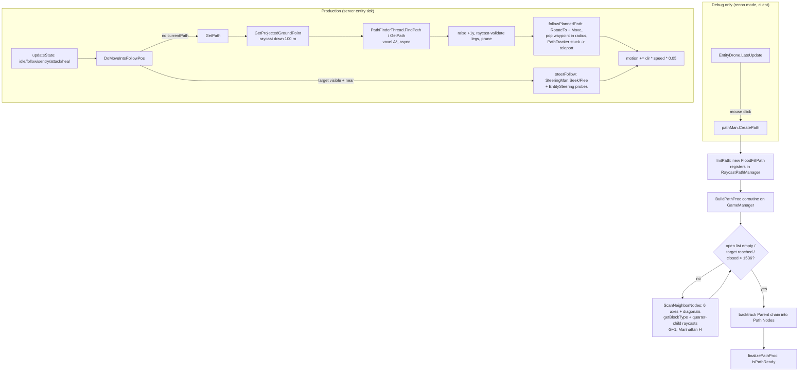
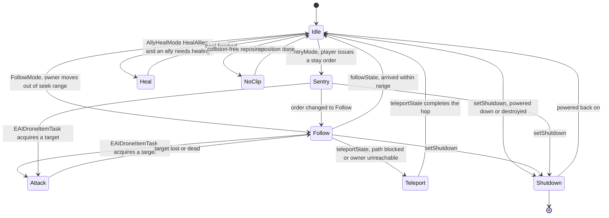

# Raycast pathing and drone steering (dedicated V3.1.0)

**Owns:** the `RaycastPathing` namespace (`RaycastPath`, `FloodFillPath`,
`RaycastNode`, `RaycastNodeHierarcy` (sic), `FloodFillNode`, `RaycastPathUtils`,
`RaycastPathWorldUtils`, `cPathNodeType`), the generators built on it
(`RaycastEntityPathGenerator`, `FloodFillEntityPathGenerator`), the
`RaycastPathManager` singleton, and the junk drone steering layer
(`EntityDrone.SteeringMan`, `EntityDrone.EntitySteering`) plus the drone
methods that consume both (`GetPath`, `DoMoveIntoFollowPos`,
`followPlannedPath`, `steerFollow`, the state machine).
**Not:** the production voxel A* the rest of the AI uses
(`GamePath.PathFinderThread` / ASP, owned by [`entity-ai.md`](entity-ai.md));
drone persistence, streaming, and sync (owned by
[`vehicles-drones-turrets.md`](vehicles-drones-turrets.md)); the Aron Granberg
A* library internals (third-party residual, see
[`closed-gaps.md`](closed-gaps.md)).
**Evidence:** IL of every type above (`RaycastPathWorldUtils` 27 methods,
`EntityDrone` 250, `FloodFillEntityPathGenerator` 8, `RaycastPathManager` 9,
`EAIDroneItemTask` 18); dump locally with `tools/src/DumpMethod`, git-ignored.
**Hub:** [`INDEX.md`](INDEX.md). **Method:** [`re-methodology.md`](re-methodology.md).

Do not redistribute game IL.

---

## 1. What this system is, and who actually uses it

7DTD ships **two pathfinders**. The main one is the voxel A* behind
`GamePath.PathFinderThread` (ASP coroutine driver, [`entity-ai.md`](entity-ai.md)
§6). The second is this one: a physics-raycast block scanner plus an A*-flavored
flood fill, living in the `RaycastPathing` namespace. Caller analysis over the
whole assembly shows its consumer set is exactly:

| Caller | What it uses | `Context` |
|---|---|---|
| `EntityDrone` (junk drone) | everything | state machine, movement, debug |
| `EAIDroneItemTask` | `RaycastPathUtils` draw/blocked checks via drone helpers | drone weapon-mod attack task |
| `EntityDrone.PathTracker` | `RaycastPathUtils.IsPositionBlocked` | stuck detection |
| `GameManager` | `RaycastPathManager.Init` / `.Update` | `StartAsServer` + `gmUpdate` tick |

No zombie, animal, NPC, or vehicle touches it. It is the **junk drone's private
navigation toolkit**, and the flood-fill path *generator* itself turns out to be
debug-only (§4). What runs in production is the raycast *query* layer (blocked
checks, volume scans) and the steering layer, glued to A* paths.

## 2. Type map

```
RaycastPathing (namespace)
  RaycastPath          Nodes: List<RaycastNode>, ProjectedPoints, Info
    FloodFillPath      + open/closed lists (A* frontier)
  RaycastNode          composition: `RaycastNodeInfo` (pos/scale/depth)
    FloodFillNode      + RaycastNodeHierarcy, cPathNodeType
  RaycastNodeHierarcy  parent, neighbors, children, childAirBlocks,
                       childSolidBlocks, waypoint, flowToWaypoint
  `RaycastNodeInfo`      position, scale, depth (0.5-scale quarter children)
  `FloodFillNodeScore`   G, H; F = G + H
  RaycastPathUtils     static Physics.Raycast wrappers + debug draw
  RaycastPathWorldUtils static block/volume scanners over World + Physics
  cPathNodeType        Unassigned=0 Air=1 Solid=2 Door=3 Half=4
  dColor               debug palette

<global>
  RaycastEntityPathGenerator      lifecycle shell (coroutine on GameManager)
    FloodFillEntityPathGenerator  the actual search (EntityDrone.pathMan)
  RaycastPathManager              singleton path registry + debug draw
  EntityDrone/SteeringMan         pure-math steering primitives
  EntityDrone/EntitySteering      SteeringMan + physics probes
```

`RaycastNode` is not a subclass of `RaycastNodeHierarcy`; it *contains* one
(`info` + `hierarchy` + `nodeType` fields) and forwards `AddChild` /
`AddNeighbor` / `SetParent` / `SetWaypoint` / `GetNeighbor` to it. The
misspelling `RaycastNodeHierarcy` is the shipped type name.

**The A* handoff grid (`AstarVoxelGrid` / `AstarManager`, all IL-verified):**
the `AstarVoxelGrid` extends the A* Pathfinding `GridGraph`:
`ScanInternal()` (IL=6) is the coroutine shell for the grid scan;
`UpdateArea(graphUpdate)` (IL=102) runs `CalculateAffectedRegions`,
`RecalculateCell`s every affected cell, then `CalculateConnections`s each
cell of the expanded region (the incremental graph update);
`CalcBlockingFlags(pos, offsetY)` (IL=99) probes the default physics scene
with a sphere-cast and derives the walkability flags from the hit normal;
`AddConnection(node, other, cost, tag, payload)` (IL=85) /
`RemoveConnection(node, other)` (IL=84) maintain a node's `Connection[]`
through `AllocConnection(count)` (IL=33, pooled per array length < 16) and
`ClearConnections(node)` (IL=38, pool-returned).
`AstarManager` (the per-world path manager) owns the area registry:
`AddArea(pos, noNext)` (IL=64) aligns to 16-block cells, reuses or news an
`Area` (updateDelay 2) and chains a follow-up area while the delay is low;

**`AstarVoxelGrid` tuned constants (IL):** `cGridHeight` = **320** (scan
height), `cCollisionMask` = **1073807360** (physics mask), climb `cClimbMinHeight`
= **0.6** / `cClimbMaxHeight` = **1.51** m, drop `cDropOnTopHeight` = **0.95** /
`cDropMaxHeight` = **9.4** m, `cDoorPenalty` = **2** (extra cost through doors),
`cConnectionPoolMax` = **16** (per-node connection pool). Walkability blocker
flags (`cBlockerFlag*`): low `15` (0x0F), low0 `1`, high `240` (0xF0), high0
`16`, high-low `255`, high-low0 `17`, slope dir0 `256`, ladder `8192` (0x2000),
door `16384` (0x4000), floor `4096` (0x1000).

**`AstarManager` grid constants (IL):** character `cCharDiameter` = **0.3** m /
`cCharHeight` = **1.8** m (the walkability probe), grid `cGridXZSize` = **76**
cells, `cGridY` = **-32**, `cGridHeight` = **320**; merge `cPlayerMergeDist` =
**19** (sq 361); movement `cMoveDist` = **10**, `cUpdateDeltaTime` = **0.1** s,
location `cLocationDuration` = **4** s / `cLocationFindPer` = **0.2**.

`AddAreaBlock(pos)` (IL=26) merges the block into the area's bounds
(partial-flag set); `FindLocation(pos, size)` (IL=47) returns the nearest
registered `Location` whose `size` fits and lies within
`(size * size * 0.04)^2`; `OnBlockChanged(pos, bvOld, densOld, texOld,
bvNew)` (IL=209) routes block edits into `UpdateBlock(pos, ...)` (the grid
dirty-marking the search reads).

### Block classification

`RaycastPathWorldUtils.getBlockType` maps a world position to `cPathNodeType`:

- `BlockShape.IsSolidSpace || IsSolidCube` → **Solid**
- `BlockValue.isair` → **Air**
- block has the Door tag (`Block.HasTag(2)`) → **Door**
- otherwise, if `HasSubBlocks` (quarter-block child probes find geometry) →
  **Half**, else Solid/Air per overload

**Half** nodes get four 0.5-scale children at `quarterBlockOffsets`, each
classified Air/Solid by a point raycast (`IsPointBlocked`). This is the "node
hierarchy": one block node, quarter-block children, `childAirBlocks` /
`childSolidBlocks` partitions. It lets the search thread paths through
partially-occupied blocks (poles, plates, bars) that a whole-block grid would
reject.

**Hit-tag classification:** `GameUtils.IsBlockOrTerrain(tag)` (IL=22) accepts
`B_Mesh`, `T_Mesh`, `T_Mesh_B`, `T_Block`, `T_Deco` (a `Component` overload
uses `CompareTag`). `GetDirByNormal(normal)` (IL=11 + IL=22) normalizes,
rounds to integers, and indexes `NeighborsEightWay` (the `DirEightWay` list,
-1 on no match). `GetClosestDirection(rotation, limitTo90)` (IL=74) reduces
the angle modulo 360 and quantizes: 90-limited to the four even directions
(0/2/4/6 at the 315/45/135/225-degree boundaries), full range to all eight
(22.5-degree half-steps).

### Physics masks

All occupancy tests are Unity `Physics.Raycast` calls, not block-store reads
(block reads are only used for the Air/Solid/Door pre-classification):

| Mask | Bits | Used by |
|---|---|---|
| `0x40010000` | 16 + 30 | drone movement/LOS probes, ground projection, quarter-child probes |
| `0x10000` | 16 | altitude/ceiling, flood-fill clearance, recon click ray |
| `0x10010000` | 16 + 28 | `IsUnderground` (short down-ray from above the target) |

Layer names live in Unity project settings, not in IL; bit 16 is the collider
layer every world-geometry probe here uses. Water is special-cased by block
type id `240` (`isPosUnderWater`), not by raycast.

**`Voxel.OneVoxelStep` (IL=264) is the single-step DDA primitive.** Given thecurrent cell, an origin and a direction it returns the next cell along the
ray plus the crossed `blockFace` and the hit position on the ray: it
computes `sign` per axis, `tMax = (firstBoundary - origin) / dir` and
`tDelta = sign / dir` (both `+Infinity` for near-zero directions), advances
the smallest-`tMax` axis, and reports the face from the axis and sign
(x: 3/5, y: 1/0, z: 4/2, same mapping as `GetNextBlockHit`). A degenerate ray

**`Voxel` hit-mask flags (`HM_*`, IL):** `Transparent` 1, `LiquidOnly` 2,
`Moveable` 4, `Bullet` 8, `Rocket` 16, `Arrows` 32, `NotMoveable` 64,
`Melee` 128, `FirstNotEmptyBlock` 256, `All` 4095, `IgnoreFragile` 4096.
**`Voxel.ToHitMask(maskNames)` (IL=148, exact)** is the string-side of the same
table: splits on `hitMaskSeparator` and ORs each name's bit -
`Transparent` 1, `LiquidOnly` 2, `Moveable` 4, `Bullet` 8, `Rocket` 16,
`Arrow` 32 (the `HM_Arrows` bit), `NotMoveable` 64, `Melee` 128; unknown
names are ignored. This is how mask strings (AI/weapon config, `Voxel.Raycast`
callers) become the `HM_*` bitmask. Related raycast leaves:
`calcBestNormalToRaycastHit(cc)` (IL=37) picks from the static `phyxRaycastHit`
normal the `normals[i]` with the largest positive dot (the best axis-aligned
face normal for placement/stick); `GoBackOnVoxels(cc, ray, out bv)` (IL=47)
steps the ray back one voxel from the hit via `OneVoxelStep` with a 0.01
back-off, returning the empty edge cell (for placing against a surface).
with no finite `tMax` logs the same `Voxel error: GetNextBlockHit` string
(shared source) and returns `Vector3i.zero`. Consumers: `Block.GetFreePlacementPosition`
walks cells with it to push a placement away from the player, and
`Voxel.GetCellsOnRay` iterates a ray cell by cell with it.

`Voxel.GetCellsOnRay` (IL=242) iterates a ray cell by cell via
`OneVoxelStep` but has **no callers on b14** (dead leaf). `Voxel.RaycastOnVoxels`
(IL=290) is the physics ray/sphere-cast twin of `raycastNew` with the same tag
dispatch (plus a `GameManager.bVolumeBlocksEditing` gate), used only by the
client `PlayerMoveController.Update` (two sites) and
`ItemActionTerrainTool.OnHoldingUpdate` (terrain-tool preview) - client-side.

**`Voxel.Raycast` wrappers (V3.1.0 b14):** the 5-arg overload (IL=8) fills the
layer mask `-538488845` and calls the 6-arg; the bool overload (IL=20) builds
`hitMask = 66 | (bHitTransparentBlocks ? 1 : 0) | (bHitNotCollidableBlocks ?
4 : 0)` with sphere 0 (bit 0 = transparent blocks count as hits, bit 2 =
non-collidable blocks count); the 6-arg (IL=8) forwards to `raycastNew`
(IL=525), the real voxel-DDA core. The visibility chain (`CanEntityBeSeen`,
`EntityDrone.IgnoreCollisionEntity`) calls the 6-arg directly with the
layer mask `-1612492829` and hitMask `64`.

**`Voxel.raycastNew` (IL=525) - the physics-march core.** The 6-arg form
drives a physics ray (or `SphereCast` when `_sphereRadius > 0.01`) up to **10
iterations**, each time advancing the ray origin past the previous hit by
`point + dir * 0.01` and shrinking `distance` by `hit.distance - 0.01` (or
`0.01` when the hit is closer). The `_hitMask` selects which hits count; the
bits are decoded up front:

| Bit | Value | raycastNew meaning |
|---:|---:|---|
| 0 | 1 | see-through blocks count (`IsSeeThrough`) |
| 1 | 2 | water counts as a hit |
| 2 | 4 | non-movement-colliding blocks count |
| 3 | 8 | `IsCollideBullets` blocks |
| 4 | 16 | `IsCollideRockets` blocks |
| 5 | 32 | `IsCollideArrows` blocks |
| 6 | 64 | `IsCollideMovement` blocks |
| 7 | 128 | `IsCollideMelee` blocks |
| 12 | 4096 | skip water hits on blocks with `MaxDamage <= 5` |

Per hit, the collider tag dispatches: `T_Block` resolves entity-model blocks
to their master block (`GameUtils.FindMasterBlockForEntityModelBlock`),
`T_Deco` resolves the parent block via
`DecoManager.GetParentBlockOfDecoration` (reporting the deco block value with
`damage = MaxDamage - 1`), `IsBlockOrTerrain` delegates to `terrainMeshHit`,
and anything else (entity / non-block collider) is accepted directly with its
transform + tag. Accepted block hits test both the block and its prop
(`Block.IsSeeThrough` per hitMask bit 0; `IsCollide*` per bits 3..7). Hits
that do not match the mask clear the `VoxelData` and the march continues; the
loop ends with `false` when `distance <= 0` or after 10 iterations.

**`Voxel.GetNextBlockHit` (IL=549) - the voxel-DDA walker.** This is the
block-store traversal used by sight and projectile paths, stepping cell to
cell with the classic 3D-DDA: `tMax` per axis = `(nextBoundary - origin) /
dir` and `tDelta` = `sign / dir` (both `+Infinity` for near-zero
directions), advancing the axis with the smallest `tMax` and setting
`hit.blockFace` from the stepped axis and sign (x: 3/5, y: 1/0, z: 4/2).
Each cell runs the same mask filter (bits 0..7 as above, block + `IsSeeThrough`),
then `Block.intersectRayWithBlock` (see [block-shapes.md](block-shapes.md)
§3) confirms the ray actually crosses one of the block's colliders before the
hit is recorded with the current ray point as `pos`. Bit **8 (256)** is
`GetNextBlockHit`-only: the first non-air cell is a hit without any collider
or mask test. Hits beyond `distance^2` from the origin return `false`, and a
ray whose `tMax` never advances (all directions zero) logs
`Voxel error: GetNextBlockHit, tMax=...` and fails. `raycastNew` is the
physics-side twin: it also records water hits (bit 1) and honors the
MaxDamage <= 5 water skip (bit 12).

## 3. The flood-fill raycast path build

`RaycastEntityPathGenerator` is a lifecycle shell: `CreatePath(start, end,
speed, canBreakBlocks, yOffset)` → `cleanupPath` (abort coroutine, `Destruct`
old path, which also unregisters it from `RaycastPathManager`) → `InitPath`
(`new RaycastPath(start,end)`, which self-registers with the manager and
computes `RaycastPathInfo` start/end-indoors flags via `IsUnderground` rays) →
`beginPathProc` (`isBuildingPath = true`, start `BuildPathProc()` as a
coroutine **on `GameManager.Instance`**). The base `BuildPathProc` does nothing
but `finalizePathProc` (`isPathReady = true`); the real search is the
`FloodFillEntityPathGenerator` override, which the drone instantiates into its
`pathMan` field in `OnAddedToWorld`.

The override is a textbook time-sliced A* over block positions:

1. Seed `FloodFillPath.open` with a node at `Start`.
2. Loop: `getLowestScore()` picks the open node with lowest `F = G + H`
   (heuristic as tiebreak), moves it to `closed`.
3. Stop if its `BlockPos == TargetBlockPos`.
4. `AddNeighborNodes` → `ScanNeighborNodes`: build a `FloodFillNode` for each
   of the 6 `mainBlockAxis` neighbors (plus `diagonalBlockAxis` neighbors when
   enabled, each gated by two 1.5 m clearance raycasts), classify it, spawn
   quarter children for Half blocks, set `G = current.G + 1` and
   `H = getH` (Manhattan distance, all three axes).
5. `IsValidNeighbor` admits: Air; Solid only if it *is* the target block; Door
   only if physically blocking (raycast hit) **and** its
   `TileEntityComposite`/`TEFeatureDoor` reports `IsOpen()`; Half via its air
   children (`ProcNeighborNodes` picks reachable child air blocks, merges their
   bounds into a waypoint node).
6. Nodes already on open/closed (`IsPosOpen`/`IsPosClosed`) are skipped.
7. Hard cap: if `closed.Count > 1536` it logs `"Search Exausted."` (sic) and
   bails with the best-so-far node.
8. Backtrack the `Parent` chain from the last closed node, `AddNode` each into
   `Path.Nodes`, then finalize. `pathToList()` reverses node positions into a
   start→end `List<Vector3>`.

Each search iteration yields `WaitForSeconds(debugTick)`, so a build spreads
across frames on the main thread; there is no worker thread, unlike ASP.



## 4. Production reality: the generator is debug-only

`FindCallers` over the whole assembly finds exactly **one** call site for
`RaycastEntityPathGenerator.CreatePath`: `EntityDrone.LateUpdate`, inside a
branch gated on `DroneManager.Debug_LocalControl`. That flag is flipped only by
`EntityDrone.Debug_ToggleReconMode`, reached from the `ConsoleCmdJunkDrone`
(`jd debugrecon` / `drc`) console command, and the branch drives a recon
camera with `Input.GetAxis` mouse look; a left click raycasts through
`Camera.ScreenPointToRay` and builds a flood-fill path from the owner to the
clicked block:

```il
IL_0110: ldfld  FloodFillEntityPathGenerator EntityDrone::pathMan
IL_013E: callvirt System.Void RaycastEntityPathGenerator::CreatePath(...)
```

That is a developer path-visualization tool, **client-only by construction**
(camera, mouse, local player) and dead on a dedicated server. The same flag
gates the WASD manual-drone-flying branch at the top of
`EntityDrone.updateTasks`. Nothing in the shipped assembly ever consumes
`isPathReady`/`pathToList` output for movement.

What the dedicated server *does* run from this namespace, every drone tick:

- `RaycastPathUtils.IsPositionBlocked` / `IsPointBlocked` /
  `CheckPositionBlocked`: thin `Physics.Raycast` wrappers used for every drone
  LOS, obstacle, and teleport-spot test.
- `RaycastPathWorldUtils.ScanVolume` + `FindNodeType(Air)` in
  `GetGroupPositions`: validates the five candidate hover points around the
  owner (behind, flanks) against real air blocks.
- `pathMan.IsConfinedSpace(position, 3)` in `OnUpdateEntity` on an
  `areaScanTimer` cadence while idle/following/sentry: flood-scans blocks
  around the drone (`ScanBlocksAround`) and reports confinement when the air
  count is below `dist²`. The result field `isInConfinedSpace` is written but
  **never read**, a vestigial output (re-checked on V3.1.0 b14).
- `RaycastPathManager`: `Init` in the `GameManager.StartAsServer` coroutine,
  `Update` from `gmUpdate` ([`loop-gmupdate.md`](loop-gmupdate.md) peer list).
  It only holds the registry of live `RaycastPath` objects and debug-draws them
  when its `DebugModeEnabled` static is set; on a dedicated server the tick is
  an effective no-op.

## 5. The real drone path: A* handoff

When the drone needs to travel (follow beyond seek range, sentry return,
attack positioning via `EAIDroneItemTask`), `followState`/`sentryState` first
check `PathFinderThread.Instance` and call `DoMoveIntoFollowPos`:

1. **No `currentPath` yet** → `GetPath`. Start and end are projected to the
   ground with a 100 m down-raycast (`GetProjectedGroundPoint`, mask
   `0x40010000`, `blockHeightOffset` lift). `GetProjectedPath` then talks to
   the **standard voxel A***: `PathFinderThread.GetPath(entityId)` for a
   finished `PathEntity`, else `FindPath(...)` to enqueue and return false
   (retry next tick, classic async pattern from
   [`entity-ai.md`](entity-ai.md) §2). Returned `PathPoint.projectedLocation`
   waypoints are raised one block, then each leg is re-validated with
   raycasts; blocked legs get their endpoints nudged from the hit data and
   unusable head segments pruned (`RemoveAt`/`RemoveRange`).
2. **Path exists** → if the target is raycast-visible and close, steer
   directly (`RotateTo` + `Move`); otherwise `followPlannedPath`: rotate and
   `Move` toward `currentPath[0]`, pop it inside `pointRadius`, and if
   `PathTracker.IsStuck` (position barely changed for a window, or embedded in
   a block per `IsPositionBlocked`), **teleport** to the next waypoint and drop
   the consumed ones.
3. `clearCurrentPath`/`OnPathInterupted` clears the list, stops
   `EntityMoveHelper`, clears `PathNavigate`, and calls
   `PathFinderThread.RemovePathsFor(entityId)`, the same cleanup contract every
   A* client honors.

`EntityDrone.updateTasks` also gates the base `EntityAlive.updateTasks` (the
normal EAI/UAI task tick that `EAIDroneItemTask` runs under) on
`PathFinderThread.Instance` being non-null. So the drone's "planned path" is
the shared A* system end to end; `RaycastPathing` contributes only the raycast
projection and validation around it.

## 6. Steering layer

`SteeringMan` is stateless vector math:

- `Seek(pos, target, radius)`: direction to target, linearly damped by
  `dist/radius` inside the arrival radius (`doSeek`); `Flee` = `-Seek`;
  `Seek2D`/`Flee2D` zero the y component; `GetPointAround` =
  `Cross(dir, up) * radius * 0.5` (a sideways offset).

`EntitySteering` (constructed in `EntityDrone.Awake`, holds the entity and a
`SteeringMan`) adds physics awareness:

- `getAltitude`/`getCeiling`: 1000 m down/up raycast on mask `0x10000`,
  distance or -1.
- `doHover(pos, height, radius)`: up/down unit vector toward the target
  altitude, proportionally damped inside `radius`.
- `doAvoidArc`: if the drone sits within `degrees/2` of the observer's view
  direction, compute a lateral escape point (`GetPointAround`) and `Flee` from
  the projected view line; `AvoidTargetView` / `pursueAvoidOwnerView` /
  `FollowTarget` compose `Seek` toward the target with `AvoidArc2D` so the
  drone approaches while staying out of the owner's or enemy's aim cone.

The state machine (`updateState`, 0.05 s cadence: idle / sentry / follow /
heal / attack, plus teleport and underwater interrupts) feeds these into
`move()`: forward probe at `physColHeight` on mask `0x40010000`, and if clear
(or `ignoreObsticles`, or owner on a vehicle) `Entity.motion += dir * speed *
0.05`, one overload clamping the step to the remaining distance. Notable
behaviors, all raycast-driven:

- `steerFollow`: accelerate toward `max(15, dist)` while beyond 10 m of the
  owner (lerp over `accelerationTime/SpeedFlying`), decelerate inside;
  half-weight `Flee` off the owner's chest when 5-24 m away, inside a 45
  degree cone of the owner's look vector, with clear LOS (get out of the
  player's face); 0.75-weight upward `Seek` when altitude < a third of the
  distance and the block above is clear.
- `onUnderWaterState`: if the target chest position resolves to water block
  type 240, drop any path and `Seek` to `findOpenBlockAbove` (scan up to 256
  blocks up).
- `teleportState`: candidate spots from `GetGroupPositions` (validated by
  `ScanVolume` air nodes), two-way `IsPositionBlocked` visibility check per
  spot, fall back to the raycast hit block center, then `SetPosition`, the
  out-of-range recovery documented in
  [`vehicles-drones-turrets.md`](vehicles-drones-turrets.md).
- `EAIDroneItemTask` (the attack task for weapon-modded drones) reuses the
  same helpers: `DoMoveIntoAtkPos`, `DoFleeFromTargetEntity`,
  `FollowPlannedPath`, and `GetPath` all delegate to the `EntityDrone`
  methods above.

## 6b. The drone state machine

The drone is a real state machine and the steering above is its motor. `EntityDrone`
holds a nested `State` enum and **`SetState(State next, bool sync)` is the single
mutator** (verified: `EntityDrone::state` has no other `stfld`, and `SetState` has 15
call sites). `updateState` runs on a 0.05 s cadence and advances `stateTime`.

| State | Value | Meaning |
|---|---:|---|
| `Idle` | 0 | parked near the owner, area scan on the `areaScanTimer` cadence |
| `Sentry` | 1 | holding a guard post (`SentryMode`) |
| `Follow` | 2 | travelling to the owner's follow position (`FollowMode`) |
| `Heal` | 3 | ally-heal behaviour (`AllyHealMode.HealAllies`) |
| `Attack` | 4 | engaging, driven by `EAIDroneItemTask` |
| `Shutdown` | 5 | powered down (`setShutdown`) |
| `NoClip` | 6 | collision-free reposition |
| `Teleport` | 7 | recovery hop (`teleportState`) when travel fails |
| `None` | 8 | unset sentinel |



**Read the edges as the transition drivers, not as exhaustive guards.** Each edge is
named for the method that performs the `SetState` (`FollowMode`, `SentryMode`,
`followState`, `teleportState`, `setShutdown`, `onInterruptState`,
`updateTransitionState`); the precise condition each one tests lives in that method's
IL. `onInterruptState` and `updateTransitionState` can return the drone to `Idle`
from several states, which is why `Idle` is the hub.

---

## 7. Dedicated vs client

Confirmed by callers and gating flags:

| Piece | Dedicated server | Client |
|---|---|---|
| State machine + steering + `move` (`OnUpdateEntity`/`updateTasks` in the entity tick) | yes (authority; drone is server-simulated, [`vehicles-drones-turrets.md`](vehicles-drones-turrets.md)) | remote copy interpolates |
| A* `GetPath` / `followPlannedPath` | yes | no |
| `RaycastPathUtils`/`WorldUtils` probes, `ScanVolume`, `IsConfinedSpace` scan | yes | only under debug |
| `RaycastPathManager` Init + `gmUpdate` tick | yes (draw-only body, no-op headless) | yes |
| **`FloodFillEntityPathGenerator.CreatePath` flood fill** | **never** (needs `Debug_LocalControl` recon mode) | debug console only |
| Recon camera / WASD manual control (`LateUpdate`, `updateTasks` head) | never | debug console only |
| `focusBoxNode` nudge (drone moves out of the block you aim at) | never (`Owner is EntityPlayerLocal` gate) | yes, owner's client |
| `drone_idle_hover` audio loop | never (explicit `IsDedicatedServer` check) | yes |

Physics raycasts on the server hit the server-side chunk colliders; that is
the whole reason this system works headless at all.

## 8. Costs and limits

- Every neighbor expansion in the flood fill and every Half classification is
  one or more `Physics.Raycast` calls on the main thread; the 1536-closed-node
  cap and the `WaitForSeconds` slicing are the only brakes. This, plus the
  recon-mode gate, is consistent with the generator being a shelved
  experiment: 3D volumetric pathing for a flying entity that shipping code
  replaces with ground A* plus altitude steering.
- The steering fallback needs no path data at all: it degrades to Seek/Flee
  plus single raycasts, which is why a drone still follows through open
  terrain if the pathfinder is saturated (blood moon admission pressure,
  [`entity-ai.md`](entity-ai.md) §3).
- `RaycastPath` objects self-register in `RaycastPathManager` on construction
  and only leave via `Destruct()`; the drone's `cleanupPath` honors this, so
  the registry stays bounded at one live path per generator.

## Related docs

| Doc | Role |
|---|---|
| [entity-ai.md](entity-ai.md) | The production A* (`PathFinderThread`/ASP) this system hands off to |
| [vehicles-drones-turrets.md](vehicles-drones-turrets.md) | Drone manager, streaming, teleport-to-owner, sync |
| [closed-gaps.md](closed-gaps.md) | ASP→A* residual status; third-party Granberg internals |
| [loop-gmupdate.md](loop-gmupdate.md) | `gmUpdate` peer list including the `RaycastPathManager` tick |
| [full-surface.md](full-surface.md) | Namespace coverage row for `RaycastPathing` |
| [console-commands.md](console-commands.md) | Console command surface (the `jd`/`jds` drone debug command lives in `ConsoleCmdJunkDrone`) |
| [re-methodology.md](re-methodology.md) | How this was reversed |

## Changelog

- **2026-08-11:** A* grid IL re-verified: ScanInternal IL=6, UpdateArea IL=102, CalcBlockingFlags IL=99, AddConnection IL=85, RemoveConnection IL=84, AllocConnection IL=33, ClearConnections IL=38, AddArea IL=64, AddAreaBlock IL=26, FindLocation IL=47, OnBlockChanged IL=209, IsBlockOrTerrain IL=22, GetDirByNormal IL=11/22, GetClosestDirection IL=74, OneVoxelStep IL=264, GetCellsOnRay IL=242 (corrected from stale 244), Raycast IL=8/20/8, raycastNew IL=525, GetNextBlockHit IL=549 (exact).
- **2026-08-10:** AstarVoxelGrid IL sizes re-verified: ScanInternal IL=6, CalcBlockingFlags IL=99, AddConnection IL=85 (exact).
- **2026-08-08:** Voxel.raycastNew (IL=525) physics-march core: 10-iteration
  loop, sphere-cast when radius > 0.01, full hitMask bit table (1 see-through,
  2 water, 4 non-movement, 8 bullets, 16 rockets, 32 arrows, 64 movement, 128
  melee, 4096 low-MaxDamage water skip), T_Block/T_Deco/terrain tag dispatch;
  Voxel.GetNextBlockHit (IL=549) 3D-DDA walker: tMax/tDelta stepping,
  blockFace per axis/sign, bit 256 direct any-block mode, distance^2 cutoff,
  Voxel error log; Voxel.OneVoxelStep (IL=264) single-step DDA primitive for
  GetFreePlacementPosition / projectile checkCollision / terrainMeshHit;
  GetCellsOnRay dead on b14, RaycastOnVoxels client-only (PlayerMoveController,
  terrain tool).
- **2026-08-07:** Voxel.Raycast wrappers: 5-arg layer mask -538488845, bool
  hitMask bits (1 transparent / 4 non-collidable), 6-arg -> raycastNew
  (IL=525); visibility chain uses -1612492829 + 64.
- **2026-07-26:** Added the drone `State` machine diagram (9-member nested enum, `SetState` as sole mutator with 15 call sites) which the doc previously described in prose only.
- **2026-07-24:** Initial reversal: full `RaycastPathing` type map and block
  classification (quarter-block Half hierarchy, door handling), the
  `FloodFillEntityPathGenerator` time-sliced A*-over-raycasts build and its
  1536-node cap, proof via caller analysis that `CreatePath` is reachable only
  through the client recon debug mode (`jd debugrecon`), the production drone
  flow (A* `PathFinderThread` waypoints + raycast ground projection +
  `followPlannedPath` + stuck-teleport), the `SteeringMan`/`EntitySteering`
  primitive set, and the dedicated-vs-client split table.
