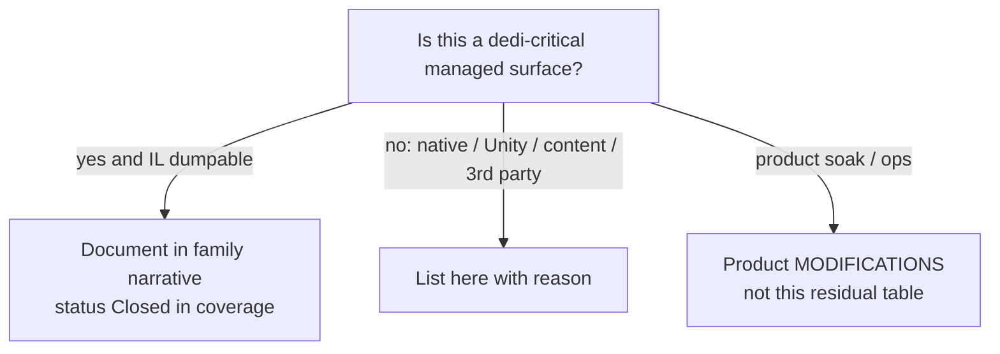

# Residuals: what cannot be closed from dedicated managed IL

**Owns:** non-IL residual list (only place for permanent open items).  
**Pin:** V3.1.0 (b14) dedicated.  
**Coverage of managed families:** [`coverage.md`](coverage.md).  
**Hub:** [`INDEX.md`](INDEX.md).

**Policy:** every residual here is **non-managed**, **native**, **Unity-settings**, **content-dependent**, **third-party black box**, or a bounded **annotation-backlog** (managed and already dumped, but a full hand-annotation is optional, not required for loop/wire understanding).  
No dedi-critical managed surface may remain unmapped: the mapping exists in the dumps; only exhaustive prose annotation of a few large payloads is deferred.



---

## 1. Residuals (honest; closed via IL or runtime where possible)

Status legend: **Closed** = resolved with evidence; **Partially closed** = key
question answered, a narrow nuance remains; **Permanent** = structurally not
closable from this corpus (native/third-party/OS layer), with the closed
managed surface stated; unmarked = non-residual (data, out of scope, model
limit, or process).

| Residual | Status / why not closed by Assembly-CSharp RE |
|---|---|
| **Unity script execution order** among GameManager / ConnectionManager / DynamicMeshManager / Entity MBs | **Closed (2026-08-09, runtime):** observed on the stock V3.1.0 dedicated server via a Harmony stamp probe (`workspace/experiments/script-order-probe`, git-ignored). Per-frame order: `GameManager.FixedUpdate`(+`Origin.FixedUpdate` no-op) -> `SdtdConsole.Update` -> **`ConnectionManager.Update`** -> **`GameManager.Update`** -> (`WorldEnvironment.Update` / `DynamicMeshManager.Update` when components present) -> `ConnectionManager.LateUpdate` -> `GameManager.LateUpdate`. **Invariant: ConnectionManager.Update always precedes GameManager.Update** (518 stable frames). Stored in Unity project settings, so it was not derivable from IL alone; now pinned by observation. See [loop.md](loop.md) §1.1 |
| **Which Entity GameObjects stay `enabled` on pure dedicated** | **Closed (2026-08-10, runtime):** with a live dedicated sim (loadgen join-mode player + AI/scout + telnet-spawned zombies), the stock V3.1.0 dedi keeps every spawned entity GameObject **active and enabled**: repeated probe dumps showed `World.Entities` Count 9->17, `World.Players` Count=1, and `total=17 goActive=17 goInactive=0 mbEnabled=17 mbDisabled=0` (EntityPlayer, EntityZombie, EntityAnimalSnake all `activeInHierarchy=True` + MB `enabled=True`). So entities on dedicated tick with active GOs and enabled MBs (matches `EntityAlive.Update` GO-enabled path, [loop.md](loop.md) §3.2); the engine does **not** mass-disable entity GOs on headless. Caveat: an earlier probe session (2026-08-10) recorded `World.Entities`/`World.Players` empty on an idle dedi - that was the true state with **no sim population** (the loadgen self-test bot drowned in ~1.5 s and never registered in the world; telnet `spawnentity` silently no-ops when no valid entity id exists), not a general property of the registry. The registries populate exactly when `SpawnEntityInWorld` -> `Entities.Add` runs ([spawning.md](spawning.md) §7); on an empty world they are legitimately empty. Probe: `workspace/experiments/script-order-probe` (git-ignored) |
| **LiteNetLib transport internals** | **Closed (2026-08-10 + 2026-08-12).** `LiteNetLib.dll` is a **managed .NET assembly**. Closed: `NetManager` event machinery (pool pop + pending-list push + `PollEvents` drain, all `_eventLock`-guarded), the `UnsyncedEvents=true` config in `NetworkCommonLiteNetLib.InitConfig` (IL=22), and the join-churn flake root cause: `ConnectionRequestCheck` (IL=86) enumerates `ConnectionManager.Clients.List` **on the socket-receive thread** while the main thread mutates it -> `Collection was modified` -> `RemoteConnectionClose` ([network.md](network.md) §4.0). 2026-08-12: the **reliability / flow / MTU algorithms are now narrated** ([network.md](network.md) §4.6) - 64-packet sliding window over a 32768 sequence space, bitmap acks, 27 ms default resend, no AIMD, MTU discovery from 1024 up to 1432 every 1 s. Remaining un-narrated surface is the generic serializer family (`NetSerializer`/`NetPacketProcessor`, unused by the game's wire which has its own pooled reader/writer) |
| **EAC / EOS AntiCheat wire protocol** | **Managed envelope closed; EAC protocol permanent.** Closed: `NetPackageEAC` (Setup(len,data), IsServer routing, ClientInfo.SendPackage), the managed `HandleMessageFromClient` -> EAC bridge, EOS wrappers ([platform-auth.md](platform-auth.md) §4). Not closable: the EAC **anti-cheat protocol itself** (what the EAC client/server exchange, hashes, challenges) - that runs in the EAC native service outside the game DLL; the game only passes opaque bytes |
| **Aron Granberg A\* library internals** | **7DTD usage closed; third-party internals permanent.** Closed: the ASP -> A* handoff (`AstarVoxelGrid` / `AstarManager` / `AstarPath.StartPath` call sites, all IL-verified, [raycast-pathing.md](raycast-pathing.md) §5), grid/frontier semantics. Not closable: the internals of the **third-party Granberg `Pathfinding.dll`** (heuristics, open/closed-list internals) - separate compiled third-party code, not the game's `Assembly-CSharp`, and redistributing its RE would not be stock-game research |
| **ModEvents subscriber sets** | **Closed for stock + standard mod set (2026-08-09/10, runtime):** **pure-stock** V3.1.0 dedi (no mods): 15/22 events have GameCore subscribers, all `mod=(null) core=True` (WorldShuttingDown 3; GameStarting / GameStartDone / GameShutdown / PlayerSpawnedInWorld 2; GameFocus / MainMenuOpening / MainMenuOpened / GameUpdate / ServerRegistered / UnityUpdate / PlayerJoinedGame / PlayerSpawning / PlayerDisconnected / CalcChunkColorsDone 1; GameAwake / CreateWorldDone / PlayerLogin / SavePlayerData / GameMessage / ChatMessage / EntityKilled 0). With EfficientServer 1.17.0 + 7dtd-apm-bridge: **identical except GameStartDone 2 -> 3** (one anonymous mod handler added). So the stock baseline is fully pinned and the delta for the standard mod set is exactly one anonymous GameStartDone handler; both subscribe via Harmony directly, not ModEvents. Hook names closed in [managers.md](managers.md); probe in `workspace/experiments/script-order-probe` (git-ignored). Note: any other mod set can add handlers, so this pins the stock baseline + this delta, not a universal answer |
| **Post-patch IL drift** | TFP updates move offsets; regenerate dumps (process residual) |
| **Region sector payload byte codec detail** | **Closed (2026-08-06/07 + 2026-08-12):** Raw free-list + V1/V2 WriteData ([save-region.md](save-region.md) 3.3-3.4); location/timestamp packing (3.5); Raw **11-byte** header `7rr`+version:i32+paddingBytes:i32 from `New`/`Load`. 2026-08-12: the sector payload is now **byte-exact verified end-to-end** - V2 framing (len + 12-byte gap + data), `ttc\0` + Chunk.CurrentSaveVersion 47 preamble, raw Noemax deflate, and the whole `Chunk.save` body (layers, maps, channels, volumes) parse on 16 probe saves; the stock server boots the saves back (game-reader round-trip, gettime matches the parsed worldTime). `.7rr` is a dead path on stock dedicated (sector factory is unconditional). |
| **Client-only UI / avatar / NGUI / camera** | Out of dedicated scope (non-goal) |
| **Full NetPackage body catalog (193 wire packages)** | **Closed:** metadata census for all 193; auto body sequences in [inventories/netpackage-bodies.md](inventories/netpackage-bodies.md); P0/P1 + high-traffic families hand-narrated in [protocol-packages.md](protocol-packages.md) sections 1-6.23; per-flag framing for all 37 conditional-heavy packages verified from write IL in §6.23 (2026-08-10) |
| **Encryption cipher / KDF primitives** | **Managed session transform closed; native primitives permanent.** Closed: the handshake package bodies and the managed `AesEncryptAndMac` session transform (AES + HMAC, [network.md](network.md) §4.5). Not closable: RSA key wrap and platform RNG quality - anything below `System.Security.Cryptography` providers (OS/OpenSSL native crypto), which has no game sim logic |
| **XML content semantics** | Blocks/items/biomes/prefabs are data, not loop IL |
| **Discord GameSDK integration (`DiscordManager`, 140 methods)** | **Closed (2026-08-10, IL + runtime):** IL shows multiple `GameManager.get_IsDedicatedServer()` gates in `DiscordManager` (lines 874, 2007, 2469, 2605) - the Discord paths skip on dedicated. Runtime confirms: across 12 dedicated boots the log contains only static `libdiscord_partner_sdk.so` preload + 16 `GamePref.Discord*` defaults, **zero live activity** (no connection, presence, lobby, auth). The manager is instantiated but never activates on a headless server. A client social feature, not a dedicated codepath |
| **Server-side support/utility code (enumeration-level, not per-method narrated)** | Cross-cutting helpers the reachability set includes but no subsystem doc singles out: `Configuration.*` XML/option parsing, `StringParsers`, `TEFeatureAbs` base helpers. Covered by their owning frameworks ([blocks.md](blocks.md)/[tile-entities-power.md](tile-entities-power.md)) and the [full-surface.md](full-surface.md) caveat; a per-method narrative would not add sim understanding |
| **0-method data-carrier types can never be "reached"** | The reachability model is method-based (`reached = declaring types of visited method bodies`). Types with **no method bodies** (`QuestEvent_*` payload structs, enum holders, DTO records) are structurally absent from the reached set no matter what seeds are added. They are classified with roles in [out-of-scope-surface.md](out-of-scope-surface.md) and enumerated in the full-surface census, but the graph will always report them as unreached. This is a model limitation, not a documentation gap |

---

## 2. Closed items formerly listed as open

| Former gap | Closure |
|---|---|
| AIDirector default components | closed-gaps.md |
| ASP path body → AstarPath | closed-gaps.md |
| Net package distance bands | closed-gaps.md / network.md |
| GameTimer 20 Hz | closed-gaps.md |
| DynamicMesh version-160 WriteRegion as live path | [dynamic-mesh.md](dynamic-mesh.md): live `SaveRegion`; `WriteRegion` only self-retry (Xref, 2026-08-06) |
| Region location/timestamp header bit packing | save-region.md §3.5 (Raw + sector) |
| Chunk GetBlock/density index | [terrain-height.md](terrain-height.md), [world-chunks.md](world-chunks.md) (IL dumps in realearth-surfaces-v3.1.0) |
| Chunk write/read layer bound 64 | save-region.md |
| WorldState.SaveLoad structure | save-region.md + dedi-complete §5 |
| Origin.FixedUpdate on dedicated | **No-op:** `IsDedicatedServer` → early `ret` ([loop.md](loop.md)) |
| Land claims / PPL accessor | dedi-complete + product `realearth-surfaces.md` (product SoloSlide) |
| ModEvents field inventory | managers.md |
| NetPackage type census (194: 193 wire + NetPackageManager) | network.md + dedi-complete §3 |
| Light/stability/mesh/water method map | light-mesh-water.md |
| Manager Update IL table | managers.md |
| ChunkBlockChannel Read/Write | dedi-complete §12 (IL=151/120) |
| Encryption handshake wire path | protocol-packages.md §2 (4 packages decoded; cipher/KDF native) |
| Channel-1 bulk band + compressed-package set | protocol-packages.md §1 (6 channel-1, 8 compressed) |
| Chunk/ChunkRemove/WorldInfo/WorldTime/SetBlock/HoldingItem/PlayerInventory bodies | protocol-packages.md §3-6 |
| Prefab.CopyIntoLocal entry | product `realearth-surfaces` / dump IL=680 |
| Entity/ChunkManager OriginChanged bodies | product `realearth-surfaces` (Origin section) |

---

## 3. Managed RE corpus status (2026-08-07)

For **dedicated managed** surfaces under the coverage bar (families 1-11 in
[coverage.md](coverage.md)). Definition of done: [completion-bar.md](completion-bar.md)
**tiers A+B**.

**Coverage.exe (live ASM, 2026-08-08):**

| Tier | Count |
|---|---:|
| Game types in reach base | 3681 |
| Narrated | 3681 (100%) |
| Catalogued only | 0 |
| (refresh after each Coverage run) | |
| Classified OOS | 0 |
| **Unaccounted** | **0** |

Also:

- All **193** `NetPackage*` census names appear in narrative docs
- High-traffic package bodies + bulk residual catalog: [protocol-packages.md](protocol-packages.md) 1-6.23
- Flat write sequences for every package: [inventories/netpackage-bodies.md](inventories/netpackage-bodies.md)
- Region Raw header + location packing closed (save-region §3.5)

What remains open is **only** the section-1 table rows not marked Closed /
Partially closed (EAC/EOS wire, A* library internals, content
XML, client UI, model limits) plus **optional** annotation depth (per-flag
package framing, per-console-command prose). Several previously-open rows were
closed by runtime observation in 2026-08-09/10 (Unity script order, Discord
GameSDK, ModEvents subscriber sets, entity-GO registry state, LiteNetLib
event machinery + join-churn flake root cause). Those cannot be
finished by "more managed RE until every IL line is prose."

## 4. Origin dedicated gate (correction)


Earlier notes that Origin “still repositions on dedicated” are **wrong**. Measured prologue:

```text
call GameManager.get_IsDedicatedServer
brtrue → ret    // dedicated: return immediately
```

`DoReposition` fan-out still matters for **client/listen** hosts and for understanding entity/chunk GO shifts, not for pure dedicated FixedUpdate cost.

---

## Related docs

| Doc | Role |
|---|---|
| [coverage.md](coverage.md) | Family closed checklist |
| [engine-limitations.md](engine-limitations.md) | Stock ceilings (including residual-tagged rows) |
| [protocol.md](protocol.md) | Wire residuals vs closed golden packages |
| [ZIG_CLONE.md](../../zdtd/docs/ZIG_CLONE.md) | Clone readiness matrix |
| [INDEX.md](INDEX.md) | Research hub |
| Product status (not residuals) | `7dtd-realworld/docs/MODIFICATIONS.md` |
| Product failure catalog | `7dtd-realworld/docs/realearth-review.md` |


## 5. Product / sibling residuals (not IL residuals)

These are **not** stock RE open items. They live in sibling TODO lists. Pointed here so research freeze is unambiguous.

| Sibling | Residual class | Hub |
|---|---|---|
| `zdtd` | Demo **pass=83 fail=0** (20260804q stackDrop + Food ≥+5; power TE hard). Residual: full chili +15 Food S2C, IsSpawned lag, empty deco S2C, M11 scale | `zdtd/TODO.md`, `zdtd/docs/PLAYTEST_V310_20260803.md` |
| `7dtd-optimizer` | AnimatorEmergency **human soak** before default-on; path-admission BM measure; packaging tests. Clone triage + chunk encode ownership **closed in research** (2026-08-06) | `7dtd-optimizer/TODO.md`, `PERF_RESEARCH_BRIEF.md` |
| `7dtd-loadgen` | H500 expanded-world validate; EAC unsupported | `7dtd-loadgen/TODO.md` |
| `7dtd-apm` | Absolute forensic budgets under spawn (expected fail); disk ops | `7dtd-apm/TODO.md` |

Managed RE stop condition remains: unaccounted **0**, non-IL table in §1 only.

## Changelog

- **2026-08-11:** Corrected stale protocol-packages section ranges in the NetPackage-catalog rows (1-6.21 / 1-6.22 -> 1-6.23, matching the doc's §6.23 per-flag framing section).
- **2026-08-10:** LiteNetLib residual corrected + join-churn flake root cause
  closed: `LiteNetLib.dll` is a managed assembly (was wrongly classified
  "native internals permanent"). Event machinery (`CreateEvent` pool/pending
  push + `PollEvents` drain) is `_eventLock`-guarded; the flake is a stock race
  where `ConnectionRequestCheck` (IL=86) enumerates
  `ConnectionManager.Clients.List` on the socket-receive thread
  (`UnsyncedEvents=true` from `InitConfig` IL=22) while the main thread mutates
  it -> `Collection was modified` -> `RemoteConnectionClose` ([network.md](network.md)
  §4.0). Secondary stock bug under churn: `NetPackageMinEventFire.write` NRE on
  null `itemValue` (ItemEvent path, IL_0041).
- **2026-08-10:** Discord GameSDK residual CLOSED (IL IsDedicatedServer gates +
  runtime: zero live Discord activity across 12 dedicated boots; only static
  lib preload + GamePref defaults).
- **2026-08-10:** Entity-GO enabled-state residual CLOSED by runtime probe on a
  live dedicated sim: every spawned entity GO stays active + MB enabled (17/17
  entities, World.Entities 9->17, World.Players 1, across repeated 15 s dumps).
  Earlier "empty registry" reading was the true state of an idle world (no sim
  population), not a headless property. Probe in
  workspace/experiments/script-order-probe (git-ignored).
- **2026-08-10:** §6.23 per-flag framing closed for all 37 conditional-heavy
  NetPackages (write-IL verified, 18 conditional + 19 always-present);
  residual row updated (was "optional per-flag framing").
- **2026-08-10:** ModEvents subscriber set CLOSED for stock + standard mod set:
  pure-stock boot pins 15/22 events GameCore-subscribed; EfficientServer +
  apm-bridge add exactly one anonymous GameStartDone handler (2->3), subscribe
  nothing else (Harmony-direct). Stock baseline + delta now both observed. Probe
  in workspace/experiments/script-order-probe (git-ignored).
- **2026-08-09:** Unity script execution order CLOSED by runtime probe on the
  stock V3.1.0 dedi (Harmony stamp probe in workspace/experiments/script-order-probe,
  git-ignored): per-frame order SdtdConsole -> ConnectionManager.Update ->
  GameManager.Update -> (WorldEnvironment/DynamicMeshManager when present) ->
  ConnectionManager.LateUpdate -> GameManager.LateUpdate; ConnectionManager
  always precedes GameManager. 518 stable frames.
- **2026-08-07:** Coverage unaccounted driven to 0 (analytics heartbeat + logenv);
  completion-bar.md; Raw region 11-byte header closed; §3 census refreshed.
- **2026-08-06:** Region location/timestamp header packing closed (save-region §3.5); ItemStack.Clone triage + chunk encode ownership noted for optim evidence (items / engine-limitations / world-chunks).
- **2026-08-03:** V3.1.0 pin confirmed live; product residual pointer §5; managed corpus still stop-closed.
- **2026-07-28:** Region sector residual narrowed; package narrative residual closed (6.21).

- **2026-07-28:** Package narrative residual reduced to optional per-flag framing (section 6.21).

- **2026-07-18:** Product surface links as full paths; related docs table.  
- **2026-07-18:** Renamed residuals.md; closed-list paths updated after doc reorg.  
- **2026-07-18:** Residuals restricted to non-IL class; managed gaps closed into family docs.
