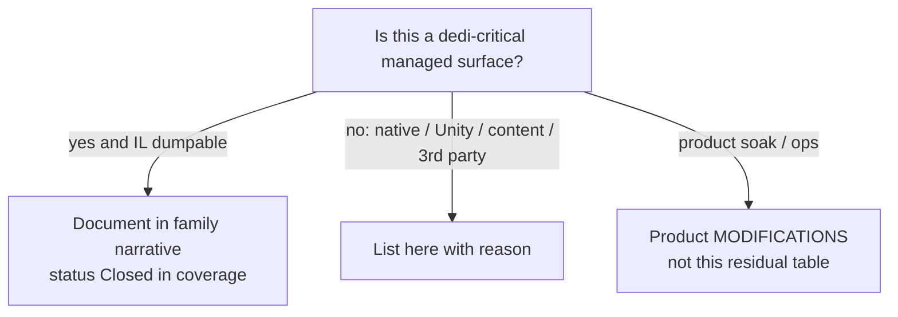

# Residuals: what cannot be closed from dedicated managed IL

**Owns:** non-IL residual list (only place for permanent open items).  
**Coverage of managed families:** [`coverage.md`](coverage.md).  
**Hub:** [`INDEX.md`](INDEX.md).

**Policy:** every residual here is **non-managed**, **native**, **Unity-settings**, **content-dependent**, or **third-party black box**.  
No dedi-critical managed surface may remain unmapped.



---

## 1. Residuals (honest, permanent from IL alone)

| Residual | Why not closed by Assembly-CSharp RE |
|---|---|
| **Unity script execution order** among GameManager / ConnectionManager / DynamicMeshManager / Entity MBs | Stored in Unity project/prefab settings, not method IL |
| **Which Entity GameObjects stay `enabled` on pure dedicated** | Runtime observation; IL shows no mass `set_enabled(false)` at spawn (see [closed-gaps.md](closed-gaps.md)) |
| **LiteNetLib native plugin** | Below managed wrappers; native binary |
| **EAC / EOS AntiCheat wire protocol** | Types mapped (`NetPackageEAC`, `Platform.EOS.AntiCheatServer*`); protocol not in game DLL as reverseable sim logic |
| **Aron Granberg A\* library internals** | `AstarPath.StartPath` / `Pathfinding.*` third-party; 7DTD ASP wrapper closed |
| **ModEvents subscriber sets** | Who registers handlers is mod/content dependent; **hook names closed** in [managers.md](managers.md) |
| **Post-patch IL drift** | TFP updates move offsets; regenerate dumps (process residual) |
| **Region sector payload byte codec detail** | Managed methods exist and are dumped; hand-annotated full compression layout optional (not required for loop understanding) |
| **Client-only UI / avatar / NGUI / camera** | Out of dedicated scope (non-goal) |
| **Full NetPackage body catalog (~194)** | Names + maxIL closed; most write/read bodies not hand-annotated (clone P0 backlog: Chunk, Spawn, WorldInfo; see [protocol.md](protocol.md) §11) |
| **Password encryption wire path** | `NetPackageEncryption*` types present; golden path is uncompressed/unencrypted bots |
| **XML content semantics** | Blocks/items/biomes/prefabs are data, not loop IL |

---

## 2. Closed items formerly listed as open

| Former gap | Closure |
|---|---|
| AIDirector default components | closed-gaps.md |
| ASP path body → AstarPath | closed-gaps.md |
| Net package distance bands | closed-gaps.md / network.md |
| GameTimer 20 Hz | closed-gaps.md |
| Chunk GetBlock/density index | terrain-height.md, world-chunks.md (IL dumps in realearth-surfaces-v3.0.1) |
| Chunk write/read layer bound 64 | save-region.md |
| WorldState.SaveLoad structure | save-region.md + dedi-complete §5 |
| Origin.FixedUpdate on dedicated | **No-op:** `IsDedicatedServer` → early `ret` (loop.md) |
| Land claims / PPL accessor | dedi-complete + product [realearth-surfaces.md](../../7days-realworld/docs/realearth-surfaces.md) (product SoloSlide) |
| ModEvents field inventory | managers.md |
| NetPackage type census (~196) | network.md + dedi-complete §3 |
| Light/stability/mesh/water method map | light-mesh-water.md |
| Manager Update IL table | managers.md |
| ChunkBlockChannel Read/Write | dedi-complete §12 (IL=151/120) |
| Prefab.CopyIntoLocal entry | product [realearth-surfaces](../../7days-realworld/docs/realearth-surfaces.md) / dump IL=680 |
| Entity/ChunkManager OriginChanged bodies | product [realearth-surfaces](../../7days-realworld/docs/realearth-surfaces.md) (Origin section) |

---

## 3. Origin dedicated gate (correction)

Earlier notes that Origin “still repositions on dedicated” are **wrong**. Measured prologue:

```text
call GameManager.get_IsDedicatedServer
brtrue → ret    // dedicated: return immediately
```

`DoReposition` fan-out still matters for **client/listen** hosts and for understanding entity/chunk GO shifts, not for pure dedicated FixedUpdate cost.

---

## Related docs

| Doc | Role |
|---|---|
| [coverage.md](coverage.md) | Family closed checklist |
| [engine-limitations.md](engine-limitations.md) | Stock ceilings (including residual-tagged rows) |
| [protocol.md](protocol.md) | Wire residuals vs closed golden packages |
| [zig-clone.md](zig-clone.md) | Clone readiness matrix |
| [INDEX.md](INDEX.md) | Research hub |
| Product status (not residuals) | [`../../7days-realworld/docs/MODIFICATIONS.md`](../../7days-realworld/docs/MODIFICATIONS.md) |
| Product failure catalog | [`../../7days-realworld/docs/realearth-review.md`](../../7days-realworld/docs/realearth-review.md) |

## Changelog

- **2026-07-18:** Product surface links as full paths; related docs table.  
- **2026-07-18:** Renamed residuals.md; closed-list paths updated after doc reorg.  
- **2026-07-18:** Residuals restricted to non-IL class; managed gaps closed into family docs.
