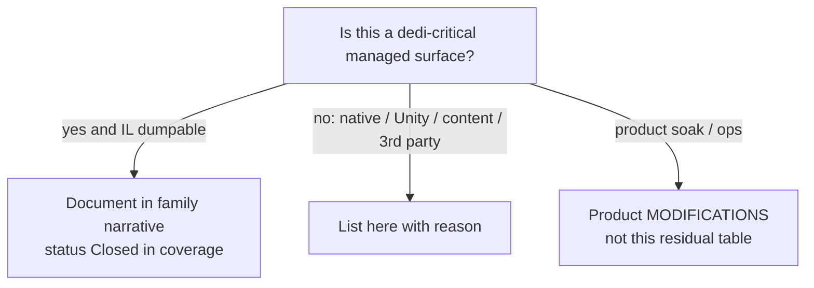

# Residuals: what cannot be closed from dedicated managed IL

**Owns:** non-IL residual list (only place for permanent open items).  
**Pin:** V3.1.0 (b14) dedicated.  
**Coverage of managed families:** [`coverage.md`](coverage.md).  
**Hub:** [`INDEX.md`](INDEX.md).

**Policy:** every residual here is **non-managed**, **native**, **Unity-settings**, **content-dependent**, **third-party black box**, or a bounded **annotation-backlog** (managed and already dumped, but a full hand-annotation is optional, not required for loop/wire understanding).  
No dedi-critical managed surface may remain unmapped: the mapping exists in the dumps; only exhaustive prose annotation of a few large payloads is deferred.



---

## 1. Residuals (honest, permanent from IL alone)

| Residual | Why not closed by Assembly-CSharp RE |
|---|---|
| **Unity script execution order** among GameManager / ConnectionManager / DynamicMeshManager / Entity MBs | Stored in Unity project/prefab settings, not method IL |
| **Which Entity GameObjects stay `enabled` on pure dedicated** | Runtime observation; IL shows no mass `set_enabled(false)` at spawn (see [closed-gaps.md](closed-gaps.md)) |
| **LiteNetLib native plugin** | Below managed wrappers; native binary |
| **EAC / EOS AntiCheat wire protocol** | Types mapped (`NetPackageEAC`, `Platform.EOS.AntiCheatServer*`); protocol not in game DLL as reverseable sim logic |
| **Aron Granberg A\* library internals** | `AstarPath.StartPath` / `Pathfinding.*` third-party; 7DTD ASP wrapper closed |
| **ModEvents subscriber sets** | Who registers handlers is mod/content dependent; **hook names closed** in [managers.md](managers.md) |
| **Post-patch IL drift** | TFP updates move offsets; regenerate dumps (process residual) |
| **Region sector payload byte codec detail** | **Closed (2026-08-06/07):** Raw free-list + V1/V2 WriteData ([save-region.md](save-region.md) 3.3-3.4); location/timestamp packing (3.5); Raw **11-byte** header `7rr`+version:i32+paddingBytes:i32 from `New`/`Load` |
| **Client-only UI / avatar / NGUI / camera** | Out of dedicated scope (non-goal) |
| **Full NetPackage body catalog (193 wire packages)** | **Closed:** metadata census for all 193; auto body sequences in [inventories/netpackage-bodies.md](inventories/netpackage-bodies.md); P0/P1 + high-traffic families hand-narrated in [protocol-packages.md](protocol-packages.md) sections 1-6.21. Residual: only optional per-flag framing for rare conditional-heavy packages |
| **Encryption cipher / KDF primitives** | Handshake package bodies decoded ([protocol-packages.md](protocol-packages.md) §2). Session transform is managed `AesEncryptAndMac` (AES + HMAC; [network.md](network.md) §4.5). Residual: RSA key wrap / platform RNG quality and anything below `System.Security.Cryptography` providers |
| **XML content semantics** | Blocks/items/biomes/prefabs are data, not loop IL |
| **Discord GameSDK integration (`DiscordManager`, 140 methods)** | Rich presence, lobbies, invites, voice device list (`inGameUpdate`, `updateAudioDeviceList`, `EDiscordStatus`, `UserAuthorizationResult`); needs a local Discord client, so it is a **client** social feature, not a dedicated codepath. Reachable in the assembly but never active on a headless server |
| **Server-side support/utility code (enumeration-level, not per-method narrated)** | Cross-cutting helpers the reachability set includes but no subsystem doc singles out: `Configuration.*` XML/option parsing, `StringParsers`, `TEFeatureAbs` base helpers. Covered by their owning frameworks ([blocks.md](blocks.md)/[tile-entities-power.md](tile-entities-power.md)) and the [full-surface.md](full-surface.md) caveat; a per-method narrative would not add sim understanding |

---

## 2. Closed items formerly listed as open

| Former gap | Closure |
|---|---|
| AIDirector default components | closed-gaps.md |
| ASP path body → AstarPath | closed-gaps.md |
| Net package distance bands | closed-gaps.md / network.md |
| GameTimer 20 Hz | closed-gaps.md |
| DynamicMesh version-160 WriteRegion as live path | dynamic-mesh.md: live `SaveRegion`; `WriteRegion` only self-retry (Xref, 2026-08-06) |
| Region location/timestamp header bit packing | save-region.md §3.5 (Raw + sector) |
| Chunk GetBlock/density index | terrain-height.md, world-chunks.md (IL dumps in realearth-surfaces-v3.1.0) |
| Chunk write/read layer bound 64 | save-region.md |
| WorldState.SaveLoad structure | save-region.md + dedi-complete §5 |
| Origin.FixedUpdate on dedicated | **No-op:** `IsDedicatedServer` → early `ret` (loop.md) |
| Land claims / PPL accessor | dedi-complete + product `realearth-surfaces.md` (product SoloSlide) |
| ModEvents field inventory | managers.md |
| NetPackage type census (194: 193 wire + NetPackageManager) | network.md + dedi-complete §3 |
| Light/stability/mesh/water method map | light-mesh-water.md |
| Manager Update IL table | managers.md |
| ChunkBlockChannel Read/Write | dedi-complete §12 (IL=151/120) |
| Encryption handshake wire path | protocol-packages.md §2 (4 packages decoded; cipher/KDF native) |
| Channel-1 bulk band + compressed-package set | protocol-packages.md §1 (6 channel-1, 8 compressed) |
| Chunk/ChunkRemove/WorldInfo/WorldTime/SetBlock/HoldingItem/PlayerInventory bodies | protocol-packages.md §3-6 |
| Prefab.CopyIntoLocal entry | product `realearth-surfaces` / dump IL=680 |
| Entity/ChunkManager OriginChanged bodies | product `realearth-surfaces` (Origin section) |

---

## 3. Managed RE corpus status (2026-08-07)

For **dedicated managed** surfaces under the coverage bar (families 1-11 in
[coverage.md](coverage.md)). Definition of done: [completion-bar.md](completion-bar.md)
**tiers A+B**.

**Coverage.exe (live ASM, 2026-08-07):**

| Tier | Count |
|---|---:|
| Game types in reach base | 3699 |
| Narrated | 1449 |
| Catalogued only | 858 |
| (refresh after each Coverage run) | |
| Classified OOS | 1392 |
| **Unaccounted** | **0** |

Also:

- All **193** `NetPackage*` census names appear in narrative docs
- High-traffic package bodies + bulk residual catalog: [protocol-packages.md](protocol-packages.md) 1-6.22
- Flat write sequences for every package: [inventories/netpackage-bodies.md](inventories/netpackage-bodies.md)
- Region Raw header + location packing closed (save-region §3.5)

What remains open is **only** the non-IL residual table in section 1 (Unity order,
native plugins, EAC/EOS wire, A* library internals, content XML, client UI) plus
**optional** annotation depth (per-flag package framing, per-console-command prose).
Those cannot be finished by "more managed RE until every IL line is prose."

## 4. Origin dedicated gate (correction)


Earlier notes that Origin “still repositions on dedicated” are **wrong**. Measured prologue:

```text
call GameManager.get_IsDedicatedServer
brtrue → ret    // dedicated: return immediately
```

`DoReposition` fan-out still matters for **client/listen** hosts and for understanding entity/chunk GO shifts, not for pure dedicated FixedUpdate cost.

---

## Related docs

| Doc | Role |
|---|---|
| [coverage.md](coverage.md) | Family closed checklist |
| [engine-limitations.md](engine-limitations.md) | Stock ceilings (including residual-tagged rows) |
| [protocol.md](protocol.md) | Wire residuals vs closed golden packages |
| [zig-clone.md](../../zdtd/docs/zig-clone.md) | Clone readiness matrix |
| [INDEX.md](INDEX.md) | Research hub |
| Product status (not residuals) | `7days-realworld/docs/MODIFICATIONS.md` |
| Product failure catalog | `7days-realworld/docs/realearth-review.md` |


## 5. Product / sibling residuals (not IL residuals)

These are **not** stock RE open items. They live in sibling TODO lists. Pointed here so research freeze is unambiguous.

| Sibling | Residual class | Hub |
|---|---|---|
| `zdtd` | Demo **pass=83 fail=0** (20260804q stackDrop + Food ≥+5; power TE hard). Residual: full chili +15 Food S2C, IsSpawned lag, empty deco S2C, M11 scale | `zdtd/TODO.md`, `zdtd/docs/PLAYTEST_V310_20260803.md` |
| `7dtd-optimizer` | AnimatorEmergency **human soak** before default-on; path-admission BM measure; packaging tests. Clone triage + chunk encode ownership **closed in research** (2026-08-06) | `7dtd-optimizer/TODO.md`, `PERF_RESEARCH_BRIEF.md` |
| `7dtd-loadgen` | H500 expanded-world validate; EAC unsupported | `7dtd-loadgen/TODO.md` |
| `7dtd-apm` | Absolute forensic budgets under spawn (expected fail); disk ops | `7dtd-apm/TODO.md` |

Managed RE stop condition remains: unaccounted **0**, non-IL table in §1 only.

## Changelog

- **2026-08-07:** Coverage unaccounted driven to 0 (analytics heartbeat + logenv);
  completion-bar.md; Raw region 11-byte header closed; §3 census refreshed.
- **2026-08-06:** Region location/timestamp header packing closed (save-region §3.5); ItemStack.Clone triage + chunk encode ownership noted for optim evidence (items / engine-limitations / world-chunks).
- **2026-08-03:** V3.1.0 pin confirmed live; product residual pointer §5; managed corpus still stop-closed.
- **2026-07-28:** Region sector residual narrowed; package narrative residual closed (6.21).

- **2026-07-28:** Package narrative residual reduced to optional per-flag framing (section 6.21).

- **2026-07-18:** Product surface links as full paths; related docs table.  
- **2026-07-18:** Renamed residuals.md; closed-list paths updated after doc reorg.  
- **2026-07-18:** Residuals restricted to non-IL class; managed gaps closed into family docs.
