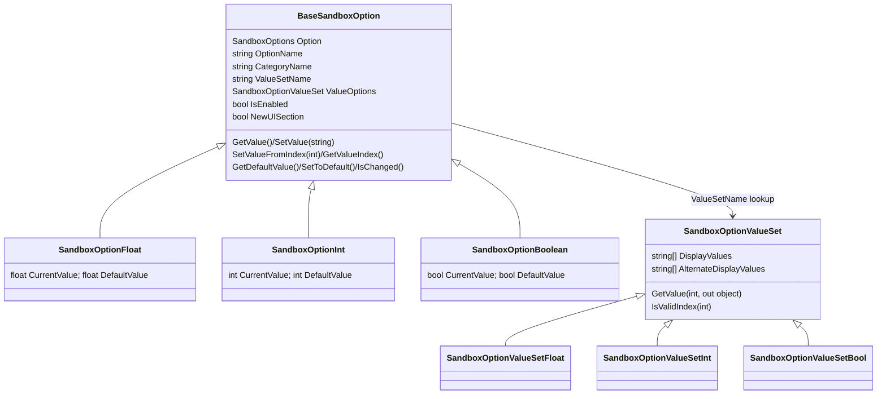
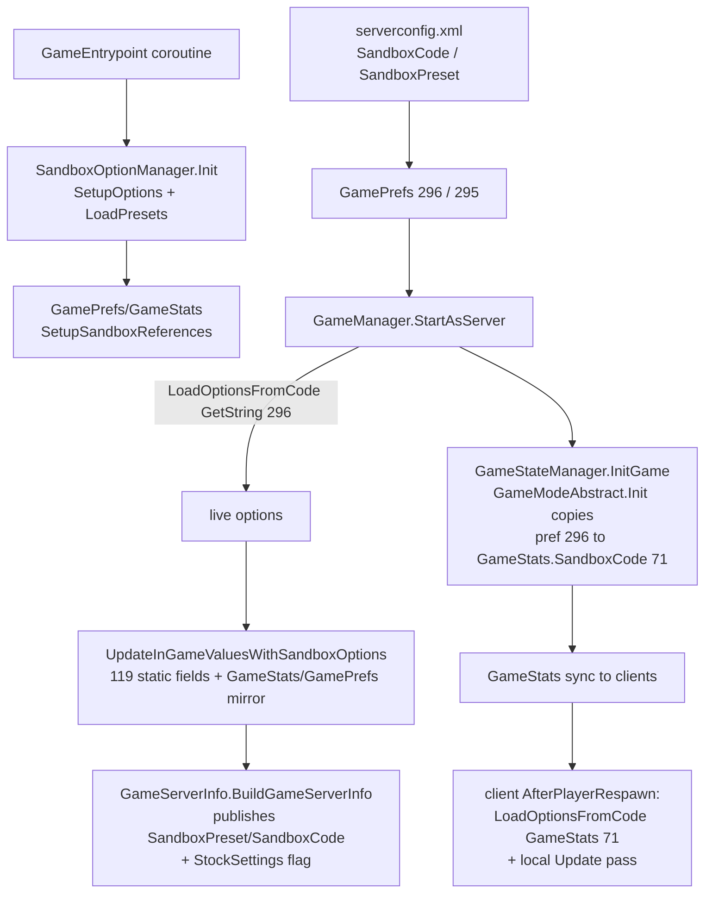

# Sandbox options and presets (dedicated V3.1.0)

**Owns:** the `SandboxOptions` namespace: `BaseSandboxOption` and its typed
subclasses (`SandboxOptionFloat` / `SandboxOptionInt` / `SandboxOptionBoolean`),
the `SandboxOptionValueSet` family, `SandboxOptionManager` (singleton registry,
sandbox-code codec, preset store), `SandboxOptionPreset`,
`SandboxOverridesFromXml`, the `getsandboxoptions` console command, and how a
dedicated operator drives all of it through `serverconfig.xml`.
**Not:** the per-system gameplay effect of each option (loot, traders, crafting,
AI etc. have their own docs); the sandbox settings UI
(`XUiC_SandboxOptions`, `XUiC_SandBoxOptionEntry`, `XUiC_SandboxPresetSelector`,
`XUiC_SandboxSettingsDisplay`, `XUiC_SandboxSettingsSaveAsPreset`,
`XUiC_NewContinueGameSettings`), which is client menu surface and out of scope.
**Evidence:** `SandboxOptions.SandboxOptionManager`, `SandboxOptions.BaseSandboxOption`
(+ subclasses and value sets), `SandboxOptions.SandboxOptionPreset`,
`SandboxOverridesFromXml`, `ConsoleCmdGetSandboxOptions`, `GamePrefs`, `GameStats`,
`GameServerInfo`, `GameManager.StartAsServer` IL (dump locally with
`tools/src/DumpMethod`, git-ignored).
**Hub:** [`INDEX.md`](INDEX.md). **Method:** [`re-methodology.md`](re-methodology.md).

V2 replaced most of the old per-pref difficulty knobs with a single **sandbox
options** system: 152 typed options, each restricted to a discrete value set,
serialized into one short **sandbox code** string that a server operator pastes
into `serverconfig.xml`. This doc reverses the type system, the codec, the
preset machinery, and the exact dedicated-server codepath that applies it all.

---

## 1. The typed option system

### 1.1 Class shape



`BaseSandboxOption` carries identity (`SandboxOptions` enum id, display name,
category, value-set name, `NewUISection` layout flag) and a virtual
get/set surface in all three primitive flavors (`GetIntValue`, `GetFloatValue`,
`GetBoolValue`, plus index- and string-based accessors). Each concrete subclass
stores only `CurrentValue`/`DefaultValue` of its own primitive and implements
the virtuals; `OptionTypes` is `{Invalid, Int, Float, String, Bool}` but **no
`SandboxOptionString` class exists in V3.1.0 b14 either** (re-checked against the
V3.1.0 surface on 2026-08-06), so the `String=3` slot is still unused.

### 1.2 Discrete value sets, not min/max clamping

Options do not have free ranges. Every option points (by name) into
`SandboxOptionManager.ValueSets : Dictionary<string, SandboxOptionValueSet>`,
and a value set is a fixed array of permitted values with parallel display
strings (localization keys such as `goPercent`, `goZMWalk`, `goDisabled`).
`SetupOptions` registers 63 value sets. Example, decoded from the static array
init blob behind `DamageValues` (a `SandboxOptionValueSetFloat`):

```text
DamageValues = [0, 0.25, 0.35, 0.5, 0.65, 0.75, 0.85, 1, 1.25, 1.5, 2, 2.5, 3]
               (index 0 displays as "none", the rest via goPercent)
```

Validation is membership, not clamping:

- `SandboxOptionFloat.SetValue(string)` parses the float and **silently ignores**
  it unless `ValueOptions.GetFloatIndex(v) != -1` (exact membership scan).
- `SetValueFromIndex(int)` asks the set for the value at that index and **falls
  back to `DefaultValue`** when the index is invalid.

So an operator-supplied sandbox code can never produce an out-of-catalog value;
bad entries degrade to the default.

### 1.3 Option-to-option dependencies

A subclass-nested `DisabledOptionsOnValue` (`SandboxOptions[] DisabledOptions`,
trigger `Value`, `Inverted`, `AlwaysShowValuesOnEnabled`) links options: when the
owner sits at the trigger value, the listed options are disabled (e.g.
`StaminaUsage` at `0` disables `StaminaRegen`; `XPMultiplier` at `0` disables
`ShowXP`; `DeathPenalty` gates the lose/degrade-on-death suboptions). 16 such
links are built in `SetupOptions`. `SandboxOptionManager.IsEnabled(option)`
exposes the resulting `IsEnabled` flag; the cascade evaluation itself lives in
the settings UI (client surface).

---

## 2. The catalog: 152 options in 8 categories

`SandboxOptions.SandboxOptions` is a dense enum `0..151` (`Max = 152`), and
`SandboxOptionManager.SetupOptions()` registers exactly one option object per
member: **74 float, 46 int, 32 boolean**, grouped by `CategoryName` into
`OptionsByCategory` (a `DictionaryList<string, List<BaseSandboxOption>>`):

| Category | Representative options (enum names) |
|---|---|
| General | `RangedDamage`/`MeleeDamage`/`BlockDamage`/`TerrainDamage`, `HeadshotMultiplier`, `IncomingDamage`, walk/run/crouch/jump speeds, `StaminaUsage`/`StaminaRegen`, `XPMultiplier`, `SkillGainRate`, `SkillPointsPerLevel`, `DeathPenalty` + drop/degrade-on-death suite, `InfectionRate` / **`InfectionChance`**, **`HungerMultiplier`**, **`ThirstMultiplier`**, **`StackSizeMultiplier`** (hard cap 30000 on item stacks; see [items.md](items.md)), `EncumbranceModifier`, `NewbieCoat`, `JarRefund` |
| Entities | `EnemySpawnMode`, `MaxEnemyTier`, **day/night density+respawn split** (`BiomeDayEnemyDensity`, `BiomeNightEnemyDensity`, `BiomeDayAnimalDensity`, `BiomeNightAnimalDensity`, `BiomeDayZombieRespawn`, `BiomeNightZombieRespawn`, `BiomeDayAnimalRespawn`, `BiomeNightAnimalRespawn`; V3.1 replaces a single `BiomeEnemyDensity` knob), `EntityDamage`/`EntityIncomingDamage`, `BlockDamageAI`/`BlockDamageAIBM`, `HeadshotMode`, zombie day/night/feral/BM speeds, `ZombieFeralSense`, `AISmellMode`, `ZombieRageChance`, `AllowZombieDigging`, `ZombiesEatAnimals`, health bars |
| World | `GlobalGSModifier`/`BiomeGSModifier`, `BiomeProgression`, `TemperatureSurvival`, `MaxTechType`, blood moon frequency/range/count/warning, air drops, `StormFreq`/`StormWarning`, `HeatMapSensitivity`, `DayNightLength`/`DayLightLength`, map/compass/markers/location-info toggles |
| Resources | `LootMaxTier`, loot/game/trader-stage modifiers, `LootRespawnDays`, `LootTimer`, `LootBagChance`, the 13 per-class abundance floats (food, drink, medical, ammo, ...), `TreasureMapChance`, mining/crop/seed/harvest outputs, `CropGrowthSpeed` |
| Crafting | `CraftingProgression`, `CraftingMaxTier`, `PointsPerMagazine`, `BackpackCrafting`, `WorkstationCrafting`, `SmeltingType`, crafting time/input/output, scrapping, dew collector and apiary time/input/output, **Chicken coop** (`ChickenCoopTime`, `ChickenCoopOutput`, `ChickenCoopInput`, `ChickenStressEvent`; held-entity chickens in [items.md](items.md)), `ItemDegradation`, `RepairTypes`, `MaxDegradationAmount` |
| Traders | `TradersEnabled`, `VendingEnabled`, `TraderHours`, `TraderProtection`, `TraderDialog`, `GlobalTSModifier`, `TraderMaxTier`, item abundance and reset intervals, buy/sell prices, `TraderBuyLimit` |
| Tasks | `ChallengesEnabled`, `QuestsEnabled`, intro quest/challenge toggles, `TraderToTraderQuestsEnabled`, `BuriedQuestsEnabled`, `POIQuestsEnabled`, `QuestsPerTier`, `QuestProgressionDailyLimit`, `StarterSkillPoints` |
| Misc | vehicle fuel/entity/block/self damage, `ElectricalOutput`, and the silly suite: `SillyCelebrate`, `SillyBigHeads`, `SillyTinyZombies`, `SillySounds`, `SillyLowGravity` (drives `Physics.gravity` scaling), `SillyBlackandWhite` (client rendering) |

The full id list is the enum itself (`EnumDump SandboxOptions`); ids are wire-
and code-stable because the sandbox code addresses options by enum value (next
section).

---

## 3. The sandbox code

The entire configuration serializes to one string, the **sandbox code**, built
by `SandboxOptionPreset.saveOptionsToCode` and parsed by
`SandboxOptionManager.LoadOptionsFromCode`:

```text
code := <version char> ( <option: 2 letters> <valueIndex: 1 letter> )*
```

- The first character is a format version, currently `'A'` (`currentVersion`,
  set in the static ctor). A code with any other first char is rejected.
- Each following 3-letter group is one non-default option: the option's enum
  value in base-26 (`Alpha2ToIndex`: `"AA"` = 0, `"AB"` = 1, ... up to 675) plus
  the selected index into its value set (`AlphaToIndex`: `'A'` = 0 ... `'Z'`).
- Decoding first does `ResetAllToDefault()`, then applies each group via
  `SetValueFromIndex`; unknown option ids are skipped, invalid indices become
  defaults (1.2). Only changed options are emitted, so the default game is just
  `"A"` plus nothing.

The stock `serverconfig.xml` ships
`SandboxCode = "AAAJABJACJADJARFBNC"` with a comment that it encodes the
Adventurer difficulty preset, i.e. six changed options.

---

## 4. SandboxOptionManager: lifecycle and accessors

`SandboxOptionManager.Current` is a lazy singleton. On the dedicated server the
`GameEntrypoint` startup coroutine calls `Init()` once (double-init logs a
warning), which runs `SetupOptions()` (register 63 value sets + 152 options)
and `LoadPresets()`; the same coroutine then calls
`GamePrefs.SetupSandboxReferences()` and `GameStats.SetupSandboxReferences()`
(section 6). Static accessors serve the whole codebase:

**`GamePrefs.SetObject(prop, value)` (IL=5 -> SetObjectInternal IL=38):** the
pref setter - bounds check ("Trying to set non-existing pref" error), skip when
both values null or `existing.Equals(value)`, else store and
`notifyListeners(prop)` (IL=24: every registered `IGamePrefsChangedListener`
`OnGamePrefChanged(pref)` plus the static `OnGamePrefChanged` action).
**`GamePrefs.GetObject(prop)` (IL=20):** bounds check
("Trying to access non-existing pref" -> null), else `propertyValues[prop]`
(no sandbox routing in the pref getter; sandbox reads go through
`SandboxOptionManager`).

| Accessor | Behavior |
|---|---|
| `GetFloat / GetInt / GetBool / GetIndex(option)` | Current value; unknown id returns 0/false. If the option is in `overrideList` (section 7) the **default** value is returned instead |
| `GetOption / GetOptionType / IsEnabled / IsOverriden` | Registry queries |
| `SetOption(option, v)` overloads, `SetOptionToDefault`, `ResetAllToDefault` | Mutators (UI/preset side) |
| `LoadOptionsFromCode(code)` / `LoadOptionsFromCode(code, preset)` | Decode into live options, or into a preset's `PresetValues` dictionary without touching live state |
| `UpdateInGameValuesWithSandboxOptions(bool)` | Fan-out application pass (section 5) |
| `SetWorldAndGame(world, game)` | Names for the save the UI edits (menu path) |

---

## 5. Applying options: one pass, ~119 static fields

Nothing reads option objects per-frame. After the options are loaded,
`UpdateInGameValuesWithSandboxOptions` performs one push of every value into
cached static fields on the consuming systems (119 distinct `stsfld` targets),
plus a few side effects:

- **Combat/items:** `ItemActionAttack.{RangedDamagePercent, MeleeDamagePercent,
  BlockDamagePercent, HeadshotMultiplier, IncomingDamageModifier, ...}`,
  `ItemAction.ItemDegradationModifier`, `ItemAction.RepairType`
  ([combat-damage.md](combat-damage.md), [items.md](items.md)).
- **Entities/AI:** `EntityFactory.{EnemySpawnMode, MaxEntityTier}`,
  `EAIManager.FeralSense`, `EntityMoveHelper.AllowZombieDigging`,
  `AIDirectorBloodMoonComponent.{BloodMoonFrequency, BloodMoonRange,
  BloodMoonEnemyCount}`, `AIDirector.HeatMapSensitivityModifier`,
  `EntityHuman.SetupRageChance(...)`
  ([entity-ai.md](entity-ai.md), [aidirector.md](aidirector.md),
  [spawning.md](spawning.md)).
- **Loot/economy:** the `LootContainer.*CountModifier` family, `LootMaxTier`,
  `LootBagChance`, `TreasureMapChance`, `TraderInfo.*`, `TraderManager.VendingEnabled`
  ([loot-economy.md](loot-economy.md)).
- **Progression/crafting:** `Progression.{XPGain, SkillPointsGainRate,
  SkillPointsPerLevel, ShowXPType}`, the `XUiM_Recipes.*` crafting modifiers,
  `BlockPlantGrowing.CropGrowthModifier` ([progression.md](progression.md),
  [crafting-recipes.md](crafting-recipes.md)).
- **World/misc:** `World.{BiomeProgressionEnabled, TemperatureSurvival,
  MapEnabled, StormFrequency}`, `SkyManager` all-day/all-night flags,
  `PowerSource.PowerOutputModifier`, `EntityVehicle.*` damage/fuel modifiers,
  `Physics.gravity` scaling from the stored `originalGravity`
  ([weather-environment.md](weather-environment.md),
  [vehicles-drones-turrets.md](vehicles-drones-turrets.md),
  [tile-entities-power.md](tile-entities-power.md)).
- **Helpers:** `SetupBloodMoonWarningTimes`, `SetupAirDropTimeRanges`,
  `SetupLostItemsOnDeathValues` compute derived values and write them into
  `GameStats`.
- **Silly world options** (`SillyBigHeads`, `SillyTinyZombies`) are applied by
  the nested `UpdateWorldOptionsWithSandboxOptions` through `GameEventManager`
  sequences ([game-events.md](game-events.md)).

When running as server (not client), the pass also mirrors six values into the
**legacy `GamePrefs`** (`XPMultiplier`, `BlockDamagePlayer`, `BlockDamageAI`,
`BlockDamageAIBM`, `LootAbundance`, `LootRespawnDays`, `XPMultiplier`) and the
matching `GameStats`, which keeps the server browser and old consumers coherent.

A second, per-entity slice exists: `EntityStats.UpdateSandboxOptions` copies
`StaminaRegen`/`StaminaUsage` into `Stat.GainSandboxModifier`/`LossSandboxModifier`
([entity-stats.md](entity-stats.md)), and `EntityPlayer.StartJumpMotion` reads
`JumpStrength` live.

---

## 6. The GamePrefs / GameStats bridge

The clever part of the V2 migration: legacy readers were not rewritten.
`GamePrefs.SetupSandboxReferences()` walks the whole pref table and, for every
`EnumGamePrefs` member whose **name parses as a `SandboxOptions` member**
(`Enum.TryParse`), stores the live option object in a `sandboxReferences[]`
array indexed by pref id. `GamePrefs.GetInt/GetFloat/GetBool` then check that
array **first**:

```text
GamePrefs.GetInt:  IL_0000 ldsfld sandboxReferences; ... callvirt BaseSandboxOption::GetIntValue()
```

So any code calling `GamePrefs.GetInt(EnumGamePrefs.BloodMoonFrequency)` is
transparently redirected to the sandbox option; the stored pref value is dead
for those ids (writes still go to the pref store, reads never see them).
`GameStats.SetupSandboxReferences()` does the same for the stats table, with two
name mismatches special-cased: `EnumGameStats.BlockDamagePlayer` maps to
`SandboxOptions.BlockDamage` and `EnumGameStats.LootAbundance` to
`SandboxOptions.GlobalLootCount`.

**Read routing (`GameStats.GetInt` IL=34):** on the **server** (not client),
the sandbox reference is consulted first: `sandboxReferences[stat] != null` →
`BaseSandboxOption.GetIntValue()`; otherwise the raw `propertyValues[stat]`
box (InvalidCastException logged). So the sandbox override is live in the read
path for server sim, not just the write/broadcast path. **Writes** do **not**
route through the sandbox: every `Set` overload boxes into `SetObject`
(IL=12), which stores `propertyValues[stat]` and fires
`OnChangedDelegates?.Invoke(stat, value)`.

---


### 6.1 `GameStats` property table and net blob (verified)

`EnumGameStats` runs **0 .. 81** with sentinel `Last=81` (**82** named values
including `Last`). `GameStats.initPropertyDecl` (IL=702) builds
`propertyList: PropertyDecl[]` (one row per stat the engine tracks).

`GameStats.Write` (IL=60) walks `propertyList` and emits **only** rows with
`bPersistent=true`, typed by `PropertyDecl.type`:

| EnumType switch | Wire |
|---|---|
| 0 | `i32` (`GetInt`) |
| 1 | `f32` (`GetFloat`) |
| 2 | `string` (`GetString`) |
| 3 | `bool` (`GetBool`) |
| 4 | `string` base64 of `GetString` (`Utils.ToBase64`) |

There is **no** name/id prefix per field: reader must use the same
`propertyList` order and `bPersistent` filter. That blob is what
`NetPackageGameStats.Setup` captures into a pooled stream; the package wire is
`i16 length` + bytes ([protocol-packages.md](protocol-packages.md) section 6.19,
[aidirector.md](aidirector.md) network table).

`SetupSandboxReferences` (IL=65) maps each `PropertyDecl.name` to a
`SandboxOptions` entry by enum name parse, with special cases stats **59** and
**75** (BlockDamagePlayer / LootAbundance name mismatches already noted above).

## 7. Presets

`SandboxOptionPreset` is a named bag of changed options:
`Name`, `LocalizedName`, `Group`, `Description(Key)`, `Icon`,
`DifficultyRating`, `IsDefault`, `AlwaysShowOptions`, flags
`IsCustomPreset` / `IsModded` / `IsUserPreset`, and
`PresetValues : Dictionary<SandboxOptions, int>` (option -> value-set index).
Its `SandboxCode` property re-encodes `PresetValues` via `saveOptionsToCode`.
`LoadPresets()` merges three sources:

| Source | Loader | Group |
|---|---|---|
| Built-in asset `Data/Sandbox/sandbox_presets` (Unity `Resources.Load` TextAsset; contents live in the compressed bundle, not inspected here) | `LoadInternalPresets` -> `LoadPresetFromXml` per `<preset>` | from `category` attr |
| Mod XML `Data/Config/sandbox_overrides.xml` `<preset>` elements | `SandboxOverridesFromXml.CreateOverrides` (hooked into `WorldStaticData`, so config-mod patchable) | `"Modded"` |
| User files `<UserDataDir>/Presets/*.xml` | `LoadPreset(`XmlFile`)` (`<preset><property name="code|description|icon" value=.../></preset>`) | `"User"` |

`<preset>` attributes understood by `LoadPresetFromXml`: `name`,
`localized_name`, `description`, `description_key`, `icon`, `default`,
`difficulty_rating`, `always_show`, `category`, and `code` (decoded into
`PresetValues` by `StoreOptionsInPresetFromCode`). A static `CustomPreset`
("Custom" / `sandboxPresetGroupCustom`) represents unsaved edits. Lookup surface:
`GetPreset(name)`, `GetPresetByCode(code)`, `GetDefaultPreset()`,
`GetAllPresetGroups()` / `GetPresetsForGroup(group)`,
`GetChangedPresetOptions(...)` (used by the server-start analytics event).
Saving (`SaveCurrentSettings` -> `SaveCurrentToNewPreset` -> `SavePresetToFile`)
writes `<UserDataDir>/Presets/<name>.xml`; this is menu-side machinery, present
but idle on a headless server. The experimental branch adds
`GetOptionNameValueDictionaryFromPreset(preset)` (name -> value dictionary
export). It was experimental-only on V3.0.1 and **has since shipped**: it is
present in V3.1.0 b14 on `SandboxOptionManager` and called from `GameManager`
(re-checked 2026-08-06; it was experimental-only on V3.0.1).

### 7.1 Mod overrides (`sandbox_overrides.xml`)

Besides mod presets, the same file supports
`<sandbox_override option="MaxEnemyTier"/>`: `AddOverride` puts the id into
`overrideList`, which (a) forces every accessor to return the **default** value
regardless of the loaded code and (b) marks the option locked in the UI. The
shipped file documents both elements and lists every option name; `Reload`
(config-mod reload path) calls `RemoveOverrides` first, so overrides follow the
active mod set.

---

## 8. Dedicated server flow



Operator-facing facts:

- `EnumGamePrefs.SandboxPreset = 295` and `SandboxCode = 296` are the two
  `serverconfig.xml` properties. The shipped config only carries `SandboxCode`
  (with the copy-from-menu workflow described in its comment); `SandboxPreset`
  is a preset **name** used for server-browser display and the stock-settings
  check, not for loading values. The code string is the authority.
- `StartAsServer` warns if the manager was not initialized
  ("`Sandbox Option Manager not initialized before starting server, ...`") and
  then decodes pref 296. A malformed code (wrong version char) simply leaves
  every option at default; there is no startup failure.
- `GameModeAbstract.Init` copies pref 296 into `EnumGameStats.SandboxCode (71)`
  (with `SandboxPreset = 70` alongside). `GameStats` replicate to clients, and a
  joining client decodes `GameStats.GetString(71)` in
  `EntityPlayerLocal.AfterPlayerRespawn` and runs its own update pass, so the
  whole 152-option state syncs through **one string** instead of 152 packets.
- `GameServerInfo.BuildGameServerInfo` publishes `GameInfoString.SandboxPreset
  (18)` / `SandboxCode (19)` to the server browser and derives
  `GameInfoBool.StockSettings` from whether the named preset exists and is
  neither custom, modded, nor user-made ([platform-auth.md](platform-auth.md)
  server advertising).

### 8.1 Admin surface

- **Console** ([console-commands.md](console-commands.md)):
  `getsandboxoptions` / `gso` (permission 1000, "Gets the current game's
  Sandbox Options") reads `GameStats.SandboxCode`, decodes it into a scratch
  preset, and prints per category
  `Option <enum>: <value>/<text> (default: <value>/<text>)`. The optional bool
  argument is a **show-all flag** (print every option, not just the changed ones);
  the command hardcodes `_logToConsole = true`, so it never routes to the log. Log
  routing exists only on the `startGameCo` startup dump path.
- **Web dashboard** ([webserver.md](webserver.md)): REST `SandboxSettings`
  endpoint (`?code=&onlyChanged=&detailed=`) decodes the given code (default:
  the live `GameStats` code) and returns the option list as JSON.

---

## 9. XML requirement hooks (same name, different classes)

Three **global-namespace** classes named `SandboxOptionBool` / `SandboxOptionInt`
/ `SandboxOptionFloat` are not options at all: they are `RequirementBase`
subclasses (`ParseXAttribute` reads an `option="<enum name>"` attribute,
`IsValid(MinEventParams)` queries `SandboxOptionManager`), letting buffs/items
XML gate effects on sandbox settings ([minevents.md](minevents.md),
[buffs.md](buffs.md)). Parallel adapters exist per subsystem:
`LootEntryRequirementSandboxOption` (loot lists),
`GameEvent.SequenceRequirements.RequirementSandbox{Bool,Int,Float}`
([game-events.md](game-events.md)),
`Twitch.TwitchRequirementSandbox{Bool,Int,Float}`
([twitch-integration.md](twitch-integration.md)),
`DialogRequirementCanTrade` / `DialogRequirementQuests*` (trader dialog), and
`BlockPlaceholderMap` consults options when replacing placeholder blocks
([blocks.md](blocks.md), [world-generation.md](world-generation.md)).

---

## Related docs

| Doc | Role |
|---|---|
| [server-lifecycle.md](server-lifecycle.md) | `StartAsServer` sequence that loads and applies the code |
| [console-commands.md](console-commands.md) | Command registry hosting `getsandboxoptions`/`gso` |
| [webserver.md](webserver.md) | REST `SandboxSettings` endpoint |
| [server-lifecycle.md](server-lifecycle.md) / this doc §4 | `GetOptionNameValueDictionaryFromPreset` (preset → name/value dict; used by admin/UI paths) |
| [loot-economy.md](loot-economy.md) | Loot abundance/tier consumers |
| [combat-damage.md](combat-damage.md) | Damage-percent consumers |
| [entity-ai.md](entity-ai.md) / [aidirector.md](aidirector.md) | Zombie speed, feral sense, blood moon consumers |
| [progression.md](progression.md) / [crafting-recipes.md](crafting-recipes.md) | XP/skill/crafting consumers |
| [entity-stats.md](entity-stats.md) | Per-stat gain/loss sandbox modifiers |
| [mod-loading.md](mod-loading.md) | Config-mod path that patches `sandbox_overrides.xml` |
| [full-surface.md](full-surface.md) | Whole-assembly map |
| [re-methodology.md](re-methodology.md) | How this was reversed |

## Changelog

- **2026-07-28:** EnumGameStats 0..81 census; GameStats.Write persistent typed stream.

- **2026-07-24:** Initial sandbox-options reversal: typed option system (152
  options, discrete value sets, membership validation with default fallback,
  DisabledOptionsOnValue links), sandbox-code codec (version char + base-26
  triples), preset sources (internal asset, sandbox_overrides.xml, user
  Presets dir), the GamePrefs/GameStats name-bridge redirect, the dedicated
  StartAsServer apply path with its 119-field fan-out and one-string client
  sync, mod overrides, and the getsandboxoptions/REST admin surface.
