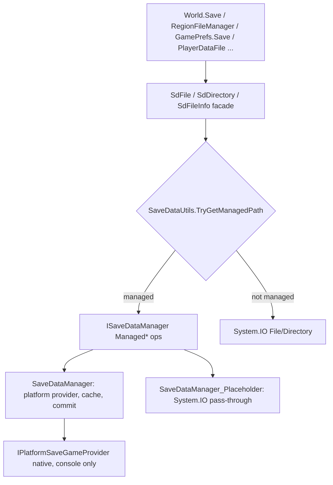
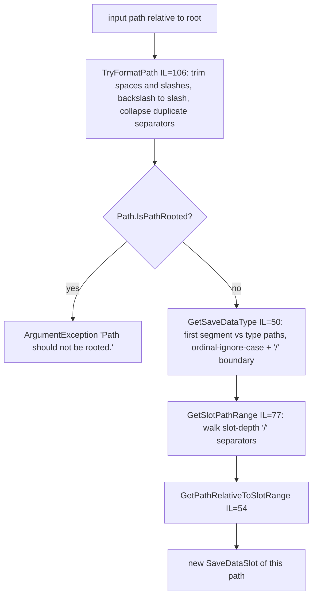
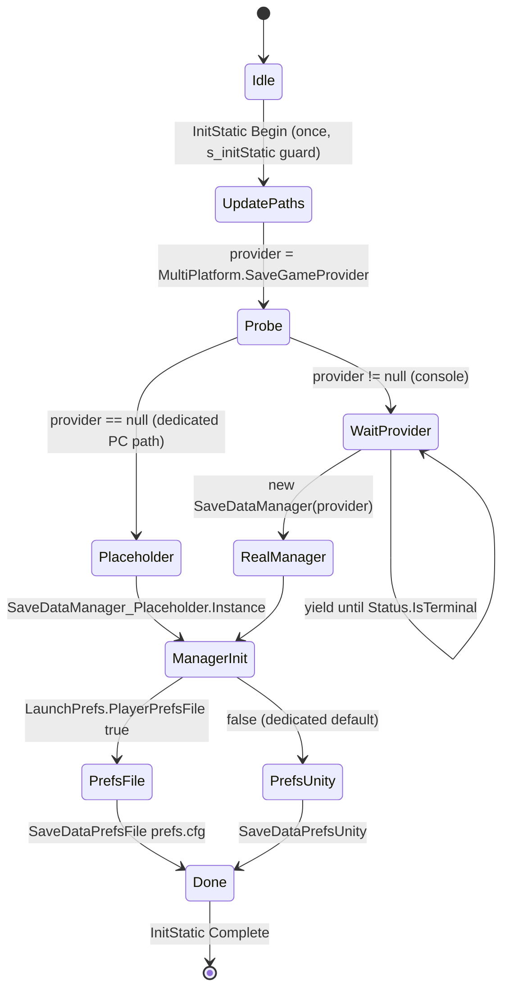
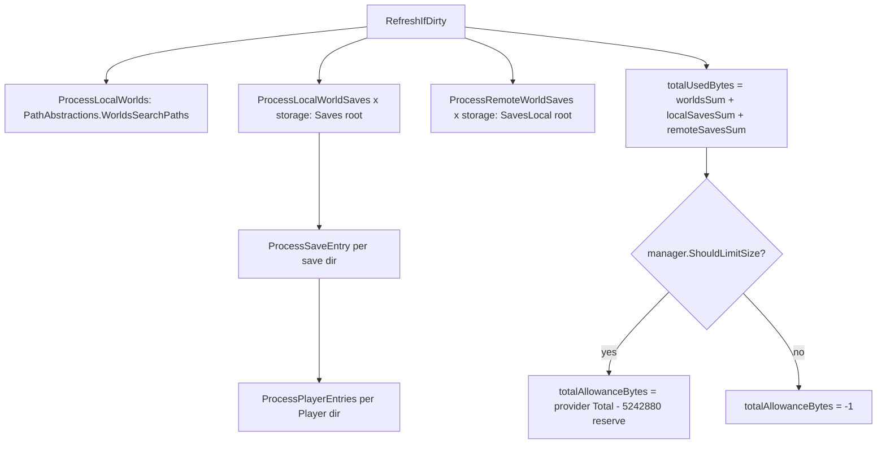

# Save/persistence orchestration: managed paths, slots, save info (dedicated V3.1.0)

**Owns:** the save-data orchestration layer under the world/region byte formats:
`SaveDataManagedPath` (Slot/Type/relative-path model), `SaveDataSlot`, `SaveDataType`,
`SaveDataUtils` (manager/prefs selection, managed-path detection, backup/restore path
mapping), `ISaveDataManager` and its three implementations, `ISaveDataPrefs` and its
three implementations, `SaveDataSizes`, `SaveInfoProvider` (+ nested `WorldEntryInfo`,
`SaveEntryInfo`, `PlayerEntryInfo`, `SaveSizeInfo`), `UserDataStorageType`.
**Not:** the on-disk byte formats of WorldState/chunks/regions
([save-region.md](save-region.md)); when saves are triggered during boot/shutdown
([server-lifecycle.md](server-lifecycle.md)); player-file contents
([server-lifecycle.md](server-lifecycle.md) §3).
**Evidence:** `SaveDataUtils`, `SaveDataManagedPath`, `SaveDataSlot`,
`SaveDataTypeExtensions`, `SaveDataManager`/`SaveDataManagerBase`/`SaveDataManager_Placeholder`,
`SaveInfoProvider`, `SdFile`/`SdDirectory`, `GameIO` IL (dump locally with
`tools/src/DumpMethod`, git-ignored). **Hub:** [`INDEX.md`](INDEX.md).
**Method:** [`re-methodology.md`](re-methodology.md).

This layer exists so console builds can route save I/O through a platform save-game
provider (quota, commit, backup). On the dedicated server every abstraction is present
but resolves to plain `System.IO` pass-through; understanding it explains the
`[SaveDataUtils]` boot log lines, the `.bup` files, and why `sdminfo` reports a
placeholder manager.

---

## 1. Layer overview

Every `SdFile.Open/Exists/Delete/...` overload first calls
`SaveDataUtils.TryGetManagedPath(path, out managedPath)` (IL=47). If the path is inside
the managed root it dispatches to `ISaveDataManager.ManagedFileOpen` etc.; otherwise it
falls through to the matching `System.IO.File`/`Directory` call. `SdFileInfo` /
`SdDirectoryInfo` carry an optional `ManagedPath` so enumeration results stay managed.

**`SdFile` leaf shapes (all IL-verified):** the `Managed*` twins route to
`ISaveDataManager`: `ManagedReadAllBytes(path)` (IL=29) pools a
`PooledExpandableMemoryStream`, `ManagedOpen`s the file
(FileMode.Open / Read / ReadShare), `CopyTo`s and `ToArray`s it;
`ManagedExists` (IL=4) is `SaveDataManager.ManagedFileExists`;
`ManagedGetLastWriteTimeUtc` (IL=4) is the manager call and
`ManagedGetLastWriteTime` (IL=6) converts it `ToLocalTime()`.
The copy trio `ManagedToManagedCopy` / `ManagedToUnmanagedCopy` /
`UnmanagedToManagedCopy` (IL=33 each) open the source (Read/ReadShare) and
the destination (FileMode.Create when `overwrite` else OpenOrCreate,
Write/ReadShare) and `StreamUtils.StreamCopy` between them.

**Dedicated reality:** `SaveDataUtils.s_isManagementEnabled` is set to
`MultiPlatform.SaveGameProvider != null` during init (§3). No code in the dedicated
`Assembly-CSharp` ever assigns `AbsPlatform.SaveGameProvider` (the only
`set_SaveGameProvider` call site is `AbsPlatform.Destroy`, which nulls it; the Steam /
EOS / LAN / Local / XBL factories in this build set none). So on the dedicated server
the flag stays false, `TryGetManagedPath` always returns false, and all save I/O is
plain `System.IO` under the user-data directory.

---

## 2. Path model: `SaveDataManagedPath`, `SaveDataSlot`, `SaveDataType`

### 2.1 Root and types

The managed namespace is rooted at `GameIO.GetUserGameDataDir()` (the dedicated
user-data dir, `UserDataFolder` launch pref / serverconfig). `SaveDataType` +
`SaveDataTypeExtensions` (IL: `GetPathRaw`=26, `GetSlotPathDepth`=19) define four
subtrees:

| SaveDataType | Root-relative path | Slot path depth | Meaning |
|---|---|---:|---|
| `User` = 0 | `` (root) | 0 | everything else under user data |
| `Saves` = 1 | `Saves` | **2** | `Saves/<World>/<SaveGame>` |
| `SavesLocal` = 2 | `SavesLocal` | 1 | per-server local saves on clients (GUID dirs) |
| `GeneratedWorlds` = 3 | `GeneratedWorlds` | 1 | RWG world folders |

`GameIO` mirrors this: `GetSaveGameRootDir` = user data + `Saves`,
`GetSaveGameLocalRootDir` = + `SavesLocal`, and the active dedicated save dir is
`Saves/<GameWorld>/<GameName>` from `GamePrefs` 33/31 with storage from pref 294
(`GameSaveStorageType`), measured in `GameIO.GetSaveGameDir()` IL=8.

**GameIO path/helper leaves (all IL-verified):** `GetDefaultPersistentDataPath()`
(IL=8) is `GetDocumentPath() + "/7 Days To Die"`;
`GetDefaultUserGameDataPath(folder)` (IL=18) falls back to
`GetCachedUserDataPath(0, folder)` with a log error when the native platform
is not yet initialized; `GetRoamingUserGameDataDir()` /
`GetDeviceLocalUserGameDataDir()` (IL=4 each) are `GetUserGameDataPath(1/0, "")`
(roaming vs device-local storage); `GetPlayerDataDir()` /
`GetPlayerDataLocalDir()` (IL=4 each) are `GetSaveGameDir()/Player` and
`GetSaveGameLocalDir()/Player` (the `Player` subtree in each save).
`GetPlayerSaves(foundSave, includeArchived)` (IL=26, with the
`<GetPlayerSaves>g__SearchSaveDir` scan IL=132) walks the roaming (when
`SaveRoamingEnabled`) and local `GetSaveGameRootDir` trees, and for each
`<World>/<SaveGame>` dir (names containing `#` skipped) skips archived saves
unless requested (`archived.flag`), reads the `main.ttw` header into a
`WorldState`, and invokes the `FoundSave` callback
(`storage, worldName, saveName, lastWriteTime, state, archived`), warning
`Error reading header of level '{0}'. Ignoring. Msg:{1}` on a bad header.
`IsWorldGenerated(worldName, storage)` (IL=7) is the existence of
`GetUserGameDataDir(storage)/GeneratedWorlds/<worldName>`;
`SetSaveGameLocalGuid(guid)` (IL=28) stores GamePref 159 and picks the save
storage pref 294 (0 when the local GUID dir exists, 1 otherwise, honoring
`SaveRoamingEnabled`).
Path helpers: `GetNormalizedPath` (IL=5) is `Path.GetFullPath` + trim;
`GetOsStylePath` (IL=16) flips `\` to `/` on Windows;
`IsAbsolutePath` (IL=92) switches on the runtime platform (drive-letter /
root rules); `MakeAbsolutePath(path)` (IL=10) prefixes `GetGamePath() + "/"`
for relative inputs; `GetFilenameFromPath` / `GetDirectoryFromPath`
(IL=19/18) split on the last resource separator;
`GetFileExtension` / `RemoveFileExtension` (IL=17/18) split on the last dot
for names longer than 4; `IsRunningAsSnap()` (IL=21) is Linux + `SNAP_NAME`;
`IsRunningInSteamRuntime()` (IL=65) probes `/etc/os-release` on Linux;
`GetGameExecutableName` (IL=80) returns the platform executable name.

### 2.2 `SaveDataManagedPath` construction

The constructor (`.ctor(String,Boolean)` IL=64) normalizes then precomputes everything:

Derived members: `Type`, `SlotPath` (e.g. `Saves/Navezgane/MyGame`),
`PathRelativeToSlot` (remainder, e.g. `Region/r.0.0.7rg`), `IsParentOf`/`GetChildPath`/
`TryGetParentPath` (string-segment operations on the normalized form; `IsParentOf`
itself is IL=6, the 42 belongs to its compiler-generated local helper), and
`GetOriginalPath()` IL=6 = `Path.Combine(s_saveDataRootPathPrefix, PathRelativeToRoot)`
normalized, which converts back to an absolute OS path. Comparison operators order by
the relative string, so paths are usable as sorted dictionary keys.

`SaveDataSlot` (struct) wraps a `SaveDataManagedPath` whose relative-to-slot part is the
sentinel child `d`: the `(SaveDataType, slotPath)` ctor (IL=54) builds
`<typePath>/<slotPath>/d` so that `Slot.Type`/`Slot.SlotPath` reuse the path parsing;
`GetSimpleSlot()` re-canonicalizes. `ToString()` prints `Saves[Navezgane/MyGame]`.

### 2.3 Managed-path detection (`SaveDataUtils`)

`UpdatePaths()` (IL=61) builds two compiled regexes anchored on the escaped normalized
user-data dir: one with capture groups (`(?:$|[\\/](?<2>.*)$)`, group 2 = relative
path) used by `TryGetManagedPath`, one without groups used by `IsManaged` (IL=16).
Options value 536 = Compiled | Singleline | CultureInvariant. Both helpers return false
immediately when `s_isManagementEnabled` is false, which is the permanent dedicated
state, so on the server they are two predictable branch instructions per file op.

---

## 3. `SaveDataUtils` lifecycle: manager and prefs selection

`GameEntrypoint.EntrypointCoroutineInternal` (the shared boot path, before
`GameManager.StartGame`; see [server-lifecycle.md](server-lifecycle.md) §1) yields
`SaveDataUtils.InitStaticCoroutine()`. Its state machine (`<InitStaticCoroutine>d__17.MoveNext` IL=96):

- `s_isManagementEnabled = (provider != null)`; the manager becomes either
  `new SaveDataManager(provider)` or the `SaveDataManager_Placeholder` singleton, then
  `Init()` runs and `SdDirectory.CreateDirectory(GetUserGameDataDir())` ensures the root.
- Prefs: `LaunchPrefs.PlayerPrefsFile` defaults to `DeviceFlags.IsCurrent(24)`
  (XBoxSeriesS|X only), so the dedicated server defaults to `SaveDataPrefsUnity`
  (Unity `PlayerPrefs`) unless launched with `-PlayerPrefsFile`; the file variant is
  `SaveDataPrefsFile("<userdata>/prefs.cfg")`, an escaped key/value text store.
- `SaveDataPrefsUninitialized` is the pre-init sentinel installed by the `.cctor`.
- Overrides: `SetSaveDataManagerOverride` / `SetSaveDataPrefsOverride` (+ `Clear*`)
  swap the active instances with guard logging. **No caller exists in the dedicated
  assembly**; they are test/automation hooks (and a modding seam).
- `Destroy()` (called from `PlatformApplicationManager.RestartProcess`) flushes
  `SdPlayerPrefs`, `Cleanup()`s the manager, resets prefs to uninitialized, and destroys
  the native provider if present.

`ISaveDataPrefs` (interface, three default-arg convenience overloads with bodies) is
implemented by `SaveDataPrefsFile`, `SaveDataPrefsUnity`, `SaveDataPrefsUninitialized`.

---

## 4. `ISaveDataManager` and implementations

Member surface (from all call sites): `Init`, `Cleanup`, `CommitAsync`, `CommitSync`,
`CommitCoroutine`, `IsCommitPending(token)`, `GetWriteMode`/`SetWriteMode`
(`SaveDataWriteMode` None=0 / Immediate=1 / Deferred=2), `GetSizes`, `UpdateSizes`,
`ShouldLimitSize`, `AppliesSaveSizeLimit`, `Register/DeregisterRegionFileManager`,
`CommitStarted`/`CommitFinished` events, and the `Managed*` file/directory mirror of
`System.IO`.

| Implementation | Backing | Dedicated use |
|---|---|---|
| `SaveDataManagerBase` | abstract; no-op defaults (limit=false, sizes=0, commit token 0) plus the commit-event pump (`QueueOnCommitTask` posts to main thread via `ThreadManager.AddSingleTaskMainThread`, IL=28) | base of all three |
| `SaveDataManager` | `IPlatformSaveGameProvider` + merged IO provider, cached streams, write thread | **never instantiated on dedicated** (provider null) |
| `SaveDataManager_Placeholder` | direct `System.IO` pass-through on `GetOriginalPath()` (e.g. `ManagedFileOpen` IL=7 is `File.Open`) | the singleton the dedicated server runs with |
| `SaveDataManager_Minimal` | per-path lock + concurrent-open detection around `FileStream` | present, **no in-assembly callers** (unused on this build) |

### 4.1 The real `SaveDataManager` (console codepath, documented for completeness)

- `Init()` (IL=8): `SetWriteMode(Deferred)`, `InitRestoreBackups()`,
  `InitFileSizeTracking()`.
- **Backup/restore mapping** lives in `SaveDataUtils`:
  `GetBackupPath(p)` (IL=6) appends the literal suffix `.bup` to the relative path;
  `GetRestorePath(p)` (IL=24) strips it (throws if the suffix is missing). Writers
  (`SaveDataManager.`CachedStream`..ctor`) create the `.bup` sibling before overwriting
  when `provider.ShouldBackup()`; `InitRestoreBackups` (IL=67) scans `SaveDataType.User`
  recursively for `*.bup`, deletes the half-written original and moves the backup back
  (crash-safe write-then-swap). `ManagedFileDelete` also removes the paired `.bup`.
- **Size tracking:** `InitFileSizeTracking` (IL=70) folds every file into
  `fileSizesBySlot: Dictionary<SaveDataSlot, `SlotSizeData`>`;
  `TryGetTrackedSize` answers per-file size plus an `isPriorityFile` flag.
  `IsPriorityFilePath` (IL=17): type is `Saves` and `PathRelativeToSlot` starts with
  `Region`, i.e. region files ([save-region.md](save-region.md) §3) are the priority
  class the commit scheduler and the slot's largest-priority-file accounting favor.
- **Commit:** `CommitAsync` (IL=17) just bumps `explicitCommitNeeded` when Deferred;
  a `SaveDataManager_WriterThread` (`ThreadManager.StartThread` in `SetWriteMode`
  IL=71) drains cached streams (`TryGetNextStreamToCommit`, `CommitPendingChanges`) and
  flushes to the provider. `CommitSync`/`CommitCoroutine` wait on the returned token via
  `IsCommitPending`.
- `ShouldLimitSize`/`GetSizes`/`UpdateSizes` delegate to the provider;
  `AppliesSaveSizeLimit` is hardcoded true (placeholder/base: false).
- `RegionFileManager` registers itself in its ctor and deregisters in `Cleanup`, so the
  manager can coordinate commits with the region save thread.

`SaveDataSizes` is a trivial struct: `(total, remaining)` with `Used = total - remaining`.

`UserDataStorageType` is `DeviceLocal = 0` / `Roaming = 1`, and
`UserDataStorageTypeExtensions.UsesDataLimit` (IL=4) is exactly `storage == Roaming`.
The dedicated server always runs `DeviceLocal` (roaming needs platform
`IUserDataRoaming` support), so no data-limit math ever binds.

---

## 5. `SaveInfoProvider`: enumerating worlds and saves

Lazy singleton (`Instance` IL=6) with a dirty-flag cache: every public getter calls
`RefreshIfDirty()` (IL=194); `SetDirty()`/`ClearResources()` invalidate. Refresh
pipeline:

- **Worlds** (`ProcessLocalWorlds` IL=136): every `AbstractedLocation` from the worlds
  search paths becomes a `WorldEntryInfo`; the type label is localized
  mod/built-in/generated (`EAbstractedLocationType` Mods=3 / GameData=4 / else
  UserDataPath=2), `WorldDataSize` = `GameIO.GetDirectorySize`, version and world size
  from `WorldInfo.LoadWorldInfo`, and `HideIfEmpty` for the `Empty`/`Playtesting`
  stock worlds. Key = `name.ToLowerInvariant() + "_" + normalizedFullPath`.
- **Local saves** (`ProcessLocalWorldSaves(UserDataStorageType)` IL=254): walks
  `Saves/<World>/<Save>`; deletes world folders that contain no saves at all
  (`SdDirectory.Delete` on empty); classifies each save's world as normal,
  **conflicted** (same world name matched more than one location, synthetic
  `WorldEntryInfo` keyed with a localized `xuiDmConflicted` suffix) or **deleted**
  (no world of that name exists any more, `xuiDmDeleted`), then `ProcessSaveEntry`.
  Roaming is only scanned when `IUserDataRoaming.SaveRoamingEnabled`.
- **`ProcessSaveEntry`** (IL=182): reads the `main.ttw` **WorldState header**
  ([save-region.md](save-region.md) §1) to get `gameVersion` and `saveDataLimit`;
  fills `SaveSizeInfo { BytesOnDisk (GetDirectorySize), BytesReserved (saveDataLimit),
  IsArchived (archived.flag file, only when data limit enabled), StorageType }`; logs
  when disk size exceeds the serialized limit; warns on missing `main.ttw` (except
  `WorldEditor`/`PrefabEditor` saves); accumulates into the world entry
  (`SaveDataCount`, `SaveDataSizeTotal`, `SaveDataSizeForLimit`) and `localSavesSum`.
  Save key = `"{world}/{save}_{storage}".ToLowerInvariant()`.
- **`ProcessPlayerEntries`** (IL=206): scans `<save>/Player`, groups files by user id
  stem, builds `PlayerEntryInfo { Id, PrimaryUserId (TryFromCombinedString), Size,
  LastPlayed }` and enriches from `.meta` files (`PlayerMetaInfo`: NativeId, cached
  name, level, distance walked). Platform display names resolve asynchronously via
  `PlayerEntryInfoPlatformDataResolver`.
- **Remote saves** (`ProcessRemoteWorldSaves` IL=276): walks `SavesLocal/<guid>` dirs,
  reading `RemoteWorldInfo.xml` and `PathAbstractions.`Contextual`.FindDownloadedRemoteWorld`.
  This is the **client-side** store for worlds joined on servers (the dedicated server
  is the origin of that data, not a consumer); orphaned entries surface under a
  localized `[Remote Worlds]` group.

### 5.1 Size math and data-limit protection

- `SaveSizeInfo.ReportedSize` = `max(BytesOnDisk, BytesReserved)` when the storage uses
  the data limit and the save is not archived, else `BytesOnDisk`;
  `Archivable` = data-limited and `BytesReserved >= BytesOnDisk`.
- `UsesDataLimit` everywhere reduces to `StorageType == Roaming`, so on dedicated all
  entries report raw disk bytes and `DataLimitEnabled`
  (= `manager.ShouldLimitSize()`) is false.
- `TotalAllowanceBytes`: provider `GetSizes().Total` minus
  `GetPlatformReservedSizeBytes` (constant 5242880 = 5 MiB), or -1 when no limit;
  `TotalAvailableBytes = allowance - used`. `RefreshIfDirty` also assigns
  `BarStartOffset`s for the storage-bar UI (worlds sorted by key ordinal-ignore-case,
  saves newest-first via `LastSaved` CompareTo, players walked backwards).
- `SetDirectoryProtected`/`IsDirectoryProtected` keep an in-memory `HashSet<string>` of
  `Path.GetFullPath`-normalized dirs. Only `XUiC_SaveSpaceNeeded` (protect the active
  save while freeing space) and `XUiC_DataManagement` consult it: **client/console UI
  only**, not a dedicated protection mechanism.

---

## 6. Who calls this on the dedicated server (FindCallers)

| Caller | What it uses | Dedicated? |
|---|---|---|
| `GameEntrypoint` boot coroutine | `SaveDataUtils.InitStaticCoroutine` | yes (boot) |
| `World.Save` | `SaveDataManager.CommitAsync` after WorldState write | yes (no-op commit) |
| `RegionFileManager` ctor / `Cleanup` / `DoSaveChunks` | register/deregister, `AppliesSaveSizeLimit` | yes (limit false) |
| `GamePrefs.Save` | `CommitAsync` | yes |
| `GameManager.Cleanup` | `ISaveDataManager.Cleanup` | yes (shutdown) |
| `GameManager.startGameCo` | `SaveInfoProvider.Instance.ClearResources()` | yes (boot invalidation) |
| `WorldGenerationEngineFinal.WorldBuilder.SaveData` | commit coroutine + `SaveInfoProvider` sizes | yes when RWG generates |
| `ConsoleCmdSaveDataManagerInfo` (`sdminfo`) | dumps manager + provider state | yes (diagnostic) |
| `SdFile`/`SdDirectory` (everywhere: regions, player data, dynamic mesh, Twitch, prefs) | `TryGetManagedPath` per op | yes (always unmanaged branch) |
| `GameManager.worldInfoCo` (via `NetPackageWorldInfo`) | remote save entries, allowance | **client-only** (join handshake receiver) |
| `XUiC_DataManagement`, `XUiC_SaveSpaceNeeded`, `XUiC_ContinueGame`, `XUiC_NewGame`, `XUiC_DM*` lists, `XUiC_BugReport*` | full `SaveInfoProvider` surface, directory protection | client/console-only UI |
| `UserDataManagement` (WorldMove/GameSaveMove/GameSaveCopy) | entry enumeration, `ShouldBeMovedWithSave` | client/console-only (storage migration) |

`WorldEntryInfo.ShouldBeMovedWithSave(target)` (IL=16): move the world folder together
with a save only when the target storage is data-limited, the world is `Moveable`
(user-data generated worlds), and it currently sits in a different storage: pure
roaming-migration logic, inert on dedicated.

### Dedicated-relevance verdict for the scoped types

- **Dedicated-active (trivially):** `SaveDataManagedPath`, `SaveDataSlot`,
  `SaveDataUtils`, `ISaveDataManager` (as `SaveDataManager_Placeholder`),
  `ISaveDataPrefs` (as `SaveDataPrefsUnity`), `UserDataStorageType` (always
  `DeviceLocal`), `SaveInfoProvider.ClearResources` on boot.
- **Client/console-only in practice:** the real `SaveDataManager` (needs a platform
  save-game provider absent from this build), `SaveDataSizes` beyond the zero struct,
  the data-limit/allowance/protection math and `WorldEntryInfo`/`SaveEntryInfo`/
  `PlayerEntryInfo` consumers (all UI or client join), remote-save (`SavesLocal`)
  scanning. `SaveDataManager_Minimal` has **no callers at all** in this assembly.

### GamePrefs.Save: two persistence paths (IL=78 / IL=29 / IL=92)

`GamePrefs.Save()` (parameterless, IL=78) is the dedicated-server write path
(`GameManager.SaveAndCleanupWorld` IL_06B0, `ConsoleCmdGfx`, `ConsoleCmdSetTempUnit`,
and `GameManager.Awake`). It walks `s_propertyList`, writes every
`IsPersistent` decl into `SdPlayerPrefs` keyed by the cached enum name, then
`SdPlayerPrefs.Save()` + `SaveDataManager.CommitAsync()` and logs
`Persistent GamePrefs saved`. The per-type mapping (switch on
`PropertyDecl.type`, `EnumType`): `Int` → `SetInt`, `Float` → `SetFloat`,
`String` → `SetString`, `Bool` → `SetInt(name, 1/0)` (bools are stored as 0/1
ints), `Binary` → `SetString(name, Utils.ToBase64(str))` (a string blob
base64-encoded before it touches the prefs store).

`Save(sdfFileName)` (IL=29) is a thin wrapper that collects every enum name and
delegates to `Save(sdfFileName, List<EnumGamePrefs>)` (IL=92). That overload
opens `SDF.SdfFile(file)` (created + `Load()`ed), writes each pref present in
the caller-supplied list through the typed `SdfFile.Set` overloads
(`Set(name, float/int/string/bool)`, `Binary` → `Set(name, str, true)`), then
`Save()`, with errors caught and logged via `Log.Error`. Callers are the
client/console option menus only (`XUiC_OptionsDialogBase.saveChanges`,
`XUiC_NewContinueGameSettings.SaveGameOptions`) - the SDF variant is not part
of the dedicated shutdown chain.

---

## Related docs

| Doc | Why |
|---|---|
| [save-region.md](save-region.md) | WorldState/`main.ttw` header this layer reads; region files this layer prioritizes |
| [server-lifecycle.md](server-lifecycle.md) | boot/shutdown points where init, save, and cleanup fire |
| [world-chunks.md](world-chunks.md) | RegionFileManager that registers with the manager |
| [managers.md](managers.md) | where these singletons sit among the other managers |
| [console-commands.md](console-commands.md) | `sdminfo` diagnostic command |

## Changelog

- **2026-08-07:** GamePrefs.Save overloads (IL=78 / 29 / 92): parameterless
  SdPlayerPrefs path (persistent prefs, bool to 0/1 int, Binary to base64) is
  the dedicated shutdown path; SDF-file variant is client-menu only.
- **2026-07-24:** Initial doc: managed path/slot model, SaveDataUtils init + backup/restore mapping, manager implementations, SaveInfoProvider enumeration and size math, dedicated-vs-client call map from FindCallers.
