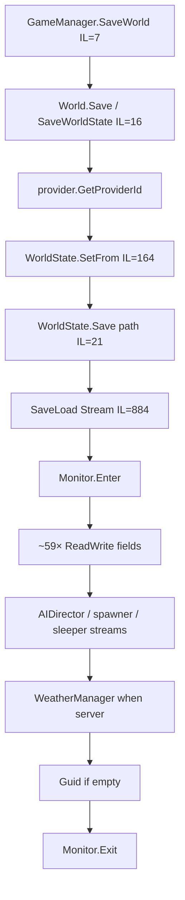
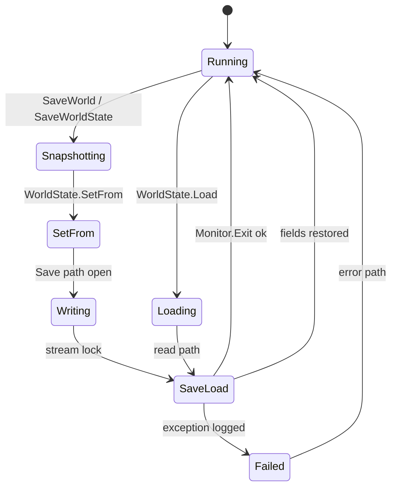
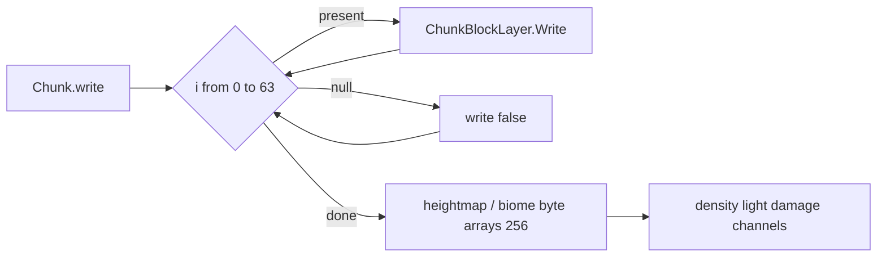
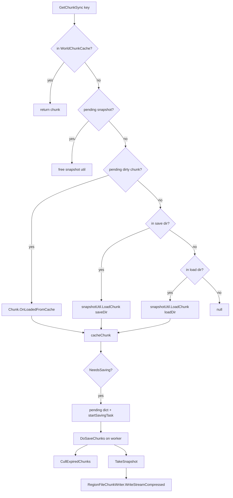

# Save, WorldState, and region files (dedicated V3.0.1)

**Owns:** WorldState, Chunk write/read, `RegionFile`* managed layout, snapshot/Deflate path, WorldBlockTicker schedule wire (generic engine).  
**Product expand/inject notes:** `7days-realworld/docs/realearth-surfaces.md`.  
**Dumps:** `../il/loop-complete-v3.0.1/`, `../il/realearth-surfaces-v3.0.1/`, `../il/dedi-complete-v3.0.1/`.  
**Hub:** [`INDEX.md`](INDEX.md).

---

## 1. Save call chain (managed)



Also: optional backup copy on `Save(String)` before `SaveLoad`.

### 1.1 World save state machine (managed)



### WorldState fields (serialized via ReadWrite / streams)

| Field | Type | Role |
|---|---|---|
| `version` / `CurrentSaveVersion` | uint / static int | Format version |
| `gameVersionString` / `gameVersion` | string / VersionInformation | Build pin |
| `waterLevel` | float | |
| `chunkSizeX/Y/Z`, `chunkCount` | int | |
| `seed`, `worldTime`, `timeInTicks` | int / ulong | |
| `nextEntityID` | int | from EntityFactory |
| `providerId` | EnumChunkProviderId | |
| `activeGameMode` | int | |
| `playerSpawnPoints` | SpawnPointList | |
| `dynamicSpawnerState` | MemoryStream | dynamic spawn blob |
| `aiDirectorState` | MemoryStream | AIDirector.Save |
| `sleeperVolumeState` (+ version) | MemoryStream | World.WriteSleeperVolumes |
| `triggerVolumeState` (+ version) | MemoryStream | |
| `wallVolumeState` (+ version) | MemoryStream | |
| `saveDataLimit` | long | |
| `Guid` | string | world identity |

`SetFrom(World, EnumChunkProviderId)` (IL=164) snapshots water level (`WorldConstants.WaterLevel`), seed, time, entity id, writes sleeper/trigger/wall volumes, dynamic spawner, **`new AIDirector()` path via Save**, chunk sizes (includes literal **256** for area-related sizes on stock).

---

## 2. Chunk binary format (stock IL)

| Method | IL | Bound |
|---|---:|---|
| `Chunk.write(PooledBinaryWriter, bool)` | 601 | **layer loop `i < 64` hardcoded** |
| `Chunk.read(PooledBinaryReader, uint, bool)` | 775 | **same `i < 64`** |
| `Chunk.save` / `load` | 14 / 9 | wrappers |
| `CurrentSaveVersion` | 47 | |
| `SupportedSaveVersion` | 32 | read throws if version &lt; 32 |

Write order (measured):

1. `m_X`, `m_Y`, `m_Z`, `SavedInWorldTicks`  
2. For `i in 0..63`: bool present + optional `ChunkBlockLayer.Write`  
3. Optional `chnStability.Write`  
4. Byte arrays: `m_HeightMap`, `m_TerrainHeight`, topsoil, biomes, intensities (256-byte maps)  
5. Dominant biomes, custom data, density/light/damage/texture/water channels, entities, TEs, …

**Expand note:** changing only `WorldConstants.ChunkBlockLayers` does **not** change this loop; patcher must rewrite the `ldc.i4.s 64` sites. Detail: `7days-realworld/docs/realearth-surfaces.md` §5.0.



### Density/light channel persistence

`ChunkBlockChannel.Write` IL=120, `Read` IL=151:

- Layer data size literal **1024** (16×16×4 cells per sublayer band)  
- Fields: `layers`, `bytesPerVal`, `sameValue`, `CBCLayer.data`  
- Read path: `ReadByte` / `Read` / `allocLayer` / `freeLayer` / `onLayerRead`

---

## 3. Region file system

### Type hierarchy

```text
`RegionFile`
  ├─ `RegionFileRaw`          (CurrentVersion=1, 8x8 chunks)
  └─ `RegionFileSectorBased` → V1 / V2

RegionFileAccessAbstract → MultipleChunks → Raw | SectorBased
RegionFileManager : WorldChunkCache  (cache, cull, claim protect)
Factories: RegionFileFactoryRaw / RegionFileFactorySectorBased
           (RegionFilePlatform.CreateFactory picks platform default)
```

### `RegionFileRaw` constants

| Constant | Value |
|---|---|
| ChunksPerRegionPerDimension | **8** |
| ChunksPerRegion | **64** |
| fileHeaderLength | 11 |
| locationHeaderLength | 128 |
| timestampHeaderLength | 64 |
| sectorsStartOffset | **779** (literal in `WriteData`) |
| reservedBytesPerEntry | 4 |

`GetOffsetFromXz`: `(x%8) + (z%8)*8` with negative adjust.  
`RegionFileManager.cChunkFileExt` = **`.ttc`**.

Protection margins (cull): land claim / bedroll / offline / backpack / vehicle / quest / supply = **1** chunk each.

### 3.1 Runtime path (manager)

`RegionFileManager` is the live cache + save orchestrator (extends
`WorldChunkCache`). Key methods verified this pass:

| Method | IL | Role |
|---|---:|---|
| `cacheChunk` | 114 | insert into live cache; if `NeedsSaving`, queue into pending dict and `startSavingTask` |
| `GetChunkSync(Int64)` | 178 | live cache → pending snapshot → pending chunk → load from save dir → load from load dir → `cacheChunk` |
| `DoSaveChunks` | **292** | free locked unload list, `CullExpiredChunks`, `OptimizeLayouts`, drain snapshot dict + dirty chunk dict via `IRegionFileChunkSnapshotUtil.TakeSnapshot` / write |
| `CullExpiredChunks` | 179 | refresh protection levels + group timestamps; remove unprotected expired keys (`RemoveChunks`) |

There is **no** `RegionFileManager.Update` call site in the assembly (Xref=0).
Save work is task-driven from `cacheChunk` / world save, not a per-frame MB.



### 3.2 Snapshot blob (in-memory before region write)

`RegionFileChunkSnapshot.Update(Chunk, saveIfUnchanged)` IL=111:

1. Skip unless `saveIfUnchanged` or `Chunk.NeedsSaving`.
2. Reset/alloc pooled memory stream + binary writer.
3. Write magic **4 bytes**: `116, 116, 99, 0` = ASCII **`ttc\0`**.
4. Write `UInt32` chunk format version **47**.
5. `Chunk.save(PooledBinaryWriter)` (the §2 layer loop).
6. Rewind stream to 0 for the writer stage.

`RegionFileChunkWriter.WriteStreamCompressed` IL=48:

1. `RegionFileAccessAbstract.GetOutputStream(dir, chunkX, chunkZ, ext)`.
2. Prefix with `Int64` length field.
3. Copy payload through **`Noemax.GZip.DeflateOutputStream`** (Deflate, not raw zlib wrapper name in managed).
4. Close stream.

`RegionFileChunkReader.readIntoLoadStream` IL=123 is the inverse: input stream →
read header/version → **`DeflateInputStream`** → pooled load stream for
`Chunk.read`.

### 3.3 Access layer → region file

`RegionFileAccessMultipleChunks.Write` IL=20 is a thin fan-in:

1. `GetRegionCoords(chunkX, chunkZ)` → region indices.
2. `GetRFC` opens/caches the `RegionFile` for that region + extension.
3. `RegionFile.WriteData(chunkX, chunkZ, length, compression, bytes, saveHeader)`.

`RegionFileRaw.WriteData` IL=229:

1. `GetLocationInfo` / `FindBestFreeSpace` / `SetLocationInfo` / `SetTimestampInfo`.
2. Open file (`SdFile.Open`), seek to sector payload (`sectorsStartOffset` **779**
   appears on the free-space path).
3. Write length (`StreamUtils.Write` Int32) + payload bytes + compression byte.
4. Optionally `SaveHeaderData` (location + timestamp headers).

`RegionFileRaw.ReadData` IL=96: location lookup → seek → read Int32 length →
`StreamCopy` into target stream.

Factories: `RegionFileFactoryRaw.CreateRegionFileAccess` and
`RegionFileFactorySectorBased.CreateRegionFileAccess` are 2-IL wrappers;
`RegionFilePlatform.CreateFactory` selects the platform default.

### 3.4 WorldBlockTicker (scheduled + random block ticks)

Not a region-file type, but it is the other persistence-adjacent world tick that
serializes into chunk/player save state via scheduled entries.

**Caller:** `World.OnUpdateTick` → `WorldBlockTicker.Tick` (Xref=1).

`Tick` IL=20 (server only, `GameManager.bTickingActive`):

1. If not remote: `tickScheduled(_rnd)`.
2. If not remote: `tickRandom(activeChunks, _rnd)`.

| Path | IL | Cap / cadence | Work |
|---|---:|---|---|
| `tickScheduled` | **151** | at most **100** due entries per call | sorted by time; drop if `scheduledTime > GameTimer.ticks`; if chunk area unloaded, reschedule +30..45 ticks; else `execute` |
| `tickRandom` | 97 | `max(activeCount/100, 1)` chunks per frame | rebuild key list when index wraps; per chunk `tickChunkRandom` |
| `tickChunkRandom` | 97 | requires `GameTimer.ticks - LastTimeRandomTicked >= **1200**` | walk `Chunk.GetTickedBlocks()` reverse; skip if already scheduled; `Block.UpdateTick(...)` |

`WorldBlockTickerEntry` fields: `worldPos`, `blockID`, `scheduledTime`,
`nextTickEntryID`, `tickEntryID`.

**Entry wire (`Write` IL=33 / `Read` IL=28):**

| Order | Field | Encoding |
|---|---|---|
| 1 | local X | `u8` (`toBlockXZ`) |
| 2 | Y | `u8` |
| 3 | local Z | `u8` |
| 4 | blockID | `u16` |
| 5 | scheduledTime | `u64` |
| 6 | trailing u16 | written; **read and discarded** (pop) |

Read reconstructs world XZ as `local + chunk*16`.

### 3.5 Managed completeness

| Question | Answer |
|---|---|
| How chunks enter disk? | Snapshot (`ttc\0` + ver 47 + `Chunk.save`) → Deflate → `RegionFile.WriteData` via access layer |
| Header layout constants? | Measured above; sectorsStartOffset 779 re-hit in WriteData IL |
| Who drives save? | `cacheChunk` / world save → `DoSaveChunks` (no `RegionFileManager.Update`) |
| Exact sector free-list algorithm? | `FindBestFreeSpace` body present; not fully narrated beyond call order |
| Random tick interval? | 1200 game ticks between per-chunk random passes |

---

## 4. Other save surfaces

| Surface | IL / note |
|---|---|
| `PersistentPlayerList.Write` | 73; claims + players |
| `PersistentPlayerList.SavePersistentPlayerData` | 12 |
| `GameManager.SaveLocalPlayerData` | 45 |
| `GameManager.SaveAndCleanupWorld` | 499 |
| `ChunkProviderGenerateWorld.SaveRandomChunks` | 99 |
| `World.SaveDecorations` | 3 |

## See also

| Doc | Why |
|---|---|
| `realearth-surfaces.md` | Product expand/inject surfaces (not generic research) |
| [world-chunks.md](world-chunks.md) | Load/unload pipeline |
| [terrain-height.md](terrain-height.md) | YDim pin vs byte heightmaps |
| [loop.md](loop.md) | When SaveWorldState is invoked |
| [light-mesh-water.md](light-mesh-water.md) | Water sim also schedules via WorldBlockTicker |
| [inventories/dedicated-leaves.md](inventories/dedicated-leaves.md) | RegionFile* / ticker leaf rows |

## Save-data file layer (`SaveDataManager`)

Above the world/region byte format documented here, `SaveDataManager` (with the
`Sd*` file abstraction: `SdFile`/`SdDirectoryInfo`/`SdFileInfo`) is the platform-abstracted
save-file I/O layer (local disk and, on console/platform, cloud/managed save slots). It
owns paths and file lifecycle; the on-disk byte formats (WorldState, region, player) are
the sections above. The platform cloud-save backend is native (residual).

## Changelog

- **2026-07-28:** Region runtime path (DoSaveChunks/GetChunkSync), snapshot magic `ttc\0`+v47, Deflate writer/reader, WorldBlockTicker dual path + entry wire.
- **2026-07-18:** Save state machine + see also.  
- **2026-07-18:** Save/region narrative from loop-complete + realearth-surfaces + dedi-complete dumps.
