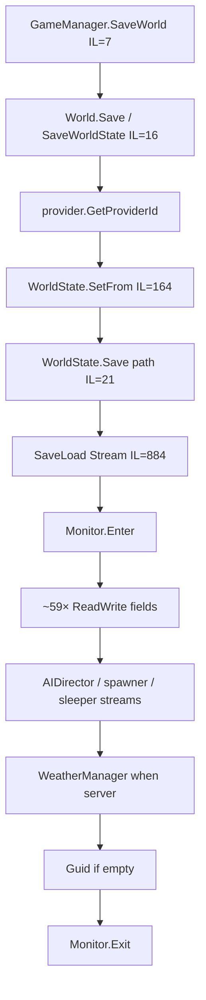
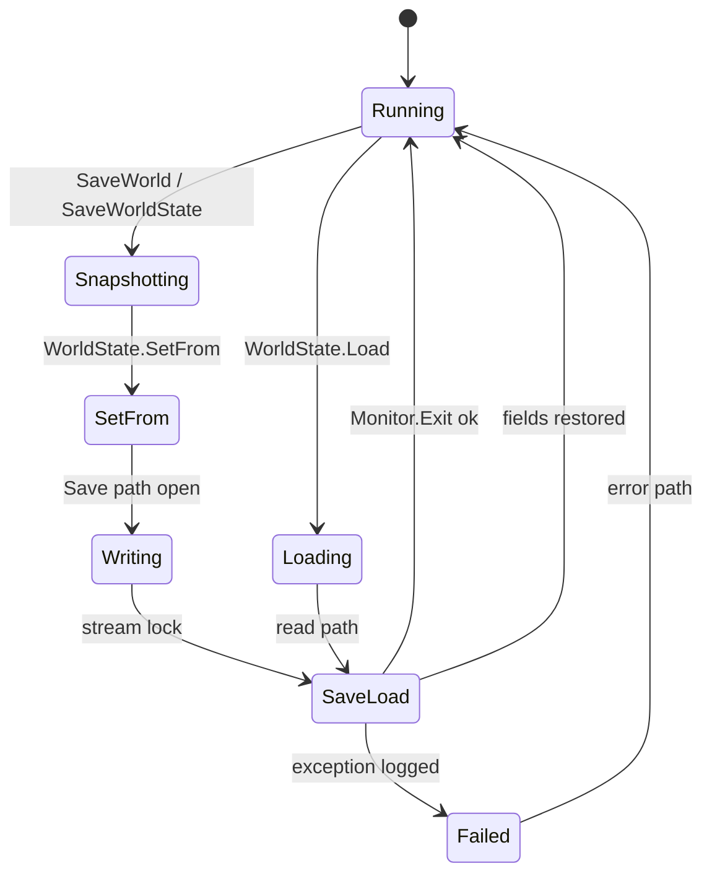
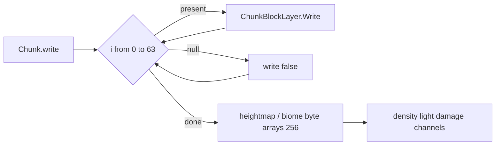

# Save, WorldState, and region files (dedicated V3.0.1)

**Owns:** WorldState, Chunk write/read, RegionFile* managed layout (generic engine).  
**Product expand/inject notes:** `7days-realworld/docs/realearth-surfaces.md`.  
**Dumps:** `../il/loop-complete-v3.0.1/`, `../il/realearth-surfaces-v3.0.1/`, `../il/dedi-complete-v3.0.1/`.  
**Hub:** [`INDEX.md`](INDEX.md).

---

## 1. Save call chain (managed)



Also: optional backup copy on `Save(String)` before `SaveLoad`.

### 1.1 World save state machine (managed)



### WorldState fields (serialized via ReadWrite / streams)

| Field | Type | Role |
|---|---|---|
| `version` / `CurrentSaveVersion` | uint / static int | Format version |
| `gameVersionString` / `gameVersion` | string / VersionInformation | Build pin |
| `waterLevel` | float | |
| `chunkSizeX/Y/Z`, `chunkCount` | int | |
| `seed`, `worldTime`, `timeInTicks` | int / ulong | |
| `nextEntityID` | int | from EntityFactory |
| `providerId` | EnumChunkProviderId | |
| `activeGameMode` | int | |
| `playerSpawnPoints` | SpawnPointList | |
| `dynamicSpawnerState` | MemoryStream | dynamic spawn blob |
| `aiDirectorState` | MemoryStream | AIDirector.Save |
| `sleeperVolumeState` (+ version) | MemoryStream | World.WriteSleeperVolumes |
| `triggerVolumeState` (+ version) | MemoryStream | |
| `wallVolumeState` (+ version) | MemoryStream | |
| `saveDataLimit` | long | |
| `Guid` | string | world identity |

`SetFrom(World, EnumChunkProviderId)` (IL=164) snapshots water level (`WorldConstants.WaterLevel`), seed, time, entity id, writes sleeper/trigger/wall volumes, dynamic spawner, **`new AIDirector()` path via Save**, chunk sizes (includes literal **256** for area-related sizes on stock).

---

## 2. Chunk binary format (stock IL)

| Method | IL | Bound |
|---|---:|---|
| `Chunk.write(PooledBinaryWriter, bool)` | 601 | **layer loop `i < 64` hardcoded** |
| `Chunk.read(PooledBinaryReader, uint, bool)` | 775 | **same `i < 64`** |
| `Chunk.save` / `load` | 14 / 9 | wrappers |
| `CurrentSaveVersion` | 47 | |
| `SupportedSaveVersion` | 32 | read throws if version &lt; 32 |

Write order (measured):

1. `m_X`, `m_Y`, `m_Z`, `SavedInWorldTicks`  
2. For `i in 0..63`: bool present + optional `ChunkBlockLayer.Write`  
3. Optional `chnStability.Write`  
4. Byte arrays: `m_HeightMap`, `m_TerrainHeight`, topsoil, biomes, intensities (256-byte maps)  
5. Dominant biomes, custom data, density/light/damage/texture/water channels, entities, TEs, …

**Expand note:** changing only `WorldConstants.ChunkBlockLayers` does **not** change this loop; patcher must rewrite the `ldc.i4.s 64` sites. Detail: `7days-realworld/docs/realearth-surfaces.md` §5.0.



### Density/light channel persistence

`ChunkBlockChannel.Write` IL=120, `Read` IL=151:

- Layer data size literal **1024** (16×16×4 cells per sublayer band)  
- Fields: `layers`, `bytesPerVal`, `sameValue`, `CBCLayer.data`  
- Read path: `ReadByte` / `Read` / `allocLayer` / `freeLayer` / `onLayerRead`

---

## 3. Region file system

### Type hierarchy

```text
RegionFile
  ├─ RegionFileRaw          (CurrentVersion=1, 8×8 chunks)
  └─ RegionFileSectorBased → V1 / V2

RegionFileAccessAbstract → MultipleChunks → Raw | SectorBased
RegionFileManager : WorldChunkCache  (cache, cull, claim protect)
```

### RegionFileRaw constants

| Constant | Value |
|---|---|
| ChunksPerRegionPerDimension | **8** |
| ChunksPerRegion | **64** |
| fileHeaderLength | 11 |
| locationHeaderLength | 128 |
| timestampHeaderLength | 64 |
| sectorsStartOffset | **779** |
| reservedBytesPerEntry | 4 |

`GetOffsetFromXz`: `(x%8) + (z%8)*8` with negative adjust.  
`RegionFileManager.cChunkFileExt` = **`.ttc`**.

Protection margins (cull): land claim / bedroll / offline / backpack / vehicle / quest / supply = **1** chunk each.

### Managed completeness

| Question | Answer |
|---|---|
| How chunks enter disk? | RegionFileRaw/Sector WriteData + RegionFileManager save thread fields |
| Header layout constants? | Measured above |
| Exact compressed blob codec of sector payload? | Method bodies present in dump; full byte-level codec not hand-annotated (optional deep dive; not required for sim-loop understanding) |

---

## 4. Other save surfaces

| Surface | IL / note |
|---|---|
| `PersistentPlayerList.Write` | 73; claims + players |
| `PersistentPlayerList.SavePersistentPlayerData` | 12 |
| `GameManager.SaveLocalPlayerData` | 45 |
| `GameManager.SaveAndCleanupWorld` | 499 |
| `ChunkProviderGenerateWorld.SaveRandomChunks` | 99 |
| `World.SaveDecorations` | 3 |

## See also

| Doc | Why |
|---|---|
| `realearth-surfaces.md` | Product expand/inject surfaces (not generic research) |
| [world-chunks.md](world-chunks.md) | Load/unload pipeline |
| [terrain-height.md](terrain-height.md) | YDim pin vs byte heightmaps |
| [loop.md](loop.md) | When SaveWorldState is invoked |

## Save-data file layer (`SaveDataManager`)

Above the world/region byte format documented here, `SaveDataManager` (with the
`Sd*` file abstraction: `SdFile`/`SdDirectoryInfo`/`SdFileInfo`) is the platform-abstracted
save-file I/O layer (local disk and, on console/platform, cloud/managed save slots). It
owns paths and file lifecycle; the on-disk byte formats (WorldState, region, player) are
the sections above. The platform cloud-save backend is native (residual).

## Changelog

- **2026-07-18:** Save state machine + see also.  
- **2026-07-18:** Save/region narrative from loop-complete + realearth-surfaces + dedi-complete dumps.
