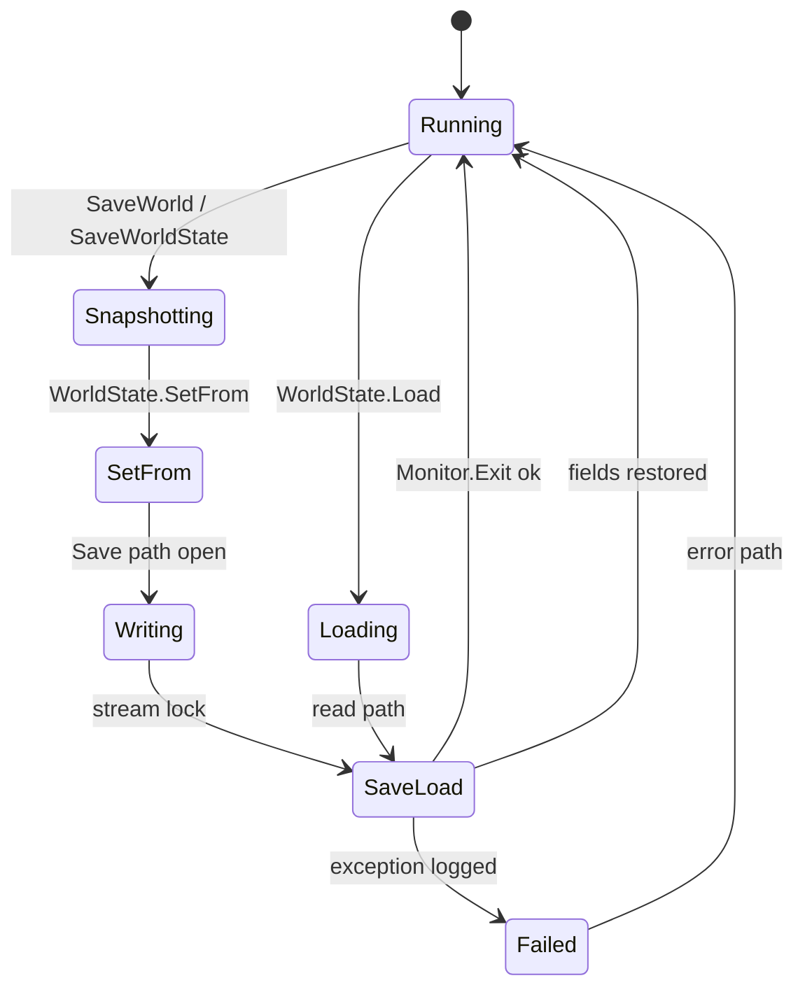
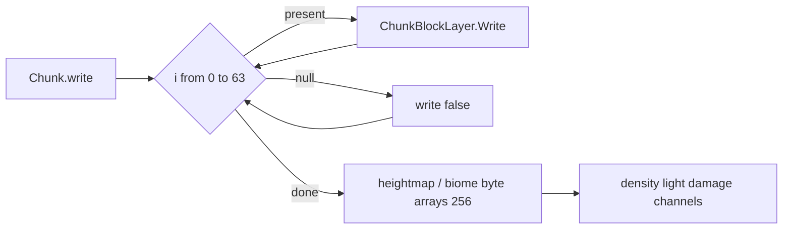
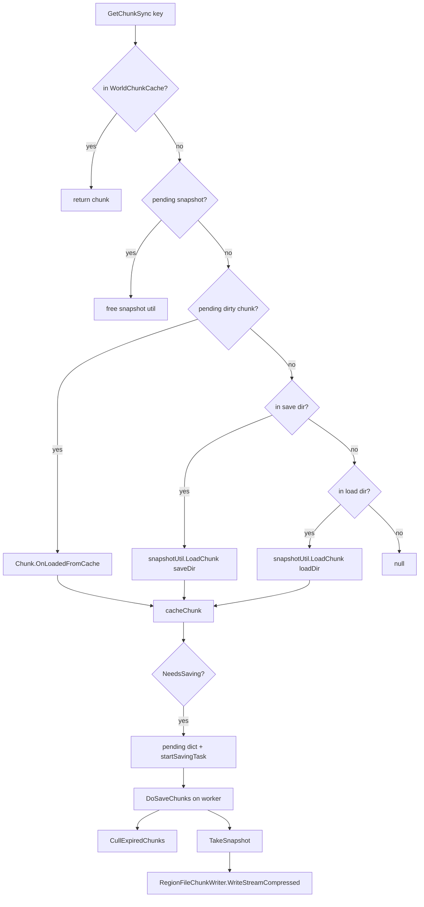
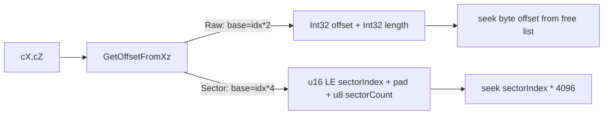

# Save, WorldState, and region files (dedicated V3.1.0)

**Owns:** WorldState, Chunk write/read, `RegionFile`* managed layout, snapshot/Deflate path, WorldBlockTicker schedule wire (generic engine).  
**Product expand/inject notes:** `7days-realworld/docs/realearth-surfaces.md`.  
**Dumps:** `../il/loop-complete-v3.1.0/`, `../il/realearth-surfaces-v3.1.0/`, `../il/dedi-complete-v3.1.0/`.  
**Hub:** [`INDEX.md`](INDEX.md).

---

## 1. Save call chain (managed)

```mermaid
flowchart TD
  SW[GameManager.SaveWorld IL=7]
  SW --> WS[World.Save / SaveWorldState IL=16]
  WS --> PID[provider.GetProviderId]
  PID --> SF[WorldState.SetFrom IL=164]
  SF --> SAVE[WorldState.Save path IL=21]
  SAVE --> SL[SaveLoad Stream IL=926 (V3.1.0; was 884 on V3.0.1)]
  SL --> MON[Monitor.Enter]
  MON --> RW[~59× ReadWrite fields]
  RW --> BLOB[AIDirector / spawner / sleeper streams]
  BLOB --> WX[WeatherManager when server]
  WX --> GUID[Guid if empty]
  GUID --> OUT[Monitor.Exit]
```

Also: optional backup copy on `Save(String)` before `SaveLoad`.

### 1.1 World save state machine (managed)



### WorldState fields (serialized via ReadWrite / streams)

| Field | Type | Role |
|---|---|---|
| `version` / `CurrentSaveVersion` | uint / static int | Format version |
| `gameVersionString` / `gameVersion` | string / VersionInformation | Build pin |
| `waterLevel` | float | |
| `chunkSizeX/Y/Z`, `chunkCount` | int | |
| `seed`, `worldTime`, `timeInTicks` | int / ulong | |
| `nextEntityID` | int | from EntityFactory |
| `providerId` | EnumChunkProviderId | |
| `activeGameMode` | int | |
| `playerSpawnPoints` | SpawnPointList | |
| `dynamicSpawnerState` | MemoryStream | dynamic spawn blob |
| `aiDirectorState` | MemoryStream | AIDirector.Save |
| `sleeperVolumeState` (+ version) | MemoryStream | World.WriteSleeperVolumes |
| `triggerVolumeState` (+ version) | MemoryStream | |
| `wallVolumeState` (+ version) | MemoryStream | |
| `saveDataLimit` | long | |
| `Guid` | string | world identity |

`SetFrom(World, EnumChunkProviderId)` (IL=164) snapshots water level (`WorldConstants.WaterLevel`), seed, time, entity id, writes sleeper/trigger/wall volumes, dynamic spawner, **`new AIDirector()` path via Save**, chunk sizes (includes literal **256** for area-related sizes on stock). Blobs are held as `MemoryStream` fields until `SaveLoad` writes them length-prefixed.

### 1.1b `main.ttw` header codec (`SaveLoad(Stream)`, IL=926 on V3.1.0)

Symmetric reader/writer via `IBinaryReaderOrWriter` under a lock on `this`.

**Magic (verified):** three chars + trailing byte:

```text
't' 't' 'w' 0x00     // ASCII "ttw\0"  (filename main.ttw)
```

On save, those four values are written first. On load, four reads are compared to
`116,116,119,0`; mismatch logs `Invalid magic bytes in world header` and fails.

**Then (high level, version-gated; verified V3.1.0 IL=926):**

`WorldState.CurrentSaveVersion` = **23** (`0x17`, cctor). File `version:u32` is
compared to that on load (reject newer).

| Stage | Gate (file version) | Contents |
|---|---|---|
| Version | always | `uint version` vs `CurrentSaveVersion` |
| Game version string | version &gt; 11 | `gameVersionString` + warn if != `Constants.cVersionInformation.LongString` |
| Structured `VersionInformation` | version &gt; 14 | ReleaseType, Major, Minor, Build as i32s (else legacy string parse) |
| Active game mode | version &gt; 6 | `activeGameMode:i32` |
| Water + chunk geometry | always after mode pad | `waterLevel`, `chunkSizeX`, then Y/Z **swapped on store** (Y field written from Z read and vice versa - stock quirk), `chunkCount`, `providerId`, `seed`, `worldTime` |
| `timeInTicks` | version &gt; 8 | u64 |
| Spawn points | version &gt; 5 (modern path) | `SpawnPointList.Read` |
| `nextEntityID` | version &gt; 3 | i32; on load FastMax with 171 |
| `saveDataLimit` | version &gt;= 21 | i64; else -1 |
| Dynamic spawner blob | version &gt; 7 | len:i32 + bytes -> `dynamicSpawnerState` |
| AIDirector blob | version &gt; 10 | len:i32 + bytes -> `aiDirectorState` |
| Sleeper volumes | version &gt; 12 | if version &gt;= 23: `sleeperVolumesSaveVersion:i32`; then len+bytes blob |
| Trigger volumes | version &gt;= 19 | if version &gt;= 23: `triggerVolumesSaveVersion:i32`; then blob |
| Wall volumes | version &gt;= 20 | if version &gt;= 23: `wallVolumesSaveVersion:i32`; then blob |
| Weather manager | version &gt; 11 | if version &gt; 15: size prefix; if version &gt;= 22: `weatherManagerState` blob (try/catch; seek-recover on fail) |
| Guid | version &gt; 13 (and weather ok / version &gt; 15) | string; generate if empty on load |

**V3.1.0 vs V3.0.1 growth (884 -> 926 IL):** not a new top-level field list, but
tighter **version-23** gates that serialize per-subsystem
`sleeper/trigger/wallVolumesSaveVersion` integers before those blobs, plus the
structured VersionInformation path (version &gt; 14) and weather size-prefix /
blob path (versions 15/22). Field inventory on the type is unchanged
(`weatherManagerState` already present).

Ctor defaults: `providerId = Disc (1)`, `saveDataLimit = -1`, empty
`SpawnPointList`, new Guid.

**`SaveDataLimitUtils.CalculatePlayerMapSize(worldSize)` (IL=28):** the player
map byte budget: `area = worldSize.x * worldSize.y` (throws
`ArgumentException` on a non-positive area), then
`Min(area / 256 * 516, 270532608)` - 516 bytes per 16x16 chunk of the world,
capped at 258 MiB for the map data.

### 1.2 File path helpers

| Method | IL | Behavior |
|---|---:|---|
| `Save(string)` | 21 | if file exists and size &gt; 0, copy to `*.bak`; then `SaveLoad(path, load=false)` |
| `Save(Stream)` | 7 | `SaveLoad(stream, load=false)` |
| `Load(string, …)` | 102 | try primary; on fail copy to `*.loadFailed`, try `*.bak`, then `*.ext.bak` (last successful load extra backup) |
| `SaveLoad(string,…)` | 76 | lock; open read or buffered create; call stream `SaveLoad` |

---

### 1.3 PlayerDataFile (per-player `*.ttp`)

Path: `{playerDir}/{playerId}.{EXT}` with atomic `*.tmp` write and `*.bak` backup
(Save IL=129). Separate `*.meta` via `PlayerMetaInfo.Write`.

**On-disk header (verified):**

```text
't' 't' 'p' 0x00     // magic ttp\0
version : u8         // written as literal 59 on current Save
// then PlayerDataFile.Write body
```

Load (IL=223) checks magic; on failure rolls to `*.bak`. Network form used by
`NetPackagePlayerData` / join `PlayerId`:

```text
PlayerDataFile.Write  +  PlayerMetaInfo.Write     // WriteNetwork IL=8
ReadNetwork: Read(version=-1) + PlayerMetaInfo.FromStream
```

**`Write` body (IL=372) major sections** (order; nested codecs own details):

1. `EntityCreationData.write(networkWrite=false)` (disk ECD)
2. inventory `ItemStack[]`, selected slot, `Bag`, drag-and-drop stack
3. already-crafted name set (u16 count + strings)
4. spawn selection key / last spawn / loaded flag
5. entity id, kills, deaths, score
6. `Equipment.Write`
7. unlocked + favorite recipe lists
8. map marker, crouched lock, `CraftingData`
9. craft totals, distance walked, lives, game-stage birth time
10. `WaypointCollection`, `QuestJournal`, `ChallengeJournal`
11. death/life flags, rented VM position, further progression fields

`FromPlayer` / `ToPlayer` (IL=300 / 463) bridge live `EntityPlayer` and this blob
(join path in [protocol.md](protocol.md) section 5).

**`Read` body (IL=564)** mirrors `Write` with version gates: whole body requires
`version > 37`; legacy inventory via `ReadItemStackOld` (v < 10); `Bag` is
`Bag.Read` (v >= 58) or built from `ReadItemStack` + version-gated locked-slots
(v >= 57 bool + `PackedBoolArray`, v >= 55 u16 count, v >= 53 all-true count);
v >= 52 takes the first of a drag-and-drop stack; v < 49 pops three legacy ints;
v < 54 pops a legacy `Equipment`; `craftingData` reads `Read` (v >= 59) else
`ReadLegacy`; v <= 38 reads `rentalEndTime` (u64) else `rentalEndDay` (i32);
v <= 55 pops a legacy u16 count of ints; `progressionData` / `buffData` /
`stealthData` are length-prefixed byte blobs (0 length = empty stream); v > 50
reads `favoriteShapes`; v > 44 reads `ownedEntities` (`OwnedEntityData.Read` at
v > 47, else legacy id + optional extra id); v > 45 reads `totalTimePlayed`.
A `bModdedSaveGame` flag logs `Modded save game` on load.

**`FromPlayer(player)` (IL=300)** is the extraction mirror: clones the bag,
equipment, waypoints, quest/challenge journals, and inventory slots, writes the
`progressionData` / `buffData` / `stealthData` blobs via pooled writers, copies
kills/deaths/score, marker position, rented-VM position, and the drag-and-drop
stack (when the XUi is ready), and clears shared quest markers.

**`ToPlayer(player)` (IL=463)** applies the blob: entity id / `SetStats` /
position / rotation from the `ecd`; inventory slots + focused/holding idx; the
bag; the dummy slot overflow is pushed into the bag, then the inventory, else
`ItemDropServer(stack, GetDropPosition(), zero, id, 60, false)` +
`BroadcastPlay("itemdropped")`; first spawn point, `onGround`, selected spawn
key, `lastSpawnPosition`, `belongsPlayerId`, kills/deaths/score, equipment
apply; lights off when no primary player; nav marker + crouch lock +
`deathUpdateTime`; `bDead -> SetDead()`. `EntityPlayerLocal` only: the
crafting lists (`AlreadyCraftedList` / `UnlockedRecipeList` / `FavoriteRecipeList`),
drag-and-drop stack, per-waypoint `waypoint` NavObjects, creative favorites.
The length-prefixed blobs become `Progression.Read`, `EntityBuffs.Read`, and
`PlayerStealth.Read` via pooled readers; owned entities are re-added;
`gameStageBornAtWorldTime` clamps to the current `worldTime`.

**`Save(dir, playerId)` (IL=129)** makes the directory, backs the existing file
to `.bak` (overwrite), writes `'t' 't' 'p' 0x00` + version **59** + the `Write`
body to a fresh `.tmp` (`FileMode.Create`, `FileShare.Read`), clears
`bModifiedSinceLastSave`, promotes `.tmp` over the target, and writes the
`.meta` sidecar via `PlayerMetaInfo.Write`. `Exists(dir, playerName)` (IL=25)
is a plain `SdFile.Exists` on the `.ttp` path.
`ToggleWaypointHiddenStatus(nav)` (IL=12) copies `nav.hiddenOnCompass` onto the
matching waypoint.

**`PlayerMetaInfo` (the `.meta` sidecar):** `{NativeId, Name, Level,
DistanceWalked}`. XML `Write(path)` (IL=43) emits a `PlayerMetaInfo` root with
`nativeid` (`CombinedString`, omitted when null), `name`, `level`,
`distanceWalked`. `TryRead(path, out meta)` (IL=133) hard-fails (logs + false)
on a missing file, null root, unparsable `nativeid` (`TryFromCombinedString`),
`level`, or `distanceWalked`; a missing `name`/`nativeid` attribute only warns.
The network form (`Write`/`FromStream`, IL=38/30) prefixes the native id and
name with presence bools before the i32 level and f32 distance - used by
`NetPackagePlayerData` and the join `PlayerId`.

## 2. Chunk binary format (stock IL)

| Method | IL | Bound |
|---|---:|---|
| `Chunk.write(PooledBinaryWriter, bool)` | 601 | **layer loop `i < 64` hardcoded** |
| `Chunk.read(PooledBinaryReader, uint, bool)` | 775 | **same `i < 64`** |
| `Chunk.save` / `load` | 14 / 9 | wrappers |
| `CurrentSaveVersion` | 47 | |
| `SupportedSaveVersion` | 32 | read throws if version &lt; 32 |

Write order (measured):

1. `m_X`, `m_Y`, `m_Z`, `SavedInWorldTicks`  
2. For `i in 0..63`: bool present + optional `ChunkBlockLayer.Write`  
3. Optional `chnStability.Write`  
4. Byte arrays: `m_HeightMap`, `m_TerrainHeight`, topsoil, biomes, intensities (256-byte maps)  
5. Dominant biomes, custom data, density/light/damage/texture/water channels, entities, TEs, …

**Expand note:** changing only `WorldConstants.ChunkBlockLayers` does **not** change this loop; patcher must rewrite the `ldc.i4.s 64` sites. Detail: `7days-realworld/docs/realearth-surfaces.md` §5.0.



### Density/light channel persistence

`ChunkBlockChannel.Write` IL=120, `Read` IL=151. The storage model behind
them (V3.1.0 b14 IL):

**Layout:** the channel is `defaultValue : i64`, `bytesPerVal : i32`, and two
arrays of length `64 * bytesPerVal`: `CBCLayer[] layers` (allocated cell
data, pooled from `MemoryPools.poolCBC`) and `Byte[] sameValue` (the
run-compression: a null layer means "every cell in this band equals the
assembled `sameValue` byte sequence"). The ctor (IL=27) allocates both and
fills `sameValue` with `defaultValue`. A cell reads as:

- `bandStart = (y >> 2) * bytesPerVal` - a value's bytes live in
  `bytesPerVal` **consecutive layers** starting there, at the same cell
  offset.
- `cellOffs = z*16 + x + (y & 3) * 256` (`calcOffset` IL=12) - each layer
  holds four 16x16 sub-planes, **1024 cells**, matching the write literal.
- `layers[bandStart] == null` -> `sameValue[bandStart]` (compressed);
  otherwise `getData(bandStart, cellOffs)` (IL=39) assembles the
  `bytesPerVal` bytes little-endian (`data[cellOffs] << (i*8)`).

**Write (`GetSet` IL=79):** a write into a compressed band whose value equals
the old is a no-op; otherwise it allocates the band's layers and **pre-fills
every 1024 cells of each with the old value's byte**, then
`getSetData` (IL=49) writes the new bytes and returns the old value.
`checkSameValue(idx)` (IL=49) re-compresses after writes: when all 1024
offsets of a band read back equal, it calls `setSameValue` and `freeLayer`
(each pooled `CBCLayer` back to the pool); `CheckSameValue()` (IL=17) sweeps
every band. `GetByte(x,y,z)` (IL=31) is the byte fast path (layer index
`y >> 2`), `Get(x, y, z)` (IL=44) the 64-bit read (`getSameValue(bandStart)`
when compressed, else `getData(bandStart, cellOffs)` - the accessor
`Chunk.GetWater` decodes from), and `FreeLayers()` frees the whole array
then resets `sameValue` to `defaultValue`.

Read path: `ReadByte` / `Read` / `allocLayer` / `freeLayer` / `onLayerRead`.

### TileEntity save preamble and type registry

The base `TileEntity.write` (IL=19) / `read` (IL=37) define the per-TE
preamble every subclass extends:

| Mode | Fields |
|---|---|
| Save (`StreamModeWrite 0`) | `u16` version (**19**), `Vector3i chunkPos`, `u64 heapMapUpdateTime` |
| Live (stream mode != 0) | `Vector3i chunkPos` only |

The read side mirrors this and adds compatibility: `readVersion > 18` means
a legacy `i32` (old block id) is read and discarded; `readVersion >= 2`
reads `heapMapUpdateTime` and sets `heapMapLastTime = heapMapUpdateTime -
AIDirector.GetActivityWorldTimeDelay()` (the delay is subtracted at load so
the TE counts as recently active); older versions leave the time zero.
Each subclass appends its own `u16` version + fields after the base preamble
(e.g. `TileEntityCollector.write` IL=278 writes its own version **21** after
calling the base).

**`TileEntity.InstantiateFromRead(br, mode, type, chunk, blockIdMapping,
getBlock)` (IL=88)** is the type registry: in Save mode it first asks
`TileEntityLegacyUtils.TryReadLegacyType`, then switches on `type - 3`
constructing the concrete `new TileEntityX(chunk)`: Collector, Forge,
Workstation, VendingMachine, PoweredBlock, PowerSource, PoweredRangedTrap,
PoweredMeleeTrap, Light, PoweredTrigger, Sleeper, Composite. A type outside
the table logs `Dropping TE with unknown/outdated type: {0}` and returns
null. Composites read through the 3-arg
`TileEntityComposite.read(br, mode, blockIdMapping)` (the per-block id
remap); every other type reads through the 2-arg base `read`.

**Legacy migration (`TryReadLegacyType` IL=81):** only in Save mode. Legacy
`TileEntityType` values 4 (land claim), 5 (loot), 10 (secure loot),
11 (secure door), 13 (sign), and 22 (secure-loot signed) are rewritten into
`TileEntityComposite` via the `ReadLegacy*IntoComposite(br, chunk, getBlock)`
helpers; type 14 (gore) is read and **discarded** (`ReadLegacyGoreAndDiscard`),
type 6 is dropped silently, and anything else falls through to the modern
registry above.

The base virtuals are stubs - `UpdateTick` IL=1, `CopyFrom` IL=3,
`UpgradeDowngradeFrom` IL=3, `OnLoad` / `OnReadComplete` / `OnUnload` IL=1 -
all real behavior lives in the subclasses (`TileEntityComposite` feature
modules, see [`tile-entities-power.md`](tile-entities-power.md)).

---

## 3. Region file system

### Type hierarchy

```text
`RegionFile`
  ├─ `RegionFileRaw`          (CurrentVersion=1, 8x8 chunks)
  └─ `RegionFileSectorBased` → V1 / V2

RegionFileAccessAbstract → MultipleChunks → Raw | SectorBased
RegionFileManager : WorldChunkCache  (cache, cull, claim protect)
Factories: RegionFileFactoryRaw / RegionFileFactorySectorBased
           (RegionFilePlatform.CreateFactory picks platform default)
```

### `RegionFileRaw` constants

| Constant | Value |
|---|---|
| ChunksPerRegionPerDimension | **8** |
| ChunksPerRegion | **64** |
| fileHeaderLength | 11 |
| locationHeaderLength | **128** (array **element** count: `Int32[128]` = 512 bytes on disk) |
| timestampHeaderLength | **64** (array **element** count: `UInt32[64]` = 256 bytes on disk) |
| sectorsStartOffset | **779** (= 11+512+256; free-list / payload base) |
| reservedBytesPerEntry | 4 (sector-based location slot size; see §3.5) |

`GetOffsetFromXz`: `(x%8) + (z%8)*8` with negative adjust.  
`RegionFileManager.cChunkFileExt` = **`.ttc`**.

Protection margins (cull): land claim / bedroll / offline / backpack / vehicle / quest / supply = **1** chunk each.

### 3.1 Runtime path (manager)

`RegionFileManager` is the live cache + save orchestrator (extends
`WorldChunkCache`). Key methods verified this pass:

| Method | IL | Role |
|---|---:|---|
| `cacheChunk` | 114 | insert into live cache; if `NeedsSaving`, queue into pending dict and `startSavingTask` |
| `GetChunkSync(Int64)` | 178 | live cache → pending snapshot → pending chunk → load from save dir → load from load dir → `cacheChunk` |
| `DoSaveChunks` | **292** | free locked unload list, `CullExpiredChunks`, `OptimizeLayouts`, drain snapshot dict + dirty chunk dict via `IRegionFileChunkSnapshotUtil.TakeSnapshot` / write |
| `CullExpiredChunks` | 179 | refresh protection levels + group timestamps; remove unprotected expired keys (`RemoveChunks`) |

There is **no** `RegionFileManager.Update` call site in the assembly (Xref=0).
Save work is task-driven from `cacheChunk` / world save, not a per-frame MB.



### 3.2 Snapshot blob (in-memory before region write)

`RegionFileChunkSnapshot.Update(Chunk, saveIfUnchanged)` IL=111:

1. Skip unless `saveIfUnchanged` or `Chunk.NeedsSaving`.
2. Reset/alloc pooled memory stream + binary writer.
3. Write magic **4 bytes**: `116, 116, 99, 0` = ASCII **`ttc\0`**.
4. Write `UInt32` chunk format version **47**.
5. `Chunk.save(PooledBinaryWriter)` (the §2 layer loop).
6. Rewind stream to 0 for the writer stage.

`RegionFileChunkWriter.WriteStreamCompressed` IL=48:

1. `RegionFileAccessAbstract.GetOutputStream(dir, chunkX, chunkZ, ext)`.
2. Prefix with `Int64` length field.
3. Copy payload through **`Noemax.GZip.DeflateOutputStream`** (Deflate, not raw zlib wrapper name in managed).
4. Close stream.

`RegionFileChunkReader.readIntoLoadStream` IL=123 is the inverse: input stream →
read header/version → **`DeflateInputStream`** → pooled load stream for
`Chunk.read`.

### 3.3 Access layer → region file

`RegionFileAccessMultipleChunks.Write` IL=20 is a thin fan-in:

1. `GetRegionCoords(chunkX, chunkZ)` → region indices.
2. `GetRFC` opens/caches the `RegionFile` for that region + extension.
3. `RegionFile.WriteData(chunkX, chunkZ, length, compression, bytes, saveHeader)`.

`RegionFileRaw.WriteData` IL=229:

1. `GetLocationInfo` / `FindBestFreeSpace` / `SetLocationInfo` / `SetTimestampInfo`.

**`FindBestFreeSpace(requiredLength)` (IL=77, verified):** under lock on the
region file object, walk `usedSectors` (`SortedDictionary<int,int>` of
start→length) in order. Maintain a free-gap cursor starting at
`sectorsStartOffset` (**779**). For each used sector starting at `key` with
length `val`:

- gap size before this sector = `key - cursor`
- if gap size **exactly** equals `requiredLength`, return `cursor` (perfect fit)
- if gap size **>** required and residual waste
  `(gap - required)` is **strictly smaller** than the best waste seen so far,
  remember this `cursor` as best-fit
- advance cursor to `key + val` (end of this used run)

After the walk: return the best-fit start if any, else append at the final
cursor (end of last used sector / still 779 if empty). Exact-fit wins over
best-fit; append is last resort.
2. Open file (`SdFile.Open`), seek to sector payload (`sectorsStartOffset` **779**
   appears on the free-space path).
3. Write length (`StreamUtils.Write` Int32) + payload bytes + compression byte.
4. Optionally `SaveHeaderData` (location + timestamp headers).

`RegionFileRaw.ReadData` IL=96: location lookup → seek → read Int32 length →
`StreamCopy` into target stream.

Factories: `RegionFileFactoryRaw.CreateRegionFileAccess` and
`RegionFileFactorySectorBased.CreateRegionFileAccess` are 2-IL wrappers;
`RegionFilePlatform.CreateFactory` selects the platform default.

**Chunk buffered IO leaves:** `ChunkMemoryStreamReader` (MemoryStream over a
**512000**-byte default buffer; `Close` (IL=7) just `Seek(0, Begin)` - rewind,
no dispose) is the chunk load buffer. `ChunkMemoryStreamWriter` (same default
buffer, ctor also keeps the `buffer` field) is the save buffer:
`Init(regionFileAccess, dir, x, z, ext)` (IL=22) stores the target and rewinds;
`Close` (IL=17) flushes via
`regionFileAccess.Write(dir, chunkX, chunkZ, ext, buffer, (int)Position)` -
the buffered chunk blob reaches the region file only at close.

### 3.4 Sector-based region files (V1 / V2)

`RegionFileSectorBased` is the abstract parent of **V1** and **V2** (platform
default often sector-based rather than Raw). Shared ideas: **4096-byte** sectors,
location table via `GetLocationInfo` / `SetLocationInfo` (i16 sector index + u8
sector count style fields), optional header flush through `SaveHeaderData`.
Magic: `FileHeaderMagicBytes` = ASCII **`7rg`** (`.cctor`).

#### On-disk header (closed 2026-08-07)

`RegionFileSectorBased.Get` (IL=77) opens or creates the file:

1. If missing: create empty file, construct **`RegionFileV2`** with version **1**.
2. If present: read **3** magic bytes, must equal `"7rg"` else throw
   `Incorrect region file header!` + path.
3. Read **1** version byte (`Stream.ReadByte` → u8).
4. **`version < 1` → `RegionFileV1`**, else **`RegionFileV2`** (same stream).

`RegionFileV1.SaveHeaderData` (IL=46) / empty-file ctor path:

```text
offset 0..2 : magic "7rg"
offset 3    : version:u8 = 0 for V1 writes (WriteByte(0))
offset 4    : regionLocationHeader  4096 bytes  (1024 chunks × 4-byte slots)
offset 4100 : regionTimestampHeader 4096 bytes  (1024 × u32 via BitConverter base)
offset 8196 : first payload sector (sector index 0 would be inside header;
              WriteData validates sector offset >= 3 on V2)
```

`3 + 1 + 4096 + 4096 = 8196` matches the V1 ctor header buffer size. V2 ctor
allocates **12288** bytes for its working header buffer (extra room beyond the
8196 on-disk prefix used at open); location/timestamp still use 4096-byte tables
in the Get/SetLocationInfo packing (§3.5).

| | **RegionFileV1** | **RegionFileV2** |
|---|---|---|
| ctor header buffer | **8196** bytes | **12288** bytes |
| file version byte | **0** | **>= 1** (new files use 1) |
| free space | reuse existing location when fits; else grow | `findFreeSectorOfSize` + `usedSectors` map |
| WriteData IL | **180** | **244** |
| payload write | length Int32 + compression byte + data + pad byte | length Int32 + data; validates sector offset **>= 3** and write-end vs file size |
| SaveHeaderData IL | 46 | 48 |

**V1 WriteData (IL=180):** if existing allocation has enough sectors, overwrite
in place (seek `sectorIndex * 4096`); else allocate new sector run, update
location, seek, write `StreamUtils.Write(Int32 length)`, compression byte,
payload, trailing byte, optional `SaveHeaderData`.

**V2 WriteData (IL=244):** always consult free-sector allocator
(`findFreeSectorOfSize`); maintains `usedSectors` for layout; logs
`Sector offset < 3` and `Wrong write end` if layout invariants break; writes
length + payload (compression handled in access layer / header differently from
V1's inline compression byte path).

Raw vs sector: Raw uses byte-offset free list from **779** (section 3.3);
sector formats use **4 KiB** sector indices and larger per-region headers.

### 3.5 Location / timestamp header packing (bit-level, closed)

Residual from the annotation backlog: exact packing of the per-chunk location and
timestamp headers. Verified on V3.1.0 b14 via `DumpMethod` (`GetLocationInfo` /
`SetLocationInfo` / `ToShort` / `FromShort` / `GetTimestampInfo` / `GetOffsetFromXz`).

#### Raw (`RegionFileRaw`)

| Piece | Layout |
|---|---|
| Region size | **8×8** chunks (64 entries) |
| `locationHeader` | `Int32[128]` (ctor `ldc.i4 128`) = **2 ints × 64 chunks** |
| Index | `base = GetOffsetFromXz(cX,cZ) * 2` |
| Fields | `locationHeader[base] = offset` (byte offset); `locationHeader[base+1] = length` |
| `timestampHeader` | `UInt32[64]` (one stamp per chunk) |
| Lock | `Monitor` on the region file object for get/set |
| Free map side effect | `SetLocationInfo` with `offset > 0` also does `usedSectors[offset] = length` |

No bit packing: two full little-endian `i32` values per chunk in the location table.

**11-byte file header (closed 2026-08-07):** `RegionFileRaw.New` / `Load` (IL=70 / 74).

```text
offset 0..2 : magic 3 bytes  FileHeaderMagicBytes = ASCII "7rr"  (.cctor Encoding.ASCII.GetBytes("7rr"))
offset 3..6 : version:i32 LE   (New writes CurrentVersion=1; Load reads into ctor)
offset 7..10: paddingBytes:i32 LE  (ctor arg; free-list / alignment policy)
// New asserts Stream.Position == 11 after header write
```

`Load` compares each of the 3 magic bytes to `FileHeaderMagicBytes[i]` and throws
`Incorrect header: <path>` on mismatch. Then `ReadInt32` version, `ReadInt32`
paddingBytes, constructs `RegionFileRaw`, `ReadBytes` into `locationHeader` and
`timestampHeader`, `InitUsedSectors()`, sets `Length` from stream.

**On-disk header flush (`SaveHeaderData` IL=50):** open file, `Seek(11)`, then
`WriteBytes` of the entire `locationHeader` array (128×4 = **512** bytes), then
the entire `timestampHeader` (64×4 = **256** bytes). Full file layout:

```text
offset 0:   file header 11 bytes  ("7rr" + version:i32 + paddingBytes:i32)
offset 11:  location table  512 bytes  (64 × {i32 offset, i32 length})
offset 523: timestamp table 256 bytes  (64 × u32)
offset 779: payload area (sectorsStartOffset; free-list byte offsets)
```

`11 + 512 + 256 = 779`, matching the free-list base. Doc constants
`locationHeaderLength=128` / `timestampHeaderLength=64` are **array element
counts**, not byte lengths.

#### Sector-based (`RegionFileSectorBased` → V1/V2)

| Piece | Layout |
|---|---|
| Region size | **32×32** chunks (1024 entries) |
| `regionLocationHeader` | `byte[]` |
| Slot index | `GetOffsetFromXz`: `4 * (x_mod + z_mod * 32)` with negative-mod adjust to `[0,31]` |
| Per-chunk slot | **4 bytes** at `base..base+3` |
| Bytes 0-1 | `sectorOffset` as **little-endian u16** via `RegionFile.ToShort` / `FromShort` |
| Byte 2 | **unused** by get/set (skipped: length is read/written at `base+3` only) |
| Byte 3 | `sectorLength` as **u8** (number of 4096-byte sectors) |
| `regionTimestampHeader` | `byte[]`; `BitConverter.ToUInt32(regionTimestampHeader, (int)base)` with **same** `base` as location slot start |
| Header buffer sizes | V1 ctor **8196**; V2 ctor **12288** (includes magic + tables) |
| Payload unit | sector index × **4096** (see WriteData §3.4) |

`ToShort(byteLo, byteHi)` = `(byteHi << 8) + byteLo`. `FromShort(value, &lo, &hi)`
stores `lo = value & 0xFF`, `hi = value >> 8` into the two header bytes (LE).
Empty/unallocated: sectorOffset 0 and/or sectorLength 0 (callers treat 0 offset as free).

```text
Sector location slot (4 bytes):
  +0  sectorOffset.lo
  +1  sectorOffset.hi     // u16 LE sector index
  +2  (padding / unused by Get/SetLocationInfo)
  +3  sectorLength        // u8 count of 4 KiB sectors
```



**Clone note:** a sector-based reader that treats the slot as three packed fields
without the skipped byte at `+2`, or that uses big-endian u16, will mis-seek every
chunk. Raw readers that assume 4 KiB sector indices on a Raw file will also fail.

### 3.6 WorldBlockTicker (scheduled + random block ticks)

Not a region-file type, but it is the other persistence-adjacent world tick that
serializes into chunk/player save state via scheduled entries.

**Caller:** `World.OnUpdateTick` → `WorldBlockTicker.Tick` (Xref=1).

`Tick` IL=20 (server only, `GameManager.bTickingActive`):

1. If not remote: `tickScheduled(_rnd)`.
2. If not remote: `tickRandom(activeChunks, _rnd)`.

| Path | IL | Cap / cadence | Work |
|---|---:|---|---|
| `tickScheduled` | **151** | at most **100** due entries per call | sorted by time; drop if `scheduledTime > GameTimer.ticks`; if chunk area unloaded, reschedule **+30..45** ticks; else `execute` |
| `tickRandom` | 97 | `max(activeCount/100, 1)` chunks per frame | rebuild key list when index wraps; per chunk `tickChunkRandom` |
| `tickChunkRandom` | 97 | requires `GameTimer.ticks - LastTimeRandomTicked >= **1200**` | walk `Chunk.GetTickedBlocks()` reverse; skip if already scheduled; `Block.UpdateTick(..., random=true, …)` |
| `execute` | **24** | type must match entry `blockID` | else silent drop; `UpdateTick(..., random=false, ticksIfLoaded, rnd)` |
| `AddScheduledBlockUpdate` | **39** | under lock | if same pos/id already scheduled, `remove` then `add` with `ticks + GameTimer.ticks` |

`Chunk.UpdateTick` (IL=26, profiler `TeTick`) only walks `tileEntities.list` →
`TileEntity.UpdateTick` (not block random ticks).

`WorldBlockTickerEntry` fields: `worldPos`, `blockID`, `scheduledTime`,
`nextTickEntryID`, `tickEntryID`.

**Entry wire (`Write` IL=33 / `Read` IL=28):**

| Order | Field | Encoding |
|---|---|---|
| 1 | local X | `u8` (`toBlockXZ`) |
| 2 | Y | `u8` |
| 3 | local Z | `u8` |
| 4 | blockID | `u16` |
| 5 | scheduledTime | `u64` |
| 6 | trailing u16 | written; **read and discarded** (pop) |

Read reconstructs world XZ as `local + chunk*16`.

### 3.7 Managed completeness

| Question | Answer |
|---|---|
| How chunks enter disk? | Snapshot (`ttc\0` + ver 47 + `Chunk.save`) → Deflate → `RegionFile.WriteData` via access layer |
| Header layout constants? | Measured above; sectorsStartOffset 779 re-hit in WriteData IL; location/timestamp bit packing in §3.5 |
| Who drives save? | `cacheChunk` / world save → `DoSaveChunks` (no `RegionFileManager.Update`) |
| Exact sector free-list algorithm? | **Closed:** best-fit with exact-fit short-circuit over `usedSectors` (above) |
| Location table bit packing? | **Closed:** Raw i32 pairs; sector LE u16 + pad + u8 (§3.5) |
| Random tick interval? | 1200 game ticks between per-chunk random passes |

---

## 4. Other save surfaces

| Surface | IL / note |
|---|---|
| `PersistentPlayerList.Write` | 73; claims + players |
| `PersistentPlayerList.SavePersistentPlayerData` | 12 |
| `GameManager.SaveLocalPlayerData` | 45 |
| `GameManager.SaveAndCleanupWorld` | 499 |
| `ChunkProviderGenerateWorld.SaveRandomChunks` | 99 |
| `World.SaveDecorations` | 3 |

**Chunk save callback:** `WorldChunkCache.NotifyOnChunkBeforeSave(chunk)`
(IL=19) is the fan-out the save path drives before a chunk writes: it calls
`IChunkCallback.OnChunkBeforeSave(chunk)` on every registered callback
(`AddChunkCallback`, IL=5), letting subscribers (tile entities, power grid)
flush state into the chunk before `DoSaveChunks` snapshots it.

**Dropped-backpack tracking (server-persisted).** Each `PersistentPlayerData`
holds `backpacksByID: Dictionary<int, ProtectedBackpack>` with
`ProtectedBackpack{EntityID, Pos, Timestamp}`. `AddDroppedBackpack(id, pos,
timestamp)` (IL=69) inserts the record, flags `sortedBackpacksDirty`,
`RefreshSortedBackpacksList()` (IL=44, timestamp-ordered list), then enforces
the tracking limit: when more than **3** backpacks are tracked it drops the
oldest (`TryRemoveDroppedBackpack`, IL=14, which removes from both the dict
and the sorted list), logging
`AddDroppedBackpack failed: dropped backpack timestamp is older than other
tracked backpacks and the tracking limit has been reached.` when the
newly-added backpack is itself the evicted one. On the server, after the
update it broadcasts `NetPackagePlayerSetBackpackPosition.Setup(EntityId,
GetDroppedBackpackPositions())` on channel 192. So a player's dropped bags
on the map are capped at the three most recent, oldest first. The same
persistent-data surface tracks the player's rented vending machines via the
`OwnedVendingMachinePositions` list (`AddVendingMachinePosition` IL=10
dedupes before appending; `TryRemoveVendingMachinePosition` IL=5 removes).

## See also

| Doc | Why |
|---|---|
| `realearth-surfaces.md` | Product expand/inject surfaces (not generic research) |
| [world-chunks.md](world-chunks.md) | Load/unload pipeline |
| [terrain-height.md](terrain-height.md) | YDim pin vs byte heightmaps |
| [loop.md](loop.md) | When SaveWorldState is invoked |
| [light-mesh-water.md](light-mesh-water.md) | Water sim also schedules via WorldBlockTicker |
| [inventories/dedicated-leaves.md](inventories/dedicated-leaves.md) | RegionFile* / ticker leaf rows |

## Save-data file layer (`SaveDataManager`)

Above the world/region byte format documented here, `SaveDataManager` (with the
`Sd*` file abstraction: `SdFile`/`SdDirectoryInfo`/`SdFileInfo`) is the platform-abstracted
save-file I/O layer (local disk and, on console/platform, cloud/managed save slots). It
owns paths and file lifecycle; the on-disk byte formats (WorldState, region, player) are
the sections above. The platform cloud-save backend is native (residual).

## Save entry points (IL re-pin 2026-08-07)

| Method | IL | Behaviour |
|---|---:|---|
| `GameManager.SaveWorld` | 7 | `World.Save()` if world non-null |
| `ChunkCluster.Save` | 7 | `ChunkProvider.SaveAll()` |
| `ChunkProviderGenerateWorld.SaveAll` | 46 | prefab decorator save; spawn points; `RegionFileManager.MakePersistent` + `WaitSaveDone`; event prefabs |
| `PersistentPlayerList.SavePersistentPlayerData` | 12 | server non-edit: write `{SaveGameDir}/players.xml` |

## Changelog

- **2026-08-08:** WorldChunkCache.NotifyOnChunkBeforeSave (IL=19):
  IChunkCallback fan-out before chunk snapshot.
## Changelog

- **2026-08-08:** Dropped-backpack tracking (4): AddDroppedBackpack (IL=69)
  3-backpack cap with oldest eviction + 192 broadcast, RefreshSortedBackpacksList
  (IL=44), TryRemoveDroppedBackpack (IL=14), ProtectedBackpack record.
## Changelog

- **2026-08-08:** PlayerMetaInfo: XML Write/TryRead (IL=43/133) attribute set +
  hard-fail vs warn split; network Write/FromStream (IL=38/30) presence-bool
  prefixes.
- **2026-08-08:** PlayerDataFile read/apply: Read (IL=564) mirrors Write with
  version gates (bag/locked-slots v53/55/57/58, legacy equipment v54, rental
  u64/u32 v38, blobs, ownedEntities v44/46/47, modded flag); ToPlayer (IL=463)
  full apply incl. dummy-slot overflow drop + waypoint nav objects +
  progression/buffs/stealth blobs + born-at clamp; Save (IL=129) .bak/.tmp
  promote + meta sidecar; Exists (IL=25); ToggleWaypointHiddenStatus (IL=12).
- **2026-08-08:** Chunk buffered IO leaves: ChunkMemoryStreamReader (512000
  buffer, Close = Seek 0); ChunkMemoryStreamWriter Init stores target, Close
  flushes RegionFileAccessMultipleChunks.Write(dir, x, z, ext, buffer, pos).
- **2026-08-08:** SaveDataLimitUtils.CalculatePlayerMapSize (IL=28): area/256 *
  516 bytes per chunk, capped 270532608 (258 MiB), ArgumentException on
  non-positive area.
- **2026-08-08:** ChunkBlockChannel.Get IL=44 64-bit read (compressed
  getSameValue else getData) - the Chunk.GetWater accessor.
- **2026-08-08:** ChunkBlockChannel storage model: 64*bytesPerVal layers +
  sameValue compression, bandStart = (y>>2)*bytesPerVal, cellOffs =
  z*16+x+(y&3)*256 (1024 cells), getData/getSameValue byte assembly,
  GetSet IL=79 no-op/prefill/write, checkSameValue + CheckSameValue
  re-compression sweep, pooled CBCLayer alloc/free, ctor IL=27.
- **2026-08-08:** TileEntity preamble + registry: base write IL=19 (u16 v19,
  Vector3i chunkPos, u64 heapMapUpdateTime) / read IL=37 (v<=18 legacy i32
  discard, heapMapLastTime = time - AIDirector delay); InstantiateFromRead
  IL=88 type switch (12 concrete ctors, unknown dropped); TryReadLegacyType
  IL=81 legacy types 4/5/10/11/13/22 -> TileEntityComposite, gore discarded;
  base virtuals stubs.
- **2026-08-07:** WorldBlockTicker execute type-match gate; AddScheduled replace;
  Chunk.UpdateTick TE-only TeTick.
- **2026-08-07:** Save entry points table (SaveWorld / SaveAll / players.xml).
- **2026-08-07:** Sector `7rg` open path + V1 header layout (magic+version byte +
  4096+4096 tables); Raw 11-byte header (`7rr` + version:i32 + paddingBytes:i32).
- **2026-08-06:** §3.5 location/timestamp header packing closed (Raw i32 pairs + on-disk
  11/512/256/779 layout; sector LE u16 + unused byte + u8 length; ToShort/FromShort).

- **2026-08-02:** V3.1.0 SaveLoad Stream IL=926; CurrentSaveVersion=23; volume save-version ints + weather blob gates.

- **2026-07-28:** RegionFileV1/V2 WriteData (4096 sectors, header sizes 8196/12288, free alloc).

- **2026-07-28:** RegionFileRaw.FindBestFreeSpace best-fit / exact-fit algorithm.

- **2026-07-28:** PlayerDataFile ttp\0 magic, version 59, WriteNetwork = Write+meta.

- **2026-07-28:** main.ttw magic ttw\0; SaveLoad version gate; Load backup cascade (.bak / .ext.bak).

- **2026-07-28:** Region runtime path (DoSaveChunks/GetChunkSync), snapshot magic `ttc\0`+v47, Deflate writer/reader, WorldBlockTicker dual path + entry wire.
- **2026-07-18:** Save state machine + see also.  
- **2026-07-18:** Save/region narrative from loop-complete + realearth-surfaces + dedi-complete dumps.
