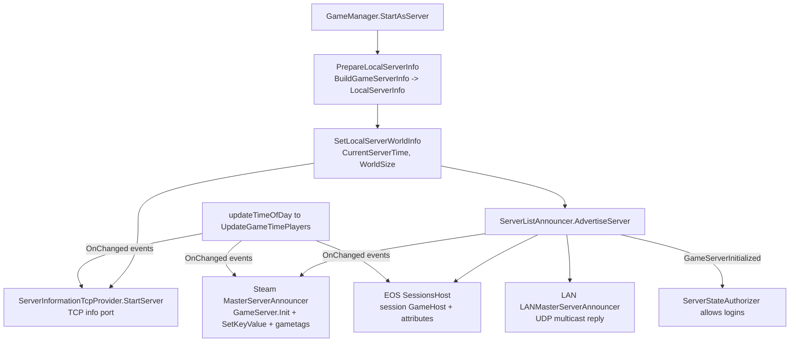
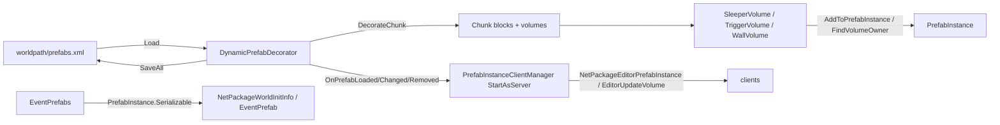

# Server advertisement + prefab instance data (dedicated V3.1.0)

**Owns:** the server-info data layer a dedicated server publishes (`GameServerInfo`,
`ConnectionManager.LocalServerInfo`, the Steam/EOS/LAN announcers, the TCP info
port) and the runtime prefab-instance layer (`PrefabInstance`,
`DynamicPrefabDecorator` load/decorate/save, `PrefabInsideDataFile`,
`PrefabVolumes.PrefabVolumeListAbs` world copy-in, `PrefabInstanceClientManager`
server-to-client sync).
**Not:** the client server browser (`ServerListManager`, `ServerInfoCache`,
`Platform.*.MasterServerList` / `SessionsClient` / `LANServerList`,
`ServerInformationTcpClient`; documented here only as far as needed to name the
consumers, see section 5); RWG-time prefab placement and the `PrefabVolumes`
authoring model ([`world-generation.md`](world-generation.md)); chunk lifecycle
([`world-chunks.md`](world-chunks.md)); EOS/Steam auth handshakes
([`platform-auth.md`](platform-auth.md)).
**Evidence:** `GameServerInfo`, `ServerInformationTcpProvider`,
`Platform.Steam.MasterServerAnnouncer`, `Platform.EOS.SessionsHost`,
`Platform.LAN.LANMasterServerAnnouncer`, `DynamicPrefabDecorator`,
`PrefabInstance` (+ nested `Serializable`), `PrefabInsideDataFile`,
`PrefabInstanceClientManager`, `PrefabVolumes.PrefabVolumeListAbs` IL; dump
locally with `tools/src/DumpMethod` (git-ignored). **Hub:** [`INDEX.md`](INDEX.md).
**Method:** [`re-methodology.md`](re-methodology.md).

Two data layers that were reached but undocumented: what a dedicated server
tells the world about itself, and how POI/prefab instances live inside the
running world. Both sit on the dedicated hot path (`GameManager.StartAsServer`
and chunk decoration respectively).

---

## 1. `GameServerInfo`: the typed server-info store

`GameServerInfo` is a three-map key-value store keyed by enums:
`GameInfoString` (20 keys: `GameType`, `GameName`, `GameHost`,
`ServerDescription`, `ServerWebsiteURL`, `LevelName`, `GameMode`, `IP`,
`SteamID`, `ServerVersion`, `Platform`, `ServerLoginConfirmationText`, `Region`,
`Language`, `UniqueId`, `CombinedPrimaryId`, `CombinedNativeId`, `PlayGroup`,
`SandboxPreset`, `SandboxCode`), `GameInfoInt` (54 keys: ports, player counts,
and the whole sandbox ruleset from `GameDifficulty` through `JarRefund`) and
`GameInfoBool` (17 keys incl. `IsDedicated`, `IsPasswordProtected`,
`EACEnabled`, `SanctionsIgnored`, `StockSettings`, `StockFiles`,
`ModdedConfig`, `RequiresMod`, `AllowCrossplay`, `BiomeProgression`).

`SetValue` fires `OnChangedString/Int/Bool` plus `OnChangedAny` events; every
publisher below subscribes to those, so a single `SetValue` on the live
`LocalServerInfo` propagates to Steam, EOS and the TCP info port without any
polling of `GamePrefs`.

Three static arrays in the cctor define what is machine-searchable:

| Array | Count | Members (decoded from the init blob) |
|---|---|---|
| `SearchableStringInfos` | 10 | LevelName, GameHost, SteamID, Region, Language, UniqueId, CombinedNativeId, ServerVersion, PlayGroup, SandboxCode |
| `IntInfosInGameTags` | 45 | Port, CurrentPlayers, MaxPlayers, FreePlayerSlots, CurrentServerTime, WorldSize plus the full sandbox-int ruleset (day length, blood moon block, zombie speeds, land claim block, loot, XP, storms, AI smell, jar refund, ...) |
| `BoolInfosInGameTags` | 13 | IsDedicated, ShowFriendPlayerOnMap, BuildCreate, StockSettings, ModdedConfig, RequiresMod, AirDropMarker, EnemySpawnMode, IsPasswordProtected, AllowCrossplay, EACEnabled, SanctionsIgnored, BiomeProgression |

### 1.1 Building the local server info

`GameServerInfo.BuildGameServerInfo` (520 IL) maps `GamePrefs` onto the store.
Dedicated-relevant decisions, all read straight from the IL:

- **Crossplay validation:** on a dedicated server with `ServerAllowCrossplay`
  set, the build refuses crossplay when `ServerMaxPlayerCount > 8`
  (`CROSSPLAY INCOMPATIBLE VALUE: PLAYER COUNT GREATER THAN MAX OF {0}`) or when
  `IgnoreEOSSanctions` is on, and force-resets the pref
  (`CROSSPLAY DISABLED FOR SESSION, ...`). `AllowCrossplay` additionally
  requires `PermissionsManager.IsCrossplayAllowed()`.
- **Identity:** `GameType` is hardcoded `7DTD`; `GameHost` is `ServerName` (pref
  21) on dedicated, `PlayerName` on hosts; `LevelName` is `GameWorld` (or the
  loaded prefab name in prefab-edit mode); `ServerVersion` from
  `Constants.cVersionInformation`.
- **EAC flag:** `EACEnabled` reads pref `EACEnabled` (109) on dedicated,
  `ServerEACPeerToPeer` (28) on P2P hosts. `SanctionsIgnored` reads
  `IgnoreEOSSanctions` (dedicated only, otherwise false).
- **Stock detection:** `StockFiles = StockFileHashes.HasStockXMLs()`;
  `ModdedConfig` is true when XMLs are not stock or `ModManager
  .AnyConfigModActive()`; `StockSettings` is true only for a non-custom,
  non-modded, non-user `SandboxOptionPreset`.
- **Visibility:** `ServerVisibility` (GameInfoInt 43) is pref 169 gated by
  `PermissionsManager.IsMultiplayerAllowed()`, else 0.
- **Sandbox block:** every gameplay pref (difficulty, day/night, blood moon,
  zombies, land claims, loot, drop-on-death, XP, storm frequency, AI smell,
  jar refund, `SandboxPreset`/`SandboxCode` strings) is copied verbatim; this
  is what the browser shows as "server rules".

`PrepareLocalServerInfo` stores the result in
`ConnectionManager.LocalServerInfo`. `SetLocalServerWorldInfo` later adds
`CurrentServerTime = World.worldTime` and `WorldSize` from
`World.GetWorldExtent`. During play, `GameManager.updateTimeOfDay` calls
`UpdateGameTimePlayers(worldTime, playerCount)` which refreshes
`CurrentServerTime`, `CurrentPlayers` and `FreePlayerSlots`, and those
`SetValue`s ripple through the change events to all publishers.

---

## 2. Advertisement pipeline (dedicated side)

`GameManager.StartAsServer` (coroutine `<StartAsServer>d__166`) drives the
order: `PrepareLocalServerInfo` early, then after the world is up
`SetLocalServerWorldInfo` + `NetPackageWorldInfo.PrepareWorldHashes`, then
`ServerInformationTcpProvider.StartServer()` and finally
`IPlatform.ServerListAnnouncer.AdvertiseServer(callback)`.
`Platform.MultiPlatform.ServerListAnnouncer` fans the call out to every
platform announcer. `ServerStateAuthorizer.Authorize` (login pipeline, see
[`platform-auth.md`](platform-auth.md)) rejects joiners until
`IMasterServerAnnouncer.GameServerInitialized` is true, so advertisement
completion literally gates logins.

### 2.1 Steam (`Platform.Steam.MasterServerAnnouncer`)

`RegisterGame` (coroutine) calls
`Steamworks.GameServer.Init(IPAddress.Any, gamePort, queryPort, eServerMode=2,
Constants.SteamVersionNr)`; both the game port and the query port are
`GameInfoInt.Port`, i.e. the query listener shares the game port number. It
then sets `SetDedicatedServer`, `SetModDir("7DTD")`, `SetProduct("7DTD")`,
`SetGameDescription("7 Days To Die")`, max players, password flag, map name
(`LevelName`), server name, calls `LogOnAnonymous()` and, only when
`ServerVisibility == 2`, `SetAdvertiseServerActive(true)`
(`[Steamworks.NET] Making server public`).

Per-key changes are pushed by `OnChanged` handlers: strings/ints/bools each
become `SteamGameServer.SetKeyValue(name, value)` (the browser's rules query),
`LevelName` also updates `SetMapName`. The compact "gametags" field is rebuilt
on a `CountdownTimer` inside `Update()` (which also pumps
`GameServer.RunCallbacks()` and warns when a tick exceeds 25 ms):

`Platform.NetworkUtils.BuildGameTags` serializes all 45 `IntInfosInGameTags`
as 7-bit-encoded signed ints in array order, then packs the 13
`BoolInfosInGameTags` LSB-first into bit-bytes, and Base64-encodes the buffer.
That Base64 string is the entire Steam `gametags` value; the client side
(`ParseGameTags`) reverses it, which is how the browser filters on sandbox
settings without a rules query per server.

### 2.2 EOS (`Platform.EOS.SessionsHost`)

`AdvertiseServer` creates one named session `"GameHost"`:

- `BucketId = GamePrefs.ServerMatchmakingGroup` (pref 272) if set on a
  dedicated server, else `"<WeDontCare>"` (clients in the `CertQA` matchmaking
  group get their own bucket).
- `MaxPlayers` from `GameInfoInt.MaxPlayers`;
  `SanctionsEnabled = IAntiCheatServer.ServerEacEnabled()`;
  `AllowedPlatformIds` from the current `EPlayGroup` (crossplay set);
  `PresenceEnabled = false`, join-in-progress on, invites off.
- `PermissionLevel` from `ServerVisibility`: 2 maps to `PublicAdvertised`,
  1 (friends) and everything else map to `JoinViaPresence`.
- `CombinedPrimaryId` is set to the EOS ProductUserId and `CombinedNativeId`
  to the native platform id before attributes are written, so the browser can
  address both identity domains ([`platform-auth.md`](platform-auth.md)).

`setBaseAttributes` publishes every `IntInfosInGameTags` entry as a named EOS
session attribute, all bools as one string attribute of the form
`,Name=0,Name=1,...` (`getBoolsString`), and every `SearchableStringInfos`
entry as a string attribute. `updateSessionString/Int/Bool` hook the
`OnChanged` events, re-checking `GameServerInfo.IsSearchable` and batching
changes into an update `SessionModification` that `Update()` commits on a
`CountdownTimer` (attribute names ending in `ID` shorten the timeout).
`AuthServer` calls `RegisterUser`/`UnregisterUser` per authenticated client so
EOS tracks real occupancy. Note: `SessionsClient.matchesFilters` (client-side
re-filtering of `GameServerInfo` against browse filters) exists only in the
experimental build and shipped in V3.1.0 b14. In
stable, filtering is purely server-side via EOS attribute comparisons
(`setSearchParameters`).

### 2.3 LAN (`Platform.LAN.LANMasterServerAnnouncer`)

Joins a UDP multicast group and runs `LANServerListReplyTask`; `SendReply`
answers a browsing client's probe with a small datagram carrying the info port
(from `GameInfoInt.Port`). A `LANServerCacheControl` rate-limits replies per
client. The client's `LANServerList` then fetches full details over TCP
(section 2.4).

### 2.4 TCP info port (`ServerInformationTcpProvider`)

A raw `TcpListener` on `IPAddress.Any:ServerPort` (pref 18; the game itself is
UDP/LiteNetLib on the same number, so TCP on that port is free). Every accepted
connection immediately receives `LocalServerInfo.ToString(true)` as UTF-8 and
is closed (50 ms send timeout, linger enabled). The serialized form is, per
entry, `Name` + `:` + value + `;` + CRLF for all strings, then ints, then
bools; the result is cached and invalidated via `OnChangedAny`. The response
buffer is 32768 bytes; oversize info logs
`Server info size ({0}) exceeds buffer size ({1}), probably due to
ServerDescription and/or ServerLoginConfirmationText` and sends nothing.
`ProtocolManager.GetGamePortsString` reports this listener as `"<port>/TCP"`.
This is the same string format `GameServerInfo.BuildInfoFromString` parses on
the client (`ServerInformationTcpClient.RequestRules`), and it is also what
the web dashboard's API mirrors from prefs ([`webserver.md`](webserver.md)).

---

## 3. Prefab instances at runtime

### 3.1 `PrefabInstance`: one placed POI

A `PrefabInstance` is one placement of a `Prefab` in the world: fields `id`
(decorator-assigned, monotonic), `name`, `location` (`AbstractedLocation` of
the prefab asset), `prefab`, `boundingBoxPosition`/`boundingBoxSize`, `rotation`
(byte, quarter turns), copy bookkeeping (`bPrefabCopiedIntoWorld`,
`lastCopiedPrefabPosition`, `lastCopiedRotation`), plus live lists
`sleeperVolumes`, `triggerVolumes`, `wallVolumes` and `entityInstanceIds`.
Nested `PrefabInstance.Serializable` is the 17+name-byte wire struct
`int32 id, string prefabName, Vector3i position, byte rotation`
(read/written with `PooledBinaryReader/Writer`).

### 3.2 `DynamicPrefabDecorator`: load, decorate, save

Owned per world; created by the chunk providers
(`ChunkProviderGenerateWorld` / `ChunkProviderDisc` / `GenerateFlat` `Init`).

**Load** (`Load(path, skipBlockData)` coroutine) parses `<worldpath>/prefabs.xml`:
each `<decoration name position rotation y_is_groundlevel>` resolves through
`PrefabCache.GetPrefabRotated(name, rotation, ...)`; `y_is_groundlevel` adds
`Prefab.yOffset` to y; trader prefabs additionally register a `TraderArea`
(protect box + teleport volumes). Every decoration becomes
`new PrefabInstance(id++, prefab.location, pos, rotation, prefab, 0)` and
`AddWorldPrefab(pi, prefab.HasQuestTag())`, then `SortPrefabs()`. This is the
runtime consumer of the `prefabs.xml` that RWG wrote at world-create time

`PrefabCache.GetPrefab(name, applyMapping, fixChildblocks, allowMissingBlocks,
skipBlockData)` (IL=47) is the lock-guarded load-or-cache: a hit returns the
cached `Prefab`, otherwise `new Prefab().Load(...)` and the result is cached
(null on load failure). `GetPrefabRotated(name, rotation, ...)` (IL=79)
masks `rotation &= 3` and caches a `Prefab[4]` per name: a live slot returns
directly; otherwise the base prefab is loaded once and rotations > 0 get a
`Clone(true)` + `RotateY(true, rotation)` into their slot. The
`fixChildblocks` argument is computed as `fixChildblocks && (slotArray ==
null)` — the array is always non-null at that point, so the flag never reaches
`GetPrefab` in this build (effectively dead).
([`world-generation.md`](world-generation.md)).

**Decorate** (`DecorateChunk`, called from
`ChunkProviderGenerateWorld.GenerateSingleChunk`): collects
`GetPrefabsAtXZ` for the chunk footprint, sorts by size, and for each
overlapping instance calls `PrefabInstance.CopyIntoChunk`, which stamps blocks
(`Prefab.CopyBlocksIntoChunkNoEntities`), spawns entity stubs, and copies the
prefab's authored volumes into the live world:
`PrefabVolumeListAbs<TList,TVolume>.CopyVolumesIntoWorldCommon` creates or
finds the world-side `SleeperVolume` / `TriggerVolume` / `WallVolume` for each
used entry and registers it with every chunk it spans (`AddWorldVolume`). The
world-side volumes link back via `AddToPrefabInstance` ->
`DynamicPrefabDecorator.FindVolumeOwner(EVolumeType, mins, maxs)`, which is how
a sleeper volume knows its owning POI.

`CopyVolumesIntoWorldCommon(world, chunk, offset, padding)` (IL=208): with a
chunk argument the volume's padded world bounds
(`start + offset - padding` .. `start + size + offset + padding`) must overlap
the chunk span (`chunk.GetWorldPos()` .. + (16, 256, 16)) or the entry is
skipped; in sandbox trader mode (`World.SandboxUseTraderArea`) volume types 1
and 3 are skipped outright. Each used entry resolves `FindWorldVolume(world,
wStart, wEnd)` and, on a miss, `CreateWorldVolume`; the resulting index is
registered via `AddWorldVolume` — on the single chunk when one was passed,
otherwise by walking the spanned chunk range
(`toChunkXZ(pMin.x)` .. `toChunkXZ(pMax.x - 1)`, z likewise).

**Save** (`Save(path)`, called from the chunk providers' `SaveAll`): rewrites
`prefabs.xml` as `<prefabs><decoration type="model" name position rotation
y_is_groundlevel="true"/></prefabs>`. So dynamically added prefabs (world
editor, event prefabs promoted to world prefabs) persist through the same XML
that world generation produced; there is no separate binary store for
instances.

**Reset:** `World.ResetPOIS` -> `PrefabInstance.ResetBlocksAndRebuild`
(copy-chunk/regenerate-chunk local functions) restores a POI to its prefab
state; reached from `QuestEventManager.QuestLockPOI`,
`GameEvent...ActionPOIReset` and `ConsoleCmdChunkReset`
([`quests-challenges.md`](quests-challenges.md),
[`console-commands.md`](console-commands.md)).

### 3.3 `PrefabInsideDataFile`: the `.ins` sidecar

A bit-set marking which prefab-local positions are "inside" the building
(index **`x + y*size.x + z*size.x*size.y`**, one bit each, allocated lazily; both
`Add` and `Contains` compute it that way, so y is the middle stride, not z).
Loaded by `Prefab.loadBlockData` from `<prefab>.ins` next to the block data and
queried by `Prefab.IsInsidePrefab`; `Prefab.RecalcInsideDevices` regenerates
it, `saveBlockData` writes it back. On-disk format: version byte (current 2),
`int32` count, then version 1 stores byte triplets `x,y,z` per inside position
while version 2 stores the raw bit array (count = bit count). A mismatched
length logs `Probably outdated ins file, please re-save to fix`. The dedicated
server consumes this for AI/stealth "inside" checks; it never writes it during
normal serving.

### 3.4 `PrefabInstanceClientManager`: server-to-client sync

Despite the name this is a **server-side** manager (the name means "manages
prefab instances *for* clients"). `GameManager.createWorld` calls
`StartAsServer()` when `ConnectionManager.IsServer`, else `StartAsClient()`
(which only clears `clientPrefabs`, so it is near-inert but not literally empty).
`StartAsServer` subscribes to `DynamicPrefabDecorator`
`OnPrefabLoaded/Changed/Removed`, `PrefabEditModeManager.OnPrefabChanged` and
`GameManager.OnClientSpawned`:

- On client spawn, `sendAllPrefabs` walks `GetWorldPrefabs` (the dynamic
  world-prefab list, not the full POI list; joining clients get POIs from
  chunk data instead) and sends one `NetPackageEditorPrefabInstance`
  (`EChangeType.Added`) per instance, followed by
  `PrefabVolumeListAbs.SendAllVolumesToClient` which emits one
  `NetPackageEditorUpdateVolume` per authored volume.
- Decorator events map to `NetPackageEditorPrefabInstance` with
  `Added`/`Changed`/`Removed`, broadcast via `ConnectionManager.SendPackage`.

On the client, `PrefabLoadedClient/PrefabChangedClient(id, bbPos, bbSize,
name, prefabSize, filename, rotation, yOffset)` and `PrefabRemovedClient(id)`
(invoked by `NetPackageEditorPrefabInstance.ProcessPackage`) mirror the
instance list; `GetPrefabInstance` answers from the decorator on the server and
the mirrored list on clients.

Separately, the game-events system serializes prefab instances with
`PrefabInstance.Serializable`: `NetPackageWorldInitInfoRequest` (client join)
is answered with `NetPackageWorldInitInfo` carrying
`EventPrefabs.GetPrefabsSerialized()` plus wall volumes, and
`NetPackageEventPrefab` ships single event-prefab placements
([`game-events.md`](game-events.md), [`protocol-packages.md`](protocol-packages.md)).

**EventPrefabs persistence + placement.** `TryPlaceAt(prefabName, rotation,
position, yIsGroundLevel)` (IL=122) resolves the rotated prefab
(`GetPrefabRotated`, missing -> `[EventPrefabs] cannot place <name>, prefab not
found` and null), folds `position.y += prefab.yOffset` when
`yIsGroundLevel`, builds `new PrefabInstance(dpd.GetNextId(), prefab.location,
position, rotation, prefab, 0)`, then requires
`rfm.TryResetChunks(pi.GetOccupiedChunks(), -1)` to succeed (failure logs
`[EventPrefabs] cannot place {0} at ({1}), {2}. Chunks could not be reset,
protection level: {3}` and returns null), clears `DecoManager`
deco objects over the bounding box, and registers the instance
(`dpd.AddEventPrefab`, `prefabs.Add`, `rfm.AddGroupedChunks`), broadcasting a
`NetPackageEventPrefab` (operation 0) and setting `needsSaving`. `Load()`
(IL=125) reads `<save>/eventprefabs.dat` (missing -> no-op): version + count
int32s, then per entry `prefabName` (string), position (`StreamUtils.ReadVector3i`),
rotation (byte), each rebuilt through `GetNextId()` and re-registered with
`DecoManager`/`AddEventPrefab`/`AddGroupedChunks`. `Save(waitForComplete)`
(IL=70) is `needsSaving`-gated and writes version **1**, the count, and per
instance `prefabName` + `boundingBoxPosition` + rotation via the pooled
writer, handed to the `ThreadedFileWriterQueue.saveWriter`.

`NetPackageEventPrefab` (Setup IL=9) carries `operation` (byte) plus
`serializablePi = new PrefabInstance.Serializable(pi)`; `write`/`read`
(IL=13/9) emit the operation byte and the serializable, `GetLength` (IL=6) is
`1 + serializablePi.GetLength()`. `ProcessPackage` (IL=48) is client-only and
gated on `GameManager.worldInitInfoReceived`: operation 0 routes to
`EventPrefabsClient.TryAdd(id, name, rotation, pos)`, operation 1 to
`EventPrefabsClient.Remove(...)`.

`PrefabInstance.Serializable` is the wire snapshot (ctor IL=18 / 17): `id`
(int32), `prefabName` (string), `position` = `boundingBoxPosition`
(`StreamUtils` Vector3i), `rotation` (byte); `GetLength` (IL=11) is
`17 + prefabName.Length` (4 + 4 + 12 + 1 fixed bytes).

---

## 4. What runs where

| Type | Dedicated server | Client |
|---|---|---|
| `GameServerInfo` | builds/owns `LocalServerInfo`, publishes changes | parses browse results (`BuildInfoFromString`, `Merge`) |
| `ServerInformationTcpProvider` | yes (TCP info port) | no |
| `Platform.Steam.MasterServerAnnouncer`, `Platform.EOS.SessionsHost`, `Platform.LAN.LANMasterServerAnnouncer` | yes (advertisement) | no |
| `ServerListManager`, `ServerInfoCache`, `Platform.Steam.MasterServerList`, `Platform.EOS.SessionsClient`, `Platform.LAN.LANServerList`, `ServerInformationTcpClient` | **no (client browser only)** | yes |
| `DynamicPrefabDecorator`, `PrefabInstance`, `PrefabInsideDataFile` | yes (world load, decoration, save) | partial (SP/hosted worlds) |
| `PrefabInstanceClientManager` | yes (`StartAsServer` sync source) | receive-only handlers |
| `PrefabVolumes.PrefabVolumeListAbs` | yes (volume copy-in + editor sync) | receive side of `NetPackageEditorUpdateVolume` |

## 5. Client-browser-only surface (out of dedicated scope)

For completeness, the browse stack that never runs on a dedicated server:
`ServerListManager` (singleton used solely by `XUiC_ServerBrowser` /
`XUiC_ServerFilters`, plus `DiscordManager.Init`) aggregates the per-platform
`IServerListInterface` implementations and pushes
`IServerListInterface.ServerFilter` lists (`EServerFilterType`: Any, BoolValue,
IntValue, IntNotValue, IntMin, IntMax, IntRange, StringValue, StringContains)
into each backend (`EServerRelationType`: Internet, LAN, Friends, Favorites,
History, Spectator). `ServerInfoCache` persists the client's favorites/history
and saved server passwords keyed by `GameHost:Port`; its consumers are
`NetworkClient*::Connect`, invite handling and the browser UI. None of these
types are reachable from dedicated entry points, so the dedicated-relevant
surface is exactly sections 1 and 2.

---

## Related docs

| Doc | Role |
|---|---|
| [platform-auth.md](platform-auth.md) | EOS/Steam identity, AuthServer, login authorizers around `GameServerInitialized` |
| [server-lifecycle.md](server-lifecycle.md) | `StartAsServer` / `startGameCo` ordering that hosts this pipeline |
| [world-generation.md](world-generation.md) | Writes `prefabs.xml`; authors the `PrefabVolumes` model consumed here |
| [world-chunks.md](world-chunks.md) | Chunk lifecycle around `DecorateChunk` |
| [webserver.md](webserver.md) | HTTP admin surface that mirrors server prefs |
| this doc § EOS filters / [server-lifecycle.md](server-lifecycle.md) | `SessionsClient.matchesFilters` (client browse filter; not a dedicated sim path) |
| [game-events.md](game-events.md) | `EventPrefabs` consumers of `PrefabInstance.Serializable` |
| [protocol-packages.md](protocol-packages.md) | NetPackage inventory incl. the editor/world-init packages |

## Changelog

- **2026-07-24:** Initial reversal: `GameServerInfo` store + searchable arrays,
  Steam/EOS/LAN advertisement, gametags encoding, TCP info port, and the
  runtime prefab-instance layer (`DynamicPrefabDecorator` load/decorate/save,
  `.ins` format, `PrefabInstance.Serializable`, server-side
  `PrefabInstanceClientManager` sync). Marked the browse stack client-only.
