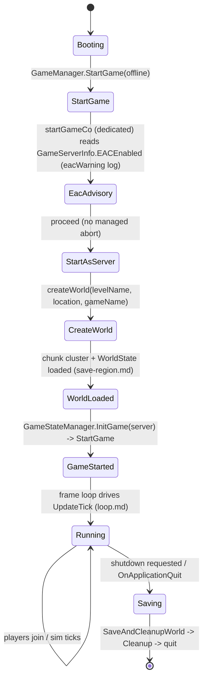
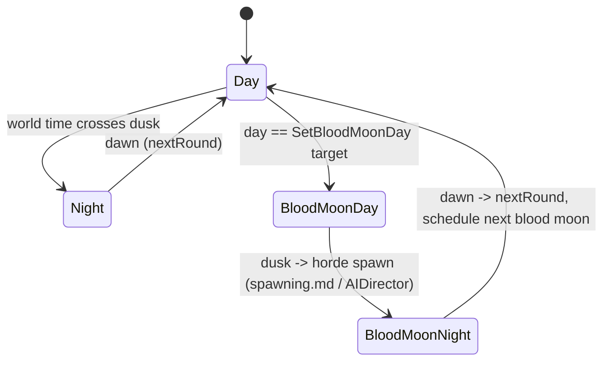
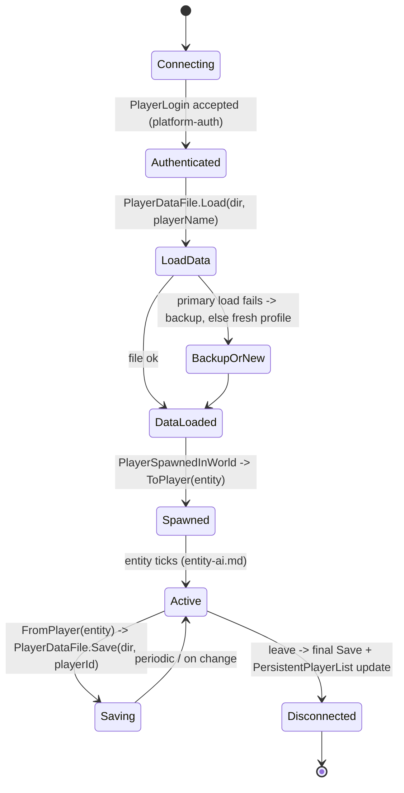
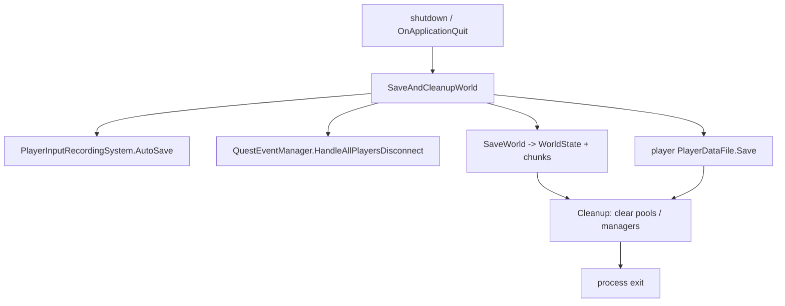

# Server lifecycle, game state, and player persistence (dedicated V3.0.1)

**Owns:** the dedicated process lifecycle (boot -> world create/load -> run ->
save + shutdown), the `GameStateManager` game-mode/round tick, and player
persistence (`PlayerDataFile`, `PersistentPlayerList`, land claims).
**Not:** the per-frame sim ([loop.md](loop.md)); world/chunk save byte format
([save-region.md](save-region.md)); the join wire handshake ([protocol.md](protocol.md)).
**Evidence:** `GameManager` (boot/save methods), `GameStateManager`,
`PersistentPlayerList`, `PlayerDataFile` IL (dump locally with `tools/src/DumpMethod`,
git-ignored). **Hub:** [`INDEX.md`](INDEX.md). **Method:** [`re-methodology.md`](re-methodology.md).

This is the outermost dedicated codepath: everything else runs between boot and
shutdown.

---

## 1. Boot sequence (state machine)

`GameManager.StartGame(offline)` kicks a coroutine `startGameCo` (the boot state
machine `startGameCo>d__138`, IL=378), which on a dedicated server reads
`GameServerInfo.EACEnabled` (logging an `eacWarning` advisory), then routes through
`StartAsServer` to create or load the world and mark the game started; from there
the frame loop ([loop.md](loop.md)) drives everything.

There is **no integrity-violation abort on the dedicated boot path** in managed IL.
The `eacIntegrityViolation` / `eacUnableToPlayOnProtected` strings exist only inside
`GameManager.gmUpdate` (IL_026E/IL_029E), in the **client-only** UI block that is
skipped on a dedicated server (guarded by `IsDedicatedServer` at IL_01F0). EAC on a
dedicated server is the native anticheat plus the `EACEnabled` advisory, not a
managed startup gate.

`IsStartingGame` / `waitForGameStart` gate work until the world is ready;
`OnWorldChanged` fires when the world (re)loads. `get_World()` returning non-null
is the readiness signal other systems (e.g. the web server, [webserver.md](webserver.md))
check.

---

## 2. Game state and rounds (`GameStateManager`)

`GameStateManager` owns the game mode and the day/blood-moon progression.
`InitGame(bServer)` sets up the mode; `OnUpdateTick` advances round state from the
world clock; `nextRound` / `SetBloodMoonDay` drive the horde schedule.

`GetGameMode` / `GetModeName` expose the active mode (`GameModeSurvivalMP` on a
normal dedicated server; other `GameModeAbstract` subclasses exist for
creative/edit). `IsGameStarted` gates the tick.

### 2.1 Game modes (registry)

Game modes are a thin registry, not a state machine: `GameMode` (base) keeps a
name/id dictionary (`InitGameModeDict`, `GetGameModeForId`/`GetGameModeForName`),
and each concrete mode is a `GameModeAbstract` subclass whose `Init` (and
`ResetGamePrefs`) configures the `GamePrefs` (feature switches) for that mode.

| Mode | Role |
|---|---|
| `GameModeSurvivalMP` | Default dedicated survival (multiplayer) |
| `GameModeSurvivalSP` / `GameModeSurvival` | Single-player / base survival |
| `GameModeSurvivalPvP` | PvP ruleset |
| `GameModeCreative` | Creative (no survival constraints) |
| `GameModeEditWorld` | World editor |
| `GameModeDeathmatch` / `GameModeZombieHorde` | Special rulesets |

The mode does not drive per-tick logic itself; it sets the prefs that the rest of
the systems (spawning, buffs, save, etc.) read. So "what a mode does" is almost
entirely the `GamePrefs` it applies in `Init`.

---

## 3. Player join and persistence (state machine)

A joining client (after the wire handshake, [protocol.md](protocol.md) §5) is
spawned by `GameManager.PlayerSpawnedInWorld(cInfo, respawnReason, pos, entityId)`.
Player state lives in a per-player `PlayerDataFile` on disk; `PersistentPlayerList`
is the cross-session registry (identity, allies, land claims).

- **`PlayerDataFile`**: `Write`/`Read` serialize the full profile (inventory,
  stats, progression, waypoints); `ToPlayer`/`FromPlayer` sync between the file and
  the live `EntityPlayer`; `Load` falls back to a **backup** file if the primary is
  corrupt ("Loading backup player data"). Network variants (`WriteNetwork`/
  `ReadNetwork`) send profile data over the wire.
- **`PersistentPlayerList`**: maps platform identity / entity id to
  `PersistentPlayerData`; owns **land claims** (`PlaceLandProtectionBlock`,
  `RemoveLandProtectionBlock`, `GetLandProtectionBlockOwner`, `RemoveExtraLandClaims`)
  and ally relationships; dispatches player events. It is written into the world
  save and sent to clients in `WorldInfo` (see [protocol-packages.md](protocol-packages.md) §4.2).

---

## 4. Shutdown and save

`SaveAndCleanupWorld` (the graceful path, also reached from `OnApplicationQuit` via
`ApplicationQuitCo`) auto-saves recordings, disconnects quest state
(`QuestEventManager.HandleAllPlayersDisconnect`), writes the world
([save-region.md](save-region.md)) and player data, then `Cleanup` clears pools and
managers.

---

## 5. Dedicated relevance and residuals

- **Core dedicated path:** boot, game-state tick, player persistence, and save all
  run on the headless server every session.
- **Residual:** EAC integrity verification (native anticheat, not a managed boot
  gate; see [platform-auth.md](platform-auth.md)); the save byte codec detail
  ([save-region.md](save-region.md)); XML game-mode/content config.

---

## Related docs

| Doc | Role |
|---|---|
| [loop.md](loop.md) | The frame/sim loop that runs during "Running" |
| [save-region.md](save-region.md) | World/chunk save byte format |
| [protocol.md](protocol.md) | Join handshake that precedes PlayerSpawnedInWorld |
| [spawning.md](spawning.md) | Horde spawns driven by the blood-moon round |
| [full-surface.md](full-surface.md) | Whole-assembly map |

## Changelog

- **2026-07-23:** Initial server lifecycle / game-state / player-persistence reversal (boot, rounds, join+persistence, shutdown) with state machines.
