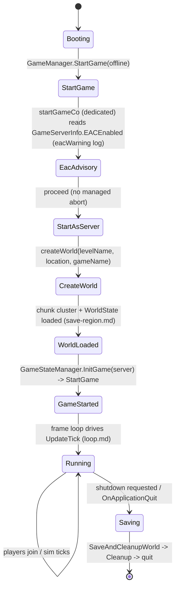
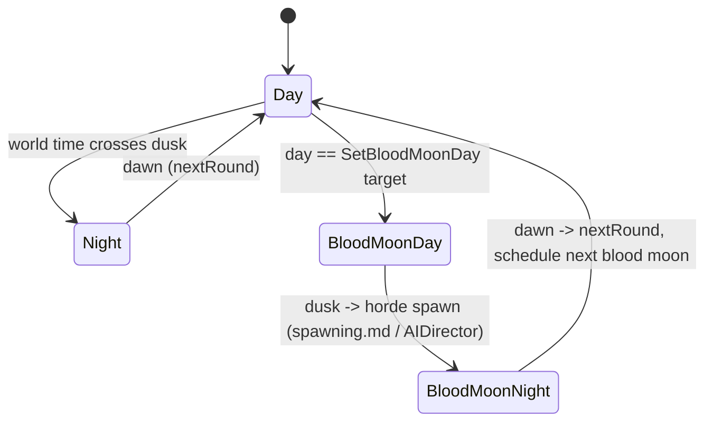
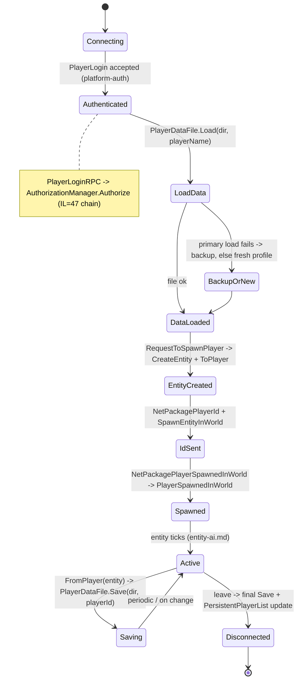
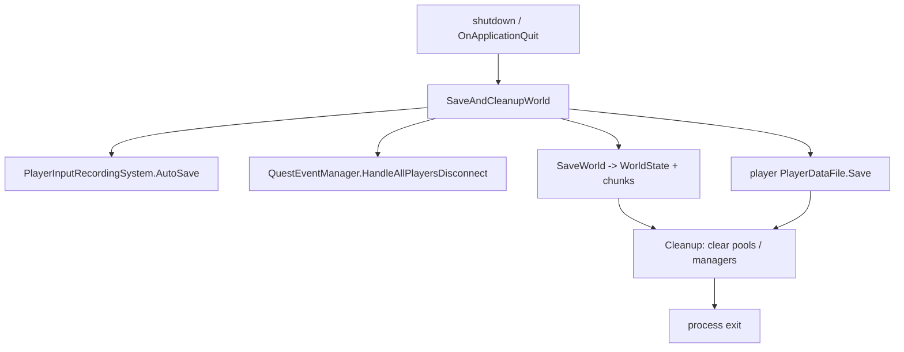

# Server lifecycle, game state, and player persistence (dedicated V3.1.0)

**Owns:** the dedicated process lifecycle (boot -> world create/load -> run ->
save + shutdown), the `GameStateManager` game-mode/round tick, and player
persistence (`PlayerDataFile`, `PersistentPlayerList`, land claims).
**Not:** the per-frame sim ([loop.md](loop.md)); world/chunk save byte format
([save-region.md](save-region.md)); the join wire handshake ([protocol.md](protocol.md)).
**Evidence:** `GameManager` (boot/save methods), `GameStateManager`,
`PersistentPlayerList`, `PlayerDataFile` IL (dump locally with `tools/src/DumpMethod`,
git-ignored). **Hub:** [`INDEX.md`](INDEX.md). **Method:** [`re-methodology.md`](re-methodology.md).

This is the outermost dedicated codepath: everything else runs between boot and
shutdown.

---

## 1. Boot sequence (state machine)

**`GameEntrypoint.FirstFrameInit()` (IL=65)** runs before `StartGame`:
cursor off, main-thread ref, `PlatformOptimizations.Init`;
`HasPrefCollisions()` (IL=53: any `EnumGamePrefs` name that also exists as a
`LaunchPref` → "Name collision between LaunchPref ... and GamePref ..." error
+ abort); `GamePrefs.InitPropertyDeclarations()` and
`GameStartupHelper.InitCommandLine()` (IL=85: version banner +
`PrintSystemInfo` + UTC-offset log, `Utils.InitStatic`, `LaunchPrefs.InitStart`,
`parsedGamePrefs = new`, `ParseCommandLine(args)`, `LaunchPrefs.InitEnd`;
abort on failure); `RunAutomation`
launch pref → `AutomationRunner.InitialiseLogging`; `UserDataFolder` →
`GameIO.InitializeUserDataPaths`; `PlatformApplicationManager.Init` /
`PlatformManager.Init` (abort on failure); `Services.ServiceProvider.Init`
(+ analytics `IAnalyticsService` registered/started, log level from the
`analyticsLogLevel` launch arg); `Application.targetFrameRate = (int)
Application.GetCurrentRefreshRate().value`. Then the `GameStartupHelper`
boot/config chain ([dedicated-misc-systems.md](dedicated-misc-systems.md))
and `GameManager.StartGame(offline)` below.

`GameManager.StartGame(offline)` kicks a coroutine `startGameCo` (the boot state
machine `startGameCo>d__138`, IL=378), which on a dedicated server reads
`GameServerInfo.EACEnabled` (logging an `eacWarning` advisory), then routes through
`StartAsServer` to create or load the world and mark the game started; from there
the frame loop ([loop.md](loop.md)) drives everything.

There is **no integrity-violation abort on the dedicated boot path** in managed IL.
The `eacIntegrityViolation` / `eacUnableToPlayOnProtected` strings exist only inside
`GameManager.gmUpdate` (IL_026E/IL_029E), in the **client-only** UI block that is
skipped on a dedicated server (guarded by `IsDedicatedServer` at IL_01F0). EAC on a
dedicated server is the native anticheat plus the `EACEnabled` advisory, not a
managed startup gate.



`IsStartingGame` / `waitForGameStart` gate work until the world is ready;
`OnWorldChanged` fires when the world (re)loads. `get_World()` returning non-null
is the readiness signal other systems (e.g. the web server, [webserver.md](webserver.md))
check.

---

## 2. Game state and rounds (`GameStateManager`)

`GameStateManager` owns the game mode and the day/blood-moon progression.
`InitGame(bServer)` sets up the mode; `GameStateManager.OnUpdateTick` (**IL=198**,
server only) advances round state from GameStats (time/day/frag limit modes) and
the world clock; `nextRound` / `SetBloodMoonDay` drive the horde schedule.

**`OnUpdateTick` (IL=198) server gates:**

1. If GameStats bool **2** (time limit): once per second wall, decrement
   GameStats int **3**; when &lt; 0, `StartRound(nextRound)` and dirty.
2. If GameStats bool **4** (day limit): when `WorldTimeToDays &gt;
   GameStats[5]`, `StartRound(nextRound)`.
3. If GameStats bool **6** (frag limit): every **40** ticks scan players'
   `KilledPlayers` vs GameStats frag target → round advance residual.
4. Count living non-dead entities vs class limits residual; set dirty GameStats
   and if dirty broadcast `NetPackageGameStats` flags **192**.

**`nextRound` (IL=29):** `EndRound(GameStats[10])`; increment round index;
wrap to 0 if ≥ `GameMode.GetRoundCount()`; `GameStats.Set(10, round)`; dirty;
reset `timeRoundStarted`; return new round.

**`SetBloodMoonDay(day)` (IL=13):** if GameStats **58** differs, set it and
dirty.



`GetGameMode` / `GetModeName` expose the active mode (`GameModeSurvivalMP` on a
normal dedicated server; other `GameModeAbstract` subclasses exist for
creative/edit). `IsGameStarted` gates the tick.

### 2.1 Game modes (registry)

Game modes are a thin registry, not a state machine: `GameMode` (base) keeps a
name/id dictionary (`InitGameModeDict`, `GetGameModeForId`/`GetGameModeForName`),
and each concrete mode is a `GameModeAbstract` subclass whose `Init` (and
`ResetGamePrefs`) configures the `GamePrefs` (feature switches) for that mode.

| Mode | Role |
|---|---|
| `GameModeSurvivalMP` | Default dedicated survival (multiplayer) |
| `GameModeSurvivalSP` / `GameModeSurvival` | Single-player / base survival |
| `GameModeSurvivalPvP` | PvP ruleset |
| `GameModeCreative` | Creative (no survival constraints) |
| `GameModeEditWorld` | World editor |
| `GameModeDeathmatch` / `GameModeZombieHorde` | Special rulesets |

The mode does not drive per-tick logic itself; it sets the prefs that the rest of
the systems (spawning, buffs, save, etc.) read. So "what a mode does" is almost
entirely the `GamePrefs` it applies in `Init`.

**`ModeGamePref` leaf (GameMode/ModeGamePref, ctor IL=22):** a mode-scoped pref
record `{GamePref, ValueType, DefaultValue}`; the ctor prefers the
`Platform.DeviceFlag` **2** entry of the device-defaults dictionary when
present, else the plain default. Concrete modes use these to re-scope a pref
per mode (`ResetGamePrefs`).

**`GameStateManager.InitGame(bServer)` (IL=50):** `GameStats.Set(GameState,
Running)`; mode type from `GamePrefs.GetString(29)` (falling back to the pref
default when the string does not resolve), `currentGameMode =
(GameMode)Activator.CreateInstance(type)`; `GameStats.Set(GameModeId,
mode.GetID())`. Server only: `GameStats.Set(CurrentRoundIx, 0)`,
`timeRoundStarted = Time.time`, `mode.Init()`, `mode.StartRound(roundIx)`,
`bDirty = true` (next tick broadcasts GameStats, see §2).

**`GameMode.StartRound(idx)`:** the survival/creative/edit modes (IL=4 each) are
just `GameStats.Set(GameState, Running)`. `Deathmatch` (IL=62) and
`ZombieHorde` (IL=53) are 4-state switches on the round index (time/frag-limit
setup, `CurrentRoundIx`, `LoadScene` + `SceneGame`/loading-screen transitions).

**`GameModeAbstract.Init()` (IL=205):** the GameStats bootstrap - every
`GameStats.Set` copied from a `GamePrefs` (via `GetBool`/`GetInt`/`GetString`
per stat type, or a constant) so the mode's
`Init` pref switches take effect on the running server. Indexes resolve
via [inventories/gamestats-gameprefs.md](inventories/gamestats-gameprefs.md).

| GameStats | Seeded from |
|---|---|
| `24` IsSpawnEnemies | GamePrefs.GetInt(82) `EnemySpawnMode` |
| `23` PlayerKillingMode | GamePrefs.GetInt(52) `PlayerKillingMode` |
| `14` ShowAllPlayersOnMap | const 0 |
| `15` ShowFriendPlayerOnMap | GamePrefs.GetInt(65) `ShowFriendPlayerOnMap` |
| `27` IsResetMapOnRestart | const 0 |
| `20` IsFlyingEnabled | GamePrefs.GetInt(58) `BuildCreate` |
| `18` IsCreativeMenuEnabled | GamePrefs.GetInt(58) `BuildCreate` |
| `19` IsTeleportEnabled | const 0 |
| `21` IsPlayerDamageEnabled | const 1 |
| `22` IsPlayerCollisionEnabled | const 1 |
| `11` TimeOfDayIncPerSec | 24000 / (GamePrefs.GetInt(60) `DayNightLength` * 60) |
| `4` DayLimitActive | const 0 |
| `2` TimeLimitActive | const 0 |
| `6` FragLimitActive | const 0 |
| `37` GameDifficulty | GamePrefs.GetInt(30) `GameDifficulty` |
| `59` BlockDamagePlayer | GamePrefs.GetInt(84) `BlockDamagePlayer` |
| `60` XPMultiplier | GamePrefs.GetInt(111) `XPMultiplier` |
| `61` BloodMoonWarning | GamePrefs.GetInt(64) `BloodMoonWarning` |
| `42` DayLightLength | GamePrefs.GetInt(61) `DayLightLength` |
| `72` DayNightLength | GamePrefs.GetInt(60) `DayNightLength` |
| `73` BlockDamageAI | GamePrefs.GetInt(85) `BlockDamageAI` |
| `74` BlockDamageAIBM | GamePrefs.GetInt(86) `BlockDamageAIBM` |
| `75` LootAbundance | GamePrefs.GetInt(87) `LootAbundance` |
| `76` LootRespawnDays | GamePrefs.GetInt(88) `LootRespawnDays` |
| `77` GlobalGSModifier | const 100 |
| `78` BiomeGSModifier | const 100 |
| `79` GlobalLSModifier | const 100 |
| `80` BiomeLSModifier | const 100 |
| `51` AirDropFrequency | GamePrefs.GetInt(98) `AirDropFrequency` |
| `53` AirDropMarker | GamePrefs.GetInt(150) `AirDropMarker` |
| `35` DeathPenalty | GamePrefs.GetInt(79) `DeathPenalty` |
| `33` DropOnDeath | GamePrefs.GetInt(77) `DropOnDeath` |
| `34` DropOnQuit | GamePrefs.GetInt(78) `DropOnQuit` |
| `39` BloodMoonEnemyCount | GamePrefs.GetInt(81) `BloodMoonEnemyCount` |
| `40` EnemySpawnMode | GamePrefs.GetInt(82) `EnemySpawnMode` |
| `41` EnemyDifficulty | GamePrefs.GetInt(83) `EnemyDifficulty` |
| `43` LandClaimCount | GamePrefs.GetInt(90) `LandClaimCount` |
| `44` LandClaimSize | GamePrefs.GetInt(91) `LandClaimSize` |
| `45` LandClaimDeadZone | GamePrefs.GetInt(92) `LandClaimDeadZone` |
| `46` LandClaimExpiryTime | GamePrefs.GetInt(93) `LandClaimExpiryTime` |
| `47` LandClaimDecayMode | GamePrefs.GetInt(94) `LandClaimDecayMode` |
| `48` LandClaimOnlineDurabilityModifier | GamePrefs.GetInt(95) `LandClaimOnlineDurabilityModifier` |
| `49` LandClaimOfflineDurabilityModifier | GamePrefs.GetInt(96) `LandClaimOfflineDurabilityModifier` |
| `50` LandClaimOfflineDelay | GamePrefs.GetInt(97) `LandClaimOfflineDelay` |

**Land-protection hardness (`World.GetLandProtectionHardnessModifierForPlayer`,
IL=97):** the offline-durability curve. An online player (`EntityId != -1`)
gets `GameStats[48]` (online modifier) directly. An offline player starts
from `GameStats[48]` too, but returns **1** (full protection) when
`OfflineHours > GameStats[46] * 24` (claim expired) and **0** when the
decay mode `GameStats[47]` is 0 (no offline decay) - otherwise it blends
toward `GameStats[49]` (offline modifier) with `(offlineHours - 24) /
(expiryHours - 24)` linear (mode 1) or squared (mode 2) decay. The
no-argument `GetLandProtectionHardnessModifier` resolves the player
internally.
| `63` BedrollExpiryTime | GamePrefs.GetInt(192) `BedrollExpiryTime` |
| `54` PartySharedKillRange | GamePrefs.GetInt(100) `PartySharedKillRange` |
| `66` BiomeProgression | GamePrefs.GetInt(271) `BiomeProgression` |
| `68` CameraRestrictionMode | GamePrefs.GetInt(280) `CameraRestrictionMode` |
| `71` SandboxCode | GamePrefs.GetInt(296) `SandboxCode` |
| `57` OptionsPOICulling | GamePrefs.GetInt(174) `OptionsPOICulling` |
| `62` AllowedViewDistance | GamePrefs.GetInt(8) `OptionsGfxViewDistance` |
| `65` QuestProgressionDailyLimit | GamePrefs.GetInt(265) `QuestProgressionDailyLimit` |
| `67` StormFreq | GamePrefs.GetInt(275) `StormFreq` |

**Survival-mode `Init` overrides** (`GameModeSurvival` IL=41, `SurvivalMP`
IL=38, `SurvivalSP` IL=50, `SurvivalPvP` IL=34): after the base bootstrap,
`ShowSpawnWindow = false`, `TimeLimitActive`/`DayLimitActive = false`,
`ShowWindow = ""`, `IsSpawnEnemies = GamePrefs[82]`, score multipliers
(`ScoreZombieKillMultiplier = 1`, `ScorePlayerKillMultiplier = 0`,
`ScoreDiedMultiplier = -5`), `IsSpawnNearOtherPlayer = false`,
`ZombieHordeMeter = true`, `IsFlyingEnabled = GamePrefs[58]`; Survival (not MP)
also `AutoParty = false`. `SurvivalSP` additionally forces
`DropOnQuit = 0`, `GamePrefs.Set(ServerMaxPlayerCount, 1)`,
`Set(ServerIsPublic, false)`, `Set(ServerPort, Constants.cDefaultPort)`.

---

## 3. Player join and persistence (state machine)

A joining client (after the wire handshake and enter-game batch,
[protocol.md](protocol.md) section 5) is created by
`GameManager.RequestToSpawnPlayer` (IL=496) and only later marked fully present
via `GameManager.PlayerSpawnedInWorld` when `NetPackagePlayerSpawnedInWorld`
arrives. Player state lives in a per-player `PlayerDataFile` on disk;
`PersistentPlayerList` is the cross-session registry (identity, allies, land claims).

**Registry leaves:** `GetEntityPlayerFromUserId(user)` (IL=18) resolves the
live player via `PlayerToEntityMap` + `World.GetEntity` (null on miss).
`SetPlayerData(ppData)` (IL=43) writes `Players[primaryId]`, reindexes every
`LPBlocks` position into `m_lpBlockMap`, and `MapPlayer`s the id (an
`EntityId == -1` data first `UnmapPlayer`s the old mapping). `SpawnPointRemoved`
(IL=28) walks the players and `ClearBedroll()`s any whose `BedrollPos` matches.
`HandlePlayerDetailsUpdate(userData, name)` (IL=14) refreshes
`PlayerName.Update(name, primaryId)`.

**Backing collection:** `Players` is an
`ObservableDictionary<PlatformUserIdentifierAbs, PersistentPlayerData>` (28
methods), the change-notifying dictionary template. Each mutation funnels into
`OnEntryModified` with an `EChangeType` (0 = added, 1 = removed, 2 = value
updated) and additionally fires the specific `EntryAdded` / `EntryRemoved` /
`EntryUpdatedValue` events; the generic `EntryModified` event carries the
`DictionaryChangedEventArgs<K,V>`. Server-side subscribers: the name-collision
resolution below hooks `EntryModified`, `PlayerInteractions` reads `Values`,
`PlatformUserManager` reads `Keys`; the same template backs the XUi data
binding. The sibling `BiDictionary<K,V>` and `OneToOneDictionary<K,V>`
templates are unreferenced (dead, see
[dedicated-leftovers.md](dedicated-leftovers.md)).

**Identity maps:** `MapPlayer(ppd)` (IL=18) fills `EntityToPlayerMap[EntityId]`
and `PlayerToEntityMap[primaryId]` when `EntityId != -1`; `UnmapPlayer(user)`
(IL=25) reverses both and resets `EntityId = -1`. `CreatePlayerData(primaryId,
nativeId, name, playGroup)` (IL=21) builds a `PersistentPlayerData` with
`AuthoredText(name, primaryId)`, `EntityId = -1`, `LastLogin = Now`, and inserts
it into `Players`.

**Display-name collision resolution:** `AutoFixNameCollisions` (IL=58) collects
every distinct `AuthoredName` into a set and runs `FixNameCollisions(name)` per
name, then hooks `Players.EntryModified` to `NameCollisionEvent`.
`FixNameCollisions(name)` (IL=197): when a name duplicates another player's,
the primary owner keeps the clean name (suffix 0), and every other player with
that name gets `SetCollisionSuffix(1, 2, ...)` - online players (in
`PlayerToEntityMap`) are numbered before offline ones. When the local platform
user owns the name, it takes the 0 slot regardless.

**Land claims:** `GetLandProtectionBlockOwner(pos)` (IL=8) is a
`m_lpBlockMap` lookup. `PlaceLandProtectionBlock(pos, owner)` (IL=47): on an
occupied position the previous owner's entry is removed first, then the new
owner `AddLandProtectionBlock(pos)`, `RemoveExtraLandClaims` (IL=50, deactivates
the oldest claims past `GameStats 43` via `TEFeatureLandClaim.
HandleDeactivateLandClaim`, warning when the tile entity is missing), a
`land_claim` `NavObject` is registered with `OwnerEntity` from the live player,
and `SavePersistentPlayerData()` runs. `RemoveLandProtectionBlock(pos)` (IL=45)
unregisters the nav object, and on the server broadcasts
`NetPackageEntityMapMarkerRemove(EnumMapObjectType.LandClaim = 15, pos)` on
channel 192, then saves.

**Maintenance:** `CleanupPlayers()` (IL=113) evicts players with no allies, no
bedroll, offline (`EntityId == -1`) and `LastLogin` older than
`GameStats.LandClaimExpiryTime (46) * 24` hours, removing their claim blocks from
`m_lpBlockMap` and dropping them from `Players` (returns whether any were
removed). `NetworkCloneRelevantForPlayer()` (IL=80) snapshots the whole list
(copied `Players` references, rebuilt `m_lpBlockMap`, `Allies.CopyFrom`) - the
full registry is what a joining client receives.
`SavePersistentPlayerData()` (IL=12) writes `<save>/players.xml` when on the
server outside edit mode (§6.2 for the layout).



### Join apply path (IL re-pin 2026-08-07)

**`AuthorizationManager.Authorize` (IL=47):** add client to pending set; decode
platform/crossplatform tickets into `ClientInfo`; `tryAuthorizer` walks sorted
`IAuthorizer` list (platform-restricted). Each active authorizer may send
`NetPackageAuthState`, then `Authorize(client)` -> Accepted / Denied
(`KickPlayerData`) / continue. When no more authorizers, `playerAllowed`.

**`RequestToSpawnPlayer` (IL=496):** clamp `_chunkViewDim` to game-pref range;
`PlayerDataFile.Load` by platform id; resolve spawn (near friend / random near
player / spawn-point list / biome-aware); build ECD from PDF; create entity +
`ToPlayer`; send player id / spawn packages (detail in join sequence above).

**`PlayerSpawnedInWorld(cInfo, respawnReason, pos, entityId)` (IL=127):**

1. Guards: `entityId == -1`, entity missing from `World.Entities`, or not an
   `EntityPlayer` → return.
2. If `respawnReason == RespawnType.Died` and `isEntityRemote` → `SetAlive()`.
3. If `respawnReason` is `EnterMultiplayer`/`JoinMultiplayer` →
   `DisplayGameMessage(EnumGameMessages.JoinedGame, entityId, -1, true)`
   (join broadcast, see [chat.md](chat.md)).
4. `PlayerInteractions.PlayerSpawnedInMultiplayerServer(persistentPlayers,
   entityId, respawnReason)`.
5. Waypoint refresh when `respawnReason ∈ {NewGame, LoadedGame,
   EnterMultiplayer, JoinMultiplayer}` (not on `Died`/`Teleport`/`Unknown`);
   server only → `VehicleManager.UpdateVehicleWaypointsForPlayer(entityId)` +
   `DroneManager.UpdateWaypointsForPlayer(entityId)` +
   `DroneManager.SpawnFollowingDronesForPLayer(entityId, world)`.
6. `ModEvents.PlayerSpawnedInWorld` with
   `SPlayerSpawnedInWorldData(cInfo, isLocalPlayer = player is EntityPlayerLocal,
   entityId, respawnReason, pos)`.
7. Server: `OnClientSpawned?.Invoke(cInfo)`; log
   `PlayerSpawnedInWorld (reason: {0}, position: {2}): {1}`.

**`GameManager.SaveWorld` (IL=7):** if world non-null `World.Save()`.

**`GameManager.SaveLocalPlayerData` (IL=45):** require world + primary local
player + `bSavingActive`; `PlayerDataFile.FromPlayer` → `Save(playerDataDir,
combinedId)`; if `ChunkObserver.mapDatabase` present, `SaveAsync` via
`ThreadManager.AddSingleTask`.

**`GameManager.DoSpawn` (IL=14):** with GamePrefs **262** (spawn-point
selection disabled) it calls `RequestToSpawn(-1)` directly; otherwise it
opens the `XUiC_SpawnSelectionWindow` (join-time spawn choice).
`GetPersistentPlayerList` (IL=3) is the `persistentPlayers` accessor;
`TriggerSendOfLocalPlayerDataFile(seconds)` (IL=5) arms the
`countdownSendPlayerDataFileToServer` timer that ships the local player
data file to the server after the delay.

**`RequestToSpawnEntityServer` (IL=101):** client →
`NetPackageRequestToSpawnEntity` to server. Server: if class is fallingTree,
skip when an existing `EntityFallingTree` shares `blockPos`. Create entity;
if `EntityBackpack`, match `RefPlayerId` to persistent player and
`AddDroppedBackpack`. `SpawnEntityInWorld`.

**`doSendLocalPlayerData(player)` (IL=25):** if server → `SaveLocalPlayerData`;
else `NetPackagePlayerData` to server. Clear send flags toolbelt/bag/equipment/
drag.

**`doSendLocalInventory(player)` (IL=40):** if any of toolbelt/bag/equipment/
drag dirty flags: `NetPackagePlayerInventory.Setup` with those four bools to
server; clear flags. No-op when all clean.

**`IsSafeToDisconnect` (IL=27):** true if network mode 0 (offline). False if
prefab edit active and `NeedsSaving`. If game started and not `IsStartingGame`:
return `!isDisconnectingLater`. Else false.

**`CalculatePersistentPlayerCount(world, save, storage)` (IL=64):** rebuild
`persistentPlayerIds` from `{save}/Player/*` basenames (strip first `.`); unique
add.

**`EntityPlayer.Respawn` (IL=10 + local helpers):** disable ragdoll; breadcrumbs
(`InitBreadcrumbs` IL=6 fills the breadcrumb array with the current position);
`BeforePlayerRespawn` / teleport delegates / held-entity check /
`AfterPlayerRespawn`; local FP revive camera; clear death state via `SetAlive`;
optional buff re-apply path on local.

**`EntityPlayer.GetBreadcrumbPos(distance)` (IL=27)** reads the 32-slot
`breadcrumbs` ring buffer: with `bucket = (int)(distance + 0.5)`, the index is
`(breadcrumbIndex - bucket) & 31` for buckets below 31, else
`(breadcrumbIndex + 1) & 31`. `SetPrefabsAroundNear(prefabs)` (IL=26) is the
prefab-vicinity cache: it clears `prefabsAroundNear` and copies the incoming
`Dictionary<int, PrefabInstance>` in. `GetLayerForMapIcon` returns the icon
layer constants **19** (base) and **20** (`EntityPlayerLocal`).

**Join packages:** `NetPackagePlayerId` Process IL=11 →
`GameManager.PlayerId(id, team, playerDataFile, chunkViewDim)`.
`NetPackagePlayerSpawnedInWorld` Process IL=47: `ValidEntityIdForSender`;
`PlayerSpawnedInWorld(...)`; server rebroadcast flags **192** excluding sender.

**`GameUtils.GetViewDistance()` (IL=10):** `GamePrefs.GetString(33)
(GameWorld) == "Empty"` (no world loaded yet) → **12**; else
`GameStats.GetInt(62) (AllowedViewDistance)` (the admin-allowed chunk view
distance that `PlayerId` stores on the client). Indexes from
[inventories/gamestats-gameprefs.md](inventories/gamestats-gameprefs.md).

**`EntityPlayer.VisiblityCheck(distanceSqr, masterIsZooming)` (IL=48)** is the
consumer: throttled to every **5** ticks (`visiblityCheckTicks`), it computes
`maxDist = FastMin(12, GetViewDistance()) * 16 - 1` blocks, sets
`bModelVisible = distanceSqr < maxDist²`, and when alive (`IsDead` false,
`GetDeathTime() == 0`) applies it via `SetVisible`.

**`World.SpawnEntityInWorld` (IL=178):** null guard; `EntityLoadedDelegates`;
`AddEntityToMap` + `Entities.Add` + `addToChunk`; if EntityAlive, add to
`EntityAlives`; track vehicle/drone/turret managers; audio/weather/light
`EntityAddedToWorld`; `entity.OnAddedToWorld()`; warn on bad Y.

- **`PlayerDataFile`**: `Write`/`Read` serialize the full profile (inventory,
  stats, progression, waypoints); `ToPlayer`/`FromPlayer` sync between the file and
  the live `EntityPlayer`; `Load` falls back to a **backup** file if the primary is
  corrupt ("Loading backup player data"). Network variants (`WriteNetwork`/
  `ReadNetwork`) send profile data over the wire.
- **`PersistentPlayerList`**: maps platform identity / entity id to
  `PersistentPlayerData`; owns **land claims** (`PlaceLandProtectionBlock`,
  `RemoveLandProtectionBlock`, `GetLandProtectionBlockOwner`, `RemoveExtraLandClaims`)
  and ally relationships; dispatches player events. It is written into the world
  save and sent to clients in `WorldInfo` (see [protocol-packages.md](protocol-packages.md) §4.2).

### 3.1 Land claim ownership query (`World.GetLandClaimOwner`)

**Outer** `GetLandClaimOwner(worldBlockPos, lpRelative)` (**IL=119**):

1. If `GameStats` index **1** != 1 (land claim system off): return owner enum **1**
   (treated as free / self-allowed path in callers).
2. If `IsWithinTraderArea(pos)`: return **0** (no claim / blocked).
3. `claimSize = GameStats` index **44**; half-extent `half = (claimSize-1)/2`;
   chunk ring radius = `claimSize/16 + 1`.
4. Walk chunks in that ring; for each unique chunk call overload
   `GetLandClaimOwner(chunk, pos, lpRelative, half, half, forKeystone=false)`;
   first non-zero result wins; clear scratch `m_lpChunkList`.

**Per-chunk** overload (**IL=88**):

1. Read chunk `IndexedBlocks["lpblock"]` list (local block coords).
2. For each: world pos = chunk origin + local; `GetTileEntity` ->
   `TEFeatureLandClaim`; require `IsPrimary()`.
3. Chebyshev-ish gate: `|dx|` and `|dz|` must each be `<= deadZone` (outer passes
   `half` as both claimSize and deadZone).
4. `PersistentPlayerList.GetLandProtectionBlockOwner(claimPos)`; require
   `IsLandProtectionValidForPlayer` (offline hours `<= GameStats[46] * 24`).
5. Enum result (`EnumLandClaimOwner`):
   - no `lpRelative` arg -> **3** (other/protected),
   - same as owner -> **1** (self),
   - `IsAlly` -> **2** (ally),
   - else -> **3** (other).

**`World.IsEmptyPosition(blockPos)` (IL=117)** is the placement gate: it fails
inside trader protection (`IsWithinTraderArea`); outside survival game mode
(`GameStats[1] GameModeId != 1`) it passes immediately; otherwise it walks the
chunk neighborhood of radius `(GameStats[44] LandClaimSize - 1) / 2` (in
16-block chunk steps) and fails when any chunk holds a protected
`lpblock` (`IsLandProtectedBlock` with the claim radius), clearing the
`m_lpChunkList` cache as it goes.

**`IsLandProtectionValidForPlayer` (IL=14):** offline hours from
`PersistentPlayerData.OfflineHours` must not exceed `GameStats[46] * 24` hours.

**`IsLandProtectedBlock` (IL=104)** (used by `CanPlaceBlockAt`):

1. Walk chunk `IndexedBlocks["lpblock"]` primary `TEFeatureLandClaim`s.
2. Require `|dx|` and `|dz|` ≤ `deadZone` (placement passes half claim size).
3. Owner valid via `IsLandProtectionValidForPlayer`.
4. If no `lpRelative`: protected = true (anyone blocked).
5. If `lpRelative` is owner: **not** protected (self may place).
6. If ally and within `claimSize` (not just deadZone): protected = `forKeystone`
   (keystone placement can treat ally zone differently; normal place uses
   `forKeystone=false` so ally range does not block).
7. Else protected = true (foreign claim).

**The per-player "my claim" twins:** `IsMyLandClaimInChunk(chunk, blockPos,
lpRelative, claimSize, deadZone, forKeystone)` (IL=116) scans the chunk's
primary `TEFeatureLandClaim`s within `deadZone`, resolves the owner via
`GetLandProtectionBlockOwner` + `IsLandProtectionValidForPlayer`, and
returns true when the owner is `lpRelative` (within `claimSize`) or an
ally (within `claimSize` and `forKeystone`). `IsMyLandProtectedBlock(pos,
lpRelative)` (IL=8) wraps the 3-arg body (IL=119) with
`traderAllowed = (SandboxUseTraderArea == 1)`; the body is the
`IsLandProtectedBlock` shape above, except the per-chunk gate is the
"my claim" check (self/ally logic instead of the generic protected enum) -
the query the land-claim block UI and claim placement use.
`GetPrimaryPlayerId` (IL=11) is `m_LocalPlayerEntity?.entityId ?? -1`;
`IsRandomWorld` (IL=19) is the chunk provider's
`WorldInfo.RandomGeneratedWorld`.

**`InBoundsForPlayersPercent` (IL=100):** if world width &lt; 1024 return 1.
Else soft-edge factor from each axis: distance from edge inset **50** blocks
over span **80**, clamped 0..1; return min(xFactor, zFactor). Placement needs
≥ **0.5** (roughly outer ~40 blocks of a large map denied).

**Party variant** `GetLandClaimOwnerInParty` also requires party membership of
the ally owner when granting true inside claim size.

**`PersistentPlayerData` leaf semantics:**

- `get_OfflineHours` / `get_OfflineMinutes` (IL=14 each): **-1** while the
  player is in-world (`EntityId != -1`), else `(DateTime.Now - LastLogin)` in
  hours / minutes. Offline time therefore only accrues between sessions.
- `get_HasBedrollPos` (IL=8): `BedrollPos.y != int.MaxValue`; the `int.MaxValue`
  y is the unset-bedroll sentinel. `ClearBedroll` (IL=37) unregisters the
  `sleeping_bag` nav object for the live entity, sets that sentinel, and on the
  server broadcasts `NetPackageEntityMapMarkerRemove` (flags 192).
- `AddLandProtectionBlock(pos)` (IL=11) lazily creates the `LPBlocks` list and
  appends.
- Backpacks: `backpacksByID : Dictionary<int, ProtectedBackpack>` keyed by the
  dropped-bag entity id. `ProcessBackpacks(action)` (IL=21) iterates the
  values; `TryUpdateBackpackPosition(entityID, pos)` (IL=19) refreshes a bag
  position while keeping its original timestamp (false when the bag is not
  tracked).

### 3.2 Player disconnect path (`GameManager.PlayerDisconnected`, IL=76)

Entry: client sends `NetPackagePlayerDisconnect` (Process IL=9 writes base player
data, then calls `GameManager.PlayerDisconnected(cInfo)`; see
[protocol-packages.md](protocol-packages.md) §6.21). Server work in order:

1. If `cInfo.entityId != -1`: resolve the entity; log
   `Player {0} disconnected after {1} minutes` (elapsed = `timeSinceLevelLoad -
   CreationTimeSinceLevelLoad`, `/60`, culture-invariant `0.0`).
2. **Dedicated only:** `GC.Collect()` + `MemoryPools.Cleanup()` (post-disconnect
   idle trim).
3. `getPersistentPlayerData(cInfo)`; if found: `LastLogin = DateTime.Now`,
   `EntityId = -1`, then broadcast `NetPackagePersistentPlayerState.Setup(data,
   reason **2** (disconnect))` on flags **192**.
4. If `persistentPlayers` set: `SavePersistentPlayerData()`.
5. `ConnectionManager.DisconnectClient(cInfo, false, true)` (full teardown, see
   [network.md](network.md) §1.3).

**`HandlePersistentPlayerDisconnected(entityId)` (IL=19):** look up data by
entity id; `DispatchPlayerEvent(data, null, reason 2)` then
`UnmapPlayer(PrimaryId)`.

**`GameManager.Disconnect()` (IL=129) on dedicated:** log `"Disconnect"`;
`Pause(false)`; the client UI/local-player blocks are skipped (`IsDedicatedServer`
jumps), so on a dedicated host it ends at `ConnectionManager.StopServers()`
(not-client path). The client path (when not dedicated) sends
`NetPackagePlayerDisconnect` and starts the `disconnectLater` coroutine instead.

---

## 4. Shutdown and save

`SaveAndCleanupWorld` (the graceful path, also reached from `OnApplicationQuit` via
`ApplicationQuitCo`) auto-saves recordings, disconnects quest state
(`QuestEventManager.HandleAllPlayersDisconnect`), writes the world
([save-region.md](save-region.md)) and player data, then `Cleanup` clears pools and
managers.

**`SaveAndCleanupWorld()` (IL=499) ordered chain:**

1. `entityAsyncManager.CompletePendingCreateTasks()`; `ModEvents.WorldShuttingDown`
   fires first; `PathAbstractions.CacheEnabled = false`; `OnClientSpawned = null`;
   `PlayerInputRecordingSystem.AutoSave()`; `GameStateManager.EndGame()`
   (IL=13: `GameStats.Set(GameState, Loading)`, `bDirty`, `bGameStarted` and
   `bServer` cleared).
2. **Server save block** (server + `bSavingActive` + not edit mode):
   `VehicleManager.RemoveAllVehiclesFromMap()`; `DroneManager.RemoveAllDronesFromMap()`;
   `QuestEventManager.HandleAllPlayersDisconnect()` (treasure quests removed);
   `SaveLocalPlayerData()`; `SaveWorld()`; then per `PersistentPlayerData`:
   update `Position` (when it matches the primary player) and `LastLogin = Now`,
   and `SavePersistentPlayerData()`.
3. `Block.nameIdMapping.SaveIfDirty(true)` + null, same for `ItemClass` (server
   only).
4. **Client-only block** (not server): map DB `SaveAsync` via
   `ThreadManager.AddSingleTask`; local players `EnableCamera(false)` +
   `SetControllable(false)`.
5. `ShutdownMultiplayerServicesNow()` (IL=33: not dedicated →
   `IUserClient.StopAdvertisePlaying`; server → `AuthorizationManager.ServerStop`
   (IL=22: each `IAuthorizer.ServerStop`, clear `clientsInAuthorization`),
   `IMasterServerAnnouncer.StopServer` + `ServerInformationTcpProvider.StopServer`;
   `ILobbyHost.ExitLobby`; `IGameplayNotifier.EndOnlineMultiplayer`);
   `PlayerInteractions.Shutdown`; `GameplayNotifier.GameplayEnd()`.
6. **Client-only teardown** (not dedicated): local player entity removed,
   `myPlayerId = -1`, per non-primary UI: XUi shutdown, entities removed, UIs
   destroyed; `ModManager.GameEnded()`; main menu re-open.
7. **World teardown:** `PrefabLODManager.Cleanup`; light/sky/weather/water/sleeper/
   POI-tool managers cleaned; `World.UnloadWorld(true)` (IL=62:
   `WorldEnvironment.Cleanup` + destroy, `ChunkCluster.Cleanup` + null,
   `UnloadEntities(all, force)`, `EntityFactory.Cleanup`, selection categories
   cleared, `DecoManager.OnWorldUnloaded` + `Block.OnWorldUnloaded`) +
   `World.Cleanup()` (IL=162: `PrefabCache.Clear`, `ChunkManager.Cleanup`,
   audio dispose, `dmsConductor` cleanup, `LightManager.Dispose`, destroy all
   entity root GameObjects, clear `Entities`/`EntityAlives`, `WorldBiomes.Cleanup`);
   `m_World = null`; `GameHasStarted = false`.
8. **Singleton cleanup sweep:** water sim, projectile, vehicle, drone, dismember,
   turret tracker, block limit, map objects, target events; loot/trader managers
   nulled; quest/twitch/power/wire/party/sign/nav managers cleaned; `Origin`,
   `GameObjectPool`, `MemoryPools`, `VoxelMeshLayer.StaticCleanup`.
9. `GamePrefs.Save()`; reset record-session flags.



---

## 5. Dedicated relevance and residuals

- **Core dedicated path:** boot, game-state tick, player persistence, and save all
  run on the headless server every session.
- **Residual:** EAC integrity verification (native anticheat, not a managed boot
  gate; see [platform-auth.md](platform-auth.md)); the save byte codec detail
  ([save-region.md](save-region.md)); XML game-mode/content config.

---

## 6. Land-claim and persistent-player packages (verified)

Land claims live on `PersistentPlayerList` / `PersistentPlayerData` (section 3).
Wire packages that touch claim/repair and player registry:

### `NetPackageLandClaimRepair`

```text
blockPos.x,y,z : i64 each   // Vector3i components written as Int64
beginRepair : bool
```

`ProcessPackage` (IL=33): resolve `TEFeatureAreaRepair` at position. If
`beginRepair` and server: `RepairAll(world, pos, sender.entityId)`. If ending
repair and local owner matches, `IsRepairing=false`.

### `NetPackagePersistentPlayerState`

```text
reason : u8    // EnumPersistentPlayerDataReason
PersistentPlayerData.Write(...)
```

`ProcessPackage` → `GameManager.PersistentPlayerLogin(ppData)` (IL=5).

### `NetPackagePersistentPlayerPositions`

```text
count : i32
// count x:
  platformUserId : PlatformUserIdentifierAbs.ToStream
  position : Vector3i
```

Used for map/claim marker sync of offline/online players (also referenced from
gmUpdate when clients present).

### 6.1 `PersistentPlayerData.Write` binary (IL=205)

Used by `NetPackagePersistentPlayerState` and list save. Order:

```text
primaryId : PlatformUserIdentifierAbs.ToStream(..., includeExtra=true)
nativeId  : PlatformUserIdentifierAbs.ToStream(..., includeExtra=true)
playGroup : u8
playerName : AuthoredText.ToStream
lastLoginTicks : i64          // DateTime.Ticks
position.x,y,z : i32 x3       // after UpdatePositionFromEntity
entityId : i32
lpBlockCount : i32
backpackCount : i32
// lpBlockCount x Vector3i (i32 x3)     // land protection blocks
// backpackCount x:
  backpackEntityId : i32
  pos.x,y,z : i32 x3
  timestamp : u32
bedroll.x,y,z : i32 x3
questPosCount : i32
// questPosCount x QuestPositionData.Write:
  questCode : i32
  positionDataType : i32
  blockPosition : Vector3i
vendingCount : i32
// vendingCount x Vector3i              // owned vending machines
```

XML twin (`Write(XmlElement)`, IL=313) emits the same logical fields as elements
(`player`/`native`/`lpblock`/`backpack`/`bedroll`/...).

**Binary `Read(BinaryReader)` (IL=167)** mirrors `Write` exactly: `primaryId` +
`nativeId` via `FromStream(..., true, true)`, playGroup byte, `AuthoredText`,
`LastLogin = new DateTime(ReadInt64)` (Ticks), `Position`, `EntityId`,
`lpBlockCount` x `Vector3i`, `backpackCount` x
`AddDroppedBackpack(entityId, pos, timestamp)`, `BedrollPos`, `questPosCount` x
`QuestPositionData.Read`, `vendingCount` x `Vector3i`.

**XML `ReadXML(root, readVersion, out legacyACL)` (IL=587):** `legacyACL`
starts null. `FromXml(root, true, null)` yields `primaryId`; a missing or
invalid user-identifier / `playername` / `playgroup` / `lastlogin` (parsed with
`StringParsers.TryParseDateTime`, `DateTime.TryParse` fallback) / `position`
attribute logs an error and calls `Application.Quit()` (hard abort), returning
null. Child elements: `acl` (only when `readVersion == 0`) feeds the
`legacyACL` set; `lpblock` / `backpack` / `bedroll` parse their `pos`/`id`/
`timestamp` attributes (malformed entries log `Ignoring ...` warnings and are
skipped, with `AddDroppedBackpack` enforcing the 3-cap on load);
`questpositions` children (`id`, `positiondatatype`, `pos`) become
`QuestPositionData`; `vendingmachinepositions` children populate the owned
vending list.

**Runtime leaves:** `AddQuestPosition(code, type, position)` (IL=52) updates an
existing same-code/same-type entry in place, skips `PositionDataTypes` 3 / 8 /
9, otherwise appends and flags `questPositionsChanged = true`;
`RemovePositionsForQuest(code)` (IL=49) removes every matching entry and flags
the same. `UpdatePositionFromEntity()` (IL=21) refreshes `Position` from the
live entity (no-op offline). `ShowBedrollOnMap()` (IL=35) registers a
`sleeping_bag` NavObject at `BedrollPos` (edit-mode gate, owner set from the
entity); `ClearBedroll()` (IL=37) unregisters it, sets
`BedrollPos.y = int.MaxValue` (the no-bedroll sentinel, `HasBedrollPos` = y !=
MaxValue), and on the server broadcasts
`NetPackageEntityMapMarkerRemove(SleepingBag = 1, entityId)` on channel 192.

**PPD trivials:** `IsAlly(other)` (IL=8/13) delegates to
`persistentPlayers.Allies.IsAlly(primaryId, other)` (null-safe on a
`PersistentPlayerData` argument). `AddLandProtectionBlock` / `GetLandProtectionBlocks`
(IL=11/9) lazily allocate `LPBlocks`; `GetLandProtectionBlock(out pos)` (IL=21)
returns `LPBlocks[0]` (or zero + false when empty); `RemoveLandProtectionBlock`
(IL=6) is `LPBlocks.Remove`. `Update(nativeId, name, playGroup)` (IL=13) rebuilds
the inner `PlayerData` keeping `PrimaryId` and refreshes `PlayerName`.
`OfflineHours` / `OfflineMinutes` (IL=14 each) return **-1** while online
(`EntityId != -1`), else `Now - LastLogin` in the unit. `MostRecentBackpackPosition`
(IL=18) is the last timestamp-sorted backpack position (zero when none).


### 6.2 `PersistentPlayerList` save formats (verified)

**Binary `Write(BinaryWriter)` IL=73** (also used when embedding):

```text
playerCount : i32
// playerCount x PersistentPlayerData.Write (section 4.1)
lpMapCount : i32
// lpMapCount x:
  blockPos.x,y,z : i32
  ownerPrimaryId : PlatformUserIdentifierAbs.ToStream(..., false)
Allies.Write(stream)                  // AllyStore binary
```

**XML `Write(path)` IL=44** (live save path): only if server and not edit mode.
`SavePersistentPlayerData` writes `{SaveGameDir}/players.xml` with root
`persistentplayerdata version=1`, each player element via
`PersistentPlayerData.Write(XmlElement)`, then `AllyStore.WriteXml`.

`Read` / `ReadXML` rebuild Players dict, `MapPlayer`, lp block map, allies.

**Binary `Read(BinaryReader)` (IL=72):** fresh list, then `playerCount` x
`PersistentPlayerData.Read` (each added to `Players` and `MapPlayer`d), then
`lpMapCount` x `{blockPos Vector3i, ownerPrimaryId FromStream(false,false)}`
written into `m_lpBlockMap` only when the owner is present in `Players`, then
`Allies.Read(stream)`.

**XML `ReadXML(filePath)` (IL=153):** logs `Loading players.xml`, aborts with an
empty list when the file is missing; a null document element throws
`malformed persistent player data xml file!`; the `version` attribute gates the
per-player parse (`PersistentPlayerData.ReadXML(element, version, out newIds)` -
a null result aborts the whole load). Per player it re-adds `Players` and
rebuilds `m_lpBlockMap` from `LPBlocks`; ids in `newIds` (allies discovered
inside the player element) become `Allies.SetStatus(primaryId, newId, 1)`.
A top-level `allies` element (version >= 1) loads via `AllyStore.ReadXml`.


## 7. Join analytics (V3.1.0)

On player join the dedicated server may emit platform analytics via
`GameManager.LogPlayerJoinServerEventAnalyticsCoroutine` into
`Services.Analytics.Events.PlayerJoinServerEventData` (fields include ServerId,
SaveId, OnlinePlayers, LocalMods, HasModifiedXML, character/game-stage stats).
This is **telemetry**, not gameplay sim; transport is the platform analytics
service (residual). See the EOS server-list filters section below.

**Server-start analytics (`LogServerStartEventAnalytics`, IL=261):** the
boot twin, skipped in edit/playtesting mode. It resolves the sandbox preset
(GamePrefs 295, localized name, group), loads the code-based options
(GamePrefs 296), and builds `ServerStartEventData` (server id, save guid,
UTC timestamp, `ServerType` = Dedicated / Listen / Offline, sandbox seed
from GameStats 71, sandbox-settings delta, world name GamePrefs 33, a
`GeneralSettings` dict of ~25 server prefs: region 217, visibility 169,
EAC 28, crossplay 27, max players 26, chunk-reset 221/312, creative 58,
persistent profiles 110, camera restriction 280, player killing 52, and
the full land-claim set 91-96 plus bedroll 160/192 and party range 100,
and the truncated mod list) before `_analyticsService.LogEvent`; a
non-dedicated host also starts the player-join coroutine.
`GameManager.loadStaticData` (IL=6) is the boot static-data coroutine
wrapper whose progress callback stores `CurrentLoadAction`.

### Analytics heartbeat (client path; dead on dedicated)

`ConnectionManager` holds `countdownAnalyticsHeartbeat` constructed as
`new CountdownTimer(300f, false)` (**300 s**). `BeginHeartbeat(seconds)` only
`SetTimeout` + `ResetAndRestart`.

Each `ConnectionManager.Update`, after flush work:

```text
if GameManager.IsDedicatedServer: ret          // IL_01D9 brtrue → skip entire block
if !countdownAnalyticsHeartbeat.HasPassed: ret
ResetAndRestart()
ev = new HeartbeatEventData()                  // Services.Analytics.Events
ev.HeartbeatTimestamp = DateTime.UtcNow.ToString("O")
ev.ServerId = Helper.GetServerId()             // Services.Analytics.Helper
ev.SaveId = IsClient ? GamePrefs.GetString(159) : World.Guid  // null-safe
ServiceProvider.Get<IAnalyticsService>().LogEvent(ev)
```

**Dedicated implication:** the heartbeat **never fires** on pure dedicated
(`IsDedicatedServer` early-out). Types still appear in the reachability set
because `ConnectionManager.Update` is shared. Classify as telemetry residual;
do not model as a dedi sim cost. Types: `HeartbeatEventData`, `Helper`
(Services.Analytics), `TruncateStringSerializerConverter` (JSON string length
cap for analytics payloads). OOS list: [out-of-scope-surface.md](out-of-scope-surface.md)
third-party/analytics.

## Related docs

| Doc | Role |
|---|---|
| [loop.md](loop.md) | The frame/sim loop that runs during "Running" |
| [save-region.md](save-region.md) | World/chunk save byte format |
| [protocol.md](protocol.md) | Join handshake that precedes PlayerSpawnedInWorld |
| [spawning.md](spawning.md) | Horde spawns driven by the blood-moon round |
| [full-surface.md](full-surface.md) | Whole-assembly map |

## Changelog

- **2026-08-11:** Land-claim IL re-verified: VisiblityCheck IL=48, GetLandClaimOwner IL=119/88, IsEmptyPosition IL=117, IsMyLandClaimInChunk IL=116, IsMyLandProtectedBlock IL=8/119, GetPrimaryPlayerId IL=11, IsRandomWorld IL=19, get_OfflineHours/get_OfflineMinutes IL=14, get_HasBedrollPos IL=8, ClearBedroll IL=37, AddLandProtectionBlock IL=11, ProcessBackpacks IL=21, TryUpdateBackpackPosition IL=19 (exact).
- **2026-08-11:** Shutdown IL re-verified: PlayerDisconnected IL=76, NetPackagePlayerDisconnect.ProcessPackage IL=9, HandlePersistentPlayerDisconnected IL=19, Disconnect IL=129, SaveAndCleanupWorld IL=499, GameStateManager.EndGame IL=13, ShutdownMultiplayerServicesNow IL=33, AuthorizationManager.ServerStop IL=22, World.UnloadWorld IL=62, World.Cleanup IL=162, NetPackageLandClaimRepair.ProcessPackage IL=33 (exact).
- **2026-08-11:** Name/land-claim IL re-verified: AutoFixNameCollisions IL=58, FixNameCollisions IL=197, GetLandProtectionBlockOwner IL=8, PlaceLandProtectionBlock IL=47, RemoveExtraLandClaims IL=50, RemoveLandProtectionBlock IL=45, CleanupPlayers IL=113, NetworkCloneRelevantForPlayer IL=80, SavePersistentPlayerData IL=12, AuthorizationManager.Authorize IL=47 (exact).
- **2026-08-11:** GameManager save IL re-verified: PlayerSpawnedInWorld IL=127, SaveWorld IL=7, SaveLocalPlayerData IL=45, DoSpawn IL=14, GetPersistentPlayerList IL=3, TriggerSendOfLocalPlayerDataFile IL=5, doSendLocalPlayerData IL=25, doSendLocalInventory IL=40, IsSafeToDisconnect IL=27, CalculatePersistentPlayerCount IL=64, EntityPlayer.Respawn IL=10, InitBreadcrumbs IL=6, GetBreadcrumbPos IL=27, SetPrefabsAroundNear IL=26, NetPackagePlayerId.Process IL=11, NetPackagePlayerSpawnedInWorld.Process IL=47, GameUtils.GetViewDistance IL=10 (exact).
- **2026-08-11:** Boot IL re-verified: FirstFrameInit IL=65, HasPrefCollisions IL=53, InitCommandLine IL=85, <startGameCo>d__138.MoveNext IL=378, GameStateManager.OnUpdateTick IL=198, nextRound IL=29, SetBloodMoonDay IL=13, InitGame IL=50, ModeGamePref ctor IL=22, GameMode.StartRound IL=4 (Survival/Creative/EditWorld), Deathmatch IL=62, ZombieHorde IL=53, GameModeAbstract.Init IL=205, Survival Init IL=41 / MP IL=38 / SP IL=50 / PvP IL=34 (exact).
- **2026-08-11:** Player-registry IL re-verified: GetLandProtectionHardnessModifierForPlayer IL=97, RequestToSpawnPlayer IL=496, GetEntityPlayerFromUserId IL=18, SetPlayerData IL=43, SpawnPointRemoved IL=28, HandlePlayerDetailsUpdate IL=14, MapPlayer IL=18, UnmapPlayer IL=25, CreatePlayerData IL=21 (exact).
- **2026-08-10:** GameStateManager IL re-verified: OnUpdateTick IL=198, nextRound IL=29, SetBloodMoonDay IL=13, InitGame IL=50 (exact).
- **2026-08-10:** Boot IL sizes re-verified: FirstFrameInit IL=65, InitCommandLine IL=85 (exact).
- **2026-08-08:** ObservableDictionary<K,V> backing collection for PersistentPlayerList.Players (event funnel + EChangeType).
- **2026-08-08:** PPD trivials: IsAlly x2 via AllyStore; LPBlocks lazy
  alloc + GetLandProtectionBlock first-entry; Update rebuilds PlayerData
  keeping PrimaryId; OfflineHours/Minutes -1 while online; MostRecentBackpackPosition
  = last sorted. Adds to the PPD read/runtime entry above.
- **2026-08-08:** PersistentPlayerData read + runtime leaves: binary Read
  (IL=167) mirrors Write; ReadXML (IL=587) version-0 acl -> legacyACL set,
  malformed attr hard-abort (Quit), per-entry ignore warnings, backpack 3-cap
  on load, questpositions/vendingmachinepositions; AddQuestPosition (IL=52)
  in-place update + skips types 3/8/9 + questPositionsChanged; RemovePositionsForQuest
  (IL=49); UpdatePositionFromEntity (IL=21); ShowBedrollOnMap/ClearBedroll
  sleeping_bag nav + int.MaxValue sentinel + marker remove ch 192.
- **2026-08-08:** PersistentPlayerList read paths: binary Read (IL=72) player
  count + lpMap rebuild (owner must exist) + Allies.Read; ReadXML (IL=153)
  version attr gate, per-player ReadXML + newIds ally discovery SetStatus 1,
  allies element ReadXml, malformed throw, missing-file empty.
- **2026-08-08:** PersistentPlayerList registry leaves: MapPlayer/UnmapPlayer
  identity maps; CreatePlayerData; FixNameCollisions (IL=197) suffix 0 owner +
  online-before-offline numbering + AutoFixNameCollisions hook;
  PlaceLandProtectionBlock (IL=47) nav object + RemoveExtraLandClaims (IL=50,
  GameStats 43 cap, TEFeatureLandClaim deactivate); RemoveLandProtectionBlock
  (IL=45) marker remove ch 192; CleanupPlayers (IL=113) GameStats 46 * 24 h
  eviction; NetworkCloneRelevantForPlayer full snapshot; SavePersistentPlayerData
  players.xml gate.
- **2026-08-08:** ModeGamePref leaf (GameMode/ModeGamePref ctor IL=22): pref
  record, DeviceFlag 2 default override, plain default fallback; client-only
  leaves re-role'd in dedicated-leaves (BarRegion/BarRegionFloat regions,
  VariableStateGameInfo* binding vars).
- **2026-08-07:** doSendLocalPlayerData/Inventory; IsSafeToDisconnect; CalculatePersistentPlayerCount.

- **2026-08-07:** SaveWorld/SaveLocalPlayerData; RequestToSpawnEntityServer backpack/tree.
- **2026-08-07:** nextRound wrap GameStats 10; SetBloodMoonDay 58.
- **2026-08-07:** GameStateManager OnUpdateTick time/day/frag gates; GameStats package.
- **2026-08-07:** IsLandProtectedBlock IL=104 (self allow, foreign deny, ally
  keystone flag); InBoundsForPlayersPercent soft edge 50/80, need ≥0.5.
- **2026-08-07:** GetLandClaimOwner IL=119/88 (GameStats 1/44/46, lpblock index,
  primary TEFeatureLandClaim, self/ally/other enum, offline-hours validity).
- **2026-08-07:** GameStateManager.OnUpdateTick IL=198 server round gates;
  Authorize/RequestToSpawn/PlayerSpawned/SpawnEntityInWorld join path.
- **2026-08-07:** Document analytics heartbeat (300s, client-only; dedicated skips).
- **2026-08-02:** V3.1.0 join analytics (`PlayerJoinServerEventData`).

- **2026-07-28:** PersistentPlayerList binary/XML save layout + players.xml path.

- **2026-07-28:** PersistentPlayerData.Write binary field order (claims, backpacks, bedroll, quests, vending).

- **2026-07-28:** LandClaimRepair + PersistentPlayerState/Positions packages.

- **2026-07-28:** Join spawn path: RequestToSpawnPlayer vs PlayerSpawnedInWorld split.

- **2026-07-23:** Initial server lifecycle / game-state / player-persistence reversal (boot, rounds, join+persistence, shutdown) with state machines.

## 8. EOS server-list filters (V3.1.0 b14)

`Platform.EOS.SessionsClient.matchesFilters(GameServerInfo, filters)` gates which
sessions the server browser shows, so a server that never registers with EOS is
invisible to browse regardless of its own state.
*Anchor:* `il/full-v3.1.0/Platform.EOS/SessionsClient.il.txt`.
