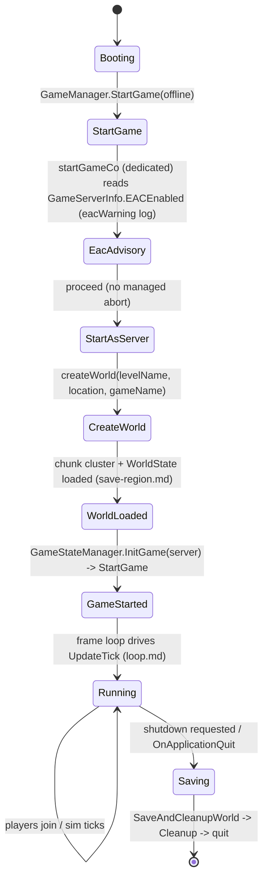
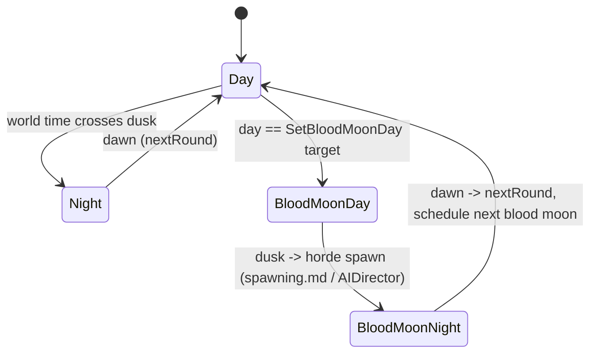
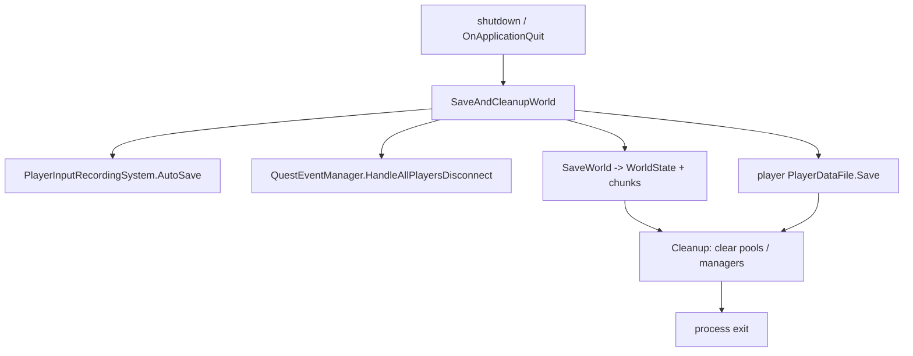

# Server lifecycle, game state, and player persistence (dedicated V3.1.0)

**Owns:** the dedicated process lifecycle (boot -> world create/load -> run ->
save + shutdown), the `GameStateManager` game-mode/round tick, and player
persistence (`PlayerDataFile`, `PersistentPlayerList`, land claims).
**Not:** the per-frame sim ([loop.md](loop.md)); world/chunk save byte format
([save-region.md](save-region.md)); the join wire handshake ([protocol.md](protocol.md)).
**Evidence:** `GameManager` (boot/save methods), `GameStateManager`,
`PersistentPlayerList`, `PlayerDataFile` IL (dump locally with `tools/src/DumpMethod`,
git-ignored). **Hub:** [`INDEX.md`](INDEX.md). **Method:** [`re-methodology.md`](re-methodology.md).

This is the outermost dedicated codepath: everything else runs between boot and
shutdown.

---

## 1. Boot sequence (state machine)

`GameManager.StartGame(offline)` kicks a coroutine `startGameCo` (the boot state
machine `startGameCo>d__138`, IL=378), which on a dedicated server reads
`GameServerInfo.EACEnabled` (logging an `eacWarning` advisory), then routes through
`StartAsServer` to create or load the world and mark the game started; from there
the frame loop ([loop.md](loop.md)) drives everything.

There is **no integrity-violation abort on the dedicated boot path** in managed IL.
The `eacIntegrityViolation` / `eacUnableToPlayOnProtected` strings exist only inside
`GameManager.gmUpdate` (IL_026E/IL_029E), in the **client-only** UI block that is
skipped on a dedicated server (guarded by `IsDedicatedServer` at IL_01F0). EAC on a
dedicated server is the native anticheat plus the `EACEnabled` advisory, not a
managed startup gate.



`IsStartingGame` / `waitForGameStart` gate work until the world is ready;
`OnWorldChanged` fires when the world (re)loads. `get_World()` returning non-null
is the readiness signal other systems (e.g. the web server, [webserver.md](webserver.md))
check.

---

## 2. Game state and rounds (`GameStateManager`)

`GameStateManager` owns the game mode and the day/blood-moon progression.
`InitGame(bServer)` sets up the mode; `OnUpdateTick` advances round state from the
world clock; `nextRound` / `SetBloodMoonDay` drive the horde schedule.



`GetGameMode` / `GetModeName` expose the active mode (`GameModeSurvivalMP` on a
normal dedicated server; other `GameModeAbstract` subclasses exist for
creative/edit). `IsGameStarted` gates the tick.

### 2.1 Game modes (registry)

Game modes are a thin registry, not a state machine: `GameMode` (base) keeps a
name/id dictionary (`InitGameModeDict`, `GetGameModeForId`/`GetGameModeForName`),
and each concrete mode is a `GameModeAbstract` subclass whose `Init` (and
`ResetGamePrefs`) configures the `GamePrefs` (feature switches) for that mode.

| Mode | Role |
|---|---|
| `GameModeSurvivalMP` | Default dedicated survival (multiplayer) |
| `GameModeSurvivalSP` / `GameModeSurvival` | Single-player / base survival |
| `GameModeSurvivalPvP` | PvP ruleset |
| `GameModeCreative` | Creative (no survival constraints) |
| `GameModeEditWorld` | World editor |
| `GameModeDeathmatch` / `GameModeZombieHorde` | Special rulesets |

The mode does not drive per-tick logic itself; it sets the prefs that the rest of
the systems (spawning, buffs, save, etc.) read. So "what a mode does" is almost
entirely the `GamePrefs` it applies in `Init`.

---

## 3. Player join and persistence (state machine)

A joining client (after the wire handshake and enter-game batch,
[protocol.md](protocol.md) section 5) is created by
`GameManager.RequestToSpawnPlayer` (IL=496) and only later marked fully present
via `GameManager.PlayerSpawnedInWorld` when `NetPackagePlayerSpawnedInWorld`
arrives. Player state lives in a per-player `PlayerDataFile` on disk;
`PersistentPlayerList` is the cross-session registry (identity, allies, land claims).


- **`PlayerDataFile`**: `Write`/`Read` serialize the full profile (inventory,
  stats, progression, waypoints); `ToPlayer`/`FromPlayer` sync between the file and
  the live `EntityPlayer`; `Load` falls back to a **backup** file if the primary is
  corrupt ("Loading backup player data"). Network variants (`WriteNetwork`/
  `ReadNetwork`) send profile data over the wire.
- **`PersistentPlayerList`**: maps platform identity / entity id to
  `PersistentPlayerData`; owns **land claims** (`PlaceLandProtectionBlock`,
  `RemoveLandProtectionBlock`, `GetLandProtectionBlockOwner`, `RemoveExtraLandClaims`)
  and ally relationships; dispatches player events. It is written into the world
  save and sent to clients in `WorldInfo` (see [protocol-packages.md](protocol-packages.md) §4.2).

---

## 4. Shutdown and save

`SaveAndCleanupWorld` (the graceful path, also reached from `OnApplicationQuit` via
`ApplicationQuitCo`) auto-saves recordings, disconnects quest state
(`QuestEventManager.HandleAllPlayersDisconnect`), writes the world
([save-region.md](save-region.md)) and player data, then `Cleanup` clears pools and
managers.



---

## 5. Dedicated relevance and residuals

- **Core dedicated path:** boot, game-state tick, player persistence, and save all
  run on the headless server every session.
- **Residual:** EAC integrity verification (native anticheat, not a managed boot
  gate; see [platform-auth.md](platform-auth.md)); the save byte codec detail
  ([save-region.md](save-region.md)); XML game-mode/content config.

---

## 4. Land-claim and persistent-player packages (verified)

Land claims live on `PersistentPlayerList` / `PersistentPlayerData` (section 3).
Wire packages that touch claim/repair and player registry:

### `NetPackageLandClaimRepair`

```text
blockPos.x,y,z : i64 each   // Vector3i components written as Int64
beginRepair : bool
```

`ProcessPackage` (IL=33): resolve `TEFeatureAreaRepair` at position. If
`beginRepair` and server: `RepairAll(world, pos, sender.entityId)`. If ending
repair and local owner matches, `IsRepairing=false`.

### `NetPackagePersistentPlayerState`

```text
reason : u8    // EnumPersistentPlayerDataReason
PersistentPlayerData.Write(...)
```

`ProcessPackage` → `GameManager.PersistentPlayerLogin(ppData)` (IL=5).

### `NetPackagePersistentPlayerPositions`

```text
count : i32
// count x:
  platformUserId : PlatformUserIdentifierAbs.ToStream
  position : Vector3i
```

Used for map/claim marker sync of offline/online players (also referenced from
gmUpdate when clients present).

### 4.1 `PersistentPlayerData.Write` binary (IL=205)

Used by `NetPackagePersistentPlayerState` and list save. Order:

```text
primaryId : PlatformUserIdentifierAbs.ToStream(..., includeExtra=true)
nativeId  : PlatformUserIdentifierAbs.ToStream(..., includeExtra=true)
playGroup : u8
playerName : AuthoredText.ToStream
lastLoginTicks : i64          // DateTime.Ticks
position.x,y,z : i32 x3       // after UpdatePositionFromEntity
entityId : i32
lpBlockCount : i32
backpackCount : i32
// lpBlockCount x Vector3i (i32 x3)     // land protection blocks
// backpackCount x:
  backpackEntityId : i32
  pos.x,y,z : i32 x3
  timestamp : u32
bedroll.x,y,z : i32 x3
questPosCount : i32
// questPosCount x QuestPositionData.Write:
  questCode : i32
  positionDataType : i32
  blockPosition : Vector3i
vendingCount : i32
// vendingCount x Vector3i              // owned vending machines
```

XML twin (`Write(XmlElement)`, IL=313) emits the same logical fields as elements
(`player`/`native`/`lpblock`/`backpack`/`bedroll`/...).


### 4.2 `PersistentPlayerList` save formats (verified)

**Binary `Write(BinaryWriter)` IL=73** (also used when embedding):

```text
playerCount : i32
// playerCount x PersistentPlayerData.Write (section 4.1)
lpMapCount : i32
// lpMapCount x:
  blockPos.x,y,z : i32
  ownerPrimaryId : PlatformUserIdentifierAbs.ToStream(..., false)
Allies.Write(stream)                  // AllyStore binary
```

**XML `Write(path)` IL=44** (live save path): only if server and not edit mode.
`SavePersistentPlayerData` writes `{SaveGameDir}/players.xml` with root
`persistentplayerdata version=1`, each player element via
`PersistentPlayerData.Write(XmlElement)`, then `AllyStore.WriteXml`.

`Read` / `ReadXML` rebuild Players dict, `MapPlayer`, lp block map, allies.


## Join analytics (V3.1.0)

On player join the dedicated server may emit platform analytics via
`GameManager.LogPlayerJoinServerEventAnalyticsCoroutine` into
`Services.Analytics.Events.PlayerJoinServerEventData` (fields include ServerId,
SaveId, OnlinePlayers, LocalMods, HasModifiedXML, character/game-stage stats).
This is **telemetry**, not gameplay sim; transport is the platform analytics
service (residual). See the EOS server-list filters section below.

### Analytics heartbeat (client path; dead on dedicated)

`ConnectionManager` holds `countdownAnalyticsHeartbeat` constructed as
`new CountdownTimer(300f, false)` (**300 s**). `BeginHeartbeat(seconds)` only
`SetTimeout` + `ResetAndRestart`.

Each `ConnectionManager.Update`, after flush work:

```text
if GameManager.IsDedicatedServer: ret          // IL_01D9 brtrue → skip entire block
if !countdownAnalyticsHeartbeat.HasPassed: ret
ResetAndRestart()
ev = new HeartbeatEventData()                  // Services.Analytics.Events
ev.HeartbeatTimestamp = DateTime.UtcNow.ToString("O")
ev.ServerId = Helper.GetServerId()             // Services.Analytics.Helper
ev.SaveId = IsClient ? GamePrefs.GetString(159) : World.Guid  // null-safe
ServiceProvider.Get<IAnalyticsService>().LogEvent(ev)
```

**Dedicated implication:** the heartbeat **never fires** on pure dedicated
(`IsDedicatedServer` early-out). Types still appear in the reachability set
because `ConnectionManager.Update` is shared. Classify as telemetry residual;
do not model as a dedi sim cost. Types: `HeartbeatEventData`, `Helper`
(Services.Analytics), `TruncateStringSerializerConverter` (JSON string length
cap for analytics payloads). OOS list: [out-of-scope-surface.md](out-of-scope-surface.md)
third-party/analytics.

## Related docs

| Doc | Role |
|---|---|
| [loop.md](loop.md) | The frame/sim loop that runs during "Running" |
| [save-region.md](save-region.md) | World/chunk save byte format |
| [protocol.md](protocol.md) | Join handshake that precedes PlayerSpawnedInWorld |
| [spawning.md](spawning.md) | Horde spawns driven by the blood-moon round |
| [full-surface.md](full-surface.md) | Whole-assembly map |

## Changelog

- **2026-08-07:** PlayerLoginRPC IL=20 -> AuthorizationManager.Authorize.
- **2026-08-07:** Document analytics heartbeat (300s, client-only; dedicated skips).
- **2026-08-02:** V3.1.0 join analytics (`PlayerJoinServerEventData`).

- **2026-07-28:** PersistentPlayerList binary/XML save layout + players.xml path.

- **2026-07-28:** PersistentPlayerData.Write binary field order (claims, backpacks, bedroll, quests, vending).

- **2026-07-28:** LandClaimRepair + PersistentPlayerState/Positions packages.

- **2026-07-28:** Join spawn path: RequestToSpawnPlayer vs PlayerSpawnedInWorld split.

- **2026-07-23:** Initial server lifecycle / game-state / player-persistence reversal (boot, rounds, join+persistence, shutdown) with state machines.

## EOS server-list filters (V3.1.0 b14)

`Platform.EOS.SessionsClient.matchesFilters(GameServerInfo, filters)` gates which
sessions the server browser shows, so a server that never registers with EOS is
invisible to browse regardless of its own state.
*Anchor:* `il/full-v3.1.0/Platform.EOS/SessionsClient.il.txt`.
