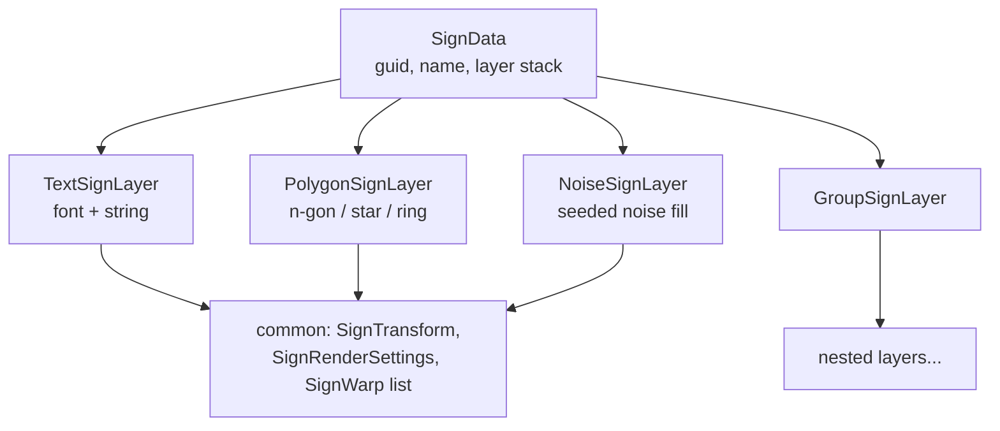
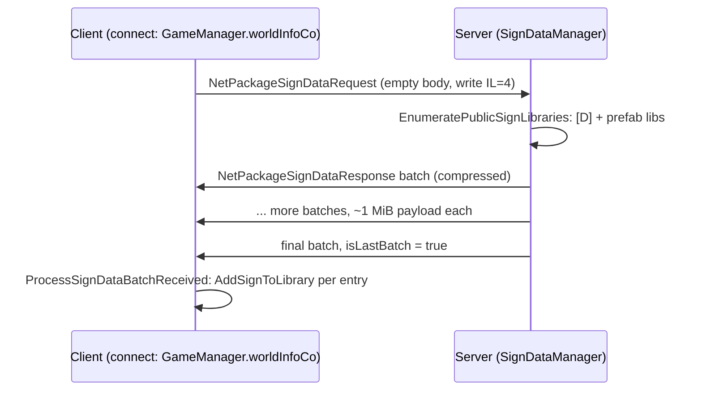

# Signs, authored text, and drawings (dedicated V3.1.0)

**Owns:** the layered vector-sign ("drawing") content system: `SignData` and its
layer tree (`SignLayer`, `TextSignLayer`, `PolygonSignLayer`, `NoiseSignLayer`,
`GroupSignLayer`, the eight `SignWarp` types, `SignTransform`,
`SignRenderSettings`), sign identity and storage (`GlobalSignId`, `SignLibrary`,
`SignLibraryMigrations`, `SignDataManager`), the sign-data download protocol
(`NetPackageSignDataRequest/Response`), and the authored-text moderation stack
(`AuthoredText`, `GeneratedTextManager` + `AuthoredTextDetails`). Also maps the
client-only render pipeline (`SignRenderer`, `SignPrioritizer`,
`SignTextureManager/Store`, `BakeScheduler`, `ImposterSignFactory`) far enough to
show it is not server work. **`SignCanvas` straddles the line:** the MonoBehaviour
and its decal rendering are client, but its nested **`SignCanvas.CanvasState` is
server-persisted state** (`TEFeatureCanvas.Read`/`Write` call
`CanvasState.Read`/`Write` directly, see §6), so do not treat the whole type as
client-only.
**Not:** the tile-entity features that carry this data on a block
(`TEFeatureSignable`, `TEFeatureCanvas`, inventoried in
[inventories/te-features.md](inventories/te-features.md)); tile-entity
replication and persistence mechanics ([tile-entities-power.md](tile-entities-power.md));
chat-text filtering call sites ([chat.md](chat.md)); platform blocklist plumbing
([platform-auth.md](platform-auth.md)).
**Evidence:** IL of `SignData` (+ nested layer/warp types), `SignLibrary`,
`SignLibraryMigrations`, `SignDataManager`, `GlobalSignId`,
`NetPackageSignDataRequest/Response`, `AuthoredText`, `GeneratedTextManager`,
`TEFeatureCanvas`, `TEFeatureSignable`, `SignCanvas`, `SignPrioritizer`,
`SignTextureManager`; dump locally with `tools/src/DumpMethod`, git-ignored.
**Hub:** [`INDEX.md`](INDEX.md). **Method:** [`re-methodology.md`](re-methodology.md).

V3.0.1 actually contains two distinct "sign" systems that share nothing but the
word:

1. **Writable text signs** (the classic gameplay feature): a player types a
   string into a sign block; the string plus its author id is an `AuthoredText`
   persisted by `TEFeatureSignable` and moderated per viewer.
2. **Layered drawing signs** (the V2.x "SignTech" system): procedural vector
   art described as a stack of text/polygon/noise layers (`SignData`), stored in
   named libraries, referenced from blocks by `GlobalSignId` via
   `TEFeatureCanvas`, and rasterized entirely on the client by a compute-buffer
   bake pipeline. In this build it is an editor-authored content system, not a
   player drawing tool: `TEFeatureCanvas.OnBlockActivated` only opens the
   gallery when `WorldBase.IsEditor()` and `PrefabEditModeManager.IsActive()`;
   otherwise it shows the literal tooltip "Cannot edit signs as client".

---

## 1. The layer model

`SignData` is one drawing: identity plus an ordered layer stack.

| `SignData` field | Meaning |
|---|---|
| `guid` | Stable identity within its library |
| `name` | Display name (gallery UI) |
| `lastModified` | UTC timestamp (written as ticks) |
| `nextPolyId` / `nextTextId` / `nextNoiseId` / `nextGroupId` | Counters used by `SetLayerDefaultName` to number new layers |
| `layers` | `List<SignLayer>`, bottom-to-top paint order |

Every `SignLayer` carries the shared fields `name`, a `SignTransform`
(`position: Vector2`, `rotation: float`, `scale: Vector2`, with
`op_Multiply` composing parent-child transforms), a `SignRenderSettings`
(`color: Color`, `mode` byte), and a `List<SignWarp>` of UV distortions. The
concrete subclasses add:

| Layer (binary `TypeId`) | Own fields |
|---|---|
| `GroupSignLayer` (0) | `offsetTarget` byte, `softnessOffset`, `dilateOffset`, `colorMode` byte, nested `List<SignLayer> layers` |
| `TextSignLayer` (1) | `font`, `text`, `direction`, `spacing`, `softness`, `dilate` |
| `PolygonSignLayer` (2) | `sides`, `smoothness`, `starify`, `softness`, `dilate`, `frequency`, `shapeMode` byte |
| `NoiseSignLayer` (3) | `seed`, `detail`, `softness`, `dilate`, `fade` |

Groups nest recursively; `SignData.UnpackLayers` flattens a group by
multiplying the parent `SignTransform` into each child, and
`GroupSignLayer` applies group-wide softness/dilate/color offsets to its
children (`SignDataManager.GroupOffsets.WithOffsets`).

Warps are a second polymorphic family under `SignData`, dispatched by their own
`TypeId` byte: `SkewWarp` (0), `BulgeWarp` (1), `TwirlWarp` (2), `KaleidoWarp`
(3), `PerspectiveWarp` (4), `ArcWarp` (5), `StretchWarp` (6), `GridWarp` (7).

`TextSignLayer.text` is static library content typed in the editor tool. It is
**not** an `AuthoredText` and never passes through `GeneratedTextManager`; the
moderation stack (section 5) applies only to the writable-sign path.

## 2. Serialization

**Binary** (`SignData.Write/Read`, used for the network download and nothing
else in this build): guid, name string, UTC ticks `int64`, the four next-id
`int32`s, layer count `int32`, then each layer. A layer writes its `TypeId`
byte, then the subclass payload (`InternalWrite`), then the shared tail: name
string, transform (2+1+2 floats), render settings (color + mode byte), warp
count `int32`, warps (each again `TypeId` byte + payload). `SignLayer.Read`
switches on the byte and instantiates the matching subclass; unknown ids throw.

**XML** (`SignData.WriteXml/ReadXML`, the at-rest format): a `<sign>` element
with attributes `guid`, `name`, `modified`, `next_poly_id`, `next_text_id`,
`next_noise_id`, `next_group_id` and one `<layer type="TextSignLayer|
PolygonSignLayer|GroupSignLayer|NoiseSignLayer" ...>` child per layer (nested
`<layer>` inside groups, `<warp>` children for warps).
`SignLayer.LayerFromXml` dispatches on the `type` string.

**Library files and versioning:** `SignLibrary` wraps a
`Dictionary<Guid, SignData>` read from a `<signs version="N">` document.
Current version is **2** (`SignLibrary.WriteXml` stamps `version="2"`).
`SignLibrary.ReadXml` logs duplicated guids, warns on missing version
("assuming legacy format (v0)") and on files newer than supported, then runs
`SignLibraryMigrations.Migrate` stepwise. `MigrateV0ToV1` is a no-op;
`MigrateV1ToV2` walks every layer (`VisitLayers`, recursing through
`GroupSignLayer` children) and resets `direction="0"` and `spacing="1"` on each
`TextSignLayer`, i.e. the meaning of those two attributes changed between v1
and v2.

## 3. Identity and libraries

`GlobalSignId` is a struct of `libraryId: string` + `signGuid: Guid`
(`ToString` renders `"{lib}:{guid}"`; stream form is the string plus 16 raw
guid bytes; an id with a null/empty library is invalid and logged as possible
malformed data). `SignDataManager` (plain singleton, created on both server and
client) keys everything on it and holds a `Dictionary<string, SignLibrary>`:

| Library id | Content | Loaded by |
|---|---|---|
| `[D]` | Default stock library, `Data/Config/signs.xml` | `WorldStaticData` static config table -> `SignDataManager.LoadDefaultLibrary` (both sides) |
| `[U]` | Local user's personal library (editor tool) | Sign editor UI; never sent to clients |
| `[I]` | Internal: generated error placeholder sign (`SignData.GetErrorSignData`, a red polygon layer) | `LoadDefaultLibrary` epilogue |
| `<prefab name>` | Per-POI sign library, `<prefab>_signs.xml` next to the prefab | `Prefab.loadWorldSignData` (server only, `ConnectionManager.IsServer` gated); written back by `Prefab.Save` via `SignLibrary.WriteXml` |

`EnumeratePublicSignLibraries` yields every library except `[I]` and `[U]`;
that is exactly the set a server replicates. `MoveSignToLibrary` duplicates a
sign into another library under a fresh guid (used by
`TEFeatureCanvas.CopyFromInternal` when a canvas is copied in the editor so the
copy does not reference a foreign library). `GetLibraryNiceName` maps `[D]`/`[U]`
to the localized `lblSignLibraryDefault`/`lblSignLibraryUser` labels.

## 4. Network: one-way bulk download

Sign drawings are distributed like static content, not like tile entities:

`RequestWorldSignDataFromServer` is a coroutine run from the client connect
flow (`worldInfoCo`); it refuses to run on the server and refuses re-entry
while a download is in progress. `SendSignDataToClient` refuses to run on a
client, flattens all public libraries into `(libraryId, SignData)` pairs, and
packs them into size-markered batches cut at `1048576` bytes; each batch ships
as a `NetPackageSignDataResponse` (`Compress` = true; write IL=28) carrying `isLastBatch`,
a length, and the raw bytes. The receiving client replays
`SignData.Read` per entry into its local library map, and on failure falls
back to registering only the `[I]` error sign.

There is **no reverse package**: nothing uploads a `SignData` from client to
server. Combined with the editor-mode gate on `TEFeatureCanvas` this means
players cannot author drawings on a live dedicated server in V3.0.1; the
sign editor (`XUiC_SignEditorWindow`, `XUiC_SignGalleryWindow`,
`ConsoleCmdSignEditorDebug` `signeditordebug|sed`) is world/prefab editor
tooling.

## 5. Blocks, authored text, and moderation

**Drawing placement** on a block is just a reference: `TEFeatureCanvas`
persists a `SignCanvas.CanvasState` (stream order: `GlobalSignId`, blend-mode
byte, canvas-rotation byte, show-on-imposter bool) inside the composite tile
entity, so it rides normal TE replication and chunk persistence (see
[tile-entities-power.md](tile-entities-power.md)). At render time
`SignCanvas.DisplaySignId` falls back to `SignDataManager.ErrorSignId` when the
referenced sign is not in any loaded library.

**Writable text signs** persist an `AuthoredText`: `text: string` +
`author: PlatformUserIdentifierAbs` (stream form via
`PlatformUserIdentifierAbs.FromStream/ToStream`). `XUiC_SignWindow` (window
`signMultiline`, opened by `TEFeatureSignable.ShowUI`) validates the string
against the mesh font (`CanRenderString`, tooltip `uiInvalidCharacters`) and
commits with `SetText(text, sync, localPlatformUserId)`, which updates the
`AuthoredText`, marks the TE modified (replicating raw text plus author to the
server), and re-renders locally. The game-event action `ActionRenameSigns`
(Twitch sequence) drives the same `ITileEntitySignable.SetText` path.

Moderation happens at **display** time, per viewing client, in
`GeneratedTextManager.GetDisplayText`:

- On a dedicated server (`GameManager.IsDedicatedServer`) the raw text is
  returned immediately: the server stores and forwards but never filters.
- If the author is not the local user and the author's
  `PersistentPlayerData.PlatformData.Blocked[EBlockType]` state
  says blocked, the text is replaced with `""` (the sign goes blank). The
  `TEFeatureSignable.UserBlockedStateChanged` hook re-runs this whenever the
  local blocklist changes.
- Otherwise the platform censor (`ITextCensor.CensorProfanity`) runs
  asynchronously with the author id; while pending, callers see the `{...}`
  placeholder, and the filtered result is cached in an `AuthoredTextDetails`
  keyed by the `AuthoredText` instance. BbCode is stripped before filtering
  and re-applied after (`GetTextToFilter` / `ReconstructFilteredTextWithBbCodes`).
- `ShouldSkipFiltering(author, mode)` switches on `TextFilteringMode`: value 0
  never filters, values 1 and 3 always filter, value 2 skips filtering when the
  author's native platform equals the local native platform (cross-platform
  text is the mandated filtering case).

The same `GeneratedTextManager` entry points serve chat, Twitch, waypoint
invites, player names (`PersistentPlayerName`), and server messages; only the
`TEFeatureSignable` call sites are in scope here.

## 6. Server-authoritative vs client-render split

Server-relevant (runs or matters on the dedicated server):

- `SignData`/`SignLayer` binary + XML serialization, `SignLibrary` +
  migrations, `[D]` default library load, prefab `_signs.xml` load/save
  (`Prefab.loadWorldSignData` / `Prefab.Save`).
- `SignDataManager` as library store and download service
  (`SendSignDataToClient`), cleaned up in `GameManager.SaveAndCleanupWorld`.
- `TEFeatureCanvas.CanvasState` and `TEFeatureSignable.AuthoredText`
  persistence/replication in the composite TE.
- `AuthoredText` itself: authorship (platform user id) is stored
  server-side and is what makes per-viewer block filtering possible.

Client-render only (all guarded by `IsDedicatedServer` checks or reached only
from Unity render/UI code; a headless server never executes them):

- Font atlases: `SignDataManager..ctor` skips loading
  `Fonts/SignFontConfig.asset` and building the `Sign Font Atlas`
  `Texture2DArray` on dedicated servers.
- `SignDataManager.UpdateRenderingData`: flattens the layer tree into
  compute-buffer records (`LayerDescriptor`, `CharLayer`, `PolygonLayer`,
  `NoiseLayer`, per-warp buffers) plus per-layer complexity metrics; only
  invoked from editor UI (`MarkSignDirty`) and the bake path.
- The bake pipeline: `SignTextureManager` (`Game/SignTech/UI` shader,
  `SignTech_Bake` command buffer, quality tiers) -> `SignPrioritizer`
  (groups canvases per `GlobalSignId`, sorts by squared distance / size,
  assigns resolution tiers) -> `BakeScheduler.TickOnce` -> `SignTextureStore`
  (pooled `RenderTexture` cache) -> `SignCanvas` / `SignRenderer`
  (material property blocks, alpha-blend decal command buffers) ->
  `ImposterSignFactory` (signs on distant-terrain imposters).
- All `XUiC_Sign*` window controllers (editor, gallery, instance settings,
  warp settings), `SignTextureExporter`, and the debug console commands
  `signeditordebug`/`sed` and `signtexman`/`stm`.

Bake leaves: `SignBakeRequest` (ValueType: `{GroupIndex, Tier,
GroupMinDistanceSquared}`; `CompareTo` sorts Tier ascending then group distance
ascending) is the prioritiser's work order; `SignComplexityInfo`
(`{TotalComplexity, ComplexityByLayer, StackInfo}`, `IsValid` = non-null
dictionary, `Invalid` = (0, null, default)) carries the per-layer complexity
metrics from `UpdateRenderingData` into the tier assignment
(`TryGetLayerComplexityInfo` guards a null layer/dictionary).

For a reimplementation the server surface is small: parse `signs.xml`-format
libraries, store `(libraryId, guid)` references and `AuthoredText` in tile
entities, and answer `NetPackageSignDataRequest` with batched compressed
`SignData` blobs. Everything visual is client territory.

---

## Related docs

| Doc | Role |
|---|---|
| [inventories/te-features.md](inventories/te-features.md) | `TEFeatureSignable` / `TEFeatureCanvas`, the TE features that carry this data |
| [tile-entities-power.md](tile-entities-power.md) | Composite tile-entity model, replication and persistence |
| [chat.md](chat.md) | The other big `GeneratedTextManager` consumer |
| [platform-auth.md](platform-auth.md) | `PlatformUserIdentifierAbs`, blocklists, platform services behind `ITextCensor` |
| [protocol-packages.md](protocol-packages.md) | Net package catalog (`NetPackageSignData*`) |
| [server-browser-prefabs.md](server-browser-prefabs.md) | Prefab loading, where `_signs.xml` lives |
| [full-surface.md](full-surface.md) | Where this family sits in the whole-assembly map |
| [re-methodology.md](re-methodology.md) | How this was reversed |

## Changelog

- **2026-08-10:** Sign wire IL re-verified: NetPackageSignDataRequest write IL=4 (empty), NetPackageSignDataResponse write IL=28 (exact).
- **2026-08-08:** Bake leaves: SignBakeRequest {GroupIndex, Tier,
  GroupMinDistanceSquared} CompareTo tier-then-distance; SignComplexityInfo
  TotalComplexity/by-layer dict + IsValid/Invalid; MethodSignature re-roled
  client messaging infra (inventory).
- **2026-07-28:** SignDataRequest/Response write IL re-verify.

- **2026-07-24:** Initial reversal of the sign/authored-text/drawing system (SignData layer + warp model with binary/XML formats, GlobalSignId + library map with v0-v2 migrations, one-way batched sign download protocol, AuthoredText per-viewer moderation, server/client split with the bake pipeline flagged client-only).
