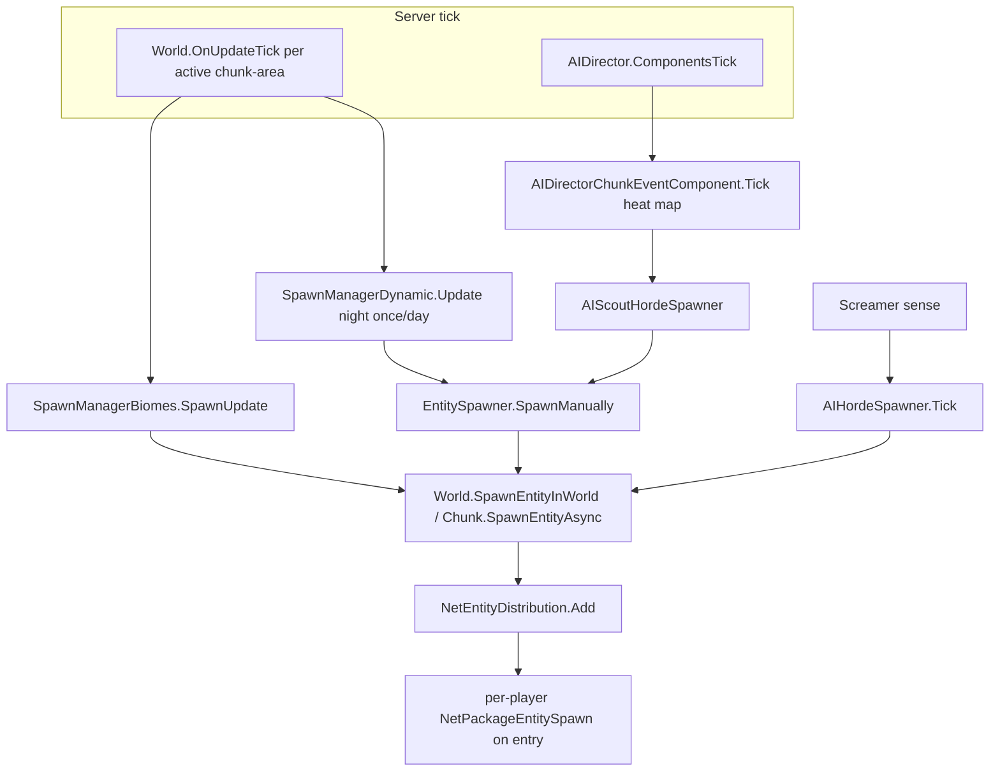
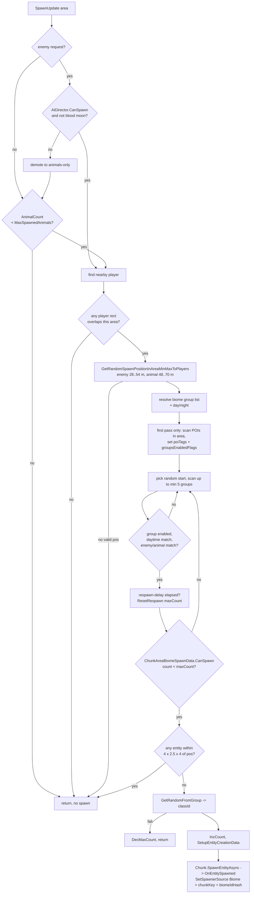
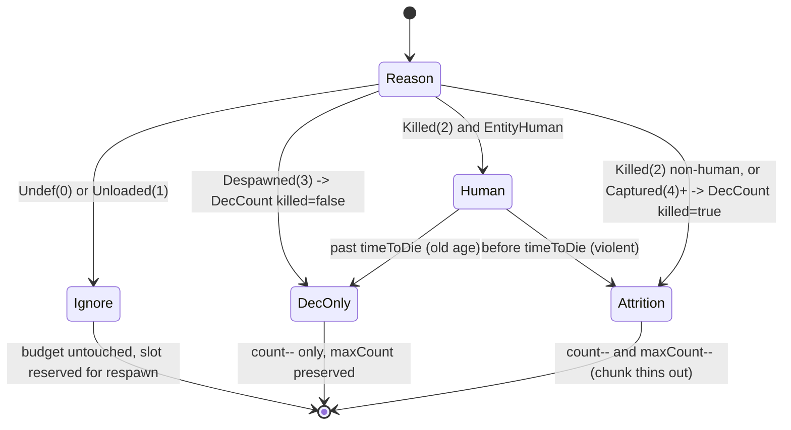
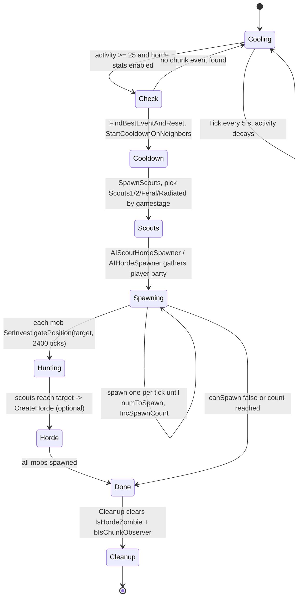
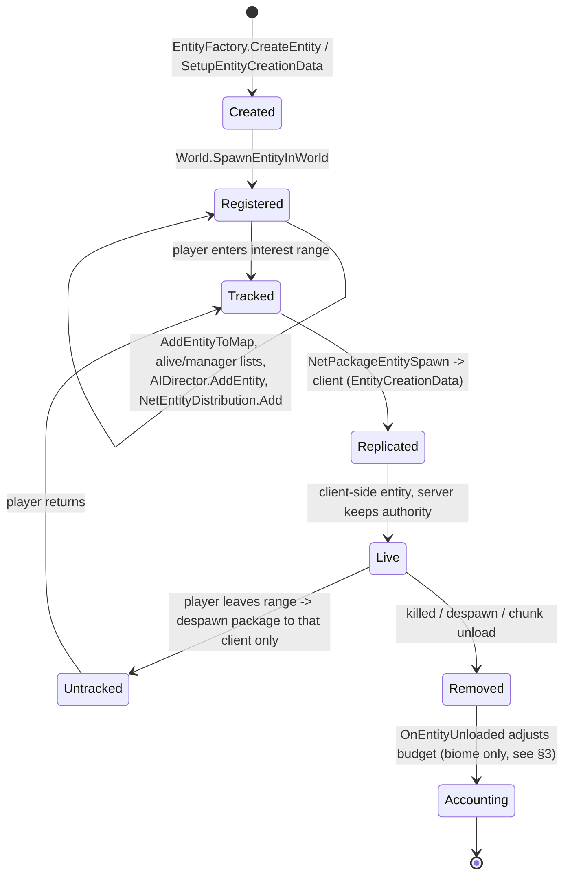

# Entity spawning subsystem (dedicated V3.1.0)

**Owns:** how entities are placed INTO the world: the spawn-manager family
(`SpawnManagerBiomes`, `SpawnManagerDynamic`, `SpawnManagerAbstract`), the
per-chunk-area biome budget (`ChunkAreaBiomeSpawnData`), the wave/static/sleeper
spawner (`EntitySpawner`), the chunk-heat scout and screamer hordes
(`AIDirectorChunkEventComponent`, `AIHordeSpawner`), player spawn points
(`SpawnPointList`), and prefab placement (`DynamicPrefabDecorator`). Also: how a
decided spawn becomes a live entity and reaches clients.
**Not:** the per-entity tick, AI decisions, or pathfinding once an entity exists
(those are [`entity-ai.md`](entity-ai.md)); the blood-moon and wandering-horde
director components themselves ([`aidirector.md`](aidirector.md)); the
`NetPackageEntitySpawn` wire layout ([`protocol-packages.md`](protocol-packages.md) §5.1);
XML spawn content (data, not loop IL).
**Evidence:** `SpawnManagerBiomes`, `SpawnManagerDynamic`, `EntitySpawner`,
`AIHordeSpawner`, `ChunkAreaBiomeSpawnData`, `AIDirectorChunkEventComponent`,
`SpawnPointList`, `DynamicPrefabDecorator` IL (global namespace; dump locally by
type name with `tools/bin/DumpMethod`, git-ignored).
**Hub:** [`INDEX.md`](INDEX.md). **Method:** [`re-methodology.md`](re-methodology.md).

This is authoritative server logic: every spawn decision below runs on the
dedicated host. Clients never decide spawns; they receive the resulting entity
through interest management (§7).

---

## 1. Architecture: five spawn sources, one placement path

Spawning is not a single system. Five independent drivers each decide "what,
where, when", then all funnel through the same two placement calls
(`World.SpawnEntityInWorld` or the async `Chunk.SpawnEntityAsync`) and tag the
new entity with an `EnumSpawnerSource` so the correct accounting owner can later
decrement its budget.

| Driver | Type | Trigger | Source tag | Budget owner |
|---|---|---|---|---|
| Biome wandering spawns | `SpawnManagerBiomes` | per active chunk-area, from `World.OnUpdateTick` | `Biome` (1) | `ChunkAreaBiomeSpawnData` |
| Dynamic night spawns | `SpawnManagerDynamic` | once per in-game day, night only | `Dynamic` (3) | `EntitySpawner` wave state |
| POI / static / sleeper spawners | `EntitySpawner` | per spawner class + day + time-of-day | `StaticSpawner` (2) or `Dynamic` (3) | `EntitySpawner` wave state |
| Chunk-heat scouts + follow-up hordes | `AIDirectorChunkEventComponent` -> `AIScoutHordeSpawner` | activity heat map, 5 s cadence | `Dynamic` (3) | scout/horde list |
| Screamer-summoned horde | `AIHordeSpawner` | screamer sense event | `Dynamic` (3) | `AIDirectorGameStagePartySpawner` |

All five share the same global gate: `AIDirector.CanSpawn(1.0)`, which is simply
`GameStats.EnemyCount < GamePrefs.MaxSpawnedZombies * priority`. This is the
server-wide living-zombie cap; when it is hit, biome enemy spawns fall back to
animals-only and the horde/dynamic paths abort for the tick.

---

## 2. The biome spawn decision cycle (`SpawnManagerBiomes.SpawnUpdate`)

This is the main wandering-population loop. A "chunk-area" is a 5x5 block of
chunks: `ChunkAreaBiomeSpawnData` covers an 80 m by 80 m `Rect` anchored at the
master chunk origin. `World.OnUpdateTick` calls
`SpawnManagerBiomes.Update(name, spawnEnemies, chunkAreaSpawnData)` once per
active area, which forwards to `SpawnUpdate` unless the world is playtesting.

The single `SpawnUpdate` call decides at most ONE spawn. It is gated at every
step and returns early the instant any gate fails.

Key facts read from the IL:

- **Player gating.** For each spawned player, an 80 m by 80 m `Rect` centered on
  the player (position minus 40 on x and z) is tested against the area. If no
  player rect overlaps, the area does not spawn. Biome population therefore
  tracks players, not the whole map.
- **Blood-moon demotion.** If `AIDirectorBloodMoonComponent.BloodMoonActive`,
  the enemy request is demoted to animals-only; blood-moon enemies come from the
  director party, not the biome loop.
- **Placement ring.** Positions are drawn in a min/max distance band to the
  nearest players: 28..54 m for enemies, 48..70 m for animals, so wandering
  spawns appear off-camera but nearby.
- **Group selection.** The biome group list (`BiomeSpawnEntityGroupList`, keyed
  by biome name) is scanned from a random start for up to `min(5, count)` groups.
  A group must be enabled by POI tags, match the current `EDaytime`
  (`Any`, `Day`, `Night`), and match the enemy/animal request.
- **POI-tag enabling (once).** The first time an area is evaluated, overlapping
  prefab instances are unioned into `poiTags`, and each group's `POITags` /
  `noPOITags` set the `groupsEnabledFlags` bitmask. This is why POI-tagged
  spawn groups only fire inside the matching prefab footprints.
- **Anti-stacking.** A `GetEntitiesInBounds` over a small 4 x 2.5 x 4 box around
  the chosen position aborts the spawn if anything is already there.
- **Difficulty scaling.** Enemy `maxCount` passes through
  `EntitySpawner.ModifySpawnCountByGameDifficulty` before the respawn reset.
- **Async placement.** The spawn is created off the main flow via
  `Chunk.SpawnEntityAsync` (through `EntityAsyncManager.StartCreateEntity`); the
  completion callback runs `OnEntitySpawned`, stamping
  `SetSpawnerSource(Biome, masterChunkKey, biomeIdHash)`.

---

## 3. Per-chunk-area caps, cooldown, and kill attrition (`ChunkAreaBiomeSpawnData`)

Each area owns a `Dictionary<idHash, CountsAndTime>` where a `CountsAndTime` is
`{ count, maxCount, delayWorldTime }` per spawn group. This is the biome budget,
and it persists: it is written into the chunk's `ChunkCustomData` blob
(`BeforeWrite` -> `write`), so a chunk remembers its spawn state across
save/load.

| Operation | Effect |
|---|---|
| `CanSpawn(idHash)` | true only if `count < maxCount` |
| `IncCount` | on spawn: `count++`, mark chunk modified |
| `DecCount(idHash, killed=false)` | despawn: `count--` (floored at 0) |
| `DecCount(idHash, killed=true)` | kill: `count--` AND `maxCount--` (attrition) |
| `DecMaxCount` | group produced no valid class: `maxCount--` |
| `ResetRespawn(idHash, world, maxCount)` | set `maxCount`, arm `delayWorldTime = now + respawnDelay * rand(0.9, 1.1)` |
| `DelayAllEnemySpawningUntil` | push all enemy groups' delay forward (used to suppress enemies) |
| `IsSpawnNeeded(biomes, worldTime)` (IL=57) | false if biome/group list missing; true if any group missing from `entitesSpawned`, or `count < maxCount`, or `worldTime > delayWorldTime`; else false (all groups full and still delayed) |

**`EntitySpawner.resetRuntimeVariables` (IL=19):** zero `totalSpawnedThisWave`,
both delay timers, clear `entityIdSpawned`, `currentWave=0`,
`numberToSpawnThisWave=0`. **`ResetSpawner`** just calls that.
**`get_CurrentWave`:** field `currentWave`.

**`World.CanPlayersSpawnAtPos(pos, allowAir)` (IL=25):** resolve chunk; else
false; `Chunk.CanPlayersSpawnAtPos(local, allowAir)`.

**`Chunk.CanPlayersSpawnAtPos(x,y,z, allowAir)` (IL=76):** y must be in
**[2, 251]**. Below block (`y-1`) must `CanPlayersSpawnOn`. Cell and above
(`y+1`): fail if solid collide-movement space, or water at cell. Floor: if
`allowAir` and below is air (blockID 0) OK; else below must `IsCollideMovement`.

**`World.FindRandomSpawnPointNearRandomPlayer(maxLight, ref x,y,z)` (IL=64):** no
players → zeros and false; else pick a random player (decrementing counter walk)
and `FindRandomSpawnPointNearPlayer(..., maxDist=**32**)`.

**`World.GetClosestLocalPlayer(pos)` (IL=45):** primary local player, or min
sqr-dist among `m_LocalPlayerEntities` when more than one.

**`World.GetPlayersAround(pos, radius, list)` (IL=38):** add players with
`GetDistanceSq ≤ radius²` (reverse walk).

**`World.GetEntitiesAround(mask, pos, radius, list)` (IL=65):** chunk-range
scan (pos±radius)/16; each chunk `GetEntitiesAround` with flag mask.

**`Chunk.GetEntitiesAround(mask, pos, radius, list)` (IL=92):** y-band of entity
list buckets 0..15; flag match and `GetDistanceSq ≤ radius²`.

**`World.FindRandomSpawnPointNearPlayer(player, maxLight, ref xyz, maxDist)`
(IL=18):** `FindRandomSpawnPointNearPosition(player.pos, maxLight, xyz,
Vector3(maxDist×3), true, false)`.

**`World.IsLandProtectionValidForPlayer(ppData)` (IL=14):** false if
`OfflineHours > GameStats[46] * 24` (claim expires after offline days).

The despawn accounting lives in `OnEntityUnloaded`, registered as a world
delegate. It only touches `Biome`-sourced entities and reads the master chunk
back from the entity's stored spawner chunk key:

The consequence: an entity that simply leaves because its chunk **unloaded**
keeps its reserved slot (it will respawn), a **despawn** frees the slot, and a
**kill** both frees the slot and permanently lowers that group's `maxCount` for
this chunk until the respawn delay elapses and `ResetRespawn` restores it. That
is the "clear a chunk and it stays clearer for a while" behaviour, encoded as
`maxCount` attrition plus a randomized respawn timer.

Persisted wire form of `CountsAndTime` (per entry, version byte 2): `idHash:i32`,
then a packed `u16` = `(maxCount << 8) | count`, then `delayWorldTime:u64`. Both
`count` and `maxCount` are therefore clamped to a byte on disk.

---

## 4. Waves, static and sleeper spawners (`EntitySpawner`, `SpawnManagerDynamic`)

`EntitySpawner` is the general-purpose spawner behind POI/static spawners,
sleeper volumes, dynamic night spawns, and scout hordes. Its class definition
(`EntitySpawnerClass`, loaded per day from `spawning.xml`) carries the tuning:
`numberOfWaves`, `totalPerWaveMin/Max`, `totalAlive`, `delayBetweenSpawns`,
`delayToNextWave`, `spawnAtTimeOfDay`, `daysToRespawnIfPlayerLeft`,
`bAttackPlayerImmediately`, `bTerritorial` / `territorialRange`, and a
`startSound`.

`SpawnManually` is the engine. Its callbacks let each caller supply its own
precondition, spawn-position, and count-modifier, so biome, dynamic, and scout
spawners all reuse it. Per invocation it:

1. Resolves the per-day `EntitySpawnerClass`; resets runtime state if the day
   rolled over and the class is flagged to reset.
2. Enforces `numberOfWaves`, `spawnAtTimeOfDay`, `timeDelayToNextWave`, and
   `timeDelayBetweenSpawns` gates (returns early if not yet due).
3. Prunes its `entityIdSpawned` list of dead or removed entities so `totalAlive`
   reflects reality.
4. Rolls `numberToSpawnThisWave` from `totalPerWaveMin/Max` (difficulty-scaled),
   then loops spawning up to `totalAlive` currently-alive entities, one every
   `delayBetweenSpawns`.
5. Tags each new entity `StaticSpawner` (2) or `Dynamic` (3), tracks its id,
   optionally sets a revenge target and a territorial home area.
6. Starts the next wave only once alive count falls to 20 % of the wave target
   (`0.2` factor, floored at 1), arming `delayToNextWave`.

`daysToRespawnIfPlayerLeft` uses `worldTimeNextWave = now + days * 24000` ticks
(24000 ticks per in-game day) so a POI that a player abandoned repopulates on a
schedule.

`SpawnManagerDynamic` is the thin night-only wrapper (**Update IL=75**):

1. Daytime or zero players → return.
2. If `WorldTimeToDays` equals `lastDaySpawned` **and** `currentSpawner` exists
   → reuse spawner; else set `lastDaySpawned`, construct new
   `EntitySpawner(name, zero, zero, 0, prior entity ids or null)`.
3. `SpawnManually(world, day, spawnEnemies, precondition lambda,
   GetSpawnPosition, null, null)` where position callback is
   `GetRandomSpawnPositionMinMaxToRandomPlayer(min=**64**, max=**96**, …)`.

**`GetRandomSpawnPositionMinMaxToRandomPlayer(min, max, bedrolls, ref player,
ref pos)` (IL=212):** require players and `max > min`. Pick random player.
Up to **10** tries: unit-circle offset scaled to [min, max] band (reject near-
zero vectors); place at player.xz + offset; height = terrain height + 1; reject
if bedroll-near (when flag), `!CanMobsSpawnAtPos`, any player within min², or
any player `CanSee` the point. Success: pos = block center + (0.5,
terrainOffset, 0.5).

**`isPositionInRangeOfBedrolls(pos)` (IL=58):** GamePrefs **160** as radius;
true if any player's bedroll spawn point is within radius².

**`isPositionFarFromPlayers(pos, minDist)` (IL=31):** true only if every player
has `GetDistanceSq ≥ minDist²`.

**`GetTerrainOffset(blockPos)` (IL=27):** if block below is terrain shape,
`MarchingCubes.GetDecorationOffsetY(density(pos), density(pos-up))`; else 0.

**`Chunk.CanMobsSpawnAtPos(x,y,z, ignoreCanMobsSpawnOn, checkWater)` (IL=94):**
y in **[2, 251]**; reject trader area; unless checkWater, reject water at y-1;
below must `CanMobsSpawnOn` (unless ignore) and `IsCollideMovement`; cell and
y+1 must not be solid collide space; if checkWater reject water at cell.

**`Chunk.IsPositionOnTerrain` (IL=18):** y ≥ 1 and shape below is terrain.

Its own `currentSpawner` is serialized, so a day's dynamic spawn progress
survives a restart.

---

## 5. Chunk-heat scouts and screamer hordes (state machine)

Sustained activity (noise, digging, combat) raises a per-region heat value.
`AIDirectorChunkEventComponent` keeps an `activeChunks` map of
`AIDirectorChunkData` keyed by the same 5x5-chunk region key, decays it, and
every 5 s (`spawnDelay`) runs `CheckToSpawn`. When a region's `ActivityLevel`
crosses 25 (and the `ZombieHordeMeter` and `IsSpawnEnemies` game stats are set),
it spawns a scout party toward the hot spot; scouts that reach the player can in
turn create a follow-up horde. `AIHordeSpawner` is the closely related
screamer-triggered variant: it logs `Screamer spawned ...` and pulls a
gamestage-scaled group toward a target position.

Facts from the IL:

- **Gamestage selection.** `SpawnScouts` reads `CalcGameStageAround` for the
  closest player within 120 m and picks the group by thresholds:
  `Scouts1` (&lt; 45), `Scouts2` (&lt; 85), `ScoutsFeral` (&lt; 125),
  `ScoutsRadiated` (otherwise). A 20 % roll upgrades to the feral/long-cooldown
  variant and applies a longer neighbor cooldown.
- **Party sizing.** `AIHordeSpawner` gathers players inside its search bounds as
  members of an `AIDirectorGameStagePartySpawner`, which sets the group name and
  the `numToSpawn` budget from party gamestage.
- **Placement.** For the **screamer path** (`AIHordeSpawner.Tick`), mobs spawn at
  45/55/45 m (day) or 55/70/55 m (night) via `GetMobRandomSpawnPosWithWater`
  (`IsDaytime()`-branched). The **chunk-heat scout spawner** uses different
  constants (`0/8/10`, no day/night branch) in its `SpawnUpdate` position callback.
  Spawned mobs are tagged `Dynamic`, flagged
  `IsHordeZombie` and `bIsChunkObserver` (so they keep their own chunk loaded),
  and are pointed at the target with `SetInvestigatePosition(target, 2400)`.
- **Teardown.** When a spawner reports finished, `TickActiveSpawns` calls
  `Cleanup`, which clears `IsHordeZombie` and `bIsChunkObserver` on every mob so
  they revert to normal despawn rules, then removes the spawner from its list.

Blood-moon and wandering hordes proper are separate director components
(`AIDirectorBloodMoonComponent`, `AIDirectorWanderingHordeComponent`); their
lifecycle is owned by [`aidirector.md`](aidirector.md). This subsystem owns only
the chunk-heat and screamer spawners above.

---

## 6. Player spawn points (`SpawnPointList`)

`SpawnPointList` holds the world's fixed player start positions.
`GetRandomSpawnPosition(world, refPos, minDistance, maxDistance)`:

- With no reference position, returns a uniformly random point.
- With a reference (respawn near bedroll or death), it makes up to 100 tries for
  a point in the `[minDistance, maxDistance]` ring; if none qualifies it falls
  back to the nearest point by squared distance, or `SpawnPosition.Undef` if the
  list is empty.

The list is built at world load (`GameManager.setSpawnPointListCo`) and is the
player-only counterpart to the entity spawners above.

### 6.1 `World.GetRandomSpawnPositionMinMaxToPosition` (IL=240)

Ring/disc spawn sampler shared by the join path (spawn-near-friend, see
[protocol.md](protocol.md) post-spawn), trader respawn
([loot-economy.md](loot-economy.md)) and scout placement
([aidirector.md](aidirector.md)). Signature
`(target, minRange, maxRange, minPlayerRange, checkBedrolls, out pos,
forPlayerEntityId, checkWater, retryCount, checkLandClaim, maxLandClaimType,
useSquareRadius)`.

1. `pos = zero`; `range = maxRange - minRange`; `range <= 0` → false.
2. If `checkLandClaim`: `playerData =
   persistentPlayers.GetPlayerDataFromEntityID(forPlayerEntityId)` (IL=10:
   `EntityToPlayerMap.TryGetValue`; null when the list is missing or id
   unmapped).
3. Try up to `retryCount` times:
   - **Square mode:** `dx, dz = rand.RandomRange(-minRange, minRange+1)` (uniform
     in `[-minRange, minRange]`), re-rolled while `|dx|` or `|dz|` ≥ `maxRange`
     (only binds when `maxRange <= minRange`). `pos = target + (dx, 0, dz)`.
   - **Circle mode:** `v = rand.RandomInsideUnitCircle() * range`, re-rolled
     while `v.sqrMagnitude < 0.01`; then `v = v + (maxRange / |v|) * v`, so the
     radial distance lands in `(maxRange, maxRange + range]`.
     `pos = target + (v.x, 0, v.y)`.
   - `blockPos = worldToBlockPos(pos)`; null chunk → next try.
   - `blockPos.y = chunk.GetHeight(bx, bz) + 1`; `pos.y = blockPos.y`.
   - Reject when: `checkBedrolls && isPositionInRangeOfBedrolls(pos)`; or
     `forPlayerEntityId == -1` ? `!chunk.CanMobsSpawnAtPos(bx, floor(y), bz,
     false, checkWater)` : `!chunk.CanPlayersSpawnAtPos(bx, floor(y), bz,
     false)`; or (player path) `!chunk.IsPositionOnTerrain(bx, blockPos.y, bz)`;
     or `GetPOIAtPosition(pos)` non-null (no POI overlap); or
     `checkWater && chunk.IsWater(bx, blockPos.y - 1, bz)`; or
     `checkLandClaim && GetLandClaimOwner(blockPos, playerData) >
     maxLandClaimType`.
   - Require `isPositionFarFromPlayers(pos, minPlayerRange)`.
   - Accept: `pos = blockPos.ToVector3() + (0.5, GetTerrainOffset(blockPos) +
     0.5, 0.5)`; return true.
4. Tries exhausted: `pos = zero`, return false.

---

## 7. From decision to entity to client

A decided spawn becomes a networked entity through one path, and interest
management (not the spawner) decides who sees it.

Client place requests arrive as `NetPackageRequestToSpawnEntity` →
`GameManager.RequestToSpawnEntityServer` (falling-tree dedupe, backpack
persistent record, then `EntityFactory.CreateEntity` +
`World.SpawnEntityInWorld`). See [protocol-packages.md](protocol-packages.md)
section 5.0.

**`EntityFactory.SetupEntityCreationData` (ECD builder):** the rich overload
(IL=31) fills `entityClass`, `id`, `itemStack = ItemStack(itemValue, count)`,
`pos`/`rot`, `lifetime`, `belongsPlayerId`, `spawnById`, `spawnByName`. The
falling-block overload (IL=36) additionally fills `blockValues` /
`textureFullArrays` and drops `itemValue` (count lands on `itemStack.count`).
The `(et, id, pos, rot)` convenience (IL=12) passes `ItemValue.None`, count
**1**, lifetime `float.MaxValue`, player/spawn id **-1**, empty spawn name. The
`(et, pos[, rot])` variants (IL=10) allocate `EntityFactory.nextEntityID++`
before delegating. `CreateEntity(ecd)` (IL=7) is a thin wrapper:
`CreateEntityOperation.Start(ecd, true)` + `CompleteEntity()` (async variant
starts with `false`; the operation is polled by `TryComplete`).

`World.SpawnEntityInWorld` (**IL=178**) order:

1. Null entity → warn and return.
2. `EntityLoadedDelegates` invoke if set.
3. `AddEntityToMap` + `Entities.Add(id)` + `addToChunk`.
4. Non-player `EntityAlive` → append `EntityAlives`.
5. Server only: track vehicle/drone/turret managers; turret without item class
   `InitDynamicSpawn`.
6. `audioManager.EntityAddedToWorld`, `WeatherManager`, `LightManager`,
   `entity.OnAddedToWorld`.
7. Warn if `position.y < 1`.
8. Server: `entityDistributer.Add`; if player bump `Players` +
   `playerEntityUpdateCount`; else if EntityAlive `Spawned = true`.
9. Server: `aiDirector.AddEntity`.

It does **not** broadcast a spawn package. The replication layer (`NetEntityDistribution`,
[`entity-ai.md`](entity-ai.md) §9) walks players against tracked entities by
distance and view angle and emits `NetPackageEntitySpawn` (an
`EntityCreationData` payload, [`protocol-packages.md`](protocol-packages.md) §5.1)
to each player only when the entity enters that player's set, and a delete when
it leaves. This is the observer/player-gating for spawned entities: spawns are
decided near players (§2, §5) and replicated per player on demand, so cost
scales with players by tracked entities, not with total world population.

Biome spawns additionally run through the async creator
(`Chunk.SpawnEntityAsync` -> `EntityAsyncManager`), which safely refuses to
spawn onto a chunk that is unloading.

---

## 8. Prefab placement context (`DynamicPrefabDecorator`)

`DynamicPrefabDecorator` is the world's prefab (POI) registry, not an entity
spawner, but it is what makes POI-gated spawning and sleeper volumes possible.
`DecorateChunk` looks up the prefab instances overlapping a chunk
(`GetPrefabsAtXZ`, sorted by size) and stamps each into the chunk
(`PrefabInstance.CopyIntoChunk`), which is what brings a POI's sleeper volumes
and block data into the world. The same `GetPOIsAtXZ` / prefab-tag surface is
what `SpawnManagerBiomes` reads to compute an area's `poiTags` (§2). Trader
areas, quest-POI selection, and volume ownership all hang off this registry.

Sleeper volumes themselves tick in `SleeperVolume.Tick`
([`entity-ai.md`](entity-ai.md) §10, D8); this doc's role is to note that the
sleeper population enters the world through prefab placement here, then through
`EntitySpawner` (§4) when a player trips the volume.

---

## 9. Dedicated relevance and residuals

- **Runs on dedicated.** Every spawn decision in §2 to §7 executes on the server
  from `World.OnUpdateTick` and `AIDirector.ComponentsTick`. Clients only apply
  the resulting `NetPackageEntitySpawn`.
- **Caps are server prefs.** `MaxSpawnedZombies` (GamePref 99) and
  `MaxSpawnedAnimals` (GamePref 129) are the two global living-population caps;
  per-chunk-area `maxCount` and per-spawner `totalAlive` are the local caps.
- **Residual (content, not loop IL):** `spawning.xml` (spawner classes, waves,
  times), `biomes.xml` spawn groups (`BiomeSpawnEntityGroupList`), and
  `entitygroups.xml` (`EntityGroups.GetRandomFromGroup` tables) are data. The IL
  proves the decision structure; the numbers per biome/POI live in XML.
- **Residual (persisted state):** per-chunk `ChunkAreaBiomeSpawnData` and
  `SpawnManagerDynamic.currentSpawner` are serialized into the save
  ([`save-region.md`](save-region.md)); their contents are runtime data.
- **Residual (external):** Unity entity GameObject instantiation and the async
  creation thread pool internals sit below the managed spawn logic.

---

## Spawn config leaves

Small config/state types that orbit the spawners above (inventoried in
[`inventories/dedicated-leaves.md`](inventories/dedicated-leaves.md)); all five
run or fire on the dedicated server.

- **`EntitySpawnerClassForDay`** (base `Object`) is the day-indexed schedule of
  wave classes parsed from `spawning.xml`: a sparse `List<EntitySpawnerClass>`
  (`days`, null-padded by `AddForDay`) that `Day(int)` resolves for the current
  game day, with `bWrapDays` cycling past the end via modulo over `Count - 1`
  and `bClampDays` holding the last entry. `EntitySpawner` (§4) calls `Day` in
  its constructor, `Spawn`, and `SpawnManually` to pick the active wave class.
- **`SpawnEntry`** (nested `GameEventManager/SpawnEntry`, base `Object`) tracks
  one entity spawned by a game-event action sequence (`SpawnedEntity`, `Target`,
  `Requester`, owning `GameEvent`, `IsAggressive`). Its only method,
  `HandleUpdate`, enforces aggression: when `IsAggressive` and the entity has no
  player attack target, it calls `World.GetClosestPlayer(entity, 500f, false)`
  and `SetAttackTarget(target, 1000)`. Server-side game-event bookkeeping
  ([`game-events.md`](game-events.md)).
- **`SupplyCrateSpawn`** (nested `AIAirDrop/SupplyCrateSpawn`, base `Object`,
  fields only: `Delay`, `SpawnPos`, `ChunkRef`) is one pending air-drop crate:
  `AIAirDrop.CreateFlightPaths` queues it per flight path and `AIAirDrop.Tick`
  counts down `Delay` then spawns the crate and removes the entry; `ChunkRef` is
  the `ChunkObserver` that keeps the drop chunk loaded until then. Part of the
  air-drop director component ([`aidirector.md`](aidirector.md)).
- **`EntitySupplyCrate.OnUpdateEntity` (IL=103):** base `EntityAlive` tick plus
  parachute state: `showParachuteInTicks` / `closeParachuteInTicks` countdowns
  (edge-triggered to **10** on leaving / landing ground). The parachute
  GameObject hides when `(onGround || IsInWater) && closeParachuteInTicks <= 0`.
  On landing (`onGround && !wasOnGround`): spawn the `supply_crate_impact`
  particle (brightness from `GetLightBrightness`, white tint) via
  `SpawnParticleEffectClient`; on the server call
  `AIDirectorAirDropComponent.SetSupplyCratePosition(entityId,
  worldToBlockPos(pos))` then `RefreshCrates(-1)` (updates the crate nav
  markers, [map-objects.md](map-objects.md)). `wasOnGround = onGround`.
- **`AIAirDrop.Tick(dt)` (IL=193):** the flight-path pump. First call builds
  `flightPaths` (`CreateFlightPaths()`, logs "Computed flight paths for {N}
  aircraft."). `spawningCrates` latches once every crate's `SpawnPos` chunk is
  loaded. While spawning, per path: `path.Delay -= dt`; at ≤ 0 spawn the plane
  (`SpawnPlane(path)`, once); per crate: `crate.Delay -= dt`; at ≤ 0 →
  `controller.SpawnSupplyCrate(SpawnPos, ChunkRef)` and remove the entry
  (log includes the plane position). Paths with no crates left are removed;
  when all paths finish, `flightPaths = null` (recomputed next Tick). Returns
  `flightPaths == null` (done signal to `AIDirectorAirDropComponent`).
- **`AIAirDrop.CreateFlightPaths()` (IL=355):** builds one `FlightPath` per
  drop: `CalcSupplyDropMetrics(numPlayers, clusterCount, ...)` sizes the round;
  pick a random unused player cluster; plane altitude
  `min(cluster player y + 180, 276)`; drop point = cluster center +
  `randOnUnitCircle * rand(30, 750)`; start/end = drop point ± direction *
  `(rand(150,700)/2 + rand(1500,2000)/2)`, nudged by `FindSafePoint(..., 25,
  600)`. Crates are spaced along the line (`startOffset -max(1,(n-1)/2)*spacing`
  stepping by `length/n`); each crate's altitude = plane - 10 (or ground
  height + 15), `ClampToMapExtents(..., 25)`; first crate re-aims the path End
  at the drop; `Delay = |start - drop| / 120`; a `ChunkObserver` keeps the drop
  chunk loaded (`AddChunkObserver(pos, false, 3, -1)`). Paths are staggered by
  `cluster.Delay += rand(25, 120)`.
- **`AIAirDrop.SpawnPlane(path)` (IL=74):** heading = normalized(End - Start);
  `CreateEntity(FromString("supplyPlane"), path.Start, yaw = Angle(heading))`;
  `SetDirectionToFly(dir, (int)(20 * (|End-Start|/120) + 10))`;
  `SpawnEntityInWorld`; log "AIAirDrop: Spawned aircraft at (...), heading (...)".
- **`RequestToSpawnPlayer` join path (IL=496):** server creates the remote
  `EntityPlayer` and sends `NetPackagePlayerId` before `SpawnEntityInWorld`.
  Spawn position order: team-near (GameStats 25) -> friend-near (`nearEntityId`,
  40..150) -> `SpawnPointList`. New vs returning file chooses
  `RespawnType.EnterMultiplayer` (4) vs `JoinMultiplayer` (5). Full sequence and
  wire bodies: [protocol.md](protocol.md) section 5. `PlayerSpawnedInWorld` is a
  **later** client-driven package, not part of this method.
- **`SPlayerSpawningData`** (nested `ModEvents/SPlayerSpawningData`, a
  `ValueType`) is the payload struct for the `ModEvents.PlayerSpawning` hook:
  `ClientInfo`, `ChunkViewDim`, `PlayerProfile`. `GameManager.RequestToSpawnPlayer`
  constructs it and invokes the event by ref at the end of the spawn method.
  This is an in-process mod-hook data struct ([`managers.md`](managers.md)
  section 2), not a wire format; nothing serializes it.
- **`SPlayerSpawnedInWorldData`** (nested `ModEvents/SPlayerSpawnedInWorldData`,
  a `ValueType`) is the matching payload for `ModEvents.PlayerSpawnedInWorld`:
  `ClientInfo`, `IsLocalPlayer`, `EntityId`, `RespawnType`, `Position`
  (`Vector3i`). Fired by `GameManager.PlayerSpawnedInWorld` when
  `NetPackagePlayerSpawnedInWorld` is processed (after the entity is already
  world-spawned); consumed in-assembly by `DiscordManager`. Also in-process only,
  not a wire struct.

---

## Biome spawn manager, director constants and the gamestage indirection (2026-08-06)

Status: **verified** against a full V3.1.0 b14 disassembly (2026-08-05 dump; line
numbers are from that dump; the tracked `il/` sets are the V3.1.0 corpus).

### AIDirectorConstants: the whole horde/scout tuning block

`AIDirectorConstants` (416218-416251) is a single literal block that pins every
wandering-horde and screamer value:

| Constant | Value |
|---|---|
| `kWanderingHordeGlobalStartTime` | 0x6D60 |
| `kSpawnWanderingHordeMin` / `Max` | 0x2EE0 / 0x5DC0 |
| `kWanderingHordeGroupSize` | 6 |
| `kWanderingHordeSpawnDistance` | 92 |
| `kWanderingHordeSpawnMinDistance` | 50 |
| `kWanderingHordePlayerClusterSize` | 30 |
| `kHordeDaySpawnRangeMin` / `Max` | 45 / 55 |
| `kHordeNightSpawnRangeMin` / `Max` | 55 / 70 |
| `kHordeMeterWarn1Threshold` | 0.5 |
| `kHordeMeterWarn2Threshold` | 0.8 |
| `kHordeMeterWarnResetThreshold` | 0.2 |
| `kHordeMeterDecayDelay` / `DecayRate` | 8 / 4 |
| `kScoutSpawnDistance` | 0x50 (80 m) |
| `kScoutScreamGraceTime` | 2 |
| `kScoutScreamAgainTime` | 18 |
| `kScoutSpawnAnotherScoutChance` | 0.12 |
| `kScoutSummonedPerScream` | 5 |
| `kScoutSummonedTotal` | 0x19 (25) |

`AIDirectorData/Noise` (~416280) is a struct of
`{volume, duration, muffledWhenCrouched, heatMapStrength, heatMapWorldTimeToLive}`
held in a static `Dictionary<string, Noise> AIDirectorData::noisySounds`: the heat
map is fed by **named sounds** with per-sound strength and TTL.

`AIDirector::CreateComponents` (**IL=31**) instantiates in order:
`MarkerManagement`, `PlayerManagement`, `WanderingHorde`, `AirDrop`,
`ChunkEvent`, `BloodMoon`; then caches playerManagement / chunkEvent /
bloodMoon fields. Instantiates
`AIDirectorPlayerManagementComponent`, `AIDirectorWanderingHordeComponent`,
`AIDirectorAirDropComponent`, `AIDirectorChunkEventComponent` and
`AIDirectorBloodMoonComponent`.

### SpawnManagerBiomes::SpawnUpdate is per chunk area, not per player

`SpawnManagerBiomes::SpawnUpdate` (1093888) tests an 80x80 `Rect` centred on each
player (`position.x-40, position.z-40, 80, 80`) against
`ChunkAreaBiomeSpawnData.area`, and bails out of enemy spawning entirely when
`AIDirector::CanSpawn(1.0f)` is false **or**
`AIDirectorBloodMoonComponent.BloodMoonActive` is true (IL_0020-IL_004b).

**`AIDirectorBloodMoonComponent.Tick` (IL=170) re-pin:** base component Tick;
recompute `isBloodMoon` via `IsBloodMoonTime(worldTime)`; on rising edge
`StartBloodMoon`, falling edge `EndBloodMoon`; while active, maintain player
party membership (`AddPlayerToParty` for spawned players without party), rotate
`nextParty`, and `KillPartyZombies` on empty parties. Blood-moon enemy pressure
is party-driven, not biome `SpawnUpdate` (which demotes to animals).

Ordinary
biome enemy spawning is therefore **suspended** during a blood moon in stock: the
horde spawner owns the budget.

The animal branch (IL_004e-IL_0061) gates on
`GameStats::GetInt(EnumGameStats 13) >= GamePrefs::GetInt(EnumGamePrefs 0x81)` and
returns early, i.e. the live-animal count is a GameStat and `MaxSpawnedAnimals` is
`EnumGamePrefs` index 129.

**POI-tag gating is concrete** (1094100-1094300): the manager calls
`World::GetPOIsAtXZ` over the chunk area expanded by +80/16 chunks, ORs every
`PrefabInstance.prefab.Tags` into one `FastTags<TagGroup/Poi>`, caches it behind
`ChunkAreaBiomeSpawnData.checkedPOITags`, then per `BiomeSpawnEntityGroupData`
tests `POITags.Test_AnySet` and `noPOITags.Test_AnySet` before setting a bit in
`ChunkAreaBiomeSpawnData.groupsEnabledFlags`. That flags field is an int32 with a
shift by 31, so **a biome may carry at most 32 spawn groups**.

Group choice retries `Utils::FastMin(5, list.Count)` times with
`GameRandom::RandomRange(list.Count)` before giving up (IL_02d5-IL_02fa), and the
chosen position is rejected if `World::GetEntitiesInBounds` finds anything inside a
`Bounds` of size `(4, 2.5, 4)` around it (IL_03f8-IL_0435). On success it calls
`ChunkAreaBiomeSpawnData::DecMaxCount` / `IncCount` and
`Chunk::SpawnEntityAsync` with `EnumSpawnerSource = 1` (Biome).

### The gamestage group indirection

Fully visible at 955240-955275 (`QuestActionSpawnGSEnemy`) and 416434
(`AIDirectorGameStagePartySpawner`):
`GameStageDefinition::GetGameStage(name)` to
`GetStage(EntityPlayer::get_PartyGameStage())` to `Stage::GetSpawnGroup(i)` to
`SpawnGroup.groupName` to
`EntityGroups::GetRandomFromGroup(name, ref lastClassId, GameRandom)`.
`SpawnGroup` carries `spawnCount:uint16` and `maxAlive:uint16` (416831, 416952),
and `GameStageDefinition` has static `DifficultyBonus`, `LootBonusScale`,
`LootBonusMaxCount` and `LootBonusEvery`. That is the whole surface a gamestage
port needs.

This matters for sleeper volumes: the dominant `SleeperVolumeGroup` value in
`Data/Prefabs/POIs` is `GroupGenericZombie` (4781 occurrences), which is **not** an
entitygroup: it is a `gamestages.xml`
`<group name="1GroupGenericZombie" spawner="SleeperGSList"/>` indirection.

### Sleeper wake cascade is an explicit index graph

`SleeperVolume` carries `TriggeredByIndices` (`List<uint8>`), and
`PrefabTriggerData::AddTriggeredBy` / `TriggeredByVolumes`
(`Dictionary<int32, List<SleeperVolume>>`) live at 197208-198000. The cascade is a
per-prefab index graph, not a proximity heuristic, so implementing it needs the
prefab XML volume indices rather than any runtime distance test.

### Corpse dwell

`EntityAlive::OnDeathUpdate` (450657-450759): `deathUpdateTime` increments until it
reaches `EntityAlive.timeStayAfterDeath`, and if
`EntityClass.DeadBodyHitPoints > 0` and `DeathHealth <= -DeadBodyHitPoints` the
timer is slammed to the limit (a gibbed corpse is removed immediately).
`particleOnDestroy` fires via `IGameManager::SpawnParticleEffectServer` at the head
position. `entityclasses.xml` carries `TimeStayAfterDeath=30` for
`zombieTemplateMale` and 300 for the animal templates, with
`DeadBodyHitPoints=1000`.

### Wire note

`NetPackageEntitySpeeds` declares `movementState` as int32 but **writes it with
`BinaryWriter::Write(uint8)`** (818303-818382). The u8 encoding is correct; record
the field-vs-wire type mismatch so nobody "fixes" it to i32.

### Content census

Stock ships **1892** `<entitygroup>` entries in `Data/Config/entitygroups.xml`,
ordered with the plain named groups first and the gamestage-suffixed ones
(`…HordeStageGS<n>`) after; entry #512 is `sleeperHordeStageGS623`. Any parser cap
at 512 keeps the named groups and the low sleeper stages and loses everything
above.

---

## Related docs

| Doc | Role |
|---|---|
| [entity-ai.md](entity-ai.md) | What a spawned entity does next: tick, AI, path, and `NetEntityDistribution` replication |
| [aidirector.md](aidirector.md) | Blood-moon and wandering-horde director components (separate from this doc's spawners) |
| [protocol-packages.md](protocol-packages.md) | `NetPackageEntitySpawn` / `EntityCreationData` wire layout (§5.1) |
| [loop.md](loop.md) | `OnUpdateTick` frame context that drives the biome loop |
| [world-chunks.md](world-chunks.md) | Chunk-area grid and chunk custom data |
| [network.md](network.md) | Entity replication cost |
| [managers.md](managers.md) | Other in-process managers |
| [save-region.md](save-region.md) | Where per-chunk spawn budgets persist |
| [full-surface.md](full-surface.md) | Where this sits in the whole-assembly map |
| [re-methodology.md](re-methodology.md) | How this was reversed |
| [residuals.md](residuals.md) | Content and native residuals |

## Changelog

- **2026-08-07:** isPositionInRangeOfBedrolls pref 160; CanMobsSpawnAtPos; terrain offset.
- **2026-08-07:** SpawnManagerDynamic Update IL=75 night ES 64..96 m.
- **2026-08-07:** GetRandomSpawnPositionMinMaxToRandomPlayer 10 tries bedroll/see reject.
- **2026-08-07:** Chunk.GetEntitiesAround buckets; FindRandomSpawnPointNearPlayer; claim offline hours.
- **2026-08-07:** Chunk.CanPlayersSpawnAtPos y 2..251; GetPlayersAround; GetEntitiesAround.
- **2026-08-07:** CanPlayersSpawnAtPos; FindRandomSpawnPointNearRandomPlayer 32; GetClosestLocalPlayer.
- **2026-08-07:** EntitySpawner.resetRuntimeVariables wave/delay clear.
- **2026-08-07:** ChunkAreaBiomeSpawnData.IsSpawnNeeded under-max / delay /
  missing group (IL=57).
- **2026-08-07:** AIDirector.CreateComponents IL=31 fixed component order;
  BloodMoonComponent.Tick IL=170 party rotation re-pin.
- **2026-08-06:** AIDirectorConstants literal block (wandering-horde and screamer
  tuning) and AIDirectorData/Noise heat-map struct; SpawnManagerBiomes::SpawnUpdate
  is per ChunkAreaBiomeSpawnData, suspends biome enemy spawning during a blood
  moon, and gates groups on POI tags with a 32-group flags int; spawn placement
  retry/overlap rules; the GameStageDefinition group indirection that
  GroupGenericZombie resolves through; SleeperVolume TriggeredByIndices cascade
  graph; EntityAlive::OnDeathUpdate corpse dwell; NetPackageEntitySpeeds
  movementState is written as u8; entitygroups.xml census (1892 groups).

- **2026-07-28:** RequestToSpawnEntityServer place path.

- **2026-07-28:** Documented RequestToSpawnPlayer join path vs PlayerSpawnedInWorld timing.

- **2026-07-23:** Initial entity-spawning reversal: five spawn sources, the biome
  decision cycle, per-chunk-area caps/cooldown/kill-attrition, wave/static/sleeper
  spawner, chunk-heat scout and screamer horde lifecycles, spawn-to-client
  replication path, and prefab-placement context, with state machines.
- **2026-07-24:** Added spawn config leaves: `EntitySpawnerClassForDay`,
  `GameEventManager/SpawnEntry`, `AIAirDrop/SupplyCrateSpawn`, and the two
  `ModEvents` player-spawn payload structs.

## Spawn-group max-tier selection (V3.1.0 b14)

`EntityGroups.GetRandomEntityFromGroupMaxTier(...)` with `NormalizeWorkingList`
picks from a group under a tier ceiling. Used by the blood-moon party spawner.
*Anchor:* `il/full-v3.1.0/_global/AIDirectorBloodMoonParty.il.txt`.
