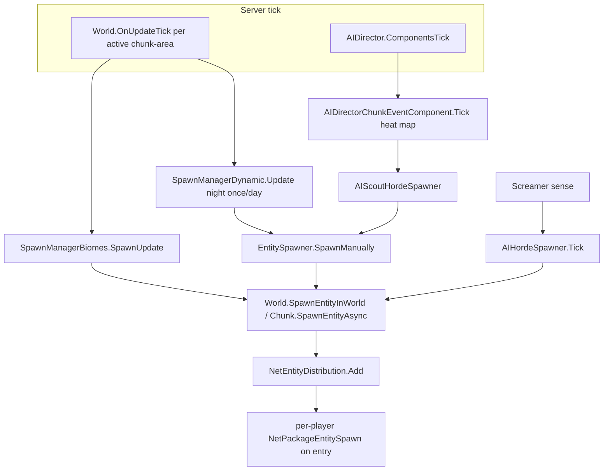
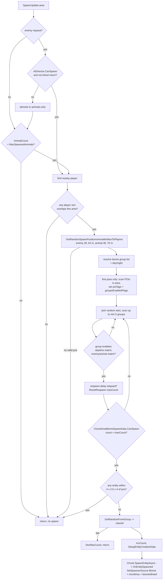
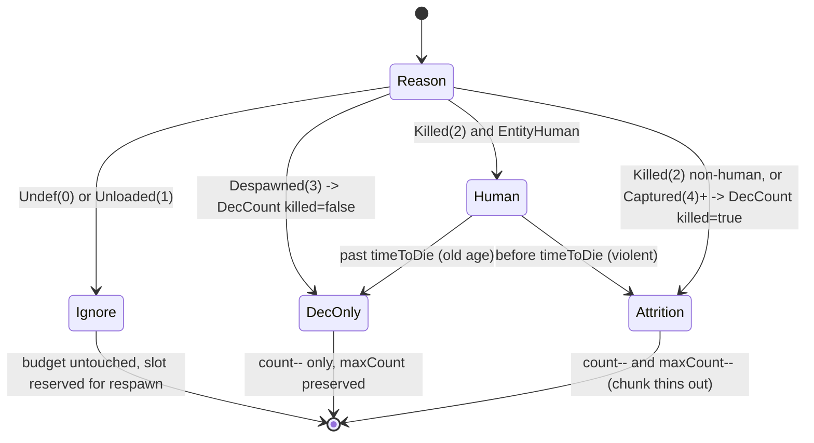
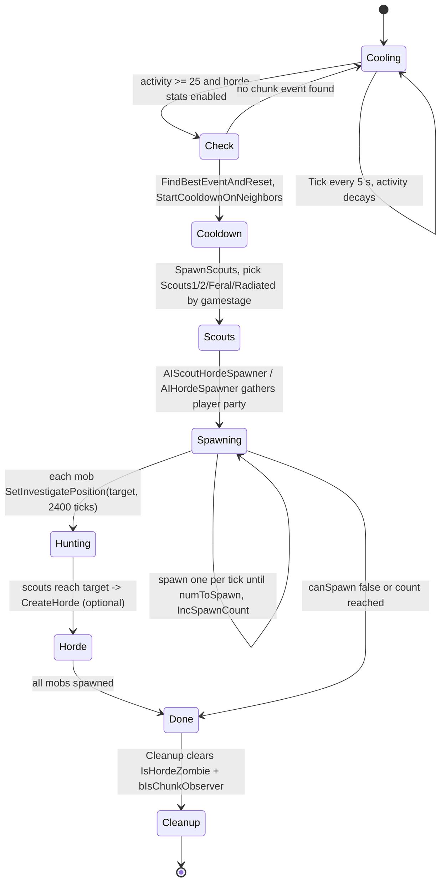
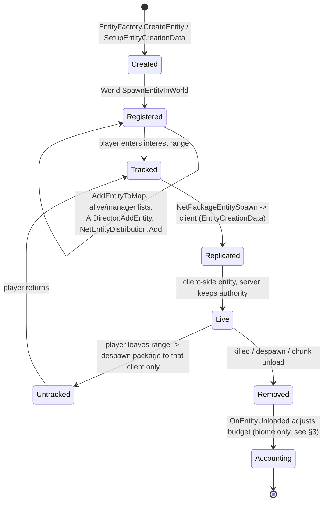

# Entity spawning subsystem (dedicated V3.1.0)

**Owns:** how entities are placed INTO the world: the spawn-manager family
(`SpawnManagerBiomes`, `SpawnManagerDynamic`, `SpawnManagerAbstract`), the
per-chunk-area biome budget (`ChunkAreaBiomeSpawnData`), the wave/static/sleeper
spawner (`EntitySpawner`), the chunk-heat scout and screamer hordes
(`AIDirectorChunkEventComponent`, `AIHordeSpawner`), player spawn points
(`SpawnPointList`), and prefab placement (`DynamicPrefabDecorator`). Also: how a
decided spawn becomes a live entity and reaches clients.
**Not:** the per-entity tick, AI decisions, or pathfinding once an entity exists
(those are [`entity-ai.md`](entity-ai.md)); the blood-moon and wandering-horde
director components themselves ([`aidirector.md`](aidirector.md)); the
`NetPackageEntitySpawn` wire layout ([`protocol-packages.md`](protocol-packages.md) §5.1);
XML spawn content (data, not loop IL).
**Evidence:** `SpawnManagerBiomes`, `SpawnManagerDynamic`, `EntitySpawner`,
`AIHordeSpawner`, `ChunkAreaBiomeSpawnData`, `AIDirectorChunkEventComponent`,
`SpawnPointList`, `DynamicPrefabDecorator` IL (global namespace; dump locally by
type name with `tools/bin/DumpMethod`, git-ignored).
**Hub:** [`INDEX.md`](INDEX.md). **Method:** [`re-methodology.md`](re-methodology.md).

This is authoritative server logic: every spawn decision below runs on the
dedicated host. Clients never decide spawns; they receive the resulting entity
through interest management (§7).

---

## 1. Architecture: five spawn sources, one placement path

Spawning is not a single system. Five independent drivers each decide "what,
where, when", then all funnel through the same two placement calls
(`World.SpawnEntityInWorld` or the async `Chunk.SpawnEntityAsync`) and tag the
new entity with an `EnumSpawnerSource` so the correct accounting owner can later
decrement its budget.

| Driver | Type | Trigger | Source tag | Budget owner |
|---|---|---|---|---|
| Biome wandering spawns | `SpawnManagerBiomes` | per active chunk-area, from `World.OnUpdateTick` | `Biome` (1) | `ChunkAreaBiomeSpawnData` |
| Dynamic night spawns | `SpawnManagerDynamic` | once per in-game day, night only | `Dynamic` (3) | `EntitySpawner` wave state |
| POI / static / sleeper spawners | `EntitySpawner` | per spawner class + day + time-of-day | `StaticSpawner` (2) or `Dynamic` (3) | `EntitySpawner` wave state |
| Chunk-heat scouts + follow-up hordes | `AIDirectorChunkEventComponent` -> `AIScoutHordeSpawner` | activity heat map, 5 s cadence | `Dynamic` (3) | scout/horde list |
| Screamer-summoned horde | `AIHordeSpawner` | screamer sense event | `Dynamic` (3) | `AIDirectorGameStagePartySpawner` |

All five share the same global gate: `AIDirector.CanSpawn(1.0)`, which is simply
`GameStats.EnemyCount < GamePrefs.MaxSpawnedZombies * priority`. This is the
server-wide living-zombie cap; when it is hit, biome enemy spawns fall back to
animals-only and the horde/dynamic paths abort for the tick.

---

## 2. The biome spawn decision cycle (`SpawnManagerBiomes.SpawnUpdate`)

This is the main wandering-population loop. A "chunk-area" is a 5x5 block of
chunks: `ChunkAreaBiomeSpawnData` covers an 80 m by 80 m `Rect` anchored at the
master chunk origin. `World.OnUpdateTick` calls
`SpawnManagerBiomes.Update(name, spawnEnemies, chunkAreaSpawnData)` once per
active area, which forwards to `SpawnUpdate` unless the world is playtesting.

The single `SpawnUpdate` call decides at most ONE spawn. It is gated at every
step and returns early the instant any gate fails.

Key facts read from the IL:

- **Player gating.** For each spawned player, an 80 m by 80 m `Rect` centered on
  the player (position minus 40 on x and z) is tested against the area. If no
  player rect overlaps, the area does not spawn. Biome population therefore
  tracks players, not the whole map.
- **Blood-moon demotion.** If `AIDirectorBloodMoonComponent.BloodMoonActive`,
  the enemy request is demoted to animals-only; blood-moon enemies come from the
  director party, not the biome loop.
- **Placement ring.** Positions are drawn in a min/max distance band to the
  nearest players: 28..54 m for enemies, 48..70 m for animals, so wandering
  spawns appear off-camera but nearby. IL detail: the `maxDistance` parameter
  of `GetRandomSpawnPositionInAreaMinMaxToPlayers` is **unused** in this build
  (never read); the actual gates are the `minDistance` (`isPositionFarFromPlayers`),
  `chunk.CanMobsSpawnAtPos(localX, floor(y), localZ, false, true)`, an optional
  bedroll check, and a view-cone rejection (any player within 50 m whose
  `IsInViewCone(pos)` is true). Up to 10 random draws in the area; success
  centers on `blockPos + (0.5, GetTerrainOffset, 0.5)`.
- **Group selection.** The biome group list (`BiomeSpawnEntityGroupList`, keyed
  by biome name) is scanned from a random start for up to `min(5, count)` groups.
  A group must be enabled by POI tags, match the current `EDaytime`
  (`Any`, `Day`, `Night`), and match the enemy/animal request.
- **POI-tag enabling (once).** The first time an area is evaluated, overlapping
  prefab instances are unioned into `poiTags`, and each group's `POITags` /
  `noPOITags` set the `groupsEnabledFlags` bitmask. This is why POI-tagged
  spawn groups only fire inside the matching prefab footprints.
- **Anti-stacking.** A `GetEntitiesInBounds` over a small 4 x 2.5 x 4 box around
  the chosen position aborts the spawn if anything is already there.
- **Difficulty scaling.** Enemy `maxCount` passes through
  `EntitySpawner.ModifySpawnCountByGameDifficulty` before the respawn reset.
- **Async placement.** The spawn is created off the main flow via
  `Chunk.SpawnEntityAsync` (through `EntityAsyncManager.StartCreateEntity`); the
  completion callback runs `OnEntitySpawned`, stamping
  `SetSpawnerSource(Biome, masterChunkKey, biomeIdHash)`.

`EntityFactory.SetupEntityCreationData` builds the creation payload: the
2-arg overload (IL=10) allocates `id = nextEntityID++` and forwards with a
zero rotation; the full overloads (IL=31/36) copy `entityClass`, `id`, `pos`,
`rot`, `lifetime`, `belongsPlayerId`, `spawnById`/`spawnByName`, plus either
`itemStack = new ItemStack(itemValue, count)` or the `blockValues` /
`textureFullArrays` arrays with `itemStack.count = count`.
`EntityFactory.CreateEntityAsync(ecd)` (IL=4) is just
`CreateEntityOperation.Start(ecd, false)`. `Start` (IL=25) owns the entity-id
allocation: an `ecd.id == -1` grabs `nextEntityID++`, otherwise
`nextEntityID = max(nextEntityID, ecd.id + 1)`, then it builds the operation
and runs `LoadAssets(isSync)`.
`CreateEntity(ecd)` (IL=7) is the **sync** counterpart:
`Start(ecd, true)` then `CompleteEntity()`, returning `op.entity`; the
convenience overload (IL=17) allocates `nextEntityID++` and builds the
`EntityCreationData` via `SetupEntityCreationData(et, id, ItemValue.None, 1,
pos, rot, float.MaxValue, -1, spawnById, spawnByName)`.

**`Chunk.SpawnEntityAsync(world, ecd, onEntityCreated)` (IL=40):** refuses to
spawn onto a chunk that is mid-unload - the volatile `InProgressUnloading` flag
logs `Spawning entity onto chunk ({0},{1}) which is unloading` and returns
without creating anything. Otherwise it forwards
`world.entityAsyncManager.StartCreateEntity(ecd, callback)` and adds the
returned `EntityCreateHandle` to the chunk's `pendingEntityCreateOps`
`HashSet` (the set `Chunk.OnUnload` drains via `WaitForComplete`, so unload
never races an in-flight create).

---

## 3. Per-chunk-area caps, cooldown, and kill attrition (`ChunkAreaBiomeSpawnData`)

Each area owns a `Dictionary<idHash, CountsAndTime>` where a `CountsAndTime` is
`{ count, maxCount, delayWorldTime }` per spawn group. This is the biome budget,
and it persists: it is written into the chunk's `ChunkCustomData` blob
(`BeforeWrite` -> `write`), so a chunk remembers its spawn state across
save/load.

| Operation | Effect |
|---|---|
| `CanSpawn(idHash)` | true only if `count < maxCount` |
| `IncCount` | on spawn: `count++`, mark chunk modified |
| `DecCount(idHash, killed=false)` | despawn: `count--` (floored at 0) |
| `DecCount(idHash, killed=true)` | kill: `count--` AND `maxCount--` (attrition) |
| `DecMaxCount` | group produced no valid class: `maxCount--` |
| `ResetRespawn(idHash, world, maxCount)` | set `maxCount`, arm `delayWorldTime = now + respawnDelay * rand(0.9, 1.1)` |
| `DelayAllEnemySpawningUntil` | push all enemy groups' delay forward (used to suppress enemies) |
| `IsSpawnNeeded(biomes, worldTime)` (IL=57) | false if biome/group list missing; true if any group missing from `entitesSpawned`, or `count < maxCount`, or `worldTime > delayWorldTime`; else false (all groups full and still delayed) |

The persisted blob is a versioned stream (header byte 2 = version, then a
count byte capped at **255**, then per entry: `int32` idHash, `uint16` packed
`(maxCount << 8) | count`, `uint64 delayWorldTime`). `read` clears the dict
first and, for a version-1 stream, reads and discards the legacy entries
(string key + the same uint16/uint64). `BeforeWrite` (IL=32) allocates a pooled
`MemoryStream`/`BinaryWriter` (`MemoryPools.poolMemoryStream` /
`poolBinaryWriter`), runs `write`, and stores `ccd.data = ms.ToArray()` into the
chunk's `ChunkCustomData`, so the budget rides the chunk save blob with no extra
region field.

**`EntitySpawner.resetRuntimeVariables` (IL=19):** zero `totalSpawnedThisWave`,
both delay timers, clear `entityIdSpawned`, `currentWave=0`,
`numberToSpawnThisWave=0`. **`ResetSpawner`** just calls that.
**`get_CurrentWave`:** field `currentWave`.

**`World.CanPlayersSpawnAtPos(pos, allowAir)` (IL=25):** resolve chunk; else
false; `Chunk.CanPlayersSpawnAtPos(local, allowAir)`.

**`Chunk.CanPlayersSpawnAtPos(x,y,z, allowAir)` (IL=76):** y must be in
**[2, 251]**. Below block (`y-1`) must `CanPlayersSpawnOn`. Cell and above
(`y+1`): fail if solid collide-movement space, or water at cell. Floor: if
`allowAir` and below is air (blockID 0) OK; else below must `IsCollideMovement`.

**`World.FindRandomSpawnPointNearRandomPlayer(maxLight, ref x,y,z)` (IL=64):** no
players → zeros and false; else pick a random player (decrementing counter walk)
and `FindRandomSpawnPointNearPlayer(..., maxDist=**32**)`.

**`World.GetClosestLocalPlayer(pos)` (IL=45):** primary local player, or min
sqr-dist among `m_LocalPlayerEntities` when more than one.

**`World.GetPlayersAround(pos, radius, list)` (IL=38):** add players with
`GetDistanceSq ≤ radius²` (reverse walk).

**`World.GetEntitiesAround(mask, pos, radius, list)` (IL=65):** chunk-range
scan (pos±radius)/16; each chunk `GetEntitiesAround` with flag mask.

**`Chunk.GetEntitiesAround(mask, pos, radius, list)` (IL=92):** y-band of entity
list buckets 0..15; flag match and `GetDistanceSq ≤ radius²`.

**`World.FindRandomSpawnPointNearPlayer(player, maxLight, ref xyz, maxDist)`
(IL=18):** `FindRandomSpawnPointNearPosition(player.pos, maxLight, xyz,
Vector3(maxDist×3), true, false)`.

**`World.IsLandProtectionValidForPlayer(ppData)` (IL=14):** false if
`OfflineHours > GameStats[46] * 24` (claim expires after offline days).

The despawn accounting lives in `OnEntityUnloaded`, registered as a world
delegate. It only touches `Biome`-sourced entities and reads the master chunk
back from the entity's stored spawner chunk key:

The consequence: an entity that simply leaves because its chunk **unloaded**
keeps its reserved slot (it will respawn), a **despawn** frees the slot, and a
**kill** both frees the slot and permanently lowers that group's `maxCount` for
this chunk until the respawn delay elapses and `ResetRespawn` restores it. That
is the "clear a chunk and it stays clearer for a while" behaviour, encoded as
`maxCount` attrition plus a randomized respawn timer.

Persisted wire form of `CountsAndTime` (per entry, version byte 2): `idHash:i32`,
then a packed `u16` = `(maxCount << 8) | count`, then `delayWorldTime:u64`. Both
`count` and `maxCount` are therefore clamped to a byte on disk.

---

## 4. Waves, static and sleeper spawners (`EntitySpawner`, `SpawnManagerDynamic`)

`EntitySpawner` is the general-purpose spawner behind POI/static spawners,
sleeper volumes, dynamic night spawns, and scout hordes. Its class definition
(`EntitySpawnerClass`, loaded per day from `spawning.xml`) carries the tuning:
`numberOfWaves`, `totalPerWaveMin/Max`, `totalAlive`, `delayBetweenSpawns`,
`delayToNextWave`, `spawnAtTimeOfDay`, `daysToRespawnIfPlayerLeft`,
`bAttackPlayerImmediately`, `bTerritorial` / `territorialRange`, and a
`startSound`.

`SpawnManually` is the engine. Its callbacks let each caller supply its own
precondition, spawn-position, and count-modifier, so biome, dynamic, and scout
spawners all reuse it. Per invocation it:

1. Resolves the per-day `EntitySpawnerClass`; resets runtime state if the day
   rolled over and the class is flagged to reset.
2. Enforces `numberOfWaves`, `spawnAtTimeOfDay`, `timeDelayToNextWave`, and
   `timeDelayBetweenSpawns` gates (returns early if not yet due).
3. Prunes its `entityIdSpawned` list of dead or removed entities so `totalAlive`
   reflects reality.
4. Rolls `numberToSpawnThisWave` from `totalPerWaveMin/Max` (difficulty-scaled),
   then loops spawning up to `totalAlive` currently-alive entities, one every
   `delayBetweenSpawns`.
5. Tags each new entity `StaticSpawner` (2) or `Dynamic` (3), tracks its id,
   optionally sets a revenge target and a territorial home area.
6. Starts the next wave only once alive count falls to 20 % of the wave target
   (`0.2` factor, floored at 1), arming `delayToNextWave`.

`daysToRespawnIfPlayerLeft` uses `worldTimeNextWave = now + days * 24000` ticks
(24000 ticks per in-game day) so a POI that a player abandoned repopulates on a
schedule.

**Persistence (`Write` IL=86 / `Read` IL=111):** version byte **3**, then
`position` (i32 x3), `size` (i16 x3), `triggerDiameter` (u16), class name
(string), `totalSpawnedThisWave` (i16), `timeDelayToNextWave` (f32),
`timeDelayBetweenSpawns` (f32), `entityIdSpawned` (`PList.Write`), `currentWave`
(i16), `lastDaySpawnCalled` (i32), `numberToSpawnThisWave` (i32),
`worldTimeNextWave` (u64, version > 1), `bCaveSpawn` (bool, version > 2). `Read`
falls back to `EntitySpawnerClass.DefaultClassName` with a warning when the
saved class name is not in `EntitySpawnerClass.list`.

**Wrapper + difficulty:** `Spawn(world, day, spawnEnemies)` (IL=31) is
`AIDirector.CanSpawn(1)` + `SpawnManually` with the default precondition /
position delegates. `ModifySpawnCountByGameDifficulty(count)` (IL=6) returns 0
when `!EntityFactory.EnemySpawnMode`, else the count (both wave min and max are
run through it, and the optional `ES_ModifySpawnCount` callback). The spawn
burst: `toSpawn = 1` normally, but `delayBetweenSpawns == 0` fans out
`FastMin(numberToSpawnThisWave, totalAlive - aliveCount)` per tick. First spawn
of a wave with a `startSound` plays
`PlaySoundAtPositionServer(pos, startSound, rolloff 2, range 300, 1)`;
`bAttackPlayerImmediately` sets a revenge target; `bTerritorial` sets the home
area to the spawn position.

**Class parse (`EntitySpawnerClassesFromXml.LoadEntitySpawnerClasses` IL=204):**
`name` is required (throw); `dynamic` (default false) and `wrapMode`
(`wrap` / `clamp`, each default false) set the day-index behaviour; per `<day>`
element the `value` attribute is `*` (all days), `min,max` (via
`ParseMinMaxCount`), or a single day; each day index gets a fresh
`EntitySpawnerClass` whose `<property>` children feed `DynamicProperties` +
`Init`, registered via `AddForDay`. An empty spawner throws
`Empty entityspawner not allowed: <name>`.

`SpawnManagerDynamic` is the thin night-only wrapper (**Update IL=75**):

1. Daytime or zero players → return.
2. If `WorldTimeToDays` equals `lastDaySpawned` **and** `currentSpawner` exists
   → reuse spawner; else set `lastDaySpawned`, construct new
   `EntitySpawner(name, zero, zero, 0, prior entity ids or null)`.
3. `SpawnManually(world, day, spawnEnemies, precondition lambda,
   GetSpawnPosition, null, null)` where position callback is
   `GetRandomSpawnPositionMinMaxToRandomPlayer(min=**64**, max=**96**, …)`.

**`GetRandomSpawnPositionMinMaxToRandomPlayer(min, max, bedrolls, ref player,
ref pos)` (IL=212):** require players and `max > min`. Pick random player.
Up to **10** tries: unit-circle offset scaled to [min, max] band (reject near-
zero vectors); place at player.xz + offset; height = terrain height + 1; reject
if bedroll-near (when flag), `!CanMobsSpawnAtPos`, any player within min², or
any player `CanSee` the point. Success: pos = block center + (0.5,
terrainOffset, 0.5).

**`isPositionInRangeOfBedrolls(pos)` (IL=58):** GamePrefs **160** as radius;
true if any player's bedroll spawn point is within radius².

**`EntityPlayerLocal.CheckSpawnPointStillThere` (IL=30)** is the respawn
gate: the spawn point is still valid (true) when it is `IsUndef`, its chunk
is not loaded, or the block at the spawn position is a `BlockSleepingBag`;
false only when the block exists but is no longer a bedroll - the player's
bedroll was destroyed, so their saved spawn is void.
`EntityPlayerLocal.GetSpawnPoint` (IL=24) resolves the point: an empty
`SpawnPoints` (`EntityBedrollPositionList`) yields `SpawnPosition.Undef`,
else the first bedroll position becomes `SpawnPosition(pos.ToVector3() +
(0.5, 0, 0.5), 0)` - block center with yaw 0.

**`isPositionFarFromPlayers(pos, minDist)` (IL=31):** true only if every player
has `GetDistanceSq ≥ minDist²`.

**`GetTerrainOffset(blockPos)` (IL=27):** if block below is terrain shape,
`MarchingCubes.GetDecorationOffsetY(density(pos), density(pos-up))`; else 0.

**`Chunk.CanMobsSpawnAtPos(x,y,z, ignoreCanMobsSpawnOn, checkWater)` (IL=94):**
y in **[2, 251]**; reject trader area; unless checkWater, reject water at y-1;
below must `CanMobsSpawnOn` (unless ignore) and `IsCollideMovement`; cell and
y+1 must not be solid collide space; if checkWater reject water at cell.

**`Chunk.FindRandomTopSoilPoint(world, ref xyz, numTrys)` (IL=80)** tries up
to `numTrys` random cells: `y = GetHeight(x, z)` must be >= 2 and pass
`CanMobsSpawnAtPos(x, y, z, false, true)`, then returns the **world** coords
with `y + 1` (above terrain). `FindRandomCavePoint(world, ref xyz, numTrys,
relMinY)` (IL=95) is the cave variant: it walks `y` **down** from the terrain
height while `y > 2 && y > relMinY` (the `relMinY` bound is enforced via a
`y - relMinY <= 0` break), accepting the first `CanMobsSpawnAtPos` cell at
`y + 1`.

**`Chunk.IsPositionOnTerrain` (IL=18):** y ≥ 1 and shape below is terrain.

Its own `currentSpawner` is serialized, so a day's dynamic spawn progress
survives a restart.

**`EntitySpawner.Write`/`Read`** (IL=86/111) define the spawner blob: version
byte **3**, `position` (3x int32), `size` (3x int16), `triggerDiameter`
(uint16), `entitySpawnerClassName` (string), `totalSpawnedThisWave` (int16),
`timeDelayToNextWave` (float), `timeDelayBetweenSpawns` (float),
`entityIdSpawned` (`PList<int>`), `currentWave` (int16), `lastDaySpawnCalled`
(int32), `numberToSpawnThisWave` (int32); version >= 2 appends
`worldTimeNextWave` (uint64) and version >= 3 appends `bCaveSpawn` (bool).
`Read` validates the class name against `EntitySpawnerClass.list`, warning
`Entity spawner at pos <pos> contains invalid spawner class reference '<name>'`
and falling back to `DefaultClassName.name`. `ModifySpawnCountByGameDifficulty`
(IL=6) is the `EntityFactory.EnemySpawnMode` gate: the count unchanged when
enemy spawning is enabled, else 0.

`Spawn(world, day, spawnEnemies)` (IL=31) is the default wrapper around
`SpawnManually`: it returns early unless `AIDirector.CanSpawn(1.0)` and then
calls `SpawnManually` with the two stock callbacks. The stock precondition
(`<Spawn>b__0`, IL=206) starts with a null target and, when the day class sets
`bIgnoreTrigger`, returns true immediately with
`GetClosestPlayer(spawnerPos, 0, 160.0)` as the target when
`bAttackPlayerImmediately`; otherwise it scans players and accepts when one is
close enough to the trigger box. The stock position callback (`<Spawn>b__1`,
IL=67) sets the target and, for `bCaveSpawn`, uses
`FindRandomSpawnPointNearPositionUnderground(pos, 16, ...)` (failure -> zero
pos, false), else the ground variant honoring the day class's `bSpawnOnGround`.

---

## 5. Chunk-heat scouts and screamer hordes (state machine)

Sustained activity (noise, digging, combat) raises a per-region heat value.
`AIDirectorChunkEventComponent` keeps an `activeChunks` map of
`AIDirectorChunkData` keyed by the same 5x5-chunk region key, decays it, and
every 5 s (`spawnDelay`) runs `CheckToSpawn`. When a region's `ActivityLevel`
crosses 25 (and the `ZombieHordeMeter` and `IsSpawnEnemies` game stats are set),
it spawns a scout party toward the hot spot; scouts that reach the player can in
turn create a follow-up horde. `AIHordeSpawner` is the closely related
screamer-triggered variant: it logs `Screamer spawned ...` and pulls a
gamestage-scaled group toward a target position.

Heat is added through `NotifyEvent(chunkEvent)` (IL=22): it resolves the
region data via `GetChunkDataFromPosition(event.Position, true)` and, when the
data is ready, `AddEvent` and pushes it onto the pending `checkChunks` list.
`StartCooldownOnNeighbors(position, isLong)` (IL=55) converts the position to
the 5x5 region grid (`toChunkXZ / 5`), walks the static `neighbors` offset
table (pairs of ints), get-or-creates the `AIDirectorChunkData` for each
neighbor key, and calls `StartNeighborCooldown(isLong)` on it.

The component's `activeChunks` heat map is persisted with the WorldState:
`Write` (IL=33) emits version **1** (int32), the entry count, then per entry
the region key (`int64`) followed by `AIDirectorChunkData.Write`; `Read`
(IL=37) only parses it when the outer WorldState version is >= **5**, clears
the map, and rebuilds each `AIDirectorChunkData` through its own `Read`.

`AIDirectorChunkData` is the per-region heat cell. `AddEvent` (IL=46) merges
an event into the `events` list (same-kind events fold their `Value` into the
existing entry and refresh its `Duration`; new kinds append) and adds
`event.Value` to `activityLevel`. `DecayEvents(elapsed)` (IL=61) re-accumulates
`activityLevel` from the surviving events, shrinking each event by
`Value -= Value * (elapsed / Duration)` and `Duration -= elapsed`, dropping
entries at zero. `Tick(elapsed)` (IL=23) counts a cooldown down
(`cooldownDelay -= elapsed`, returns true while active) and otherwise decays
and returns `EventCount > 0`. `FindBestEventAndReset` (IL=44) returns the
highest-`Value` event, arms `cooldownDelay = 240`, and clears the list;
`StartNeighborCooldown(isLong)` (IL=13) raises it to `max(current, 180)` or
`720`; `SetLongDelay` (IL=4) pins it to 1320; `IsReady` is
`cooldownDelay == 0`. Its blob (Write IL=35 / Read IL=36) is version **2**:
activityLevel (float), event count, per-event `AIDirectorChunkEvent.Write`,
then cooldownDelay (float, version >= 2 only). Each `AIDirectorChunkEvent` payload
(Write IL=32 / Read IL=39) is version **2**: `Position` (3x int32), `Value`
(float), `EventType` (byte), `Duration` (float); reads before version 2 skip
`Duration` and discard a legacy `uint64` instead.

Facts from the IL:

- **Gamestage selection.** `SpawnScouts` reads `CalcGameStageAround` for the
  closest player within 120 m and picks the group by thresholds:
  `Scouts1` (&lt; 45), `Scouts2` (&lt; 85), `ScoutsFeral` (&lt; 125),
  `ScoutsRadiated` (otherwise). A 20 % roll upgrades to the feral/long-cooldown
  variant and applies a longer neighbor cooldown.
- **Party sizing.** `AIHordeSpawner` gathers players inside its search bounds as
  members of an `AIDirectorGameStagePartySpawner`, which sets the group name and
  the `numToSpawn` budget from party gamestage.
- **Placement.** For the **screamer path** (`AIHordeSpawner.Tick`), mobs spawn at
  45/55/45 m (day) or 55/70/55 m (night) via `GetMobRandomSpawnPosWithWater`
  (`IsDaytime()`-branched). The **chunk-heat scout spawner** uses different
  constants (`0/8/10`, no day/night branch) in its `SpawnUpdate` position callback.
  Spawned mobs are tagged `Dynamic`, flagged
  `IsHordeZombie` and `bIsChunkObserver` (so they keep their own chunk loaded),
  and are pointed at the target with `SetInvestigatePosition(target, 2400)`.
- **Teardown.** When a spawner reports finished, `TickActiveSpawns` calls
  `Cleanup`, which clears `IsHordeZombie` and `bIsChunkObserver` on every mob so
  they revert to normal despawn rules, then removes the spawner from its list.

Blood-moon and wandering hordes proper are separate director components
(`AIDirectorBloodMoonComponent`, `AIDirectorWanderingHordeComponent`); their
lifecycle is owned by [`aidirector.md`](aidirector.md). This subsystem owns only
the chunk-heat and screamer spawners above.

---

## 6. Player spawn points (`SpawnPointList`)

`SpawnPointList` holds the world's fixed player start positions.
`GetRandomSpawnPosition(world, refPos, minDistance, maxDistance)`:

- With no reference position, returns a uniformly random point.
- With a reference (respawn near bedroll or death), it makes up to 100 tries for
  a point in the `[minDistance, maxDistance]` ring; if none qualifies it falls
  back to the nearest point by squared distance, or `SpawnPosition.Undef` if the
  list is empty.

The list is built at world load (`GameManager.setSpawnPointListCo`) and is the
player-only counterpart to the entity spawners above.

**`World.GetRandomSpawnPointPositions(count)` (IL=74)** is the random-surface
sampler: it allocates `Vector3[count]` and iterates a copy of the loaded chunk
array, each pass rolling `RandomRange(chunkCount) == 1` (about one in
`chunkCount`); a hit grabs the chunk's 8 neighbors and
`Chunk.FindRandomTopSoilPoint(world, out x, out y, out z, 5)` stores a world
position in the array, decrementing `count` until it reaches 0. Unfilled array
slots stay `Vector3.zero`.

`Chunk.FindRandomTopSoilPoint(world, out x, out y, out z, numTrys)` (IL=80)
retries up to `numTrys` times: local `x, z = RandomRange(15)` (0..14),
`y = GetHeight(x, z)`, rejecting `y < 2` and any spot failing
`CanMobsSpawnAtPos(x, y, z, false, true)`; a hit returns world
`x + m_X*16, y + 1, z + m_Z*16` (one block above the surface), false when
exhausted.

**`Chunk.FindSpawnPointAtXZ(x, z, out y, maxLightV, darknessV, startY, endY,
ignoreCanMobsSpawnOn)` (IL=54)** is the per-column spawn probe: clamp `endY`
and `startY - 1` to `[1, 255]`, start `y = endY`, and scan downward while
`y > startY`. A column position is accepted when
`GetLightValue(x, y, z, darknessV) <= maxLightV` and
`CanMobsSpawnAtPos(x, y, z, ignoreCanMobsSpawnOn, true)`; on acceptance the
returned `y` is one block above the surface (the stored `y + 1`), false when
the scan bottoms out.

**`Chunk.FindRandomCavePoint(world, out x, out y, out z, numTrys, relMinY)`
(IL=95)** is the underground sampler: it starts `y` at the surface height and
scans downward at most `relMinY` blocks (stopping above `y = 2`), accepting the
first `CanMobsSpawnAtPos(x, y, z, false, true)` spot and returning the world
position one block above it; false after `numTrys` failed columns.

**`World.FindRandomSpawnPointNearPositionUnderground(pos, maxLightValue, out
x, out y, out z, maxDistance)` (IL=135)** samples up to 5 random `(x, z)`
within `maxDistance / 2` of `pos`; for each, it prefers the exact `pos.y`
inside the `[pos.y - maxDistance.y/2, pos.y + maxDistance.y/2]` band when
`CanMobsSpawnAtPos` passes, else falls back to
`Chunk.FindSpawnPointAtXZ(lx, lz, ref y, maxLightValue, 0, yMin, yMax, false)`
(the dark-column scan above). Non-playfield chunks are skipped; false when all
tries fail.

### 6.1 `World.GetRandomSpawnPositionMinMaxToPosition` (IL=240)

Ring/disc spawn sampler shared by the join path (spawn-near-friend, see
[protocol.md](protocol.md) post-spawn), trader respawn
([loot-economy.md](loot-economy.md)) and scout placement
([aidirector.md](aidirector.md)). Signature
`(target, minRange, maxRange, minPlayerRange, checkBedrolls, out pos,
forPlayerEntityId, checkWater, retryCount, checkLandClaim, maxLandClaimType,
useSquareRadius)`.

1. `pos = zero`; `range = maxRange - minRange`; `range <= 0` → false.
2. If `checkLandClaim`: `playerData =
   persistentPlayers.GetPlayerDataFromEntityID(forPlayerEntityId)` (IL=10:
   `EntityToPlayerMap.TryGetValue`; null when the list is missing or id
   unmapped).
3. Try up to `retryCount` times:
   - **Square mode:** `dx, dz = rand.RandomRange(-minRange, minRange+1)` (uniform
     in `[-minRange, minRange]`), re-rolled while `|dx|` or `|dz|` ≥ `maxRange`
     (only binds when `maxRange <= minRange`). `pos = target + (dx, 0, dz)`.
   - **Circle mode:** `v = rand.RandomInsideUnitCircle() * range`, re-rolled
     while `v.sqrMagnitude < 0.01`; then `v = v + (maxRange / |v|) * v`, so the
     radial distance lands in `(maxRange, maxRange + range]`.
     `pos = target + (v.x, 0, v.y)`.
   - `blockPos = worldToBlockPos(pos)`; null chunk → next try.
   - `blockPos.y = chunk.GetHeight(bx, bz) + 1`; `pos.y = blockPos.y`.
   - Reject when: `checkBedrolls && isPositionInRangeOfBedrolls(pos)`; or
     `forPlayerEntityId == -1` ? `!chunk.CanMobsSpawnAtPos(bx, floor(y), bz,
     false, checkWater)` : `!chunk.CanPlayersSpawnAtPos(bx, floor(y), bz,
     false)`; or (player path) `!chunk.IsPositionOnTerrain(bx, blockPos.y, bz)`;
     or `GetPOIAtPosition(pos)` non-null (no POI overlap); or
     `checkWater && chunk.IsWater(bx, blockPos.y - 1, bz)`; or
     `checkLandClaim && GetLandClaimOwner(blockPos, playerData) >
     maxLandClaimType`.
   - Require `isPositionFarFromPlayers(pos, minPlayerRange)`.
   - Accept: `pos = blockPos.ToVector3() + (0.5, GetTerrainOffset(blockPos) +
     0.5, 0.5)`; return true.
4. Tries exhausted: `pos = zero`, return false.

### 6.2 `EntityPlayer.IsSafeZoneActive` (IL=14)

`Level <= GamePrefs.GetInt(EnumGamePrefs.PlayerSafeZoneLevel)` **and**
`spawnPoints.Count == 0`. The spawn safe zone applies only to players still at
or below the `PlayerSafeZoneLevel` cap who have not claimed a bedroll spawn;
past the level or with a bedroll set, the flag is off.

**The protection is a chunk-level spawn lock.** `EntityPlayer.onSpawnStateChanged`
(IL=52) runs base, `SetVisible(Spawned)`, zeroes `SpawnedTicks`, and for the
respawn reasons `NewGame` (0), `Died` (2), and `EnterMultiplayer` (4), when the
world is not remote or editor and `IsSafeZoneActive()`, calls
`World.LockAreaMasterChunksAround(worldToBlockPos(position), worldTime +
PlayerSafeZoneHours * 1000)` (the `PlayerSafeZoneHours` game-pref window in
game-hours).

`World.LockAreaMasterChunksAround(blockPos, worldTimeToLock)` (IL=71) walks a
5x5 grid of area-master chunks around the point (offsets `dx, dz` in
[-2, 2] x **80** blocks, resolved via `Chunk.ToAreaMasterChunkPos`): a loaded
chunk with `ChunkAreaBiomeSpawnData` gets
`spawnData.DelayAllEnemySpawningUntil(worldTimeToLock, Biomes)` (and sets
`isModified`); a not-yet-loaded chunk is recorded in `areaMasterChunksToLock`
(key → lock time) to apply when it loads. After the hook,
`lastRespawnReason` is normalized to `Unknown` (6) unless it was `Teleport`
(3). The client `EntityPlayerLocal` override (IL=35) only feeds the
FP-controller.

**The 5-chunk grid:** `Chunk.ToAreaMasterChunkPos(pos)` (IL=19) snaps the
chunk coords onto the grid (`toChunkXZ(x)/5*5`, y via `toChunkY`, `z` same -
80-block cells); `IsAreaMaster()` (IL=14) is `m_X % 5 == 0 && m_Z % 5 == 0`;
`IsAreaMasterCornerChunksLoaded(cc)` (IL=44) requires the four `±2` corner
chunks loaded; `IsAreaMasterDominantBiomeInitialized(cc)` (IL=107) computes
`AreaMasterDominantBiome` from the 5x5 neighborhood's dominant-biome
histogram when it is still the 255 sentinel.
`Chunk.GetChunkBiomeSpawnData()` (IL=40) requires that biome sentinel to be
set and lazily builds `biomeSpawnData` (persisted through the `bspd.main`
`ChunkCustomData` slot); `Chunk.IsTraderArea(x, z)` (IL=22) is
`world.IsWithinTraderArea(worldPosIMin + (x, 0, z))`.

---

## 7. From decision to entity to client

A decided spawn becomes a networked entity through one path, and interest
management (not the spawner) decides who sees it.

Client place requests arrive as `NetPackageRequestToSpawnEntity` →
`GameManager.RequestToSpawnEntityServer` (falling-tree dedupe, backpack
persistent record, then `EntityFactory.CreateEntity` +
`World.SpawnEntityInWorld`). See [protocol-packages.md](protocol-packages.md)
section 5.0.

**`EntityFactory.SetupEntityCreationData` (ECD builder):** the rich overload
(IL=31) fills `entityClass`, `id`, `itemStack = ItemStack(itemValue, count)`,
`pos`/`rot`, `lifetime`, `belongsPlayerId`, `spawnById`, `spawnByName`. The
falling-block overload (IL=36) additionally fills `blockValues` /
`textureFullArrays` and drops `itemValue` (count lands on `itemStack.count`).
The `(et, id, pos, rot)` convenience (IL=12) passes `ItemValue.None`, count
**1**, lifetime `float.MaxValue`, player/spawn id **-1**, empty spawn name. The
`(et, pos[, rot])` variants (IL=10) allocate `EntityFactory.nextEntityID++`
before delegating. `CreateEntity(ecd)` (IL=7) is a thin wrapper:
`CreateEntityOperation.Start(ecd, true)` + `CompleteEntity()` (async variant
starts with `false`; the operation is polled by `TryComplete`).

**`CreateEntityOperation.Start(ecd, isSync)` (IL=25):** `ecd.id == -1` →
`ecd.id = nextEntityID++`; else `nextEntityID = max(nextEntityID, ecd.id + 1)`
(advance past an explicit id); `new CreateEntityOperation(ecd).LoadAssets(isSync)`
(async asset load; `CompleteEntity` runs when both asset sets report complete).

**`CreateEntityOperation.LoadAssets(isSync)` (IL=100):** resolve
`ec = EntityClass.GetEntityClass(ecd.entityClass)` (unknown → error); apply
**max-tier substitution** `ec = GetEntityClassWithinMaxTier(ec,
EntityFactory.MaxEntityTier)` (a class above the server max tier is replaced;
none available → error) and rewrite `ecd.entityClass =
GetId(ec.entityClassName)`. `isPlayer` = class is `playerMaleClass`/
`playerFemaleClass`; `isLocalPlayer` = player with `ecd.id ==
ecd.belongsPlayerId`. Kick `EntityInstanceAssets.Load(isSync, ec,
isLocalPlayer)` and `EModelInstanceAssets.Load(isSync, ecd, ec)`.

**Class lookup leaves (V3.1.0 b14):** `EntityClass.GetEntityClass(id)` (IL=7)
is `list.TryGetValue` (null when absent). `GetEntityClassName(id)` (IL=10)
returns the class's `entityClassName` or the string `"null"` when missing.
The class **id is the name's hash**: `FromString(name)` (IL=3) is
`name.GetHashCode()` and `Add(name, ec)` (IL=9) registers under that hash after
storing `entityClassName`. `GetId(name)` (IL=30) linear-scans the dict for the
matching class name (-1 when absent). `Cleanup()` (IL=3) clears the registry.

**Class drop + tier leaves:** `AddDroppedId(event, name, minCount, maxCount,
prob, stickChance, toolCategory, tag)` (IL=33) appends a `SItemDropProb` to the
event's `itemsToDrop` list (lazy-created). `LootDropPick(rand)` (IL=44) returns
the first entry when fewer than two drops, else a cumulative weighted pick over
`lootDrops[].weight`. `CalculateEntityTier()` (IL=49) derives the tier purely
from tags: `elite -> Elite (5)`, `radiated -> Radiated (4)`, `feral -> Feral
(3)`, `special -> Special (2)`, `strong -> Strong (1)`, else `Normal (0)`.
`ParseEntityFlags(names, ref flags)` (IL=49) ORs comma-split `EntityFlags`
names via `TryParse` (single name when no comma). `CopyFrom(other, exclude)`
(IL=171) copies the other class's `DynamicProperties` (Values / Params1 /
Params2 / Data, skipping excluded keys, with a deep `Classes` copy) - the class
variant / mod inheritance mechanism.

**Tier substitution:** `GetEntityClassWithinMaxTier(ec, maxTier)` (IL=30):
`ec.EntityTier <= maxTier` → as-is; else walk the `GetPreviousTierEntity()`
chain until a class at/below `maxTier` (warning + null if the chain ends).
`GetPreviousTierEntity()` (IL=73) lazily resolves `PreviousTierZombieName`
(comma-separated class names, the `PreviousTierZombie` config from
`EntityClass.Init`) into `previousTierEntities`; one entry → it, several → a
random one via the world GameRandom. So a max-tier-limited server (sandbox
`EntityFactory.MaxEntityTier`) degrades out-of-range zombies to their
configured lower-tier replacements.

**`CreateEntityOperation.CompleteEntity()` (IL=639)** builds the entity object:
1. **Asset gates:** both `EntityInstanceAssets` and `EModelInstanceAssets` must
   be load-complete and load-successful; the operation runs once (entity null).
   Failures log `CreateEntityOperation cannot complete {0}, ...` and return.
2. Instantiate the class prefab, position = `ecd.pos - Origin.position`, keep
   the `GameObject` child when present.
3. **Player path** (`isPlayer`): local →
   `addEntityComponent(ec.classname.FullName + "Local")` + `LocalPlayer`
   component; remote → `addEntityComponent(ec.classname)` +
   `GUIHUDEntityName`. Wire `RootTransform`/`ModelTransform`/`PhysicsTransform`
   (`Graphics` child local, `Physics` child remote), `playerProfile`,
   `Entity.Init(entityClass, assets)`; non-empty `holdingItem` →
   `inventory.AddItem(ItemStack(holdingItem, 1))` + `SetHoldingItemIdx(0)`;
   `TeamNumber`; `SetSkinTexture`; parent + name `Player_{id}`; log.
4. **Item path** (`entityClass == itemClass`): `EntityItem`; `clientEntityId`,
   `OwnerId = belongsPlayerId`; parent `Items`; name `Item_{id}`;
   `SetItemStack`.
5. **Falling blocks:** single (`fallingBlockClass`) → `EntityFallingBlock` with
   `SetBlockValue(blockValues[0])` + `SetTextureFull(textureFullArrays[0])`;
   group (`fallingBlocksClass`) → `EntityFallingBlocks` with
   `SetBlockGroupData(blockPositions, blockValues)` + `SetTextureFullArrays`;
   tree (`fallingTreeClass`) → `EntityFallingTree` with
   `SetBlockPos(blockPos, fallTreeDir)`; parents `FallingBlocks` /
   `FallingTrees`, names `FallingBlock_{id}`.
6. **Generic path:** `ec.classname == null` → log `Unknown entity {id}` +
   return; `addEntityComponent(classname)` (IL=5/11: `Type.GetType` then
   `gameObject.AddComponent(type)` cast to `Entity`, null for a bad type);
   `rot` euler, `entityId`, Init;
   pref **44 (`DebugMenuShowTasks`)** → `GUIHUDEntityName` when `EntityAlive`;
   parent when `parentGameObjectName` set; name `{entityClassName}_{id}`,
   `SetEntityName` (`EntityAlive.SetEntityName` IL=20: store, mark
   `bPlayerStatsChanged` when server-owned, `HandleSetNavName` which mirrors
   the name onto the NavObject, IL=9);
   `SetSkinTexture`; collider layers: capsule colliders → **14**
   unless tagged `LargeEntityBlocker`/`Physics`; box colliders → **14**.
7. **Convergence:** `ecd.ApplyToEntity(entity)`; spawner source
   `EnumSpawnerSource.Delete (4)` → `Destroy(gameObject)` + return; `lifetime`,
   `entityId`, `belongsPlayerId`, `InitLocation(pos, rot)`, `onGround`;
   `SetScale(ec.SizeScale)` when ≠ 1, then `SetScale(ecd.overrideSize)` when
   ≠ 1; `SetHeadSize(ecd.overrideHeadSize)` when `EntityAlive` and ≠ 1;
   `PostInit()`; store `entity`.

**`ecd.ApplyToEntity(e)` (IL=176) detail:** `EntityAlive` first: `SetStats`
when present; `Health <= 0 → HasDeathAnim = false`; `SetDeathTime`; `setHomeArea`;
then per kind: `EntityPlayer` gets `playerProfile`, `EntityAlive` gets
`bodyDamage`, `IsSleeper`, `IsSleeperPassive` (sleeper only),
`CurrentHeadState(headState)`, `IsDancing`; every entity gets
`spawnByAllowShare` / `spawnById` / `spawnByName`; `EntityTrader` gets
`TraderData = (traderData ?? new TraderData()).Clone()`; a `sleeperPose != 255`
triggers `TriggerSleeperPose(pose, false)`; `EntityDrone` gets
`OnApplyToEntity(orderState)`; `StressAmount`; `SetSpawnerSource`; the bag is
cloned onto the entity. Finally the `entityData` blob (when non-empty) is
rewound and `e.Read(readFileVersion, reader)` feeds the entity-specific extra
fields (exceptions log `Error loading entity`).

**ECD XML + copy leaves:** `readXml(element)` (IL=47) requires `type` /
`position` / `rotation` attributes (missing → throw `No 'type' element found in
entity tag!` etc.), resolves `EntityClass.FromString(type)`, parses the two
vectors, and sets `id = -1`. `writeXml(StreamWriter)` (IL=88) emits
`<entity type="<class>" position="x,y,z" rotation="x,y,z" />` with
culture-invariant floats. The copy ctor (IL=208) clones every field (stats,
body damage, bag, profile, entityData stream, class-specific arrays);
`ToString` (IL=41) is `<class> <entityName> id=<id> pos=<pos>`.

`World.SpawnEntityInWorld` (**IL=178**) order:

1. Null entity → warn and return.
2. `EntityLoadedDelegates` invoke if set.
3. `AddEntityToMap` + `Entities.Add(id)` + `addToChunk`.
4. Non-player `EntityAlive` → append `EntityAlives`.
5. Server only: track vehicle/drone/turret managers; turret without item class
   `InitDynamicSpawn`.
6. `audioManager.EntityAddedToWorld`, `WeatherManager`, `LightManager`,
   `entity.OnAddedToWorld` (`EntityAlive.OnAddedToWorld` IL=27: non-local →
   `OcclusionManager.AddEntity(this, 7)`; `m_addedToWorld = true`; not remote →
   `bSpawned = true`; non-player → `FireEvent(MinEvent 61, true)`; then
   `StartStopLivingSound()`). `Entity.IsSpawned()` (IL=2) is always true on
   the base; `EntityAlive.IsSpawned()` (IL=3) reads the `bSpawned` flag set
   here.
7. Warn if `position.y < 1`.
8. Server: `entityDistributer.Add`; if player bump `Players` +
   `playerEntityUpdateCount`; else if EntityAlive `Spawned = true`.
9. Server: `aiDirector.AddEntity`.

It does **not** broadcast a spawn package. The replication layer (`NetEntityDistribution`,
[`entity-ai.md`](entity-ai.md) §9) walks players against tracked entities by
distance and view angle and emits `NetPackageEntitySpawn` (an
`EntityCreationData` payload, [`protocol-packages.md`](protocol-packages.md) §5.1)
to each player only when the entity enters that player's set, and a delete when
it leaves. This is the observer/player-gating for spawned entities: spawns are
decided near players (§2, §5) and replicated per player on demand, so cost
scales with players by tracked entities, not with total world population.

Biome spawns additionally run through the async creator
(`Chunk.SpawnEntityAsync` -> `EntityAsyncManager`), which safely refuses to
spawn onto a chunk that is unloading.

**Removal side:** `World.RemoveEntity(id, reason)` (IL=16) resolves the entity
via `GetEntity` and, when present, runs `MarkToUnload()` then
`unloadEntity(entity, reason)` (the deferred unload path the tick loop drains).
`World.RemoveEntityFromMap(entity, reason)` (IL=123) is the map-icon removal:
it clears the client map-area vehicle/drone waypoints (local-player-owned
only, on reason 1/2/3) and calls `ObjectOnMapRemove(type, entityId)`; the
`MapObjectType == 13` special case only removes when `reason == 2`.

---

## 8. Prefab placement context (`DynamicPrefabDecorator`)

`DynamicPrefabDecorator` is the world's prefab (POI) registry, not an entity
spawner, but it is what makes POI-gated spawning and sleeper volumes possible.
`DecorateChunk` looks up the prefab instances overlapping a chunk
(`GetPrefabsAtXZ`, sorted by size) and stamps each into the chunk
(`PrefabInstance.CopyIntoChunk`), which is what brings a POI's sleeper volumes
and block data into the world. The same `GetPOIsAtXZ` / prefab-tag surface is
what `SpawnManagerBiomes` reads to compute an area's `poiTags` (§2). Trader
areas, quest-POI selection, and volume ownership all hang off this registry.

Sleeper volumes themselves tick in `SleeperVolume.Tick`
([`entity-ai.md`](entity-ai.md) §10, D8); this doc's role is to note that the
sleeper population enters the world through prefab placement here, then through
`EntitySpawner` (§4) when a player trips the volume.

**`PrefabInstance` leaf helpers:** `GetCenterXZ()` (IL=24) is
`(bboxPos.x + bboxSize.x * 0.5, bboxPos.z + bboxSize.z * 0.5)` as a `Vector2`
(the POI center used for trader-area / quest-distance math).
`IsBBInSyncWithPrefab()` (IL=24) is true only when the prefab was copied into
the world and the recorded `lastCopiedPrefabPosition`, `boundingBoxSize` vs
`prefab.size`, and `lastCopiedRotation` all still match the live fields
(edits that move or resize the bounding box desync it).

**Decorator leaf queries:** `chooseClosestPrefab(candidates, worldPos,
maxSearchDistanceSquared)` (IL=35) scans `(PrefabInstance, Vector2)` tuples and
returns the one with the smallest `sqrMagnitude` under the bound (shrinking the
bound as it finds closer hits), null when none qualify.
`IsEntityInPrefab(entityId)` (IL=40) holds `listsLock` and tests
`PrefabInstance.Contains(entityId)` across `allPrefabs` (the POI-association
gate behind quest/POI entity checks).

**Registry list accessors:** `GetAllPrefabs(list)` / `GetPOIPrefabs(list)`
(IL=19 each) `AddRange` the `allPrefabs` / `poiPrefabs` lists under
`listsLock`. `HasPrefabsAtXZ(xMin, xMax, zMin, zMax)` (IL=69) binary-searches
`allPrefabsSorted` from `xMin` and scans forward: true when a prefab's
padded bbox spans the query rectangle.
`GetPrefabAtPosition(position, excludeTags, requiredTags)` (IL=254) defaults
`excludeTags` to `streetTileTag` and `requiredTags` to none when null, then
binary-searches the x-sorted list for prefabs whose bbox contains the floored
position and applies the tag filters (exclude = `Test_AnySet` skip, required =
`Test_AllSet` keep); the trailing scan rule prefers a candidate whose bbox
starts at a different x from the current pick or further right.
`GetPrefabsFromWorldPosInside(pos, questTags)` (IL=83) pads `pos` by
`boundsPad`, collects the quest-tagged prefabs whose padded bbox contains it,
fans out through `GetPrefabsIntersecting` (IL=114, the parent plus every
smaller-footprint prefab whose padded bbox intersects it, sorted by
descending size) and returns the union ordered by descending size.

**Quest POI pickers (all `listsLock`-free, QuestEventManager-driven):**
`GetRandomPOINearTrader(trader, questTag, difficulty, usedPOILocations,
entityIDforQuests, biomeFilterType, biomeFilter)` (IL=65) tries up to **3**
offsets of `trader.PreferredDistanceIndex` (mod 3) through
`QuestEventManager.GetPrefabsForTrader(traderArea, difficulty, idx, random)`,
returning the first `ValidPrefabForQuest` pass.
`ValidPrefabForQuest(trader, prefab, questTag, usedPOILocations,
entityIDforQuests, biomeFilterType, biomeFilter)` (IL=156) fails when the
prefab has a used sleeper volume and lacks the quest tag, when its bbox
corner is in `usedPOILocations`, or when `CheckForPOILockouts` reports one;
the biome filter is 1 = exact name match, 2 = name in the comma-split list,
3 = different biome from the trader.
`GetRandomPOINearWorldPos(...)` (IL=193) draws up to **50** random picks from
`GetPrefabsByDifficultyTier(difficulty)` requiring a used sleeper volume,
the quest tag and a matching `DifficultyTier`, plus the used-location /
lockout / biome gates, and accepts the first pick with
`minSearchDistance^2 < distSq < maxSearchDistance^2` (center distance).
`GetClosestPOIToWorldPos(questTag, worldPos, excludeList,
maxSearchDistanceSquared, ignoreCurrentPOI, biomeFilterType, biomeFilter,
questKey)` (IL=230) scans `poiPrefabs` (skipping `rwg_tile` names, untagged
prefabs when a quest tag is set, the current POI when `ignoreCurrentPOI`,
excluded corners and biome-mismatched ones) into a candidate tuple list, then
for `questKey == "traderquest"` picks via `chooseBestTrader` (IL=58, the
candidate whose trader area has the fewest assigned quest POIs) else via
`chooseClosestPrefab`.

**Decorator registry/lifecycle leaves (all IL-verified):**
`CleanAllPrefabsFromWorld(world)` (IL=34) runs `PrefabInstance.CleanFromWorld
(world, true)` on every entry of `allPrefabs` under the lock;
`ClearAllPrefabs()` (IL=46) fires `CallPrefabRemovedEvent` per prefab then
clears `allPrefabs` / `poiPrefabs` / `worldPrefabs` / `allPrefabsSorted`;
`CreateBoundingBoxes()` (IL=33) runs `PrefabInstance.CreateBoundingBox(false)`
on every prefab; `CallPrefabChangedEvent(pi)` (IL=25) sets `isSortNeeded`
under the lock and invokes `OnPrefabChanged`; `CallPrefabRemovedEvent(pi)`
(IL=8) invokes `OnPrefabRemoved`.
`CreateNewPrefabAndActivate(location, pos, bad, bSetActive)` (IL=46) defaults
`bad` to a fresh 3x3x3 `Prefab`, builds
`PrefabInstance(GetNextId(), location, pos, 0, bad, 0)`, `AddWorldPrefab`s
it, `CreateBoundingBox(true)`, and on `bSetActive` activates the editor
selection box, then fires `OnPrefabLoaded`.
`RemoveWorldPrefab(pi)` (IL=39) removes from `worldPrefabs` (warning
`{0} is not a world prefab` when absent), `allPrefabs`, `poiPrefabs` and
`allPrefabsSorted`; `RemoveEventPrefab(pi)` (IL=25) removes from
`allPrefabs` + `allPrefabsSorted`; `IsActivePrefab(id)` (IL=13) is
`GetPrefab(id) == ActivePrefab`.
`CalculateStats(basePrefabCount, rotatedPrefabsCount, activePrefabCount,
basePrefabBytes, rotatedPrefabBytes, activePrefabBytes)` (IL=133) is the
memory census: `prefabCache.CalculateStats` fills the base/rotated counts
and bytes, and on the server the active half walks every player's
`chunksAround` chunks, collects the prefabs at each chunk via
`GetPrefabsAtXZ` into a deduped `HashSet<Prefab>`, and sums
`Prefab.EstimateOwnedBytes()` (client sets the active outputs to -1).

**`PrefabInstance` coordinate leaves (all IL-verified):**
`GetPositionRelativeToPoi(pos)` (IL=81) is the world-to-POI transform
(`pos - bboxPos`, x/z swapped on odd rotation, then mirrored per
`rotation & 3`); `GetWorldPositionOfPoiOffset(offset)` (IL=81) is the
inverse (rotation-mirror, x/z swap, `+ bboxPos`).
`MoveBoundingBox(delta)` (IL=10) and `RotateAroundY()` (IL=24, `rotation =
(rotation + 1) % 4` with the size x/z swap) and `ResizeBoundingBox(delta)`
(IL=33, per-axis minimum 1) all funnel into
`UpdateBoundingBoxPosAndScale(pos, size, moveVolumes)` (IL=82): it calls
`prefab.MoveVolumes(oldPos - pos)` when volumes move, stores the bbox,
syncs the `SelectionBox` (position/size + the facing derived from
`(rotationToFaceNorth + rotation) % 4 * 90` with the 90/270 normalization),
re-applies the prefab volumes to the selection boxes, and on the server
fires `DynamicPrefabDecorator.CallPrefabChangedEvent`.
`SetBoundingBoxPosition(pos)` / `SetBoundingBoxSize(world, size)` (IL=7
each) are the one-sided wrappers; `GetBox()` (IL=9) resolves the
dynamic-prefab `SelectionBox`; `GetSerializable()` (IL=3) is the save
snapshot wrapper.

**RWG heightmap stamping:** `copyPrefabsIntoHeightMap(pi, width, height,
heightData, scale, topTextures)` (IL=318) writes a POI's terrain into the
raw heightmap: it creates a single-view over `heightData`, warns
`Prefab {0} outside of the world bounds (position {1})` when the bbox leaves
`[-w/2, w/2]`, then per column walks the prefab cells; a non-terrain or
water cell skips the column when above `-yOffset`, a terrain cell computes
`worldY = bbox.y + y - density/128 - 1` and stores
`heightVal = worldY / 0.003891051` (the ushort height encoding) when it is
above ground and higher than the current value (or unconditionally on an RWG
world), and the top-face texture id
(`Block.GetSideTextureId(bv, 0, 0)`) lands in `topTextures` - the array that
feeds the `topTexMap` splat painting in
[`chunk-providers.md`](chunk-providers.md) §4.1.

**`Prefab` leaf queries:** `IsPosInSleeperVolume(volume, pos)` (IL=47) is the
strict AABB test `startPos <= pos < startPos + size` (volume must be `Used`);
`FindSleeperVolumeFreeGroupId()` (IL=31) is the max volume `groupId` plus one.
`HasAnyQuestTag(tag)` (IL=5) is `questTags.Test_AnySet`; `IsAllowedZone(zone)`
(IL=5) is a case-insensitive `allowedZones` containment test.

---

## 9. Dedicated relevance and residuals

- **Runs on dedicated.** Every spawn decision in §2 to §7 executes on the server
  from `World.OnUpdateTick` and `AIDirector.ComponentsTick`. Clients only apply
  the resulting `NetPackageEntitySpawn`.
- **Caps are server prefs.** `MaxSpawnedZombies` (GamePref 99) and
  `MaxSpawnedAnimals` (GamePref 129) are the two global living-population caps;
  per-chunk-area `maxCount` and per-spawner `totalAlive` are the local caps.
- **Residual (content, not loop IL):** `spawning.xml` (spawner classes, waves,
  times), `biomes.xml` spawn groups (`BiomeSpawnEntityGroupList`), and
  `entitygroups.xml` (`EntityGroups.GetRandomFromGroup` tables) are data. The IL
  proves the decision structure; the numbers per biome/POI live in XML.
- **Residual (persisted state):** per-chunk `ChunkAreaBiomeSpawnData` and
  `SpawnManagerDynamic.currentSpawner` are serialized into the save
  ([`save-region.md`](save-region.md)); their contents are runtime data.
- **Residual (external):** Unity entity GameObject instantiation and the async
  creation thread pool internals sit below the managed spawn logic.

---

## Spawn config leaves

Small config/state types that orbit the spawners above (inventoried in
[`inventories/dedicated-leaves.md`](inventories/dedicated-leaves.md)); all five
run or fire on the dedicated server.

- **`EntitySpawnerClassForDay`** (base `Object`) is the day-indexed schedule of
  wave classes parsed from `spawning.xml`: a sparse `List<EntitySpawnerClass>`
  (`days`, null-padded by `AddForDay`) that `Day(int)` resolves for the current
  game day, with `bWrapDays` cycling past the end via modulo over `Count - 1`
  and `bClampDays` holding the last entry. `EntitySpawner` (§4) calls `Day` in
  its constructor, `Spawn`, and `SpawnManually` to pick the active wave class.
  `Day` (IL=87): empty list -> null; with `bWrapDays` and `day >= Count`
  (> 0), a single entry maps to day 1, otherwise `day = day % (Count - 1)`
  with a zero result rebased to `Count - 1` (so the wrap cycles indices
  1..Count-1); with `bClampDays` and `day >= Count`, `day = Count - 1`; the
  slot is returned unless it holds a null padding entry, which falls back to
  `days[0]`. `AddForDay` (IL=26) null-pads up to the target index and writes
  the class.

**The `<spawning>` loader (`EntitySpawnerClassesFromXml.
LoadEntitySpawnerClasses`, IL=204):** requires a `<spawning>` root (throws
`No element <spawning> found!`), then per `<entityspawner>`: `name` (throws
`Attribute 'name' missing on property in entityspawner`), `dynamic` (bool,
false), and `wrapMode` (`"wrap"` sets `bWrapDays`, `"clamp"` sets
`bClampDays`). Each `<day>` child reads `value`: `"*"` selects every day, a
comma string parses as a min/max range (`ParseMinMaxCount`), and a plain int
pins a single day; for each day in the range an `EntitySpawnerClass` is
built (name, `<property>` elements, `Init`) and `AddForDay`d. An
`entityspawner` with no days throws `Empty entityspawner not allowed:
{name}`, and the finished schedule is registered in
`EntitySpawnerClass.list[name]`.

**`EntitySpawnerClass.Init` (IL=333) is the per-wave-class config parse.**
`EntityGroupName` is mandatory (throws `Mandatory property '...' missing in
entityspawnerclass '...'`) and validated against the entity groups (`Entity
spawner '...' contains invalid group`). The rest: `StartSound`,
`StartText`, `Time` (parsed as `EDaytime`), `DelayBetweenSpawns` (float),
`TotalAlive` (int), `TotalPerWave` (min/max via `ParseMinMaxCount`),
`DelayToNextWave` (float), `AttackPlayerAtOnce` (bool),
`NumberOfWaves` (int), `Territorial` (bool) + `TerritorialRange` (int),
`SpawnOnGround` (bool), `IgnoreTrigger` (bool), `ResetToday` (bool), and
`DaysToRespawnIfPlayerLeft` (float, stored as int).
- **`SpawnEntry`** (nested `GameEventManager/SpawnEntry`, base `Object`) tracks
  one entity spawned by a game-event action sequence (`SpawnedEntity`, `Target`,
  `Requester`, owning `GameEvent`, `IsAggressive`). Its only method,
  `HandleUpdate`, enforces aggression: when `IsAggressive` and the entity has no
  player attack target, it calls `World.GetClosestPlayer(entity, 500f, false)`
  and `SetAttackTarget(target, 1000)`. Server-side game-event bookkeeping
  ([`game-events.md`](game-events.md)).
- **`SupplyCrateSpawn`** (nested `AIAirDrop/SupplyCrateSpawn`, base `Object`,
  fields only: `Delay`, `SpawnPos`, `ChunkRef`) is one pending air-drop crate:
  `AIAirDrop.CreateFlightPaths` queues it per flight path and `AIAirDrop.Tick`
  counts down `Delay` then spawns the crate and removes the entry; `ChunkRef` is
  the `ChunkObserver` that keeps the drop chunk loaded until then. Part of the
  air-drop director component ([`aidirector.md`](aidirector.md)).
- **`EntitySupplyCrate.OnUpdateEntity` (IL=103):** base `EntityAlive` tick plus
  parachute state: `showParachuteInTicks` / `closeParachuteInTicks` countdowns
  (edge-triggered to **10** on leaving / landing ground). The parachute
  GameObject hides when `(onGround || IsInWater) && closeParachuteInTicks <= 0`.
  On landing (`onGround && !wasOnGround`): spawn the `supply_crate_impact`
  particle (brightness from `GetLightBrightness`, white tint) via
  `SpawnParticleEffectClient`; on the server call
  `AIDirectorAirDropComponent.SetSupplyCratePosition(entityId,
  worldToBlockPos(pos))` (IL=30: updates the matching `SupplyCrateCache`
  entry's `blockPos`, warning if the crate id is not cached) then
  `RefreshCrates(-1)` (updates the crate nav
  markers, [map-objects.md](map-objects.md)). `wasOnGround = onGround`.
- **`AIAirDrop.Tick(dt)` (IL=193):** the flight-path pump. First call builds
  `flightPaths` (`CreateFlightPaths()`, logs "Computed flight paths for {N}
  aircraft."). `spawningCrates` latches once every crate's `SpawnPos` chunk is
  loaded. While spawning, per path: `path.Delay -= dt`; at ≤ 0 spawn the plane
  (`SpawnPlane(path)`, once); per crate: `crate.Delay -= dt`; at ≤ 0 →
  `controller.SpawnSupplyCrate(SpawnPos, ChunkRef)` and remove the entry
  (log includes the plane position). Paths with no crates left are removed;
  when all paths finish, `flightPaths = null` (recomputed next Tick). Returns
  `flightPaths == null` (done signal to `AIDirectorAirDropComponent`).
- **`AIAirDrop.CreateFlightPaths()` (IL=355):** builds one `FlightPath` per
  drop: `CalcSupplyDropMetrics(numPlayers, clusterCount, ...)` sizes the round;
  pick a random unused player cluster; plane altitude
  `min(cluster player y + 180, 276)`; drop point = cluster center +
  `randOnUnitCircle * rand(30, 750)`; start/end = drop point ± direction *
  `(rand(150,700)/2 + rand(1500,2000)/2)`, nudged by `FindSafePoint(..., 25,
  600)`. Crates are spaced along the line (`startOffset -max(1,(n-1)/2)*spacing`
  stepping by `length/n`); each crate's altitude = plane - 10 (or ground
  height + 15), `ClampToMapExtents(..., 25)`; first crate re-aims the path End
  at the drop; `Delay = |start - drop| / 120`; a `ChunkObserver` keeps the drop
  chunk loaded (`AddChunkObserver(pos, false, 3, -1)`). Paths are staggered by
  `cluster.Delay += rand(25, 120)`.
- **`AIAirDrop.SpawnPlane(path)` (IL=74):** heading = normalized(End - Start);
  `CreateEntity(FromString("supplyPlane"), path.Start, yaw = Angle(heading))`;
  `SetDirectionToFly(dir, (int)(20 * (|End-Start|/120) + 10))`;
  `SpawnEntityInWorld`; log "AIAirDrop: Spawned aircraft at (...), heading (...)".
- **`EntitySupplyPlane`** server motion: `SetDirectionToFly(dir, ticks)`
  (IL=12) stores `ticksToFly`, `motion = dir * 6`, `IsMovementReplicated =
  false`. `OnUpdatePosition(partial)` (IL=49): `position += motion *
  partial`; server counts down `ticksToFly` and `MarkToUnload()` at 0; plays
  the `SupplyDrops/Supply_Crate_Plane_lp` loop once; `SetAirBorne(true)`.
- **`RequestToSpawnPlayer` join path (IL=496):** server creates the remote
  `EntityPlayer` and sends `NetPackagePlayerId` before `SpawnEntityInWorld`.
  Spawn position order: team-near (GameStats 25) -> friend-near (`nearEntityId`,
  40..150) -> `SpawnPointList`. New vs returning file chooses
  `RespawnType.EnterMultiplayer` (4) vs `JoinMultiplayer` (5). Full sequence and
  wire bodies: [protocol.md](protocol.md) section 5. `PlayerSpawnedInWorld` is a
  **later** client-driven package, not part of this method.
- **`SPlayerSpawningData`** (nested `ModEvents/SPlayerSpawningData`, a
  `ValueType`) is the payload struct for the `ModEvents.PlayerSpawning` hook:
  `ClientInfo`, `ChunkViewDim`, `PlayerProfile`. `GameManager.RequestToSpawnPlayer`
  constructs it and invokes the event by ref at the end of the spawn method.
  This is an in-process mod-hook data struct ([`managers.md`](managers.md)
  section 2), not a wire format; nothing serializes it.
- **`SPlayerSpawnedInWorldData`** (nested `ModEvents/SPlayerSpawnedInWorldData`,
  a `ValueType`) is the matching payload for `ModEvents.PlayerSpawnedInWorld`:
  `ClientInfo`, `IsLocalPlayer`, `EntityId`, `RespawnType`, `Position`
  (`Vector3i`). Fired by `GameManager.PlayerSpawnedInWorld` when
  `NetPackagePlayerSpawnedInWorld` is processed (after the entity is already
  world-spawned); consumed in-assembly by `DiscordManager`. Also in-process only,
  not a wire struct.

---

## Biome spawn manager, director constants and the gamestage indirection (2026-08-06)

Status: **verified** against a full V3.1.0 b14 disassembly (2026-08-05 dump; line
numbers are from that dump; the tracked `il/` sets are the V3.1.0 corpus).

### AIDirectorConstants: the whole horde/scout tuning block

`AIDirectorConstants` (416218-416251) is a single literal block that pins every
wandering-horde and screamer value:

| Constant | Value |
|---|---|
| `kWanderingHordeGlobalStartTime` | 0x6D60 |
| `kSpawnWanderingHordeMin` / `Max` | 0x2EE0 / 0x5DC0 |
| `kWanderingHordeGroupSize` | 6 |
| `kWanderingHordeSpawnDistance` | 92 |
| `kWanderingHordeSpawnMinDistance` | 50 |
| `kWanderingHordePlayerClusterSize` | 30 |
| `kHordeDaySpawnRangeMin` / `Max` | 45 / 55 |
| `kHordeNightSpawnRangeMin` / `Max` | 55 / 70 |
| `kHordeMeterWarn1Threshold` | 0.5 |
| `kHordeMeterWarn2Threshold` | 0.8 |
| `kHordeMeterWarnResetThreshold` | 0.2 |
| `kHordeMeterDecayDelay` / `DecayRate` | 8 / 4 |
| `kScoutSpawnDistance` | 0x50 (80 m) |
| `kScoutScreamGraceTime` | 2 |
| `kScoutScreamAgainTime` | 18 |
| `kScoutSpawnAnotherScoutChance` | 0.12 |
| `kScoutSummonedPerScream` | 5 |
| `kScoutSummonedTotal` | 0x19 (25) |

`AIDirectorData/Noise` (~416280) is a struct of
`{volume, duration, muffledWhenCrouched, heatMapStrength, heatMapWorldTimeToLive}`
held in a static `Dictionary<string, Noise> AIDirectorData::noisySounds`: the heat
map is fed by **named sounds** with per-sound strength and TTL.

`AIDirector::CreateComponents` (**IL=31**) instantiates in order:
`MarkerManagement`, `PlayerManagement`, `WanderingHorde`, `AirDrop`,
`ChunkEvent`, `BloodMoon`; then caches playerManagement / chunkEvent /
bloodMoon fields. Instantiates
`AIDirectorPlayerManagementComponent`, `AIDirectorWanderingHordeComponent`,
`AIDirectorAirDropComponent`, `AIDirectorChunkEventComponent` and
`AIDirectorBloodMoonComponent`.

### SpawnManagerBiomes::SpawnUpdate is per chunk area, not per player

`SpawnManagerBiomes::SpawnUpdate` (1093888) tests an 80x80 `Rect` centred on each
player (`position.x-40, position.z-40, 80, 80`) against
`ChunkAreaBiomeSpawnData.area`, and bails out of enemy spawning entirely when
`AIDirector::CanSpawn(1.0f)` is false **or**
`AIDirectorBloodMoonComponent.BloodMoonActive` is true (IL_0020-IL_004b).

**`AIDirectorBloodMoonComponent.Tick` (IL=170) re-pin:** base component Tick;
recompute `isBloodMoon` via `IsBloodMoonTime(worldTime)`; on rising edge
`StartBloodMoon`, falling edge `EndBloodMoon`; while active, maintain player
party membership (`AddPlayerToParty` for spawned players without party), rotate
`nextParty`, and `KillPartyZombies` on empty parties. Blood-moon enemy pressure
is party-driven, not biome `SpawnUpdate` (which demotes to animals).

Ordinary
biome enemy spawning is therefore **suspended** during a blood moon in stock: the
horde spawner owns the budget.

The animal branch (IL_004e-IL_0061) gates on
`GameStats::GetInt(EnumGameStats 13) >= GamePrefs::GetInt(EnumGamePrefs 0x81)` and
returns early, i.e. the live-animal count is a GameStat and `MaxSpawnedAnimals` is
`EnumGamePrefs` index 129.

**POI-tag gating is concrete** (1094100-1094300): the manager calls
`World::GetPOIsAtXZ` over the chunk area expanded by +80/16 chunks, ORs every
`PrefabInstance.prefab.Tags` into one `FastTags<TagGroup/Poi>`, caches it behind
`ChunkAreaBiomeSpawnData.checkedPOITags`, then per `BiomeSpawnEntityGroupData`
tests `POITags.Test_AnySet` and `noPOITags.Test_AnySet` before setting a bit in
`ChunkAreaBiomeSpawnData.groupsEnabledFlags`. That flags field is an int32 with a
shift by 31, so **a biome may carry at most 32 spawn groups**.

Group choice retries `Utils::FastMin(5, list.Count)` times with
`GameRandom::RandomRange(list.Count)` before giving up (IL_02d5-IL_02fa), and the
chosen position is rejected if `World::GetEntitiesInBounds` finds anything inside a
`Bounds` of size `(4, 2.5, 4)` around it (IL_03f8-IL_0435). On success it calls
`ChunkAreaBiomeSpawnData::DecMaxCount` / `IncCount` and
`Chunk::SpawnEntityAsync` with `EnumSpawnerSource = 1` (Biome).

### The gamestage group indirection

Fully visible at 955240-955275 (`QuestActionSpawnGSEnemy`) and 416434
(`AIDirectorGameStagePartySpawner`):
`GameStageDefinition::GetGameStage(name)` to
`GetStage(EntityPlayer::get_PartyGameStage())` to `Stage::GetSpawnGroup(i)` to
`SpawnGroup.groupName` to
`EntityGroups::GetRandomFromGroup(name, ref lastClassId, GameRandom)`.
`SpawnGroup` carries `spawnCount:uint16` and `maxAlive:uint16` (416831, 416952),
and `GameStageDefinition` has static `DifficultyBonus`, `LootBonusScale`,
`LootBonusMaxCount` and `LootBonusEvery`. That is the whole surface a gamestage
port needs.

**Gamestage leaves:** `GetStage(stage)` (IL=43) is the bracket lookup: null for
an empty list or a value below the first `stageNum`, else
`stages[clamp(GetBoundIndex(stages, s => s.stageNum <= stage), 0, Count-1)]` -
the highest stage whose `stageNum` is at or below the gamestage.
`GetBoundIndex(list, f)` (IL=42) is the binary search for the **last** index
where the monotone predicate holds (the `<=` predicate makes it a
lower-bound-inverted search). `CalcGameStageAround(player)` (IL=38) collects
`GetPlayersAround(position, 100)` and party-levels only the stages of players
sharing the same `PrefabInstance` as the given player. `SortStages` (IL=13)
orders the stage list ascending by `stageNum` (called after XML load);
`AddStage` (IL=5) appends.

This matters for sleeper volumes: the dominant `SleeperVolumeGroup` value in
`Data/Prefabs/POIs` is `GroupGenericZombie` (4781 occurrences), which is **not** an
entitygroup: it is a `gamestages.xml`
`<group name="1GroupGenericZombie" spawner="SleeperGSList"/>` indirection.

### Sleeper wake cascade is an explicit index graph

`SleeperVolume` carries `TriggeredByIndices` (`List<uint8>`), and
`PrefabTriggerData::AddTriggeredBy` / `TriggeredByVolumes`
(`Dictionary<int32, List<SleeperVolume>>`) live at 197208-198000. The cascade is a
per-prefab index graph, not a proximity heuristic, so implementing it needs the
prefab XML volume indices rather than any runtime distance test.

### Corpse dwell

`EntityAlive::OnDeathUpdate` (450657-450759): `deathUpdateTime` increments until it
reaches `EntityAlive.timeStayAfterDeath`, and if
`EntityClass.DeadBodyHitPoints > 0` and `DeathHealth <= -DeadBodyHitPoints` the
timer is slammed to the limit (a gibbed corpse is removed immediately).
`particleOnDestroy` fires via `IGameManager::SpawnParticleEffectServer` at the head
position. `entityclasses.xml` carries `TimeStayAfterDeath=30` for
`zombieTemplateMale` and 300 for the animal templates, with
`DeadBodyHitPoints=1000`.

### Wire note

`NetPackageEntitySpeeds` declares `movementState` as int32 but **writes it with
`BinaryWriter::Write(uint8)`** (818303-818382). The u8 encoding is correct; record
the field-vs-wire type mismatch so nobody "fixes" it to i32.

### Content census

Stock ships **1892** `<entitygroup>` entries in `Data/Config/entitygroups.xml`,
ordered with the plain named groups first and the gamestage-suffixed ones
(`…HordeStageGS<n>`) after; entry #512 is `sleeperHordeStageGS623`. Any parser cap
at 512 keeps the named groups and the low sleeper stages and loses everything
above.

---

## Related docs

| Doc | Role |
|---|---|
| [entity-ai.md](entity-ai.md) | What a spawned entity does next: tick, AI, path, and `NetEntityDistribution` replication |
| [aidirector.md](aidirector.md) | Blood-moon and wandering-horde director components (separate from this doc's spawners) |
| [protocol-packages.md](protocol-packages.md) | `NetPackageEntitySpawn` / `EntityCreationData` wire layout (§5.1) |
| [loop.md](loop.md) | `OnUpdateTick` frame context that drives the biome loop |
| [world-chunks.md](world-chunks.md) | Chunk-area grid and chunk custom data |
| [network.md](network.md) | Entity replication cost |
| [managers.md](managers.md) | Other in-process managers |
| [save-region.md](save-region.md) | Where per-chunk spawn budgets persist |
| [full-surface.md](full-surface.md) | Where this sits in the whole-assembly map |
| [re-methodology.md](re-methodology.md) | How this was reversed |
| [residuals.md](residuals.md) | Content and native residuals |

**Server-relevant classified leaves (re-narrated for the coverage census):**

| Leaf | base | key methods |
|---|---|---|
| `SpawnNearFriendsListEntryController` | XUiC_List`1/XUiC_ListEntry<XUiC_SpawnNearFriendsList/ListEntry> | bindingCanShowProfile, bindingBiomeName, Init |

## Changelog

- **2026-08-11:** EntityClass leaves IL re-verified: GetEntityClass IL=7, GetEntityClassName IL=10, Add IL=9, GetId IL=30, Cleanup IL=3, AddDroppedId IL=33, LootDropPick IL=44, CalculateEntityTier IL=49, CopyFrom IL=171, GetEntityClassWithinMaxTier IL=30, GetPreviousTierEntity IL=73; CreateEntityOperation.LoadAssets IL=100 / CompleteEntity IL=639; addEntityComponent IL=5/11; HandleSetNavName IL=9 (exact).
- **2026-08-11:** ECD IL re-verified: copy ctor IL=208, ApplyToEntity IL=176, readXml IL=47, writeXml IL=88, ToString IL=41 (exact).
- **2026-08-11:** Spawn-in-world IL re-verified: SpawnEntityInWorld IL=178, OnAddedToWorld IL=27, IsSpawned IL=2/3, RemoveEntityFromMap IL=123, SetEntityName IL=20 (exact).
- **2026-08-11:** Prefab leaves IL re-verified: GetCenterXZ IL=24, IsBBInSyncWithPrefab IL=24, chooseClosestPrefab IL=35, IsEntityInPrefab IL=40, GetAllPrefabs/GetPOIPrefabs IL=19, HasPrefabsAtXZ IL=69, GetPrefabAtPosition IL=254 (exact).
- **2026-08-11:** Chunk spawn-probe IL re-verified: CanMobsSpawnAtPos IL=94, IsPositionOnTerrain IL=18, FindRandomTopSoilPoint IL=80, FindRandomCavePoint IL=95, FindSpawnPointAtXZ IL=54 (exact).
- **2026-08-11:** Area-master IL re-verified: LockAreaMasterChunksAround IL=71, ToAreaMasterChunkPos IL=19, IsAreaMaster IL=14, IsAreaMasterCornerChunksLoaded IL=44, IsAreaMasterDominantBiomeInitialized IL=107, GetChunkBiomeSpawnData IL=40, IsTraderArea IL=22, EntityPlayer.onSpawnStateChanged IL=52 (Local IL=35), IsSafeZoneActive IL=14, PersistentPlayerList.GetPlayerDataFromEntityID IL=10 (exact).
- **2026-08-11:** Spawn-point sampling IL re-verified: GetRandomSpawnPointPositions IL=74, FindRandomSpawnPointNearPositionUnderground IL=135, GetRandomSpawnPositionMinMaxToPosition IL=240 (exact).
- **2026-08-11:** EntityFactory IL re-verified: SetupEntityCreationData IL=10 (2-arg) / IL=31/36 (full), CreateEntityAsync IL=4, CreateEntityOperation.Start IL=25, CreateEntity(ecd) IL=7 / convenience IL=17, Chunk.SpawnEntityAsync IL=40 (exact).
- **2026-08-11:** EntitySpawner IL re-verified: IsSpawnNeeded IL=57, BeforeWrite IL=32, resetRuntimeVariables IL=19, Write IL=86 / Read IL=111, Spawn(world,day,enemies) IL=31, LoadEntitySpawnerClasses IL=204, SpawnManagerDynamic.Update IL=75 (exact).
- **2026-08-11:** Spawn-position IL re-verified: World.CanPlayersSpawnAtPos IL=25, Chunk.CanPlayersSpawnAtPos IL=76, FindRandomSpawnPointNearRandomPlayer IL=64, GetClosestLocalPlayer IL=45, GetPlayersAround IL=38, GetEntitiesAround IL=65 (World) / IL=92 (Chunk), GetRandomSpawnPositionMinMaxToRandomPlayer IL=212, isPositionInRangeOfBedrolls IL=58, CheckSpawnPointStillThere IL=30, GetSpawnPoint IL=24, isPositionFarFromPlayers IL=31, GetTerrainOffset IL=27, IsLandProtectionValidForPlayer IL=14 (exact).
- **2026-08-10:** Spawn IL re-verified: Chunk.SpawnEntityAsync IL=40, CanPlayersSpawnAtPos 76/25, FindRandomSpawnPointNearRandomPlayer IL=64, GetClosestLocalPlayer IL=45 (exact).
- **2026-08-10:** EntityFactory IL sizes re-verified: CreateEntityAsync IL=4, CreateEntity(EntityCreationData) IL=7 (exact).
- **2026-08-08:** EntityPlayerLocal.GetSpawnPoint (IL=24): SpawnPoints[0] ->
  block-center + (0.5,0,0.5), yaw 0, else SpawnPosition.Undef.

- **2026-08-08:** EntityPlayerLocal.CheckSpawnPointStillThere (IL=30): spawn
  valid when undef / chunk unloaded / block is BlockSleepingBag; void when
  the bedroll is gone.

- **2026-08-08:** EntitySpawnerClass.Init (IL=333): mandatory EntityGroupName
  + group validation, Time/EDaytime, DelayBetweenSpawns, TotalAlive,
  TotalPerWave min-max, DelayToNextWave, AttackPlayerAtOnce, NumberOfWaves,
  Territorial(+Range), SpawnOnGround, IgnoreTrigger, ResetToday,
  DaysToRespawnIfPlayerLeft.

- **2026-08-08:** <spawning> loader (LoadEntitySpawnerClasses IL=204):
  entityspawner name/dynamic/wrapMode (wrap/clamp), day value * / min-max /
  single, EntitySpawnerClass build + AddForDay, empty-spawner throw.

- **2026-08-08:** GameStageDefinition leaves: GetStage (IL=43) bracket via
  GetBoundIndex (IL=42, last index where stageNum <= stage) + clamp;
  CalcGameStageAround (IL=38) same-prefab players within 100 m;
  SortStages ascending; AddStage.
- **2026-08-08:** EntitySpawner persistence + parse: Write v3 / Read v>1/v>2
  gates + DefaultClassName fallback; Spawn wrapper + CanSpawn gate;
  ModifySpawnCountByGameDifficulty EnemySpawnMode gate; burst path when
  delayBetweenSpawns 0; startSound/rolloff 2/300; revenge + territorial;
  LoadEntitySpawnerClasses day value * / min,max / single + empty throw.
- **2026-08-08:** EntityClass CopyFrom (IL=171) DynamicProperties deep copy
  with exclude set; tier names pinned (EntityTierTypes Normal 0 .. Elite 5).
- **2026-08-08:** EntityClass leaves: FromString/Add name-hash ids, GetId
  linear scan, Cleanup; AddDroppedId SItemDropProb append; LootDropPick
  weighted roll; CalculateEntityTier tag ladder elite 5 -> strong 1 -> 0;
  ParseEntityFlags comma OR.
- **2026-08-08:** EntityGroups leaves: IsEnemyGroup first-entry flag;
  Normalize(name, totalp); EntityGroupSpawnState cumulative roll + DidSpawn
  numSpawned; EntityGroupsFromXml parseGroup (text lines + entity/e elements,
  prob default 1, "none" id 0, missing-name throws, normalize + empty-group
  throw).
- **2026-08-08:** ECD apply + leaves: ApplyToEntity (IL=176) full order
  (stats/health death-anim, home area, player profile, sleeper pair, head
  state, trader clone, sleeper pose 255 gate, drone order state, stress,
  spawner source, bag clone, entityData blob -> Entity.Read); readXml
  (IL=47) type/position/rotation required + id -1; writeXml (IL=88) entity
  tag culture-invariant; copy ctor IL=208 deep clone; ToString IL=41.
- **2026-08-07:** Entity.IsSpawned (IL=2) base true; EntityAlive.IsSpawned
  (IL=3) bSpawned flag read (set in OnAddedToWorld).
- **2026-08-07:** EntityClass lookup leaves: GetEntityClass (IL=7) list
  TryGetValue, GetEntityClassName (IL=10) "null" fallback; LoadAssets
  paragraph restored after an edit splice.
- **2026-08-07:** Removal side: World.RemoveEntity (IL=16) MarkToUnload +
  unloadEntity; RemoveEntityFromMap (IL=123) waypoint clear + ObjectOnMapRemove
  (MapObjectType 13 only on reason 2).
- **2026-08-07:** Group pick helpers: NormalizeWorkingList (IL=51) weight
  normalization to sum 1 (non-positive total untouched);
  GetRandomFromGroupList (IL=37) cumulative-distribution roll, -1 on no match.
- **2026-08-07:** GetRandomEntityFromGroupMaxTier (IL=120): group lookup,
  GetEntityClassWithinMaxTier clamp + isEnemy/isAnimal filters, static
  workingGroupList, NormalizeWorkingList, up-to-3 weighted picks avoiding
  lastClassId repeats.
- **2026-08-07:** isPositionInRangeOfBedrolls pref 160; CanMobsSpawnAtPos; terrain offset.
- **2026-08-07:** SpawnManagerDynamic Update IL=75 night ES 64..96 m.
- **2026-08-07:** GetRandomSpawnPositionMinMaxToRandomPlayer 10 tries bedroll/see reject.
- **2026-08-07:** Chunk.GetEntitiesAround buckets; FindRandomSpawnPointNearPlayer; claim offline hours.
- **2026-08-07:** Chunk.CanPlayersSpawnAtPos y 2..251; GetPlayersAround; GetEntitiesAround.
- **2026-08-07:** CanPlayersSpawnAtPos; FindRandomSpawnPointNearRandomPlayer 32; GetClosestLocalPlayer.
- **2026-08-07:** EntitySpawner.resetRuntimeVariables wave/delay clear.
- **2026-08-07:** ChunkAreaBiomeSpawnData.IsSpawnNeeded under-max / delay /
  missing group (IL=57).
- **2026-08-07:** AIDirector.CreateComponents IL=31 fixed component order;
  BloodMoonComponent.Tick IL=170 party rotation re-pin.
- **2026-08-06:** AIDirectorConstants literal block (wandering-horde and screamer
  tuning) and AIDirectorData/Noise heat-map struct; SpawnManagerBiomes::SpawnUpdate
  is per ChunkAreaBiomeSpawnData, suspends biome enemy spawning during a blood
  moon, and gates groups on POI tags with a 32-group flags int; spawn placement
  retry/overlap rules; the GameStageDefinition group indirection that
  GroupGenericZombie resolves through; SleeperVolume TriggeredByIndices cascade
  graph; EntityAlive::OnDeathUpdate corpse dwell; NetPackageEntitySpeeds
  movementState is written as u8; entitygroups.xml census (1892 groups).

- **2026-07-28:** RequestToSpawnEntityServer place path.

- **2026-07-28:** Documented RequestToSpawnPlayer join path vs PlayerSpawnedInWorld timing.

- **2026-07-23:** Initial entity-spawning reversal: five spawn sources, the biome
  decision cycle, per-chunk-area caps/cooldown/kill-attrition, wave/static/sleeper
  spawner, chunk-heat scout and screamer horde lifecycles, spawn-to-client
  replication path, and prefab-placement context, with state machines.
- **2026-07-24:** Added spawn config leaves: `EntitySpawnerClassForDay`,
  `GameEventManager/SpawnEntry`, `AIAirDrop/SupplyCrateSpawn`, and the two
  `ModEvents` player-spawn payload structs.

## Spawn-group max-tier selection (V3.1.0 b14)

`EntityGroups.GetRandomEntityFromGroupMaxTier(name, maxTier, ref lastClassId,
isEnemy, isAnimal, random)` (IL=120) picks a weighted entity from a spawn group
under a tier ceiling (used by the blood-moon party spawner, AIHordeSpawner and
the ECD chain):

1. **Lookup:** `group = EntityGroups.list[name]` (the static
   `DictionarySave<string, List<SEntityClassAndProb>>`); `random` defaults to
   `world.GetGameRandom()`.
2. **Filter pass:** for each entry, `ec = EntityClass.GetEntityClass(id)` (an
   unknown id logs `EntityGroup GetRandomEnemyFromGroupMaxTier: unknown type
   ({0})` and returns -1); `ec2 =
   ec.GetEntityClassWithinMaxTier(ec, maxTier)` clamps the pick to the tier
   ceiling (null skips the entry); when `isEnemy` / `isAnimal` are set the
   class must carry the matching `bIsEnemyEntity` / `bIsAnimalEntity` flag.
   Surviving entries are appended to the static scratch `workingGroupList` as
   `SEntityClassAndProb { entityClassId = GetId(ec2.entityClassName), prob =
   entry.prob }` (the tier-clamped class keeps the original weight).
3. **Weighted pick:** an empty working list returns -1; otherwise
   `NormalizeWorkingList(workingGroupList)` normalizes weights, then
   `GetRandomFromGroupList(workingGroupList, random)` runs **up to 3 times**,
   returning as soon as the pick differs from the `lastClassId` ref (the
   caller-supplied "last spawned class" - the loop avoids spawning the same
   class twice in a row and stores the winner back).

The two helpers behind step 3: `NormalizeWorkingList(list)` (IL=51) sums the
`prob` values and divides each by the total (weights sum to 1; a non-positive
total leaves the list untouched). `GetRandomFromGroupList(list, random)`
(IL=37) draws `random.RandomFloat()` and walks the list accumulating
`sum += prob`, returning the first entry where `roll <= sum` and `prob > 0`
(cumulative-distribution weighted pick; -1 when nothing matched).

**`EntityGroups` leaves:** `IsEnemyGroup(name)` (IL=20) returns the first
entry's class `bIsEnemyEntity` (false for a null/empty group).
`Normalize(name, totalp)` (IL=31) divides every entry's prob by the caller's
total (the `parseGroup` normalization). `EntityGroupSpawnState` (ctor IL=28)
snapshots the group into `State{entityClassId, prob, numSpawned}` rows;
`GetRandomFromGroup()` (IL=41) does the same cumulative roll over the world
`GameRandom` and `DidSpawn(classId)` (IL=34) increments `numSpawned` on the
matching row - the countdown-style spawn bookkeeping.

**`EntityGroupsFromXml` parse leaves:** `parseGroup` (IL=89) requires the
`name` attribute (throw), registers the new list, then per child node:
`XText` -> `parseTextBasedList` (IL=84, newline-split lines, `name,prob` with
default prob 1), `XElement` named `entity`/`e` -> `parseElementBased` (IL=53,
`name`/`n` required, `prob`/`p` default 1, both throw on missing/empty names).
Each entry goes through `addEntity` (IL=45: `"none"` maps to class id 0,
otherwise `EntityClass.FromString` with a `Entity with name '<name>' not found`
throw). After the pass, a positive `totalProb` triggers
`EntityGroups.Normalize(name, totalProb)` and an empty group throws
`Empty entity groups not allowed!`.
