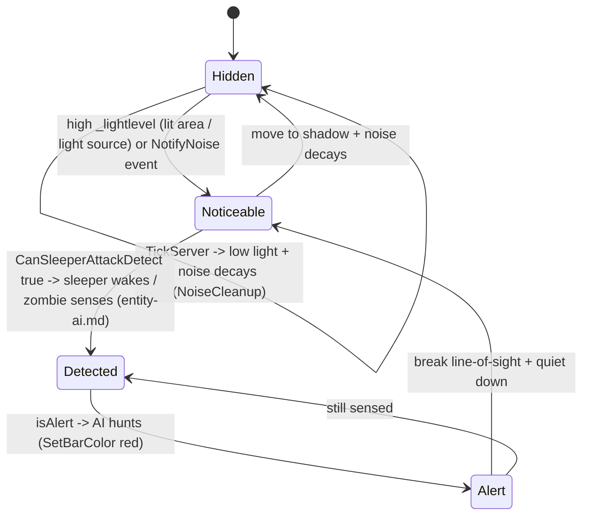
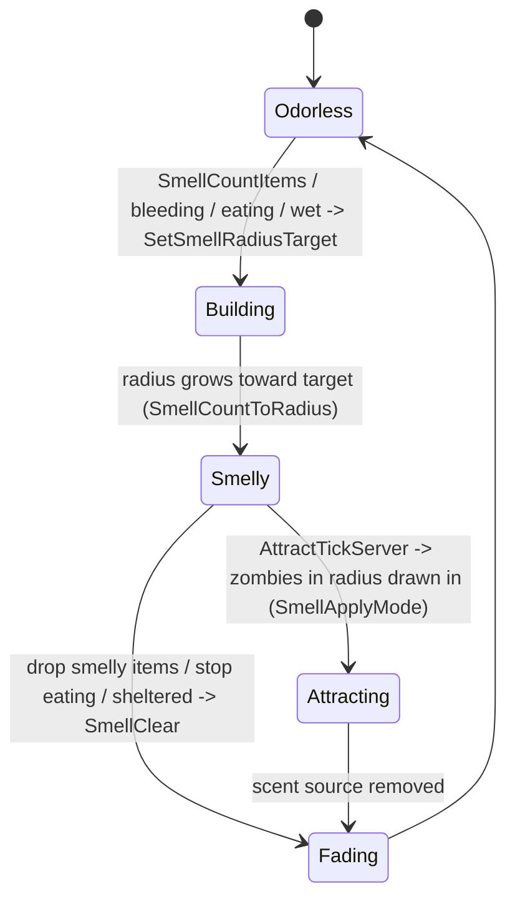

# Stealth, noise, and smell (dedicated V3.0.1)

**Owns:** the server-authoritative detection-input system: `PlayerStealth`
(light-based stealth, accumulated noise, and the item/blood/food smell that attracts
zombies), the values that feed sleeper/zombie sensing, and their net sync.
**Not:** the AI decision that consumes them ([entity-ai.md](entity-ai.md) CanSee /
sleeper wake); the stealth HUD meter (client); XML tuning content.
**Evidence:** `PlayerStealth` IL (`TickServer` 430, `SmellTickServer` 257; dump
locally with `tools/src/DumpMethod`, git-ignored). **Hub:** [`INDEX.md`](INDEX.md).
**Method:** [`re-methodology.md`](re-methodology.md).

The server computes every player's visibility, audibility, and scent each tick;
those are the inputs zombie and sleeper AI use to detect and hunt the player, so
this is a core per-tick dedicated codepath.

---

## 1. Model

Each `EntityPlayer` has a `PlayerStealth` (`Init(player)`). It maintains three
things, all computed on the server in `TickServer` and fanned to the owning client:

| Value | Method | Meaning |
|---|---|---|
| **Light level** (`_lightlevel`) | `TickServer` | How visible the player is (ambient + held light) |
| **Noise volume** (`_noiselevel`) | `CalcVolume` + `NotifyNoise`/`AddNoise` | How audible recent actions are (accumulated events that decay) |
| **Smell radius** | `SmellTickServer` | How far the player's scent attracts zombies |

`SetClientLevels(lightLevel, noiseVolume, isAlert)` pushes the computed stealth to
the client (the HUD meter, `ValuePercentUI` / `ValueColorUI` / `SetBarColor`);
`Read`/`Write` persist and net-sync the state.

---

## 2. Stealth and detection (state machine)

`TickServer` resolves the current light + noise into a stealth value; sleeper and
zombie AI read it (e.g. `CanSleeperAttackDetect(entity)`) to decide whether the
player is noticed. High light or a loud noise event raises detectability toward
`isAlert`.

Noise is event-driven: actions call `NotifyNoise(volume, duration)`, which
`AddNoise` queues with a tick lifetime; `CalcVolume` sums the live events and
`NoiseCleanup` expires them, so a single loud action (gunshot, sprint) spikes
audibility then fades.

---

## 3. Smell and attraction (state machine)

`SmellTickServer` builds a smell radius from what the player carries and does, and
`AttractTickServer` pulls nearby zombies toward a heavily-scented player. Smell
grows from carried food/raw meat items (`SmellCountItems`, `SmellUpdateItemsAndBlood`),
bleeding (`SmellUpdateItemsAndBlood`), eating (`SmellTickEat` / `SetSmellEat`), and
wetness (`SmellTickWet`); being sheltered reduces it.

`SetSmellRadiusTarget(radius, eating, sheltered)` sets the goal radius; the actual
radius eases toward it, so stashing raw meat or getting indoors shrinks the scent
over time rather than instantly.

---

## 4. Dedicated relevance and residuals

- **Per-tick dedicated path:** `TickServer`, `SmellTickServer`, and
  `AttractTickServer` run on the server for every player; the results are the
  authoritative detection inputs for AI.
- **Consumer:** zombie/sleeper sensing in [entity-ai.md](entity-ai.md) reads the
  stealth value and `CanSleeperAttackDetect`.
- **Residual / client:** the stealth HUD meter and bar color (client); light-probe
  sampling detail; XML stealth/smell tuning is content.

---

## Related docs

| Doc | Role |
|---|---|
| [entity-ai.md](entity-ai.md) | AI sensing/CanSee that consumes stealth; sleeper wake |
| [items.md](items.md) | Carried items that generate smell |
| [buffs.md](buffs.md) | Buffs/perks that modify stealth (from progression) |
| [weather-environment.md](weather-environment.md) | Wetness that affects smell |
| [spawning.md](spawning.md) | Sleeper volumes woken by detection |

## Changelog

- **2026-07-23:** Initial stealth/noise/smell reversal (PlayerStealth server tick, light+noise detection, item/blood/food smell attraction) with state machines.
