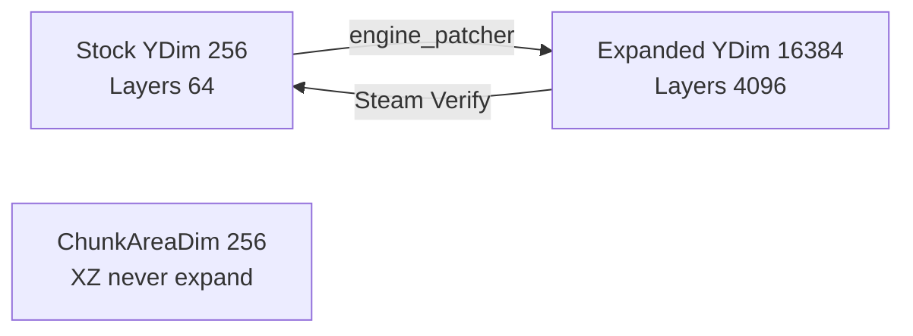

# Terrain and height engine map (V3.2.0)

**Owns:** WorldConstants YDim, height API inventory, stock vs expand pin (generic engine).  
**Chunk index / save-64:** [`world-chunks.md`](world-chunks.md), [`save-region.md`](save-region.md).  
**Product height policy:** `7dtd-realearth/docs/HEIGHT_LIMITS.md`.  
**Product Streamed inject:** `7dtd-realearth/docs/realearth-runtime.md`.  
**Hub:** [`INDEX.md`](INDEX.md).

---

## Dump sets

| Directory | Assembly | Role |
|---|---|---|
| [`../il/terrain-v3.2.0/`](../il/terrain-v3.2.0) | Dedicated `.re_stock_bak` | **Stock** vertical constants (pre-expand) |
| [`../il/terrain-v3.2.0/`](../il/terrain-v3.2.0) | Dedicated, expanded snapshot | **Historical** expanded YDim (RealEarth); live dedi is stock again, see [`coverage.md`](coverage.md) live pin |
| [`../il/terrain-v3.2.0/`](../il/terrain-v3.2.0) | Client, expanded snapshot | Historical expanded client dump |

Auto narrative: `TERRAIN_auto.md` in each dump dir.  
Tool: `tools/legacy/DumpTerrain.cs` (build via [`../tools/`](../tools/)).

```bash
DS="$HOME/.local/share/Steam/steamapps/common/7 Days to Die Dedicated Server"
ASM="$DS/7DaysToDieServer_Data/Managed/Assembly-CSharp.dll"
cd tools && ./build.sh
mono bin/legacy/DumpTerrain.exe "$ASM" ../il/terrain-v3.2.0
# stock backup:
mono bin/legacy/DumpTerrain.exe "$ASM.re_stock_bak" ../il/terrain-v3.2.0
```

## Stock vs expanded constants (Measured)



Literals on `WorldConstants` / `ChunkProviderGenerateWorldFromRaw.cMaxHeight`:

| Constant | Stock | Expanded (this machine) | Notes |
|---|---:|---:|---|
| `ChunkBlockYDim` | **256** | **16384** | Column height |
| `ChunkBlockYPow` | 8 | 14 | log2(YDim) |
| `ChunkBlockYDimM1` / `YMask` | 255 | 16383 | |
| `ChunkBlockLayers` | **64** | **4096** | YDim / LayerHeight(4) |
| `ChunkDensityYDim` | 256 | 16384 | Density volume Y |
| `ChunkAreaDim` | **256** | **256** | **XZ 16×16 only** (must not expand) |
| `cMaxHeight` | **255** | **16383** | Raw provider max surface |

**Implication for RealEarth docs:** statements like “stock YDim=256” mean **vanilla / after Steam Verify**, not necessarily the live DLL if expand was applied. Always probe or dump.

**Implication for patcher:** expanding Y while leaving `ChunkAreaDim=256` is correct (validated by stock vs expanded dumps).

**zdtd mirrors this as data (ADR 0036):** `src/protocol.zig` `WireProfile`
models the column-height dialect (one source of truth `y_dim`; layers, plane
stride and `c_max_height` derive); `[wire] profile` in zdtd.toml selects it
(stock default), and the chunk store / wire builder / ZCH4 save follow it.
Stock stays byte-pinned; non-stock needs a paired client mod (this table is
the RE grounding for the expanded values).

## Height API inventory (Harmony targets)

Interfaces **cannot** be patched directly (RealEarth already avoids that). Concrete types:

| Type | Method | Return | Notes for inject |
|---|---|---|---|
| `World` | `GetTerrainHeight(int,int)` | **byte** | Clamps tall heights if only this is used |
| `World` | `GetHeight(int,int)` | **byte** | Loaded chunk's top non-air/water block; add 1 for its voxel ceiling, not an arbitrary shape's exact collider surface |
| `World` | `GetHeightAt(float,float)` | float | Generator height, not the loaded voxel surface |
| `Chunk` | `GetTerrainHeight` / `SetTerrainHeight` | **byte** | Chunk-local heightmap still byte |
| `TerrainFromDTM` | `GetTerrainHeightByteAt` / `GetTerrainHeightAt` | byte / float | Baked DTM path |
| `TerrainFromRaw` | same | byte / float | Raw heightmap path |

**Bodies (V3.2.0 b9):** `World.GetHeight(x, z)` resolves the loaded chunk with
`GetChunkSync`, converts world to chunk-local X/Z, and returns
`Chunk.GetHeight`, or 0 when the chunk is absent. Stock spawn-point code then
uses `chunk.GetHeight(x,z) + 1` as its spawn-candidate Y. `ilspycmd -t World`
on the installed V3.2.0 client shows that exact route in
`FindRandomSpawnPointNearPosition` and the adjacent spawn samplers.

`World.GetHeightAt(x, z)` (IL=22) delegates to
`GetTerrainGenerator().GetTerrainHeightAt((int)x, (int)z)` (the generator
oracle, no chunk load; **0** without a generator). `World.GetTerrainHeight(x,
z)` (IL=19) reads the live chunk's byte heightmap via `GetChunkSync` +
`Chunk.GetTerrainHeight(toBlockXZ, toBlockXZ)` (**0** without the chunk).
`Chunk.GetMaxHeight()` (IL=29) is the max of the chunk's `m_HeightMap` byte
array. `Chunk.GetHeight(x, z)` (IL=9) / `GetHeight(blockOffset)` (IL=5) read
`m_HeightMap[x + z*16]` (the same array `GetMaxHeight` scans; `PrefabChunk`
returns the prefab height).
`Chunk.RecalcHeightAt(x, yMaxStart, z)` (IL=55) rescans the column downward
from `yMaxStart` and writes `m_HeightMap[offset] = y` at the first non-air (or
water) cell, returning that y (0 for an all-air column).

These methods are not interchangeable for live grounding. A 2026-08-31 client
probe measured `GetHeightAt = 60.05` at a road column whose loaded top block
gave standing surface `GetHeight + 1 = 61`. A harness that assigned an entity
root to `GetHeightAt` forced a correctly posed one-metre creature almost one
full block into the road. Use the generator query for terrain-generation
height questions; use the loaded chunk height plus one for the current voxel
surface candidate, then account for the model's authored capsule-bottom
offset. For a visual harness that teleports an entity over slopes and partial
blocks, even `GetHeight + 1` is too coarse: it is the top of the occupied
one-metre cell, while the shape's collider can be lower inside that cell. A
downward physics query on the traversable-surface mask measures the actual
shape. Keep the height value as a fallback and diagnostic, not as the precise
surface of every block shape.

The corrected 2026-08-31 d3d11 harness run supplied a discriminating live
sample: `voxelTop=62.000 surfaceRay=61.000 voxelMinusSurface=1.000`. Placing
the authored capsule bottom on the ray hit left the posed skin at
`groundClearance=0.032`, both collision and ground probes passed, and the
looked-at movement no longer showed the oversized bump rise. That result is
evidence for the API distinction, not a claim that every terrain block differs
by one metre.
`Chunk.AddWallVolumeId(id)` (IL=18) is the wall-volume link: dedupe into
`wallVolumes` with the same **255** cap error
(`Chunk AddWallVolume at max`); `GetWallVolumes` (IL=3) exposes the list. `Chunk.GetTerrainHeight(x, z)` (IL=9) reads the
separate `m_TerrainHeight` byte array (the `PrefabChunk` variant scans down
from the prefab height for the first terrain-shape block); `SetTerrainHeight`
(IL=10) writes it.
| `TerrainGeneratorWithBiomeResource` | `GetTerrainHeightAt` | float | RWG; **ByteAt abstract** |
| `TerrainGeneratorWithBiomeResource` | `GenerateTerrain` | (void) | Large IL (~424) fill path |
| `MeshGeneratorMC2` / `Prefab` | `GetTerrainHeight` | **int** | Meshing |
| `ITerrainGenerator` / `IChunk` | * | * | Abstract; patch implementors only |

**`HeightMapUtils` conversion leaves (all IL-verified):**
`ConvertDTMToHeightData` (three overloads: `Color[] + size + flip` IL=81,
`Texture2D + flip` IL=96, `Color32[] + w + h + flip` IL=155) turns a DTM
image into the `float[,]` height grid (red-channel driven);
`ConvertDTMToTerrainStampData(dtm)` (IL=46) is the same as a
`Single[,]` stamp. `LoadHeightMapRAWAsStampData(filePath, multiplier)`
(IL=101) streams a `.raw` as `float[sqrt(len/2), sqrt(len/2)]` with each
little-endian u16 mapped to `(hi*256 + lo) / 65535 * multiplier`;
`LoadRAWToHeightData(filePath)` (IL=60) re-reads the u16 array as
`/ 65280 * 255` floats with reversed rows (the byte-height encoding);
`LoadHeightMapRAWAsUnityHeightMap(filePath, w, h, fac)` (IL=90) fills a
`float[0..1]` grid from the u16 pairs; `GetHeightDataFromImageFile(filePath)`
(IL=18) loads + converts + destroys a texture
(`FileNotFoundException` when missing); `SmoothTerrain(passes, heightData)`
(IL=217) applies a center + 8-neighbor box blur for `passes` iterations.
`SaveHeightMapRAW` / `LoadHeightMapRAW` (the world-load pair: the 5-arg
`LoadHeightMapRAW(file, w, h, 1f, 250)` IL=132, the `Single[]` save IL=74)
are narrated in [`chunk-providers.md`](chunk-providers.md) §4.1.

**Product consequence:** even with YDim=16384, **byte heightmaps cannot store Everest**. RealEarth must:

1. Expand Y storage (binary).  
2. Drive **int/float** height paths and **block/density inject** for tall columns.  
3. Treat `GetTerrainHeight → byte` as a **lossy** API (min(255,h) or bypass).

## Generate / fill surfaces

| Type | Method | IL (stock dump order) | Role |
|---|---|---:|---|
| `TerrainGeneratorWithBiomeResource` | `GenerateTerrain` | ~424 | Live world gen fill |
| `TerrainMapGenerator` | `GenerateTerrain` | 549 | Map tool path |
| `WorldBuilder` | `GenerateTerrain*` family | 128-652 | RWG builder |
| `ChunkProviderGenerateWorld` | `generateTerrain` | 11 | Provider entry |
| `ChunkProvider*::FillOccupiedMap` | | small | Decoration occupancy |

RealEarth Streamed product path: postfix/replace **provider GenerateTerrain** + height queries so DEM wins over RWG noise.

## Related research / product docs

| Doc | Role |
|---|---|
| [`loop.md`](loop.md) | Dedicated frame/sim loop (entities, managers) |
| `7dtd-realearth/docs/realearth-runtime.md` | Streamed inject/session lessons (tall crust, fail-closed, expand+inject) |
| `7dtd-realearth/docs/realearth-review.md` | Adversarial failure classes (uint8 stamp, dual-fill hang, inject gate) |
| [`../il/README.md`](../il/README.md) | Dump policy |
| `7dtd-realearth/docs/HEIGHT_LIMITS.md` | Product vertical policy |
| `7dtd-realearth/docs/MODIFICATIONS.md` | All mod classes beyond YDim |
| `7dtd-realearth/docs/ENGINE_LIMITATIONS.md` | RealEarth 1:1 Earth limit map |
| [engine-limitations.md](engine-limitations.md) | Generic dedi ceilings (height + others) |
| `7dtd-realearth/DESIGN.md` | 1:1 product design |

## Managed RE status (height family)

All stock height/chunk-index/save-bound items below are **closed** from dedicated IL.  
Non-IL residuals only: [`residuals.md`](residuals.md). Product soak/ops items are **not** unmapped engine RE.

| Item | Status |
|---|---|
| Chunk GetBlock / density Y index | **CLOSED**, § Chunk indexing; `7dtd-realearth/docs/realearth-surfaces.md` §1 |
| Chunk write/read layer loop bound | **CLOSED**, hardcoded **64**; `World.toBlockY` = `y & 255` |
| Height API inventory (byte vs float) | **CLOSED**, this doc + TERRAIN dumps |
| Light/sun/mesh sites loading **255** | **CLOSED** inventory, [`light-mesh-water.md`](light-mesh-water.md), `realearth-surfaces.md` §7.1 |
| RegionFileRaw type map + header constants | **CLOSED**, [`save-region.md`](save-region.md) |
| WorldState.SaveLoad managed structure | **CLOSED**, save-region (IL=926) |

### Product / ops (not managed-RE open gaps)

| Item | Class |
|---|---|
| Live inject soak under expand (H500 → Everest) | Product verification |
| SoloSlide full chunk voxel reinject | Product residual (`7dtd-realearth/docs/realearth-review.md`) |
| Stock Origin vs SoloSlide session policy | Product (pure dedi Origin FixedUpdate is no-op) |
| Expand patcher regression after TFP update | Process residual (post-patch IL drift) |
| Optional sector payload hand-annotation | [`residuals.md`](residuals.md) |

## Chunk indexing (closed)

From live stock IL (`realearth-surfaces-v3.2.0`):

```text
// blocks
layer = m_BlockLayers[y >> 2]
idx_in_layer = x + (z << 4) + ((y & 3) * 256)

// density (ChunkBlockChannel)
layerIndex = (y >> 2) * bytesPerVal
offset = x + z*16 + (y & 3)*256

// density sentinel constants (MarchingCubes .cctor, IL=9)
DensityAir = 127, DensityAirHi = 100, DensityTerrain = -128, DensityTerrainHi = -100
GetDecorationOffsetY(densY, densYm1) (IL=12) =
  clamp(-0.0035 * (densY + densYm1), -0.4, 0.4)

// terrain heightmap (always byte)
m_TerrainHeight[x + z*16] → byte

// terrain normal (three parallel byte arrays, quantized)
SetTerrainNormal(x, z, v) (IL=43): m_NormalX/Y/Z[x + z*16] =
(byte)FastClamp(component * 127, -128, 127) per axis
GetTerrainNormalY(x, z) (IL=15): (sbyte)m_NormalY[x + z*16] / 127.0f

// heightmap queries
IsOpenSkyAbove(x, y, z) (IL=9): y >= GetHeight(x, z)
GetTopMostTerrainHeight() (IL=28): max over all m_TerrainHeight bytes
```

Expand must grow `m_BlockLayers` length (`ChunkBlockLayers`) with YDim; XZ formulas stay 16-wide.

`World.GetTerrainNormalAt(x, z)` (IL=17) is the world-level wrapper:
`GetChunkFromWorldPos(x, z) as Chunk`, `Vector3.zero` when the chunk is
absent, else `chunk.GetTerrainNormal(toBlockXZ(x), toBlockXZ(z))`.

## See also (stock RE)

| Doc | Why |
|---|---|
| [save-region.md](save-region.md) | Chunk write/read, WorldState |
| [world-chunks.md](world-chunks.md) | Gen trampoline, dirty lifecycle |
| `7dtd-realearth/docs/realearth-surfaces.md` | Product: GetBlock index, save-64, light 255 sites |

**Product inject lessons** (byte-API lossiness, tall-fill policy, fail-closed
sampling, int32 surface stamp) are RealEarth product knowledge, not stock RE:
see `7dtd-realearth/docs/realearth-review.md`.

**Server-relevant classified leaves (re-narrated for the coverage census):**

| Leaf | base | key methods |
|---|---|---|
| `TerrainAndWater` | Object |  |

## Changelog

- **2026-08-28:** zdtd ADR 0036 note (WireProfile dialects mirror this table as data).
- **2026-08-11:** Terrain IL re-verified: GetHeightAt IL=22, GetMaxHeight IL=29, GetHeight IL=9/5, RecalcHeightAt IL=55, AddWallVolumeId IL=18, GetWallVolumes IL=3, GetTerrainHeight IL=9, SetTerrainHeight IL=10, ConvertDTMToHeightData IL=81/96/155, ConvertDTMToTerrainStampData IL=46, LoadRAWToHeightData IL=60, LoadHeightMapRAW IL=132, LoadHeightMapRAWAsUnityHeightMap IL=90, LoadHeightMapRAWAsStampData IL=101, MarchingCubes.cctor IL=9, Chunk.SetTerrainNormal IL=43 / GetTerrainNormalY IL=15, IsOpenSkyAbove IL=9, GetTopMostTerrainHeight IL=28 (exact).
- **2026-08-10:** Chunk height IL re-verified: AddWallVolumeId IL=18, GetWallVolumes IL=3, GetTerrainHeight IL=9, SetTerrainHeight IL=10 (exact).
- **2026-08-10:** Height-query IL sizes re-verified: GetHeightAt IL=22, GetTerrainHeight IL=19, Chunk.GetMaxHeight IL=29, GetHeight IL=9, RecalcHeightAt IL=55 (exact).
- **2026-07-18:** Open-gaps section replaced with Closed managed table + product/ops list (residual policy).  
- **2026-07-18:** Closed GetBlock/density index math via realearth-surfaces dump; link Origin/claims; note live dedi stock again.  
- **2026-07-18:** Linked RealEarth runtime/review docs; inject lessons + open soak gaps.  
- **2026-07-16:** Initial terrain dump tool + stock/expanded/client sets; height API inventory for RealEarth.
