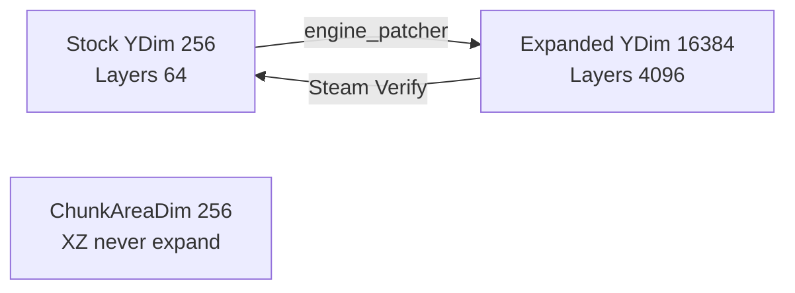

# Terrain and height engine map (V3.1.0)

**Owns:** WorldConstants YDim, height API inventory, stock vs expand pin (generic engine).  
**Chunk index / save-64:** [`world-chunks.md`](world-chunks.md), [`save-region.md`](save-region.md).  
**Product height policy:** `7days-realworld/docs/HEIGHT_LIMITS.md`.  
**Product Streamed inject:** `7days-realworld/docs/realearth-runtime.md`.  
**Hub:** [`INDEX.md`](INDEX.md).

---

## Dump sets

| Directory | Assembly | Role |
|---|---|---|
| [`../il/terrain-v3.1.0/`](../il/terrain-v3.1.0) | Dedicated `.re_stock_bak` | **Stock** vertical constants (pre-expand) |
| [`../il/terrain-v3.1.0/`](../il/terrain-v3.1.0) | Dedicated, expanded snapshot | **Historical** expanded YDim (RealEarth); live dedi is stock again, see [`coverage.md`](coverage.md) live pin |
| [`../il/terrain-v3.1.0/`](../il/terrain-v3.1.0) | Client, expanded snapshot | Historical expanded client dump |

Auto narrative: `TERRAIN_auto.md` in each dump dir.  
Tool: `tools/legacy/DumpTerrain.cs` (build via [`../tools/`](../tools/)).

```bash
DS="$HOME/.local/share/Steam/steamapps/common/7 Days to Die Dedicated Server"
ASM="$DS/7DaysToDieServer_Data/Managed/Assembly-CSharp.dll"
cd tools && ./build.sh
mono bin/legacy/DumpTerrain.exe "$ASM" ../il/terrain-v3.1.0
# stock backup:
mono bin/legacy/DumpTerrain.exe "$ASM.re_stock_bak" ../il/terrain-v3.1.0
```

## Stock vs expanded constants (Measured)



Literals on `WorldConstants` / `ChunkProviderGenerateWorldFromRaw.cMaxHeight`:

| Constant | Stock | Expanded (this machine) | Notes |
|---|---:|---:|---|
| `ChunkBlockYDim` | **256** | **16384** | Column height |
| `ChunkBlockYPow` | 8 | 14 | log2(YDim) |
| `ChunkBlockYDimM1` / `YMask` | 255 | 16383 | |
| `ChunkBlockLayers` | **64** | **4096** | YDim / LayerHeight(4) |
| `ChunkDensityYDim` | 256 | 16384 | Density volume Y |
| `ChunkAreaDim` | **256** | **256** | **XZ 16×16 only** (must not expand) |
| `cMaxHeight` | **255** | **16383** | Raw provider max surface |

**Implication for RealEarth docs:** statements like “stock YDim=256” mean **vanilla / after Steam Verify**, not necessarily the live DLL if expand was applied. Always probe or dump.

**Implication for patcher:** expanding Y while leaving `ChunkAreaDim=256` is correct (validated by stock vs expanded dumps).

## Height API inventory (Harmony targets)

Interfaces **cannot** be patched directly (RealEarth already avoids that). Concrete types:

| Type | Method | Return | Notes for inject |
|---|---|---|---|
| `World` | `GetTerrainHeight(int,int)` | **byte** | Clamps tall heights if only this is used |
| `World` | `GetHeightAt(float,float)` | float | Prefer for full 1:1 meters-as-blocks |
| `Chunk` | `GetTerrainHeight` / `SetTerrainHeight` | **byte** | Chunk-local heightmap still byte |
| `TerrainFromDTM` | `GetTerrainHeightByteAt` / `GetTerrainHeightAt` | byte / float | Baked DTM path |
| `TerrainFromRaw` | same | byte / float | Raw heightmap path |
| `TerrainGeneratorWithBiomeResource` | `GetTerrainHeightAt` | float | RWG; **ByteAt abstract** |
| `TerrainGeneratorWithBiomeResource` | `GenerateTerrain` | (void) | Large IL (~424) fill path |
| `MeshGeneratorMC2` / `Prefab` | `GetTerrainHeight` | **int** | Meshing |
| `ITerrainGenerator` / `IChunk` | * | * | Abstract; patch implementors only |

**Product consequence:** even with YDim=16384, **byte heightmaps cannot store Everest**. RealEarth must:

1. Expand Y storage (binary).  
2. Drive **int/float** height paths and **block/density inject** for tall columns.  
3. Treat `GetTerrainHeight → byte` as a **lossy** API (min(255,h) or bypass).

## Generate / fill surfaces

| Type | Method | IL (stock dump order) | Role |
|---|---|---:|---|
| `TerrainGeneratorWithBiomeResource` | `GenerateTerrain` | ~424 | Live world gen fill |
| `TerrainMapGenerator` | `GenerateTerrain` | 549 | Map tool path |
| `WorldBuilder` | `GenerateTerrain*` family | 128-652 | RWG builder |
| `ChunkProviderGenerateWorld` | `generateTerrain` | 11 | Provider entry |
| `ChunkProvider*::FillOccupiedMap` | | small | Decoration occupancy |

RealEarth Streamed product path: postfix/replace **provider GenerateTerrain** + height queries so DEM wins over RWG noise.

## Related research / product docs

| Doc | Role |
|---|---|
| [`loop.md`](loop.md) | Dedicated frame/sim loop (entities, managers) |
| `7days-realworld/docs/realearth-runtime.md` | Streamed inject/session lessons (tall crust, fail-closed, expand+inject) |
| `7days-realworld/docs/realearth-review.md` | Adversarial failure classes (uint8 stamp, dual-fill hang, inject gate) |
| [`../il/README.md`](../il/README.md) | Dump policy |
| `7days-realworld/docs/HEIGHT_LIMITS.md` | Product vertical policy |
| `7days-realworld/docs/MODIFICATIONS.md` | All mod classes beyond YDim |
| `7days-realworld/docs/ENGINE_LIMITATIONS.md` | RealEarth 1:1 Earth limit map |
| [engine-limitations.md](engine-limitations.md) | Generic dedi ceilings (height + others) |
| `7days-realworld/DESIGN.md` | 1:1 product design |

## Managed RE status (height family)

All stock height/chunk-index/save-bound items below are **closed** from dedicated IL.  
Non-IL residuals only: [`residuals.md`](residuals.md). Product soak/ops items are **not** unmapped engine RE.

| Item | Status |
|---|---|
| Chunk GetBlock / density Y index | **CLOSED**, § Chunk indexing; `7days-realworld/docs/realearth-surfaces.md` §1 |
| Chunk write/read layer loop bound | **CLOSED**, hardcoded **64**; `World.toBlockY` = `y & 255` |
| Height API inventory (byte vs float) | **CLOSED**, this doc + TERRAIN dumps |
| Light/sun/mesh sites loading **255** | **CLOSED** inventory, [`light-mesh-water.md`](light-mesh-water.md), `realearth-surfaces.md` §7.1 |
| RegionFileRaw type map + header constants | **CLOSED**, [`save-region.md`](save-region.md) |
| WorldState.SaveLoad managed structure | **CLOSED**, save-region (IL=884) |

### Product / ops (not managed-RE open gaps)

| Item | Class |
|---|---|
| Live inject soak under expand (H500 → Everest) | Product verification |
| SoloSlide full chunk voxel reinject | Product residual (`7days-realworld/docs/realearth-review.md`) |
| Stock Origin vs SoloSlide session policy | Product (pure dedi Origin FixedUpdate is no-op) |
| Expand patcher regression after TFP update | Process residual (post-patch IL drift) |
| Optional sector payload hand-annotation | [`residuals.md`](residuals.md) |

## Chunk indexing (closed)

From live stock IL (`realearth-surfaces-v3.1.0`):

```text
// blocks
layer = m_BlockLayers[y >> 2]
idx_in_layer = x + (z << 4) + ((y & 3) * 256)

// density (ChunkBlockChannel)
layerIndex = (y >> 2) * bytesPerVal
offset = x + z*16 + (y & 3)*256

// terrain heightmap (always byte)
m_TerrainHeight[x + z*16] → byte
```

Expand must grow `m_BlockLayers` length (`ChunkBlockLayers`) with YDim; XZ formulas stay 16-wide.

## See also (stock RE)

| Doc | Why |
|---|---|
| [save-region.md](save-region.md) | Chunk write/read, WorldState |
| [world-chunks.md](world-chunks.md) | Gen trampoline, dirty lifecycle |
| `7days-realworld/docs/realearth-surfaces.md` | Product: GetBlock index, save-64, light 255 sites |

**Product inject lessons** (byte-API lossiness, tall-fill policy, fail-closed
sampling, int32 surface stamp) are RealEarth product knowledge, not stock RE:
see `7days-realworld/docs/realearth-review.md`.

## Changelog

- **2026-07-18:** Open-gaps section replaced with Closed managed table + product/ops list (residual policy).  
- **2026-07-18:** Closed GetBlock/density index math via realearth-surfaces dump; link Origin/claims; note live dedi stock again.  
- **2026-07-18:** Linked RealEarth runtime/review docs; inject lessons + open soak gaps.  
- **2026-07-16:** Initial terrain dump tool + stock/expanded/client sets; height API inventory for RealEarth.
