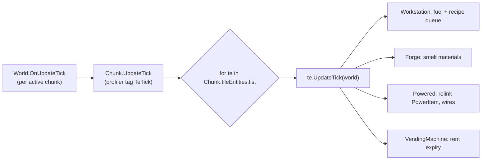
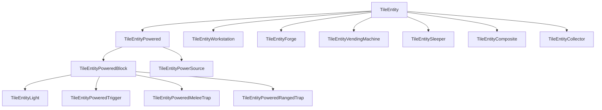
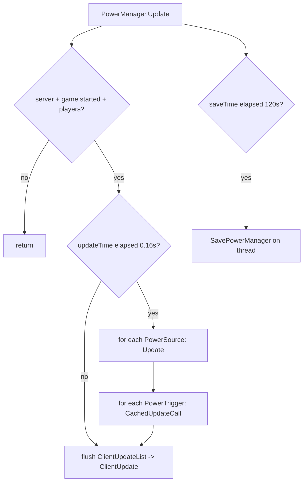
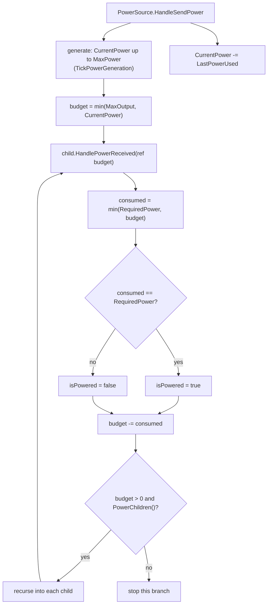
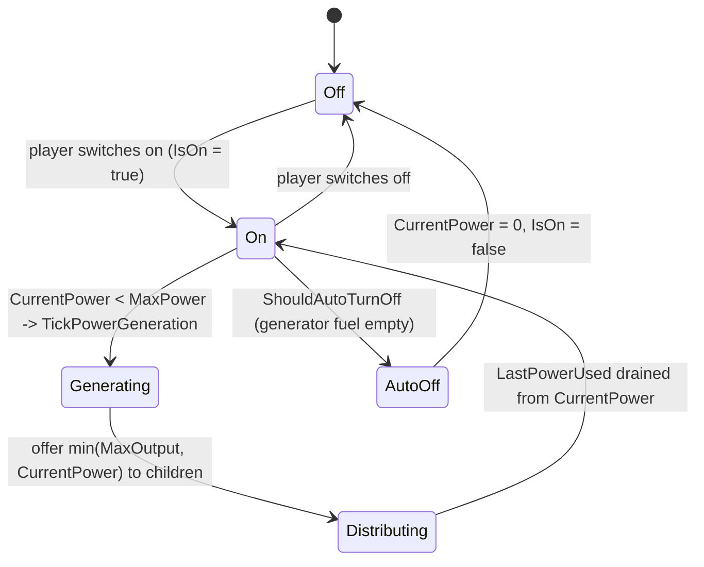
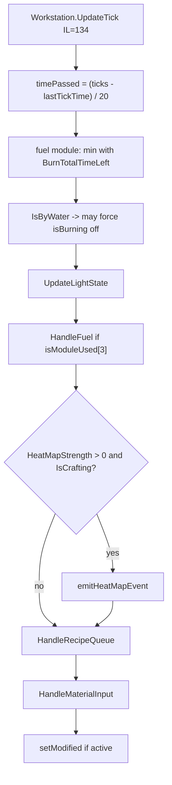
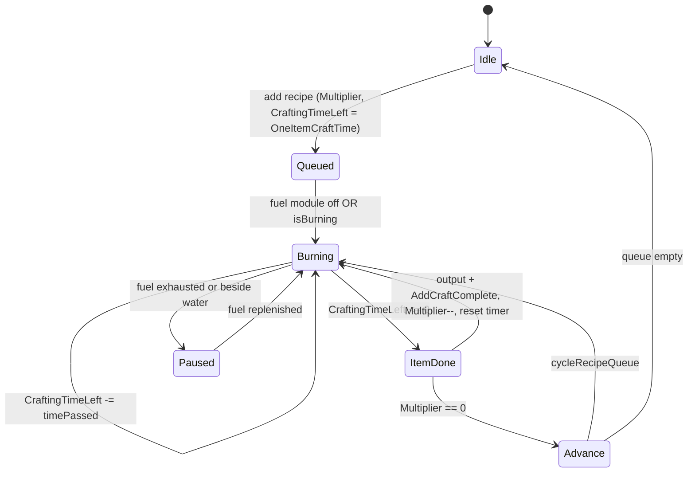
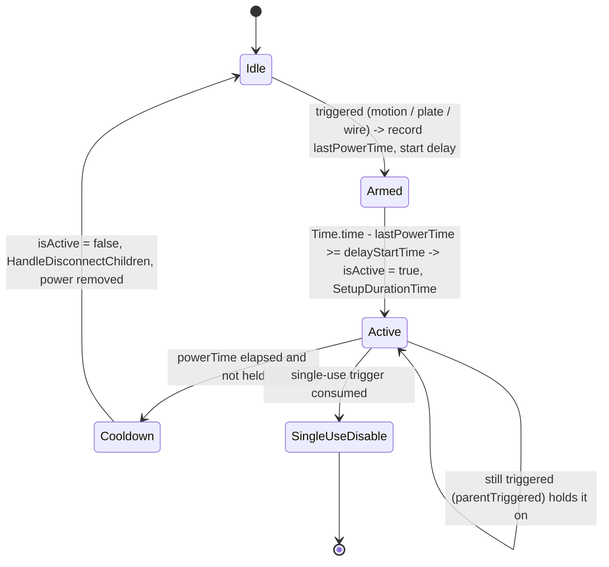
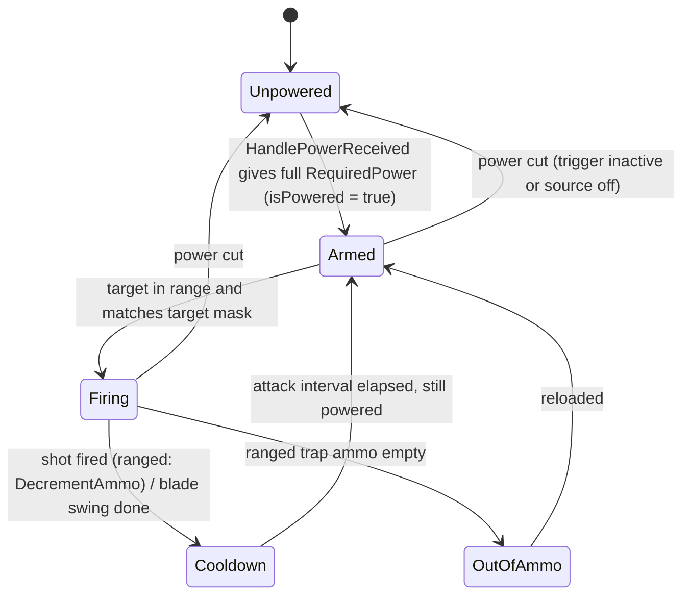

# Tile entities and the power system (dedicated V3.1.0)

**Owns:** the `TileEntity` model (the per-block state objects a chunk carries),
the `TileEntityType` registry and `InstantiateFromRead` factory, per-tick update
driving, and the electricity system (`PowerManager`, the `PowerItem` circuit
forest, sources, consumers, triggers, and powered traps). Covers how a workstation
or forge crafts, how a source feeds consumers over wires, and how a trigger arms
and fires a trap.
**Not:** the per-chunk binary chunk format and region files (owned by
[`save-region.md`](save-region.md)); the chunk load/unload/tick pipeline that
schedules the update (owned by [`world-chunks.md`](world-chunks.md)); the block
XML that supplies `RequiredPower`, fuel values, and recipes (content); the in-game
`XUiC_*` window controllers (client UI).
**Evidence:** `TileEntity*`, `PowerManager`, `PowerItem`, `Power*`,
`Chunk.UpdateTick` IL (19 `TileEntity*` types plus the power classes; dump locally
with `tools/src/DumpMethod`, git-ignored). **Hub:** [`INDEX.md`](INDEX.md).
**Method:** [`re-methodology.md`](re-methodology.md).

Tile entities are a core server codepath: they are ticked on the authority, saved
inside the chunk, and replicated to clients. The power graph is a second, global
structure that lives beside the chunks and is saved to its own file.

---

## 1. The TileEntity model

A `TileEntity` is a heap object attached to one block position that holds state a
`BlockValue` cannot: an inventory, crafting progress, an owner, a power link. Each
chunk owns its tile entities in `Chunk.tileEntities`, a `DictionaryList<Vector3i,
TileEntity>` keyed by chunk-local position. The base carries `chunkPos`
(local `Vector3i`), a read version, and `heapMapUpdateTime` (used to rate-limit
AI heat-map events), plus lock/owner and listener plumbing.

Ticking is driven from the world tick, not from any per-entity scheduler:



`Chunk.UpdateTick` (**IL=26**, profiler tag `TeTick`) walks
`tileEntities.list` in order and calls `te.UpdateTick(world)` for each. Most
concrete types override it; the base is a no-op. So a chunk with
no active machines still pays a bounded loop over its tile-entity list.

**`Chunk.GetBlockEntity` (V3.1.0 b14)** is the read side of the registry:
the `Vector3i` overload (IL=10) looks up `blockEntityStubs.dict` keyed by
`GameUtils.Vector3iToUInt64(pos)` (null when absent); the `Transform`
overload (IL=30) linearly scans `blockEntityStubs.list` for the matching
`BlockEntityData.transform` (null when absent). `PrefabChunk` stubs both as
null; `ChunkCluster.GetBlockEntity` (IL=12) resolves the chunk (null chunk →
null) and delegates.
`Chunk.AddEntityStub(ecd)` (IL=5) appends to `entityStubs`;
`RemoveEntityBlockStub(pos)` (IL=30) removes by the packed key (queuing the
removed entry in `blockEntityStubsToRemove`, warning
`Entity block on pos {0} not found!` on a miss).
`EnableEntityBlocks(on, name)` (IL=51) toggles every `blockEntityStubs` entry
whose lowercased transform name contains the filter (empty filter matches all)
and returns the count. `AddInsideDevicePosition(x, y, z, bv)` (IL=20) records
a `Vector3b` in `insideDevices` (+ hash set) and sets
`IsInternalBlocksCulled = true` (the POI-filler culled path).
`EnableInsideBlockEntities(on)` (IL=45) walks `insideDevices`, resolves each
entry's stub by packed world key, and `SetActive(on)`s every stub with a
transform (returning the count).
`removeBlockEntitesMarkedForRemoval()` (IL=133) drains
`blockEntityStubsToRemove` + `propEntitiesToRemove`: with occlusion culling on
the transforms go through `OcclusionManager.RemoveChunkTransforms`; each stub
`Cleanup()`s and pools its transform; each prop destroys its `PropReference`
and pools the game object; both lists clear.

**`GameUtils.Vector3iToUInt64(v)` (IL=29)** is the position key pack behind
the dict: each axis becomes `(coord + 32768) & 0xFFFF` (a 16-bit field with a
32768 offset so negative coordinates survive), combined as
`x << 32 | y << 16 | z` - the same pack used on the wire in
[`chunk-providers.md`](chunk-providers.md) `packedPos:u64`.
`GameUtils.UInt64ToVector3i(v)` (IL=27) is the exact inverse: each axis is
`((v >> shift) & 0xFFFF) - 32768`.

**TE transfer on block change (`GameManager.ChangeBlocks`, IL=530):** after
`SetBlock`, the engine compares the pre-change TE (`oldTE`, read before the
write) with the post-change TE (`newTE`). On the server the old one first gets
`ReplacedBy(newBV, oldBV, newTE)`; if the new block is air, the TE is removed
via `Chunk.RemoveTileEntityAt`; otherwise, when `oldTE != newTE` and
`newTE != null`, `newTE.UpgradeDowngradeFrom(oldTE)` moves state across.

`UpgradeDowngradeFrom` overrides: the base (IL=3) destroys the other TE
(`_other.OnDestroy()`). `TileEntityComposite` (IL=34) copies `Owner` and fans
to each module's `UpgradeDowngradeFrom(composite)`. `TileEntityCollector`
(IL=73) clones `worldTimeTouched` and the other collector's `Items` (resized to
this container; a size mismatch logs `UpgradeDowngradeFrom: other.size=...`).
`TileEntityVendingMachine` (IL=29) copies `IsLocked`, owner,
`allowedUserIds`, and `passwordHash` from any `ILockable` source and
`setModified()`.

**`UseLocalVersioning` (IL=15):** false when `readVersion == -1` (Read not yet
called; logs `[TileEntity] read must be called before using this.`), else true
when `readVersion >= 18`; it is the local-format gate read after `Read`.

**Registry writes:** `Chunk.AddTileEntity(te)` (IL=7) is
`tileEntities.Set(te.localChunkPos, te)`; `GetTileEntity(localPos)` (IL=11)
is the matching `TryGetValue` read (null on miss). Both remove paths flag `isModified`
and wrap `OnRemove(world)` between `IsRemoving = true` / false:
`RemoveTileEntityAt(world, pos)` (IL=28) looks up by local position and
`RemoveTileEntity(world, te)` (IL=29) by the entity's own local pos.

### 1.1 Type registry and factory

`TileEntityType` is a byte-valued enum. `TileEntity.InstantiateFromRead` reads the
type tag and switches (`type - 3`) to `newobj` the concrete class, else logs
`Dropping TE with unknown/outdated type` and returns null. `GetTileEntityType` on
each class returns its tag (authoritative for the write side).

| Tag | Enum name | Concrete class (instantiated) |
|---:|---|---|
| 3 | Collector | `TileEntityCollector` |
| 7 | VendingMachine | `TileEntityVendingMachine` |
| 8 | Forge | `TileEntityForge` |
| 12 | Workstation | `TileEntityWorkstation` |
| 15 | Powered | `TileEntityPoweredBlock` |
| 16 | PowerSource | `TileEntityPowerSource` |
| 17 | PowerRangeTrap | `TileEntityPoweredRangedTrap` |
| 18 | Light | `TileEntityLight` |
| 19 | Trigger | `TileEntityPoweredTrigger` |
| 20 | Sleeper | `TileEntitySleeper` |
| 21 | PowerMeleeTrap | `TileEntityPoweredMeleeTrap` |
| 25 | Composite | `TileEntityComposite` |

The enum also defines `None(0)`, `LandClaim(4)`, `Loot(5)`, `Trader(6)`,
`Campfire(9)`, `SecureLoot(10)`, `SecureDoor(11)`, `Sign(13)`, `GoreBlock(14)`,
`SecureLootSigned(22)`, and `Taskboard(27)`. These tags have **no dedicated class
in the factory switch**: loot containers, secure loot, doors, signs, and similar
older tile entities are now feature modules on `TileEntityComposite` (type 25),
which precomputes its capabilities from a `TileEntityCompositeData` block template
and dispatches per-feature commands. So there is no standalone
`TileEntityLootContainer` / `TileEntitySecureLootContainer` class in this build;
those roles live inside the composite type.

The class hierarchy of the powered branch:



---

## 2. Serialization and storage

Tile entities are **not** stored in a table of their own: they are written inside
the chunk blob, so their lifetime and disk location are the chunk's (see
[`save-region.md`](save-region.md) step 5 of `Chunk.write`, and
[`world-chunks.md`](world-chunks.md)). `Chunk.write` emits the tile-entity count,
then for each: the `GetTileEntityType` byte, then `te.write`. `Chunk.read` mirrors
this, calling `TileEntity.InstantiateFromRead(type)` per entry.

The base `TileEntity.write` / `read` is short and branches on the stream mode
(disk versus network):

| Order | Field | Width | Note |
|---|---|---|---|
| 1 | version | `u16` | current write version is **19**; read supports legacy `<= 18` (skips a stale `int`), `> 1` reads the heat-map time |
| 2 | `chunkPos` | `Vector3i` | chunk-local position (`StreamUtils.Write`) |
| 3 | `heapMapUpdateTime` | `u64` | disk mode only; network mode stops after `chunkPos` |

Each subclass chains to the base then appends its own body (inventories, owner,
flags, power data). `TileEntityLegacyUtils.TryReadLegacyType` is consulted first
during instantiate so older saves upgrade cleanly.

Replication uses `NetPackageTileEntity` (V3.1.0 wire; [protocol-packages.md](protocol-packages.md) §6.12; write IL=27 / read IL=24):

```text
handle : u8              // Setup default 255 when omitted
teWorldPos : Vector3i
teBlockId : i32          // V3.1.0 (absent on V3.0.1)
payloadLen : i32         // V3.1.0 (was u16 on V3.0.1)
payload : payloadLen bytes   // TileEntity.write(network stream mode)
```

`Setup(te, streamMode[, handle])` writes the TE into a pooled stream in the
requested mode. `ProcessPackage` (**IL=103**):

1. `GetTileEntity(teWorldPos)`; if null return.
2. If live block type != `teBlockId`: log warning and **drop** (stale TE after
   block change).
3. `SetHandle(handle)`; under lock on pooled stream, `te.read(reader,
   StreamModeRead 2 if remote world else 1)`.
4. `NotifyListeners()`; if server: `SetChunkModified`, then rebroadcast
   `Setup(te, StreamModeWrite=2, handle)` with flags **192** and optional
   position for interest (world-center pos when non-zero).

Because write is mode-aware, the network form omits disk-only heat-map time and
can include live `isPowered` (subclass bodies; see composite features inventory).

```mermaid
flowchart LR
  subgraph Chunk blob (save-region)
    CW[Chunk.write] --> CNT[te count]
    CNT --> TAG[type byte + te.write]
  end
  subgraph Network
    NP[NetPackageTileEntity.Setup<br/>StreamModeWrite=network] --> PP[ProcessPackage on peer]
  end
  TE[TileEntity state] --> CW
  TE --> NP
```

---

### 2.1 `ClientPowerData` and `TileEntityPowerSource` stream modes

`TileEntityPowerSource` (TE type 16) holds a nested `ClientPowerData` mirror used
for network and UI fuel/slot sync. Fields (DumpType):

| Field | Width | Role |
|---|---|---|
| `IsOn` | bool | generator/panel powered state |
| `MaxFuel` / `CurrentFuel` | u16 | generator only (`PowerItemTypes.Generator` = 5) |
| `SolarInput` | u16 | solar only (`PowerItemTypes.SolarPanel` = 6); maps from `PowerSolarPanel.InputFromSun` |
| `MaxOutput` / `LastOutput` | u16 | `PowerSource.MaxOutput` / `LastPowerUsed` |
| `AddedFuel` | u16 | client→server fuel add; cleared after apply |
| `SendSlots` | bool | whether `ItemSlots` follow on ToServer |
| `ItemSlots` | `ItemStack[]` | fuel/battery inventory slots |

`StreamModeWrite` / `StreamModeRead` enum order: **Persistency=0**, **ToServer/FromClient=1**,
**ToClient/FromServer=2** (DumpType field order).

**`TileEntityPowerSource.write` IL=98** (after base `TileEntityPowered.write`):

| Mode | Payload |
|---|---|
| **Persistency (0)** | `u16` **18** (local version stamp when not network) |
| **ToServer (1)** | `bUserAccessing:bool`, `AddedFuel:u16` (then zeroed), `SendSlots:bool`, if true `GameUtils.WriteItemStack(ItemSlots)` and clear `SendSlots` |
| **ToClient (2)** | `hasPowerSource:bool`; if true: `IsOn:bool`; if Generator: `MaxFuel:u16`, `CurrentFuel:u16`; if Solar: `InputFromSun:u16`; `WriteItemStack(Stacks)`; `MaxOutput:u16`; `LastPowerUsed:u16` |

**`read` IL=158** mirrors: ensures `ClientData` non-null; **FromClient (1)** applies
`AddedFuel` into `PowerGenerator.CurrentFuel` (clamped to `MaxFuel`), may
`SetSlots` from `ItemSlots`, `SetModified()`; **FromServer (2)** fills `ClientData`
IsOn/fuel/solar/slots/MaxOutput/LastOutput for UI. Disk path uses base TE versioning.

This is the wire shape inside `NetPackageTileEntity` payloads for power sources,
not a separate NetPackage type.

---

## 3. The power graph and PowerManager

Electricity is a **separate global structure** from the chunk store. `PowerManager`
(a singleton) holds a forest of `PowerItem` nodes wired parent to child, and saves
it to `power.dat` in the save directory, independent of any chunk file. A
`TileEntityPowered` in a chunk only holds a link to its `PowerItem` plus a cached
copy of its wire list and parent position; on load it reconnects by world position.

### 3.1 PowerManager structures

| Field | Type | Role |
|---|---|---|
| `Circuits` | `List<PowerItem>` | the **roots** of the forest (re-parenting removes a node from here) |
| `PowerSources` | `List<PowerSource>` | roots that generate power, ticked first |
| `PowerTriggers` | `List<PowerTrigger>` | trigger nodes, ticked after sources |
| `PowerItemDictionary` | `Dictionary<Vector3i, PowerItem>` | O(1) lookup by world position |

`PowerItemTypes` is the node kind (`PowerItem.CreateItem` is the factory):

| Value | Type | Node class |
|---:|---|---|
| 1 | Consumer | `PowerConsumer` (lamps, most powered blocks) |
| 2 | ConsumerToggle | `PowerConsumerToggle` (switch-gated) |
| 3 | Trigger | `PowerTrigger` |
| 4 | Timer | `PowerTimerRelay` |
| 5 | Generator | `PowerGenerator` |
| 6 | SolarPanel | `PowerSolarPanel` |
| 7 | BatteryBank | `PowerBatteryBank` |
| 8 | RangedTrap | `PowerRangedTrap` |
| 9 | ElectricWireRelay | `PowerElectricWireRelay` |
| 10 | TripWireRelay | `PowerTripWireRelay` |
| 11 | PressurePlate | `PowerPressurePlate` |

Generators, solar panels, and battery banks are `PowerSource` subtypes (they can
be roots); everything else consumes or relays.

### 3.2 The tick

`PowerManager.Update` runs only on the server, only with a started game and at
least one player, and only every **0.16 s** (about 6.25 Hz, decoupled from the
20 Hz sim tick). Per interval it updates every source, then every trigger; it
flushes queued client updates every frame; and it saves `power.dat` on a
background thread every 120 s.



### 3.3 Source to consumer distribution

Distribution is a greedy depth-first walk from each source. A source generates up
to `MaxPower`, then offers `min(MaxOutput, CurrentPower)` to its children. Each
child takes `min(RequiredPower, available)`, marks itself powered only if it got
its **full** requirement, and passes the remainder down its own subtree. When the
budget hits zero the walk stops, so nodes nearer the source win.



`PowerItem.PowerChildren` (base IL=2) always returns **true**. Subtypes do **not**
override it for the common switch/trigger cases on V3.1.0 b14 (verified: no
`PowerConsumerToggle.PowerChildren` method; `PowerTrigger.PowerChildren` also
returns true). Branch gating is therefore **not** via `PowerChildren`:

| Gate | Where | Effect |
|---|---|---|
| **Full requirement** | `HandlePowerReceived` | `isPowered = (consumed == RequiredPower)`; partial power blacks the node |
| **Toggle switch** | `PowerConsumerToggle.HandlePowerUpdate` | TE `Activate` uses `isPowered && isToggled`; children still get `HandlePowerUpdate(parentIsOn)` |
| **Trigger active** | `PowerTrigger.HandlePowerUpdate` | non-trigger children only updated when `get_IsActive()`; trigger children always get parent-trigger link |
| **Solar light** | `PowerSolarPanel.HandleSendPower` | early-out if `!HasLight` (after periodic `CheckLightLevel`) |

When a node's `isPowered` flips, `IsPoweredChanged` + `TileEntity.SetModified` run
so state is saved and replicated.

### 3.4 Source on/off state and subtype tick table

A source that is on generates and distributes; if it should auto turn off (a
generator with `CurrentFuel == 0`) it zeroes its power and flips off. Solar does
not use `ShouldAutoTurnOff` for daylight; it gates inside `HandleSendPower`.



**`PowerSource.Update` IL=28:** `HandleSendPower()` then, if `hasChangesLocal`,
`HandlePowerUpdate(IsOn)` on each child and clear the flag.

**`PowerSource.HandleSendPower` IL=86** (base path):

1. Return if `!IsOn`.
2. If `CurrentPower < MaxPower`: virtual `TickPowerGeneration()`; if above max, clamp.
3. If `ShouldAutoTurnOff()`: `CurrentPower=0`, `IsOn=false`.
4. If `hasChangesLocal`: `budget = min(MaxOutput, CurrentPower)`; for each child
   `HandlePowerReceived(ref budget)`; accumulate `LastPowerUsed`.
5. `CurrentPower -= LastPowerUsed`.

| Type | Tick / override | Generation / auto-off (IL) |
|---|---|---|
| `PowerSource` | `Update` -> `HandleSendPower` | base `TickPowerGeneration` empty (IL=1-ish); `ShouldAutoTurnOff` always **false** (IL=2) |
| `PowerGenerator` | same | `TickPowerGeneration` IL=30: if room and `CurrentFuel>0`, burn **1** fuel, add `OutputPerFuel` to `CurrentPower`. `ShouldAutoTurnOff` = (`CurrentFuel == 0`) |
| `PowerSolarPanel` | **override** `HandleSendPower` IL=111 | Every **2 s** (`lightUpdateTime`) call `CheckLightLevel`: `Chunk.GetLight(..., LIGHT_TYPE=1)` into `sunLight`; `HasLight = (sunLight==15 && World.IsDaytime())`. On light loss: zero power + `HandleDisconnect`. Only if `HasLight`: same generate/distribute as base. `TickPowerGeneration` IL=8: if `HasLight`, `CurrentPower = MaxOutput` (full fill, not incremental) |
| `PowerBatteryBank` | `Update` IL=22 | If has **Parent** and incoming power: while on, `AddPowerToBatteries(LastInputAmount)` then return (does **not** run base source distribute). If root (no parent): `PowerSource.Update`. `TickPowerGeneration` IL=76: discharge batteries by raising `ItemValue.UseTimes`, add `n * OutputPerCharge` to `CurrentPower`. `HandlePowerReceived` IL=89: when on, take `min(InputPerTick, available)` into batteries, then pass remainder to children |
| `PowerConsumer` | `HandlePowerUpdate` IL=51 | `Activate(isPowered && parentIsOn)`; edge `ActivateOnce`; always recurse children if `PowerChildren()` |
| `PowerConsumerToggle` | `HandlePowerUpdate` IL=53 | Activate uses `isPowered && parentIsOn && isToggled`; still recurses children with **parent** `isOn` (toggle does not cut child power budget; only local TE activation) |
| `PowerConsumerSingle` | `HandlePowerUpdate` IL=41 | one-shot `ActivateOnce` on rising edge of `isPowered`; recurse children |
| `PowerTrigger` | `CachedUpdateCall` IL=77 (from manager) + `HandlePowerUpdate` IL=72 | Manager path only for types 1 and 3..4 band: edge-detect trigger, delay/duration timers via `Time.time`, `HandleDisconnectChildren` when duration ends. `get_IsActive`: type 0 uses `isTriggered`; else `isActive \|\| parentTriggered` |
| `PowerTimerRelay` | `CachedUpdateCall` IL=12 | every **1 s** (`updateTime`) call `CheckForActiveChange` |
| `PowerElectricWireRelay` | (consumer) | no extra fields; pure consumer relay |
| `PowerTripWireRelay` | (trigger) | no extra fields beyond `PowerTrigger` |
| `PowerPressurePlate` | (trigger) | fields `pressed` / `lastPressed` |
| `PowerRangedTrap` | (consumer) | slots + `TargetType` + `isLocked` on disk; TE activate path via consumer |

`PowerManager.Update` IL=106: early-out if no world/players; **server + game
started** only for the 0.16 s source/trigger loop and 120 s save; **every frame**
flushes `ClientUpdateList` -> `TileEntityPoweredBlock.ClientUpdate` (also on
client connection path).

### 3.5 Graph persistence and subtype disk tails

Path `{SaveGameDir}/power.dat`. `SavePowerManager` (IL=41) serializes via `Write`
into a pooled stream and starts thread `powerDataSave`; the worker copies any
existing file to `power.dat.bak` then `StreamUtils.WriteStreamToFile`.
`LoadPowerManager` (IL=70) opens `power.dat`, else `power.dat.bak`.

**`PowerManager.Write` (IL=35) / `Read` (IL=34):**

```text
fileVersion : u8          // PowerManager.FileVersion
rootCount : i32           // Circuits.Count
// per root:
  powerItemType : u8
  PowerItem.write / read (recursive)
```

**`PowerItem.write` (IL=55) recursive:**

```text
blockId : u16
position : Vector3i
hasParent : bool
if hasParent: parentPos : Vector3i
childCount : u8
// per child: powerItemType:u8 + PowerItem.write
```

**Subtype write tails** (after base `PowerItem` / `PowerSource` / `PowerTrigger`):

| Type | Extra disk fields |
|---|---|
| `PowerSource` | `CurrentPower:u16`, `IsOn:bool`, `Stacks` (`WriteItemStack`) |
| `PowerGenerator` | + `CurrentFuel:u16` |
| `PowerSolarPanel` | + `sunLight:u8` (only if file version >= 2 on read) |
| `PowerConsumerToggle` | + `isToggled:bool` |
| `PowerTrigger` | `TriggerType:u8`; if type==0: `isTriggered:bool` else `isActive:bool`; if type!=0: delay:u8, duration:u8, `delayStartTime:f32`, `powerTime:f32`; if type==3: `TargetType:i32` |
| `PowerTimerRelay` | + `StartTime:u8`, `EndTime:u8` |
| `PowerRangedTrap` | `isLocked:bool`, `Stacks`, `TargetType:i32` |

`Read` rebuilds with `CreateItem` per node and `AddPowerNode`, which registers
the node in `Circuits`, in `PowerSources` / `PowerTriggers` if applicable, and in
`PowerItemDictionary`; `SetParent` enforces no cycles via `CircularParentCheck` and
pulls a re-parented node out of the roots list.

### 3.6 Wire edit package (`NetPackageWireActions`)

Write IL=45 / read IL=38 / ProcessPackage IL=163.

```text
currentOperation : u8   // WireActions: 0 SetParent, 1 RemoveParent, 2 SendWires
tileEntityPosition : Vector3i
childCount : u8
// childCount x Vector3i wireChildren
wiringEntityID : i32    // omitted when operation == SendWires (2)
```

**Server process** (`ConnectionManager.IsServer`):

| Op | Behaviour |
|---|---|
| **SetParent (0)** | Resolve/create `PowerItem` for `tileEntityPosition` and first `wireChildren[0]`; `PowerManager.SetParent(child, parent)`; refresh wire TE data (`CreateWireDataFromPowerItem` / `SendWireData` / `RemoveWires` / `DrawWires`) on old parent and new parent |
| **RemoveParent (1)** | `RemoveSelfFromParent` on item at position; refresh former parent's wire TE |
| **SendWires (2)** | (falls through to client path only in this method) |

**Client path:** if op is **SendWires**, `IPowered.SetWireData(wireChildren)` on TE at
position (visual wire list only).

---

## 4. Workstation and forge crafting

### 4.1 `TileEntityWorkstation.UpdateTick` (IL=134)

Fields: `fuel` / `input` / `tools` / `toolsNet` / `output` (`ItemStack[]`),
`queue` (`RecipeQueueItem[]`), `lastTickTime:u64`, `currentBurnTimeLeft:f32`,
`isBurning`, `isBesideWater`, `isModuleUsed:bool[]`, `CraftCompleteList`.

`isModuleUsed[3]` is the **fuel module** gate used throughout the tick (index 3
checked before fuel math and before final `isBurning` clear).

Ordered path (verified):

1. Early continue only when fuel module off **and** no recipe in queue **and** not burning.
2. `timePassed = (GameTimer.ticks - lastTickTime) / 20` (seconds at 20 TPS).
3. If fuel module on: `timePassed = min(timePassed, BurnTotalTimeLeft)` so craft
   cannot outrun remaining burn seconds.
4. `isBesideWater = TileEntity.IsByWater(world, pos)`; if burning and beside water
   force `isBurning = false`.
5. `UpdateLightState(world, block)` (block glow).
6. If fuel module: `HandleFuel(world, timePassed)`.
7. If `block.HeatMapStrength > 0` and `IsCrafting`: `emitHeatMapEvent` (AIDirector).
8. `HandleRecipeQueue(timePassed)` then `HandleMaterialInput(timePassed)`.
9. If fuel module and burning but `BurnTotalTimeLeft <= 0`: force `isBurning = false`.
10. Store `lastTickTime = GameTimer.ticks`.
11. `setModified()` if fuel module on or queue non-empty or burning; `UpdateVisible()`.



### 4.2 `HandleFuel` (IL=105)

- If not burning: return false (no heat emit).
- If burning: `emitHeatMapEvent(world, enum 0)` then burn loop:
  - Subtract `_timePassed` from `currentBurnTimeLeft`; quantize to 0.01 s via
    `FloorToInt(burn * 100) / 100`.
  - While burn time negative and total fuel seconds remain: consume one unit from
    `fuel[0]` (or `cycleFuelStacks` when count 0), add `GetFuelTime(stack)`,
    invoke `FuelChanged` if subscribed.
  - If total fuel seconds and current burn both exhausted: clamp burn to 0.
- Returns whether any fuel state changed.

### 4.3 `HandleRecipeQueue` / `cycleRecipeQueue`

`HandleRecipeQueue`: no-op while `bUserAccessing`. Active slot is last non-empty
queue entry. Requires fuel module off **or** `isBurning`. Decrements
`CraftingTimeLeft` by `timePassed`. When `CraftingTimeLeft <= 0` and
`Multiplier > 0`:

- Build output `ItemStack` from `Recipe.itemValueType` / `Recipe.count` / quality.
- `ItemStack.AddToItemStackArray(output, ...)`.
- `AddCraftComplete(StartingEntityId, item, recipeName, scrapName?, craftExpGain, count)`.
- Analytics: `GameSparksCollector.IncrementCounter` (client/telemetry; no-op harm on dedi).
- `Multiplier--`; reset `CraftingTimeLeft += OneItemCraftTime`.
- If `Multiplier == 0`: `cycleRecipeQueue()` (shift queue down, clear tail, mark next
  `IsCrafting` if Multiplier and Recipe present).



### 4.4 `TileEntityForge.UpdateTick` (IL=340)

Separate type (not a workstation subclass). Fuel is **tick-integer** based:
`fuelInStorageInTicks`, `fuelInForgeInTicks`, `burningItemValue`.

Path:

1. `recalcStats()`; if first tick (`lastTickTime == 0`) seed from `GameTimer.ticks`.
2. `dtTicks` from timer delta; `updateLightState`.
3. While storage or forge fuel ticks remain: `emitHeatMapEvent` (enum 1 while hot).
4. Consume forge fuel: `fuelInForgeInTicks -= min(dt, fuelInForge)` style drain;
   when empty, `moveDown(fuel)`, take next stack, set `burningItemValue`,
   `fuelInForgeInTicks = ItemClass.GetFuelValue(item) * 20` (seconds->ticks at 20 TPS),
   decrement stack count / Clear when empty.
5. Material melt: when `outputWeight` path active, rate uses `0.1` mold factor;
   `moveDown(input)`, add `ItemClass.GetWeight()` into `metalInForge`, consume input.
6. `recalcStats()`; light update when forge fuel hits zero.

### 4.5 Other TE ticks (IL-sized)

| Type | UpdateTick | Behaviour |
|---|---:|---|
| `TileEntityPowered` | 26 | If transform: `wiresDirty` -> `DrawWires`; `activateDirty` -> `Activate(PowerItem.IsPowered)` |
| `TileEntityPoweredBlock` | 4 | base only |
| `TileEntityVendingMachine` | 25 | Non-player-owned rentable: if `rentalEndDay <= WorldTimeToDays(worldTime)` -> `ClearVendingMachine` |
| `TileEntityComposite` | 24 | For each `modulesInternalOrder`: `ITileEntityFeature.UpdateTick` |
| Loot / Sign / Trader | (none) | No override; base no-op |
| `TileEntityCollector` | (large) | Converter slots; see §4.6 wire |
| `TileEntityLight` | (none / presentation) | Light params on disk/net; see §4.6 |
| `TileEntityPoweredRangedTrap` | (powered) | Ammo + target mask; see §4.6 |
| `TileEntityPoweredMeleeTrap` | (powered) | owner only on wire |

### 4.6 Collector, light, trap stream tails

#### `TileEntityCollector.write` (IL=278)

After base TE write + version u16 (persist path):

```text
lastWorldTimes.count : u16
// per entry: key:string, worldTime:u64
fillDataLookup.count : u16
// per entry: key:string, slot:u32, fillTime:u32, fillTimeLeft:u32
isUnderwater : bool
isBlocked : bool
outOfFuel.count : u16
// per entry: key:string, flag:u8
isFull.count : u16
// per entry: key:string, flag:u8
// then four ItemStack arrays (count:i16 + ItemStack.Write each):
//   itemsInternal, modSlotsInternal, fuelSlotsInternal, catalystSlotsInternal
```

#### `TileEntityLight.write` (IL=48)

After base + version u16:

```text
LightIntensity : f32
LightRange : f32
LightColor : Color32 (StreamUtils.WriteColor32)
LightType : u8
LightAngle : f32
LightShadows : u8
LightState : u8
Rate : f32
Delay : f32
```

#### `TileEntityPoweredRangedTrap.write` (IL=74)

After `TileEntityPoweredBlock.write`:

| Mode | Payload |
|---|---|
| **Persistency (0)** | version **u16=18**, `ownerID` (`PlatformUserIdentifier.ToStream`) |
| **ToServer (1)** | owner (always after base); then `bUserAccessing:bool`, `IsLocked:bool`, `ClientData.SendSlots:bool` (+ `WriteItemStack(ItemSlots)` if set, clear flag), `TargetType:i32` |
| **ToClient (2)** | owner; `hasPowerRangedTrap:bool`; if true: `IsLocked`, `WriteItemStack(PowerRangedTrap.Stacks)`; always `TargetType:i32` |

#### `TileEntityPoweredMeleeTrap.write` (IL=15)

After powered-block base: version u16 (persist) + `ownerID` ToStream only.

#### `TileEntityWorkstation.write` (IL=246)

After base TE write, always writes version **byte 50**, then branches on
`StreamModeWrite`:

| Mode | Payload (summary) |
|---|---|
| **Persistency (0)** | `lastTickTime:u64`; `writeItemStackArray` for fuel/input/tools/output; `writeRecipeStackArray(50)`; `writeCraftCompleteData(50)`; `isBurning:bool`; `currentBurnTimeLeft:f32`; module/material burn array (`byte` count + f32s); `isPlayerPlaced:bool`; toolsNet stacks |
| **ToServer (1)** | fuel/input/tools/output arrays; recipe + craft-complete (50); `isBurning`; burn time; module burns; `isPlayerPlaced` (no `lastTickTime` first; network path) |
| **ToClient (2)** | similar stack/recipe/burn mirror for UI; includes `lastTickTime` late in path |

Exact stack order matches fields: fuel, input, tools, output (persist also writes
toolsNet). Recipe queue and craft-complete use versioned helpers with constant
**50** (matches workstation format generation).

#### `TileEntityPoweredTrigger.write` (IL=138)

After `TileEntityPowered.write`:

1. Persist: version **u16=18**.
2. `TriggerType:u8`.
3. If type == **Motion (3)**: `ownerID` ToStream.
4. Network modes (`streamMode != 0`):
   - Non-switch types: `ClientData.Property1/2:u8`, `ResetTrigger:bool` (then clear).
   - Motion (3): `TargetType:i32`.
   - TripWire (4): wire-related bool from power item path.
   - TimerRelay (2): start/end time bytes from timer relay.

### 4.7 Composite `TEFeature*` wire tails

`TileEntityComposite` ticks each `ITileEntityFeature` in `modulesInternalOrder`
(§4.5). Feature Write/Read used inside composite TE payloads:

| Feature | Write IL | Disk/net tail |
|---|---:|---|
| `TEFeatureLockable` | 42 | version u16 (persist); `locked:bool`; count:i32 + `allowedUserIds` ToStream each; `passwordHash:string` |
| `TEFeatureStorage` | 108 | version u16; optional loot-list string; `containerSize` u16x2; playerStorage/touched flags; items: i16 count + `ItemStack.Write` each; slot-lock packed bools |
| `TEFeatureSignable` | 25 | version u16; `AuthoredText.ToStream(signText)` |
| `TEFeatureAreaRepair` | 10 | version u16 only (state mostly live `isRepairing`) |
| `TEFeatureDoor` | 23 | disk: version u16 **18** + `isOpen:bool`; net: `isOpen` + `animateOnSync` (cleared after write). `CanOpen(ref canPickToOpen)` (IL=29): open -> true; `canPickToOpen = lockpickFeature?.NeedsLockpicking()`; `lockFeature.IsLocked()` -> false |

Land-claim repair package drives `TEFeatureAreaRepair.RepairAll` (protocol
§6.19). Storage/lock features are the composite replacement for classic
`TileEntitySecureLootContainer` in V3.1.0 where the composite TE type is used.

**`TEFeatureLockable` command leaves:** `InitBlockActivationCommands` (IL=37)
registers the `lock`, `unlock`, and `keypad` `BlockActivationCommand`s (all
order 1 with the feature data). `AllowBlockActivationCommand` (IL=93) gates
them: non-owning modules pass through; for its own commands the local actor
must be owner or a party ally (`Allies.IsAlly(parent.Owner, localUser)`):
`lock` shows when unlocked, `unlock` when locked (owner or editor), `keypad`
only for the owner when the actor is allowed, there is no password, or the lock
is off. `get_TriggerRole` (IL=2) is the constant role **1**;
`OnBlockTriggered` (IL=10) unlocks the feature when `triggeredBy.Unlock` is
set.
`CheckPasswordHash(hash, user)` (IL=24): owner or no password -> true; a
matching hash adds the user to `allowedUserIds` (SetModified) and returns
true; `IsLocked` (IL=3) is the `locked` field, `HasPassword` (IL=6) is
`!IsNullOrEmpty(passwordHash)`.

---

## 5. Triggers and powered traps

A `TileEntityPoweredTrigger` wraps a `PowerTrigger` whose `TriggerType` selects the
sensing model:

| TriggerType | Value | Behavior |
|---|---:|---|
| Switch | 0 | manual on/off, no auto reset |
| PressurePlate | 1 | fires while an entity stands on it |
| TimerRelay | 2 | passes power inside a configured time window |
| Motion | 3 | fires on an entity entering the sensor volume |
| TripWire | 4 | fires when the wire is crossed |

A trigger gates power to its subtree on being active. `PowerTrigger` adds a
**delay** (arm time before it activates) and a **duration** (how long it stays
active after firing), both driven by `CachedUpdateCall` off the PowerManager tick:



While a trigger is active it lets the source's power reach the downstream trap.
A powered trap is a consumer: `TileEntityPoweredRangedTrap` (`PowerRangedTrap`
node) and `TileEntityPoweredMeleeTrap` fire only while they receive their full
required power. The ranged trap consumes ammo per shot (`DecrementAmmo`,
`CurrentAmmoItem`) and filters victims by a target mask
(`TargetSelf` / `TargetAllies` / `TargetStrangers` / `TargetZombies`); the melee
trap sweeps its blades against entities in range. Both stop when power is cut or
(ranged) ammo runs out.



`TileEntityPowered.read` stores the trap's own wire list (`wireDataList`), parent
position, `PowerItemType`, and `isPlayerPlaced`, and in network mode the live
`isPowered` bit, so a client renders the correct wires and on/off glow without
recomputing the graph. On the server, `InitializePowerData` looks up (or creates)
the matching `PowerItem` by world position and links the two.

---

## 6. Other tile entities

- **`TileEntityVendingMachine`**: an owned trader box. `UpdateTick` checks a
  rentable machine against the world day and calls `ClearVendingMachine` when
  `rentalEndDay` passes, so an expired rental empties itself. Owner, rent window
  (`RentTimeRemaining`, `RentalEndDay`), and stock are serialized with the chunk.
- **`TileEntitySleeper`**: marks a sleeper (spawn) volume anchor. It stores sensing
  parameters only: `PriorityMultiplier`, `SightAngle`, `SightRange`,
  `HearingPercent`. The volume logic and spawns are owned by the AI director and
  world sleeper streams (see [`save-region.md`](save-region.md) sleeper volumes and
  [`entity-ai.md`](entity-ai.md)); this tile entity is just the per-block record.
- **`TileEntityLight`**: a `TileEntityPoweredBlock` that toggles a light with its
  power state.
- **`TileEntityComposite`**: the modern data-driven tile entity. It builds feature
  modules from a `TileEntityCompositeData` block template, precomputes trigger and
  physical-override capabilities, and routes activation commands to the module that
  owns them. Loot, secure loot, doors, and signs are expressed this way.

---

## 7. Dedicated relevance and residuals

- **Authority and save:** tile-entity `UpdateTick`, power distribution, and both
  save paths (chunk blob for tile entities, `power.dat` for the graph) run on the
  dedicated server. Clients receive `NetPackageTileEntity` updates and the
  serialized power state; they do not own the graph.
- **Two independent stores:** losing a chunk file loses that chunk's machines;
  losing `power.dat` loses the wiring topology while the machines survive in their
  chunks. The two are reconciled on load by `InitializePowerData` matching
  positions.
- **Content (residual):** `RequiredPower`, fuel values, recipe times, trap ammo,
  trigger delay/duration options, and composite feature templates come from block
  and recipe XML, not from these method bodies.
- **Client-only (residual):** the `XUiC_PowerSource*`, `XUiC_Workstation*`, and
  wire-drawing paths (`DrawWires`) are UI and rendering; on a headless server they
  are skipped behind `ConnectionManager.IsServer` checks.

---

## Wire tool packages

`NetPackageWireActions` / `NetPackageWireToolActions` edit the power wire graph
(protocol-packages 6.21; Process IL=163 on WireActions).

## Related docs

| Doc | Role |
|---|---|
| [save-region.md](save-region.md) | Chunk blob (where tile entities are written) and the power save directory |
| [world-chunks.md](world-chunks.md) | The tick pipeline that calls `Chunk.UpdateTick` |
| [entity-ai.md](entity-ai.md) | Sleeper volumes and AI heat-map events emitted by workstations |
| [protocol.md](protocol.md) | Net package framing (`NetPackageTileEntity` replication) |
| [managers.md](managers.md) | Other in-process managers alongside `PowerManager` |
| [full-surface.md](full-surface.md) | Where this family sits in the whole-assembly map |
| [re-methodology.md](re-methodology.md) | How this was reversed |

## Changelog

- **2026-08-07:** GameUtils.Vector3iToUInt64 (IL=29): 16-bit offset-packed
  x<<32|y<<16|z position key.
- **2026-08-07:** Chunk.GetBlockEntity: Vector3i (IL=10) UInt64-keyed dict,
  Transform (IL=30) linear scan, PrefabChunk null, ChunkCluster (IL=12)
  resolve + delegate.
- **2026-08-07:** Chunk.UpdateTick IL=26 TeTick list walk; TEFeature write tails
  (§4.7); Workstation/PoweredTrigger/Collector/Light/trap write tails.
- **2026-08-07:** NetPackageTileEntity Process IL=103 teBlockId drop + stream
  mode 2 remote / 1 local + server rebroadcast.
- **2026-08-07:** HandleFuel early-out when not burning (no heat emit); burn
  quantize 0.01 s; fuel[0] consume + cycleFuelStacks.
- **2026-08-07:** Workstation UpdateTick/HandleFuel/HandleRecipeQueue IL paths;
  Forge fuel-tick melt path; Vending rental expiry; Composite feature tick;
  Powered TE dirty flags.
- **2026-08-07:** PowerItem subtype tick table (gen/solar/battery/trigger/toggle),
  corrected PowerChildren/isToggled gate claim, subtype power.dat tails,
  NetPackageWireActions SetParent/RemoveParent/SendWires process.
- **2026-08-07:** `ClientPowerData` field table + `TileEntityPowerSource` write/read by
  StreamMode (Persistency / ToServer / ToClient) from IL=98/158.
- **2026-07-28:** power.dat field-level Write/Read tree codec + threaded save.

- **2026-07-28:** NetPackageTileEntity wire + server rebroadcast path.

- **2026-07-23:** Initial tile-entity and power-system reversal (TileEntity model + type factory, chunk-owned serialization, PowerManager tick and greedy source-to-consumer distribution, workstation/forge crafting lifecycle, trigger and powered-trap state machines).
