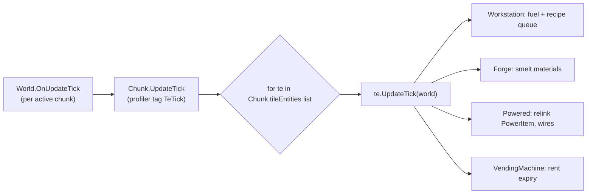
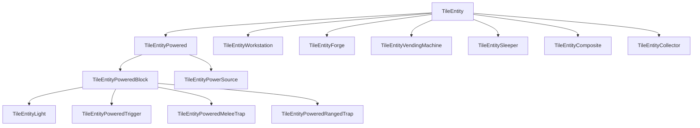
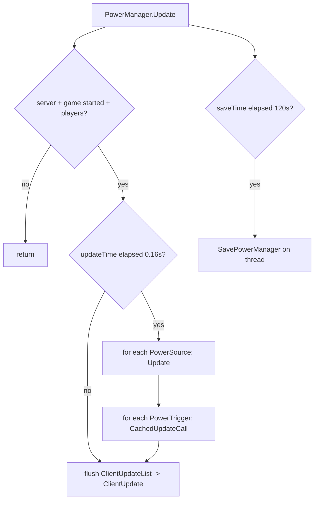
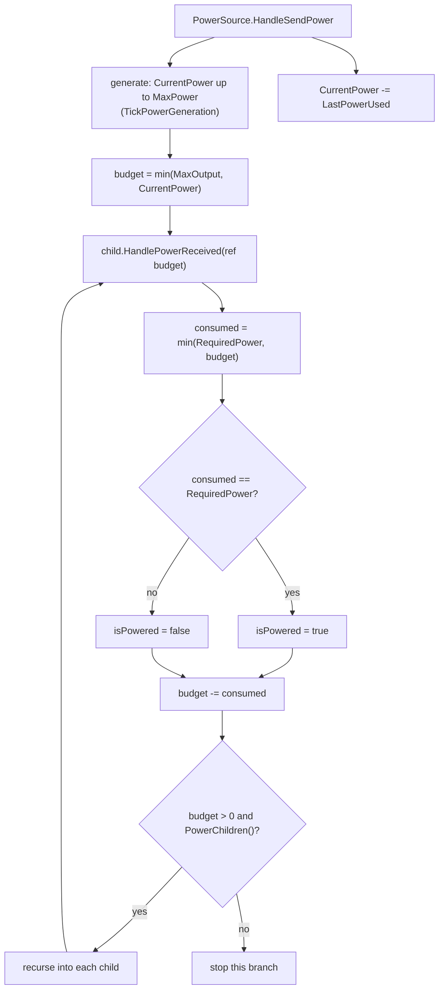
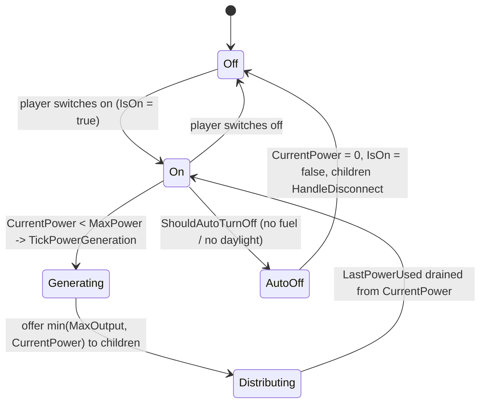
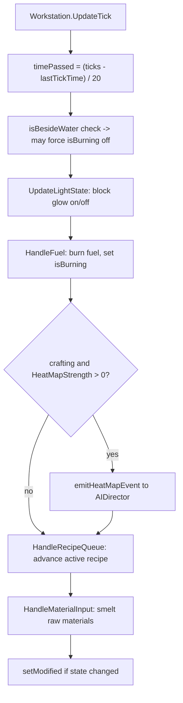
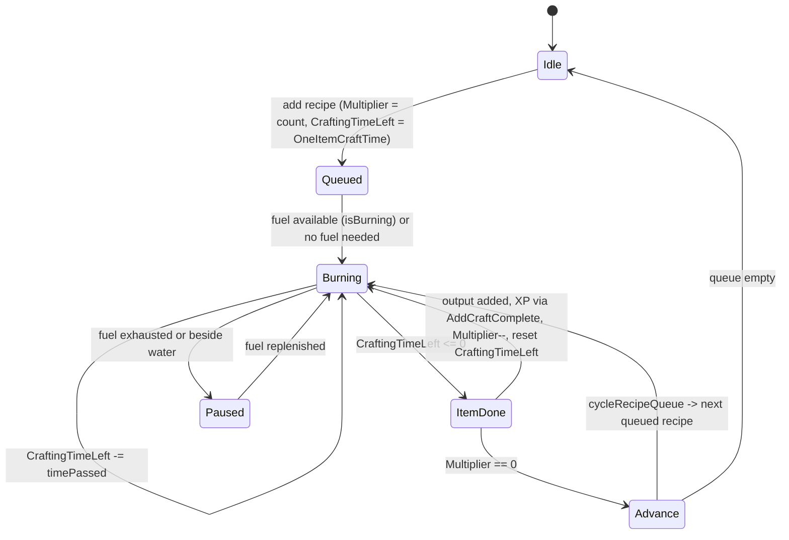
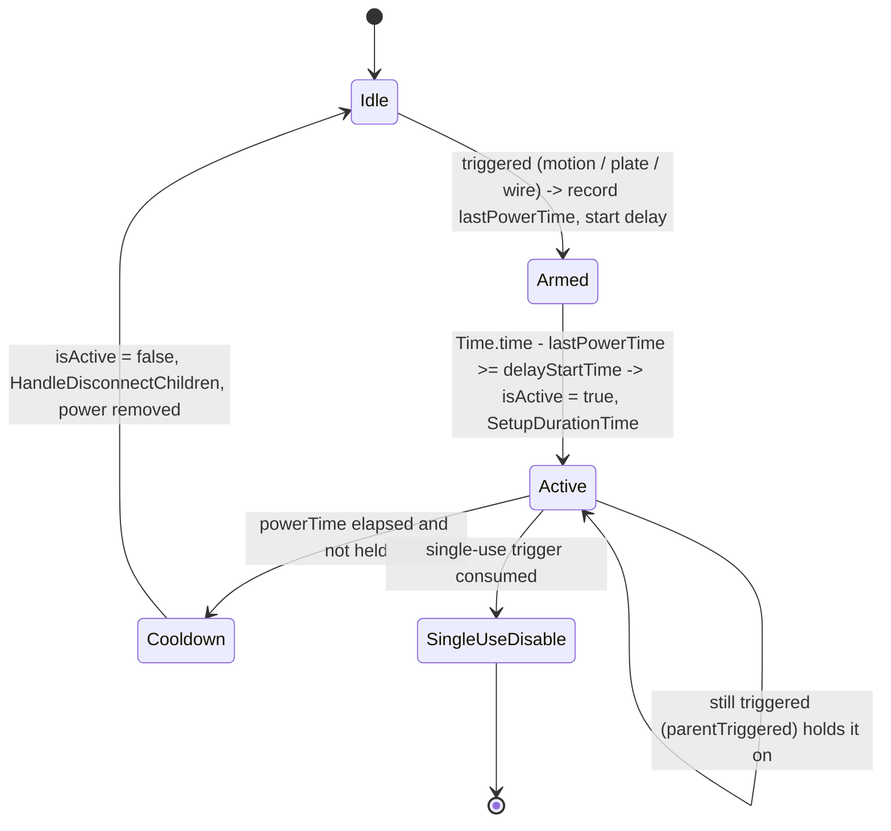
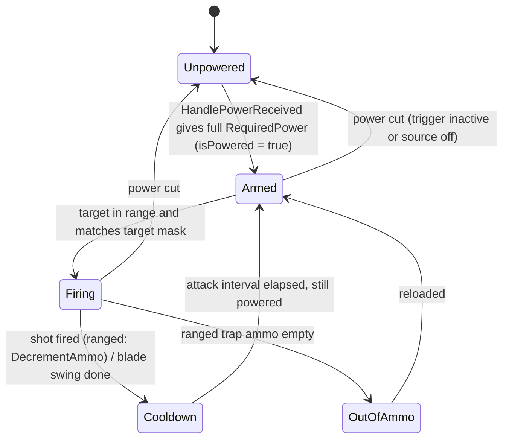

# Tile entities and the power system (dedicated V3.0.1)

**Owns:** the `TileEntity` model (the per-block state objects a chunk carries),
the `TileEntityType` registry and `InstantiateFromRead` factory, per-tick update
driving, and the electricity system (`PowerManager`, the `PowerItem` circuit
forest, sources, consumers, triggers, and powered traps). Covers how a workstation
or forge crafts, how a source feeds consumers over wires, and how a trigger arms
and fires a trap.
**Not:** the per-chunk binary chunk format and region files (owned by
[`save-region.md`](save-region.md)); the chunk load/unload/tick pipeline that
schedules the update (owned by [`world-chunks.md`](world-chunks.md)); the block
XML that supplies `RequiredPower`, fuel values, and recipes (content); the in-game
`XUiC_*` window controllers (client UI).
**Evidence:** `TileEntity*`, `PowerManager`, `PowerItem`, `Power*`,
`Chunk.UpdateTick` IL (19 `TileEntity*` types plus the power classes; dump locally
with `tools/src/DumpMethod`, git-ignored). **Hub:** [`INDEX.md`](INDEX.md).
**Method:** [`re-methodology.md`](re-methodology.md).

Tile entities are a core server codepath: they are ticked on the authority, saved
inside the chunk, and replicated to clients. The power graph is a second, global
structure that lives beside the chunks and is saved to its own file.

---

## 1. The TileEntity model

A `TileEntity` is a heap object attached to one block position that holds state a
`BlockValue` cannot: an inventory, crafting progress, an owner, a power link. Each
chunk owns its tile entities in `Chunk.tileEntities`, a `DictionaryList<Vector3i,
TileEntity>` keyed by chunk-local position. The base carries `chunkPos`
(local `Vector3i`), a read version, and `heapMapUpdateTime` (used to rate-limit
AI heat-map events), plus lock/owner and listener plumbing.

Ticking is driven from the world tick, not from any per-entity scheduler:



`Chunk.UpdateTick` walks every tile entity in the chunk each server tick and calls
`UpdateTick`. Most concrete types override it; the base is a no-op. So a chunk with
no active machines still pays a bounded loop over its tile-entity list.

### 1.1 Type registry and factory

`TileEntityType` is a byte-valued enum. `TileEntity.InstantiateFromRead` reads the
type tag and switches (`type - 3`) to `newobj` the concrete class, else logs
`Dropping TE with unknown/outdated type` and returns null. `GetTileEntityType` on
each class returns its tag (authoritative for the write side).

| Tag | Enum name | Concrete class (instantiated) |
|---:|---|---|
| 3 | Collector | `TileEntityCollector` |
| 7 | VendingMachine | `TileEntityVendingMachine` |
| 8 | Forge | `TileEntityForge` |
| 12 | Workstation | `TileEntityWorkstation` |
| 15 | Powered | `TileEntityPoweredBlock` |
| 16 | PowerSource | `TileEntityPowerSource` |
| 17 | PowerRangeTrap | `TileEntityPoweredRangedTrap` |
| 18 | Light | `TileEntityLight` |
| 19 | Trigger | `TileEntityPoweredTrigger` |
| 20 | Sleeper | `TileEntitySleeper` |
| 21 | PowerMeleeTrap | `TileEntityPoweredMeleeTrap` |
| 25 | Composite | `TileEntityComposite` |

The enum also defines `None(0)`, `LandClaim(4)`, `Loot(5)`, `Trader(6)`,
`Campfire(9)`, `SecureLoot(10)`, `SecureDoor(11)`, `Sign(13)`, `GoreBlock(14)`,
`SecureLootSigned(22)`, and `Taskboard(27)`. These tags have **no dedicated class
in the factory switch**: loot containers, secure loot, doors, signs, and similar
older tile entities are now feature modules on `TileEntityComposite` (type 25),
which precomputes its capabilities from a `TileEntityCompositeData` block template
and dispatches per-feature commands. So there is no standalone
`TileEntityLootContainer` / `TileEntitySecureLootContainer` class in this build;
those roles live inside the composite type.

The class hierarchy of the powered branch:



---

## 2. Serialization and storage

Tile entities are **not** stored in a table of their own: they are written inside
the chunk blob, so their lifetime and disk location are the chunk's (see
[`save-region.md`](save-region.md) step 5 of `Chunk.write`, and
[`world-chunks.md`](world-chunks.md)). `Chunk.write` emits the tile-entity count,
then for each: the `GetTileEntityType` byte, then `te.write`. `Chunk.read` mirrors
this, calling `TileEntity.InstantiateFromRead(type)` per entry.

The base `TileEntity.write` / `read` is short and branches on the stream mode
(disk versus network):

| Order | Field | Width | Note |
|---|---|---|---|
| 1 | version | `u16` | current write version is **19**; read supports legacy `<= 18` (skips a stale `int`), `> 1` reads the heat-map time |
| 2 | `chunkPos` | `Vector3i` | chunk-local position (`StreamUtils.Write`) |
| 3 | `heapMapUpdateTime` | `u64` | disk mode only; network mode stops after `chunkPos` |

Each subclass chains to the base then appends its own body (inventories, owner,
flags, power data). `TileEntityLegacyUtils.TryReadLegacyType` is consulted first
during instantiate so older saves upgrade cleanly.

Replication uses `NetPackageTileEntity` (write IL=23):

```text
handle : u8              // default 255
teWorldPos : Vector3i
payloadLen : u16
payload : TileEntity.write(streamMode) bytes
```

`Setup(te, streamMode[, handle])` writes the TE into a pooled stream in the
requested mode. `ProcessPackage` (IL=90): lookup by world pos, `SetHandle`,
`te.read` with StreamModeRead **1** (remote) or **2** (local/server),
`NotifyListeners`; on server mark chunk modified and **rebroadcast** the package
(flags 192) so other clients converge. Because write is mode-aware, the network
form omits disk-only heat-map time and can include live `isPowered` (subclass
bodies; see composite features inventory).

```mermaid
flowchart LR
  subgraph Chunk blob (save-region)
    CW[Chunk.write] --> CNT[te count]
    CNT --> TAG[type byte + te.write]
  end
  subgraph Network
    NP[NetPackageTileEntity.Setup<br/>StreamModeWrite=network] --> PP[ProcessPackage on peer]
  end
  TE[TileEntity state] --> CW
  TE --> NP
```

---

## 3. The power graph and PowerManager

Electricity is a **separate global structure** from the chunk store. `PowerManager`
(a singleton) holds a forest of `PowerItem` nodes wired parent to child, and saves
it to `power.dat` in the save directory, independent of any chunk file. A
`TileEntityPowered` in a chunk only holds a link to its `PowerItem` plus a cached
copy of its wire list and parent position; on load it reconnects by world position.

### 3.1 PowerManager structures

| Field | Type | Role |
|---|---|---|
| `Circuits` | `List<PowerItem>` | the **roots** of the forest (re-parenting removes a node from here) |
| `PowerSources` | `List<PowerSource>` | roots that generate power, ticked first |
| `PowerTriggers` | `List<PowerTrigger>` | trigger nodes, ticked after sources |
| `PowerItemDictionary` | `Dictionary<Vector3i, PowerItem>` | O(1) lookup by world position |

`PowerItemTypes` is the node kind (`PowerItem.CreateItem` is the factory):

| Value | Type | Node class |
|---:|---|---|
| 1 | Consumer | `PowerConsumer` (lamps, most powered blocks) |
| 2 | ConsumerToggle | `PowerConsumerToggle` (switch-gated) |
| 3 | Trigger | `PowerTrigger` |
| 4 | Timer | `PowerTimerRelay` |
| 5 | Generator | `PowerGenerator` |
| 6 | SolarPanel | `PowerSolarPanel` |
| 7 | BatteryBank | `PowerBatteryBank` |
| 8 | RangedTrap | `PowerRangedTrap` |
| 9 | ElectricWireRelay | `PowerElectricWireRelay` |
| 10 | TripWireRelay | `PowerTripWireRelay` |
| 11 | PressurePlate | `PowerPressurePlate` |

Generators, solar panels, and battery banks are `PowerSource` subtypes (they can
be roots); everything else consumes or relays.

### 3.2 The tick

`PowerManager.Update` runs only on the server, only with a started game and at
least one player, and only every **0.16 s** (about 6.25 Hz, decoupled from the
20 Hz sim tick). Per interval it updates every source, then every trigger; it
flushes queued client updates every frame; and it saves `power.dat` on a
background thread every 120 s.



### 3.3 Source to consumer distribution

Distribution is a greedy depth-first walk from each source. A source generates up
to `MaxPower`, then offers `min(MaxOutput, CurrentPower)` to its children. Each
child takes `min(RequiredPower, available)`, marks itself powered only if it got
its **full** requirement, and passes the remainder down its own subtree. When the
budget hits zero the walk stops, so nodes nearer the source win.



`PowerItem.PowerChildren` is the branch gate: the base returns true, but
`PowerConsumerToggle` returns its `isToggled` flag (a switch that is off blacks out
everything downstream of it), and triggers gate their branch on being active. When
a node's `isPowered` changes it marks its tile entity modified so the new state is
saved and replicated.

### 3.4 Source on/off state

A source that is on generates and distributes; if it should auto turn off (a
generator with `CurrentFuel == 0`, a solar panel with no light) it zeroes its power
and flips off, disconnecting the subtree.



Source subtypes differ only in `TickPowerGeneration` and `ShouldAutoTurnOff`:
the generator burns fuel (`OutputPerFuel` per unit `CurrentFuel`, auto-off at
empty), the solar panel produces only while `HasLight` is true (daylight-gated),
and the battery bank both charges (`TickPowerGeneration`) and discharges
(`HandleSendPower`) from stored charge.

### 3.5 Graph persistence

Path `{SaveGameDir}/power.dat`. `SavePowerManager` (IL=41) serializes via `Write`
into a pooled stream and starts thread `powerDataSave`; the worker copies any
existing file to `power.dat.bak` then `StreamUtils.WriteStreamToFile`.
`LoadPowerManager` (IL=70) opens `power.dat`, else `power.dat.bak`.

**`PowerManager.Write` (IL=35) / `Read` (IL=34):**

```text
fileVersion : u8          // PowerManager.FileVersion
rootCount : i32           // Circuits.Count
// per root:
  powerItemType : u8
  PowerItem.write / read (recursive)
```

**`PowerItem.write` (IL=55) recursive:**

```text
blockId : u16
position : Vector3i
hasParent : bool
if hasParent: parentPos : Vector3i
childCount : u8
// per child: powerItemType:u8 + PowerItem.write
```

`Read` rebuilds with `CreateItem` per node and `AddPowerNode`, which registers
the node in `Circuits`, in `PowerSources` / `PowerTriggers` if applicable, and in
`PowerItemDictionary`; `SetParent` enforces no cycles via `CircularParentCheck` and
pulls a re-parented node out of the roots list.

---

## 4. Workstation and forge crafting

`TileEntityWorkstation` (forges in earlier terms are their own type) drives a fuel
loop and a recipe queue each `UpdateTick`. Time passed is derived from the 20 Hz
`GameTimer.ticks` delta since `lastTickTime`, divided by 20 to get seconds. When a
fuel module is present, elapsed time is clamped to remaining burn time so an item
cannot advance past available heat. Being beside water forces `isBurning` off.



The recipe queue lifecycle, per `HandleRecipeQueue` and `cycleRecipeQueue`:



Each completed unit appends the crafted item to the `output` array, banks craft XP
for `StartingEntityId` through `AddCraftComplete`, and resets the timer for the
next unit; `CheckForCraftComplete` later hands the XP to the returning player.

`TileEntityForge` is the smelting variant. Fuel is tracked directly in ticks
(`fuelInStorageInTicks`, `fuelInForgeInTicks`) with a `burningItemValue`, and
`HandleMaterialInput` melts input materials into a molten `output` pool measured by
`outputWeight`. Like the workstation it emits AI heat-map events while active and
marks itself modified when the fuel or output changes. `TileEntityCollector`
follows the same shape for its converter slots (fuel, catalyst, timed output).

---

## 5. Triggers and powered traps

A `TileEntityPoweredTrigger` wraps a `PowerTrigger` whose `TriggerType` selects the
sensing model:

| TriggerType | Value | Behavior |
|---|---:|---|
| Switch | 0 | manual on/off, no auto reset |
| PressurePlate | 1 | fires while an entity stands on it |
| TimerRelay | 2 | passes power inside a configured time window |
| Motion | 3 | fires on an entity entering the sensor volume |
| TripWire | 4 | fires when the wire is crossed |

A trigger gates power to its subtree on being active. `PowerTrigger` adds a
**delay** (arm time before it activates) and a **duration** (how long it stays
active after firing), both driven by `CachedUpdateCall` off the PowerManager tick:



While a trigger is active it lets the source's power reach the downstream trap.
A powered trap is a consumer: `TileEntityPoweredRangedTrap` (`PowerRangedTrap`
node) and `TileEntityPoweredMeleeTrap` fire only while they receive their full
required power. The ranged trap consumes ammo per shot (`DecrementAmmo`,
`CurrentAmmoItem`) and filters victims by a target mask
(`TargetSelf` / `TargetAllies` / `TargetStrangers` / `TargetZombies`); the melee
trap sweeps its blades against entities in range. Both stop when power is cut or
(ranged) ammo runs out.



`TileEntityPowered.read` stores the trap's own wire list (`wireDataList`), parent
position, `PowerItemType`, and `isPlayerPlaced`, and in network mode the live
`isPowered` bit, so a client renders the correct wires and on/off glow without
recomputing the graph. On the server, `InitializePowerData` looks up (or creates)
the matching `PowerItem` by world position and links the two.

---

## 6. Other tile entities

- **`TileEntityVendingMachine`**: an owned trader box. `UpdateTick` checks a
  rentable machine against the world day and calls `ClearVendingMachine` when
  `rentalEndDay` passes, so an expired rental empties itself. Owner, rent window
  (`RentTimeRemaining`, `RentalEndDay`), and stock are serialized with the chunk.
- **`TileEntitySleeper`**: marks a sleeper (spawn) volume anchor. It stores sensing
  parameters only: `PriorityMultiplier`, `SightAngle`, `SightRange`,
  `HearingPercent`. The volume logic and spawns are owned by the AI director and
  world sleeper streams (see [`save-region.md`](save-region.md) sleeper volumes and
  [`entity-ai.md`](entity-ai.md)); this tile entity is just the per-block record.
- **`TileEntityLight`**: a `TileEntityPoweredBlock` that toggles a light with its
  power state.
- **`TileEntityComposite`**: the modern data-driven tile entity. It builds feature
  modules from a `TileEntityCompositeData` block template, precomputes trigger and
  physical-override capabilities, and routes activation commands to the module that
  owns them. Loot, secure loot, doors, and signs are expressed this way.

---

## 7. Dedicated relevance and residuals

- **Authority and save:** tile-entity `UpdateTick`, power distribution, and both
  save paths (chunk blob for tile entities, `power.dat` for the graph) run on the
  dedicated server. Clients receive `NetPackageTileEntity` updates and the
  serialized power state; they do not own the graph.
- **Two independent stores:** losing a chunk file loses that chunk's machines;
  losing `power.dat` loses the wiring topology while the machines survive in their
  chunks. The two are reconciled on load by `InitializePowerData` matching
  positions.
- **Content (residual):** `RequiredPower`, fuel values, recipe times, trap ammo,
  trigger delay/duration options, and composite feature templates come from block
  and recipe XML, not from these method bodies.
- **Client-only (residual):** the `XUiC_PowerSource*`, `XUiC_Workstation*`, and
  wire-drawing paths (`DrawWires`) are UI and rendering; on a headless server they
  are skipped behind `ConnectionManager.IsServer` checks.

---

## Related docs

| Doc | Role |
|---|---|
| [save-region.md](save-region.md) | Chunk blob (where tile entities are written) and the power save directory |
| [world-chunks.md](world-chunks.md) | The tick pipeline that calls `Chunk.UpdateTick` |
| [entity-ai.md](entity-ai.md) | Sleeper volumes and AI heat-map events emitted by workstations |
| [protocol.md](protocol.md) | Net package framing (`NetPackageTileEntity` replication) |
| [managers.md](managers.md) | Other in-process managers alongside `PowerManager` |
| [full-surface.md](full-surface.md) | Where this family sits in the whole-assembly map |
| [re-methodology.md](re-methodology.md) | How this was reversed |

## Changelog

- **2026-07-28:** power.dat field-level Write/Read tree codec + threaded save.

- **2026-07-28:** NetPackageTileEntity wire + server rebroadcast path.

- **2026-07-23:** Initial tile-entity and power-system reversal (TileEntity model + type factory, chunk-owned serialization, PowerManager tick and greedy source-to-consumer distribution, workstation/forge crafting lifecycle, trigger and powered-trap state machines).
