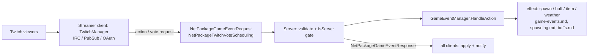
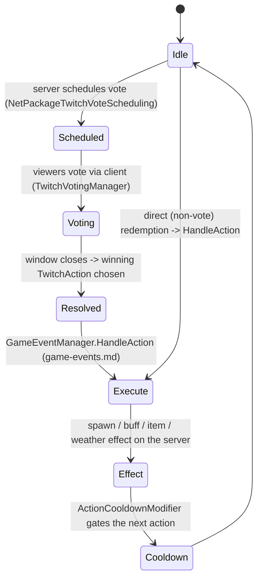

# Twitch integration (dedicated V3.1.0)

**Owns:** the server-relevant part of Twitch integration: how viewer-triggered
`TwitchAction`s and votes execute on the server (through the game-event system) and
sync to players.
**Not:** the Twitch connection itself (IRC / PubSub / OAuth), which the streaming
**client** hosts (residual); the Twitch Extension UI; `twitchevents.xml` content.
**Evidence:** `Twitch.*` IL (117 types; dump locally with `tools/src/DumpAll Twitch`,
git-ignored). **Hub:** [`INDEX.md`](INDEX.md). **Method:** [`re-methodology.md`](re-methodology.md).

Twitch integration is mostly client-hosted, but the **effects run on the server**
through already-documented systems, so this doc covers the server slice honestly
and points the connection details at the client residual.

---

## 1. Architecture and the client/server split

`TwitchManager` (singleton) drives the integration. On the **streamer's client** it
owns the Twitch connection: `TwitchIRCClient` (chat), `TwitchPubSub` (channel-point
redemptions), `TwitchAuthentication` (OAuth), and the Extension surface
(`ExtensionManager` / `ExtensionListener` / `ExtensionCommandPoller`). Viewers
trigger `TwitchAction`s (defined in `twitchevents.xml`, `TwitchActionsFromXml`)
directly or by voting (`TwitchVotingManager`, `TwitchVote`).

The **server** is gated by `ConnectionManager.IsServer`: it does not connect to
Twitch, but it validates and executes the resulting actions and schedules/syncs
votes. The action effects reuse the game-event interpreter
([game-events.md](game-events.md)) and the systems it drives (spawning, buffs,
items, weather).

---

## 2. Voting and action execution (state machine)

For voting integrations, the server schedules a vote window
(`NetPackageTwitchVoteScheduling`), viewers vote through the client, and the
winning `TwitchAction` is executed as a game event.

`AllowActions`, `ActionCooldownModifier`, `UseProgression` / `HighestGameStage`
(action difficulty scaling), and `IntegrationSetting` tune what viewers may do and
how strong it is. Because the effect path is the game-event system, a Twitch action
is just another `HandleAction` caller alongside quests and challenges.

**Server vote queue (`TwitchVoteScheduler`, server singleton):** the
dedicated host's vote-window FIFO (`votingParticipants` list +
`nextVoteTime`). `NetPackageTwitchVoteScheduling.ProcessPackage` (IL=16)
registers the sender on the server
(`TwitchVoteScheduler.Current.AddParticipant(sender.entityId)`, IL=10
dedupes) and asks `VotingManager.RequestApprovedToStart()` on the client.
The scheduler's `Update` (IL=68) requires a live world with players, counts
`nextVoteTime` down, and when a participant is due (windows spaced **3** s
apart) either starts the host vote (`RequestApprovedToStart` when the first
participant is the primary player) or broadcasts a fresh
`NetPackageTwitchVoteScheduling` on channel **192** to that participant,
then dequeues it.

---

## 3. Dedicated relevance and residuals

- **Server slice (dedicated path):** action/vote validation, `IsServer` gating,
  `GameEventManager.HandleAction` execution, and the `NetPackageGameEvent*` /
  `NetPackageTwitchVoteScheduling` sync all run on the server.
- **Residual (client / external):** the Twitch IRC / PubSub / OAuth connection and
  the Extension surface are hosted by the streamer's client and the Twitch backend;
  `twitchevents.xml` is content.

---

## Related docs

| Doc | Role |
|---|---|
| [game-events.md](game-events.md) | The interpreter that executes Twitch actions |
| [spawning.md](spawning.md) | Spawn effects triggered by Twitch actions |
| [buffs.md](buffs.md) | Buff effects triggered by Twitch actions |
| [full-surface.md](full-surface.md) | Whole-assembly map |

## Changelog

- **2026-07-23:** Initial Twitch-integration reversal (server action/vote execution via game events, client-hosted connection residual) with state machines.
