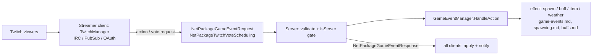
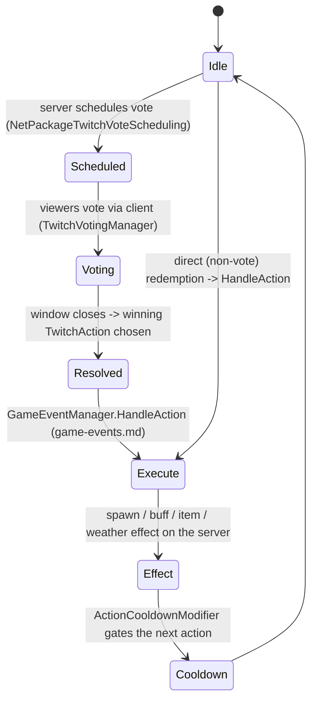

# Twitch integration (dedicated V3.1.0)

**Owns:** the server-relevant part of Twitch integration: how viewer-triggered
`TwitchAction`s and votes execute on the server (through the game-event system) and
sync to players.
**Not:** the Twitch connection itself (IRC / PubSub / OAuth), which the streaming
**client** hosts (residual); the Twitch Extension UI; `twitchevents.xml` content.
**Evidence:** `Twitch.*` IL (117 types; dump locally with `tools/src/DumpAll Twitch`,
git-ignored). **Hub:** [`INDEX.md`](INDEX.md). **Method:** [`re-methodology.md`](re-methodology.md).

Twitch integration is mostly client-hosted, but the **effects run on the server**
through already-documented systems, so this doc covers the server slice honestly
and points the connection details at the client residual.

---

## 1. Architecture and the client/server split

`TwitchManager` (singleton) drives the integration. On the **streamer's client** it
owns the Twitch connection: `TwitchIRCClient` (chat), `TwitchPubSub` (channel-point
redemptions), `TwitchAuthentication` (OAuth), and the Extension surface
(`ExtensionManager` / `ExtensionListener` / `ExtensionCommandPoller`). Viewers
trigger `TwitchAction`s (defined in `twitchevents.xml`, `TwitchActionsFromXml`)
directly or by voting (`TwitchVotingManager`, `TwitchVote`).

The **server** is gated by `ConnectionManager.IsServer`: it does not connect to
Twitch, but it validates and executes the resulting actions and schedules/syncs
votes. The action effects reuse the game-event interpreter
([game-events.md](game-events.md)) and the systems it drives (spawning, buffs,
items, weather).

---

## 2. Voting and action execution (state machine)

For voting integrations, the server schedules a vote window
(`NetPackageTwitchVoteScheduling`), viewers vote through the client, and the
winning `TwitchAction` is executed as a game event.

`AllowActions`, `ActionCooldownModifier`, `UseProgression` / `HighestGameStage`
(action difficulty scaling), and `IntegrationSetting` tune what viewers may do and
how strong it is. Because the effect path is the game-event system, a Twitch action
is just another `HandleAction` caller alongside quests and challenges.

**Server vote queue (`TwitchVoteScheduler`, server singleton):** the
dedicated host's vote-window FIFO (`votingParticipants` list +
`nextVoteTime`). `NetPackageTwitchVoteScheduling.ProcessPackage` (IL=16)
registers the sender on the server
(`TwitchVoteScheduler.Current.AddParticipant(sender.entityId)`, IL=10
dedupes) and asks `VotingManager.RequestApprovedToStart()` on the client.
The scheduler's `Update` (IL=68) requires a live world with players, counts
`nextVoteTime` down, and when a participant is due (windows spaced **3** s
apart) either starts the host vote (`RequestApprovedToStart` when the first
participant is the primary player) or broadcasts a fresh
`NetPackageTwitchVoteScheduling` on channel **192** to that participant,
then dequeues it.

**Server access gate (`NetPackageTwitchAccess`, ProcessPackage IL=55):**
the client asks the server whether its Twitch integration may run; the
server computes `allowed = !(AdminUsers.GetUserPermissionLevel(sender) >
GamePrefs 211)` and replies `Setup(allowed)` to that sender on channel
192. The client applies it: allowed -> `GameEventManager.
HandleGameEventAccessApproved()` (Twitch actions unlock), denied ->
`Misc/password_fail` head sound + `TwitchManager.DeniedPermission()`.

**`EntityPlayer` Twitch hooks:** `HandleTwitchActionsTempEnabled(newState)`
(IL=8) applies the new `TwitchActionsStates` only while a temporary state is
active; `HasTwitchMember` (IL=9) is `Party?.HasTwitchMember() ?? false`;
`HasTwitchVoteLockMember` (IL=9) is `Party?.HasTwitchVoteLock()` - the
per-player gates that couple Twitch action availability to party
composition.

**Twitch requirement gates (`BaseTwitchRequirement` family):** actions and
votes each carry a `List<BaseTwitchRequirement>` filled by
`TwitchActionsFromXml.ParseRequirement(XElement)` (IL=83): reflection on
`Twitch.TwitchRequirement{ClassName}` (and the `TwitchVoteRequirement{...}`
mirror for votes), cast to `BaseTwitchRequirement`, then `ParseProperties` +
`Init`. The base contract: `ParseProperties` (IL=14) stores the element's
`DynamicProperties` and parses the two shared props `invert` / `hide_action`
into `Invert` / `HideAction`; `Init()` delegates to the virtual `OnInit()`;
`CanPerform(Entity)` defaults to true. Two consumers gate on the list:
`TwitchAction.CheckAllowed()` (IL=34) and `TwitchAction.IsReady(manager)`
(IL=308) walk `TwitchRequirements`; a requirement with `HideAction` only
hides the action from the Twitch client UI when
`CanPerform(TwitchManager.LocalPlayer)` is false, while a plain requirement
blocks readiness/queueing the same way (the `LocalPlayer` is the Twitch
client's player, so this is the UI-side gate; execution stays server-side).
`BaseTwitchOperationRequirement` adds an `operation` field (the
`OperationTypes` enum, `ParseEnum` from the `operation` prop) with abstract
`LeftSide` / `RightSide` float providers and a `stringComparison` for string
sides; `BaseTwitchVoteOperationRequirement.CanPerform(player)` (IL=48)
compares the two sides with the operation via an 18-target switch (6
operations, 3 aliases each: equal, not-equal, less, greater, less-or-equal,
greater-or-equal). Concrete action requirements: `TwitchRequirementHasBuff`
(`buff` name split on `,` in `OnInit`, all must be active in `CanPerform`),
`TwitchRequirementHasProgression` (skill-tree perk points as
`LeftSide`/`RightSide`), `TwitchRequirementIsNight`
(`!World.IsDaytime()`, inverted by the `invert` flag), and
`TwitchRequirementSandboxBool` (reads `SandboxOptions.SandboxOptionManager.
GetBool` with the invert XOR) while `TwitchRequirementSandboxFloat/Int` are
operation requirements comparing two sandbox values via `LeftSide` /
`RightSide`; the `TwitchVoteRequirement*` types mirror them for votes.

**Pimp-pot and blood-moon bookkeeping (server fields):** `AddToPot(amount)`
/ `AddToBitPot(amount)` (IL=23 each) add to `RewardPot` / `BitPot`
(clamped at 0) and track `LeaderboardStats.LargestPimpPot` /
`LargestBitPot`; `SetPot` / `SetBitPot` (IL=28 each) clamp, store, and
announce the new balance through `ircClient.SendChannelMessage` using the
`chatOutput_PimpPotBalance` / `chatOutput_BitPotBalance` templates.
`SetupBloodMoonData` (IL=23) reads `GameStats` 42 (blood-moon day),
`CalcDuskDawnHours`, and sets `BMCooldownStart = dusk -
CurrentCooldownPreset.BMStartOffset`, `BMCooldownEnd = dawn +
BMEndOffset`; `WithinBloodMoonPeriod` (IL=33) is true while
`day == nextBMDay && hour >= BMCooldownStart` or
`day == currentBMDayEnd && hour < BMCooldownEnd` (the action cooldown
window around the horde). `AddKillToLeaderboard(username, color)` (IL=44)
increments the entry's `Kills` or appends `TwitchLeaderboardEntry(name,
color, 1)`.

**`TwitchManager.Update` (IL=1585) init-state machine + running loop:** the
manager's frame peer runs only with a live world and players. It is a
`switch` over `InitState` (9 targets): state 0 subscribes
`GameEventAccessApproved` and loads viewer data; states 2 / 4 are
login-timeout guards (`updateTime` countdown, then
`StopTwitchIntegration` + `Twitch: login failed in {state} state` warning
and a jump to state 10); state 5 checks the OAuth credentials and drives
the IRC connect; state 8 finalizes (`SetupTwitchCommands`, resolves
`LocalPlayer`, `RefreshPartyInfo`, seeds `HighestGameStage`). The common
tail (the default target) is the running loop: poll
`ExtensionManager.HasCommand`/`GetCommand` -> `HandleExtensionMessage`,
`ircClient.Update` + `AvailableMessage`/`ReadMessage` -> `HandleMessage`,
`ViewerData.Update`, then reconcile `LiveActionEntries` backwards
(removing `ReadyForRemove` entries, flagging `CooldownBlocked`) and prune
null `actionSpawnLiveList` entries; the cooldown/leaderboard/blood-moon
preset work shows up as `TwitchActionPreset.HandleCooldowns`,
`TwitchLeaderboardStats.UpdateStats` and the `BMCooldown*` fields. On a
dedicated host without Twitch configured the machine stalls in the init
states, which is the managers.md "waste if constructed without Twitch"
note.

**Viewer-points ledger (`TwitchViewerData`, server-side with Twitch
configured):** the `Dictionary<string, ViewerEntry>` registry keyed by
username (`ViewerEntry` carries `StandardPoints` / `SpecialPoints` floats,
sub-tier point values, and a display name). Commands and event entries spend
into it: `TwitchCommandAddPoints` / `TwitchCommandAddSpecialPoints` /
`TwitchCommandAddBitCredit` (`AddCredit`), `BaseTwitchEventEntry` credits
participants via `AddPointsAll`, and refunds go through
`ReimburseAction(username, amount, action)`. Query/flow surface:
`HasPointsForAction` (affordability), `GetPointTotals`, `GetRandomActiveViewer`
(action targeting), `MoveStandardToSpecialPoints`, `ResetAllPoints` /
`ResetAllSpecialPoints` / `ResetAllStandardPoints`, the per-second
`PointRate`, and `AddGiftSubEntry` / `GetGiftSubTierPoints` / `GetSubTierPoints`
(sub-tier credit). Persistence: `TwitchManager` saves via `Write` /
`WriteSpecial` and loads versioned via `Read(reader, version)` over
`SdFile` streams, plus `WriteExport` / `LoadExport` (a user-facing points
export) and `SetupLocalization`.

---

## 3. Dedicated relevance and residuals

- **Server slice (dedicated path):** action/vote validation, `IsServer` gating,
  `GameEventManager.HandleAction` execution, and the `NetPackageGameEvent*` /
  `NetPackageTwitchVoteScheduling` sync all run on the server.
- **Residual (client / external):** the Twitch IRC / PubSub / OAuth connection and
  the Extension surface are hosted by the streamer's client and the Twitch backend;
  `twitchevents.xml` is content.

---

## Related docs

| Doc | Role |
|---|---|
| [game-events.md](game-events.md) | The interpreter that executes Twitch actions |
| [spawning.md](spawning.md) | Spawn effects triggered by Twitch actions |
| [buffs.md](buffs.md) | Buff effects triggered by Twitch actions |
| [full-surface.md](full-surface.md) | Whole-assembly map |

## Changelog

- **2026-07-23:** Initial Twitch-integration reversal (server action/vote execution via game events, client-hosted connection residual) with state machines.
