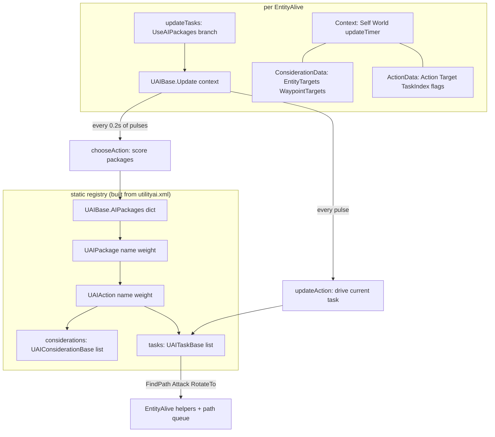
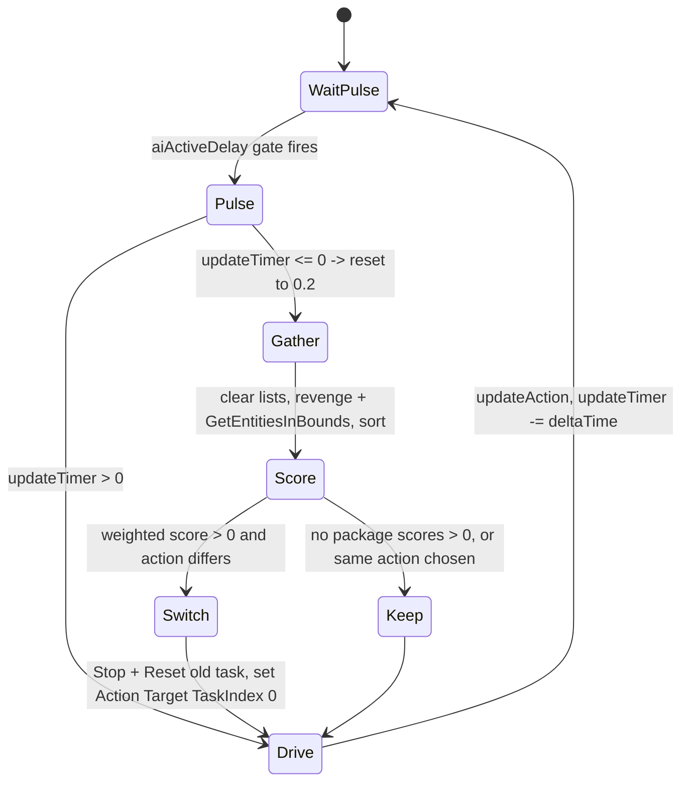
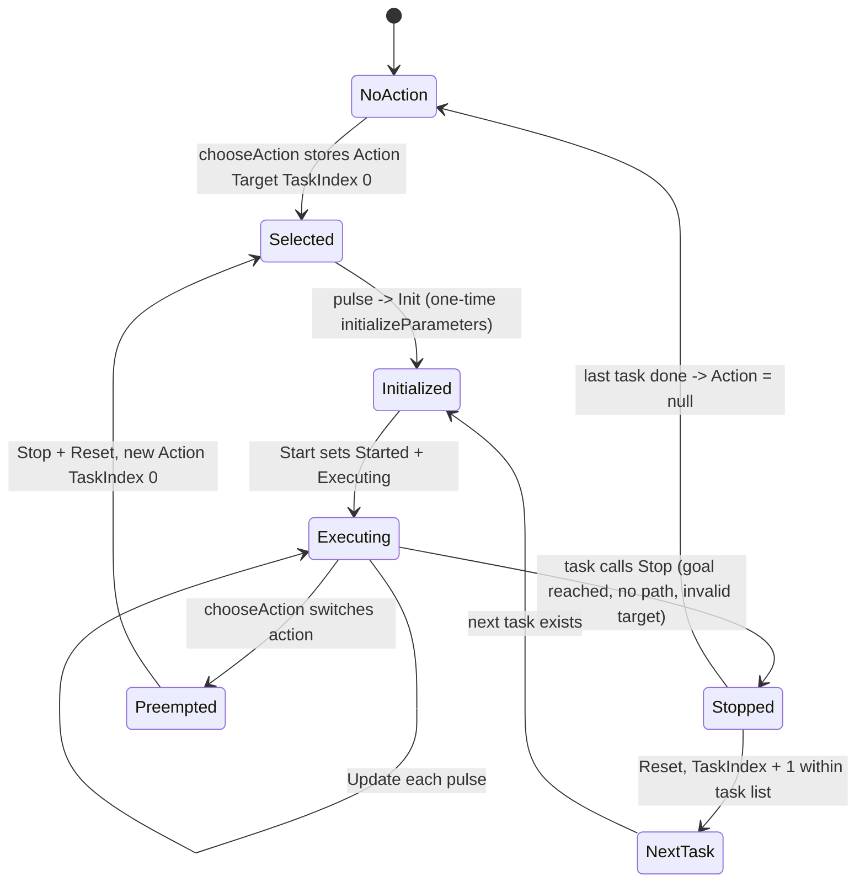

# Utility AI packages (`UAI.*`) (dedicated V3.0.1)

**Owns:** the managed `UAI.*` namespace, the data-driven utility AI that runs when
an entity class declares `AIPackages`: the package/action/consideration/task data
model, the scoring and selection pipeline (`UAIBase` + `UAIPackage` + `UAIAction`),
the response-curve library, the task execution lifecycle (`ActionData` flags), the
built-in tasks and considerations, and the `utilityai.xml` loader (`UAIFromXml`).
**Not:** the classic `EAI*` task lists, the AI LOD gate, and pathfinding
([`entity-ai.md`](entity-ai.md)); helper internals it calls
(`RandomPositionGenerator`, `FactionManager`, `CanEntityBeSeen`); the XML content
itself (data).
**Evidence:** `UAI.*` IL (23 types / 95 method bodies; dump locally with
`tools/src/DumpAll UAI`, git-ignored) plus targeted dumps of
`EntityAlive.InitPostCommon` / `EntityAlive.updateTasks`, `EntityClass.Init`, and
`UAIFromXml.*`. **Hub:** [`INDEX.md`](INDEX.md).
**Method:** [`re-methodology.md`](re-methodology.md).

Do not redistribute game IL.

---

## 1. Architecture

UAI is the second of the two decision systems selected in
`EntityAlive.updateTasks` ([`entity-ai.md`](entity-ai.md) §3.3): entities whose
`EntityClass.UseAIPackages` is true run `UAIBase.Update(utilityAIContext)` instead
of `EAIManager.Update()`. Everything below the entry point is static and shared:

- `UAIBase.AIPackages` is a **static** `Dictionary<string, UAIPackage>` filled
  once from `utilityai.xml`. A `UAIPackage` (name, weight) holds a list of
  `UAIAction`s; each `UAIAction` (name, weight) holds a list of
  `UAIConsiderationBase` (scorers) and a list of `UAITaskBase` (behaviour steps).
- Per entity there is exactly one `UAI.Context` (field
  `EntityAlive.utilityAIContext`): `Self`, `World`, a `ConsiderationData`
  (candidate lists `EntityTargets` / `WaypointTargets`), an `ActionData` struct
  (the running action + task cursor + lifecycle flags), and `updateTimer`.
- Task and consideration objects are instantiated **once at XML parse time** and
  shared by every entity running that package (see §5.3 for the consequence).



Entity wiring (`EntityAlive.InitPostCommon` IL): when the entity class has
`UseAIPackages`, the entity gets `hasAI = true`, copies
`EntityClass.AIPackages : string[]` into an instance list, and allocates
`new UAI.Context(this)`. `EntityClass.Init` sets `UseAIPackages = true` iff the
class has an `AIPackages` property (comma-separated package names, trimmed).

---

## 2. Cadence: when a decision actually happens

`UAIBase.Update(context)` is only reached on an **AI pulse**, i.e. when the
`aiActiveDelay` LOD gate in `updateTasks` fires (every tick at scale 1.0 near
players, every ~10th tick at 0.1 far away, [`entity-ai.md`](entity-ai.md) §4).
The 18-IL body is a two-rate driver:

```text
if context.updateTimer <= 0:
    context.updateTimer = UAIBase.ActionChoiceDelay   // static 0.2
    chooseAction(context)                             // re-decide
updateAction(context)                                 // always: drive current task
context.updateTimer -= Time.deltaTime
```

Two structural consequences:

- **Re-decision is at most every 0.2 s**, task driving happens on every pulse.
- `updateTimer` is decremented by `Time.deltaTime` **only on pulses that reach
  `UAIBase.Update`**. A far-LOD entity (pulse every 10th tick) therefore
  re-decides roughly every 4 pulses of accumulated frame deltas, not every 0.2 s
  of wall clock: the LOD throttle stretches the decision interval multiplicatively.

---

## 3. Decision pipeline (`chooseAction` -> `DecideAction` -> `GetScore`)

### 3.1 Candidate gathering

`chooseAction` first clears both candidate lists, then:

- **Entity targets** (`addEntityTargetsToConsider`): the revenge target (if any),
  plus `World.GetEntitiesInBounds(self, bounds expanded by GetSeeDistance in all
  three axes)`, sorted nearest-first with the nested comparer
  `UAIUtils.NearestEntitySorter`. Note this is *any* `Entity` in see range, not
  just enemies; filtering is left to considerations.
- **Waypoint targets** (`addWaypointTargetsToConsider`): the method only
  lazily allocates and sorts (`NearestWaypointSorter`); it adds nothing. The only
  producer of waypoints in the namespace is the `PathBlocked` consideration's
  side effect (§6.1), and the list is cleared again on the next decision pulse.

### 3.2 Scoring

For each package name on the entity (in `EntityAlive.AIPackages` order),
`UAIPackage.DecideAction(context, out action, out target)` runs a classic utility
argmax: every action is scored against every entity candidate and every waypoint
candidate, keeping the best (action, target) pair and returning its score.
Candidate loops are capped by the static `MaxEntitiesToConsider` /
`MaxWaypointsToConsider` (both 5; the IL compares with `ble`, so up to 6
candidates of each kind are actually scored). The waypoint loop re-reads the list
count live, so waypoints injected mid-pass by `PathBlocked` can still be scored
in the same pass.

`UAIAction.GetScore(context, target, min)` is a multiplicative consideration
chain with Dave-Mark-style compensation:

```text
score = 1
if considerations empty: return weight          // unconditional action (Wander)
if tasks empty:          return 0               // nothing to execute
for each consideration c:
    if score < 0 or score < min: return 0       // min is always passed as 0
    score *= c.ComputeResponseCurve(c.GetScore(context, target))
makeup = (1 - score) * (1 - 1/n) * score        // n = consideration count
return (score + makeup) * weight
```

Two quirks proven by the IL:

- The early-out `min` parameter is always called with `0`, so the pruning branch
  is dead: every consideration always runs.
- `1 - 1/n` is computed with **integer division**: it is `0` for one
  consideration and `1` for two or more. The compensation factor is binary, not
  the intended gradual `1 - 1/n` ramp; with n >= 2 the result is
  `score + (1 - score) * score`.

### 3.3 Cross-package selection: last positive package wins

Back in `chooseAction`, each package's returned score is multiplied by the
package weight and compared against a local best that is initialized to 0 and
**never reassigned** (no store to it exists in the loop body). The comparison is
therefore "weighted score > 0", not "better than the previous package". The
effects:

- Any package returning a positive score whose chosen `UAIAction` differs from
  the currently stored one triggers a switch; with several packages the **last**
  positive one in the entity's list wins every decision pulse.
- If the chosen action is the **same instance** as the running one, nothing
  happens and the task chain continues undisturbed (this is what keeps
  multi-task actions progressing across re-decisions).
- On a switch, the running task (if any) gets `Stop` (when started) and `Reset`
  (when initialized), then `ActionData.Action / Target` are replaced and
  `TaskIndex = 0`.



If both candidate lists are empty, no scoring happens at all and the current
action (possibly null) persists: a UAI entity alone in an empty area simply does
nothing until something enters its see-distance bounds.

---

## 4. Response curves (`UAIConsiderationBase.ComputeResponseCurve`)

Every consideration score is shaped by a per-consideration curve configured from
XML attributes `curve`, `x_intercept`, `y_intercept`, `slope_intercept`
(default 1), `exponent` (default 1), `flip_x`, `flip_y`. `flip_x` maps the input
to `1 - x` before the curve, `flip_y` maps the output to `1 - y` after it, and
the result is always `Clamp01`ed. Default curve is **Linear**.

| `CurveType` | Formula (from IL, before flip_y/clamp) |
|---|---|
| Constant (0) | `y = yInt` |
| Linear (1) | `y = slope * (x - xInt) + yInt` |
| Quadratic (2) | `y = slope * x * abs(x + xInt)^exp + yInt` |
| Logistic (3) | `y = exp * 1 / (1 + abs(1000 * slope)^(-x + xInt + 0.5)) + yInt` |
| Logit (4) | `y = -ln(1 / abs(x - xInt)^exp - 1) * 0.05 * slope + 0.5 + yInt` |
| Threshold (5) | `x <= xInt: y = slope - 1; else y = 1 - yInt` |
| Sine (6) | `y = sin(slope * (x + xInt)^exp) * 0.5 + 0.5 + yInt` |
| Parabolic (7) | `y = (slope * (x + xInt))^2 + exp * (x + xInt) + yInt` |
| NormalDistribution (8) | `y = exp / sqrt(2*pi) * 2^(-(1 / (abs(slope) * 0.01)) * (x - (xInt + 0.5))^2) + yInt` |
| Bounce (9) | `y = abs(sin(6.28 * exp * (x + xInt + 1)^2) * (1 - x) * slope) + yInt` |

---

## 5. Task execution lifecycle

### 5.1 `updateAction` and the `ActionData` flags

`ActionData` is a mutable struct on the context: `Action`, `Target`, `Data`,
`TaskIndex`, `TaskStartTimeStamp`, and flags `Initialized`, `Started`,
`Executing`, `Failed`, `Finished`. `get_CurrentTask` resolves
`Action.GetTasks()[TaskIndex]` with bounds checks (null when out of range).
`updateAction` runs every pulse:

```text
task = ActionData.CurrentTask;  if null: return
if !Initialized: task.Init(context)        // sets Initialized, clears Started/Executing
if !Started:     task.Start(context)       // sets Started + Executing
if Executing:    task.Update(context)      // one behaviour step
else:            task.Reset(context)       // ClearData: all flags false
                 TaskIndex++ if more tasks else Action = null
```

A task signals completion by calling `Stop` (clears `Executing`); the **next**
pulse then resets it and advances the cursor, so an action's task list executes
sequentially, one task at a time. When the last task finishes, `Action` goes
null and the entity idles until `chooseAction` picks again.



Dormant fields: `Failed` is written only by `UAITaskFleeFromTarget.Start` (target
not an `EntityAlive`) and never read; `Finished`, `TaskStartTimeStamp`, and
`Data` are only touched by `ClearData`. The per-action scratch slot exists but no
stock task uses it.

### 5.2 Built-in tasks (V3.0.1)

All five subclasses parse their XML attributes lazily in
`initializeParameters` (guarded by `parmsInitialized`, once per shared instance).

| Task | Parameters | Start | Update / stop condition |
|---|---|---|---|
| `MoveToTarget` | `distance`, `run`, `break_walls` | `FindPath` to `RandomPositionGenerator.CalcNear(target.position, distance, distance)`; speed = panic if `run`, else aggro when alert, else walk (entity target) or walk (Vector3 target); non-entity non-Vector3 target: immediate `Stop` | `Stop` when `navigator.noPathAndNotPlanningOne()` |
| `Wander` | `max_distance` (parsed but **unused**: `Start` hardcodes 10) | `FindPath` to `CalcAround(10, 10)` at walk speed | `Stop` when no path and none planned |
| `FleeFromTarget` | `max_distance` | `detachHome`, `FindPath` to `CalcAway(0, max, max, threat.position)` at panic speed; non-entity target sets `Failed` | when no path left: `setHomeArea(current pos, 10)` then `Stop` |
| `AttackTargetEntity` | (none) | look at target head if `CanSee`, `RotateTo(30, 30)` if limbs intact, arm `attackTimeout = GetAttackTimeoutTicks()` | decrement timeout per pulse; at 0 call `Attack(false)`, and if it reports ready: re-arm, `Attack(true)`, `Stop`; lost target: `Stop` |
| `AttackTargetBlock` | (none) | same look/rotate against a boxed `Vector3` block position | same attack pattern against the block position |

Path requests all funnel through `EntityAlive.FindPath`, i.e. UAI competes for
the same 8-per-slice path drain as EAI ([`entity-ai.md`](entity-ai.md) §D3.7).

### 5.3 Shared-instance caveat

Because tasks are single instances shared across every entity running the
package, instance fields such as `attackTimeout`, `distance`, or
`maxFleeDistance` are **global to the package**, not per entity. Parameters are
read-only after parse so sharing them is harmless, but `attackTimeout` is
mutable per-swing state: two entities interleaving pulses on the same attack task
overwrite each other's countdown. Per-entity task state was clearly meant to
live in `ActionData.Data`, which stock tasks never use. Main-thread-only
execution keeps this interleaving deterministic, not correct.

---

## 6. Considerations

`GetScore(context, candidate)` returns a raw value (usually 0..1) that the curve
then shapes. The base implementation returns constant 1.

| Consideration | Parameters | Raw score |
|---|---|---|
| `TargetDistance` | `min`, `max` (squared at Init; ctor default max field 9126) | `clamp01(max(0, distSq - min^2) / (max^2 - min^2))` for entity or Vector3 candidates, else 0 |
| `TargetType` | `type` (comma list, resolved via `Type.GetType`) | 1 if any listed type `IsAssignableFrom` the candidate's type; Vector3 candidates match against the block type at that position (`type="Block"` matches every block); else 0 |
| `TargetVisible` | curve attrs only | `CanEntityBeSeen(target)` as 0/1 (entity) or `CanSee(pos)` (Vector3) |
| `SelfVisible` | curve attrs only | `(1 - headDistSq / seeDist^2) * (target can see self ? 1 : 0)`: how exposed *self* is to the candidate |
| `SelfHealth` | `min` (0), `max` (default NaN, lazily replaced by `GetMaxHealth`) | `(health - min) / (max - min)` |
| `TargetHealth` | curve attrs only | entity: `health / maxHealth`; Vector3: block `(MaxDamage - damage) / MaxDamage`; else 0 |
| `TargetFactionStanding` | `min` (0), `max` (255) | `(FactionManager.GetRelationshipValue(self, target) - min) / (max - min)` |
| `PathBlocked` | none | 0/1, see below |

### 6.1 `PathBlocked`: a consideration with a side effect

The largest type in the namespace (432 IL across helpers) is not a pure scorer.
`GetScore` returns 1 only when both hold, and **then appends a waypoint**:

1. `IsPathUsageBlocked`: the navigator has a path whose end point is >= 2.1
   dist^2 away from the current attack/investigate block position, and either the
   target is closer than 256 dist^2 (16 m) or the path end is farther from the
   target than the entity already is (the path does not make progress).
2. `CanAttackBlocks`: probe up to 8 block positions around the entity, ordered
   by the yaw toward the target (degrees to radians via the 0.0175 constant):
   head-height ahead, feet ahead, two blocks ahead at both heights, then the
   axis-aligned fallbacks, each tested with `Block.IsMovementBlocked`.

On success the blocking block's position is added to
`ConsiderationData.WaypointTargets`. That injected waypoint is what the
`TargetType type="Block"` + `AttackTargetBlock` / `MoveToTarget` actions in
`utilityai.xml` score against: "path blocked" converts a movement failure into a
block-attack candidate for the same or the next decision pass. The list is
cleared at the start of every decision, so the waypoint lives for exactly one
selection cycle.

---

## 7. XML pipeline (`UAIFromXml`, `utilityai.xml`)

`UAIFromXml.Load` (coroutine) walks `<ai_packages>` and builds the static
registry:

- `<ai_package name weight>` -> `new UAIPackage(name, weight)` (weight default 1),
  added to `UAIBase.AIPackages` unless the name already exists.
- `<action name weight>` -> `new UAIAction`; children named `task` /
  `consideration` are dispatched by element name.
- `<task class="X" ...>` -> `ReflectionHelpers.GetTypeWithPrefix("UAI.UAITask", X)`,
  `Activator.CreateInstance`, all XML attributes stored into the task's
  `Parameters` dict (parsed lazily at first `Init`).
- `<consideration class="X" ...>` -> prefix `UAI.UAIConsideration`, instance
  created and `Init(attributes)` called immediately (curve attrs in the base,
  subclass extras on top).

The `class` prefix convention means mods can add tasks/considerations just by
naming a type `UAI.UAITaskFoo` / `UAI.UAIConsiderationFoo`.
`UAIBase.Reload` clears the dict and re-triggers `WorldStaticData.Reset("utilityai")`;
`Cleanup` clears it on shutdown.

---

## 8. Constants found

| Constant | Where | Meaning |
|---|---|---|
| **0.2** | `UAIBase.cctor` (`ActionChoiceDelay`) | Minimum interval between decisions (in accumulated pulse deltas) |
| **5** | `MaxEntitiesToConsider` / `MaxWaypointsToConsider` | Candidate caps (`ble` check, so 6 actually scored) |
| **1.0** | `updateTasks` | `aiActiveDelay` reset that gates each UAI pulse |
| **2.1** / **256** | `PathBlocked.IsPathUsageBlocked` | Path-end tolerance dist^2 / near-target dist^2 (16 m) |
| **0.0175** | `PathBlocked.CanAttackBlocks` | Degrees to radians for yaw probe direction |
| **9126** | `TargetDistance.ctor` | Default max (already squared, ~95.5 m) |
| **255** | `TargetFactionStanding` | Default relationship max |
| **NaN** | `SelfHealth` | Sentinel: resolve max from `GetMaxHealth` at first score |
| **30, 30** | attack tasks | `RotateTo` yaw/pitch rates |
| **10** | `Wander.Start` / `FleeFromTarget.Update` | Hardcoded wander radius (ignores `max_distance`) / home area radius |
| **0.05** / **0.01** / **6.28** | response curves | Logit scale, normal-distribution width scale, 2*pi |

---

## 9. Dedicated relevance and residuals

- **The subsystem is live code but dormant content in stock V3.0.1.** The
  shipped `utilityai.xml` defines four packages (`Zombie_Dumb`, `Human Basic`,
  `Human Melee`, `Human Ranged`), but the only `entityclasses.xml` entries with
  an `AIPackages` property (`npcSurvivorTemplate` / `npcSurvivorRanged`) sit
  inside a comment block, and nothing references `Zombie_Dumb`. No stock entity
  takes the `UseAIPackages` branch; every stock zombie/animal runs classic EAI.
  This is the bandit/NPC framework, and it is exactly what NPC overhaul mods
  drive (which is why the UAI FindPath callers show up in xrefs,
  [`entity-ai.md`](entity-ai.md) §6.5).
- When enabled, its costs are main-thread and shaped like EAI's: a
  `GetEntitiesInBounds` volume query per decision (at most every 0.2 s per
  entity, LOD-stretched), up to 6+6 candidates x actions scored, and `FindPath`
  enqueues from tasks into the shared 8-per-slice path drain.
- **Residuals:** internals of `RandomPositionGenerator`, `FactionManager`,
  `CanEntityBeSeen` / `GetSeeDistance`, and `EntityAlive.Attack` (referenced but
  reversed elsewhere or not at all); the sorters' exact tie-breaking; XML content
  semantics (data, not loop IL).

---

## Consideration leaves

Per-leaf narration of the built-in scorers (raw-score formulas tabulated in §6;
every raw score is then shaped by the response curve, §4). Each is a
`UAI.UAIConsideration*` deriving `UAIConsiderationBase` with one
`GetScore(Context, object)` override, instantiated once at XML parse and shared
by all entities; none run in stock (dormant, §9), all are hot per candidate per
decision once `AIPackages` is enabled.

- **`UAIConsiderationSelfHealth`**: scores own vitality,
  `(Health - min) / (max - min)`; `max` defaults to NaN and `GetScore` lazily
  replaces it with `GetMaxHealth()` on first call (the §8 sentinel).
- **`UAIConsiderationSelfVisible`**: scores own exposure to the candidate,
  `(1 - headDistSq / GetSeeDistance()^2)` gated to 0 unless the *target* can see
  self (`target.CanEntityBeSeen(self)`); 0 for non-entity candidates.
- **`UAIConsiderationTargetDistance`**: linear ramp over squared distance,
  `clamp01(max(0, distSq - min) / (max - min))` (Init squares `min`/`max`, ctor
  default max 9126 ~ 95.5 m); near = 0, far = 1. Handles entity and Vector3
  waypoint candidates, else 0.
- **`UAIConsiderationTargetHealth`**: entity candidate: `Health / GetMaxHealth`;
  Vector3 candidate: remaining hitpoint fraction of the block at that position,
  `(MaxDamage - damage) / MaxDamage`; else 0.
- **`UAIConsiderationTargetType`**: binary type filter; `Init` splits the
  `type` parameter on commas, `GetScore` returns 1 if any listed type
  (`Type.GetType` + `IsAssignableFrom`) matches the candidate's class (Vector3:
  the `Block` subtype at that position), else 0.
- **`UAIConsiderationTargetVisible`**: binary line of sight,
  `CanEntityBeSeen(target)` for entities, `CanSee(pos)` for Vector3 waypoints
  (helper internals are a §9 residual); a per-candidate LOS check every scored
  decision.

---

## Related docs

| Doc | Role |
|---|---|
| [entity-ai.md](entity-ai.md) | The `updateTasks` gate that calls `UAIBase.Update`, EAI counterpart, pathfinding |
| [loop.md](loop.md) | Frame / tick context above the entity chain |
| [full-surface.md](full-surface.md) | Where `UAI.*` sits in the whole-assembly map |
| [re-methodology.md](re-methodology.md) | How this was reversed |
| [residuals.md](residuals.md) | What IL cannot close |

## Regenerate

```bash
cd tools && ./build.sh --skip-legacy
MONO_PATH=bin mono bin/DumpAll.exe "$ASM" ../il/full-v3.0.1 UAI
```

## Changelog

- **2026-07-24:** Per-leaf consideration narration (`UAIConsideration*` GetScore mechanics).
- **2026-07-23:** Initial `UAI.*` reversal: registry + context architecture, two-rate decision cadence, scoring pipeline (integer-division compensation quirk, last-positive-package selection quirk), response-curve formulas, task lifecycle state machine, PathBlocked waypoint injection, XML pipeline, stock-dormant status.
