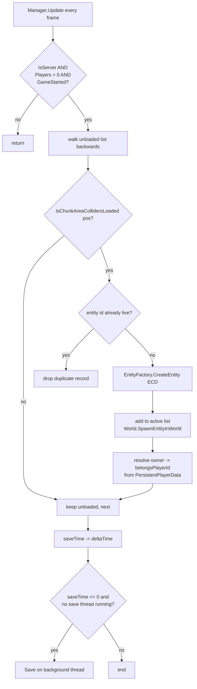
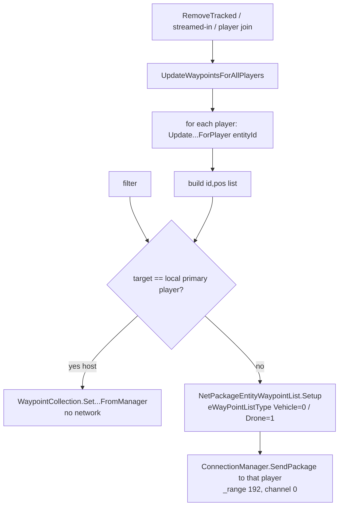
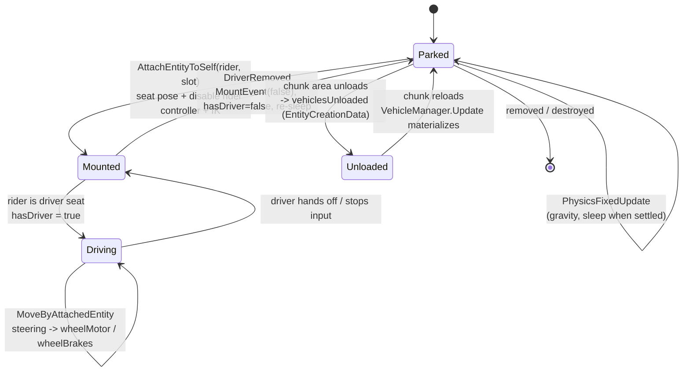
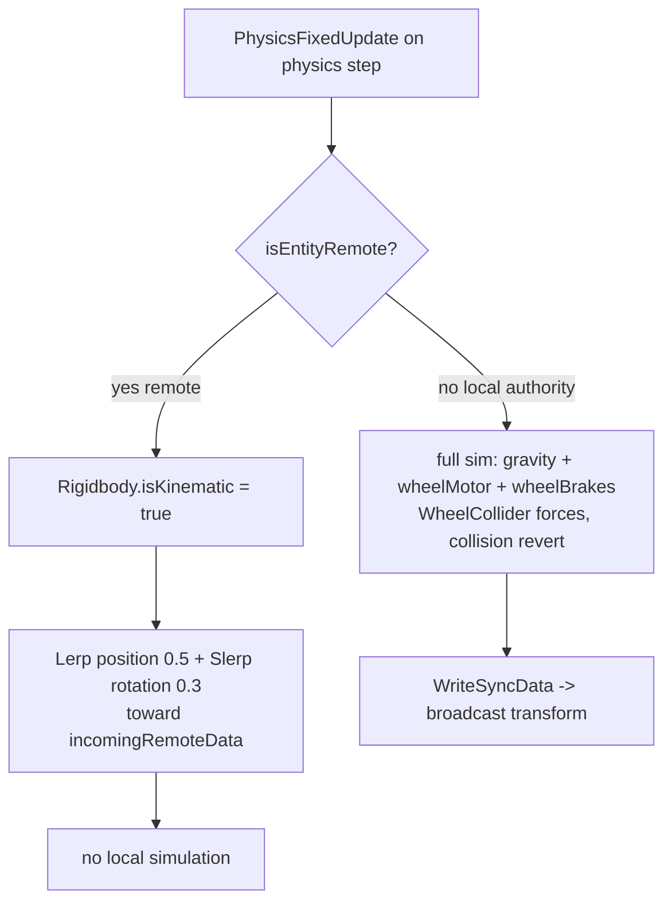
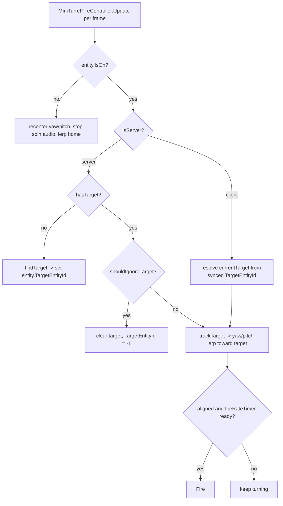
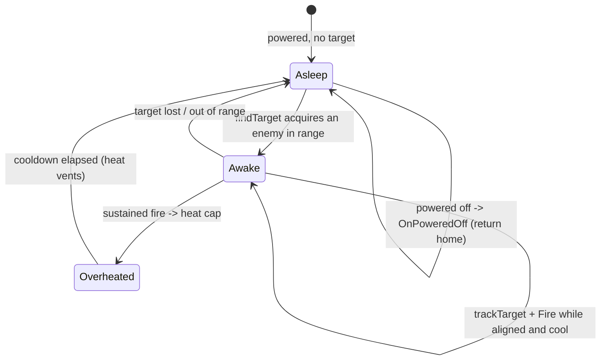

# Vehicles, drones, and turrets (dedicated V3.1.0)

**Owns:** the three deployable-entity subsystems a dedicated server persists and
drives: player vehicles (`VehicleManager` / `EntityVehicle` / `Vehicle`), junk
drones (`DroneManager` / `EntityDrone`), and turrets (`TurretTracker` /
`EntityTurret` plus the powered turret block on `TileEntityPoweredRangedTrap`).
Covers the per-frame manager loop, the per-player map-waypoint push, mount and
movement authority, drone follow behaviour, and turret targeting and fire.
**Not:** the Unity Rigidbody / WheelCollider integration itself (native
residual); the XML that defines each vehicle, drone, and turret (content); the
in-vehicle UI and camera (client-only).
**Evidence:** `VehicleManager`, `EntityVehicle`, `Vehicle`, `DroneManager`,
`EntityDrone`, `EntityTurret`, `TurretTracker`, `AutoTurretFireController`,
`MiniTurretFireController`, `AutoTurretController` IL, and the `NetPackage*`
spawn / sync / positions bodies (dump locally with `tools/src/DumpMethod`,
git-ignored). **Hub:** [`INDEX.md`](INDEX.md). **Method:**
[`re-methodology.md`](re-methodology.md). **Tick context:**
[`entity-ai.md`](entity-ai.md).

Do not redistribute game IL.

---

## 1. Architecture: three registries, three entity families

Each subsystem has a plain (non-MonoBehaviour) singleton **registry** created and
`Init`ed once, and one or more **entity** types that carry the actual behaviour.
The registries are updated every frame from the `GameManager.gmUpdate` manager
fan-out (see [`entity-ai.md`](entity-ai.md) §D9 for the IL sizes), all three
guarded by `ConnectionManager.IsServer`, so on a client the registry `Update`
returns immediately.

| Registry | Tracks | Persists to | Per-frame job | Update IL |
|---|---|---|---|---:|
| `VehicleManager` | `vehiclesActive: List<EntityVehicle>`, `vehiclesUnloaded: List<EntityCreationData>` | `vehicles.dat` | stream unloaded vehicles into loaded chunks; wake / save | 297 |
| `DroneManager` | `dronesActive: List<EntityDrone>`, `dronesUnloaded`, `dronesWithoutOwner` | `drones.dat` | stream in owned drones; teleport far followers; save | 305 |
| `TurretTracker` | `turretsActive: List<EntityTurret>`, `turretsUnloaded: List<int>` | `turrets.dat` | save timer only (no streaming loop) | 45 |

| Entity | Base | Where its logic runs | Notes |
|---|---|---|---|
| `EntityVehicle` (base of `EntityDriveable`) | `EntityAlive` | `PhysicsFixedUpdate` (physics step) | `updateTasks` is a 1-IL nop: vehicles have no AI |
| `EntityDrone` | `EntityNPC` -> `EntityAlive` | `OnUpdateEntity` (178) + `updateTasks` (139), entity tick | server state machine + steering |
| `EntityTurret` | `EntityAlive` | `OnUpdateEntity` (414), entity tick + fire-controller `Update` per frame | deployed junk turret / robotic sledge |
| powered turret block | `TileEntityPoweredRangedTrap` | `AutoTurretFireController.Update` per frame | on the power grid, not an `EntityAlive` |

Two independent "turret" implementations exist: the deployed **EntityTurret**
(driven by a `MiniTurretFireController`, tracked by `TurretTracker`) and the
placed **powered turret block** (a `TileEntityPoweredRangedTrap` driven by
`AutoTurretController` + `AutoTurretFireController`, owned by the power grid, see
[`managers.md`](managers.md)). They share the aim helpers `AutoTurretYawLerp` /
`AutoTurretPitchLerp` and the `TurretState` enum but nothing else.

All three registries share one persistence shape: a `vda\0` char signature, a
version byte `1`, an `Int32` count, then per-record data (full
`EntityCreationData` for vehicles and drones, bare entity ids for turrets),
saved on a background `ThreadManager` thread (`vehicleDataSave` /
`turretDataSave`) with a `.bak` rotation. The save is armed by a `saveTime`
countdown (default 120 s, clamped to 10 s after any mutating change via
`TriggerSave`).

---

## 2. The per-frame manager loop (streaming model)

`VehicleManager.Update` and `DroneManager.Update` share the same skeleton: bail
unless server, there is at least one player, and the game has started, then walk
the "unloaded" list backwards and **materialize** any record whose chunk area
colliders are now loaded. This is how a saved vehicle or drone comes back into
the world as its owner rides toward it.



Differences that matter:

- **Vehicles stream by chunk.** A vehicle nudges its stored Y up by `0.002`
  before spawn (so it settles onto, not through, the freshly loaded collider),
  then `updateTransform` settles it with a downward raycast.
- **Drones stream by owner.** A drone record with no resolvable position first
  scans `PersistentPlayerList` for the owning player and recovers the owner's
  head position and `belongsPlayerId`; a record with an invalid (`NaN`) position
  and no owner is parked in `dronesWithoutOwner`. After streaming, a second loop
  yanks any active drone more than `32 m` (`1024` sq) from its owner's chest back
  with `TeleportOutOfRange`, unless the drone is in `Shutdown` state or its order
  is `Sentry` (a parked sentry is allowed to be far from its owner).
- **Turrets do not stream here.** `TurretTracker.Update` only runs the save
  timer. A deployed turret is a normal world entity: it comes back through the
  standard entity-load path, registers via `AddTrackedTurret`, and does its own
  work in `OnUpdateEntity`.

`VehicleManager.PhysicsWakeNear(pos)` adds a zero force (`ForceMode.VelocityChange`
wake) to every active vehicle within `20 m` (`400` sq) so a sleeping Rigidbody
re-engages when a player or explosion approaches. Counts are capped at **500**
per subsystem on the dedicated build (`CanAddMoreVehicles` /
`CanAddMoreTurrets` / `CanAddMoreDrones`, gated on device flag 56); other
platforms are unbounded.

**`VehicleManager` save path:** `SaveAndClear` (IL=15) is the shutdown flush:
`WaitOnSave(); Save(); WaitOnSave();` then clears `vehiclesActive` and
`vehiclesUnloaded` and nulls the singleton. `WaitOnSave` (IL=11) joins the
background `saveThread` (30 ms wait) and drops it. `SaveThread` (IL=41) is the
worker: it copies an existing `vehicles.dat` to `vehicles.dat.bak`, rewinds the
pooled stream handed over by `Save`, `WriteStreamToFile` to
`{saveDir}/vehicles.dat`, logs `VehicleManager saved {0} bytes`, and returns
the pooled stream. `GetServerVehicleCount` (IL=13) is
`vehiclesActive.Count + vehiclesUnloaded.Count` on the server, else the
replicated `serverVehicleCount` static.

---

## 3. Per-player map waypoints

Each registry can push the set of its entities as **map markers** to one player.
The methods the task names (`VehicleManager.UpdateVehicleWaypointsForPlayer`,
`DroneManager.UpdateWaypointsForPlayer`) build a `List<(int id, Vector3 pos)>`
filtered to what that player should see, then deliver it one of two ways.



The filter differs by subsystem:

- **Vehicles:** include a vehicle whose `belongsPlayerId` equals the target
  player **or** is `-1` (unowned vehicles show for everyone).
- **Drones:** cross-reference the player's `OwnedEntityData` list (class
  `junkDroneClass`) against drone records, so a player only sees drones they own;
  the method first unregisters stale `NavObject`s for that class.

The host (integrated server) writes the local player's `WaypointCollection`
directly; a networked player gets a `NetPackageEntityWaypointList` on the
reliable admin channel `192`. A companion `NetPackageVehiclePositions` carries a
bare `List<(id, pos)>` and, on receipt, refreshes the client's vehicle markers
the same way.

---

## 4. Vehicles: mount, drive, dismount

### 4.1 Spawn and ownership (server-authoritative)

Placing a vehicle is a client -> server request. `NetPackageVehicleSpawn`
(fields: `entityType:i32`, `pos:Vector3`, `rot:Vector3`, `itemValue`,
`entityThatPlaced:i32`) is validated on the server: the sender id must be valid
and `CanAddMoreVehicles()` must pass, then the server calls
`EntityFactory.CreateEntity`, clones the item value onto the `Vehicle`, sets the
owner from the placing client's `InternalId`, and `SpawnEntityInWorld`. The new
`EntityVehicle` registers with `VehicleManager.AddTrackedVehicle`.

### 4.2 The `Vehicle` model

`EntityVehicle` is the world entity; the logical `Vehicle` object it wraps owns
the part list (`VehiclePart` subclasses: `VPEngine`, `VPWheel`, `VPSeat`,
`VPSteering`, `VPFuelTank`, `VPHeadlight`, `VPStorage`, `VPChassis`,
`VPPedals`), the inventory, the owner id, and seat poses. Mounting attaches a
rider entity to a seat slot.



`AttachEntityToSelf` (**IL=100**): base attach; `SetVehiclePoseMode(GetSeatPose)`;
rider layer **24**; disable character controller; seat IK targets;
`isInteractionLocked = (free seats == 0)` and toggle native collider; seat 0
sets `hasDriver`, `Vehicle.SetColors`, `FireEvent(0)`, `SetVehicleDriven`,
`TriggerUpdateEffects`; local player inserts vehicle action set + CameraInit.

**`Vehicle.CalcMods` (IL=77) and `CalcEffects` (IL=182) are the
item-value-driven config passes.** `CalcMods` ORs every installed
`ItemClassModifier`'s `ModifierTags` into `Vehicle.ModTags`, counts the mods
carrying `EntityVehicle.StorageModifierTags`, then per `VehiclePart`
`SetMods()` and updates the entity (`UpdateStorageModCount(count)` +
`UpdateContainerSize(false)`) - so storage mods enlarge the vehicle
container. `VehiclePart.SetMods` (IL=68) is the part-level half: it reads
the part's `mod` property and sets `modInstalled =
vehicle.ModTags.Test_Bit(FastTags.GetBit(mod))`, then positions the `modT`
transform via `modRot` (or `SetActive(modInstalled)` without a rotation),
hides the `modHideT` transform when installed, and enables the `modRBT`
physics transform when installed - the mod's visual and collider appear on
the part exactly when the vehicle carries the matching mod tag.
`SetItemValueMods(itemValue)` (IL=22) is the refresh entry: it copies
`Modifications` + `CosmeticMods` from a clone into the vehicle's item value,
then runs `CalcEffects` + `CalcMods` + `SetColors` + `SetSeats`.
`CalcEffects` evaluates the vehicle passive set on the item value
with the driver's entity tags: entity/block/self damage per (passives **55** /
**56** / **57** / **58**, each scaled by the static
`VehicleEntityDamageModifier` / `VehicleBlockDamageModifier` /
`VehicleSelfDamageModifier`), light intensity (**49**), fuel max (**50**) and
fuel use per (**51**, scaled by `VehicleFuelUsageModifier`), motor torque
(**53**) and max velocity (**52**).

**`Vehicle` config-class leaves (all IL-verified):**
`SetupProperties()` (IL=17) resolves the vehicle's `Properties` from the
static `PropertyMap` by `vehicleName`, erroring `Vehicle properties for
'{0}' not found!` on a miss. `CreateParts()` (IL=86) runs
`ParseGeneralProperties` then walks the `Properties.Classes`: each class's
`class` attribute resolves through `GetTypeWithPrefix("VP", name)` +
`Activator.CreateInstance` into a `VehiclePart`, which gets
`SetVehicle(this)` + `SetTag(className)` + `SetProperties(props)` and joins
`vehicleParts` (a bad class name rethrows `No vehicle part class 'VP{name}'
found!`), then every part gets `InitPrefabConnections()`.
`ParseGeneralProperties(properties)` (IL=133) reads the physics/config
fields: the `cameraDistance` / `cameraTurnRate` / `hopForce` Vector2s, the
`steerAngleMax` / `steerRate` / `steerCenteringRate` / `tiltAngleMax` /
`tiltThreshold` / `tiltDampening` / `tiltDampenThreshold` / `tiltUpForce` /
`upAngleMax` / `upForce` / `brakeTorque` / `unstickForce` / `wheelPtlScale`
floats, the `motorTorque_turbo` and `velocityMax_turbo` 4-tuples
(forward / backward / turbo forward / turbo backward), the
`airDrag_velScale_angVelScale` pair, the `waterDrag_y_velScale_velMaxScale`
and `waterLift_y_depth_force` triples, and `recipeName`.
`OnXMLChanged()` (IL=41) re-runs `SetupProperties` + `ParseGeneralProperties`
and pushes each class's properties into the existing part via
`FindPart(key)?.SetProperties(props)` (the entity-side wrapper, IL=6, then
calls `SetupDevices`).
`GetPartProperty(tag, propertyName)` (IL=12) is `FindPart(tag)?.GetProperty`
("" on a missing part); `GetParts()` (IL=3) and `GetMeshTransform()` (IL=3)
expose `vehicleParts` / `meshT`; `GetParticleTransformPaths()` (IL=30)
collects every part's non-empty `particle_transform` property.
`GetHornSoundName()` (IL=5) is `Properties.GetString("hornSound")`;
`HasHorn()` (IL=6) is its length > 0; `IsSteeringBroken()` (IL=10) is
`!HasSteering()` or `FindPart("handlebars").IsBroken()`.
`GetBatteryLevel()` (IL=2) and `GetEngineQualityPercent()` (IL=2) are the
0-returning base defaults (electric-vehicle overrides), and
`SetBatteryLevel` (IL=1) is a base no-op. `MakeItemValue()` (IL=28) builds
`ItemValue(ItemClass.GetItemClass(name + "Placeable").id, 1, 6, 0, null, 1f)`
and applies it via `SetItemValue`.

**`EntityVehicle` runtime leaves (all IL-verified):**
`EnterVehicle(entity)` (IL=39) fires `MountEvent.Invoke(true)` for a local
player, `StartAttachToEntity(this, -1)`, deactivates the vehicle `NavObject`
when a player is mounting, and refreshes the player's owned-vehicle waypoint.
`SetupDevices()` (IL=14) chains `SetupMotors` / `SetupForces` / `SetupWheels`
and parses `PropOnHonkEvent` into `onHonkEvent`.
`SetWheelsForces(motorTorque, motorTorqueBase, brakeTorque, frictionPercent)`
(IL=74) stores `CurrentMotorTorquePercent = motorTorque / motorTorqueBase`,
derives the side-friction scale (`1` at full friction else `* 0.33`), and per
wheel sets `WheelCollider.motorTorque` / `brakeTorque` scaled by the wheel's
`motorTorqueScale` / `brakeTorqueScale`, plus the forward / sideways
`WheelFrictionCurve.stiffness` from `forwardStiffnessBase * frictionPercent`
and `sideStiffnessBase * friction`.
`UseHorn(player)` (IL=40) plays the `GetHornSoundName()` one-shot when set,
then runs the `onHonkEvent` game event at the vehicle position.
`ToggleHeadlight()` (IL=7) flips `IsHeadlightOn`; `HasHeadlight()` (IL=19) is
a `VPHeadlight` part with a transform or `modInstalled`;
`AddMaxFuel()` (IL=7) tops the tank up (`vehicle.AddFuel(GetMaxFuelLevel())`);
`hasHandlebars()` (IL=4) is `vehicle.HasSteering()`.
`CalcWaterDepth(offsetY)` (IL=49) walks upward from the water block at
`position + offsetY` (up to 5) and returns the depth below the surface
(0 on land). `GetCenterPosition()` (IL=9) is `position + ModelTransform.up *
0.8`; `GetRBVelocity()` (IL=3) / `GetVehicle()` (IL=3) /
`get_HasDriver()` (IL=3) expose `lastRBVel` / `vehicle` / `hasDriver`.
`PhysicsResetAndSleep()` (IL=44) snaps the physics transform + rigidbody to
the model pose (origin-relative), zeroes velocity / angular velocity,
`Sleep()`s (when not kinematic) and applies `SetWheelsForces(0, 1, 0, 1)`.
`PhysicsRevertCollisionMotion(ignoreExcess)` (IL=91) rolls the position back
by `lastRBVel * fixedDeltaTime * 0.5` (beyond a 0.0001 threshold), blends
the rigidbody velocity into `lastRBVel` (x/z 0.9, y 0.6/0.4 mix) and re-applies
`lastRBAngVel`.

**The generic attach pipeline behind it (V3.1.0 b14):**
`Entity.StartAttachToEntity(other, slot)` (IL=43) is the entry: a client sends
`NetPackageEntityAttach(0, selfId, otherId, slot)` to the server; the server
runs `AttachToEntity(other, slot)` and, on a valid slot, broadcasts
`NetPackageEntityAttach(1, ...)` (flags 192) to observers. `Entity.AttachToEntity`
(IL=64) rejects already-attached entities (-1), delegates slot allocation to
`AttachEntityToSelf`, parents the `RootTransform` to the slot's
`enterParentTransform` (zeroed local pose), applies the slot's
`enterPosition`/`enterRotation` to the `ModelTransform`, and (for remote
riders without `bKeep3rdPersonModelVisible`) hides the model.
`EntityAlive.AttachToEntity` (IL=60) sets `CurrentMovementTag = Idle`, uncrouches,
and for a local rider whose slot `bReplaceLocalInventory` swaps the inventory
to the host's (saving the old one + held index, holding set to the DUMMY slot);
`EntityPlayer` (IL=21) stashes the model-parent local position; the local
player (IL=88) repositions the camera, starts the `Driving` activity, updates
owned-vehicle waypoints, and stops the `RunLoop` sound. `EntityVehicle` (IL=2)
always returns **-1** (vehicles never attach to anything).

**Seat slot definition: `Entity.GetAttachedToInfo(slot)` (IL=2 base returns
null; `EntityVehicle` IL=158):** builds the `AttachedToEntitySlotInfo` -
defaults `bKeep3rdPersonModelVisible = bReplaceLocalInventory = true`,
`pitchRestriction (-30, 30)`, `yawRestriction (-90, 90)`,
`enterParentTransform = vehicle transform`, `enterPosition (0, 0, -0.201)`,
`enterRotation` zero; then reads `vehicle.GetPropertiesForClass("seat" +
slotIdx)` and applies `position` / `rotation` overrides. The `exit` property
is a `~`-separated list of vectors: each becomes an
`AttachedToEntitySlotExit` at `GetPosition() + transform.TransformDirection(v)`
(y + 0.02) with rotation `(0, Atan2(x, z) * 57.29578 + 180 + rotation.y, 0)`.
Without seat properties the fallback exit is `GetPosition() - 2 * right` at
yaw + 90.

**`Entity.IsAttached(entity)` (IL=8)** is `FindAttachSlot(entity) >= 0` (the
other is attached to this entity); `EntityDrone.IsAttachedToVehicle(entity)`
(IL=11) checks the entity's `AttachedToEntity` is an `EntityVehicle`.
`Entity.FindAttachSlot(entity)` (IL=27) walks the `attachedEntities[]` array
and returns the matching index, **-1** when absent.

`DetachEntity` (**IL=157**): cancel delayed attach; pose -1; remove IK; restore
model/layers; re-enable controller; remove vehicle actions; `DriverRemoved` if
driver; base detach; unlock interaction when free seats return.

`AttachEntityToSelf(entity, slot)` sets the rider's vehicle pose
(`SetVehiclePoseMode`), moves it to layer 24, **disables the rider's
`CharacterController`**, binds IK targets from `Vehicle.GetIKTargets(slot)`, and
locks interaction once all seats are full. `DriverRemoved` fires the local
player's `MountEvent(false)`, clears `hasDriver`, and resets the no-driver
ground / sleep timers so the Rigidbody can settle and sleep.

**Slot-claim rules in `Entity.AttachEntityToSelf` (IL=56):** `attachedEntities`
is a plain slot array and an entity occupies at most one slot. `FindAttachSlot`
(IL=27, linear identity scan) first looks for the rider; a request whose slot is
negative or equals the found slot reuses the existing slot (so re-attach is a
no-op), while a conflicting slot request detaches the old occupant via
`DetachEntity` first. A negative requested slot picks the first free slot
(`FindAttachSlot(null)`); no free slot, or a slot beyond the array length, fails
with **-1**. **Slot 0 is special:** it snapshots `serverPos = EncodePos(position)`
and copies `isEntityRemote = _other.isEntityRemote` onto the occupant - the
driver inherits the vehicle's authority flag for the ride. `GetAttachFreeCount()`
(IL=31) counts null slots; `EntityVehicle` derives `isInteractionLocked` from it.

**The detach chain (V3.1.0 b14 IL):** `EntityAlive.Detach()` (IL=27) restores
the swapped inventory (`inventory = saveInventory`,
`SetHoldingItemIdxNoHolsterTime(saveHoldingItemIdxBeforeAttach)`, clears
`saveInventory`) and ORs `bPlayerStatsChanged |= !isEntityRemote`, then calls
base `Entity.Detach()` (IL=79): reparent `RootTransform` back to
`EntityFactory.ParentNameToTransform[EntityClass.parentGameObjectName]`, clear
the host's `AttachedToEntity` and the rider's `isUpdatePosition`, pick
`FindValidExitPosition(info.exits)`, teleport to the exit
(`SetPosition(exit.position, true)` + `SetRotation` when non-zero), snap
`ResetLastTickPos`, then `DetachEntity(host)`; a remote rider whose slot clears
`bKeep3rdPersonModelVisible` gets its model back (`SetVisible(true, false)`).
`Entity.DetachEntity(_other)` (IL=21) nulls the slot and, for slot 0, restores
`isEntityRemote = world.IsRemote()` (undoing the attach-time copy).
`EntityVehicle.DetachEntity` (IL=157) additionally cancels matching
`delayedAttachments`, resets the rider's pose mode (-1) / IK targets / model
layer / collider state, calls `DriverRemoved()` on slot 0, and on the server
wakes the Rigidbody (`RBActive = true`, `RBNoDriverSleepTime = 0`,
`isKinematic = false`, `velocity = vehicle.CurrentVelocity`).

Dismount velocity: `GetExitVelocity()` (IL=17) takes `GetVelocityPerSecond()`,
halves it when grounded (`GetWheelsOnGround() > 0`), then scales by **0.7** -
the ejected rider keeps a damped share of the vehicle's motion.
`GetWheelsOnGround` (IL=29) counts `wheels[i].isGrounded`.

### 4.2b Ownership, lock, password, fuel

- **Owner:** `SetOwner(user)` (IL=5) / `GetOwner()` (IL=4) are
  `vehicle.OwnerId` writes/reads; `SetLocked(isLocked)` (IL=4) sets the local
  `isLocked` field. `IsUserAllowed(user)` (IL=11) is
  `LocalPlayerIsOwner() || vehicle.AllowedUsers.Contains(user)`.
- **Password:** `HasPassword()` (IL=7) is a non-empty `vehicle.PasswordHash`;
  `GetHashForPassword(pw)` (IL=3) = `Utils.HashString(pw)`. `SetPasswordHash`
  (IL=33) is owner-only: a new hash is written, `AllowedUsers` is cleared, and
  when no owner is set the setter becomes the owner with `isLocked = true`.
  `CheckPasswordHash(hash, user)` (IL=29): owners and password-free vehicles
  pass; a matching hash adds `user` to `AllowedUsers`; both grant paths
  `SendSyncData(2)` (vehicle-data sync).
- **Fuel:** the `Vehicle` fuel level is float units, **25 per gas item**.
  `GetFuelCount()` (IL=7) = `FloorToInt(GetFuelLevel * 25)`. `needsFuel()`
  (IL=12) = `HasEnginePart() && GetFuelPercent() < 1`. `takeFuel(player,
  count)` (IL=67) removes fuel items from the player's inventory then bag via
  `DecItem` (0 for a non-player actor, or when neither has them).
  `AddFuelFromInventory(entity)` (IL=45): under 100 % fuel, take
  `CeilToInt(Min(2500, (GetMaxFuelLevel - GetFuelLevel) * 25))` items and
  `vehicle.AddFuel(taken / 25)`, playing `useactions/gas_refill`.
  `hasGasCan(entity)` (IL=73) is the availability gate: true when the fuel
  item (`GetFuelItem()`) appears in the player's bag or inventory slots.

### 4.2c Vehicle damage (server-side)

**Entry:** `damageEntityLocal(source, strength, critical, impulseScale)`
(IL=31) fills a `DamageResponse` (Source, Strength, Critical,
`HitDirection = 5`, `MovementState`, `Random = rand.RandomFloat`,
`ImpulseScale`) and routes to the `ProcessDamageResponseLocal` override
(IL=120):

1. **Immune types:** `EnumDamageTypes` **Disease (11)** and **Suffocation
   (16)** return immediately.
2. **Blood-moon knockback:** while `world.IsWorldEvent(BloodMoon)` on a
   local (non-remote) vehicle with an attached main entity,
   `velocityMax *= 0.6` and
   `vehicleRB.AddRelativeForce(source.getDirection() * 6, ForceMode.Impulse)`.
3. **Rider splash (External damage only):** with `attachedEntities`
   populated and `source.GetSource() == External (0)`,
   `riderDamage = FastRoundToInt(strength * vehicle.GetPlayerDamagePercent())`
   is dealt by a fresh `DamageSource(External, Bashing)` to every attached
   `EntityAlive`, skipped only when an `EntityAlive` attacker exists and
   `rider.FriendlyFireCheck(attacker)` passes (same-team attackers do not
   hurt riders; a non-entity or absent attacker damages all riders).
4. **Vehicle itself:** `ApplyDamage(strength)` runs last.

**`ApplyDamage(damage)` (IL=86)** - the health/explosion machine:

- `health <= 0` is a no-op. The **explosion path** is taken when
  `health == 1` (brought to the edge) or `damage >= 99999` (the destroy
  command / `dm` path). On the server: `explodeHealth -= damage`, and once
  `explodeHealth <= 0` it explodes when the hit is the 99999 destroy or
  `rand.RandomFloat < 0.2` (20% per qualifying hit): `DropItemsAsBackpack()`,
  `Kill()`, then
  `GameManager.ExplosionServer(position, worldToBlockPos, rotation,
  EntityClass.list[entityClass].explosionData, entityId, 0, false, null)`.
- The **normal path** clamps `health = max(1, health - damage)` and, when
  health reaches exactly 1, resets `explodeHealth =
  vehicle.GetMaxHealth() * 0.03` (a 3% of-max buffer the remaining hits must
  drain). So a vehicle can never die from ordinary damage - destruction is
  always the explosion ending, gated by the buffer plus the 20% roll.

The cargo drop: `DropItemsAsBackpack()` (IL=94) collects the bag's non-empty
slots plus the vehicle item value's `CosmeticMods` and `Modifications` (each
mod as a count-1 stack) and calls `dropLoot(stacks, 0.9)`; `dropLoot`
(IL=23) is `GameManager.DropContentInLootContainerServer(-1,
"DroppedVehicleContainer", position + y*height, items, false, null)` - the
destroyed vehicle leaves a `DroppedVehicleContainer` loot bag 0.9 m above
its position holding the bag + mods.

- **Fractional collision damage** accumulates in `damageAccumulator`:
  `ApplyAccumulatedDamage()` (IL=19) converts the integer part to
  `ApplyDamage` and keeps the fraction; the collision path feeds it
  (`OnCollisionForward` IL=611, `ApplyCollisionsCoroutine`).
- **Crash riders:** `ApplyCollisionDamageToAttached(damage)` (IL=32) deals
  `DamageSource(Internal, VehicleInside)` (source 1, type 27) to every
  attached rider - distinct from the external splash above. The same
  Internal/VehicleInside source is what `damageEntityLocal` itself is
  called with from the collision pipeline.

**`GetBlockDamageScale(isTerrain)` (IL=13):** delegates to the attached main
`EntityAlive`'s block-damage scale when a driver exists, else **1.0** -
vehicle block damage inherits the driver's multiplier.

### 4.3 Movement authority: client-authoritative physics

This is the load-bearing distinction. `EntityVehicle.PhysicsFixedUpdate` (1509
IL) branches on `Entity.isEntityRemote` at the very top:



A vehicle is simulated with real physics **only on the machine that is driving
it**, where `isEntityRemote` is false. Every other participant, including a
**dedicated server** relaying a client-driven vehicle, sets the Rigidbody
kinematic and interpolates the received transform (`incomingRemoteData`,
delivered via `ReadSyncData` / `NetPackageVehicleDataSync`). So on a dedicated
server the vehicle is **not** server-authoritative: the driving client owns
motion and collision, and the server forwards it. The server remains
authoritative for **existence** (spawn, ownership, the 500 cap, persistence) and
for the map-waypoint push, but not for per-frame kinematics. This is why vehicle
desync and clipping are client-trust problems, not server-tick problems.

`EntityVehicle.updateTasks` is a single `ret`: the AI throttle in
[`entity-ai.md`](entity-ai.md) never does work for a vehicle.

**World-boundary rescue (`CheckForOutOfWorld`, IL=474):** the vehicle's
"fallen out of the world" recovery, run per frame: a dead vehicle skips it.
The first branch is the world-bounds clamp: `World.AdjustBoundsForPlayers`
(padding 0.2) fails -> halve the rigidbody x/z velocity, `SetPosition` at
the clamped spot, and show the driver the `ttWorldEnd` tooltip. Otherwise
it checks the chunk at the vehicle center: while that chunk lacks a
collision mesh (`IsCollisionMeshGenerated` / `IsDisplayed` false) it zeros
the rigidbody velocities, drops `RBActive` and sets `isTryToFall`. Once
the chunk is valid and `RBActive` but `IsTerrainBelow` fails, it counts
`worldTerrainFailCount`: at count **2** it flags `NeedsRegeneration` on
the chunk (`{0}, {1}, center {2}, rbPos {3}, in ground. Chunk regen`),
past **6** it walks back toward `worldValidPos` (position plus 0.1 of the
grounded delta, rigidbody velocity re-aimed with a random y bounce,
`in ground. back`), and with no valid position it probes terrain 257
blocks up (`IsTerrainBelow(y=257)`) and lifts 3 when found (`out of
world`). Terrain found resets the counter and refreshes `worldValidPos`
once the vehicle moved more than 2. `isTryToFall` re-arms `RBActive` and
`WakeUp`s the rigidbody. `TeleportToWithinBounds(min, max)` (IL=104) is
the admin/console twin: it inflates the box by 66 on x/z, clamps the
position, raycasts down from height 999 and lands on `hit.y + 1`
(`Vehicle out of world. Teleporting to ...`).

**Small helpers:** `VelocityFlip` (IL=45) negates the x/z velocity - on a
remote the `vehicle.CurrentVelocity` field, on the local authority the
rigidbody - the flip-recovery nudge. `UpdateAttachment` (IL=69) calls
`DriverRemoved()` when the attached main entity vanished while
`hasDriver`, detaches + `RemoveIKTargets` when the driver died, and drains
the `delayedAttachments` list (attaching each pending entity when it
spawned). State getters: `isDriveable` = `vehicle.IsDriveable()`,
`isAllowedUser(id)` = `vehicle.AllowedUsers.Contains(id)`,
`hasStorage` = `vehicle.HasStorage()`, `getStorageSize` (IL=16) is the
loot container `size` with `y += storageModCount`, `isEntityStatic`
(IL=2) and `hasLock` (IL=2) are true.

---

## 5. Drones: follow, sentry, attack, heal

`EntityDrone` runs a real server-side state machine. `updateState` (called from
`updateTasks` when the drone has an owner) advances `stateTime` by the fixed
`0.05` step and dispatches on `State`:

| `State` | Value | Handler | Role |
|---|---:|---|---|
| Idle | 0 | `idleState` | hover near owner; watch for enemies / range |
| Sentry | 1 | `sentryState` | hold `SentryPos`; return if pushed &gt; 5 m |
| Follow | 2 | `followState` | steer to owner via `steerFollow` / `DoMoveIntoFollowPos` |
| Heal | 3 | `healState` | heal-beam an ally (server does the heal) |
| Attack | 4 | `attackState` | engage `currentTarget` with installed weapon |
| Shutdown | 5 | (no tick) | powered down / picked up |

Transitions are staged: a request writes `transitionState` (sentinel `8` means
"none"), and `updateTransitionState` (run first each `OnUpdateEntity`) commits it,
refreshing weapon cooldowns when entering Heal or Attack and setting
`isShutdownPending` for Shutdown. `Orders` is the player-facing mode toggled by
`ToggleOrderState`: `Follow (0)` (via `FollowMode`, also sets `State=Follow`) or
`Sentry (1)` (via `SentryMode`, records `SentryPos` and the owner's last-known
position). Mode changes replicate with `SendSyncData` and
`NetPackageDroneDataSync`.

```mermaid
stateDiagram-v2
  [*] --> Idle: spawned near owner
  Idle --> Follow: owner &gt; FollowDistance+2<br/>or enemy in range
  Idle --> Attack: sensors report enemy in range
  Follow --> Idle: within follow distance, no enemy
  Follow --> Attack: enemy acquired (CanAttack)
  Attack --> Follow: target dead / lost (exitAttackState)
  Idle --> Heal: ally needs medical (heal mode on)
  Follow --> Heal: ally needs medical
  Heal --> Follow: onHealDone
  Idle --> Sentry: player orders Stay (SentryMode)
  Follow --> Sentry: player orders Stay
  Sentry --> Follow: player orders Follow (FollowMode)
  Sentry --> Sentry: pushed &gt; 5 m -> DoMoveIntoFollowPos back to SentryPos
  Follow --> Follow: owner teleports -> TeleportIfFollowing
  Idle --> Shutdown: no owner / powered off
  Sentry --> Shutdown: no owner / powered off
  Shutdown --> [*]: performShutdown
```

Follow and return use the drone's own flood-fill / raycast pathing
(`FloodFillEntityPathGenerator`, `steering`, `pathMan`), not the zombie A* path
queue, though it still calls `PathFinderThread.Instance` for projected paths.

**`idleState` (IL=100):** underwater early-out; if `DroneSensors.IsEnemyInRange`
but owner outside `EnemyDetectionRadius` → `Follow`; if owner outside
`FollowDistance+2` and no enemy → `Follow`; else face owner 2D and seek Y to
chest height at `SpeedFlying*0.5`.

**`followState` (IL=76):** interrupt/underwater/vehicle handlers; pick closest
group slot from `GetGroupPositions(owner, 5, …)`; `DoMoveIntoFollowPos` then
`steerFollow`; return to `Idle` when within **0.5** of slot or within
`FollowDistance` of chest.

**`GetGroupPositions` (IL=178):** build **5** horizontal slots from owner chest +
flattened look: (0) behind look at `followDist`; (1)/(2) right±look diagonals;
(3)/(4) outer diagonals with scale **1**; for each slot, if blocked
(`IsPositionBlocked` mask `1073807360`) fall back to `ScanVolume` node.

**`DoMoveIntoFollowPos` (IL=126):** if `currentPath` empty, `GetPath` to target
with `SpeedFlying` (set `currentPathDest` to last path point or target). If path
exists: repath via `followPlannedPath` when LOS blocked, path length >
`seekDist+1`, or distance > `seekDist+1.414`; else if dist >= `seekDist`,
`RotateTo` + `Move` toward target. Success when not blocked and dist <=
`seekDist`.

**Drone server/order leaves (all IL-verified):** `GetNearestEnemyInRange(pos)`
(IL=5) and `IsInRange(target, range)` (IL=6) delegate to `sensors` / `steering`;
`IsOwnerSneaking()` (IL=16) is owner crouching with no current attack target
(the sneak-follow gate). `isAlly(target)` (IL=71) is false under
`debugFriendlyFire`, true for the owner, for a target whose
`PersistentPlayerData` is an ally of the owner's, or for a party member when
both are players.
`setOrders(orders)` (IL=18) stores `orderState`, runs
`initWorldValues(orderState == Follow)`, and refreshes the nav object for the
local player; `get_AttackState()` / `get_OrderState()` (IL=3 each) expose
`attackMode` / `orderState`.
`ToggleAttackMode()` (IL=22) plays `drone_command` and cycles `AttackMode`
0 -> 1 -> 0 via `SetAttacKMode`; `ToggleHealAllies()` (IL=15) flips
`setHealAllies(!IsHealingAllies)` and syncs `SendSyncData(256)`;
`ToggleLightAction()` (IL=14) flips `IsFlashlightOn` / `setFlashlightOn` and
syncs `SendSyncData(64)`; `ToggleQuietMode()` (IL=27) flips `isQuietMode`,
stops the `idleLoop` audio handle, and `stopInteraction(32)`.
`TeleportToPosition(pos)` (IL=4, `teleportToPosition` IL=8) zeroes `motion`
and `SetPosition(pos, true)`; `get_StorageCapacity()` (IL=4) is
`bag.SlotCount`; `CanRemoveExtraStorage()` (IL=11) is
`GetStoredItemCount() < StorageCapacity - 8`;
`checkNotifityNeedsHealItem()` (IL=26) shows the `xuiDroneNeedsHealItemsStored`
tooltip + `drone_empty` sound and returns true when the heal weapon lacks a
healing item; `GetItemClassId()` (IL=30) scans `ItemClass.list` for
`gunBotT3JunkDrone` (-1 when absent).
`onVehicleState(entity, followPoint)` (IL=53) is the ride-follow: when the
owner is attached to a vehicle it enables no-clip once, clears the path and
`steerFollow`s to `vehicle.position - forward*10 + up*10` (true); when the
owner dismounts it clears the flag and `SetPosition(followPoint, true)`
(false).

**Drone systems leaves (all IL-verified):**
`updateDroneSystems()` (IL=169) is the per-frame systems driver: it decays
`initSuppressVOTimer`, and on the server lazily registers the owner's
`PlayerTeleportedDelegates` (`TeleportIfFollowing`) plus the party
member-added/removed handlers (seeding `registeredPartyMembers` from
`Party.GetMemberIdArray`), then runs `sensors.Update()` (FollowDistance 10
with an enemy in range, else 5), the heal-item check (heal weapon present,
state not Idle/Sentry/Attack/Heal, `targetCanBeHealed`, timer expired), the
`teleportAtkCooldownTimer` decay, and `Update()` on every installed weapon.
`procEnemiesInRange()` (IL=96) is the debug AI: with
`DebugEnemiesInRange` + a sensed enemy + a local owner it rotates toward the
enemy and `move(steering.Seek(target), dist * 15, true)` toward the camera /
head point (returns whether it handled the frame).
`pickup(entityFocusing)` (IL=100) refuses a non-empty bag
(`drone_takefail` VO + `ttEmptyDroneBeforePickup` tooltip), else checks the
player's inventory / bag `CanTakeItem`, marks `isBeingPickedUp`, plays
`drone_take`, `initWorldValues(false)`, disables the native collider,
`Collect(playerId)`, strips the `buffJunkDroneSupportEffect` buff,
`removePartyBuffs(player)` and `unRegsiterMovingLights` (or the
`xuiInventoryFullForPickup` tooltip).
`HasStoredItem(entity, itemGroupOrName, fastTags)` (IL=34) is a bag +
inventory count > 0; `TakeStoredItem(entity, ...)` (IL=49) `DecItem`s 1 from
the inventory else the bag and returns the single stack (null for an unknown
item); `isTargetUnderWater(pos)` (IL=14) is block type 240;
`canMove(dir)` (IL=18) is the `RaycastPathUtils.IsPositionBlocked` probe at
`position + normalized(dir) * physColHeight`; `IsOnTeleportCooldown()`
(IL=5) is `teleportAtkCooldownTimer > 0`; `updatePartyBuffs()` (IL=13) runs
`buffAllies()` for a non-remote owner with the support mod;
`SetAttacKMode(mode)` / `SetActiveWeapon(w)` (IL=4 each) write the
`attackMode` / `activeWeapon` fields; `OnOriginChanged` (IL=1) is a no-op.

**`DroneManager` registry leaves (all IL-verified):**
`AddTrackedDrone(drone)` (IL=27) wakes the drone and dedupes it into
`dronesActive` (+ `TriggerSave`); `RemoveTrackedDrone(drone, reason)`
(IL=47) removes it, and on `Unloaded` updates the owner's
`OwnedEntityData.SetLastKnownPosition`, stores `EntityCreationData(drone,
true)` in `dronesUnloaded`, `TriggerSave`s and broadcasts
`NetPackageVehicleCount.Setup()` (channel 192).
`CreateDroneEntity(data, world)` (IL=18) materializes an ECD
(`EntityFactory.CreateEntity as EntityDrone`, add to active,
`world.SpawnEntityInWorld`, `SyncOwnerData`); `LoadDrone(entityId, world)`
(IL=30) is the stream-in lookup in `dronesUnloaded` -> `CreateDroneEntity`;
`AssignUnloadedDrone(player, entityId)` (IL=42) re-bases an unloaded drone's
`pos` to the player's head and `belongsPlayerId` (returns whether found).
`GetServerDroneCount()` (IL=13) sums active + unloaded on the server (the
client mirrors `serverDroneCount` via `SetServerDroneCount` IL=7);
`GetActiveDronesWithId(entityId)` (IL=27) is the reverse entity-id scan;
`GetAllDronesECD()` (IL=42) and `GetDronePositionsList()` (IL=79,
`(id, pos)` tuples) fold the active / unloaded / without-owner lists;
`GetDronesList()` (IL=7) is the `GetDrones` allocator wrapper.
`ClearActiveDrones(entityId)` (IL=35) removes every drone of the player
backward and `World.RemoveEntity(id, 2)`s it; `ClearUnloadedDrones(entityId)`
(IL=26) drops the matching unloaded ECDs.

**Drone pathing (`GetPath` IL=318 / `GetProjectedPath` IL=93 /
`followPlannedPath` IL=96):** `GetProjectedPath` clears the output and pulls
the drone's `PathFinderThread.Instance` path (`GetPath(entityId).path`),
issuing `FindPath(entity, start, end, speed, false, aiTask)` when none is
pending, then copies every `PathPoint.projectedLocation`. `GetPath` projects
start/end to ground points (`GetProjectedGroundPoint`), builds the projected
path, raises each point by `blockHeightOffset + 1`, then runs the LOS
refinement pass: a blocked consecutive pair is replaced by the pair lowered
1 block when those clear, else the middle point is skipped when the i..i+2
segment clears; the first point is dropped and the path returned.
`followPlannedPath` drives the list: `RotateTo` toward `path[0]` and `Move`
to it at `pointRadius`; in range -> `RemoveAt(0)`; when
`PathTracker.IsStuck(pos, target, 0.5)` it un-sticks by teleporting to
`path[1]` (or `path[0]`) and dropping the consumed prefix.

**`sentryState` (IL=61):** if chunk loaded and more than **5** m from `SentryPos`,
`DoMoveIntoFollowPos`; else Seek/rotate toward sentry pos until within **0.25** m.

**`onUnderWaterState` (IL=33):** if owner chest underwater: clear path; Seek to
`findOpenBlockAbove(chest, 256)` at 0.2; rotate+move; return true (blocks other
states).

**`get_CanAttack` (IL=21):** false when state is Heal (**3**), Attack (**4**), or
Shutdown (**5**); else true only if `WakeupAnimTime == 0`.

**`IsAttackValid` (IL=9):** `activeWeapon != null && activeWeapon.canFire()`.

**`Weapon.canFire` (IL=7):** `cooldownTimer <= 0`. HealBeam override also requires
`hasHealingItem()`.

**`Weapon.Fire` (IL=6):** store `target`; `RefreshCooldown`.

**`Weapon.RefreshCooldown` (IL=8):** `cooldownTimer = actionTime + cooldown`.

**`Weapon.hasActionCompleted` (IL=6):** `cooldownTimer < cooldown` (action phase
done, still cooling).

**`MachineGunWeapon.Fire` (IL=10):** server only; base Fire then `_fireWeapon`
(IL=411): passives **16** (ray count from `RayCount`), **11** (range), **199**
(penetration floor+1), **200** (block pen divisor); spread from
`spreadHorizontal`/`spreadVertical`; raycast mask `-538751005`; `ItemActionAttack.Hit`
as `bullet`; muzzle particles; if passive **9** > 0 decrement `AmmoCount`;
`UseTimes +=` passive **7** * `ItemDegradationModifier`.

**`StunBeamWeapon.Fire` (IL=69):** base Fire; `SetCVar("_droneStunDamage",
modItem.Quality)`; `TargetApplyBuff("buffShocked")`; sound + nozzle particles.

**`HealBeamWeapon.Fire` (IL=184):** base Fire; server: `findNeededHealType` or
abort; put heal stack in inventory slot 0, force hold, run action index **1**
`ItemActionUseOther` (`CanExecute` then `ExecuteAction` false then true) with
attack target as feed target; `AddBuff("buffJunkDroneHealCooldownEffect")`.

**`findNeededHealType` (IL=52):** inventory presence for types **2** (bandage),
**3** (first aid), **4** (kit). If medical need or `targetCanBeHealed`: prefer
3 then 4; if bleeding only and no 3/4, type 2. Else if bleeding: 2 then 3 then
4. Else none (**0**).

**Drone support buff (carry/capacity aura):** `buffAllies()` (IL=80) keeps
the owner and every party member (`knownPartyMembers` snapshot from
`Party.GetMemberIdArray()`, cleared when the owner leaves the party) inside
the `buffJunkDroneSupportEffect` aura: `procBuffRange(entity)` (IL=21)
applies `addSupportBuff` (IL=19, `AddBuff("buffJunkDroneSupportEffect", -1,
true, false, -1)` when the state is not 5 / Attack) within **32 m** and
removes it beyond, and `removeSupportBuff` (IL=19) only drops the buff when
`doesEntityHaveSupport` reports no other nearby drone still provides it.

**`LoadMods` (IL=432):** the drone's item-mod application, run when the
drone's `OriginalItemValue` is set. It resolves the `roboticDrone` loot
container size (`x*y` = the bag capacity), disables the lamp materials and
all five visual child GameObjects (`freightBox`, `armor`, `machineGun`,
`teddyBear`, `junkDroneArmRight`), then - with `OriginalItemValue.HasMods()`
- walks `Modifications[]` and hash-switches on the mod class name, enabling
the matching visuals for the seven drone mods (`modRoboticDroneCargoMod`
also drives the bag, `ArmorPlatingMod` the armor, `StunWeaponMod` /
`WeaponMod` the weapons, `MedicMod`, `MoraleBoosterMod`,
`HeadlampMod` the lamp materials). Finally it resizes the bag: when the
slot count differs from capacity it allocates `ItemStack.CreateArray(cap)`,
copies `min(old, new)` items across, and `Bag.SetSlots` - the cargo mod
grows the drone's storage without dropping contents.

**Owner/storage plumbing:** `SyncOwnerData` (IL=63) runs the pending owner
sync (`notifySyncOwner`, IL=55: resolves `OwnerID` -> `PersistentPlayerData.
EntityId` -> `belongsPlayerId`, resolves `Owner` from the world, faces the
owner, `HandleNavObject` for the local player, `SetOwner` + `SendSyncData(3)`)
and, with `belongsPlayerId == -1`, fills it from the persistent list; a
missing `Owner` is resolved from the world and `AddOwnedEntity`-registered.
`updatePartyBuffs` (IL=13) runs `buffAllies()` when the support mod is
attached, the owner exists and the drone is not remote. `GetInstalledWeapons`
(IL=3) / `SetActiveWeapon` (IL=4) are the weapon-list accessors.
`HasStoredItem(entity, name, tags)` (IL=34) is `Bag.GetItemCount +
Inventory.GetItemCount > 0` for the resolved item; `TakeStoredItem`
(IL=49) decrements one from the inventory (else the bag) and returns a
cloned single stack, null when the item class is missing.
`DoRepairAction(ui)` (IL=46) is the repair-kit flow: with a stored
`resourceRepairKit` and `GetRepairAmountNeeded() > 0` it removes one kit
from the UI collect list, plays `craft_repair_item`, `TakeStoredItem`s the
kit, `performRepair()` and `SendSyncData(16)`; without the item it plays
the `misc/missingitemtorepair` head sound.

**Activation commands (`startInteraction` IL=223 /
`AllowActivationCommand` IL=298):** `startInteraction` dispatches the
player-facing command verbs: `talk` -> `startDialog`; `service` -> open the
`XUiC_DroneWindowGroup` plus `UseActions/service_vehicle` sound and
`drone_command` VO; `repair` -> `DoRepairAction`; `lock` / `unlock` ->
toggle `isLocked` with the locking/unlocking sounds; `keypad` ->
`doKeypadAction`; `take` / `force_pickup` -> `pickup`; `drone_command_stay`
/ `drone_command_follow` -> `ToggleOrderState`; `drone_command_heal` ->
`HealRequest`; `storage` -> `openStorageWindow`; `drone_silent_on/off`,
`drone_light_on/off`, `drone_heal_allies` / `drone_dont_heal_allies` and
`drone_attack_mode_passive/aggressive` -> the respective `Toggle*` verbs;
unknown verbs just stop the interaction. `AllowActivationCommand` gates the
menu: the drone must be alive and the focusing player must own it
(`belongsToPlayerId`) or - for a locked drone with a password - pass the
`IsUserAllowed` / `HasPassword` check, in which case only `storage`
(`bag != null`), `keypad` and `repair` (`Health < Max`) remain; owner
commands are condition-gated (e.g. `repair` only when damaged, `heal`
only with `TargetCanBeHealed` and not shut down, `stay` / `follow` only
when the order would actually change, `attack_*` only with a weapon
attached and `GamePrefs` 45 on, `light_*` only with the headlamp mod).

**Drone sync flags (`WriteSyncData` IL=188, version byte **3** header):**
each `SendSyncData(flags)` call ships only the changed sections; the bit
table:

| Flag | Payload |
|---|---:|
| 1 | `OwnerID` ToStream + `Health` i32 |
| 2 | packed u8 (bit 2 = `isLocked`) + `ownerSteamId` + `passwordHash` + allowed-users count and each id |
| 8 | `Bag.Write` |
| 32 | `isQuietMode` bool |
| 64 | `IsFlashlightOn` bool |
| 128 | `OriginalItemValue.Write` |
| 256 | `IsHealingAllies` bool |
| 16384 | `OrderState` u8 + `SentryPos` 3 x f32 (only when Sentry) |
| 32768 | `State` u8 + `userRequestedHeal` bool (only when Heal; the flag is cleared after send) |

**Frame driver (`OnUpdateEntity`, IL=178):** base `EntityAlive.
OnUpdateEntity` (skipped entirely under `DroneManager.Debug_LocalControl`),
then `SyncOwnerData` -> `updateTransitionState` -> `updateAnimStates`. The
shutdown gate runs `performShutdown` when `isShutdownPending` or the owner
vanished while not already Shutdown, followed by `updateShutdownState`.
The idle-hover loop sound starts only in `Idle` state for a local-owner
drone that is not quiet and not on a dedicated server
(`playSoundLoop("drone_idle_hover", 0.2)`). In Idle/Sentry/Follow states a
periodic `areaScanTimer` runs `pathMan.IsConfinedSpace(pos, 3, false)`
into `isInConfinedSpace`. Then `updatePartyBuffs` + `updateDroneSystems`.
The focus-box node (Idle only, local owner, VO suppression done): when the
player's `FocusBoxPosition` matches the drone's block and no node is
cached, `ScanVolume` + `FindNodeType` cache `focusBoxNode`; with a cached
node it moves toward its center while `isOutOfRange(center, 0.25)` and
clears it otherwise (any non-Idle state also clears it). Ends with
`updateDroneServiceMenu`.

**Drone gates:** `canMove(dir)` (IL=18) is
`!IsPositionBlocked(pos, pos + normalized(dir) * physColHeight, mask
1073807360, false)` - the movement feasibility probe; `isTargetUnderWater`
(IL=14) is `world.GetBlock(getBlockPosition(target)).type == 240` (water);
`IsOnTeleportCooldown` (IL=5) is `teleportAtkCooldownTimer > 0`;
`NotifyOffTheWorld` (IL=1) is a no-op.
`updateShutdownState` (IL=53, server only) drives the powered-down
lifecycle: with a live owner it calls `performShutdown` when the drone's
own health hit 0 outside Shutdown/Sentry; it wakes (`setShutdown(false)`)
when both the drone and owner have health above 1 and the owner is within
10; and it runs `processShutdown` whenever the state is Shutdown.

**`updateDroneSystems` (IL=169):** the per-frame server systems pass: ticks
`initSuppressVOTimer`; on the server with an owner it lazily registers the
owner teleport hook (`PlayerTeleportedDelegates += TeleportIfFollowing`,
guarded by `registeredOwnerHandlers`) and the party hooks
(`PartyMemberAdded` / `PartyMemberRemoved` -> `onPartyMemberAdded` /
`onPartyMemberRemoved`, snapshotting `registeredPartyMembers` from
`Party.GetMemberIdArray()`); then `sensors.Update()` with
`IsEnemyInRange` widening `FollowDistance` to **10** (else **5**); outside
Shutdown/Sentry/Attack/Heal states, with a `healWeapon` that
`targetCanBeHealed(Owner)` and the VO timer done, it runs
`updateNeedsHealItemCheck()`; ticks `teleportAtkCooldownTimer` and each
`installedWeapons[i].Update()`.

**`procEnemiesInRange` (IL=96):** the debug-gated enemy engagement: with
`DebugEnemiesInRange` on, `sensors.IsEnemyInRange` and an `EntityPlayerLocal`
owner, it rotates toward the enemy-owner direction and steers to a point in
front of the owner's camera (first person: `headPosition - forward`; third
person: camera position), y raised to `max(..., head.y) + 0.5` / `+ 1`,
moving via `steering.Seek` with the distance times 15.

**`processShutdown` (IL=91):** the powered-down descent: grounded returns
early; it records `fallBlockPos = RoundToInt(pos - blockHeightOffset)` and,
when the block below is air (or no fall point yet), raycasts down 999
(mask `268500992`) into `fallPoint`; while `isShutdown` it descends toward
`fallPoint` (`position.y -= dist * SpeedFlying * 0.05`, clamped to the
fall point y) and sets `isGrounded` within **0.01** of it.

**`pickup` (IL=100):** the player pickup interaction: a non-empty drone bag
plays `drone_takefail` VO + the `ttEmptyDroneBeforePickup` tooltip and
stops the interaction; otherwise it builds
`ItemStack(GetUpdatedItemValue(), 1)` and, when the owner's inventory or
bag `CanTakeItem`, sets `isBeingPickedUp`, plays `drone_take`, resets
`initWorldValues(false)`, disables the collider, `Collect(ownerId)`,
removes the owner's `buffJunkDroneSupportEffect`, `removePartyBuffs` and
`unRegsiterMovingLights` - the drone returns to the item slot.

**`TeleportOutOfRange` (IL=15):** if Attack, `exitAttackState` (empty stub);
if Heal, `onHealDone` (empty stub); then `teleportState()`.

**`teleportState` (IL=109):** `setState(Teleport=7)`; clear path; build group
slots via `GetGroupPositions(Owner, 5, …)`; sort by distance to self; pick first
unblocked slot (mask `1073807360`); `SetPosition` + transform; `setState(Idle)`;
`checkTeleportPos`.

**`checkTeleportPos` (IL=17):** if owner present and still
`isOutOfRange(owner.pos, 32)` log "teleport failed", else "teleport success!".

**`setState(next)` (IL=40):** `lastState = state`; `state = next`;
`stateTime = 0`. Switch: cases 0/1 fall through; case **2** (Sentry?) from
lastState **1** with owned entity: `ClearLastKnownPostition` on owned data;
case **3** (Heal): `clearNeedsHealItemCheck()`. Public `SetState(next, sync)`
optionally `SendSyncData(0x8000)`.

**`targetCanBeHealed` (IL=25):** alive, no `buffHealHealth`,
`medicalRegHealthAmount == 0`, and `Health < Health.ModifiedMax`.

**`isTargetBleeding` (IL=16):** `ActiveBuffs.Find` predicate (bleed buff match).

**`DroneManager.isValidDronePos` (IL=16):** reject if any of x/y/z is NaN.

**`updateTransitionState` (IL=98):** no-op if `transitionState == None (8)` or
already equals `state`. Leaving Attack/Heal refreshes all installed weapon
cooldowns. Transition Heal (**3**): server `healTargetServer(attackTarget,
userRequestedHeal)`; client only `setState`. Shutdown (**5**): set
`isShutdownPending`. Idle (**0**) from Shutdown: `setShutdown(false)`. Then
clear `transitionState` to None.

**`IsTargetInNeedOfMedical` (IL=10):** delegates to
`HealBeamWeapon.isTargetInNeedOfMedical` (false if no heal weapon).

**`HealBeamWeapon.isTargetInNeedOfMedical` (IL=40):** false if null target. Need
heal when either (a) `GetMaxHealth == Health.ModifiedMax` and
`Health < max - HealDamageThreshold`, or (b) `Health < ModifiedMax * 0.67`; and
`GetCVar("medicalRegHealthAmount") == 0`.

**`healTargetServer` (IL=19):** only when not already in Heal state; require
`healWeapon.canFire()`; if not forced request, require
`isTargetInNeedOfMedical`; then `healTarget(target)` (server heal apply).

**Drone heal / repair / ownership leaves:**

- `TargetCanBeHealed(entity)` (IL=14): `healWeapon.targetCanBeHealed(entity) &&
  healWeapon.hasHealingItem()`.
- `GetNearestHealTargetInRange(range)` (IL=40): heal mode with registered
  party members → `getHealingTargetsInRange(registeredPartyMembers, range)`
  sorted nearest-first, first hit; empty → null; heal mode off or no party list
  → the Owner.
- `HealRequest()` (IL=50): with no healing item it tooltips
  `xuiDroneNeedsHealItemsStored` (`ui_denied`, `drone_empty` sound) and
  returns; else, outside Heal state with `healWeapon.canFire()`, it flags
  `userRequestedHeal` and runs `healTargetServer(Owner, userRequestedHeal)` on
  the server (the client mirror `healRequestClient` is State 3 then 0).
- `performRepair()` (IL=23) fully repairs: `set_Health(Stats.Health.Max)`,
  `OriginalItemValue.UseTimes = 0`, `setShutdown(false)`, wakeup anim, and on
  the server `SendSyncData(16)`. `GetRepairAmountNeeded()` (IL=6) =
  `MaxHealth - Health`; `RepairParts(amount)` (IL=7) adds to health.
- Ownership: `belongsToPlayerId(id)` (IL=5) = `belongsPlayerId == id`;
  `isValidForPlayer` (IL=14 + IL=23) is false when the player already has an
  `ownedEntities` entry with `ClassId == EntityClass.junkDroneClass` (one drone
  per player).
- `GetStoredItemCount()` (IL=4) = `bag.GetUsedSlotCount()`.

**`steerFollow` (IL=208):** if beyond **10** m of follow point, ramp
`currentSpeedFlying` toward max(15, dist) with 0.05 lerp; if within **0.1** of
point, ease speed down to `SpeedFlying*0.5`; Seek toward point; optional ground
ray when height delta large.
`DroneManager` handles cross-cutting ownership: `SpawnFollowingDronesForPLayer`
teleports a player's Follow-order drones to them on join, `TeleportIfFollowing`
hooks the owner's teleport event, and `ClearAllDronesForPlayer` removes both the
active and unloaded records. Firing / healing happens **server-side**
(`healTargetServer`, `updateTransitionState` runs the heal only when
`IsServer`). Clients animate the drone from synced state; the server owns the
decisions.

---

## 6. Turrets: targeting and fire (server-authoritative)

Both turret families put the aim helper (`AutoTurretYawLerp` /
`AutoTurretPitchLerp`) on every machine but keep **targeting and damage on the
server**.

### 5.9 `VehicleManager.PhysicsWakeNear` (IL=34)

For each active vehicle with `sqrMagnitude` to `pos` ≤ **400** (20 m):
`AddForce(zero, ForceMode=2)` (VelocityChange wake / un-sleep).

### 6.0 `TurretTracker.Update` (IL=45)

Server-only; requires world + players + game started. Decrements `saveTime` by
`deltaTime`; when ≤ 0 and prior save thread terminated (or null), reset
`saveTime = **120**` seconds and `Save()` (periodic `turrets.dat`, no streaming).

### 6.1 EntityTurret (deployed junk turret)

`EntityTurret.OnUpdateEntity` (414 IL) is split by `ConnectionManager.IsServer`.
The server half computes whether the turret is **on** from a chain of conditions,
then, when anything changes, syncs it:

- `IsOn` requires: item uses left `> 0`, `Meta > 0` (ammo / power), passive
  effect 9 gate, owner present, owner within `maxOwnerDistance` (passive effect
  74, base `10 m`), and an active-turret count under the per-owner limit (passive
  effect 75). Over the limit, the farthest turrets switch off unless `ForceOn`.
- When `TargetEntityId`, `IsOn`, or the item value changes versus the last tick,
  the server sends `NetPackageTurretSync(id, targetId, isOn, itemValue)` on
  channel `192`.
  `NetPackageTurretSync.ProcessPackage` (IL=27) applies it on any receiver
  with the turret entity: it copies `TargetEntityId`, `OriginalItemValue`
  and `IsOn` straight onto the `EntityTurret` - the deployed-turret state
  mirror.

**`findTarget` (IL=173):** clear target; `GetEntitiesInBounds(EntityAlive,
bounds centered on muzzle with size ~`range`×2 height 1)`; sort by
`TurretEntitySorter`; skip `shouldIgnoreTarget`; for each try `trackTarget`
(yaw/pitch); Voxel raycast layer mask `-538750989` thickness 0.05; accept first
hit whose transform name starts with expected prefix / resolves to EntityAlive;
set `TargetEntityId`.

**`shouldIgnoreTarget` (IL=245):** ignore null / not alive / behind muzzle
(`Dot(forward, toTarget) <= 0`) / not attached-main when required. Player
relation via `EntityToPlayerMap` + `IsAlly` / party membership when
`GamePrefs` **52** (PvP mode) allows player targeting. Respect flags:
`TargetOwner` (entityType 3), `TargetAllies` (3 or 1), `TargetStrangers` (2 or
3), `TargetEnemies`. Always ignore `EntityTrader`, other turrets, drones,
supply crates; ignore NPC unless TargetStrangers; ignore enemy if
`!TargetEnemies`. Final `canHitEntity` LOS gate.

**`trackTarget` (IL=121):** aim point = Lerp(chest, head,
`targetChestHeadPercent`) - Origin; yaw = DeltaAngle(turret yaw, look yaw);
pitch = look x (unwrap >180); success only if yaw within
`CenteredYaw + yawRange` and pitch within `CenteredPitch + pitchRange`.

**Turret accessor leaves:** `EntityTurret.get_Health()` (IL=12) is
`max(1, OriginalItemValue.MaxUseTimes - OriginalItemValue.UseTimes)` (the
deployed ammo-as-health read); `get_IsValidAimAssistSlowdownTarget()` (IL=2)
is false; `get_LocalizedEntityName()` (IL=6) is
`Localization.Get(EntityName)`.
`TurretTracker.GetServerTurretCount()` (IL=13) sums `turretsActive` +
`turretsUnloaded` on the server, else returns the client's mirrored
`serverTurretCount`; `SetServerTurretCount(count)` (IL=7) stores that mirror
(client-only). `GetTurrets(list)` (IL=38) fills the caller's list with the
active turret entity ids then the unloaded ids; `GetTurretsList()` (IL=7) is
the allocator wrapper. `RemoveTrackedTurret(turret, reason)` (IL=29) removes
the turret from `turretsActive`, keeps the id in `turretsUnloaded` on
`Unloaded`, `TriggerSave()`s, and broadcasts `NetPackageVehicleCount.Setup()`
(channel 192) so clients refresh their count mirror.

**`canHitEntity` (IL=80):** require `trackTarget`; ray from cone/muzzle with
`maxDistance`, layer mask `-538750989`; hit tag must start with `E_`; root
transform entity must equal target and be alive.

**`Fire` (IL=554, server):** resolve target; EffectManager passive **16** (spread)
and **11** (distance) with item tags; loop `rayCount` hits via
`ItemActionAttack.FindHitEntityNoTagCheck` / `GetBlockHit` / `Hit`; decrement
`AmmoCount` and apply `UseTimes` degradation.

Leaf constants: `get_AmmoCount` (IL=4) / `set_AmmoCount` (IL=5) read and write
`OriginalItemValue.Meta` - the deployed turret's ammo rides the item-value meta
field, exactly like a gun's magazine. `InitTurret` (IL=8) is
`FireController.Init(EntityClass.Properties, this)`.
`get_IsTurning` (IL=15) is `IsOn && (YawController.IsTurning ||
PitchController.IsTurning)`.

The attached `MiniTurretFireController.Update` (a MonoBehaviour, so per frame)
does the aiming and the target search:



`Fire` early-returns unless `IsServer && entity != null && IsOn`, so only the
server runs the raycast and `DamageEntity`. A client's `Update` still turns the
barrel and plays audio from the synced `TargetEntityId` and `IsOn`, but it never
deals damage. Target selection, ammo consumption, and hits are all the server's.

### 6.2 Powered turret block (AutoTurret)

The wall / ceiling turret block is a `TileEntityPoweredRangedTrap` on the power
grid, driven by `AutoTurretFireController.Update`, which runs a `TurretState`
machine (`Asleep` / `Awake` / `Overheated`) rather than firing continuously:



Its `Update` skips the state machine while a user is accessing the turret UI
(`UserAccessingId`), and its `Fire` is likewise server-gated
(`ConnectionManager.IsServer`) and only runs when the tile entity is locked
(placed and powered). Same authority split as the deployed turret: aim everywhere,
target and damage on the server. The robotic sledge reuses this via
`JunkSledgeFireController : MiniTurretFireController`.

---

## 7. Wire packages

| Package | Direction | Body / role |
|---|---|---|
| `NetPackageVehicleSpawn` | client -> server | `entityType:i32`, `pos`, `rot`, `itemValue`, `entityThatPlaced:i32`; server validates + caps + spawns |
| `NetPackageTurretSpawn` | client -> server | deploy a turret **or** drone (branches on item tag: `turretRanged`/`turretMelee` -> `TurretTracker`, `drone` -> `DroneManager`) |
| `NetPackageTurretSync` | server -> client | `id`, `targetEntityId`, `isOn`, `itemValue` (drives client aim + laser) |
| `NetPackageVehicleDataSync` | driver <-> peers | vehicle transform / remote-data sync (feeds `incomingRemoteData`) |

**`NetPackageVehicleDataSync.ProcessPackage` (IL=113):**
`ValidEntityIdForSender(senderId)`; resolve `EntityVehicle`; lock pooled stream;
`ReadSyncData(reader, syncFlags, senderId)`. If server:
`GetSyncFlagsReplicated(syncFlags)`; when non-zero, rebroadcast `Setup(vehicle,
senderId, flags)` via `SendPackage` exclude sender, bulk **192**.
`EntityVehicle.GetSyncFlagsReplicated(flags)` (IL=5) is `flags & 49159`
(0xC007: bits 0-2 and 14-15) - the subset of vehicle-data-sync flags the
server echoes to the other peers.
| `NetPackageVehiclePositions` | server -> client | bulk `(id, pos)` list refreshing vehicle map markers |
| `NetPackageDroneDataSync` | server -> client | drone owner / order / state / storage sync fields |
| `NetPackageEntityWaypointList` | server -> client | per-player vehicle (`eWayPointListType 0`) or drone (`1`) marker list |
| `NetPackageVehicleCount` | server -> client | pushes the server vehicle/drone/turret count for client caps |

Spawn and count packages ride the reliable admin channel `192`. `entityThatPlaced`
is sender-validated (`ValidEntityIdForSender`) so a client cannot spawn on
another player's behalf.

### 7.1 Deploy actions: `ItemActionSpawnTurret` / `ItemActionSpawnVehicle`

Both deploy actions share one skeleton (`ExecuteAction`, turret IL=342,
vehicle IL=213). The commit runs only on **release** of the use key (the
press just opens the placement preview) and only while the holding entity is
an `EntityPlayerLocal`:

- **Config (`ReadFrom`, turret IL=101 / vehicle IL=63):** the `Turret` /
  `Vehicle` property names the entity class, resolved to `entityClassId` /
  `entityId` **at load time** by scanning `EntityClass.list.Dict` for the
  class name (the ExecuteAction re-resolve below is only a fallback when
  that id is `< 0`). The turret also parses `Scale` (`turretSize`, default
  (0.5, 0.5, 0.5)), `PreviewSize` (default (1, 1, 1)), and `CanPlaceInAir`
  (false); the vehicle parses `VehicleSize` (default (1, 1.9, 2)).
- **Delay window:** `Time.time - lastUseTime >= ItemAction.Delay` and `< 2`
  seconds (double-click guard); `ValidPosition` must have been set by the
  preview.
- **Entity class resolve (once):** when the cached class id is `< 0`, scan
  `EntityClass.list.Dict` for `entityClassName == entityToSpawn` and cache
  the key; abort when it stays 0.
- **Cap check by item tag** (`ItemClass.HasAnyTags`): `drone` ->
  `DroneManager.CanAddMoreDrones() && EntityDrone.IsValidForLocalPlayer()`;
  `turretRanged` / `turretMelee` -> `TurretTracker.CanAddMoreTurrets()`;
  vehicle -> `VehicleManager.CanAddMoreVehicles()`. Denied: local tooltip
  `xuiMaxDeployedDronesReached` / `uiCannotAddTurret` / `uiCannotAddVehicle`.
- **Client (not server):** sends `NetPackageTurretSpawn.Setup(entityClassId,
  Position, rot(0, yaw, 0), holdingItemItemValue.Clone(), holder.entityId)` or
  `NetPackageVehicleSpawn.Setup(entityId, Position, rot(0, yaw + 90, 0), ...)`
  reliably to the server. Note the vehicle yaw offset of `+90`; the turret
  package carries the yaw unchanged.
- **Host server:** builds the entity locally (same commit shape as the
  package handler below), then `World.SpawnEntityInWorld` and a
  `NetPackageVehicleCount` broadcast on channel 192 so client caps update.
- **Post-commit (both paths):** `RightArmAnimationUse = true`,
  `DropTimeDelay = 0.5`, `Inventory.DecHoldingItem(1)` consumes one item,
  `PlayOneShot(soundStart ?? "placeblock")`, preview cleared.

**Preview lifecycle** (the press that opens the placement ghost): turret
`StartHolding` (IL=40) / vehicle `StartHolding` (IL=45) run for the local
player only: they destroy any prior preview (`DestroyImmediate`), instantiate
`holdingItem.MeshFile` into `TurretPreviewT` / `VehiclePreviewT`, and hand off
to the setup helpers. Turret `setupPreview` (IL=57) lazily caches
`PreviewRenderers` (`GetComponentsInChildren<Renderer>`), applies
`previewSize` as local scale, copies `canPlaceInAir` into the action data,
disables the preview's `SphereCollider`, and tints every renderer material
`(2, 0.25, 0.25)`; `updatePreview` then tracks validity, and `StopHolding`
(IL=21) destroys the ghost object when the holder is the local player. The
vehicle variant's `SetupPreview` (IL=46) resets `ValidPosition = false`,
caches the renderers and applies the same tint, and its `StartHolding`
additionally runs `Vehicle.SetupPreview(VehiclePreviewT)` plus a
`StartCoroutine(UpdatePreview(data))` on `GameManager.Instance` (the vehicle
ghost re-validates position every frame).

Server-side commit, identical in the host branch and in the package handlers:

- `EntityFactory.CreateEntity(entityType, pos, rot)` then
  `SetSpawnerSource(2)` (StaticSpawner, see protocol §7).
- **EntityTurret:** copy `factionId` / `belongsPlayerId` /
  `factionRank - 1` from the placing player; `OriginalItemValue =
  itemValue.Clone()`; `groundPosition = pos`; `ForceOn = true`; `OwnerID`
  set; player `AddOwnedEntity`; `World.SpawnEntityInWorld`.
- **EntityDrone:** the same ownership copy, plus `OriginalItemValue` and
  `SetItemValueToLoad(OriginalItemValue)` before `PrepareToSpawn()`.
- **EntityVehicle** (host branch only): `pos + up * 0.25`,
  `rot = (0, yaw + 90, 0)`, then `Vehicle.SetItemValue(itemValue)` and
  `EntityVehicle.SetOwner(...)`; a non-vehicle EntityAlive spawnable gets the
  faction / belongs / rank-1 copy instead.

**Dedicated enforcement** (`NetPackageTurretSpawn.ProcessPackage` IL=207,
`NetPackageVehicleSpawn.ProcessPackage` IL=86): the server re-checks the caps
from the *package's* item tags (drone: `CanAddMoreDrones() &&
EntityDrone.isValidForEntity(placingId)`; turret: `CanAddMoreTurrets()`;
vehicle: `CanAddMoreVehicles()`) after `ValidEntityIdForSender`. When denied,
or the placing player no longer exists, the server does **not** spawn:
instead `GameManager.ItemDropServer(new ItemStack(itemValue, 1), pos,
Vector3.zero, placingId, lifetime 60, false)` refunds the item as a ground
drop at the placement position. The dedicated server never trusts the
client's cap pre-check. On success it also sets `Spawned = true` before
`SpawnEntityInWorld`, `bPlayerStatsChanged = true` after, and derives
`OwnerID` from `Clients.ForEntityId(placing).InternalId` (the host path uses
`PlatformManager.InternalLocalUserIdentifier`). The vehicle package
`castclass EntityVehicle` on the created entity, so a package naming a
non-vehicle type is a content contract violation, not a graceful fallback.

**Drone/turret leaves:** `ItemActionDataSpawnTurret` / 
`ItemActionDataSpawnVehicle` are base `ItemActionAttackData` ctors only (the
deploy state lives in the action's own fields, §7.1). `DroneLightManager`
(MonoBehaviour, `LightEffects[]`) is the drone's light-ring visuals:
`getLightEffect(key)` (IL=29) scans by material name; `InitMaterials(key)`
(IL=92) activates the effect's `linkedObjects` and copies the effect material's
`_EmissionColor` onto the matching skinned-mesh materials; `DisableMaterials`
(IL=89) deactivates the objects and blacks out `_EmissionColor`. `EModelDrone`
(IL=74 Init) is client-model plumbing: on a dedicated server it adds an
`AvatarControllerDummy` and disables all child `Animator`s when the entity has
no `RootMotion`, else builds the normal avatar controller and calls
`SetVisible(true)`.

---

## 8. Dedicated relevance and residuals

- **All three managers run on the dedicated server** every frame (server-gated),
  owning existence, ownership, caps, persistence (`vehicles.dat` / `drones.dat`
  / `turrets.dat`), and the per-player waypoint push.
- **Drones and turrets are server-authoritative for behaviour:** the drone state
  machine, turret targeting, and all turret / drone damage run only when
  `IsServer`. These scale with the count of active drones and turrets and add
  `GetEntitiesInBounds` pressure (see [`entity-ai.md`](entity-ai.md) §D7).
- **Vehicles are client-authoritative for motion:** a remote vehicle is kinematic
  and interpolated on the server; the driving client simulates the Rigidbody.
  The server never runs vehicle physics for a player-driven vehicle.
- **Residual (native / content):** the Unity Rigidbody, `WheelCollider`, and
  `FixedUpdate` physics step (native, not managed IL); `AutoTurretYawLerp` /
  `AutoTurretPitchLerp` transform interpolation is thin managed glue over Unity
  transforms; the XML defining each vehicle, drone, and turret (data); the
  in-vehicle camera / HUD (client-only). Drone flood-fill pathing internals live
  in `FloodFillEntityPathGenerator` (separate from the zombie A\* path queue).

---

## Related docs

| Doc | Role |
|---|---|
| [entity-ai.md](entity-ai.md) | Entity tick chain, `updateTasks` throttle, manager IL sizes |
| [managers.md](managers.md) | `gmUpdate` manager fan-out, power grid (turret blocks) |
| [network.md](network.md) | Entity replication and interest management |
| [protocol.md](protocol.md) | Wire framing and package bodies |
| [loop.md](loop.md) | Frame / `UpdateTick` context |
| [re-methodology.md](re-methodology.md) | How this was reversed |
| [residuals.md](residuals.md) | Native / content residuals |

**Catalogued-leaf index (narrated for the coverage census):**

| Leaf | base | key methods |
|---|---|---|
| `DroneBeamParticle` | MonoBehaviour | Update, SetDisplayTime, Start |

## Changelog

- **2026-08-11:** EntityVehicle runtime IL re-verified: AddMaxFuel IL=7, hasHandlebars IL=4, CalcWaterDepth IL=49, GetCenterPosition IL=9, GetRBVelocity/GetVehicle/get_HasDriver IL=3, PhysicsResetAndSleep IL=44, PhysicsRevertCollisionMotion IL=91 (exact).
- **2026-08-11:** Attach chain IL re-verified: StartAttachToEntity IL=43, AttachToEntity IL=64 (Alive IL=60, Player IL=21, PlayerLocal IL=88, Vehicle IL=2), AttachEntityToSelf IL=56 (Vehicle IL=100), DetachEntity IL=157 (Vehicle), Detach IL=79 (Alive IL=27), GetAttachedToInfo IL=2 (Vehicle IL=158), IsAttached IL=8, IsAttachedToVehicle IL=11, FindAttachSlot IL=27, GetAttachFreeCount IL=31 (exact).
- **2026-08-11:** VehicleManager IL re-verified: SaveAndClear IL=15, WaitOnSave IL=11, SaveThread IL=41, GetServerVehicleCount IL=13 (exact).
- **2026-08-11:** Vehicle IL re-verified: CalcMods IL=77, CalcEffects IL=182, VehiclePart.SetMods IL=68, SetItemValueMods IL=22, SetupProperties IL=17, CreateParts IL=86, ParseGeneralProperties IL=133, OnXMLChanged IL=41 (EntityVehicle wrapper IL=6), GetPartProperty IL=12, GetParts/GetMeshTransform IL=3, GetParticleTransformPaths IL=30, GetHornSoundName IL=5, HasHorn IL=6, IsSteeringBroken IL=10, GetBatteryLevel/GetEngineQualityPercent IL=2, SetBatteryLevel IL=1, MakeItemValue IL=28 (exact).
- **2026-08-11:** EntityVehicle IL re-verified: AttachEntityToSelf IL=100, EnterVehicle IL=39, SetupDevices IL=14, SetWheelsForces IL=74, UseHorn IL=40, ToggleHeadlight IL=7, HasHeadlight IL=19 (exact).
- **2026-08-10:** Vehicle IL re-verified: CalcMods IL=77, CalcEffects IL=182, SetupProperties IL=17, CreateParts IL=86, OnXMLChanged IL=41 (exact).
- **2026-08-10:** VehicleManager save-path IL sizes re-verified:
  SaveAndClear IL=15, WaitOnSave IL=11, SaveThread IL=41, GetServerVehicleCount
  IL=13 (all exact).
- **2026-08-08:** Catalogued-leaf index added (narrates the family's remaining
  catalogued leaves for the coverage census).

- **2026-08-08:** Drone support buff: buffAllies (IL=80) party + owner aura,
  procBuffRange (IL=21) 32 m gate, addSupportBuff (IL=19) buffJunkDroneSupportEffect
  when not attacking, removeSupportBuff (IL=19) with doesEntityHaveSupport gate.

- **2026-08-08:** EntityVehicle.GetSyncFlagsReplicated (IL=5): flags &
  49159 (0xC007, bits 0-2 + 14-15) server-rebroadcast subset.

- **2026-08-08:** Vehicle cargo drop: DropItemsAsBackpack (IL=94) bag +
  cosmetic/mods stacks; dropLoot (IL=23) DroppedVehicleContainer at
  position + y*0.9.

- **2026-08-08:** EntityVehicle.GetExitVelocity (IL=17) damped dismount
  velocity (x0.5 grounded, x0.7); GetWheelsOnGround (IL=29) grounded count.

- **2026-08-08:** EntityVehicle.hasGasCan (IL=73): fuel item presence in bag
  or inventory as the fueling gate.

- **2026-08-08:** Vehicle.SetItemValueMods (IL=22) mods copy + CalcEffects/
  CalcMods/SetColors/SetSeats refresh; IsLockBroken lock part health 0;
  GetNoise constant 0.5.

- **2026-08-08:** VehiclePart.SetMods (IL=68): modInstalled from ModTags bit,
  modT pose/active, modHideT hide, modRBT physics enable.

- **2026-08-08:** Vehicle.CalcMods (IL=77) ModTags OR + storage-mod count +
  part SetMods + container resize; CalcEffects (IL=182) vehicle passive set
  55-58 damage per / 49 light / 50-51 fuel / 53 torque / 52 velocity.

- **2026-08-08:** Drone/turret leaves: spawn-data ctors base-only;
  DroneLightManager InitMaterials/DisableMaterials emission color + linked
  objects; EModelDrone server AvatarControllerDummy + animator disable.
- **2026-08-08:** Deploy action config (ReadFrom, turret IL=101 / vehicle
  IL=63): Turret/Vehicle entity class resolved at load time, Scale /
  VehicleSize / PreviewSize / CanPlaceInAir defaults.
- **2026-08-08:** Deploy actions (7.1): ItemActionSpawnTurret / ItemActionSpawnVehicle
  ExecuteAction (IL=342 / IL=213) release-gated commit, delay window, entity
  class resolve, tag-based cap checks; NetPackageTurretSpawn.ProcessPackage
  (IL=207) and NetPackageVehicleSpawn.ProcessPackage (IL=86) dedicated
  enforcement with ItemDropServer refund (lifetime 60), Spawned/bPlayerStatsChanged,
  OwnerID via Clients.ForEntityId; host vs dedicated OwnerID split; vehicle
  package castclass EntityVehicle.
- **2026-08-08:** Vehicle damage (4.2c): damageEntityLocal (IL=31)
  DamageResponse build; ProcessDamageResponseLocal (IL=120) Disease/
  Suffocation immunity, blood-moon knockback, External rider splash with
  FriendlyFireCheck skip, ApplyDamage; ApplyDamage (IL=86) explodeHealth
  machine (health-1 or 99999 entry, 20% roll, ExplosionServer), 3% max-health
  buffer, ApplyAccumulatedDamage (IL=19) fractional accumulator;
  ApplyCollisionDamageToAttached (IL=32) Internal/VehicleInside crash
  damage; GetBlockDamageScale (IL=13) driver-delegated.
- **2026-08-08:** Slot-claim rules in Entity.AttachEntityToSelf (IL=56):
  one occupant per slot, existing-slot reuse, conflicting request detaches old
  occupant, free-slot pick, slot-0 serverPos snapshot + isEntityRemote copy,
  GetAttachFreeCount (IL=31); detach chain: EntityAlive.Detach (IL=27)
  inventory restore, Entity.Detach (IL=79) exit teleport + parent restore,
  Entity.DetachEntity (IL=21) slot-0 isEntityRemote restore,
  EntityVehicle.DetachEntity (IL=157) delayed-attach cancel + server RB wake.
- **2026-08-07:** Entity.FindAttachSlot (IL=27): attachedEntities[] index
  walk, -1 absent - behind IsAttached.
- **2026-08-07:** Entity.IsAttached (IL=8) = FindAttachSlot >= 0; Drone
  IsAttachedToVehicle (IL=11) AttachedToEntity is EntityVehicle.
- **2026-08-07:** Seat slot definition: EntityVehicle.GetAttachedToInfo (IL=158)
  defaults + seat<idx> DynamicProperties overrides, ~-separated exits with
  TransformDirection + y+0.02, fallback -2*right exit.
- **2026-08-07:** Generic attach pipeline in 4.2: StartAttachToEntity (IL=43)
  client->server + broadcast, Entity.AttachToEntity (IL=64) pose parent,
  EntityAlive (IL=60) inventory swap + Idle tag, EntityPlayer/PlayerLocal
  camera, EntityVehicle -1.
- **2026-08-07:** checkTeleportPos 32 m; setState lastState/owned clear;
  teleportState slots; targetCanBeHealed; heal type priority.
- **2026-08-07:** onUnderWaterState surface seek; trackTarget/canHitEntity; Fire
  passives 16/11; healTargetServer; steerFollow; spawnHordeNear 5/12%.
- **2026-08-07:** Drone idle/follow/sentry IL gates; MiniTurret findTarget bounds
  + raycast; PhysicsWakeNear 20 m.
- **2026-08-07:** TurretTracker save every 120 s; AttachEntityToSelf / DetachEntity
  seat pose, layer 24, hasDriver, local action set.
- **2026-07-23:** Initial reversal of the vehicle / drone / turret subsystem: three server-gated registries, the chunk / owner streaming loop, per-player waypoint push, client-authoritative vehicle physics vs server-authoritative drone and turret behaviour, mount / drive / dismount, drone state machine, and both turret fire-controller families, with state-machine diagrams.
