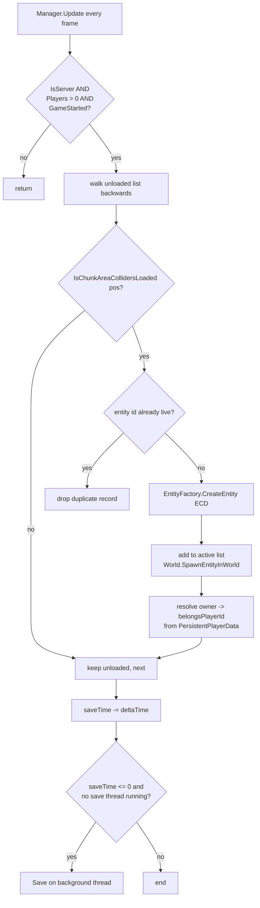
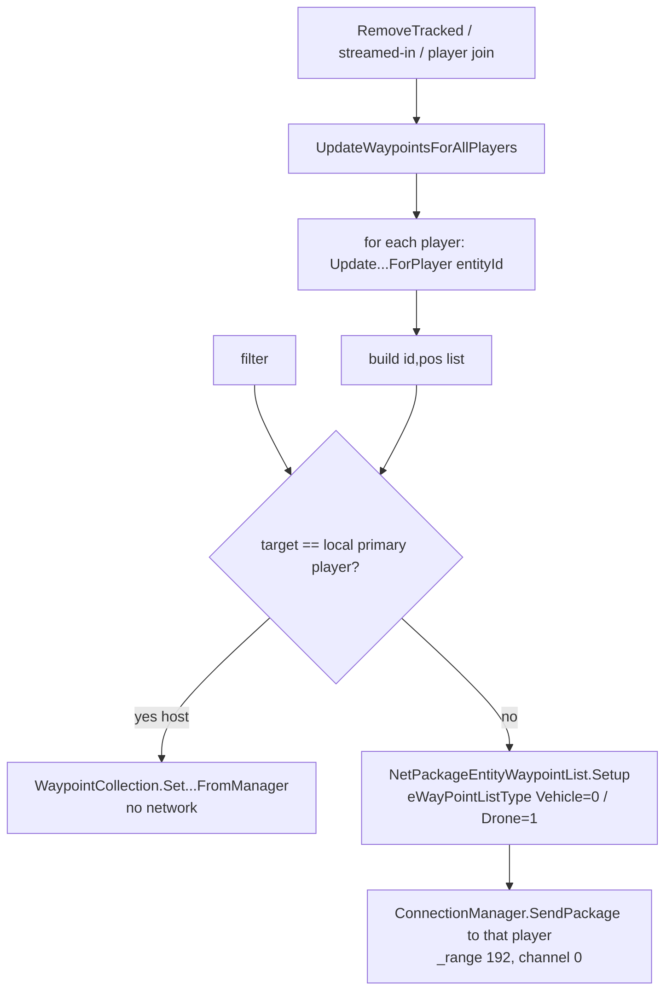
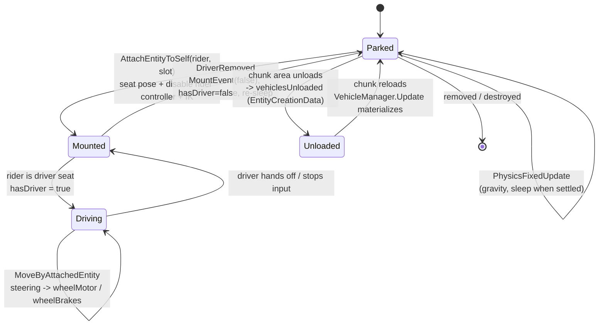
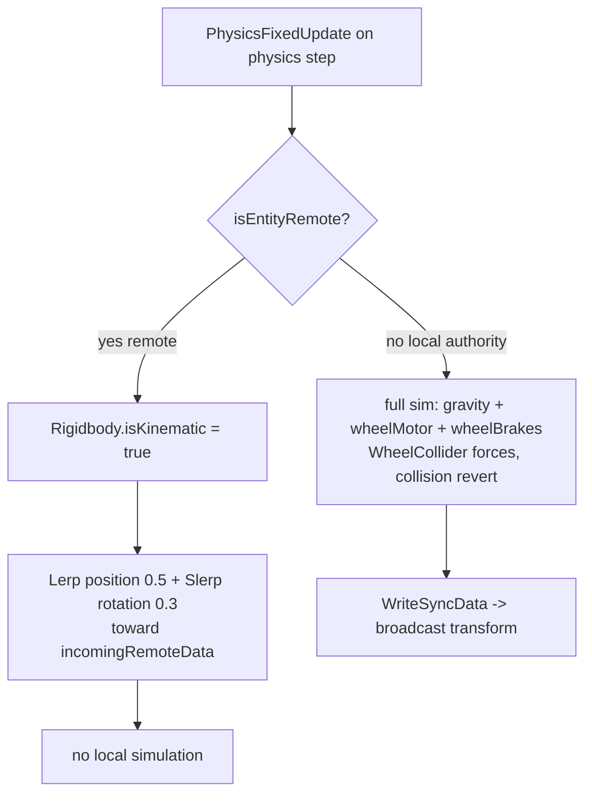
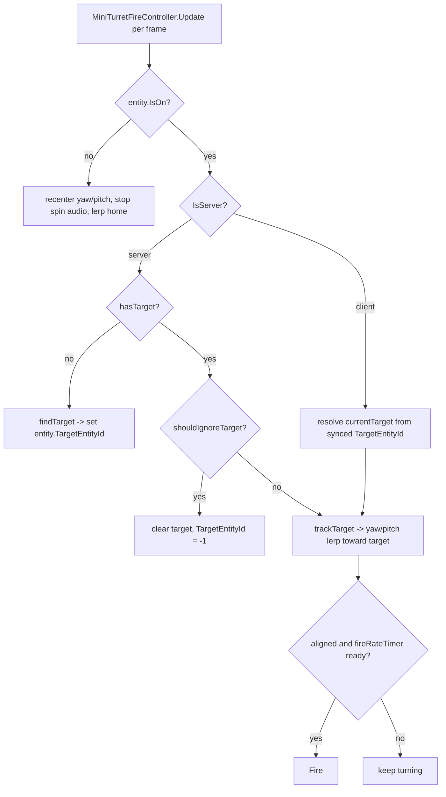
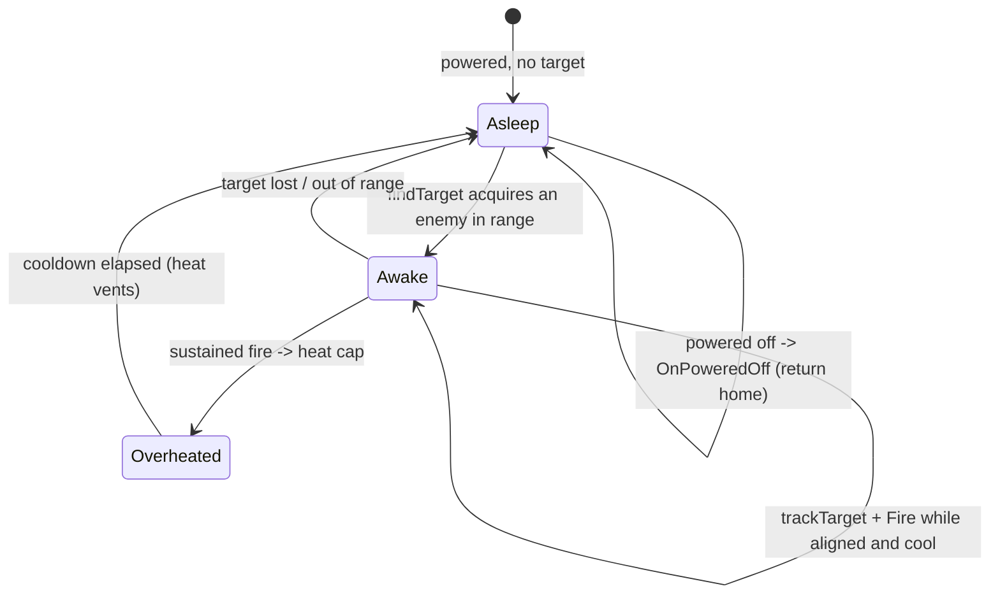

# Vehicles, drones, and turrets (dedicated V3.1.0)

**Owns:** the three deployable-entity subsystems a dedicated server persists and
drives: player vehicles (`VehicleManager` / `EntityVehicle` / `Vehicle`), junk
drones (`DroneManager` / `EntityDrone`), and turrets (`TurretTracker` /
`EntityTurret` plus the powered turret block on `TileEntityPoweredRangedTrap`).
Covers the per-frame manager loop, the per-player map-waypoint push, mount and
movement authority, drone follow behaviour, and turret targeting and fire.
**Not:** the Unity Rigidbody / WheelCollider integration itself (native
residual); the XML that defines each vehicle, drone, and turret (content); the
in-vehicle UI and camera (client-only).
**Evidence:** `VehicleManager`, `EntityVehicle`, `Vehicle`, `DroneManager`,
`EntityDrone`, `EntityTurret`, `TurretTracker`, `AutoTurretFireController`,
`MiniTurretFireController`, `AutoTurretController` IL, and the `NetPackage*`
spawn / sync / positions bodies (dump locally with `tools/src/DumpMethod`,
git-ignored). **Hub:** [`INDEX.md`](INDEX.md). **Method:**
[`re-methodology.md`](re-methodology.md). **Tick context:**
[`entity-ai.md`](entity-ai.md).

Do not redistribute game IL.

---

## 1. Architecture: three registries, three entity families

Each subsystem has a plain (non-MonoBehaviour) singleton **registry** created and
`Init`ed once, and one or more **entity** types that carry the actual behaviour.
The registries are updated every frame from the `GameManager.gmUpdate` manager
fan-out (see [`entity-ai.md`](entity-ai.md) §D9 for the IL sizes), all three
guarded by `ConnectionManager.IsServer`, so on a client the registry `Update`
returns immediately.

| Registry | Tracks | Persists to | Per-frame job | Update IL |
|---|---|---|---|---:|
| `VehicleManager` | `vehiclesActive: List<EntityVehicle>`, `vehiclesUnloaded: List<EntityCreationData>` | `vehicles.dat` | stream unloaded vehicles into loaded chunks; wake / save | 297 |
| `DroneManager` | `dronesActive: List<EntityDrone>`, `dronesUnloaded`, `dronesWithoutOwner` | `drones.dat` | stream in owned drones; teleport far followers; save | 305 |
| `TurretTracker` | `turretsActive: List<EntityTurret>`, `turretsUnloaded: List<int>` | `turrets.dat` | save timer only (no streaming loop) | 45 |

| Entity | Base | Where its logic runs | Notes |
|---|---|---|---|
| `EntityVehicle` (base of `EntityDriveable`) | `EntityAlive` | `PhysicsFixedUpdate` (physics step) | `updateTasks` is a 1-IL nop: vehicles have no AI |
| `EntityDrone` | `EntityNPC` -> `EntityAlive` | `OnUpdateEntity` (178) + `updateTasks` (139), entity tick | server state machine + steering |
| `EntityTurret` | `EntityAlive` | `OnUpdateEntity` (414), entity tick + fire-controller `Update` per frame | deployed junk turret / robotic sledge |
| powered turret block | `TileEntityPoweredRangedTrap` | `AutoTurretFireController.Update` per frame | on the power grid, not an `EntityAlive` |

Two independent "turret" implementations exist: the deployed **EntityTurret**
(driven by a `MiniTurretFireController`, tracked by `TurretTracker`) and the
placed **powered turret block** (a `TileEntityPoweredRangedTrap` driven by
`AutoTurretController` + `AutoTurretFireController`, owned by the power grid, see
[`managers.md`](managers.md)). They share the aim helpers `AutoTurretYawLerp` /
`AutoTurretPitchLerp` and the `TurretState` enum but nothing else.

All three registries share one persistence shape: a `vda\0` char signature, a
version byte `1`, an `Int32` count, then per-record data (full
`EntityCreationData` for vehicles and drones, bare entity ids for turrets),
saved on a background `ThreadManager` thread (`vehicleDataSave` /
`turretDataSave`) with a `.bak` rotation. The save is armed by a `saveTime`
countdown (default 120 s, clamped to 10 s after any mutating change via
`TriggerSave`).

---

## 2. The per-frame manager loop (streaming model)

`VehicleManager.Update` and `DroneManager.Update` share the same skeleton: bail
unless server, there is at least one player, and the game has started, then walk
the "unloaded" list backwards and **materialize** any record whose chunk area
colliders are now loaded. This is how a saved vehicle or drone comes back into
the world as its owner rides toward it.



Differences that matter:

- **Vehicles stream by chunk.** A vehicle nudges its stored Y up by `0.002`
  before spawn (so it settles onto, not through, the freshly loaded collider),
  then `updateTransform` settles it with a downward raycast.
- **Drones stream by owner.** A drone record with no resolvable position first
  scans `PersistentPlayerList` for the owning player and recovers the owner's
  head position and `belongsPlayerId`; a record with an invalid (`NaN`) position
  and no owner is parked in `dronesWithoutOwner`. After streaming, a second loop
  yanks any active drone more than `32 m` (`1024` sq) from its owner's chest back
  with `TeleportOutOfRange`, unless the drone is in `Shutdown` state or its order
  is `Sentry` (a parked sentry is allowed to be far from its owner).
- **Turrets do not stream here.** `TurretTracker.Update` only runs the save
  timer. A deployed turret is a normal world entity: it comes back through the
  standard entity-load path, registers via `AddTrackedTurret`, and does its own
  work in `OnUpdateEntity`.

`VehicleManager.PhysicsWakeNear(pos)` adds a zero force (`ForceMode.VelocityChange`
wake) to every active vehicle within `20 m` (`400` sq) so a sleeping Rigidbody
re-engages when a player or explosion approaches. Counts are capped at **500**
per subsystem on the dedicated build (`CanAddMoreVehicles` /
`CanAddMoreTurrets` / `CanAddMoreDrones`, gated on device flag 56); other
platforms are unbounded.

---

## 3. Per-player map waypoints

Each registry can push the set of its entities as **map markers** to one player.
The methods the task names (`VehicleManager.UpdateVehicleWaypointsForPlayer`,
`DroneManager.UpdateWaypointsForPlayer`) build a `List<(int id, Vector3 pos)>`
filtered to what that player should see, then deliver it one of two ways.



The filter differs by subsystem:

- **Vehicles:** include a vehicle whose `belongsPlayerId` equals the target
  player **or** is `-1` (unowned vehicles show for everyone).
- **Drones:** cross-reference the player's `OwnedEntityData` list (class
  `junkDroneClass`) against drone records, so a player only sees drones they own;
  the method first unregisters stale `NavObject`s for that class.

The host (integrated server) writes the local player's `WaypointCollection`
directly; a networked player gets a `NetPackageEntityWaypointList` on the
reliable admin channel `192`. A companion `NetPackageVehiclePositions` carries a
bare `List<(id, pos)>` and, on receipt, refreshes the client's vehicle markers
the same way.

---

## 4. Vehicles: mount, drive, dismount

### 4.1 Spawn and ownership (server-authoritative)

Placing a vehicle is a client -> server request. `NetPackageVehicleSpawn`
(fields: `entityType:i32`, `pos:Vector3`, `rot:Vector3`, `itemValue`,
`entityThatPlaced:i32`) is validated on the server: the sender id must be valid
and `CanAddMoreVehicles()` must pass, then the server calls
`EntityFactory.CreateEntity`, clones the item value onto the `Vehicle`, sets the
owner from the placing client's `InternalId`, and `SpawnEntityInWorld`. The new
`EntityVehicle` registers with `VehicleManager.AddTrackedVehicle`.

### 4.2 The `Vehicle` model

`EntityVehicle` is the world entity; the logical `Vehicle` object it wraps owns
the part list (`VehiclePart` subclasses: `VPEngine`, `VPWheel`, `VPSeat`,
`VPSteering`, `VPFuelTank`, `VPHeadlight`, `VPStorage`, `VPChassis`,
`VPPedals`), the inventory, the owner id, and seat poses. Mounting attaches a
rider entity to a seat slot.



`AttachEntityToSelf` (**IL=100**): base attach; `SetVehiclePoseMode(GetSeatPose)`;
rider layer **24**; disable character controller; seat IK targets;
`isInteractionLocked = (free seats == 0)` and toggle native collider; seat 0
sets `hasDriver`, `Vehicle.SetColors`, `FireEvent(0)`, `SetVehicleDriven`,
`TriggerUpdateEffects`; local player inserts vehicle action set + CameraInit.

**The generic attach pipeline behind it (V3.1.0 b14):**
`Entity.StartAttachToEntity(other, slot)` (IL=43) is the entry: a client sends
`NetPackageEntityAttach(0, selfId, otherId, slot)` to the server; the server
runs `AttachToEntity(other, slot)` and, on a valid slot, broadcasts
`NetPackageEntityAttach(1, ...)` (flags 192) to observers. `Entity.AttachToEntity`
(IL=64) rejects already-attached entities (-1), delegates slot allocation to
`AttachEntityToSelf`, parents the `RootTransform` to the slot's
`enterParentTransform` (zeroed local pose), applies the slot's
`enterPosition`/`enterRotation` to the `ModelTransform`, and (for remote
riders without `bKeep3rdPersonModelVisible`) hides the model.
`EntityAlive.AttachToEntity` (IL=60) sets `CurrentMovementTag = Idle`, uncrouches,
and for a local rider whose slot `bReplaceLocalInventory` swaps the inventory
to the host's (saving the old one + held index, holding set to the DUMMY slot);
`EntityPlayer` (IL=21) stashes the model-parent local position; the local
player (IL=88) repositions the camera, starts the `Driving` activity, updates
owned-vehicle waypoints, and stops the `RunLoop` sound. `EntityVehicle` (IL=2)
always returns **-1** (vehicles never attach to anything).

**Seat slot definition: `Entity.GetAttachedToInfo(slot)` (IL=2 base returns
null; `EntityVehicle` IL=158):** builds the `AttachedToEntitySlotInfo` -
defaults `bKeep3rdPersonModelVisible = bReplaceLocalInventory = true`,
`pitchRestriction (-30, 30)`, `yawRestriction (-90, 90)`,
`enterParentTransform = vehicle transform`, `enterPosition (0, 0, -0.201)`,
`enterRotation` zero; then reads `vehicle.GetPropertiesForClass("seat" +
slotIdx)` and applies `position` / `rotation` overrides. The `exit` property
is a `~`-separated list of vectors: each becomes an
`AttachedToEntitySlotExit` at `GetPosition() + transform.TransformDirection(v)`
(y + 0.02) with rotation `(0, Atan2(x, z) * 57.29578 + 180 + rotation.y, 0)`.
Without seat properties the fallback exit is `GetPosition() - 2 * right` at
yaw + 90.

**`Entity.IsAttached(entity)` (IL=8)** is `FindAttachSlot(entity) >= 0` (the
other is attached to this entity); `EntityDrone.IsAttachedToVehicle(entity)`
(IL=11) checks the entity's `AttachedToEntity` is an `EntityVehicle`.
`Entity.FindAttachSlot(entity)` (IL=27) walks the `attachedEntities[]` array
and returns the matching index, **-1** when absent.

`DetachEntity` (**IL=157**): cancel delayed attach; pose -1; remove IK; restore
model/layers; re-enable controller; remove vehicle actions; `DriverRemoved` if
driver; base detach; unlock interaction when free seats return.

`AttachEntityToSelf(entity, slot)` sets the rider's vehicle pose
(`SetVehiclePoseMode`), moves it to layer 24, **disables the rider's
`CharacterController`**, binds IK targets from `Vehicle.GetIKTargets(slot)`, and
locks interaction once all seats are full. `DriverRemoved` fires the local
player's `MountEvent(false)`, clears `hasDriver`, and resets the no-driver
ground / sleep timers so the Rigidbody can settle and sleep.

### 4.3 Movement authority: client-authoritative physics

This is the load-bearing distinction. `EntityVehicle.PhysicsFixedUpdate` (1509
IL) branches on `Entity.isEntityRemote` at the very top:



A vehicle is simulated with real physics **only on the machine that is driving
it**, where `isEntityRemote` is false. Every other participant, including a
**dedicated server** relaying a client-driven vehicle, sets the Rigidbody
kinematic and interpolates the received transform (`incomingRemoteData`,
delivered via `ReadSyncData` / `NetPackageVehicleDataSync`). So on a dedicated
server the vehicle is **not** server-authoritative: the driving client owns
motion and collision, and the server forwards it. The server remains
authoritative for **existence** (spawn, ownership, the 500 cap, persistence) and
for the map-waypoint push, but not for per-frame kinematics. This is why vehicle
desync and clipping are client-trust problems, not server-tick problems.

`EntityVehicle.updateTasks` is a single `ret`: the AI throttle in
[`entity-ai.md`](entity-ai.md) never does work for a vehicle.

---

## 5. Drones: follow, sentry, attack, heal

`EntityDrone` runs a real server-side state machine. `updateState` (called from
`updateTasks` when the drone has an owner) advances `stateTime` by the fixed
`0.05` step and dispatches on `State`:

| `State` | Value | Handler | Role |
|---|---:|---|---|
| Idle | 0 | `idleState` | hover near owner; watch for enemies / range |
| Sentry | 1 | `sentryState` | hold `SentryPos`; return if pushed &gt; 5 m |
| Follow | 2 | `followState` | steer to owner via `steerFollow` / `DoMoveIntoFollowPos` |
| Heal | 3 | `healState` | heal-beam an ally (server does the heal) |
| Attack | 4 | `attackState` | engage `currentTarget` with installed weapon |
| Shutdown | 5 | (no tick) | powered down / picked up |

Transitions are staged: a request writes `transitionState` (sentinel `8` means
"none"), and `updateTransitionState` (run first each `OnUpdateEntity`) commits it,
refreshing weapon cooldowns when entering Heal or Attack and setting
`isShutdownPending` for Shutdown. `Orders` is the player-facing mode toggled by
`ToggleOrderState`: `Follow (0)` (via `FollowMode`, also sets `State=Follow`) or
`Sentry (1)` (via `SentryMode`, records `SentryPos` and the owner's last-known
position). Mode changes replicate with `SendSyncData` and
`NetPackageDroneDataSync`.

```mermaid
stateDiagram-v2
  [*] --> Idle: spawned near owner
  Idle --> Follow: owner &gt; FollowDistance+2<br/>or enemy in range
  Idle --> Attack: sensors report enemy in range
  Follow --> Idle: within follow distance, no enemy
  Follow --> Attack: enemy acquired (CanAttack)
  Attack --> Follow: target dead / lost (exitAttackState)
  Idle --> Heal: ally needs medical (heal mode on)
  Follow --> Heal: ally needs medical
  Heal --> Follow: onHealDone
  Idle --> Sentry: player orders Stay (SentryMode)
  Follow --> Sentry: player orders Stay
  Sentry --> Follow: player orders Follow (FollowMode)
  Sentry --> Sentry: pushed &gt; 5 m -> DoMoveIntoFollowPos back to SentryPos
  Follow --> Follow: owner teleports -> TeleportIfFollowing
  Idle --> Shutdown: no owner / powered off
  Sentry --> Shutdown: no owner / powered off
  Shutdown --> [*]: performShutdown
```

Follow and return use the drone's own flood-fill / raycast pathing
(`FloodFillEntityPathGenerator`, `steering`, `pathMan`), not the zombie A* path
queue, though it still calls `PathFinderThread.Instance` for projected paths.

**`idleState` (IL=100):** underwater early-out; if `DroneSensors.IsEnemyInRange`
but owner outside `EnemyDetectionRadius` → `Follow`; if owner outside
`FollowDistance+2` and no enemy → `Follow`; else face owner 2D and seek Y to
chest height at `SpeedFlying*0.5`.

**`followState` (IL=76):** interrupt/underwater/vehicle handlers; pick closest
group slot from `GetGroupPositions(owner, 5, …)`; `DoMoveIntoFollowPos` then
`steerFollow`; return to `Idle` when within **0.5** of slot or within
`FollowDistance` of chest.

**`GetGroupPositions` (IL=178):** build **5** horizontal slots from owner chest +
flattened look: (0) behind look at `followDist`; (1)/(2) right±look diagonals;
(3)/(4) outer diagonals with scale **1**; for each slot, if blocked
(`IsPositionBlocked` mask `1073807360`) fall back to `ScanVolume` node.

**`DoMoveIntoFollowPos` (IL=126):** if `currentPath` empty, `GetPath` to target
with `SpeedFlying` (set `currentPathDest` to last path point or target). If path
exists: repath via `followPlannedPath` when LOS blocked, path length >
`seekDist+1`, or distance > `seekDist+1.414`; else if dist >= `seekDist`,
`RotateTo` + `Move` toward target. Success when not blocked and dist <=
`seekDist`.

**`sentryState` (IL=61):** if chunk loaded and more than **5** m from `SentryPos`,
`DoMoveIntoFollowPos`; else Seek/rotate toward sentry pos until within **0.25** m.

**`onUnderWaterState` (IL=33):** if owner chest underwater: clear path; Seek to
`findOpenBlockAbove(chest, 256)` at 0.2; rotate+move; return true (blocks other
states).

**`get_CanAttack` (IL=21):** false when state is Heal (**3**), Attack (**4**), or
Shutdown (**5**); else true only if `WakeupAnimTime == 0`.

**`IsAttackValid` (IL=9):** `activeWeapon != null && activeWeapon.canFire()`.

**`Weapon.canFire` (IL=7):** `cooldownTimer <= 0`. HealBeam override also requires
`hasHealingItem()`.

**`Weapon.Fire` (IL=6):** store `target`; `RefreshCooldown`.

**`Weapon.RefreshCooldown` (IL=8):** `cooldownTimer = actionTime + cooldown`.

**`Weapon.hasActionCompleted` (IL=6):** `cooldownTimer < cooldown` (action phase
done, still cooling).

**`MachineGunWeapon.Fire` (IL=10):** server only; base Fire then `_fireWeapon`
(IL=411): passives **16** (ray count from `RayCount`), **11** (range), **199**
(penetration floor+1), **200** (block pen divisor); spread from
`spreadHorizontal`/`spreadVertical`; raycast mask `-538751005`; `ItemActionAttack.Hit`
as `bullet`; muzzle particles; if passive **9** > 0 decrement `AmmoCount`;
`UseTimes +=` passive **7** * `ItemDegradationModifier`.

**`StunBeamWeapon.Fire` (IL=69):** base Fire; `SetCVar("_droneStunDamage",
modItem.Quality)`; `TargetApplyBuff("buffShocked")`; sound + nozzle particles.

**`HealBeamWeapon.Fire` (IL=184):** base Fire; server: `findNeededHealType` or
abort; put heal stack in inventory slot 0, force hold, run action index **1**
`ItemActionUseOther` (`CanExecute` then `ExecuteAction` false then true) with
attack target as feed target; `AddBuff("buffJunkDroneHealCooldownEffect")`.

**`findNeededHealType` (IL=52):** inventory presence for types **2** (bandage),
**3** (first aid), **4** (kit). If medical need or `targetCanBeHealed`: prefer
3 then 4; if bleeding only and no 3/4, type 2. Else if bleeding: 2 then 3 then
4. Else none (**0**).

**`TeleportOutOfRange` (IL=15):** if Attack, `exitAttackState` (empty stub);
if Heal, `onHealDone` (empty stub); then `teleportState()`.

**`teleportState` (IL=109):** `setState(Teleport=7)`; clear path; build group
slots via `GetGroupPositions(Owner, 5, …)`; sort by distance to self; pick first
unblocked slot (mask `1073807360`); `SetPosition` + transform; `setState(Idle)`;
`checkTeleportPos`.

**`checkTeleportPos` (IL=17):** if owner present and still
`isOutOfRange(owner.pos, 32)` log "teleport failed", else "teleport success!".

**`setState(next)` (IL=40):** `lastState = state`; `state = next`;
`stateTime = 0`. Switch: cases 0/1 fall through; case **2** (Sentry?) from
lastState **1** with owned entity: `ClearLastKnownPostition` on owned data;
case **3** (Heal): `clearNeedsHealItemCheck()`. Public `SetState(next, sync)`
optionally `SendSyncData(0x8000)`.

**`targetCanBeHealed` (IL=25):** alive, no `buffHealHealth`,
`medicalRegHealthAmount == 0`, and `Health < Health.ModifiedMax`.

**`isTargetBleeding` (IL=16):** `ActiveBuffs.Find` predicate (bleed buff match).

**`DroneManager.isValidDronePos` (IL=16):** reject if any of x/y/z is NaN.

**`updateTransitionState` (IL=98):** no-op if `transitionState == None (8)` or
already equals `state`. Leaving Attack/Heal refreshes all installed weapon
cooldowns. Transition Heal (**3**): server `healTargetServer(attackTarget,
userRequestedHeal)`; client only `setState`. Shutdown (**5**): set
`isShutdownPending`. Idle (**0**) from Shutdown: `setShutdown(false)`. Then
clear `transitionState` to None.

**`IsTargetInNeedOfMedical` (IL=10):** delegates to
`HealBeamWeapon.isTargetInNeedOfMedical` (false if no heal weapon).

**`HealBeamWeapon.isTargetInNeedOfMedical` (IL=40):** false if null target. Need
heal when either (a) `GetMaxHealth == Health.ModifiedMax` and
`Health < max - HealDamageThreshold`, or (b) `Health < ModifiedMax * 0.67`; and
`GetCVar("medicalRegHealthAmount") == 0`.

**`healTargetServer` (IL=19):** only when not already in Heal state; require
`healWeapon.canFire()`; if not forced request, require
`isTargetInNeedOfMedical`; then `healTarget(target)` (server heal apply).

**`steerFollow` (IL=208):** if beyond **10** m of follow point, ramp
`currentSpeedFlying` toward max(15, dist) with 0.05 lerp; if within **0.1** of
point, ease speed down to `SpeedFlying*0.5`; Seek toward point; optional ground
ray when height delta large.
`DroneManager` handles cross-cutting ownership: `SpawnFollowingDronesForPLayer`
teleports a player's Follow-order drones to them on join, `TeleportIfFollowing`
hooks the owner's teleport event, and `ClearAllDronesForPlayer` removes both the
active and unloaded records. Firing / healing happens **server-side**
(`healTargetServer`, `updateTransitionState` runs the heal only when
`IsServer`). Clients animate the drone from synced state; the server owns the
decisions.

---

## 6. Turrets: targeting and fire (server-authoritative)

Both turret families put the aim helper (`AutoTurretYawLerp` /
`AutoTurretPitchLerp`) on every machine but keep **targeting and damage on the
server**.

### 5.9 `VehicleManager.PhysicsWakeNear` (IL=34)

For each active vehicle with `sqrMagnitude` to `pos` ≤ **400** (20 m):
`AddForce(zero, ForceMode=2)` (VelocityChange wake / un-sleep).

### 6.0 `TurretTracker.Update` (IL=45)

Server-only; requires world + players + game started. Decrements `saveTime` by
`deltaTime`; when ≤ 0 and prior save thread terminated (or null), reset
`saveTime = **120**` seconds and `Save()` (periodic `turrets.dat`, no streaming).

### 6.1 EntityTurret (deployed junk turret)

`EntityTurret.OnUpdateEntity` (414 IL) is split by `ConnectionManager.IsServer`.
The server half computes whether the turret is **on** from a chain of conditions,
then, when anything changes, syncs it:

- `IsOn` requires: item uses left `> 0`, `Meta > 0` (ammo / power), passive
  effect 9 gate, owner present, owner within `maxOwnerDistance` (passive effect
  74, base `10 m`), and an active-turret count under the per-owner limit (passive
  effect 75). Over the limit, the farthest turrets switch off unless `ForceOn`.
- When `TargetEntityId`, `IsOn`, or the item value changes versus the last tick,
  the server sends `NetPackageTurretSync(id, targetId, isOn, itemValue)` on
  channel `192`.

**`findTarget` (IL=173):** clear target; `GetEntitiesInBounds(EntityAlive,
bounds centered on muzzle with size ~`range`×2 height 1)`; sort by
`TurretEntitySorter`; skip `shouldIgnoreTarget`; for each try `trackTarget`
(yaw/pitch); Voxel raycast layer mask `-538750989` thickness 0.05; accept first
hit whose transform name starts with expected prefix / resolves to EntityAlive;
set `TargetEntityId`.

**`shouldIgnoreTarget` (IL=245):** ignore null / not alive / behind muzzle
(`Dot(forward, toTarget) <= 0`) / not attached-main when required. Player
relation via `EntityToPlayerMap` + `IsAlly` / party membership when
`GamePrefs` **52** (PvP mode) allows player targeting. Respect flags:
`TargetOwner` (entityType 3), `TargetAllies` (3 or 1), `TargetStrangers` (2 or
3), `TargetEnemies`. Always ignore `EntityTrader`, other turrets, drones,
supply crates; ignore NPC unless TargetStrangers; ignore enemy if
`!TargetEnemies`. Final `canHitEntity` LOS gate.

**`trackTarget` (IL=121):** aim point = Lerp(chest, head,
`targetChestHeadPercent`) - Origin; yaw = DeltaAngle(turret yaw, look yaw);
pitch = look x (unwrap >180); success only if yaw within
`CenteredYaw + yawRange` and pitch within `CenteredPitch + pitchRange`.

**`canHitEntity` (IL=80):** require `trackTarget`; ray from cone/muzzle with
`maxDistance`, layer mask `-538750989`; hit tag must start with `E_`; root
transform entity must equal target and be alive.

**`Fire` (IL=554, server):** resolve target; EffectManager passive **16** (spread)
and **11** (distance) with item tags; loop `rayCount` hits via
`ItemActionAttack.FindHitEntityNoTagCheck` / `GetBlockHit` / `Hit`; decrement
`AmmoCount` and apply `UseTimes` degradation.

The attached `MiniTurretFireController.Update` (a MonoBehaviour, so per frame)
does the aiming and the target search:



`Fire` early-returns unless `IsServer && entity != null && IsOn`, so only the
server runs the raycast and `DamageEntity`. A client's `Update` still turns the
barrel and plays audio from the synced `TargetEntityId` and `IsOn`, but it never
deals damage. Target selection, ammo consumption, and hits are all the server's.

### 6.2 Powered turret block (AutoTurret)

The wall / ceiling turret block is a `TileEntityPoweredRangedTrap` on the power
grid, driven by `AutoTurretFireController.Update`, which runs a `TurretState`
machine (`Asleep` / `Awake` / `Overheated`) rather than firing continuously:



Its `Update` skips the state machine while a user is accessing the turret UI
(`UserAccessingId`), and its `Fire` is likewise server-gated
(`ConnectionManager.IsServer`) and only runs when the tile entity is locked
(placed and powered). Same authority split as the deployed turret: aim everywhere,
target and damage on the server. The robotic sledge reuses this via
`JunkSledgeFireController : MiniTurretFireController`.

---

## 7. Wire packages

| Package | Direction | Body / role |
|---|---|---|
| `NetPackageVehicleSpawn` | client -> server | `entityType:i32`, `pos`, `rot`, `itemValue`, `entityThatPlaced:i32`; server validates + caps + spawns |
| `NetPackageTurretSpawn` | client -> server | deploy a turret **or** drone (branches on item tag: `turretRanged`/`turretMelee` -> `TurretTracker`, `drone` -> `DroneManager`) |
| `NetPackageTurretSync` | server -> client | `id`, `targetEntityId`, `isOn`, `itemValue` (drives client aim + laser) |
| `NetPackageVehicleDataSync` | driver <-> peers | vehicle transform / remote-data sync (feeds `incomingRemoteData`) |

**`NetPackageVehicleDataSync.ProcessPackage` (IL=113):**
`ValidEntityIdForSender(senderId)`; resolve `EntityVehicle`; lock pooled stream;
`ReadSyncData(reader, syncFlags, senderId)`. If server:
`GetSyncFlagsReplicated(syncFlags)`; when non-zero, rebroadcast `Setup(vehicle,
senderId, flags)` via `SendPackage` exclude sender, bulk **192**.
| `NetPackageVehiclePositions` | server -> client | bulk `(id, pos)` list refreshing vehicle map markers |
| `NetPackageDroneDataSync` | server -> client | drone owner / order / state / storage sync fields |
| `NetPackageEntityWaypointList` | server -> client | per-player vehicle (`eWayPointListType 0`) or drone (`1`) marker list |
| `NetPackageVehicleCount` | server -> client | pushes the server vehicle/drone/turret count for client caps |

Spawn and count packages ride the reliable admin channel `192`. `entityThatPlaced`
is sender-validated (`ValidEntityIdForSender`) so a client cannot spawn on
another player's behalf.

---

## 8. Dedicated relevance and residuals

- **All three managers run on the dedicated server** every frame (server-gated),
  owning existence, ownership, caps, persistence (`vehicles.dat` / `drones.dat`
  / `turrets.dat`), and the per-player waypoint push.
- **Drones and turrets are server-authoritative for behaviour:** the drone state
  machine, turret targeting, and all turret / drone damage run only when
  `IsServer`. These scale with the count of active drones and turrets and add
  `GetEntitiesInBounds` pressure (see [`entity-ai.md`](entity-ai.md) §D7).
- **Vehicles are client-authoritative for motion:** a remote vehicle is kinematic
  and interpolated on the server; the driving client simulates the Rigidbody.
  The server never runs vehicle physics for a player-driven vehicle.
- **Residual (native / content):** the Unity Rigidbody, `WheelCollider`, and
  `FixedUpdate` physics step (native, not managed IL); `AutoTurretYawLerp` /
  `AutoTurretPitchLerp` transform interpolation is thin managed glue over Unity
  transforms; the XML defining each vehicle, drone, and turret (data); the
  in-vehicle camera / HUD (client-only). Drone flood-fill pathing internals live
  in `FloodFillEntityPathGenerator` (separate from the zombie A\* path queue).

---

## Related docs

| Doc | Role |
|---|---|
| [entity-ai.md](entity-ai.md) | Entity tick chain, `updateTasks` throttle, manager IL sizes |
| [managers.md](managers.md) | `gmUpdate` manager fan-out, power grid (turret blocks) |
| [network.md](network.md) | Entity replication and interest management |
| [protocol.md](protocol.md) | Wire framing and package bodies |
| [loop.md](loop.md) | Frame / `UpdateTick` context |
| [re-methodology.md](re-methodology.md) | How this was reversed |
| [residuals.md](residuals.md) | Native / content residuals |

## Changelog

- **2026-08-07:** Entity.FindAttachSlot (IL=27): attachedEntities[] index
  walk, -1 absent - behind IsAttached.
- **2026-08-07:** Entity.IsAttached (IL=8) = FindAttachSlot >= 0; Drone
  IsAttachedToVehicle (IL=11) AttachedToEntity is EntityVehicle.
- **2026-08-07:** Seat slot definition: EntityVehicle.GetAttachedToInfo (IL=158)
  defaults + seat<idx> DynamicProperties overrides, ~-separated exits with
  TransformDirection + y+0.02, fallback -2*right exit.
- **2026-08-07:** Generic attach pipeline in 4.2: StartAttachToEntity (IL=43)
  client->server + broadcast, Entity.AttachToEntity (IL=64) pose parent,
  EntityAlive (IL=60) inventory swap + Idle tag, EntityPlayer/PlayerLocal
  camera, EntityVehicle -1.
- **2026-08-07:** checkTeleportPos 32 m; setState lastState/owned clear;
  teleportState slots; targetCanBeHealed; heal type priority.
- **2026-08-07:** onUnderWaterState surface seek; trackTarget/canHitEntity; Fire
  passives 16/11; healTargetServer; steerFollow; spawnHordeNear 5/12%.
- **2026-08-07:** Drone idle/follow/sentry IL gates; MiniTurret findTarget bounds
  + raycast; PhysicsWakeNear 20 m.
- **2026-08-07:** TurretTracker save every 120 s; AttachEntityToSelf / DetachEntity
  seat pose, layer 24, hasDriver, local action set.
- **2026-07-23:** Initial reversal of the vehicle / drone / turret subsystem: three server-gated registries, the chunk / owner streaming loop, per-player waypoint push, client-authoritative vehicle physics vs server-authoritative drone and turret behaviour, mount / drive / dismount, drone state machine, and both turret fire-controller families, with state-machine diagrams.
