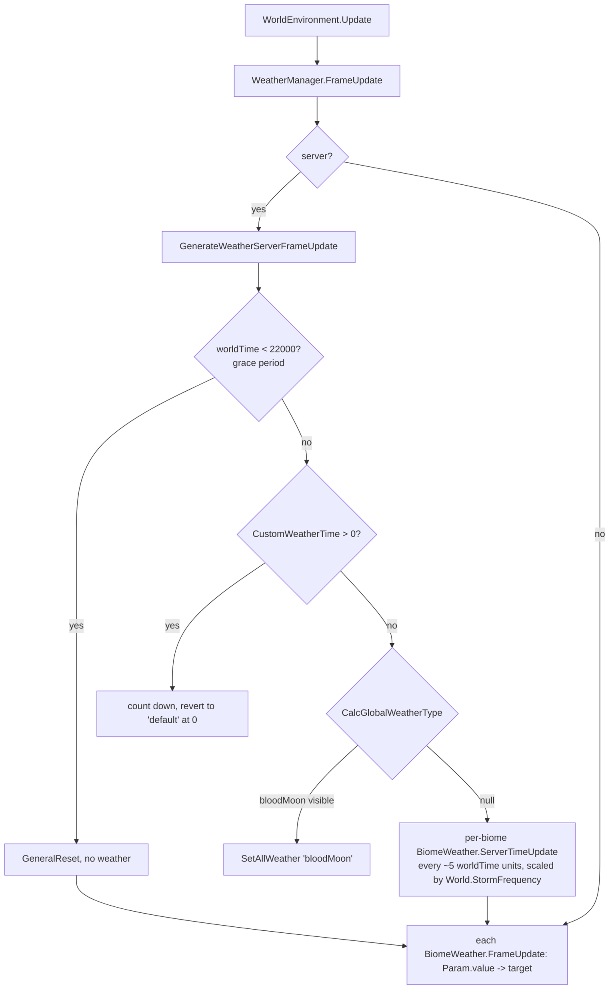
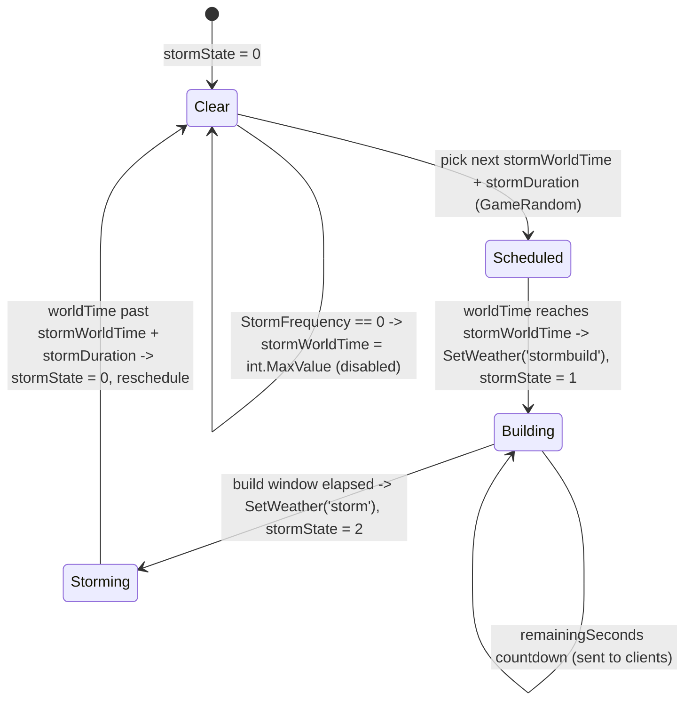
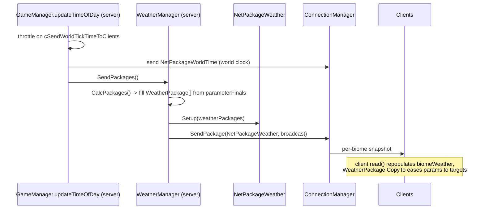
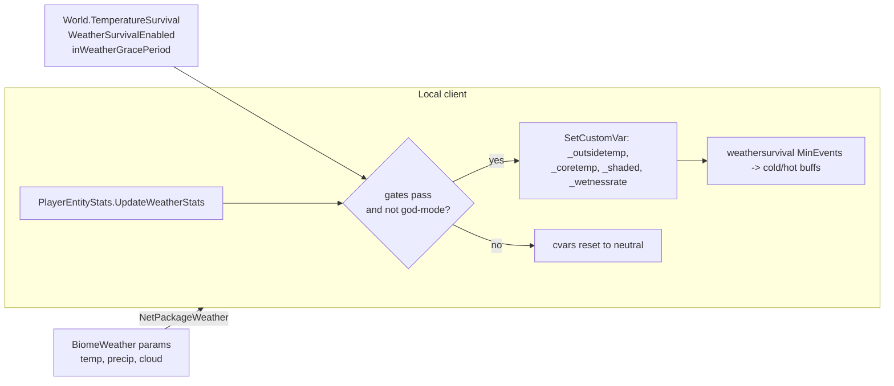

# Weather, sky, and environment (dedicated V3.1.0)

**Owns:** the server-authoritative weather simulation, `WeatherManager` (the
per-biome weather state machine, storm scheduling, temperature/precipitation
model) and its net sync (`WeatherPackage` / `NetPackageWeather`), plus the
server-relevant slice of `SkyManager` (time-of-day, dawn/dusk, blood-moon
visibility).
**Not:** the felt-temperature and survival buff math on the local player
(client, largely stubbed on the dedicated build); sky/fog/cloud/lightning
rendering (`SkyManager.Update` and friends, client visual); the biome/weather
XML content (`weathersurvival.xml`, `biomes.xml`, data).
**Evidence:** `WeatherManager` (+ nested `BiomeWeather`, `WeatherPackage`),
`SkyManager`, `NetPackageWeather`, `PlayerEntityStats` IL (dump locally with
`tools/src/DumpType` / `DumpMethod` / `DumpNetPackages`, git-ignored).
**Hub:** [`INDEX.md`](INDEX.md). **Method:** [`re-methodology.md`](re-methodology.md).

Weather is driven off the world clock, so it belongs to the game-state tick that
[server-lifecycle.md](server-lifecycle.md) and [loop.md](loop.md) describe: the
server advances biome weather every frame and pushes packages to clients on the
same throttle as the world-time broadcast.

---

## 1. Model

`WeatherManager` is a `MonoBehaviour` singleton (`Instance`) created from the
`Prefabs/WeatherManager` asset during `World.createWorld` and initialized via
`Init(World)`. The simulation state is a list of per-biome machines with a
parallel array of wire packages.

| Type | Role |
|---|---|
| `WeatherManager` | Singleton driver: `List<BiomeWeather> biomeWeather`, parallel `WeatherPackage[] weatherPackages`, static `worldTime`, static admin overrides, grace period, custom-weather timer |
| `WeatherManager.BiomeWeather` | Per-biome state machine: `stormState`/`stormWorldTime`/`stormDuration`, `nextRandWorldTime`, a 5-slot `Param[]` + `parameterFinals[5]`, plus `rainParam`/`snowFallParam` |
| `WeatherManager.Param` | One animated scalar: `value` eased toward `target` at a per-step rate (`FrameUpdate`) |
| `WeatherPackage` | Wire snapshot of one biome: `biomeId`, `groupIndex`, `remainingSeconds`, `float[5] param` |
| `BiomeDefinition.WeatherGroup` | XML weather definition: `name`, `stormLevel`, `prob`, `duration`, `delay`, `buffName`, `spectrum`, probability table |
| `SkyManager` | Time-of-day + celestial state; server uses only the clock/query surface, the rest is rendering |

`InitBiomeWeather` builds one `BiomeWeather` per biome that declares
`weatherGroups`, and one `WeatherPackage` per `BiomeWeather` (same index).

### 1.1 The 5-slot parameter vector

Each biome carries a fixed 5-element parameter vector (a `BiomeDefinition`
`ProbType`). `BiomeWeather.FrameUpdate` fixes the slot meanings:

| Slot | Meaning | Read by |
|---:|---|---|
| 0 | temperature (derived) | `GetTemperature` accessors, sent as `param[0]` |
| 1 | precipitation intensity | drives `rainParam` / `snowFallParam` |
| 2 | cloud thickness | `GetCloudThickness`, `CloudThickness()` |
| 3 | wind | `Wind()` |
| 4 | fog | `FogPercent()` |

`rainParam` and `snowFallParam` are not independent inputs: their `target` is
computed each frame from slot 1 and the temperature, split at freezing
(`32` degrees F): above freezing the precipitation becomes rain, at or below it
becomes snow. Visible precipitation is `max(0, (precip*0.01 - 0.3) / 0.7)`, so a
biome only shows weather once precipitation clears roughly 30 percent.

`CalcGlobalTemperature(precip, cloud, ref temp)` lowers the biome base
temperature by precipitation (`temp += clamp01(precip*0.01) * -5`) and by the
cloud-occluded loss of sun (`sun = SkyManager.GetSunPercent()`, reduced by cloud
cover, then `temp += (1 - sun) * -7.5`). So overcast, rainy, night-side biomes
run coldest.

---

## 2. Server weather simulation

The whole simulation is server-only. `WorldEnvironment.Update` calls
`WeatherManager.FrameUpdate`, which runs the authoritative step only when
`IsDedicatedServer` or `ConnectionManager.IsServer`, then eases every biome's
params toward their targets regardless (so a client still animates its last
received snapshot).

- **Grace period.** For `worldTime < 22000` (`cGracePeriodWorldTime`),
  `inWeatherGracePeriod` is true and no weather runs; this same flag also
  suppresses temperature survival (§4). It starts true (`.cctor`).
- **Time rewind.** `SetWorldTime(worldTime)` (fed from `World.worldTime`)
  detects a backward jump and calls `AdjustTimeRewind`, which zeroes every
  biome's `stormWorldTime` / `stormDuration` / `nextRandWorldTime` so storms do
  not fire against stale schedules.
- **Custom weather.** `ForceWeather(name, duration)` sets `CustomWeatherName` /
  `CustomWeatherTime`; the timer counts down by `Time.deltaTime` and reverts to
  `SetAllWeather("default")` at zero. The `weather` console command
  (`ConsoleCmdWeather`) instead sets the static overrides
  `forceClouds` / `forceRain` / `forceSnowfall` / `forceTemperature`
  (`-100` = off) / `forceWind` / `SetSimRandom`, which the accessors and
  `BiomeWeather.FrameUpdate` honor.

### 2.1 Storm state machine (per biome)

`BiomeWeather.ServerTimeUpdate(worldTime, freq)` is the state machine. Storms are
scheduled with `GameRandom` off the biome's XML `stormbuild` / `storm` durations,
scaled to wall-clock by the day-length game pref. `stormState` is
`0` clear, `1` building, `2` storming. When `World.StormFrequency` is `0`,
`stormWorldTime` is pinned to `int.MaxValue` and storms never start.

Independent of storms, each biome also rerolls ordinary weather: when
`worldTime >= nextRandWorldTime`, `SetWeather(worldTime, rand)` runs
`BiomeDefinition.WeatherRandomize(rand)` (probability-weighted group pick), sets
the 5 param targets from the chosen `WeatherGroup`, and schedules
`nextRandWorldTime += currentWeatherGroup.duration`. Blood moon overrides all of
**`CalcGlobalWeatherType` (IL=36):** if `SkyManager.IsBloodMoonVisible()`, for
each biome with `stormWorldTime - worldTime < 5000`, push
`stormWorldTime = worldTime + 5000` (defer near storms past BM window); return
`"bloodMoon"` so `SetAllWeather("bloodMoon")` forces every biome to the
blood-moon group. Else null (per-biome path).

---

## 3. Server to client net sync

`GameManager.updateTimeOfDay()` is the sync point. On the same throttle
(`Constants.cSendWorldTickTimeToClients`) that broadcasts `NetPackageWorldTime`,
it calls `WeatherManager.SendPackages()`. That method runs `CalcPackages()` to
copy each `BiomeWeather` into its `WeatherPackage` (biome id,
`currentWeatherGroupIndex`, `remainingSeconds`, and `parameterFinals[0..4]`),
wraps them in a `NetPackageWeather`, and broadcasts to all connected clients.
`NetPackageWeather.PackageDirection` is `ToClient` (2).

**Wire body** (`NetPackageWeather.write`, authoritative for byte order; `read`
mirrors it). No count prefix is sent: both sides size the array from
`WeatherManager.Instance.biomeWeather.Count` (`InitPackages`), so the layouts
must agree. Per biome, in order:

| Field | Type | Source |
|---|---|---|
| `biomeId` | `byte` | `BiomeDefinition.m_Id` |
| `groupIndex` | `byte` | `currentWeatherGroupIndex` |
| `remainingSeconds` | `byte` | storm-build countdown |
| `param[0..4]` | `5 x float32` | `parameterFinals` (temp, precip, cloud, wind, fog) |

This is a **dedicated-server binary**, so the receive side is visibly a stub:
`NetPackageWeather.ProcessPackage` is empty (`IL=1, ret`), the static
`WeatherManager.currentWeather` pointer is **never assigned** anywhere in this
DLL, and `WeatherPackage.CopyTo` has no caller here. Those are the client's
apply path; the server only ever generates and sends.

---

## 4. Temperature and survival

Temperature is where server authority and client computation split most sharply.
The server owns the **inputs and the gates**; the local client owns the **felt
temperature and the buffs**.

- **Server-authoritative gates** (sandbox options, replicated as world state):
  `World.TemperatureSurvival`, `World.StormFrequency`,
  `EntityStats.WeatherSurvivalEnabled` / `NewWeatherSurvivalEnabled`, and
  `WeatherManager.inWeatherGracePeriod`. The `weathersurvival` console command
  (`ConsoleCmdWeatherSurvival`) toggles `WeatherSurvivalEnabled`.
- **Server-authoritative inputs:** the per-biome params (including slot 0
  temperature) shipped in `NetPackageWeather` (§3).
- **Client-computed felt temperature:** `PlayerEntityStats.UpdateWeatherStats`
  writes the survival custom vars on the local player's `EntityBuffs`
  (`_wetnessrate`, `_outsidetemp`, `_sheltered`, `_degreesabsorbed`,
  `_coretemp`, `_shaded`). Those cvars are what the `weathersurvival.xml`
  MinEvents read to apply cold/hot buffs. See [buffs.md](buffs.md) for the cvar
  and buff mechanism.

On this dedicated build the felt-temperature helpers are stubbed to constants,
consistent with the compute living on the client: `GetOutsideTemperature()`
returns `70`, `WeatherManager.GetTemperature()` and `GetWindSpeed()` return `0`,
and `AddTemperatureOffSetHeight` / `ClearTemperatureOffSetHeights` are empty. The
server still saves and restores the real biome weather state (§6), and still
ships the params that a client turns into a felt temperature. More
stubs/delegates on the dedicated build: `SeaLevel()` (IL=2) is the constant
**0**, `GetCurrentTemperatureValue()` (IL=2) forwards to `GetTemperature()`,
`GetCurrentCloudThicknessPercent()` (IL=4) is `GetCloudThickness() * 0.01`,
`EntityRemovedFromWorld` (IL=1) is empty, and `IsStorming(type)` (IL=15) is
`FindBiomeWeather(type)` non-null with `stormState >= 2`.

Two weather values do read straight off biome state even on the server, guarded
so they return `0` when `currentWeather` is null (its normal server state):
`GetCurrentRainfallPercent`, `GetCurrentSnowfallPercent`, and
`GetCurrentWetPercent(EntityAlive)`, the last combining rain, snow, and a full
wet flag while a level-2 storm is overhead. These exist for shared entity logic
(`EntityAlive.GetWetnessRate`).

---

## 5. SkyManager: clock versus rendering

`SkyManager` is mostly a client renderer, but a thin time-of-day surface is real
game logic that the server and weather sim both call.

**Server-relevant (clock and queries):**

| Member | Role |
|---|---|
| `SetGameTime(worldTime)` | Set from `World.worldTime` each tick (`WorldEnvironment.WorldTimeChanged`): updates `dayCount` and `timeOfDay` |
| `TimeOfDay` / `GetTimeOfDayAsMinutes` | Minutes-of-day from the clock |
| `GetDawnTime` / `GetDuskTime` / `IsDark` | Day/night boundaries (drive spawns, AI, weather) |
| `IsBloodMoonVisible` / `BloodMoonVisiblePercent` | Blood-moon window (drives `CalcGlobalWeatherType` and the game-state round) |
| `GetSunPercent` / `GetSunLightDirection` | Sun geometry used by `CalcGlobalTemperature` |

**Residual (client visual):** `Update`, `UpdateSunMoonAngles`,
`UpdateShaderGlobals` / `UpdateFogShader`, the fog fields
(`SetFogDensity` / `SetFogFade` / `SetFogColor`), clouds
(`SetCloudTextures` / `SetCloudTransition`), `TriggerLightning`, sun/moon
materials and lights. None of it changes authoritative state; it renders the sky
from the same clock and the received weather snapshot.

`WeatherManager.TriggerThunder` only forwards to `EnvironmentAudioManager`
(audio, client), and `PushTransitions` / `ReloadSpectrums` / `Start` /
`GeneralReset` are empty on this build.

---

## 6. Save/load and dedicated relevance

- **Persistence.** Weather is part of the world header: `WorldState` calls
  `WeatherManager.Save` / `Load`. `Load(RW, size)` (IL=19) only copies `size`
  bytes into static `loadData` MemoryStream; `ApplyLoad` (IL=22) later runs
  `ReadWriteData(reader, load=true)`. `Save` either re-emits buffered `loadData`
  or live `ReadWriteData(writer, load=false)`.

  **`ReadWriteData` (IL=193):** version u16 (**4**); on load abort if version &lt; 4.
  Next byte must match `GamePrefs` int **60** (gate) or load returns. Then biome
  count (u8) and per biome: biome id (u8), weather group (u8), `stormWorldTime`
  (i32), `stormDuration` (i16), `nextRandWorldTime` (i32), **5** param floats,
  rain float, snow float. See [save-region.md](save-region.md) for the surrounding
  world header.
- **Core dedicated path:** the biome storm state machine, weather rerolls, grace
  period, save/load, and the per-tick `NetPackageWeather` broadcast all run on
  the headless server.
- **Residual (client / content):** felt-temperature and survival buff math
  (stubbed here, computed on the local client); all sky/fog/cloud/lightning
  rendering; the biome and `weathersurvival.xml` content (data, not loop IL, see
  [residuals.md](residuals.md)).

---

## Related docs

| Doc | Role |
|---|---|
| [server-lifecycle.md](server-lifecycle.md) | Game-state tick and world clock that drive weather |
| [loop.md](loop.md) | The frame/sim loop that calls `FrameUpdate` and `updateTimeOfDay` |
| [buffs.md](buffs.md) | Cvar and buff mechanism the survival temperature feeds |
| [protocol-packages.md](protocol-packages.md) | Where `NetPackageWeather` sits among the packages |
| [protocol.md](protocol.md) | Wire framing conventions |
| [save-region.md](save-region.md) | World header that stores weather state |
| [light-mesh-water.md](light-mesh-water.md) | Adjacent environment/rendering surface |
| [residuals.md](residuals.md) | Client-visual and content residuals |
| [full-surface.md](full-surface.md) | Whole-assembly map |
| [re-methodology.md](re-methodology.md) | How this was reversed |

## Changelog

- **2026-08-07:** CalcGlobalWeatherType IL=36 bloodMoon + stormWorldTime+5000
  defer for near storms.
- **2026-07-28:** WeatherManager.ReadWriteData IL layout; Load buffer vs ApplyLoad.

- **2026-07-23:** Initial weather/sky/environment reversal (WeatherManager biome state machine, storm scheduling, 5-slot param model, NetPackageWeather sync, temperature/survival client-server split, SkyManager clock vs rendering) with state machines.
