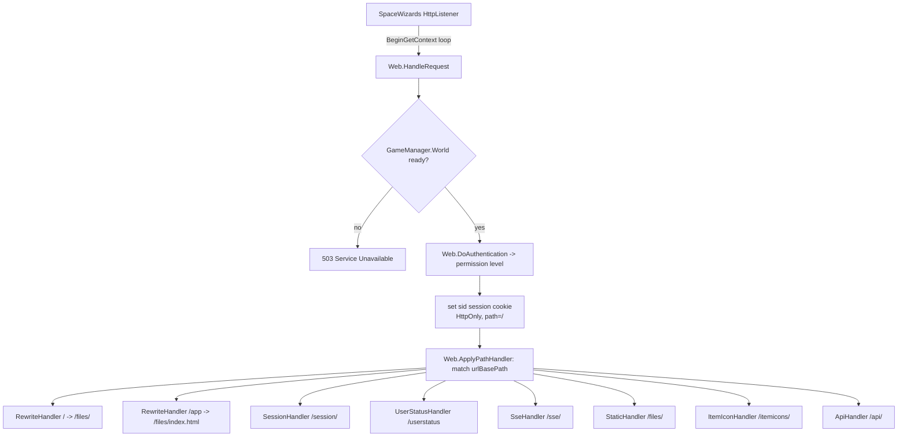
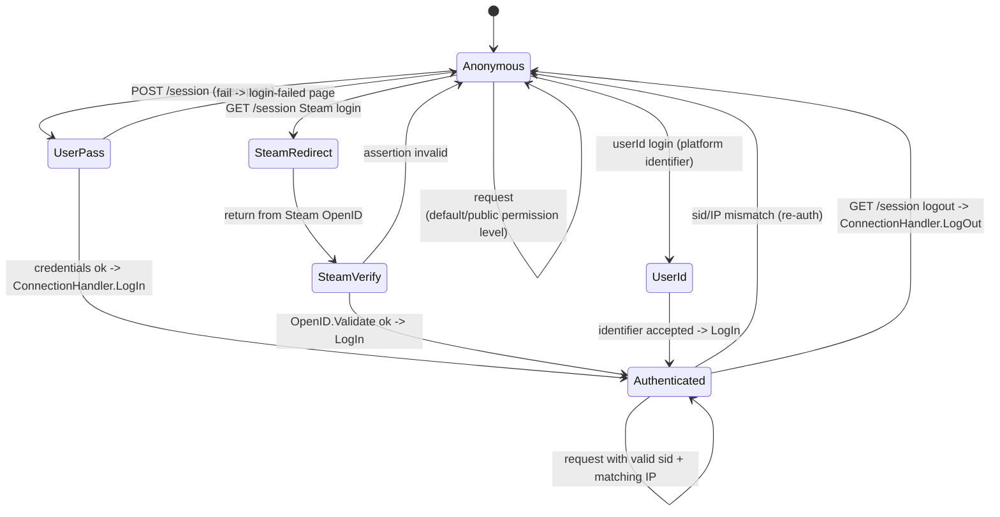
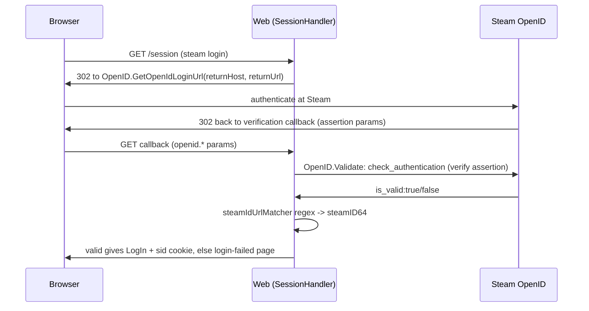
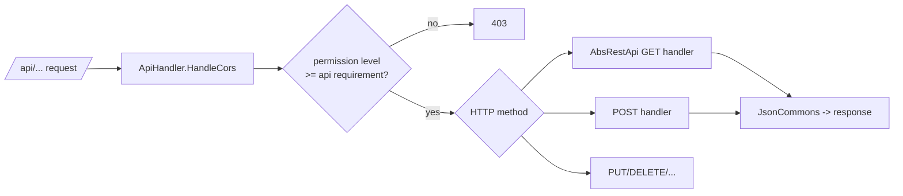
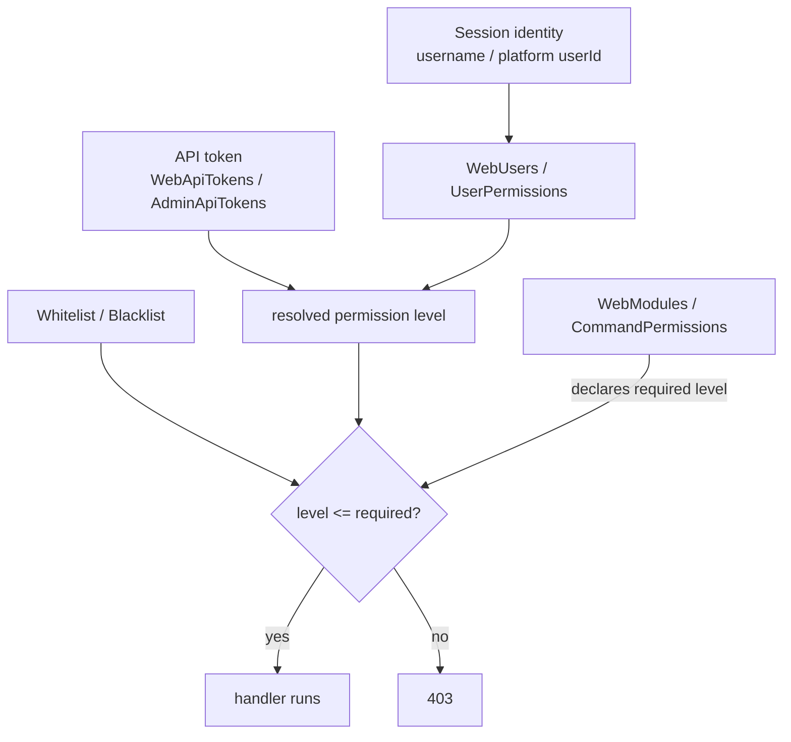
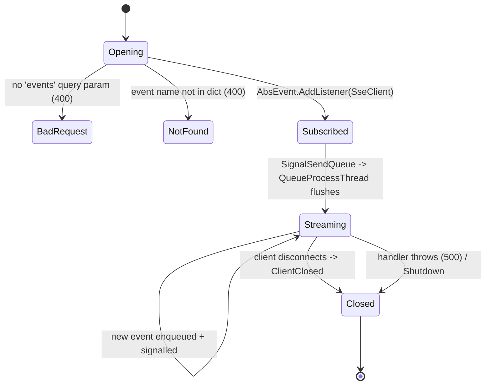

# Web admin server (dedicated V3.1.0)

**Owns:** the managed `Webserver.*` surface, the HTTP admin/API server a dedicated
server runs when the web dashboard is enabled: request pipeline, session auth,
permission model, REST API host, and Server-Sent Events (SSE) push.
**Not:** the `SpaceWizards.HttpListener` native/socket internals (residual); Steam
OpenID's remote verification (external); the web UI assets (content).
**Evidence:** `Webserver.*` IL (72 types / 413 methods; dump locally with
`tools/src/DumpAll Webserver`, git-ignored). **Hub:** [`INDEX.md`](INDEX.md).
**Method:** [`re-methodology.md`](re-methodology.md).

This is a real dedicated-server codepath (the game hosts it in-process on the
admin/web port), distinct from the game wire protocol ([`protocol.md`](protocol.md)).

---

## 1. Architecture

`Webserver.Web` owns a `SpaceWizards.HttpListener.HttpListener` (a third-party
managed HttpListener, not `System.Net`). Requests are pumped **asynchronously**:
each `HandleRequest` callback ends the current `GetContext`, immediately re-arms
`BeginGetContext` (so the accept loop never blocks), then processes the one
request. URL routing is a list of **path handlers** (`AbsHandler` subclasses),
each registered under a URL base path.

Handlers (registered in `RegisterDefaultHandlers`, IL=60, in this order):

| # | Handler | Base path | Role |
|---|---|---|---|
| 1 | `RewriteHandler` | `/` | Rewrites the root to `/files/` (so `/` serves the dashboard) |
| 2 | `RewriteHandler` | `/app` | Rewrites `/app` to `/files/index.html` (SPA entry) |
| 3 | `SessionHandler` | `/session/` | Login / logout (userpass, Steam OpenID, userId) |
| 4 | `UserStatusHandler` | `/userstatus` | Current session's identity + permission status |
| 5 | `SseHandler` | `/sse/` | Server-Sent Events push stream |
| 6 | `StaticHandler` | `/files/` | Dashboard static assets (`DirectAccess` + `SimpleCache`); this is the real static mount, reached via the two rewrites |
| 7 | `ItemIconHandler` | `/itemicons/` | Serves generated item icons |
| 8 | `ApiHandler` | `/api/` | Hosts REST APIs (reflection-discovered `AbsRestApi`) |

Constants observed: session cookie name `sid`; unauthorized `403`; bad request
`400`; handler exception `500`; world-not-ready `503`. `Web` also exposes
`ServerInitialized`, a `LogBuffer` fed by `SendLog` (for the log API/SSE), and
three `CustomSampler`s (auth / cookie / handler) for profiling.

---

## 2. Authentication and session (state machine)

`ConnectionHandler` holds a `Dictionary<sessionId, connection>`. A session is
established by one of three login routes on `SessionHandler`, keyed by the `sid`
cookie and **validated against the client IP** (`IsLoggedIn(sessionId, ip)`).
`DoAuthentication` resolves each request to a **permission level** (lower = more
privileged, the 7DTD admin-level convention); handlers compare it via
`IsAuthorizedForHandler`.

`LogIn(ip, username, userId, crossUserId)` records the platform identity (and an
optional cross-play identity) for the session; the resulting permission level
comes from the permission model (§4). The `sid` cookie is set `HttpOnly` with
path `/`.

**Registration tokens (`UserRegistrationTokens`):** the one-time token
store behind the `RegisterUser` API. `CreateToken(playerName, platformId,
crossPlatformId)` (IL=31) first purges expired entries
(`RemoveAll` on `ExpiryTime < Now`), builds a `RegistrationData` carrying
the player identity plus the expiry, and keys it by `Utils.GenerateGuid()`.
`TryValidate(token, out data)` (IL=13) is a `TryGetValue` plus
`ExpiryTime > Now` check - the browser's register page exchanges a valid
token for a real account.

### 2.1 Steam OpenID sub-flow

`SessionHandler.HandleSteamLogin` redirects the browser to Steam's OpenID
endpoint; the return hits `HandleSteamVerification`, which calls
`OpenID.Validate(request)`.

`OpenID` pins Steam's CA + intermediate `X509Certificate2` and matches the
returned identity URL with `steamIdUrlMatcher` to extract the SteamID. The remote
`check_authentication` round-trip to Steam is external (residual).

---

## 3. REST API host and dispatch

`ApiHandler` discovers every `AbsWebAPI` -> `AbsRestApi` subclass by **reflection**
at startup (`apiFoundCallback` matches a ctor taking the parent, else an empty
ctor) and registers each under its route. Per request it runs CORS handling then
dispatches by path and HTTP method.

**Request plumbing:** `RequestContext` is the per-request record
(`RequestPath`, `Method`, the `HttpListenerRequest`/`Response`, plus the
lazily-parsed `QueryParameters` NameValueCollection). `WebUtils` is the
response helper: `WriteText` / `WriteJsonData` (IL=40/26) write a status
code with the right mime, `SendEnvelopedResult` (IL=70) wraps JSON into the
standard envelope, `IsSslRedirected` (IL=15) enforces HTTPS when enabled,
and `GenerateGuid` (IL=6) is the token/id source. `MimeType.GetMimeType(ext)`
(IL=22) resolves file extensions to content types from the static
`mappings` table.

`OpenApiHelpers` + `JsonCommons` render OpenAPI metadata and JSON bodies.
Complete set of concrete APIs under `Webserver.WebAPI.APIs` (each an `AbsRestApi`;
enumerated from the type list, not sampled):

| API group (namespace) | Endpoints |
|---|---|
| `ServerState` | `ServerStats`, `ServerInfo`, `GamePrefs`, `GameStats`, `SandboxSettings` (all four of the preceding extend the abstract base `KeyValueListAbs`, which is **not** itself an endpoint) |
| `WorldState` | `Player`, `Animal`, `Bloodmoon`, `Hostile` (online players / animals / blood-moon state / hostiles; `LiveData.Animals` and `LiveData.Hostiles` feed these) |
| `GameData` | `Item`, `Mods`, `EntityClass` |
| `Permissions` | `WebUsers`, `WebModules`, `WebApiTokens`, `UserPermissions`, `CommandPermissions`, `Whitelist`, `Blacklist`, `RegisterUser` |
| (top-level) | `Command` (run a console command over HTTP; `Webserver.WebAPI.APIs.Command`), `LogApi` (recent log lines from `LogBuffer`), `OpenAPI` (serves the OpenAPI/Swagger spec) |

---

## 4. Permission model

Access is a numeric **permission level** per session (admin-level convention:
lower = more power). Each handler/API/command declares a required level; a request
passes when the session's level is at least as privileged.

- `WebUsers` / `UserPermissions`: map identities to levels.
- `WebApiTokens` / `AdminApiTokens`: token-based access (non-browser clients).
- `WebModules` / `CommandPermissions`: per-module / per-console-command required
  level.
- `Whitelist` / `Blacklist`: allow/deny lists.
- `AdminWebModules` / `AdminWebUsers` (`Webserver.Permissions`): the admin-section
  management surface for the above.

---

## 5. Server-Sent Events (SSE) lifecycle (state machine)

`SseHandler` keeps a `Dictionary<eventName, AbsEvent>` and a list of `SseClient`s,
plus one **queue thread** (`QueueProcessThread`) woken by an `AutoResetEvent`. A
client opens a long-lived `GET /sse?events=<name>`; the handler registers an
`SseClient` as a listener on the named `AbsEvent`; producers enqueue and signal;
the queue thread flushes to each client's stream.

`AbsEvent.AddListener` / listener removal on `ClientClosed` manage per-event
subscriptions; `Shutdown` drains the thread. Concrete events subclass `AbsEvent`
(e.g. log stream), each fanning out to its subscribed clients.

---

## 6. Console commands (`Webserver.Commands` + others)

### 6.0 HTTP Command API (`Webserver.WebAPI.APIs.Command`)

REST surface for the same `SdtdConsole` dispatcher used by telnet/stdin
([console-commands.md](console-commands.md)):

| Method | Handler | Role |
|---|---|---|
| GET | `HandleRestGet` | list known commands / metadata (`writeCommandJson`) |
| POST | `HandleRestPost` | execute a command line under the session's permission level |

Session identity is a `Webserver.WebConnection` (username, endpoint IP, platform
user ids) produced by `Web.DoAuthentication` / `ConnectionHandler.LogIn`. Output
returns through `WebCommandResult` (`SendLine` / `SendLines` / `SendLog`), which
implements the console connection contract so permission gating matches
`AdminTools.CommandAllowedFor` for the bound web user.

Cross-check: in-game package path is `NetPackageConsoleCmdServer` →
`ConnectionManager.ServerConsoleCommand`; web path never uses those packages.

| Command | Type | Role |
|---|---|---|
| `webtokens` | `Webserver.Commands.WebTokens` | Manage web tokens |
| `webpermission` | `WebPermissionsCmd` | Manage web permission levels |
| `invalidatecaches` | `InvalidateCachesCmd` (`Webserver.FileCache`) | Invalidate the web file caches |
| `createwebuser` | `ConsoleCmdCreateWebUser` | Create a web dashboard user account |
| `openiddebug` | `Webserver.Commands.EnableOpenIDDebug` | Enable/disable OpenID debugging |

All five are concrete `ConsoleCmdAbstract` subclasses in the **base
`Assembly-CSharp`** (not mod-added), counted in the 187 total
([console-commands.md](console-commands.md)). They run through the normal
console/telnet command system, so they are reachable on a headless server without
the browser.

---

## 7. Dedicated relevance and residuals

- **Runs on dedicated** in-process when the web dashboard is enabled; the console
  commands run regardless.
- **Residual (native/external):** `SpaceWizards.HttpListener` socket internals;
  Steam OpenID `check_authentication` (remote); TLS/X509 verification primitives;
  the dashboard's static web assets (content, not loop IL).
- **Content:** `WebModules` / permission defaults are config-driven.

---

## Related docs

| Doc | Role |
|---|---|
| [full-surface.md](full-surface.md) | Where this sits in the whole-assembly map |
| [protocol.md](protocol.md) | The game wire protocol (separate from this HTTP surface) |
| [managers.md](managers.md) | Other in-process managers |
| [re-methodology.md](re-methodology.md) | How this was reversed |
| [residuals.md](residuals.md) | Native/external residuals |

## Changelog

- **2026-07-28:** WebAPI Command GET/POST + WebConnection session note.

- **2026-07-23:** Initial `Webserver.*` reversal (request pipeline, auth/session + Steam OpenID, REST host, permission model, SSE lifecycle) with state machines.
