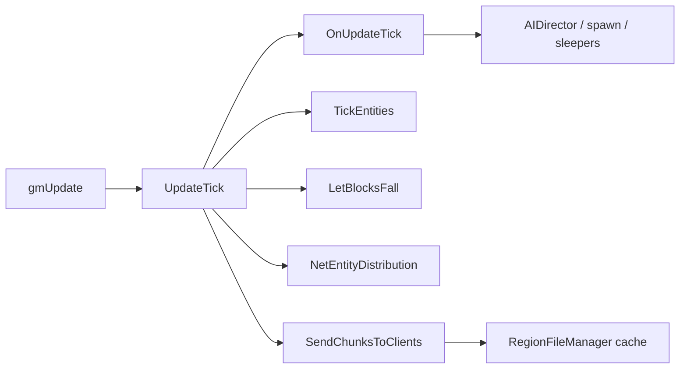
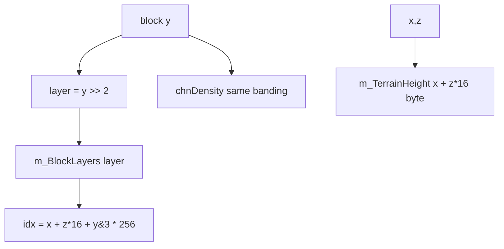
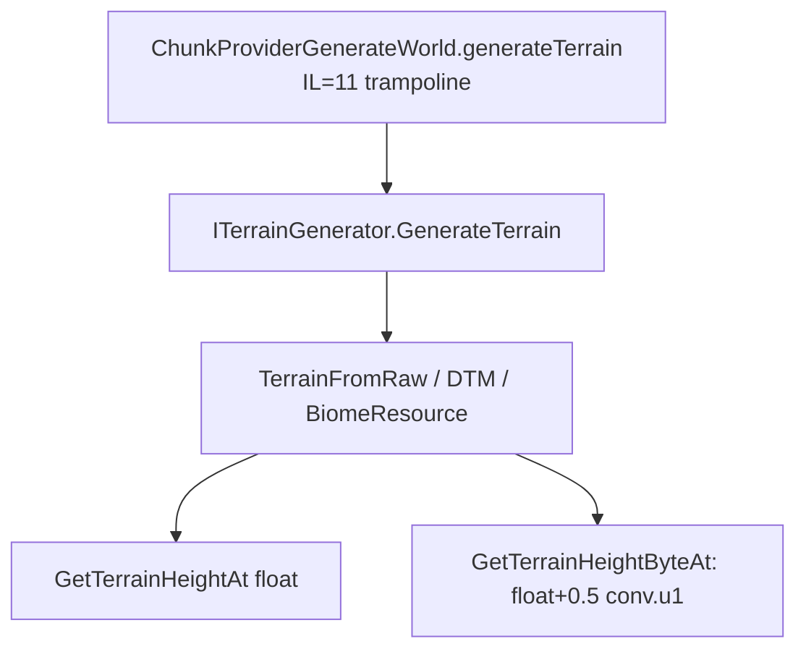
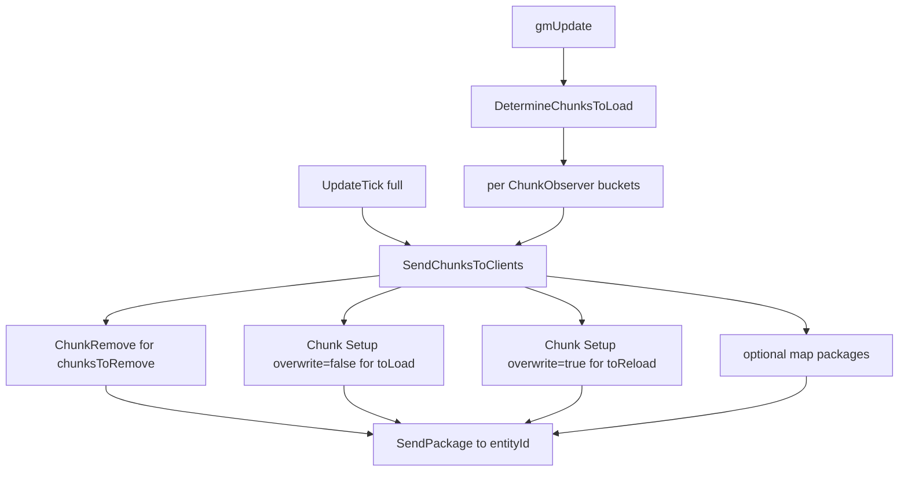
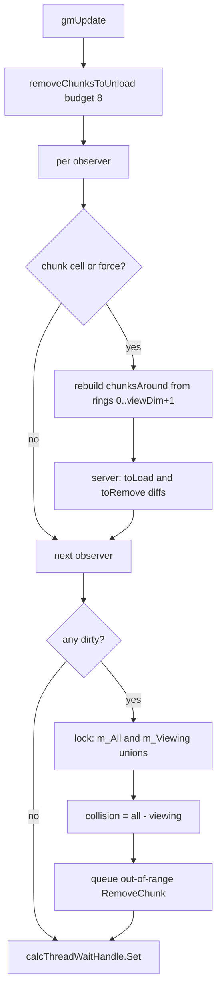
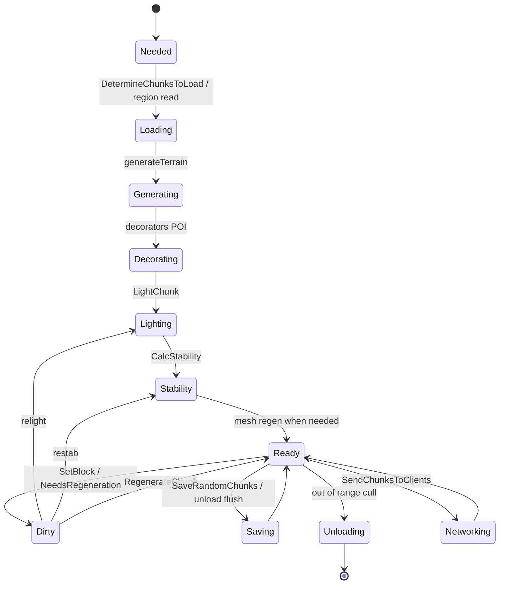
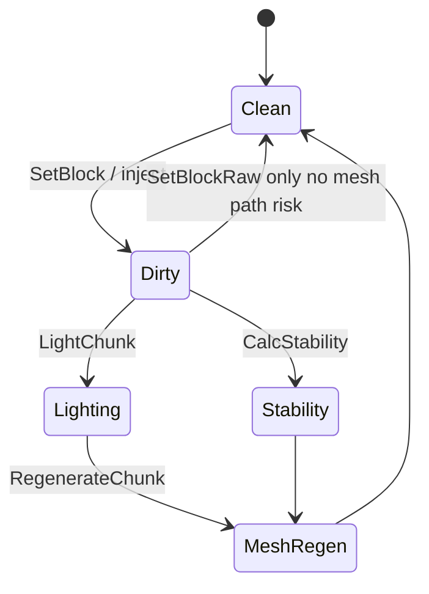

# World and chunk pipeline (dedicated V3.1.0)

**Owns:** world tick, generateTerrain trampoline, load/send (observer streaming), SetBlock path (generic engine).  
**Index math:** §2 below + [`terrain-height.md`](terrain-height.md).  
**Save path:** [`save-region.md`](save-region.md).  
**Product Streamed inject:** `7days-realworld/docs/realearth-runtime.md`.  
**Dumps:** `../il/loop-complete-v3.1.0/`, `../il/realearth-surfaces-v3.1.0/`, `../il/dedi-complete-v3.1.0/`.  
**Hub:** [`INDEX.md`](INDEX.md).

---

## 1. World tick entry

| Method | IL | Role |
|---|---:|---|
| `GameManager.gmUpdate` | **631** | Frame orchestration |
| `GameManager.UpdateTick` | **150** | Slice vs full tick |
| `World.OnUpdateTick` | **189** | Chunks, water splash, deco, block ticker, AIDirector, sleepers |
| `World.TickEntities` | **117** | Authority entity loop |
| `World.TickEntitiesSlice` | 5 / 37 | Partial entity work |
| `World.TickEntity` | **148** | Single entity authority tick |

Full tick (when timer ready): Flush → OnUpdateTick → TickEntities → LetBlocksFall → (not dedi) visibility → NetEntityDistribution → SendChunksToClients → optional SaveRandomChunks.

**`GameManager.UpdateTick` (IL=150) detail:** if `GameTimer.elapsedTicks == 0`
but players exist → only `TickEntitiesSlice` and return true (partial). Else
`TickEntitiesFlush`; `partial = (Time.time - lastTime) * 20`;
`OnUpdateTick(partial, activeChunks)`. Server: if `gameStateManager.OnUpdateTick`
false return false. Always `TickEntities(partial)` + `LetBlocksFall`. Non-dedi:
`SetEntitiesVisibleNearToLocalPlayer`. Server: `entityDistributer.OnUpdateEntities`,
`SendChunksToClients`; if `bSavingActive`: cache protected positions; every
**40** ticks `SaveRandomChunks(2, …)`; every **60 s** wall time
`SaveDecorations` + optional `EventPrefabs.Save`. Client: `updateSendClientPlayerPositionToServer`.
Rich presence every **1 s** wall.

**`TickEntitiesSlice` / `Flush`:** slice uses `tickEntitySliceCount` entities
from `tickEntityIndex` via `TickEntity(e, tickEntityPartialTicks)` then advances
index. Flush calls slice with full list count (drain remainder).

**`TickEntities(partial)` (IL=117 high-level):** rebuild `tickEntityList` from
world entities (primary local first ordering residual); if slice mode path not
used, tick all then `EntityActivityUpdate`; else set partial and flush.

**`SaveDecorations` (IL=3):** `DecoManager.Instance.Save()`.

**`DecoManager.UpdateTick` (IL=330 high-level):** drain locked queues:
`SAddDecoInfo` → `AddDecorationAt`; remove-pos list → `RemoveDecorationAt`;
rect resets → `ResetDecosInWorldRect`; chunk-key resets →
`ResetDecosForWorldChunk`. Then server: rebuild player list for deco interest
residual / coroutine path.



---

## 2. Chunk storage model

Summary (product-oriented deep write-up: ``realearth-surfaces.md``):



Live stock: `ChunkBlockYDim=256`, `ChunkBlockLayers=64`, `ChunkAreaDim=256` (XZ plane map size).

**Block read surface (V3.1.0 b14):** `World.GetBlock(x, y, z)` (IL=13)
delegates to `ChunkCluster.GetBlock` and returns `BlockValue.Air` when the
`ChunkCache` is null (uninitialized world). `WorldBase.GetBlock(Vector3i)` /
`GetBlock(BlockValueRef)` (both IL=4) are the `IBlockAccess`
`DefaultGetBlock` implementations. `World.GetBlockData(pos)` (IL=10) is a
separate `Dictionary<Vector3i, object>` lookup (extra per-position data, not
the voxel word). `WorldBiomes.GetBlockValueForName(name)` (IL=15) resolves an
item/block by name via `ItemClass.GetItem` and throws
`Block with name '...' not found!` on an empty result, else converts with
`ToBlockValue`. The cluster hop: `ChunkCluster.GetBlock(x, y, z)` (IL=21)
returns `Air` when `y >= 256` (out-of-height guard) or the chunk is missing,
else `chunk.GetBlock(toBlockXZ(x), y, toBlockXZ(z))`; `GetBlockEntities(key)`
(IL=59) sweeps every chunk's `IndexedBlocks[key]` positions and collects the
`BlockEntityData` (world-coordinate) for each; `GetBlockEntity(pos)` (IL=12)
returns null for a missing chunk; `GetBlockFaceTexture(pos, face, channel)`
(IL=23) returns `0` for a missing chunk, else the per-face texture index.

---

## 3. Generation



Interfaces are unpatchable; patch concrete generators / provider.

---

## 4. Load / unload / stream

| Surface | IL / note |
|---|---|
| `DetermineChunksToLoad` | **448** (gmUpdate; rings, diffs, cull; section 4.0.1) |
| `SendChunksToClients` | **216** (per-observer remove/load/reload/map packages) |
| `AddChunkObserver` | **15** (player join attaches stream target) |
| `ResendChunksToClients` | **55** (queue reload keys for remote observers) |
| `doCopyChunksToUnity` | 252; **skipped on dedicated** in gmUpdate |
| `SaveRandomChunks` | 99 |
| `ChunkCluster.AddChunkSync` / `UnloadChunk` / `RemoveChunk` | pipeline |
| `Chunk.OnLoad` / `OnUnload` | 97 / 188 |
| `RegionFileManager` | cache + cull + claim protect |

### 4.0 Client chunk streaming (verified)

**When:** every full `UpdateTick`, after `NetEntityDistribution.OnUpdateEntities`
(Xref V3.1.0 b14: sole caller of `SendChunksToClients` is `GameManager.UpdateTick`
IL_00E6). `NetPackageChunk.Setup` call sites (4): two from `SendChunksToClients`
(first-load and reload paths), plus flat/disc terrain `RebuildTerrain` paths that
re-push overwrite chunks. There is no side-thread `write` of the package body
outside the normal NetPackage serialize path (Xref `write` = 0 direct callers;
serialization is virtual dispatch from the connection writer).

**`ChunkManager.AddChunkObserver(pos, buildVisualMesh, viewDim,
entityIdToSendChunksTo)` (IL=15):** `new ChunkObserver(...)`, push onto
`m_ObservedEntities`, set `isInternalForceUpdate = true` (forces one full stream
pass for the new observer), return it. Attached at player join
([server-lifecycle.md](server-lifecycle.md) §3) and per stream-target.

**Force-update gate:** `IsForceUpdate()` (IL=8) =
`isInternalForceUpdate || isChunkClusterChanged` (read from gmUpdate before the
observer work); `ForceUpdate()` (IL=4) sets `isInternalForceUpdate = true`.
`RemoveChunkObserver(o)` (IL=29) finds the observer by `id` in
`m_ObservedEntities`, removes it and also sets `isInternalForceUpdate = true`.
`GroundAlignFrameUpdate()` (IL=42, once per frame when world running) alternates
`groundAlignIndex` 0/1 and runs `Block.GroundAlign(data)` over the corresponding
`groundAlignBlockLists` bucket, clearing it (ground-snap of placed block entity
data).

### 4.0a `SendChunksToClients` body (IL=216)

Per observer (`m_ObservedEntities`; skip when `entityIdToSendChunksTo == -1`),
using one shared `sendToClientPackages` list:

1. **Removes:** for each key in `chunksToRemove`: queue
   `NetPackageChunkRemove.Setup(key)`, drop the key from `chunksLoaded` and
   `chunksToReload`. Clear `chunksToRemove`. Flush immediately:
   `SendPackage(list, false, 0, entityIdToSendChunksTo, -1, null, 192, false)`,
   clear list.
2. **Loads:** walk `chunksToLoad.list` while the batch has fewer than **3**
   packages: `GetChunkSync(key)`; skip while the chunk is missing or
   `NeedsLightCalculation` (volatile read); else queue
   `NetPackageChunk.Setup(chunk, false)` (first load), add the key to
   `chunksLoaded`, remove from `chunksToLoad`. So at most **3 new chunks per
   observer per tick**.
3. **Reloads:** walk `chunksToReload` **backwards** (`Count-1 .. 0`); same
   existence/light gate; queue `NetPackageChunk.Setup(chunk, true)` and
   `RemoveAt(index)`.
4. **Map chunks:** if `mapDatabase` set: `GetMapChunkPackagesToSend()` appended.
5. Flush whatever accumulated (`SendPackage` as step 1) and clear.

**`ResendChunksToClients(chunks)` (IL=55):** for each observer with
`!bBuildVisualMeshAround` whose `entityIdToSendChunksTo` does **not** match a
local player (or no local players exist): `chunksToReload.AddRange(chunks)`.
So a terrain rebuild re-pushes overwrite chunks to remote observers while
local visual-mesh observers rebuild directly (used by `RebuildTerrain` paths).

### 4.0b Chunk load/unload lifecycle

**`Chunk.OnLoadedFromCache` (IL=90):** `NeedsRegeneration = true`,
`isModified = true`; clear the volatile `InProgress*` flags
(Regeneration/Saving/Copying/Decorating/Lighting/Unloading) and the collision
mesh flags; clear `entityStubs`; for each of the 16 `entityLists`: move every
`IsSavedToFile()` entity into `entityStubs` as `EntityCreationData(entity,
true)` and clear the list (the stubs are re-spawned on next `OnLoad`).

**`Chunk.OnLoad(world)` (IL=97):** server side only: for each `entityStub`
whose id is not already present in the world → `SpawnEntityAsync(world, stub,
null)`; `removeExpiredCustomChunkDataEntries(worldTime)`; per block layer
`layer.OnLoad(world, x*16, layer*4, z*16)` which, under lock, fires
`Block.OnBlockLoaded` for every `notifyLoadUnloadCallbackBlocks` index; per
tile entity `TileEntity.OnLoad()`.

**`Chunk.OnUnload(world)` (IL=188):** `InProgressUnloading = true`; destroy the
`biomeParticles` list. Server side: drain `pendingEntityCreateOps` by calling
`EntityCreateHandle.WaitForComplete()` on a snapshot (async creation must finish
before unload, see [dedicated-leftovers.md](dedicated-leftovers.md) §12); per
`entityLists` bucket `world.UnloadEntities(list, false)`;
`removeExpiredCustomChunkDataEntries`; per tile entity `TileEntity.OnUnload(world)`;
`RemoveBlockEntityTransforms()`; per layer `layer.OnUnload(...)` firing
`Block.OnBlockUnloaded` (under lock); `waterSimHandle.Reset()`.

**Leaves:** `removeExpiredCustomChunkDataEntries(worldTime)` (IL=61) drops
`ChunkCustomData` entries whose `expiresInWorldTime <= worldTime` (calling
`ChunkCustomData.OnRemove`), collecting expired keys then removing them.
`World.UnloadEntities(list, force)` (IL=36) walks the list backward and calls
`unloadEntity(e, reason 1)` unless `!force && (e.bWillRespawn || attached-main
entity bWillRespawn)` (sleepers with a pending respawn and their attachments
survive a non-forced unload).

### Chunk dirty / save invalidation (blob-cache input)

**`Chunk.get_NeedsSaving` IL=20** returns true if any of:

| Condition | Field |
|---|---|
| Block/light/etc. dirty | `isModified == true` |
| Entities present | volatile `hasEntities == true` |
| Tile entities non-empty | `tileEntities.Count > 0` |
| Block triggers non-empty | `triggerData.Count > 0` |

So a chunk with **any TE or trigger** always needs saving, even if `isModified`
is false. Pure air + no entities can be clean.

**`isModified` writers (field Xref, V3.1.0 b14 sample):** set true (or cleared)
from block/light/water/texture mutators (`SetBlockRaw`, `SetLight`, `SetWater*`,
`SetTextureFull`, `FillBlockRaw`, …), TE add/remove, entity tracking adjust,
load/save/reset/ctor paths, and biome spawn count helpers. A network chunk blob
cache keyed only on "block version" is incomplete unless it also invalidates on
**TE / trigger / entity occupancy** changes that flip `NeedsSaving` or change
serialized TE payload inside `Chunk.write` / snapshot.

**Region snapshot gate** (save-region): `RegionFileChunkSnapshot.Update` skips
unless `saveIfUnchanged` or `Chunk.NeedsSaving` - same predicate as above.

**Observer model (`ChunkManager/ChunkObserver`):** created by
`AddChunkObserver(pos, bBuildVisualMeshAround, viewDim, entityIdToSendChunksTo)`
and stored in `m_ObservedEntities`. Join path sets
`entityIdToSendChunksTo = player.entityId` and `viewDim` from the clamped
client value ([protocol.md](protocol.md) section 5).

| Field | Role |
|---|---|
| `entityIdToSendChunksTo` | target client entity id; **`-1`** skips network send |
| `viewDim` | observation radius; bucket lists sized `viewDim + 2` |
| `bBuildVisualMeshAround` | local/visual observer (not a remote stream target for resend) |
| `chunksLoaded` | keys already sent |
| `chunksToLoad` | `BucketHashSetList` of keys still needed |
| `chunksToReload` | keys that must be resent with overwrite |
| `chunksToRemove` | keys to unload on the client |
| `chunksAround` | current around-set from `DetermineChunksToLoad` |
| `mapDatabase` | optional mini-map package source |

`DetermineChunksToLoad` (IL=448) is called from **`gmUpdate`** (not from
`UpdateTick`; sole Xref). It refreshes per-observer around-sets and diffs
`chunksToLoad` / `chunksToRemove`. It does **not** send packages. Full algorithm:
section 4.0.1.

**`SendChunksToClients` per observer with `entityIdToSendChunksTo != -1`:**

1. **Removes:** for each key in `chunksToRemove`, queue
   `NetPackageChunkRemove.Setup(key)`; drop from `chunksLoaded` and
   `chunksToReload`; clear `chunksToRemove`. If any, `ConnectionManager.SendPackage`
   list to that entity id (arg literal **192** on the bulk send path, same as other
   join S2C bulk).
2. **First-time loads:** walk `chunksToLoad.list`; `GetChunkSync`; **skip** while
   `Chunk.NeedsLightCalculation`; else `NetPackageChunk.Setup(chunk, bOverwrite=false)`,
   mark loaded, remove from to-load. **Stop filling when pending packages >= 3**
   (per-tick throttle for first loads).
3. **Reloads:** reverse-walk `chunksToReload`; same light gate;
   `Setup(chunk, bOverwrite=true)`; remove from reload list.
4. **Map:** if `mapDatabase` set, append
   `IMapChunkDatabase.GetMapChunkPackagesToSend()` when non-null
   (`MapChunkDatabase`: 17x17 window around client map middle after a
   position update; channel-1 compressed `NetPackageMapChunks`,
   [protocol-packages.md](protocol-packages.md) section 3.3).
5. Send any remaining packages to the same entity id (again bulk flags **192**).



**`NetPackageChunk` (channel 1, compressed):** `Setup` runs `Chunk.write` into a
pooled stream; `write` emits `bOverwriteExisting`, optional i16 x/y/z when
overwrite, i32 dataLen, blob. Client `ProcessPackage` either adds a new chunk or
unload/reset/re-read/re-add when overwriting. Codec shared with region save
([save-region.md](save-region.md), [protocol-packages.md](protocol-packages.md) section 3.1).

**`ResendChunksToClients(HashSetLong)`:** for each observer that is **not** a local
player visual mesh builder, append the given keys to `chunksToReload` so the next
`SendChunksToClients` re-pushes with overwrite (terrain rebuild paths call
`NetPackageChunk.Setup` directly as well).

### 4.0.1 `DetermineChunksToLoad` algorithm (verified)

**Caller:** `GameManager.gmUpdate` only (IL offset in inventory). Runs every
frame, before the full-tick path that may later call `SendChunksToClients`.

**Phase 0 - drain unloads (budget 8):**
`removeChunksToUnload(8)` walks `chunksToUnload` reverse under lock. For each
chunk: `EnterWriteLock`, set `InProgressUnloading`, skip if
`IsLockedExceptUnloading`, else remove from list, optional
`FreeChunkGameObject` when `IsDisplayed`, then `ChunkCluster.UnloadChunk`. Stops
after 8 successful free/unloads. Return count feeds phase-end CGO reclaim.

**Phase 1 - per observer, only when needed:**

Trigger if `isInternalForceUpdate` **or** `isChunkClusterChanged` **or** this
observer's chunk cell changed:

```text
cx = World.toChunkXZ(Fastfloor(position.x))   // >> 4
cz = World.toChunkXZ(Fastfloor(position.z))
curChunkPos = (cx, 0, cz)
```

When the cell (or force flags) changed:

1. **Rebuild `chunksAround`:** clear; for ring index `r = 0 .. viewDim+1`
   (exclusive upper bound `viewDim + 2`), for each offset in
   `rectanglesAroundPlayers[r]`, add key
   `MakeChunkKey(cx + ox, cz + oy)` into bucket `r`.
2. `RecalcHashSetList()` on `chunksAround` (flatten buckets to ordered `list`).
3. **Server only:**
   - `chunksToLoad` = per-bucket copy of `chunksAround` minus `chunksLoaded`
     (`ExceptWithHashSetLong` per bucket), then recalc.
   - `chunksToRemove` = `chunksLoaded` minus anything still in `chunksAround`
     (`UnionWith` loaded, then `ExceptTarget` around buckets).
   - Stamp `chunkGenerationTimestamps[key] = UtcNow` for every key now in
     `chunksToLoad.list`.

`rectanglesAroundPlayers` is built once in `ChunkManager.Init` (IL=104): array
length **15** (rings 0..14). Ring `r` holds the **hollow square** border offsets
where `max(|x|,|y|) == r` (both loops run `[-r..r]`; an offset is kept only if
it lies on the perimeter). That caps max useful `viewDim` near 13 for full ring
coverage (`viewDim+2 <= 15`). Manager-level
`m_ViewingChunkPositions` / `m_AllChunkPositions` / `m_CollisionChunkPositions`
are also 15-bucket `BucketHashSetList`s (ctor).

**Phase 2 - global union when any observer dirty (`loc.1`):**

Under `lockObject`:

1. Set volatile flags
   `isViewingOrCollisionPositionsChanged_threadCalc` and
   `_threadReg` so worker threads re-read positions.
2. Clear `m_AllChunkPositions` and `m_ViewingChunkPositions`.
3. For each bucket index and each observer with `viewDim+2` covering that
   bucket: union that observer's `chunksAround` bucket into `m_AllChunkPositions`;
   if `bBuildVisualMeshAround`, also union into `m_ViewingChunkPositions`.
4. Recalc both manager lists. Copy `m_AllChunkPositions.list` into
   `activeChunkSetArr`.
5. **Server:** rebuild `m_CollisionChunkPositions` =
   `m_All - m_Viewing` (per-bucket union then except), recalc.
6. **Server, non-fixed-size cluster:** under `chunksToUnload` lock, for every
   live cache key not in `m_AllChunkPositions` and not in DynamicMesh process/load
   queues: mark `InProgressUnloading`, queue into `chunksToUnload`, then
   `ChunkCluster.RemoveChunk` for each queued chunk.
7. If unload budget remaining (`8 - drained`),
   `recalcFreeChunkGameObjects(remaining, false)`.

**Always at end:** clear force/cluster flags; `calcThreadWaitHandle.Set()` to
wake `ChunkCalc` / related workers.



**`BucketHashSetList`:** distance-ringed `HashSetLong` buckets plus a flattened
`list` rebuilt by `RecalcHashSetList` (bucket order 0..n, dedupe via
`elementsInList`). `SendChunksToClients` walks that flat `list` for first loads,
so nearer rings tend to stream first when buckets were filled ring-first.

### 4.1 Chunk progress flags (stock `InProgress*` volatiles)


Measured fields on `Chunk`: `InProgressCopying`, `Decorating`, `Lighting`, `Regeneration`, `Unloading`, `Saving`, `Networking`. Conceptual lifecycle (flags can overlap; not a single exclusive enum):



---

## 5. Mutation / dirty

| Method | IL | Role |
|---|---:|---|
| `ChunkCluster.SetBlock(Vector3i,…)` | **828** | Full set path |
| `ChunkCluster.SetBlockRaw` | 25 | Resolve chunk + local coords → `Chunk.SetBlockRaw` |
| `Chunk.SetBlockRaw` | **386** | Silent voxel write (detail below) |
| `chunkPosNeedsRegeneration` | **550** | Dirty mesh/light |
| `LightChunk` / `CalcStability` / `RegenerateChunk` | cluster | Fallout |

Prefer SetBlock over SetBlockRaw when mesh must update (product inject lesson).

### 5.0 `Chunk.SetBlockRaw` (IL=386)

Silent in-chunk write used by load, falling, inject, and some TE paths:

1. If `y >= 255`: force Air write target.
2. Water path: if old/new is water or `CanWaterFlowThrough`, may recurse
   `SetBlockRaw` / `SetWater` and notify `waterSimHandle.SetVoxelSolid` with
   rotation faces.
3. Layer: `ChunkBlockLayer.GetAt` / `SetAt`; allocate layer if needed; preserve
   or clear damage for non-child air/solid transitions.
4. Index lists: update `IndexedBlocks` (remove old index type, add new if
   `FilterIndexType`, e.g. `lpblock`).
5. Heightmap: if air↔solid at column, `RecalcHeightAt`.
6. Random tick registry: under lock on `tickedBlocks`, Remove or Replace world
   pos when `IsRandomlyTick` transitions.
7. Flags: `bMapDirty`, `isModified`, `bEmptyDirty`; return previous BlockValue.

Does **not** fire light/mesh/stability RPC; callers that need those use full
`SetBlock` / `SetBlockRPC`.

### 5.0b Uncull and trader lookup helpers

**`World.UncullChunk(chunk)` (IL=8):** if `IsInternalBlocksCulled`, add to
`chunksToUncull` set (async uncull queue).

**`World.UncullPOI(prefab)` (IL=26):** `prefab.AddChunksToUncull(world, set)`;
on success log POI name + bbox and return true.

**`updateChunksToUncull` (IL=191):** if queue empty return. Restart
`msUnculling` stopwatch; clear `chunksToRegenerate`. Reverse-walk
`chunksToUncull`: drop if `InProgressUnloading`; else
`RestoreCulledBlocks` → remove from uncull queue → add to regenerate set; for
neighbor faces from restore flags (W/E/N/S bits) enqueue neighbor chunks for
regenerate. Stop when `msUnculling.ElapsedMilliseconds ≥ **5**` (5 ms budget;
continues next frames).

**`World.GetTraderAreaAt(pos)` (IL=14):**
`ChunkProvider.GetDynamicPrefabDecorator().GetTraderAtPosition(pos, 0)` or null.

**`World.IsWorldEvent(event)` (IL=7):** only event **0** is implemented → returns
`isEventBloodMoon`; any other event → false.

**`World.CheckEntityCollisionWithBlocks(entity)` (IL=19):** if
`!CanCollideWithBlocks` return; if chunk cache overlaps entity AABB,
`ChunkCluster.CheckCollisionWithBlocks`.

**`World.CanPlaceLandProtectionBlockAt(pos, player)` (IL=138 high-level):** if
GameStats **1** != 1 allow always; require `InBoundsForPlayersPercent ≥ 0.5`;
scan nearby chunks using claim size stats **44/45**; reject when
`IsLandProtectedBlock` conflicts.

**`InBoundsForPlayersPercent(pos)` (IL=100):** if world extent width &lt; **1024**
return **1**. Else distance-to-edge soft bands: 50 m hard margin + 80 m fade on
x and z from world center; return min of clamped x/z fractions (1 = deep
interior, 0 = at edge).

**`IsLandProtectedBlock(chunk, pos, relative, claimSize, deadZone, forKeystone)`
(IL=104 high-level):** walk chunk `IndexedBlocks["lpblock"]` primary land-claim
TEs; if within deadZone of claim and owner valid: self not protected against
self; ally within claimSize only when `forKeystone`; else protected → true.

**`AdjustBoundsForPlayers(ref pos, padPercent)` (IL=112):** if world extent
width &lt; **1024** or max.x == 0 return false (no clamp). Shrink min/max by
`50 + 80*padPercent` on xz; clamp pos into that box; return true if any
coordinate was clamped.

**`FindSupportingBlockPos(pos)` (IL=175 high-level):** if block at pos movement-
blocked or elevator → return pos. Check y+1 elevator. If y−1 elevator or blocked
→ return. Else direction octant from pos to block center (`supportOrder` table);
walk neighbor offsets for a movement-blocked support block and return its
center.

### 5.1 `GameManager.ChangeBlocks` (IL=530) / `SetBlocksOnClients` (IL=13)

Authoritative multi-block apply used by `NetPackageSetBlock` Process:

1. Lock; resolve `PersistentPlayerData` for the changer (local or list lookup).
2. Walk `List<BlockChangeInfo>`: collect touched `ChunkCluster`s; delayed regen
   start per cluster.
3. Per change: density/air/terrain shape checks; `GetBlock` vs new type;
   `SetBlockValue` / full `ChunkCluster.SetBlock(...)` overload; top-soil break
   on neighbor chunks; `UncullChunk`; child-block TE cleanup.
4. Delayed regen stop after list.

**`GameManager.SetBlocksRPC(changes, persistentPlayerId)` (IL=29)** is the
commit+replicate wrapper: `ChangeBlocks(persistentPlayerId, changes)`, then
`NetPackageSetBlock.Setup(persistentLocalPlayer, changes, dedicated ? -1 :
myPlayerId)`; on the server `SetBlocksOnClients(-1, package)`, else
`SendToServer`.

`SetBlocksOnClients(exceptEntityId, package)` (IL=13):
`ConnectionManager.SendPackage(package, false, -1, exceptEntityId, -1, null,
**192**, false)` excluding the placing entity.



---

## 6. Block tickers / falling

| System | IL | Note |
|---|---:|---|
| `WorldBlockTicker` tickScheduled / tickRandom | 151 / 97 | From OnUpdateTick server path |

**`WorldBlockTicker.Tick` (IL=20):** require `bTickingActive` and server: run
`tickScheduled` then `tickRandom`.

**`tickScheduled` (IL=151):** lock; process up to **100** due entries from
`scheduledTicksSorted` (stop at first future `scheduledTime`). If chunk area not
loaded: reschedule +**30..45** random ticks when chunk exists; else drop. If
loaded: `execute(entry)`.

**`tickRandom` (IL=97):** rebuild key list from active chunks when index
exhausted; `randomTickCountPerFrame = max(1, activeCount/100)`; each frame
`tickChunkRandom` that many. Per chunk: skip if needs light; require ≥ **1200**
ticks since `LastTimeRandomTicked`; for each ticked block pos call
`Block.UpdateTick(..., random=true)` unless already scheduled.

**`RestoreCulledBlocks` (IL=58):** walk `insideDevices` reverse; OR face flags
for devices on chunk edges (x=0 → 8, x=15 → 32, z=0 → 4, z=15 → 16); clear
`IsInternalBlocksCulled`; return flags.

**`WorldBlockTicker.execute(entry, rnd, ticksIfLoaded)` (IL=24):** if live block
type still matches entry `blockID`, call
`Block.UpdateTick(world, pos, bv, random=false, ticksIfLoaded, rnd)`.

**`AddScheduledBlockUpdate(pos, blockId, ticks)` (IL=39):** no-op if blockId 0;
build entry at `GameTimer.ticks + ticks`; under lock replace existing same
hash then `add(entry)`.
| `AddFallingBlock` / `LetBlocksFall` | 38 / 220 | Collapse storms |
| `AddFallingBlock` detail | 38 | HashSet dedupe; skip child/air/`StabilityIgnore`/oversized (unless include); `DynamicMeshManager.AddFallingBlockObserver`; enqueue `fallingBlocks` |
| `EntityFallingBlock` OnUpdateEntity | 300+ | Entity cost |

## Stability, falling blocks, DamageBlock and deco subbiomes (2026-08-06)

Status: **verified** against a full V3.1.0 b14 disassembly (2026-08-05 dump; line
numbers are from that dump; the tracked `il/` sets are the V3.1.0 corpus).

### Stability runs on clients too

`GameStats::initPropertyDecl` (1919111) builds 78 `PropertyDecl`s with ctor order
`(EnumGameStats name, bool bPersistent, EnumType type, object defaultValue)`. Array
index 52 is `(stat 55 = ChunkStabilityEnabled, bPersistent = FALSE, type 3 = bool,
default TRUE)` at 1919743. It is correctly absent from the persistent Write blob,
which means **every client keeps chunk stability enabled from its own default
regardless of what the server sends.**

`ChunkCluster::Init` (1125631-1125637) constructs **both** a `StabilityCalculator`
(`stabilityCalcMainThread`) and a `StabilityInitializer`
(`stabilityCalcLightingThread`) and calls `StabilityCalculator::Init` whenever
`world.GetGameManager() != null`, i.e. on clients too, not only on the server.

`ChunkCluster::LightChunk` (1127022) calls `ChunkCluster::CalcStability` (1127044),
which runs `StabilityInitializer::DistributeStability` plus
`Chunk::CheckSameStability` for every chunk. That is why `bNetwork = true` can skip
the stability channel on the wire: the receiving client recomputes the whole plane
locally.

`ChunkCluster::SetBlock` (~1128420-1128620) calls
`StabilityCalculator::BlockPlacedAt` / `BlockRemovedAt` (with `Block::StabilityFull`
as the flag) for the block and for every `multiBlockPos` cell, on the client as
well as the server.

`StabilityCalculator/UpdatePhysics` (1095820-1095900) is a coroutine gated on
`GameStats.GetBool(EnumGameStats.ChunkStabilityEnabled)` at IL_0014 and on
`StabilityCalculator::bRunning`; when it runs it pushes every unstable position
into `World::AddFallingBlock` (IL_00ad).

`GameManager::UpdateTick` (1881893) calls `World::LetBlocksFall()` at IL_00a5
**outside** the `ConnectionManager.IsServer` guard that wraps
`GameStateManager::OnUpdateTick` just above it, so clients run the falling-block
pump too. `World::LetBlocksFall` is at 1239773, `World::AddFallingBlock` at
1239718, and the entity comes from `EntityFactory::CreateEntity` with
`EntityClass::FromString("fallingBlock")` at 1240000.
`EntityFallingBlocks::Enabled` (220106) is a separate toggle for the grouped
variant.

### DamageBlock is the repair, upgrade and downgrade path

`Block::DamageBlock` (96545) computes `newDamage = blockValue.damage +
_damagePoints` (IL_00bf) and branches on the sign:

- `newDamage < 0` and `Block::UpgradeBlock` is not air (IL_00d9-IL_0128):
  **replaces** the block with `UpgradeBlock`, converting rotation via
  `Block::convertRotation`, copying meta and zeroing damage. Block upgrading is
  over-repair, not a separate operation.
- `newDamage < 0` with no `UpgradeBlock` (IL_0197): clamps damage to 0 and
  SetBlockRPCs.
- IL_01b1 onward is the `Stage2Health` downgrade path.

`ItemActionRepair` (657520) drives repair by calling `Block::DamageBlock` with the
repair amount **negated** (IL_056f `neg`), so the resulting C2S
`NetPackageSetBlock` always carries the new **lower** absolute `BlockValue.damage`.
A server must never treat a wire damage value below the stored one as a delta to
add. The repair amount is `Utils::FastMin(repairAmount, blockValue.damage)` at
IL_0216-IL_0228; the XP event is `_xpFromRepairBlock` (657572).

### Deco density comes from subbiomes, not the top-level list

`WorldBiomeProviderFromImage::GetBiomeOrSubAt` (1303341) resolves `GetBiomeAt` then
`GetSubBiomeIdxAt` (noise) and returns `BiomeDefinition::subbiomes[idx]` when the
index is >= 0. `DecoManager::decorateChunkRandom` calls it **per cell** (1266039)
and samples that **subbiome's** `m_DistantDecoBlocks` (1266052). Sampling only the
top-level biome's `<decorations>` list misses where essentially all the real tree
probability mass lives in stock `biomes.xml` (pine_forest top-level rows are prob
.001-.007; the subbiome lists carry treeJuniper4m .06, treeDeadTree01 .07,
treeDeadPineLeaf .08).

`blocks.xml` ships `IsDistantDecoration` on only three blocks: `treeMaster` (true,
inherited by everything extending it), `resourceRock01` (false) and `treeCactus01`
(true). `BiomeDefinition::AddDecoBlock` (1249700-1249740) uses that flag to build
`m_DistantDecoBlocks`, so the effective distant-deco species set is "anything whose
Extends chain reaches treeMaster, plus treeCactus01, minus resourceRock01".

### Weather packages are keyed strictly by biomeId

`WeatherManager::ClientProcessPackages` (2054217) does
`WorldBiomes::TryGetBiome(biomeId)`, then
`BiomeDefinition::SetWeatherGroup(groupIndex)`, then
`WeatherManager::FindBiomeWeather(biomeId)` and `WeatherPackage::CopyTo`. Entries
for a biomeId the client does not have are skipped silently, and it early-returns
if two weather packages arrive in the same `Time.frameCount`.

---

## Related docs

| Doc | Role |
|---|---|
| [protocol-packages.md](protocol-packages.md) | `NetPackageChunk` / `WorldInfo` wire |
| [protocol.md](protocol.md) | join path that attaches chunk observers |
| [network.md](network.md) | UpdateTick placement of SendChunks |
| [save-region.md](save-region.md) | Chunk write/read; blob codec shared with NetPackageChunk |
| [terrain-height.md](terrain-height.md) | YDim / height |
| `realearth-surfaces.md` | Product surfaces |

## Changelog

- **2026-08-07:** ChunkCluster read hops: GetBlock (IL=21) y>=256 Air guard +
  null-chunk Air; GetBlockEntities (IL=59) IndexedBlocks sweep; GetBlockEntity
  (IL=12) null on missing chunk; GetBlockFaceTexture (IL=23) 0 on missing chunk.
- **2026-08-07:** Block read surface: World.GetBlock (IL=13) null-cache Air +
  ChunkCluster delegate, WorldBase.GetBlock IBlockAccess defaults (IL=4),
  GetBlockData dict (IL=10), WorldBiomes.GetBlockValueForName (IL=15) name
  resolve + not-found throw.
- **2026-08-07:** DecoManager.UpdateTick add/remove/rect/chunk drain.
- **2026-08-07:** WorldBlockTicker.execute type match; AddScheduledBlockUpdate.
- **2026-08-07:** WorldBlockTicker scheduled 100 cap; random 1200 ticks; RestoreCulledBlocks flags.
- **2026-08-07:** UpdateTick IL=150 slice/full; save 40 ticks; deco 60s; SetBlocksOnClients 192.
- **2026-08-07:** TickEntitiesSlice/Flush; TickEntities list rebuild;
  SaveDecorations DecoManager.
- **2026-08-07:** updateChunksToUncull RestoreCulledBlocks + 5 ms budget.
- **2026-08-07:** FindSupportingBlockPos supportOrder; AdjustBoundsForPlayers pad clamp.
- **2026-08-07:** InBoundsForPlayersPercent 50/80; IsLandProtectedBlock lpblock deadZone.
- **2026-08-07:** CheckEntityCollisionWithBlocks; CanPlaceLandProtectionBlockAt 0.5 bounds.
- **2026-08-07:** Chunk.SetBlockRaw IL=386 (y cap, water, IndexedBlocks, heightmap,
  tickedBlocks, dirty flags).
- **2026-08-07:** UncullChunk/UncullPOI; GetTraderAreaAt decorator; IsWorldEvent
  only blood-moon (0).
- **2026-08-07:** ChangeBlocks IL=530 / SetBlocksOnClients IL=13 authority path.

- **2026-08-07:** `Chunk.get_NeedsSaving` predicate (isModified | hasEntities | TE | triggers) for blob-cache invalidation notes.
- **2026-08-06:** ChunkStabilityEnabled is non-persistent with default true, so
  clients keep stability on regardless of the server; ChunkCluster::Init builds a
  StabilityCalculator on clients too and LightChunk recomputes the plane (why
  bNetwork skips the channel); GameManager::UpdateTick runs LetBlocksFall outside
  the IsServer guard; Block::DamageBlock sign branches carry repair, UpgradeBlock
  and Stage2Health downgrade, and ItemActionRepair negates the amount so the wire
  damage is the new lower absolute; DecoManager samples per-cell subbiome
  m_DistantDecoBlocks via GetBiomeOrSubAt and IsDistantDecoration is set on only
  three blocks; WeatherManager::ClientProcessPackages keys strictly on biomeId.

- **2026-07-28:** Map package producer pointer (MapChunkDatabase 17x17 window).
- **2026-07-28:** `DetermineChunksToLoad` full algorithm: 15 hollow rings, per-observer diffs, global unions, unload budget 8.
- **2026-07-28:** `SendChunksToClients` per-observer remove/load/reload/map pipeline; ChunkObserver fields; 3-package first-load throttle.

- **2026-07-19:** Related docs table.
- **2026-07-18:** Chunk/world family narrative consolidating loop + surfaces RE.
