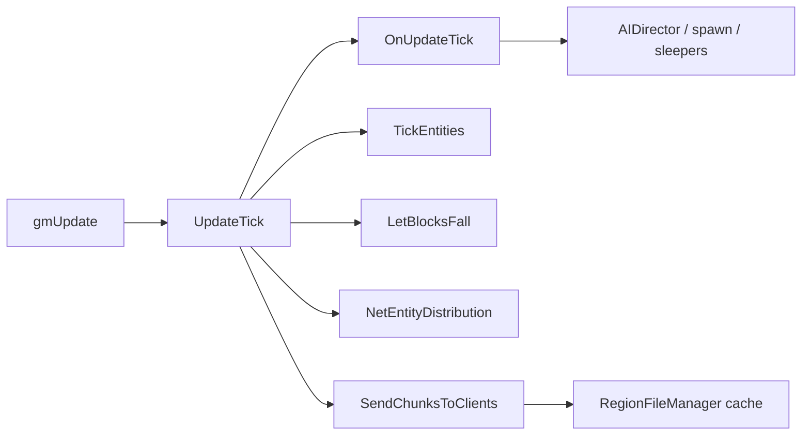
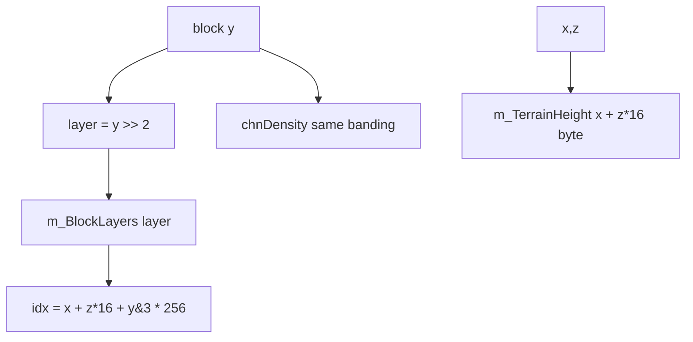
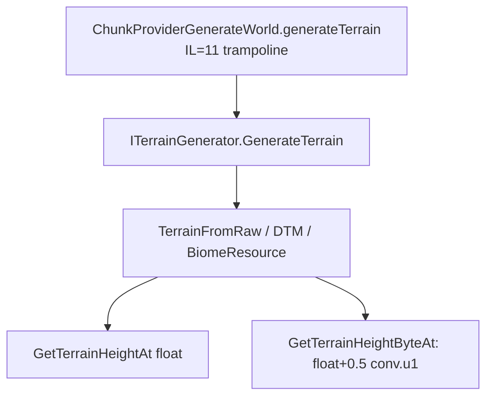
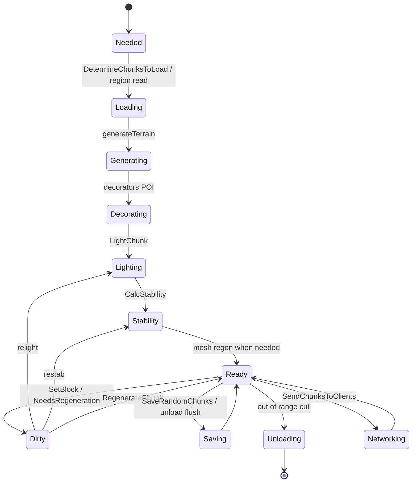
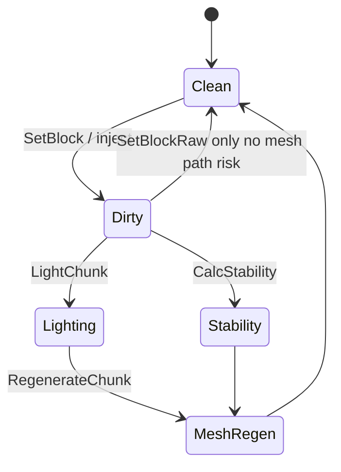

# World and chunk pipeline (dedicated V3.0.1)

**Owns:** world tick, generateTerrain trampoline, load/send, SetBlock path (generic engine).  
**Index math:** §2 below + [`terrain-height.md`](terrain-height.md).  
**Save path:** [`save-region.md`](save-region.md).  
**Product Streamed inject:** [`../../7days-realworld/docs/realearth-runtime.md`](../../7days-realworld/docs/realearth-runtime.md).  
**Dumps:** `../il/loop-complete-v3.0.1/`, `../il/realearth-surfaces-v3.0.1/`, `../il/dedi-complete-v3.0.1/`.  
**Hub:** [`INDEX.md`](INDEX.md).

---

## 1. World tick entry

| Method | IL | Role |
|---|---:|---|
| `GameManager.gmUpdate` | **631** | Frame orchestration |
| `GameManager.UpdateTick` | **150** | Slice vs full tick |
| `World.OnUpdateTick` | **189** | Chunks, water splash, deco, block ticker, AIDirector, sleepers |
| `World.TickEntities` | **117** | Authority entity loop |
| `World.TickEntitiesSlice` | 5 / 37 | Partial entity work |
| `World.TickEntity` | **148** | Single entity authority tick |

Full tick (when timer ready): Flush → OnUpdateTick → TickEntities → LetBlocksFall → (not dedi) visibility → NetEntityDistribution → SendChunksToClients → optional SaveRandomChunks.

---

## 2. Chunk storage model

Summary (product-oriented deep write-up: [`realearth-surfaces.md`](../../7days-realworld/docs/realearth-surfaces.md)):

Live stock: `ChunkBlockYDim=256`, `ChunkBlockLayers=64`, `ChunkAreaDim=256` (XZ plane map size).

---

## 3. Generation

Interfaces are unpatchable; patch concrete generators / provider.

---

## 4. Load / unload / stream

| Surface | IL / note |
|---|---|
| `DetermineChunksToLoad` | **448** (bucket sets, locks, unload) |
| `SendChunksToClients` | **216** |
| `doCopyChunksToUnity` | 252; **skipped on dedicated** in gmUpdate |
| `SaveRandomChunks` | 99 |
| `ChunkCluster.AddChunkSync` / `UnloadChunk` / `RemoveChunk` | pipeline |
| `Chunk.OnLoad` / `OnUnload` | 97 / 188 |
| `RegionFileManager` | cache + cull + claim protect |

### 4.1 Chunk progress flags (stock `InProgress*` volatiles)

Measured fields on `Chunk`: `InProgressCopying`, `Decorating`, `Lighting`, `Regeneration`, `Unloading`, `Saving`, `Networking`. Conceptual lifecycle (flags can overlap; not a single exclusive enum):

---

## 5. Mutation / dirty

| Method | IL | Role |
|---|---:|---|
| `ChunkCluster.SetBlock(Vector3i,…)` | **828** | Full set path |
| `ChunkCluster.SetBlockRaw` | 25 | Silent |
| `chunkPosNeedsRegeneration` | **550** | Dirty mesh/light |
| `LightChunk` / `CalcStability` / `RegenerateChunk` | cluster | Fallout |

Prefer SetBlock over SetBlockRaw when mesh must update (product inject lesson).

---

## 6. Block tickers / falling

| System | IL | Note |
|---|---:|---|
| `WorldBlockTicker` tickScheduled / tickRandom | 151 / 97 | From OnUpdateTick server path |
| `AddFallingBlock` / `LetBlocksFall` | 38 / 220 | Collapse storms |
| `EntityFallingBlock` OnUpdateEntity | 300+ | Entity cost |

## Changelog

- **2026-07-18:** Chunk/world family narrative consolidating loop + surfaces RE.
## Related docs

| Doc | Role |
|---|---|
| [save-region.md](save-region.md) | Chunk write/read |
| [terrain-height.md](terrain-height.md) | YDim / height |
| [realearth-surfaces.md](../../7days-realworld/docs/realearth-surfaces.md) | Product surfaces |

## Changelog

- **2026-07-19:** Related docs table.
