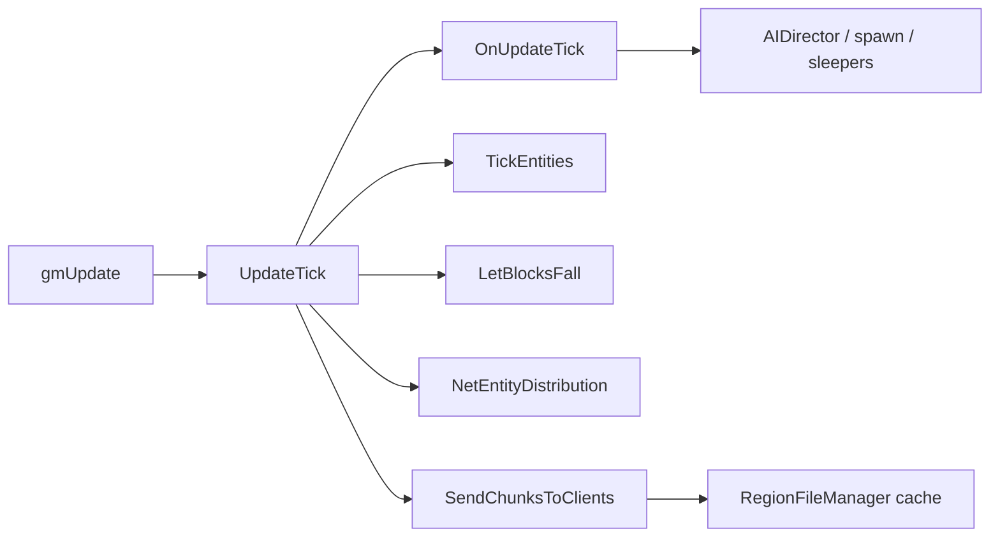
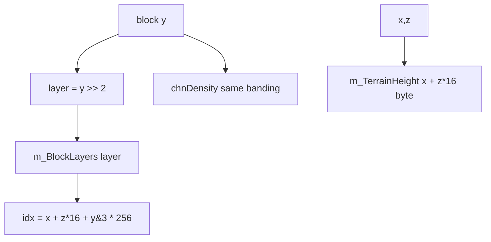
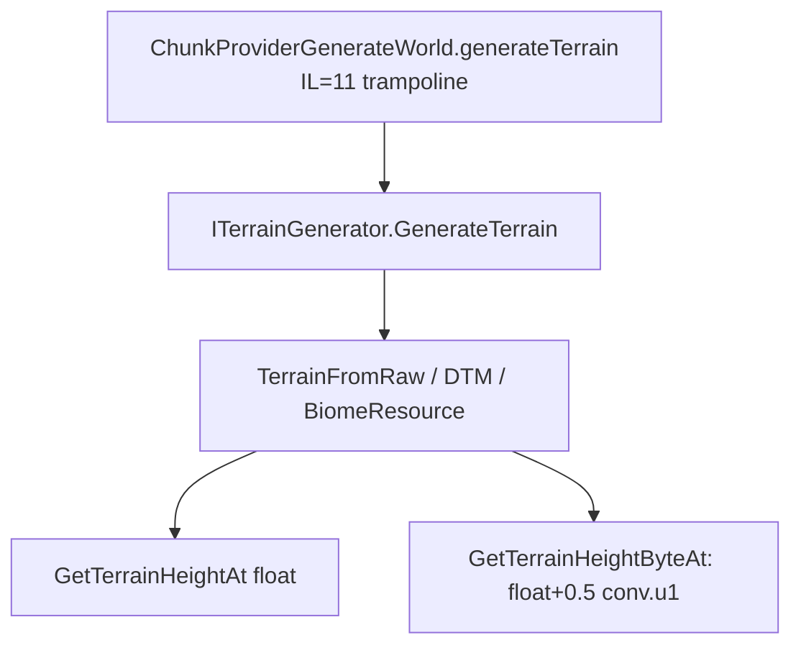
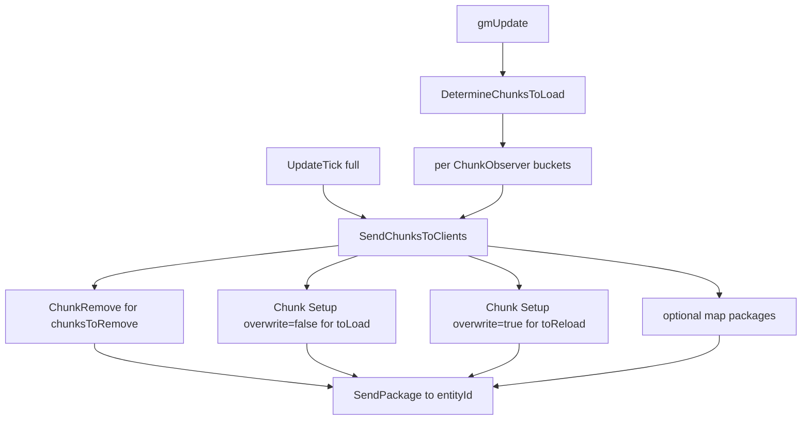
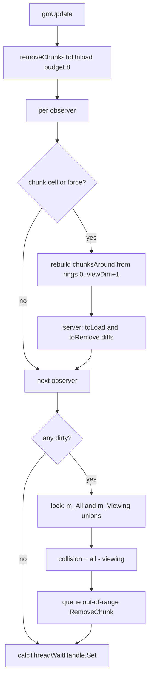
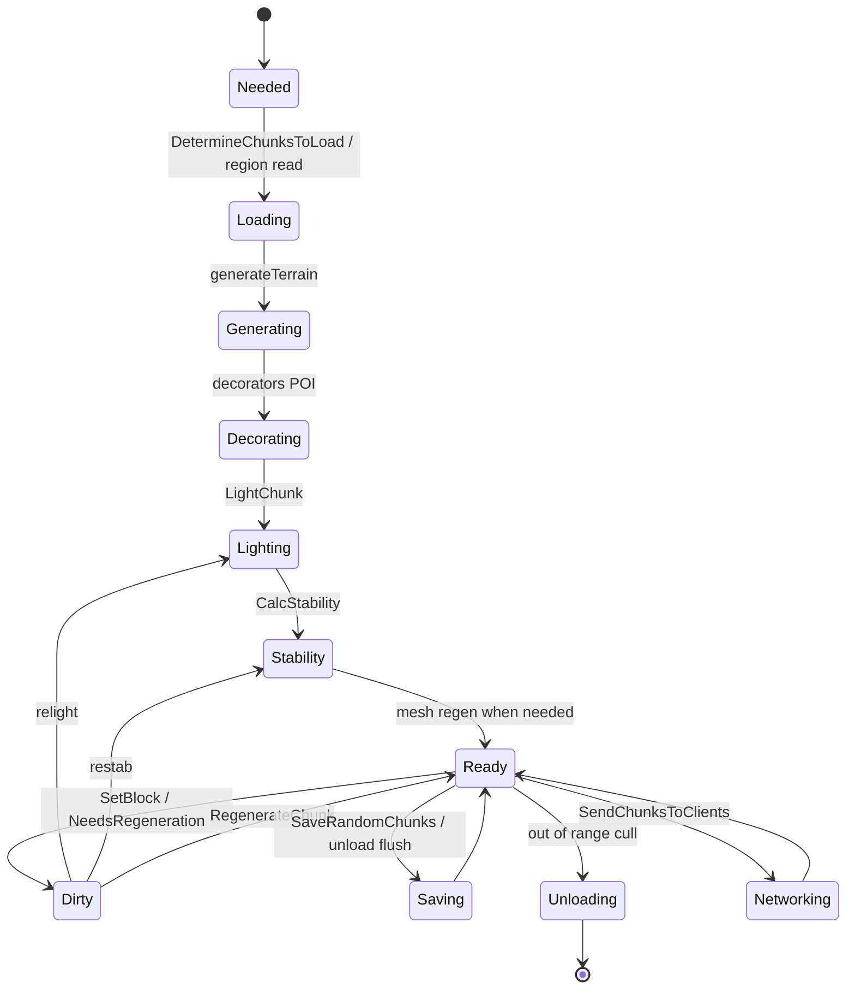
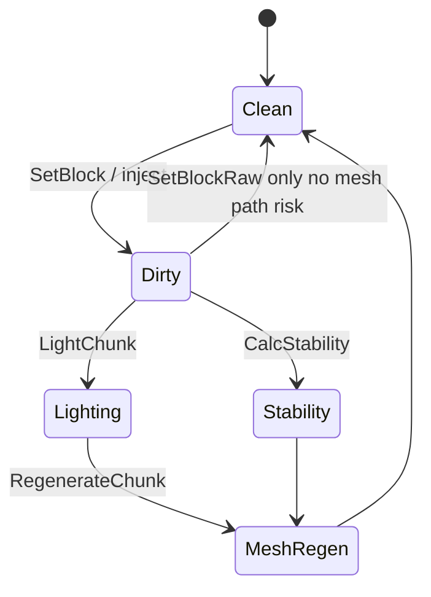

# World and chunk pipeline (dedicated V3.0.1)

**Owns:** world tick, generateTerrain trampoline, load/send (observer streaming), SetBlock path (generic engine).  
**Index math:** §2 below + [`terrain-height.md`](terrain-height.md).  
**Save path:** [`save-region.md`](save-region.md).  
**Product Streamed inject:** `7days-realworld/docs/realearth-runtime.md`.  
**Dumps:** `../il/loop-complete-v3.0.1/`, `../il/realearth-surfaces-v3.0.1/`, `../il/dedi-complete-v3.0.1/`.  
**Hub:** [`INDEX.md`](INDEX.md).

---

## 1. World tick entry

| Method | IL | Role |
|---|---:|---|
| `GameManager.gmUpdate` | **631** | Frame orchestration |
| `GameManager.UpdateTick` | **150** | Slice vs full tick |
| `World.OnUpdateTick` | **189** | Chunks, water splash, deco, block ticker, AIDirector, sleepers |
| `World.TickEntities` | **117** | Authority entity loop |
| `World.TickEntitiesSlice` | 5 / 37 | Partial entity work |
| `World.TickEntity` | **148** | Single entity authority tick |

Full tick (when timer ready): Flush → OnUpdateTick → TickEntities → LetBlocksFall → (not dedi) visibility → NetEntityDistribution → SendChunksToClients → optional SaveRandomChunks.



---

## 2. Chunk storage model

Summary (product-oriented deep write-up: ``realearth-surfaces.md``):



Live stock: `ChunkBlockYDim=256`, `ChunkBlockLayers=64`, `ChunkAreaDim=256` (XZ plane map size).

---

## 3. Generation



Interfaces are unpatchable; patch concrete generators / provider.

---

## 4. Load / unload / stream

| Surface | IL / note |
|---|---|
| `DetermineChunksToLoad` | **448** (gmUpdate; rings, diffs, cull; section 4.0.1) |
| `SendChunksToClients` | **216** (per-observer remove/load/reload/map packages) |
| `AddChunkObserver` | **15** (player join attaches stream target) |
| `ResendChunksToClients` | **55** (queue reload keys for remote observers) |
| `doCopyChunksToUnity` | 252; **skipped on dedicated** in gmUpdate |
| `SaveRandomChunks` | 99 |
| `ChunkCluster.AddChunkSync` / `UnloadChunk` / `RemoveChunk` | pipeline |
| `Chunk.OnLoad` / `OnUnload` | 97 / 188 |
| `RegionFileManager` | cache + cull + claim protect |

### 4.0 Client chunk streaming (verified)

**When:** every full `UpdateTick`, after `NetEntityDistribution.OnUpdateEntities`
(Xref: sole caller of `SendChunksToClients` is `GameManager.UpdateTick`).

**Observer model (`ChunkManager/ChunkObserver`):** created by
`AddChunkObserver(pos, bBuildVisualMeshAround, viewDim, entityIdToSendChunksTo)`
and stored in `m_ObservedEntities`. Join path sets
`entityIdToSendChunksTo = player.entityId` and `viewDim` from the clamped
client value ([protocol.md](protocol.md) section 5).

| Field | Role |
|---|---|
| `entityIdToSendChunksTo` | target client entity id; **`-1`** skips network send |
| `viewDim` | observation radius; bucket lists sized `viewDim + 2` |
| `bBuildVisualMeshAround` | local/visual observer (not a remote stream target for resend) |
| `chunksLoaded` | keys already sent |
| `chunksToLoad` | `BucketHashSetList` of keys still needed |
| `chunksToReload` | keys that must be resent with overwrite |
| `chunksToRemove` | keys to unload on the client |
| `chunksAround` | current around-set from `DetermineChunksToLoad` |
| `mapDatabase` | optional mini-map package source |

`DetermineChunksToLoad` (IL=448) is called from **`gmUpdate`** (not from
`UpdateTick`; sole Xref). It refreshes per-observer around-sets and diffs
`chunksToLoad` / `chunksToRemove`. It does **not** send packages. Full algorithm:
section 4.0.1.

**`SendChunksToClients` per observer with `entityIdToSendChunksTo != -1`:**

1. **Removes:** for each key in `chunksToRemove`, queue
   `NetPackageChunkRemove.Setup(key)`; drop from `chunksLoaded` and
   `chunksToReload`; clear `chunksToRemove`. If any, `ConnectionManager.SendPackage`
   list to that entity id (arg literal **192** on the bulk send path, same as other
   join S2C bulk).
2. **First-time loads:** walk `chunksToLoad.list`; `GetChunkSync`; **skip** while
   `Chunk.NeedsLightCalculation`; else `NetPackageChunk.Setup(chunk, bOverwrite=false)`,
   mark loaded, remove from to-load. **Stop filling when pending packages >= 3**
   (per-tick throttle for first loads).
3. **Reloads:** reverse-walk `chunksToReload`; same light gate;
   `Setup(chunk, bOverwrite=true)`; remove from reload list.
4. **Map:** if `mapDatabase` set, append
   `IMapChunkDatabase.GetMapChunkPackagesToSend()` when non-null
   (`MapChunkDatabase`: 17x17 window around client map middle after a
   position update; channel-1 compressed `NetPackageMapChunks`,
   [protocol-packages.md](protocol-packages.md) section 3.3).
5. Send any remaining packages to the same entity id (again bulk flags **192**).



**`NetPackageChunk` (channel 1, compressed):** `Setup` runs `Chunk.write` into a
pooled stream; `write` emits `bOverwriteExisting`, optional i16 x/y/z when
overwrite, i32 dataLen, blob. Client `ProcessPackage` either adds a new chunk or
unload/reset/re-read/re-add when overwriting. Codec shared with region save
([save-region.md](save-region.md), [protocol-packages.md](protocol-packages.md) section 3.1).

**`ResendChunksToClients(HashSetLong)`:** for each observer that is **not** a local
player visual mesh builder, append the given keys to `chunksToReload` so the next
`SendChunksToClients` re-pushes with overwrite (terrain rebuild paths call
`NetPackageChunk.Setup` directly as well).

### 4.0.1 `DetermineChunksToLoad` algorithm (verified)

**Caller:** `GameManager.gmUpdate` only (IL offset in inventory). Runs every
frame, before the full-tick path that may later call `SendChunksToClients`.

**Phase 0 - drain unloads (budget 8):**
`removeChunksToUnload(8)` walks `chunksToUnload` reverse under lock. For each
chunk: `EnterWriteLock`, set `InProgressUnloading`, skip if
`IsLockedExceptUnloading`, else remove from list, optional
`FreeChunkGameObject` when `IsDisplayed`, then `ChunkCluster.UnloadChunk`. Stops
after 8 successful free/unloads. Return count feeds phase-end CGO reclaim.

**Phase 1 - per observer, only when needed:**

Trigger if `isInternalForceUpdate` **or** `isChunkClusterChanged` **or** this
observer's chunk cell changed:

```text
cx = World.toChunkXZ(Fastfloor(position.x))   // >> 4
cz = World.toChunkXZ(Fastfloor(position.z))
curChunkPos = (cx, 0, cz)
```

When the cell (or force flags) changed:

1. **Rebuild `chunksAround`:** clear; for ring index `r = 0 .. viewDim+1`
   (exclusive upper bound `viewDim + 2`), for each offset in
   `rectanglesAroundPlayers[r]`, add key
   `MakeChunkKey(cx + ox, cz + oy)` into bucket `r`.
2. `RecalcHashSetList()` on `chunksAround` (flatten buckets to ordered `list`).
3. **Server only:**
   - `chunksToLoad` = per-bucket copy of `chunksAround` minus `chunksLoaded`
     (`ExceptWithHashSetLong` per bucket), then recalc.
   - `chunksToRemove` = `chunksLoaded` minus anything still in `chunksAround`
     (`UnionWith` loaded, then `ExceptTarget` around buckets).
   - Stamp `chunkGenerationTimestamps[key] = UtcNow` for every key now in
     `chunksToLoad.list`.

`rectanglesAroundPlayers` is built once in `ChunkManager.Init` (IL=104): array
length **15** (rings 0..14). Ring `r` holds the **hollow square** border offsets
where `max(|x|,|y|) == r` (both loops run `[-r..r]`; an offset is kept only if
it lies on the perimeter). That caps max useful `viewDim` near 13 for full ring
coverage (`viewDim+2 <= 15`). Manager-level
`m_ViewingChunkPositions` / `m_AllChunkPositions` / `m_CollisionChunkPositions`
are also 15-bucket `BucketHashSetList`s (ctor).

**Phase 2 - global union when any observer dirty (`loc.1`):**

Under `lockObject`:

1. Set volatile flags
   `isViewingOrCollisionPositionsChanged_threadCalc` and
   `_threadReg` so worker threads re-read positions.
2. Clear `m_AllChunkPositions` and `m_ViewingChunkPositions`.
3. For each bucket index and each observer with `viewDim+2` covering that
   bucket: union that observer's `chunksAround` bucket into `m_AllChunkPositions`;
   if `bBuildVisualMeshAround`, also union into `m_ViewingChunkPositions`.
4. Recalc both manager lists. Copy `m_AllChunkPositions.list` into
   `activeChunkSetArr`.
5. **Server:** rebuild `m_CollisionChunkPositions` =
   `m_All - m_Viewing` (per-bucket union then except), recalc.
6. **Server, non-fixed-size cluster:** under `chunksToUnload` lock, for every
   live cache key not in `m_AllChunkPositions` and not in DynamicMesh process/load
   queues: mark `InProgressUnloading`, queue into `chunksToUnload`, then
   `ChunkCluster.RemoveChunk` for each queued chunk.
7. If unload budget remaining (`8 - drained`),
   `recalcFreeChunkGameObjects(remaining, false)`.

**Always at end:** clear force/cluster flags; `calcThreadWaitHandle.Set()` to
wake `ChunkCalc` / related workers.



**`BucketHashSetList`:** distance-ringed `HashSetLong` buckets plus a flattened
`list` rebuilt by `RecalcHashSetList` (bucket order 0..n, dedupe via
`elementsInList`). `SendChunksToClients` walks that flat `list` for first loads,
so nearer rings tend to stream first when buckets were filled ring-first.

### 4.1 Chunk progress flags (stock `InProgress*` volatiles)


Measured fields on `Chunk`: `InProgressCopying`, `Decorating`, `Lighting`, `Regeneration`, `Unloading`, `Saving`, `Networking`. Conceptual lifecycle (flags can overlap; not a single exclusive enum):



---

## 5. Mutation / dirty

| Method | IL | Role |
|---|---:|---|
| `ChunkCluster.SetBlock(Vector3i,…)` | **828** | Full set path |
| `ChunkCluster.SetBlockRaw` | 25 | Silent |
| `chunkPosNeedsRegeneration` | **550** | Dirty mesh/light |
| `LightChunk` / `CalcStability` / `RegenerateChunk` | cluster | Fallout |

Prefer SetBlock over SetBlockRaw when mesh must update (product inject lesson).



---

## 6. Block tickers / falling

| System | IL | Note |
|---|---:|---|
| `WorldBlockTicker` tickScheduled / tickRandom | 151 / 97 | From OnUpdateTick server path |
| `AddFallingBlock` / `LetBlocksFall` | 38 / 220 | Collapse storms |
| `EntityFallingBlock` OnUpdateEntity | 300+ | Entity cost |

## Related docs

| Doc | Role |
|---|---|
| [protocol-packages.md](protocol-packages.md) | `NetPackageChunk` / `WorldInfo` wire |
| [protocol.md](protocol.md) | join path that attaches chunk observers |
| [network.md](network.md) | UpdateTick placement of SendChunks |
| [save-region.md](save-region.md) | Chunk write/read; blob codec shared with NetPackageChunk |
| [terrain-height.md](terrain-height.md) | YDim / height |
| `realearth-surfaces.md` | Product surfaces |

## Changelog

- **2026-07-28:** Map package producer pointer (MapChunkDatabase 17x17 window).
- **2026-07-28:** `DetermineChunksToLoad` full algorithm: 15 hollow rings, per-observer diffs, global unions, unload budget 8.
- **2026-07-28:** `SendChunksToClients` per-observer remove/load/reload/map pipeline; ChunkObserver fields; 3-package first-load throttle.

- **2026-07-19:** Related docs table.
- **2026-07-18:** Chunk/world family narrative consolidating loop + surfaces RE.
