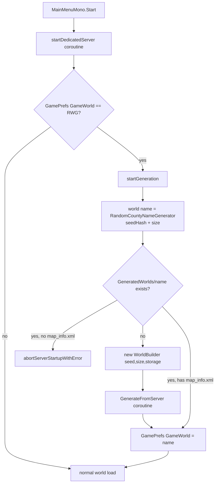
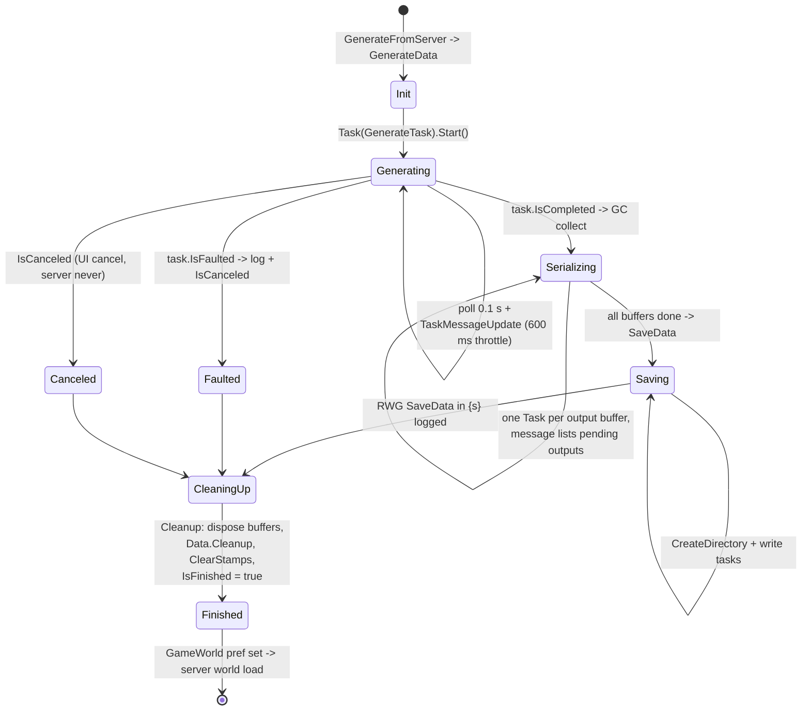
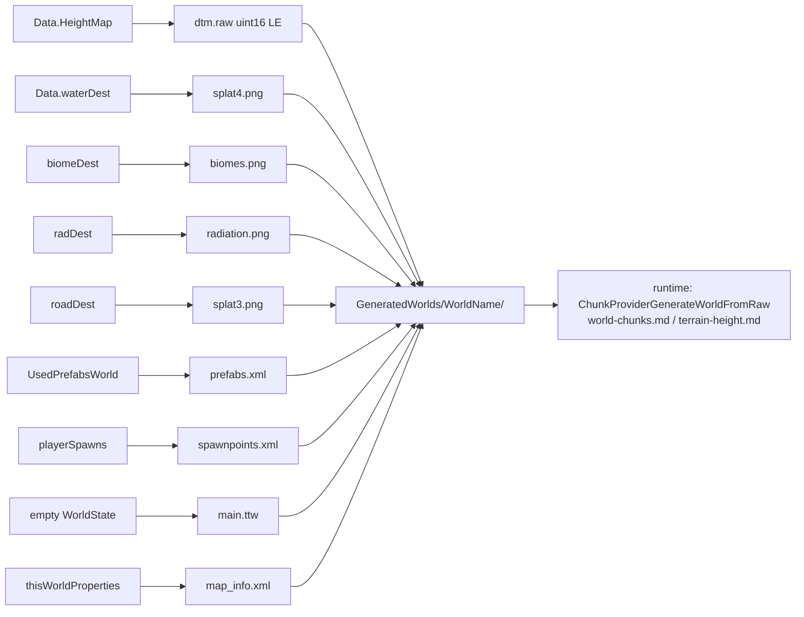

# World generation / RWG (dedicated V3.1.0)

**Owns:** the `WorldGenerationEngineFinal.*` surface: the random world generation
(RWG) pipeline a dedicated server runs at world creation. Generator driver
(`WorldBuilder`), stage order (biomes, terrain tiles, stamps, towns, wilderness,
highways, roads, water), threading, progress/lifecycle, and the on-disk world
artifacts. Plus the `PrefabVolumes.*` marker/volume model where generation uses
it, and the `SDF.*` settings format that feeds the generation parameters.
**Not:** the runtime chunk/terrain path that consumes the generated world
([`world-chunks.md`](world-chunks.md), [`terrain-height.md`](terrain-height.md));
region saves ([`save-region.md`](save-region.md)); rwgmixer/prefab XML content
semantics (data, not loop IL).
**Evidence:** `WorldGenerationEngineFinal.*` IL (64 types / 489 method bodies),
`PrefabVolumes.*` (16 / 158), `SDF.*` (12 / 49); dump locally with
`tools/src/DumpAll` (git-ignored). **Hub:** [`INDEX.md`](INDEX.md).
**Method:** [`re-methodology.md`](re-methodology.md).

This is a world-create-only codepath: it runs once when a dedicated server is
asked to host an RWG world whose folder does not exist yet, then never again for
that world. Nothing here is per-tick cost.

---

## 1. Dedicated entry: when generation runs

`MainMenuMono.Start` drives dedicated startup as a coroutine chain:
`startDedicatedServer` reads `GamePrefs.GameWorld` (enum 33); when it equals
`"RWG"` it enters `startGeneration(_worldStorageType, _finishedCallback)`.
That coroutine reads `WorldGenSeed` (171) and `WorldGenSize` (172), computes the
generated world name, and resolves it against `PathAbstractions.WorldsSearchPaths`:

- **Folder absent:** construct `new WorldBuilder(seed, size, storage)` and yield
  `GenerateFromServer()` (the full pipeline below). Afterwards `GameWorld` (33)
  is set to the generated name and server startup continues into normal world
  load.
- **Folder present with `map_info.xml`:** reuse it (no generation).
- **Folder present but no `map_info.xml`:** abort startup with the
  "world likely was never successfully generated" error.

World identity is deterministic:
`WorldBuilder.GetGeneratedWorldName = RandomCountyNameGenerator.GetName(seedName.GetHashCode() + worldSize)`
and the output folder is
`GameIO.GetUserGameDataDir(storage) + "/GeneratedWorlds/<WorldName>/"`
(`GetWorldPath`, IL=7). The numeric seed used everywhere is
`Seed = WorldSeedName.GetHashCode() + WorldSize` (set in `Init`), pushed into the
`Rand` singleton (`Rand.SetSeed`); stage logs print `r={x}` from
`Rand.PeekSample()` so a run's determinism is checkable in the log.

`GenerateFromUI` / `FinishForPreview` are the client-editor variants of the same
driver (they attach a `XUiC_WorldGenerationPreview`); on the server
`PreviewWindow` is null and all progress goes to the log only.

---

## 2. The builder and its state

`WorldBuilder` (116 fields / 97 methods / 7090 IL, the namespace's largest type)
is a one-shot object holding the entire generation state:

| State | Content |
|---|---|
| Settings | `WorldSize` (default 8192), `Seed` (12345 default), `WaterHeight` = **30**, terrain mix `Plains/Hills/Mountains` = 4/4/2, feature `GenerationSelections` (`None/Few/Default/Many` = 0..3) for Canyons, Craters, Lakes, Rivers, Towns, Wilderness (all `Default`), biome weights (forest 13 / burnt 18 / desert 22 / snow 23 / wasteland 24, summing 100) |
| Sub-planners | `DistrictPlanner`, `HighwayPlanner`, `PathingUtils`, `PathShared`, `POISmoother`, `PrefabManager`, `StampManager`, `StreetTileShared`, `TownPlanner`, `TownshipShared`, `WildernessPathPlanner`, `WildernessPlanner` (all constructed in the ctor, each back-referencing the builder) |
| Bulk data | nested struct `Data`: `HeightMap` `NativeArray<float>` (WorldSize², Persistent), `waterDest` `NativeArray<float>` (WorldSize²), `PathTileGrid` `NativeArray<PathTile>` at WorldSize/10 resolution, street-tile grid width = WorldSize/**150** |
| Stamp layers | five `StampGroup`s: `lowerLayer` ("Lower Layer"), `terrainLayer` ("Top Layer"), `radiationLayer`, `biomeLayer`, `waterLayer` |
| Image buffers | `roadDest Color32[WorldSize²]`, `biomeDest Color32[BiomeSize²]` (BiomeSize = WorldSize), `radDest Color32[RadSize²]` (RadSize = WorldSize/32) |
| Results | `StreetTileMap` (grid of 150 m `StreetTile`s), `Townships`, `highwayPaths`/`wildernessPaths` (`Path` lists), `playerSpawns`, `waterRects` |

`WorldSizeDistDiv` scales distance rules by map size: <=2500 -> 4, <=3500 -> 3,
<=4500 -> 2, else 1.

Config comes from `rwgmixer.xml`: `WorldGenerationFromXml.Load` (invoked from
`WorldStaticData`) parses `<world>` entries (each with a `world_size` range) into
`WorldBuilderStatic.Properties` / `WorldSizeMapper`, `<streettile>`
(mintiles/maxtiles/maxdensity) into `PrefabManagerStatic`, and `<district>`
(prefab_name, tag, spawn_weight, required_township, avoided_neighbor_districts,
...) into `DistrictPlannerStatic.Districts`. `Init` selects the entry whose size
range covers `WorldSize` (logging an error if none matches) as
`thisWorldProperties`.

Terrain source material is **stamps**: `StampManager.LoadStamps` walks
`PathAbstractions.RwgStampsSearchPaths` and loads each `.raw`
(`Utils.LoadRawStampFileArray`) or `.exr`/texture (`TextureUtils.LoadTexture`)
into a `RawStamp` with height/alpha/water channels (names prefixed `mountains_`
or `desert_mountains_` get `SmoothAlpha`; `rwg_tile` stamps are street-tile
surface stamps). A `Stamp` is a placed instance (position, rotation, scale,
color) inside a `StampGroup`; drawing a group into a map is Burst-compiled
(`DrawStamp` / `DrawWaterStamp` / `DrawBiomeStamp`).

---

## 3. The generation pipeline (`GenerateTask`)

`GenerateTask` (IL=203) is the ordered stage driver. It runs entirely on a
worker `Task` (see §4) and checks `IsCanceled` between stages. `usePOIs` is true
when Towns or Wilderness is enabled.

```mermaid
flowchart TB
  subgraph GT[GenerateTerrain]
    BT[GenerateBiomeTiles<br/>WorldSize/256 biome grid] --> TT[GenerateTerrainTiles<br/>plains/hills/mountains grid]
    TT --> BS[GenerateBaseStamps<br/>3 tasks: border, rad stub, filler biome]
    BS --> TFT[GenerateTerrainFromTiles<br/>plains 1024, hills 512, mountains 256]
    TFT --> DBR[DrawBiomeRadStampsToMaps<br/>2 tasks: biomeDest, radDest]
  end
  DBR --> POIP{usePOIs?}
  POIP -->|yes| PL[PrefabManager.LoadPrefabs +<br/>ShufflePrefabData Seed +<br/>PathingUtils.SetupPathingGrid]
  POIP -->|no| IST
  PL --> IST[InitStreetTiles<br/>150 m StreetTile grid]
  IST --> TP{Towns?}
  TP -->|yes| TPP[TownPlanner.Plan<br/>townships, streets, districts]
  TP -->|no| GTL
  TPP --> GTL[GenerateTerrainLast<br/>lake/river/canyon/crater stamps,<br/>2 tasks: HeightMap + waterDest,<br/>ClearWaterUnderTerrain]
  GTL --> SST[POISmoother.SmoothStreetTiles]
  SST --> WQ{Wilderness?}
  WQ -->|yes| WP[WildernessPlanner.Plan +<br/>SmoothWildernessTerrain]
  WQ -->|no| HW
  WP --> HW{usePOIs?}
  HW -->|yes| HWP[CalcTownshipsHeightMask +<br/>HighwayPlanner.Plan +<br/>TownPlanner.SpawnPrefabs]
  HW -->|no| WPP
  HWP --> WPP{Wilderness?}
  WPP -->|yes| WPATH[WildernessPathPlanner.Plan<br/>trader spawns]
  WPP -->|no| SPAWN
  WPATH --> SPAWN[CreatePlayerSpawn x12<br/>from CalcPlayerSpawnTiles]
  SPAWN --> DR[DrawRoads -> roadDest]
  DR --> SRT[CalcWindernessPOIsHeightMask +<br/>SmoothRoadTerrain Burst task]
  SRT --> FW[FinalizeWater<br/>quantize to WaterHeight 30]
```

### 3.1 Biome tiles

`GenerateBiomeTiles` (IL=436) works on a WorldSize/**256** tile grid.
`CalcBiomeTileBiomeData` converts the five biome weights into tile counts, then
regions are grown with edge preference and neighbor checks
(`FindBiomeEmptyAndSet`, `HasBiomeNeighbor`, `GetBiomeFromNeighbors`) into the
`biomeMap` `DataMap`. `BorderWaterMask` (randomized from `Rand`) selects which
world edges become water border. `BiomeType`: forest=0, burntForest=1, desert=2,
snow=3, wasteland=4, waterDebug=6.

### 3.2 Terrain-type tiles and stamps

`GenerateTerrainTiles` (IL=385) assigns each tile a `TerrainType`
(plains=0/hills=1/mountains=2) using the Plains/Hills/Mountains ratio into
`terrainTypeMap`. `GenerateBaseStamps` (IL=167) then runs three parallel tasks:

- **terrainBorderTask:** draws `<biome>_land_border` / `land_border` /
  `water_border` stamps around the map edge (water edges per `BorderWaterMask`).
- **radTask:** an **empty lambda in this build** (`<GenerateBaseStamps>b__142_1`,
  IL=1). No stamps are ever added to `radiationLayer` anywhere in the namespace,
  so `radiation.png` serializes an all-clear image; edge radiation is a runtime
  out-of-world-border behaviour, not RWG data.
- **biomeTask:** draws `filler_biome` base stamps.

`GenerateTerrainFromTiles(type, tileSize)` runs for plains at **1024**, hills at
**512**, mountains at **256**: per tile it resolves `{biome}_{terrain}`
properties from rwgmixer (`GetTerrainProperties`: scale min/max, cluster
count/radius/strength, biome mask cutoff), pulls a matching `RawStamp`
(`TryGetStamp`), and appends a placed `Stamp` to `terrainLayer` plus a paired
color stamp to `biomeLayer`. Nothing touches the height map yet; stamps are
deferred draw commands. Finally `DrawBiomeRadStampsToMaps` runs two tasks that
rasterize `biomeLayer` -> `biomeDest` and `radiationLayer` -> `radDest`.

### 3.3 Street tiles, towns, districts

`InitStreetTiles` builds the `StreetTileMap` grid (width = WorldSize/**150**);
each `StreetTile` caches biome/terrain type, position height, and validity flags
(`OverlapsRadiation`, `HasSteepSlope`, `AllIsWater`, ...) via `UpdateValidity`.

`TownPlanner.Plan` (IL=817) reads township spawn counts from rwgmixer
(`getTownshipCounts`), then per township: pick a start tile (respecting
`IsTooClose` distances scaled by `WorldSizeDistDiv`), grow a street layout
(`GetStreetLayout`, `Grow`), assign tiles (`SetTownship`), let
`DistrictPlanner` fill districts per tile (`PlanTownship` ->
`GenerateDistricts`, gateway generation, avoided-neighbor rules from
`<district>` XML), wire tile exits, and `CleanupStreets`. Results accumulate in
`Townships`; the log line is `TownPlanner Plan {0} in {1}`.

### 3.4 Terrain features and stamp rasterization (`GenerateTerrainLast`)

`generateTerrainFeature(name, selection, isWater)` runs for `lake` and `river`
(water features) and `canyon` / `crater` (terrain features). `GetCount` maps the
`Few/Default/Many` selection through rwgmixer properties to a count; each
feature picks a stamp variant, a random position/rotation/scale (rivers get a
dedicated branch that lays a path of water stamps and avoids `mountain` terrain
tiles), appends to `terrainLayer` / `lowerLayer` (terrain) or `waterLayer`
(water), and records a `waterRects` entry for water features.

Then two tasks rasterize everything:

- terrainTask: `DrawStampGroup(lowerLayer)` then `DrawStampGroup(terrainLayer)`
  into `data.HeightMap`, then `AdjustHeights(min=2)` (Burst clamp so terrain
  never goes below height 2).
- waterTask: `DrawWaterStampGroup(waterLayer)` into `data.waterDest`.

After both complete, `ClearWaterUnderTerrain` iterates `waterRects` and clears
(Burst) water cells whose terrain rises above the water surface.

### 3.5 POI placement: wilderness, highways, prefabs

- `POISmoother.SmoothStreetTiles` flattens terrain under town street tiles.
- `WildernessPlanner.Plan` picks unused valid wilderness tiles per biome and
  spawns wilderness POIs (`StreetTile.spawnWildernessPrefab`, IL=623) with
  low-biased random sizing; `SmoothWildernessTerrain` then smooths their pads.
- `CalcTownshipsHeightMask` locks township terrain, `HighwayPlanner.Plan`
  connects township gateways (`ConnectClosest` / `ConnectSelf`, A* paths from
  `PathingUtils` over the WorldSize/10 `PathTileGrid`, Burst
  `FindDetailedPath`), producing `highwayPaths`; `RunTownshipDirtRoads` adds
  country roads.
- `TownPlanner.SpawnPrefabs` -> `Township.SpawnPrefabs` -> per street tile
  `StreetTile.SpawnMarkerPartsAndPrefabs` (IL=1410): picks district-appropriate
  prefabs (`PrefabManager.GetPrefabWithDistrict`, scoring + density budget) and
  recursively resolves **POI markers** (§6): `PrefabData.POIMarkers` rotated
  with the instance (`RotatePOIMarkers`), `POISpawn` markers spawn attached
  POIs, `PartSpawn` markers spawn parts with `partChanceToSpawn`, `RoadExit`
  markers feed street/exit wiring. Every placement becomes a
  `PrefabDataInstance` in `PrefabManager.UsedPrefabsWorld`.
- `WildernessPathPlanner.Plan` paths wilderness POIs to the nearest road and
  creates trader spawn points where able (`createTraderSpawnIfAble`).

`PrefabManager.LoadPrefabs` (via `PrefabManagerData`) had earlier enumerated all
`/Prefabs/` locations, skipping `navonly,devonly,testonly,biomeonly` tagged and
`/test` prefabs, and `ShufflePrefabData(Seed)` fixed a deterministic order.

### 3.6 Spawns, roads, water finalization

- Player spawns: `CreatePlayerSpawn` over `CalcPlayerSpawnTiles` until **12**
  spawns exist.
- `DrawRoads`: each `Path` rasterizes into a byte id map
  (`DrawPathToRoadIds`, catmull-rom smoothed centerlines), then
  `PathShared.ConvertIdsToColors` maps id -> pixel: country/dirt road = green
  (0,255,0), highway = red (255,0,0), water crossing = blue, i.e. the classic
  `splat3.png` channel semantics.
- `SmoothRoadTerrain`: copies the road mask into a `NativeArray` and runs the
  Burst `SmoothRoadTerrainTask` (705 IL managed fallback) on a task to bend
  terrain under roads; `CalcWindernessPOIsHeightMask` protects POI pads.
- `FinalizeWater` (Burst): per cell, if `height - 0.5` is above the water value
  the water is cleared, otherwise it is set to the global `WaterHeight` (**30**),
  producing the final flat sea-level water map.

---

## 4. Run lifecycle, progress, threading

### 4.1 Coroutine driver and worker task

`GenerateFromServer` is a Unity coroutine (runs on the main thread inside the
dedicated frame loop): it starts `totalMS`, yields `GenerateData`, yields
`SaveData(promptMode: Off)`, then `Cleanup()`.

`GenerateData` (iterator `<GenerateData>d__120`, IL=211) is the run/progress
loop:

1. yield `Init()`: `PlatformApplicationManager.SetRestartRequired()`,
   localization, `Data.Init(WorldSize)` (NativeArray allocation), buffer
   allocation, yield `StampManager.LoadStamps()`, resolve rwgmixer world entry,
   seed `Rand`, set biome colors.
2. `new Task(GenerateTask).Start()`: **the whole §3 pipeline runs on a
   thread-pool task**, not the main thread.
3. Poll loop: yield `WaitForSeconds(0.1)`, yield `TaskMessageUpdate()` (push the
   worker's `taskMessage` through `SetMessage`), and (client only) advance the
   preview when the worker bumps `previewStepOfTask`
   (`Start=0 -> Biome=1` after terrain-from-tiles, `-> Terrain=2` after
   `GenerateTerrainLast`; `Done=3`).
4. On `task.IsFaulted`: log `RWG generation task failed.` + exception, set
   `IsCanceled`, stop.
5. On success: yield `GCUtils.UnloadAndCollectCo()`, yield `SerializeData()`,
   collect again, log `RWG final in {m}:{ss}, r={x}` with the final
   `Rand.PeekSample()`.

Progress messages: `SetMessage(msg, logToConsole, ignoreCancel)` writes to the
preview window if present and `Log.Out` otherwise (dedicated = log only);
workers rate-limit via `IsMessageElapsed` (600 ms `messageMS` window). When
`IsCanceled` is set, messages display `Canceling...` and `GenerateTask` returns
at the next stage boundary check.

### 4.2 Threading model

| Level | Mechanism | What runs there |
|---|---|---|
| Main thread | Unity coroutines (`MainMenuMono`, `WorldBuilder` iterators) | Entry, `Init`/stamp loading, poll + progress, serialize/save orchestration, cleanup |
| Worker | one `System.Threading.Tasks.Task` | `GenerateTask`: the entire §3 stage pipeline |
| Nested tasks | `Task` per job, polled with `Thread.Sleep`/`IsCompleted` | `GenerateBaseStamps` (3), `DrawBiomeRadStampsToMaps` (2), `GenerateTerrainLast` (2), `SmoothRoadTerrain` (1), plus one per serializer output (9) and per file write |
| Burst | `*_BurstDirectCall.Invoke` (native when the Burst lib is present, `$BurstManaged` IL fallback otherwise) | `DrawStamp`, `DrawWaterStamp`, `SmoothAlpha`, `FindDetailedPath` / `FindClosestPathPoint` / `CalcPathBounds` / `IsPointOnPath`, `ClearWaterUnderTerrain`, `FinalizeWater`, `SmoothRoadTerrainTask`, `AdjustHeights` |

Fault propagation from nested tasks is explicit: `ThrowIfTaskFaulted(task,
name)` rethrows on the worker, which the driver converts to the Faulted state.

---

## 5. Outputs: what a generated world folder contains

The ctor registers nine named serializers (`threadedSerializers`; the
main-thread serializer list is **empty** in this build, so every output is
produced on a task). `SerializeData` renders each into a `MemoryStream` buffer
in parallel and logs `RWG SerializeData {size} in {s}`; `SaveData` creates the
world folder (`SdDirectory.CreateDirectory`) and writes each buffer to its file
(prompt UI is skipped on the server: `SaveDataPromptMode.Off`).

| File | Writer | Format (from IL) |
|---|---|---|
| `dtm.raw` | `serializeRawHeightmap` -> `HeightMapUtils.SaveHeightMapRAW(stream, HeightMap, -1)` | per cell `clamp((h - 1) * 257, 0, 65535)` as **uint16 little-endian** (low byte first); 257 = 65535/255, so block heights span the full 16-bit range |
| `biomes.png` | lambda -> `ImageConversion.EncodeArrayToPNG(biomeDest, RGBA8, BiomeSize²)` | biome colors: forest (0,64,0), burntForest (186,0,255), desert (255,228,119), snow (255,255,255), wasteland (255,168,0), water (0,0,100) |
| `radiation.png` | lambda over `radDest` (WorldSize/32 square) | all-clear in this build (§3.2) |
| `splat3.png` | lambda over `roadDest` | red = highway/asphalt, green = country/gravel, blue = water crossing |
| `splat4.png` | `SerializeWater` | water map rendered from `waterDest` to RGBA8 PNG (`Create water in {t}` log) |
| `prefabs.xml` | `serializePrefabs` -> `PrefabManager.SavePrefabData` | every placed `PrefabDataInstance` (name, position, rotation, id) |
| `spawnpoints.xml` | `serializePlayerSpawns` | `<spawnpoint position="x,y,z" rotation="0,r,0"/>` x12 |
| `main.ttw` | `serializeRWGTTW` | a fresh `WorldState` from an empty `World` (`SetFrom(world, EnumChunkProviderId=4)` + `ResetDynamicData`), saved via `WorldState.Save`; layout owned by [`save-region.md`](save-region.md) |
| `map_info.xml` | `serializeDynamicProperties` | `SchemaVersion`, `Scale=1`, `HeightMapSize`, `Modes`, `FixedWaterLevel=false`, `RandomGeneratedWorld=true`, `GameVersion`, `Seed`, plus a `Generation` block (Seed, Towns, Wilderness, Lakes, Rivers, **Cracks** (= Canyons), Craters, Plains, Hills, Mountains, biome weights) |

**Runtime handoff.** Generation ends at these files. When the server then loads
the world, `ChunkProviderGenerateWorldFromRaw` reads `dtm.raw` and the splat
images and the normal chunk pipeline decorates from `prefabs.xml`; that side is
owned by [`world-chunks.md`](world-chunks.md) (generateTerrain trampoline,
chunk lifecycle) and [`terrain-height.md`](terrain-height.md) (`cMaxHeight`,
byte-height APIs). `Cleanup` disposes all NativeArrays/buffers, clears prefab
and stamp caches, and sets `IsFinished`.

---

## 6. `PrefabVolumes.*`: markers and volumes

`PrefabVolumes` models the per-prefab authored volumes. Every list subclasses
`PrefabVolumeListAbs<TList,TVolume>` (owned by a `Prefab`), every volume
subclasses `PrefabVolumeAbs<T>` (start position + size box) with
`Read`/`Write(PooledBinaryReader/Writer)`, `Move`, and `RotateY` so volumes
follow prefab instance placement and rotation.

| Type | Payload | Generation relevance |
|---|---|---|
| `Marker` (`PrefabMarkerVolumeList`) | `MarkerTypes` (None=0, **POISpawn=1, RoadExit=2, PartSpawn=3**), tags, group, `partToSpawn`, `partChanceToSpawn`, rotations | **Used directly by RWG**: `StreetTile.SpawnMarkerPartsAndPrefabs` consumes `PrefabData.POIMarkers` (rotated via `RotatePOIMarkers`) to attach child POIs/parts and wire road exits |
| `PrefabSleeperVolume` | group, spawn count min/max, priority, quest-exclude, trigger indices | runtime spawn data; RWG only carries it with the prefab |
| `PrefabTriggerVolume` | trigger indices | runtime |
| `PrefabInfoVolume`, `PrefabTeleportVolume`, `PrefabWallVolume` | box only / minimal | runtime |

Only markers participate in generation decisions; the other volumes are inert
payload until chunk decoration instantiates the prefab at runtime
(`world-chunks.md` chunk lifecycle) or the server syncs them
(`SendAllVolumesToClient`).

---

## 7. `SDF.*`: the settings file format

`SDF` is a small tagged binary key-value format (`SdfFile` -> `SdfData` ->
typed `SdfTag`s via `SdfReader`/`SdfWriter`). Tag types: End=0, Int=1, String=2,
Bool=3, ByteArray=4, Compound=5, Float=6, Binary=7 (Unknown=-1).

Its relevance to world generation is indirect but real: `GamePrefs.Load/Save`
persist per-save settings through `SdfFile` as `gameOptions.sdf` /
`newGameOptions.sdf` (string literals in the assembly; `sdcs_profiles.sdf` is
the character-profile store). `WorldGenSeed` and `WorldGenSize`, the two prefs
that parameterize §1, live in exactly these files between runs. The format
itself carries no world data; the generated world is entirely the §5 artifacts.

---

## 8. Dedicated relevance and residuals

- **Runs on dedicated once per missing RWG world**, inside server startup,
  before any client can connect. Zero per-tick cost afterwards; the namespace
  is dead weight at runtime.
- **Determinism:** same seed name + size -> same world name, same `Seed`, same
  `Rand` stream (stage logs expose `r={x}` checkpoints).
- **Residuals (not in managed IL):** Burst-compiled native bodies (the
  `*_BurstDirectCall` types select a native pointer; the `$BurstManaged` IL is
  the fallback and the readable ground truth), Unity `ImageConversion` PNG
  encoding and `TextureUtils`/EXR decoding internals, Unity coroutine
  scheduling.
- **Content (data, not loop IL):** `rwgmixer.xml` semantics, stamp assets under
  the RWG stamps search path, prefab XML including volumes/markers,
  localization strings used in progress messages.

---

## Prefab/decoration data leaves

Small prefab/decoration types adjacent to this doc (inventoried in
[`inventories/dedicated-leaves.md`](inventories/dedicated-leaves.md)). Notably,
none of them are RWG-time: the first three are runtime server logic, the last
three are client render/UI and out of scope here.

- **`BiomeBlockDecoration`** (base `Object`) is one parsed `biomes.xml`
  decoration/resource rule: `blockValues`, `prob`, `clusterProb`,
  `randomRotateMax`, `checkResourceOffsetY`. `WorldBiomes.parseBiome` builds it
  into `BiomeDefinition` deco lists and `BiomeLayer` resources; it is consumed
  at runtime chunk decoration, not RWG, by
  `WorldDecoratorBlocksFromBiome.decorateSingleBlockTryPlaceDeco` and
  `WorldBlockFiller.fillLevel` ([`chunk-providers.md`](chunk-providers.md)).
  `GetRandomRotation` scales a random float into a rotation byte and folds
  values 4..7 into the 24..27 extended-rotation range (rebase at 24, a net +20;
  `ldc.i4.4 / sub` then
  `ldc.i4.s 24 / add`); `BlockModelTree.OnBlockPlaced` reuses it.
- **`PrefabListData`** (nested `QuestEventManager/PrefabListData`, base
  `Object`) is runtime quest data, not RWG placement: a
  `Dictionary<int, List<PrefabInstance>>` (`TierData`) bucketing placed POIs by
  `Prefab.DifficultyTier`. `AddPOI` inserts by tier and `ShuffleDifficulty`
  shuffles one tier's list with a `GameRandom`;
  `QuestEventManager.SetupTraderPrefabList` builds one per trader area for
  quest-POI selection. Server-side.
- **`GorePrefab`** (base `RootTransformRefEntity`, a MonoBehaviour) rides on
  gore GameObjects spawned by the `Avatar*Controller.SpawnLimbGore`
  dismemberment paths; its `Start` plays the `Sound` one-shot on the owning
  entity unless `_restoreState` is set. Client render/audio effect; irrelevant
  on dedicated.
- **`PrefabGroupEntry`** (nested `XUiC_PrefabGroupList/PrefabGroupEntry`, base
  `XUiListEntry<T>`) is a prefab-browser list row (`name`, `filterString`) with
  `CompareTo` ordering and substring `MatchesSearch` for the in-game prefab
  editor UI. Client XUi, out of scope.
- **`PrefabGameObject`** (one nested in `PrefabLODManager`, a second in
  `PrefabPreviewManager`, fields only: `meshPath`, `prefabInstance`, `go`,
  `isAllShown`, `signDatas`) holds an instantiated POI imposter mesh for
  `PrefabLODManager.BuildGameObjectFromMeshInfo` / `LoadImposterSigns`. Client
  distant-POI rendering, out of scope.
- **`EventPrefabsClient`** (base `Object`) is the client-side receiver for
  server-announced game-event prefabs: constructed in `World.LoadWorld` over
  the local `PrefabCache` + `DynamicPrefabDecorator`, with `TryAdd`/`Remove`
  driven by `NetPackageEventPrefab.ProcessPackage` and
  `NetPackageWorldInitInfo.ProcessPackage`. Client-only mirror of server prefab
  state, out of scope.

---

## Prefab rotation, id mapping and YOffset placement (2026-08-06)

Status: **verified** against a full V3.1.0 b14 disassembly (2026-08-05 dump; line
numbers are from that dump; the tracked `il/` sets are the V3.1.0 corpus) plus the shipped Navezgane
world data.

### RotateY does not permute the cell array

`Prefab::RotateY` (921221-921637) rewrites each cell's `BlockValue` in place via
`BlockShape::RotateY`, rotates entities, `indexedBlockOffsets` and the volume
lists, updates `localRotation` (`(localRotation + (bLeft ? 1 : -1)) & 3`) and swaps
`size.x`/`size.z`. The **coordinate** rotation happens at access time through
`Prefab::RotateCoords` (915620) and `Prefab::offsetToCoordRotated` (915424), both
of which read the already-swapped size.

Forward local-to-rotated map, decoded from `offsetToCoordRotated`, with `sx`/`sz`
the **unrotated** prefab size:

| rotation | mapped (x', z') |
|---|---|
| 0 | `(x, z)` |
| 1 | `(sz-1-z, x)` |
| 2 | `(sx-1-x, sz-1-z)` |
| 3 | `(z, sx-1-x)` |

Equivalently the prefab is rotated by `AngleAxis(-90*r, up)`.
`Prefab::RotatePointOnY` (921639) states this outright: the `_bLeft` path uses
`Quaternion.AngleAxis(-90, up)`.

`localRotation` equals the `prefabs.xml` `rotation` attribute exactly:
`PrefabCache::GetPrefabRotated` (931080) clones and calls
`Prefab::RotateY(_bLeft = true, rotation)`, and `PrefabInstance`'s ctor stores the
same value into `lastCopiedRotation`, so `PrefabInstance::CopyIntoWorld` (944130)
does not rotate a second time.

**Cross-check against stock data.** For the 130 Navezgane decorations whose prefab
declares `POIMarkerType=RoadExit`, projecting the marker under this map puts it
within 4 blocks of a road or gravel pixel in `splat3_processed.png` for 129 of 130
(rotation 1: 24/24, rotation 3: 23/23). The mirrored hypothesis (`+90*r`) scores
only 94/130, and 6/24 and 6/23 for rotations 1 and 3.

### Per-block facing is shape-dependent

`BlockShapeNew::RotateY` (181926) replaces `_rotCount` with `4 - _rotCount` when
`_bLeft` is true before indexing `BlockShapeNew::rotations`;
`BlockShapeModelEntity::RotateY` (173648) negates `_rotCount` for the same case.
Net effect for a prefab placed at rotation r: block facings are remapped by
`CalcRotation(rot, 4-r)`, i.e. -90*r, matching the coordinate map.

`BlockShapeNew::CalcRotation` (181959) composes in **world** space: it calls
`ConvertRotationFree(rot, AngleAxis(90*rotCount, up), _bApplyRotFirst = false)`,
and `ConvertRotationFree` with that flag false applies the existing orientation
first and the delta second (176560, IL_0048 branch), i.e.
`q_new = q_delta * q_old`. Rotations 24..27 go through a separate
increment-and-wrap loop.

The base `BlockShape::RotateY` (166904) is a **different scheme entirely**:
`rotation = (rotation + rotCount) & 15`, ignoring `_bLeft`.
`BlockShapeCube::RotateY` (171283) is a band-local +/-1 cycle within each group of
four. The facing remap is virtual per BlockShape, not one global table.

`Prefab::RotateY` also clears a cell to air when the block's meta bit 0x1 is set
and the block is a `BlockModelTree` (IL_00ce-IL_00ec, ~921320).

### YOffset

`DynamicPrefabDecorator.Load` (902240-902460) applies `position.y += Prefab.yOffset`
when `y_is_groundlevel` parses true, **before** constructing the `PrefabInstance`.
`Prefab.yOffset` comes from the prefab `.xml` `YOffset` property
(`Prefab::cProp_YOffset` 914052, parsed at `ReadFromProperties` 917079).
679 of the 1487 full-POI decorations in Navezgane carry a nonzero YOffset; the
extremes are structural (canyon_mine -55, house_old_ranch_13 -44, cave_07 -33,
bunker_00 -30, ten caves at -25).

The same `Load` block at IL_0252-IL_0284 is where `TraderArea` /
`TraderAreaProtect` / `TeleportVolumeList` reach
`DynamicPrefabDecorator::AddTrader` (903590-903616).

### Block ids in a .tts are prefab-file-space, not runtime AssignIds

`Prefab::loadIdMapping` (928850-928971) hard-requires `<prefabName>.blocks.nim`: a
missing file logs `Block name to ID mapping file missing.` and fails the load. It
builds the table with
`NameIdMapping::createIdTranslationTable(name -> Block.GetBlockByName(name).blockID,
missingEntryCallback)`. The `.tts` type ids are therefore **prefab-file-space ids,
never runtime AssignIds**, and the shipped nim files have drifted from the current
install: `abandoned_house_01`'s nim maps 6979 to `concreteShapes:cube` while the
current AssignIds table has 6979 = `cobblestoneShapes:plateFacade01`, and 24179 to
`sleeperSit` while the current `sleeperSit` is 24812. Measured over a random
120-POI Navezgane sample, 203350 of 952260 cells (21.4%) resolve to a different
block without the remap.

### TileEntityType, sleeper markers and baked pads

Stock `TileEntityType` (1311761-1311788): `None=0, Collector=3, LandClaim=4,
Loot=5, Trader=6, VendingMachine=7, Forge=8, Campfire=9, SecureLoot=0x0A,
SecureDoor=0x0B, Workstation=0x0C, Sign=0x0D, GoreBlock=0x0E, Powered=0x0F,
PowerSource=0x10, PowerRangeTrap=0x11, Light=0x12, Trigger=0x13, Sleeper=0x14,
PowerMeleeTrap=0x15, SecureLootSigned=0x16, Composite=0x19, Taskboard=0x1B`. The
`.tts` tile-entity list uses these same values: real V3.1.0 prefabs contain only
types 18 (Light), 20 (Sleeper) and 25 (Composite).

`Block::IsSleeperBlock` is set true by `BlockSleeper::.ctor` (133430-133460), i.e.
exactly the blocks whose resolved Class is `Sleeper`. Resolving `Extends` in stock
`blocks.xml` gives 34 such blocks, 16 of them named `infestedSleeper*` rather than
`sleeper*`, so a name-prefix test on "sleeper" misses a third of them. Scanning the
shipped `.blocks.nim` files: 886 of 1105 POIs contain `sleeper*` markers and 338
contain `infestedSleeper*`.

`Prefab::AddAllChildBlocks` (918950-919033) is called at the end of `RotateY`
(IL_0387-IL_0394, ~921630) and after load, so multi-block child cells (raw bit
0x40000000) are regenerated rather than being carried in the file.

**Navezgane's baked terrain already contains POI pads.** `dtm_processed.raw` at the
footprint centre equals `deco.y - 1` for 1272 of 1487 full-POI decorations, and
1101 of 1487 footprints are already perfectly flat. Row convention for the `.raw`
files is `index = (z + H) * W + (x + H)` with **no flip** (validated at 96% within
1 block; the flipped read gives 16%), while the PNG masks use the opposite row
order (row 0 = +Z).

---

## Related docs

| Doc | Role |
|---|---|
| [world-chunks.md](world-chunks.md) | Runtime chunk pipeline that consumes the generated world |
| [terrain-height.md](terrain-height.md) | Height APIs / YDim; raw provider (`cMaxHeight`) reading `dtm.raw` |
| [save-region.md](save-region.md) | `WorldState` (`main.ttw`) layout, region saves |
| [full-surface.md](full-surface.md) | Where this namespace sits in the whole-assembly map |
| [re-methodology.md](re-methodology.md) | How this was reversed |
| [residuals.md](residuals.md) | Native/external residuals |

## Changelog

- **2026-08-06:** Prefab rotation is -90*r and lives in offsetToCoordRotated, not
  in the cell array (RotateY rewrites BlockValues and swaps size only); the
  forward coordinate map per rotation, cross-checked against RoadExit markers vs
  the road splat; shape-dependent facing remap (BlockShapeNew vs BlockShape vs
  BlockShapeCube) and CalcRotation's world-space compose; DynamicPrefabDecorator
  applies YOffset before constructing the PrefabInstance; loadIdMapping proves
  .tts ids are prefab-file-space with measured drift; TileEntityType values and
  the three types real prefabs actually contain; IsSleeperBlock covers
  infestedSleeper*; AddAllChildBlocks regenerates multi-block children; the baked
  dtm_processed.raw already carries POI pads at deco.y-1 and its row convention.

- **2026-07-23:** Initial `WorldGenerationEngineFinal` reversal: entry chain, stage pipeline, run lifecycle + threading, output formats, PrefabVolumes markers, SDF settings format.
- **2026-07-24:** Added prefab/decoration data leaves: `BiomeBlockDecoration`,
  `QuestEventManager/PrefabListData` (both runtime, not RWG), and the
  client-only `GorePrefab`, `PrefabGroupEntry`, `PrefabGameObject`,
  `EventPrefabsClient`.
